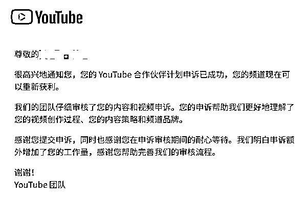

# (64 赞)美元是怎么赚到的：我用 3 个月在 YouTube Shorts 上赚到人生第一笔美元

> 原文：[`www.yuque.com/for_lazy/zhoubao/rn7hnp8x0kvgwpto`](https://www.yuque.com/for_lazy/zhoubao/rn7hnp8x0kvgwpto)

## (64 赞)美元是怎么赚到的：我用 3 个月在 YouTube Shorts 上赚到人生第一笔美元

作者： 陈子游

日期：2025-04-28

4 月 23 日，我收到招行的短信提醒，在 YouTube 上赚的第一笔钱到账了，我松了口气，这回整个流程算是真正跑通了。

虽然 400 美元只是小钱，换成人民币只有 3000，但这是我人生中第一赚到美元，也是我进入生财有术以来第一次真正赚钱。

今年是我加入生财社群的第三年，之前参加过多次航海、试过各种项目，一个都没做成，这回终于能把门票钱赚回来了。

所以本文的主要内容，是我这几个月做 YouTube 的一个复盘。

而写这篇文章的目的，主要是为了提升我自己的幸运值。

因为看到亦仁说过：越分享，越幸运。虽然还没有亲身验证这句话的真实效果，但是我选择先信了再说。我这两年运气实在太一般了，必须得多想想办法。

* * *

# 起因

过去两年我一直用 Midjourney 做 AI 绘画，也做了一个小红书账号，但没有做成，变现也寥寥无几。

我老婆也和我一样在做小红书，她最近觉得纯图片流量不好，就开始试着做视频，偶尔用可灵做一些简单的 AI 视频发小红书。

但是小红书 AI 赛道太卷，她做了视频流量也不太行，不过她热情依然很高。

我看她热情这么高，想起生财里有 YouTube Shorts 超级标这个事情，就劝她试试。

于是她注册了 YouTube 账号开始尝试，发了五六个各种题材的视频上去，发现只有个位数播放量，她就怀疑这件事情做不成。

我跟她说做账号不是这么做的，你得找对标，然后模仿，边做边调整，坚持一段时间，才知道自己行不行。

她不信，**我就说，那我做一个给你看看** 。

于是因为这个莫名其妙的原因，我进入了一个我本来完全不感兴趣的赛道。

* * *

# 试错阶段

一开始我是抱着随便弄一弄的心态来做，所以前期浪费了挺长时间来试错。

当时是 1 月份，刚好 YouTube 航海已经结束，于是我就只能自己按照航海手册开始操作。

按手册的指导搭建完账号之后，我也没有仔细看完手册后面的内容，就开始瞎折腾了。

我每天在 YouTube 上瞎逛，后来发现猫猫狗狗的视频播放量好像还不错，于是就决定试试这一个类型。

恰好这段时间我经常用「即梦」，看到即梦官网上有很多别人分享的小猫小狗视频，而且带有提示词。我就照着生成了一些，然后用剪映拼接在一起，传到了 YouTube 上看效果。

连续发了好几天，播放量都是几百，当时我对播放量没有概念，我心想这个播放量总比我老婆那个账号的个位数播放量好一些，于是就继续坚持发。

坚持了一段时间，感觉不太对，**播放量一直卡在几百个，破 1 千都很难** 。

于是我又开始刷 YouTube 找对标。

后来被我刷到一些小猫小狗跳「摩托摇」的视频，有些播放量非常高，我一看这个好像有点意思，于是决定改做这个方向。

这时我就遇到一个问题，我不知道这个小猫小狗跳舞的视频是用什么 AI 软件做的。

我查了航海手册，里面写的是用「通义千问」做的，我打开找了一下，发现并不完全匹配。

于是我就到处找人问，还是问不出来，只好用通义千问先做用别的舞曲替代，但是传上去之后播放量不太理想。

后来不知道是在小红书还是哪里突然发现了一个 App，叫做「秀脸 FacePlay」，才知道「摩托摇」原来是用这个 App 做的。

我试用了几次之后觉得没问题，就花 200 块钱买了会员，开始专门做小猫小狗的「摩托摇」跳舞视频。

传到 YouTube 上之后，**播放量明显比原来高了一些，很容易就能达到几千播放** 。

想起航海手册里提到过，只要坚持久一点，YouTube 就会给推流，我就天天都发，有时候甚至一天发四五个视频。

当时图片都是用即梦生成，然后用秀脸 FacePlay 来生成视频，所以速度快、成本低，坚持下来也不难。

那时候我以为这样坚持下去就可以等到推流，然后播放量就会大涨。

事实证明我是错的，**我坚持了快一个月，播放量一直都是几千** （后来我才知道，「摩托摇」的热度早就过去了）。

我知道这样下去不行，于是开始找新的赛道。

* * *

# 找新赛道

但是找新方向没那么简单。

我看了航海手册，也仔细看了那些对标的账号，几乎里面列出来的所有赛道，近期的流量都已经下滑了，播放量都是只有几千或几万的。

所以我有点迷茫，不知道做什么方向好，于是只能继续先发原来的内容，然后有空就刷刷 YouTube。

**有一天，我突然刷到一个账号，是做宝宝走秀的，近期数据非常好，高的播放量有百万，低的也有几十万。（当时 YouTube 还没有更新数据统计方式，所以当时的几十万，就相当于现在的上百万）**

我那时候就很诧异，宝宝走秀这个赛道不是已经过气了吗？它的数据为什么还这么好。

于是我仔细对比了一下，它这个账号和别的宝宝走秀账号的最大区别，**就在于宝宝形象更有特点，尤其是脸型和身材方面。**

我当时就想，如果我也能做出外型同样特别的宝宝图片，那么说不定我也有机会获得更高的流量。

* * *

# 走上正轨

想要做出和对标账号相似的宝宝图片，我首先想到的是垫图。

就是先把图片截下来，然后放到 Midjourney 里反推提示词，然后垫图生成。

**但是我用 Midjourney 有几年了，我认为这种办法太死板，几乎很难做出同等水平的图片，更不用说超过它了。**

我就开始想着尝试一个自己的招数。

我先试着用浏览器插件把对标账号里面数据最好的那些封面图给下载下来，再用图片高清放大软件把这些图片放大几倍，然后在 Midjourney 官网上新建一个风格画板，把这些图传上去，打包成一个风格，获得一个风格代码。

接着我就去 Midjourney 官网找到许多宝宝走秀相关的提示词，开始测试这个风格代码的效果。

输出图片之后发现效果很差，根本没法看，可能是因为这个画板的图片量太少，风格过于趋同导致的。

**于是我就想着再把我自己账号原本训练了很久的默认风格代码叠加进去看看效果，没想到出来的效果很不错。**

**由于是两种风格融合，所以宝宝的外型很有特点，但是和我对标的账号又差异非常大，这样的图片对用户来说也是很有新意的。**

接下来就是测试用户是否认可了。

一开始我是用即梦来生成视频，后来发现即梦做走秀视频的质量实在太差，于是换成可灵来做视频，效果明显有质的飞跃。

**这次我选对了，宝宝走秀的视频我只发了四五天，播放量就开始起来了。**

我的账号从此就走上正轨，这时是 2 月底。

* * *

# 开通 YPP 的波折

我从没想过自己能这么快就达到开通 YPP 的门槛。

原来发猫狗视频的时候，最高才 1 万的播放量，**没想到发宝宝走秀才一个星期就出了几个爆款，过了 10 来天总播放量就达到 1000 万了。**

等到创收后台的数据一更新，我立马点了申请开通 YPP。

**没想到第二步注册 Adsense 账号就卡了我一星期，具体原因不知道，反正 Adsense 后台就是一直显示「我们正在审核您的信息」。**

当时我在群里到处问别人，这一步要多久时间，别人都是很快，偏偏就我等了一个多星期。

好在经过漫长的一周多的等待，Adsense 账号终于开通了，进入最后一步审核。

本来我以为又是一次漫长的等待，没想到居然第二天就收到被拒绝的邮件，当时真是郁闷的不行。

**YouTube 后台说我不通过的原因是「再利用他人的内容」** ，其实我的内容可以说完全是原创的（只是参考了别人的一半风格而已），于是我开始按照生财里方波妮老师的帖子，开始录制申诉视频。

第一次录这种视频，整个过程磕磕绊绊，最终录制出来的视频很长，为了剪辑成符合 YouTube 要求的 5 分钟长度，又折腾了两三天。

最后怀着忐忑的心情传了申诉视频上去，没想到第二天就收到邮件说申诉成功了，YPP 也成功开通了。

* * *

# 赚到第一笔美元

刚开通 YPP 的那段时间可能是运气好，平均每天都有 30 多美元的收益，所以 Adsense 那边很快就寄出了 Pin 码的邮件。

这个等待过程也有点磨人，**我足足等了 3 个多星期，才收到 Pin 码邮件。**

不过我发现当 Pin 码验证成功之后，Adsense 的打款效率还是可以的，前一天发邮件说款已经打过来，第二天就收到了。

我也按照航海手册的流程，直接把这笔美元换成了人民币。

这就是我通过 YouTube Shorts 第一次赚到美元的完整经历，写成文字平平常常，但实际过程却是坎坎坷坷，能跑通还是有点不容易的。

* * *

# 收益和计划

由于我的观众都是印度这一块占大头，所以虽然有些视频播放量大，但是收益不高。

刚开通 YPP 的那段时间，每天最少有 30 多美元，最高的时候有 40 美元，但只持续了半个月。

现在随着流量的下滑，已经慢慢跌落到每天 20 几美元，最近几天甚至只有 10 几美元了。

反正最近我不管怎么努力做视频，播放量都很难有明显的起色，感觉用户已经审美疲劳了。

我目前的计划是趁着流量还没有完全枯竭，先做几个小号把 YPP 先开通，后面等到播放量完全不行的时候，再考虑转型去做别的视频。

目前有一个小号已经开通初级 YPP，还有一个正在努力中。

* * *

# 几句闲话结尾

在我过去稍显坎坷的人生经历中，我总结出了一个对我个人而言屡试不爽的定律：叫「出乎意料定律」。

**「出乎意料定律」的意思就是说，只要是我遇到一件比较难的事情，无论是找工作还是找出路（包括这次找项目），最终找到的方向一定是大大出乎我意料的。**

这次我做 YouTube
Shorts 就是如此，我在生财两年多试了好多种赚钱办法，全都没做成，最后这个我从来没想过也完全不感兴趣的 YouTube 却做成了（**跑通就算成功，不是说赚大钱** ），再次验证了我的「出乎意料定律」。

所以如果有朋友也曾经历和我一样的迷茫探索期，不要纠结和胡思乱想，多试试各种新的航海项目，说不定你能做成的那个正在意料之外等你。

最后感谢生财有术！感谢各位航海教练的帮助！

* * *

评论区：

书情小跟班 : 大佬，牛逼

Mengxiang : [强]优秀

葫芦 Mom｜金侣 Ly* : 出乎意料的定律，太喜欢这个词，学习啦

陈子游 : 客气啦，我是新手

陈子游 : 谢谢鼓励[调皮]

陈子游 : [握手] 一起进步

邓森曜 : 出乎意料定律，有意思[偷笑]

陈子游 : [调皮]