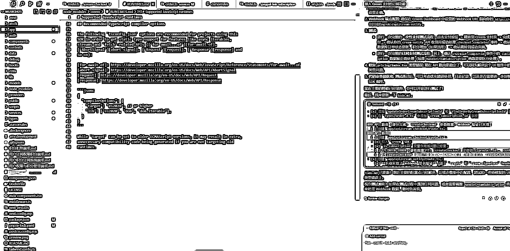
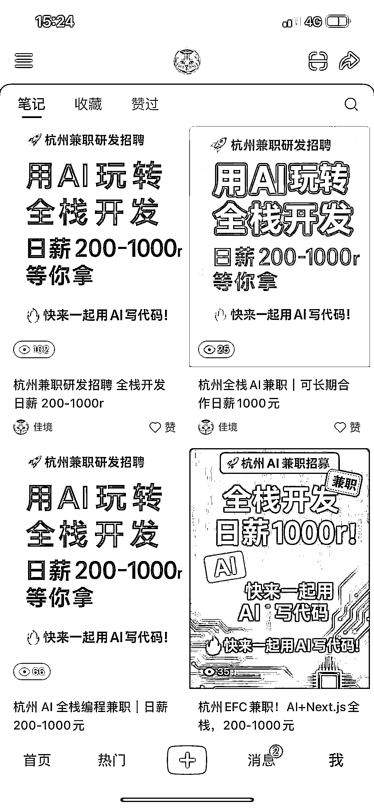
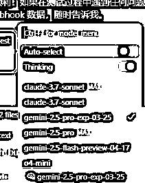
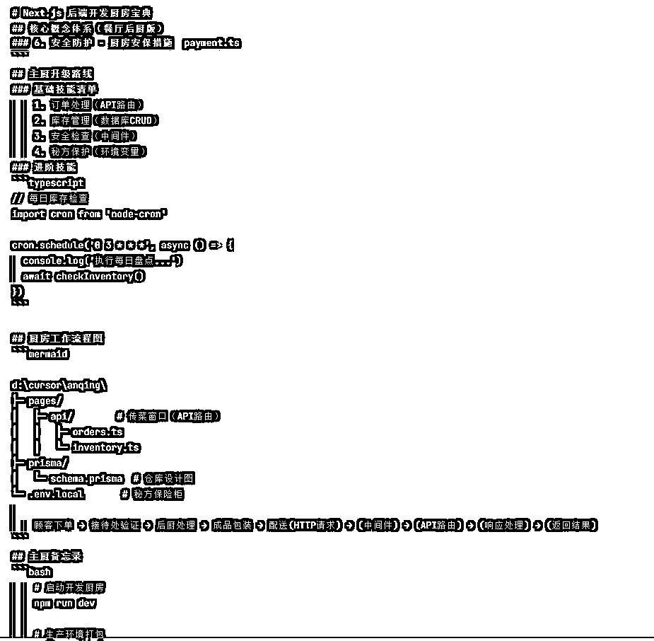
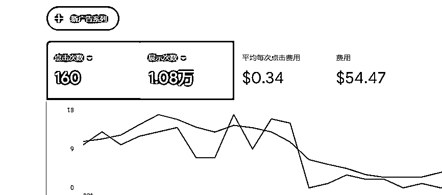
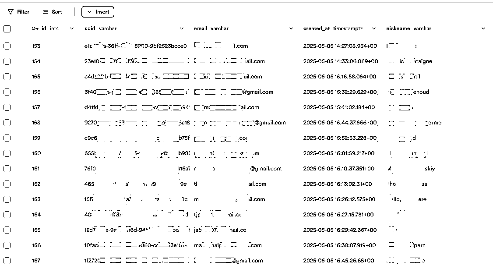
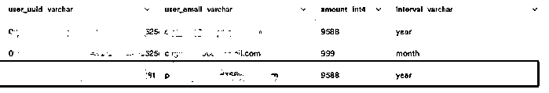
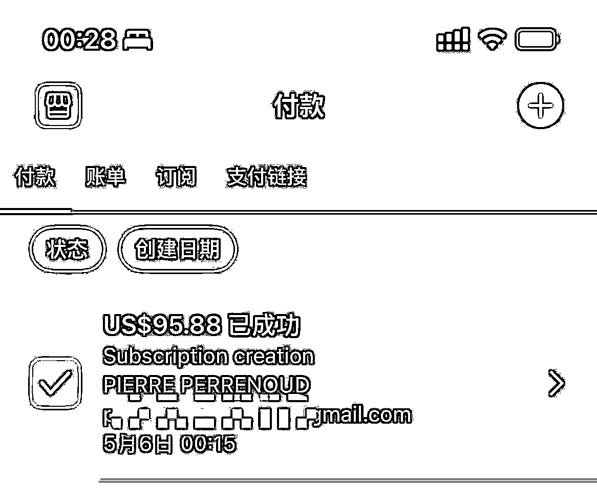
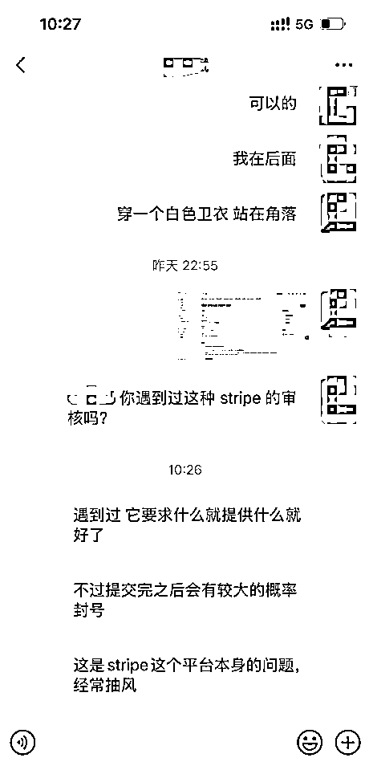

# (精华帖)(78 赞)从 0 到 1 打造出海 AI 工具站，30 天斩获首单 95$背后的实战分享！

> 原文：[`www.yuque.com/for_lazy/zhoubao/lxs0h1124xeqlixt`](https://www.yuque.com/for_lazy/zhoubao/lxs0h1124xeqlixt)

## (精华帖)(78 赞)从 0 到 1 打造出海 AI 工具站，30 天斩获首单 95$背后的实战分享！

作者： 佳境

日期：2025-05-08

最近这段时间，我全身心投入到独立开发出海 AI 工具站的项目中，这一个月经历了无数挑战与突破。今天就把这段经历详细分享给大家，希望能给正在出海、打算出海，或者还在观望的朋友们一些启发。

**  **

**项目启动：归零再出发方向转折，另辟蹊径**

我是 3 月 30 号航海家大会前后前往杭州的，在此之前先去了广州，和杉木老板进行了两个多小时的沟通。我向他讲述了从去年低到今年做的各类尝试，以及心中规划的两个产品方向。然而，老板直接指出我想做的东西市场需求较小，并推荐我做目前这个项目方向。虽然这和我原本的设想不同，但也让我重新明确了努力的方向。

**坚持独立，掌控全局**

为什么我坚持要自己独立开发呢？这源于之前做过一段时间产品经理的经历。那时和研发团队沟通困难重重，一个想法往往要费尽口舌去说服他们，需求还常常被驳回。即便有数据支持想要修改产品，沟通成本也极高。所以这次，我下定决心自己掌握编程，实现编码自由，这样就能完全按照自己的想法去验证产品的可行性，即使过程中需要不断修改，也能自己做主，不受他人制约。

**  **

**开发遇阻：在困境中摸爬滚打初尝开发，自信受挫**

起初，我对开发的难度估计不足。准备启动开发前，我发了个帖子【[AI 与 RPA 助力电商自动化：从数据挖掘到需求洞察的高效解决方案](https://articles.zsxq.com/id_ho017pp7vszq.html)】，自信满满地宣称要在七天读懂 Nextjs，还觉得以自己的学习能力，7 天上手，然后完全自由可控的进行 AI 编程。很快我便着对接 API 接口，用一周就完成了基础功能。但在对接用户登录功能时，问题接踵而至。之前我只开发过简单的输入输出功能，像轮询、回调、存储取地址这些对我来说复杂的技术点，完全没有接触过，这直接导致项目陷入困境。

**  **

**代码困境，无奈之举**

当时我使用 Claude
3.7 开发，它生成代码确实便捷，说两句话代码就能出来，乍一看能用，但真要修改时，却发现代码逻辑混乱不堪，根本看不懂。代码结构如同乱麻，想要找某个部分都极为困难。无奈之下，我只能向圈友求助，甚至去闲鱼上买了开发脚手架。在创业起步阶段，很多出海人都会用低成本试错的方式，像使用 Semrush、Similarweb 等工具，还有不少国内的逆向 API 接口，也都是“拿来主义”的情况，不要有太多心理负担。不过等发展起来后，还是要多多支持原创作者。

**模块难题，重新探索**

在开发过程中，功能模块整合也成了大问题。我想把之前的功能接入新系统，可新系统的框架模块划分过细，还缺乏详细文档，这对我这样的 AI 编程新手不友好。没办法，我只能去官网学习教程，用模块化的方式一个一个重新整合新老功能。幸运的是，之前的 UI 页面做得不错，直接复制过来修改，节省了不少时间和精力。

**  **

**探索提效：技术突破迎来转机寻求外援，计划落空**

开发到第十天，多个功能衔接出现问题，我被代码折磨得疲惫不堪，于是打算找个兼职帮忙。我在小红书和 boss 上发布了兼职信息，和二三十个人沟通后，却发现大多不尽人意。大部分是传统开发人员，他们要么只是用 AI 辅助开发，技术与我的需求不匹配；要么开发速度缓慢，工期预估过长。我心想，我自己几天能完成的功能，他们要一个月，这显然不行，最后我还是决定依靠自己。

**偶然发现，开启新篇**

就在我焦头烂额之际，转机出现了。一天晚上刷公众号时，我看到一篇关于 Cursor 提效的技术分享的文章，里面提到用 3.7 做发散性的事，用 gemini2.5 做收敛型的事。评论区有人说 2.5 在编程上特别好用，就像与真正的研发沟通一样。当时我没太在意，后来 500 次快速请求用完，3.7 和 3.5 老出 v-
p-
n 报错，又是慢速等待，便尝试使用 2.5。刚开始感觉一般，用着用着却发现它的强大之处。写代码时，它能紧扣我的需求，让改什么就改什么，不会发散出多余内容。现在我 90%的时间都用 2.5，写 UI 界面时才用 3.7，因为 3.7 生成的 UI 界面更好看。二者搭配，开发效率大幅提升，遇到小 bug，用 2.5 两句话就能解决，很关键的一点是 2.5 每次执行完后，会给你讲解的很细致，他做了什么改动，这个对新手帮助真的非常大，现在觉得不懂代码，只要能看懂他表达的意思也可以顺利编程。

**摸索方法，掌控代码**

写代码过程中，我也摸索出了适合自己的方法。之前按照常规方法把任务拆解来做，但我发现自己更适合先规划好全局再动手。后来航海家夜话的时候大名老师分享的方法，先规划业务场景和用户场景，让 AI 理解后列出 todo
list，再按步骤写代码，写完同步更新 todo 文档。我尝试之后，效果显著。为了让 AI 写的代码更易理解，我加了规则提示词，告知它我是做电商的，写逻辑和流程时要用电商例子。

如此一来，像轮询回调、钩子函数等复杂概念，AI 都能用电商场景解释清楚，我理解起来轻松多了。等我逐渐掌握这些技术点后，就把提示词删掉了。现在，我对代码的把控能力越来越强，想要实现的功能，90%都能顺利完成。

**  **

**上线推广：市场检验初露锋芒艰难上线，紧急修复**

我原本计划一周到两周产品就能上线，可实际却被各种问题拖延，心态很着急，但是也明确的知道只有自己能解决当前面临的问题。好在经过二十多天的努力，到 4 月 26 号左右，我觉得产品基本成型，便进行部署上线。结果一上线就发现诸多 bug，体验、性能、界面都存在问题。我只能迅速投入到紧张的修复工作中，到 28、29 号，终于完成了核心功能的 bug 修复。考虑到自己定的一个月的期限已到，我决定先将非核心功能搁置，凭借完善的核心功能，产品也能与市面上大部分竞争对手竞争，于是正式上线。

**  **

**竞价推广，探索优势**

产品上线后，我开始投入谷歌竞价进行推广。由于之前有电商经验，熟悉淘宝直通车，在小南的指导下，我发现谷歌竞价和淘宝直通车操作相似，上手很快。起初，我每天投入十刀，出价 0.2 刀，主要目的是熟悉谷歌广告投放流程，验证之前直通车的方法论是否也能成立。后续开始测试流量和用户转化数据，观察用户进来后的注册、付款情况。在这个过程中，我发现做 AI 产品和电商实物都是一个逻辑，就是产品打磨好，推出去验证需求。但是有一点是实物产品不大可能具备的，虚拟产品独特优势，就是可以随时对产品功能和用户体验进行优化提升，而电商的实物产品很多时候无法直接改动，或者迭代周期很长。

放量测试，洞察需求到 5 月 3 号，我认为产品功能和用户体验已打磨得较为成熟，便将广告费提高到 15 块钱，出价 0.8 刀，准备放量测试。这次测试花费三十多块钱，引来了七八十到一百左右的访客。我赶忙分析访客数据，却发现之前花大力气补全的功能无人问津，大家使用的都是基础核心功能（可能也跟投放的词有关系）。这让我深刻认识到，做产品不能仅凭自己的想法，必须切实了解用户需求。

**  **

**首单诞生：坚持迎来希望曙光**

优化转化，借鉴经验随着推广的推进，注册用户逐渐增长到 150 多个，我发现有些用户会每天重复使用产品，这让我信心大增，意识到接下来的关键是提高转化率。此前，我在价格和功能上都未对用户进行付费引导，于是花了半天时间研究竞争对手，却发现可借鉴之处不多。无奈之下，我又去研究其他优秀产品，学习它们引导用户转化的方法。

**首单惊喜，激动不已**

学习之后，我立刻对产品进行优化，并在当天晚上 12 点多推出新版本。没想到，仅仅过了 10 多分钟，我刷后台数据库时，竟看到了第一单！年付 95 刀！当时我激动得难以自已，赶忙喊铁铁来看，铁铁比我还要兴奋。这第一单如同强心剂，让我坚信之前的努力没有白费，产品方向是正确的，出单只是时间问题。

**乘胜追击，应对挑战**

出单之后，我决定乘胜追击，第二天将价格调到 30 档继续放量推广。当晚又成功出单，然而还没等我高兴太久，第三天 stripe 账号出了风控提示。无奈之下，我只能先暂停投流，这两天正准备更换支付平台后，再继续投流。我相信只要投流能够稳定盈利，我就会加大投入，结合 SEO 和其他营销手段，进一步推广产品。

**经验总结：干货满满诚意分享成功三要素**

在做这个产品的过程中，很多朋友询问我的经验，我总结为三个“超能力”。一是“抄能力”，不是让大家照搬照抄，而是要学会借鉴竞品的优点；二是“超能力”，在借鉴的基础上，做出比竞品更出色的地方；三是“钞能力”，要有资金去快速验证前面的工作，了解用户是否愿意买单。

**  **

**产品关键要点**

做产品，选品、推广和技术至关重要。这次我选择自己开发，是因为来杭州是想短期闭关，验证整个业务闭环。虽然研发我自己已经能够完成，但这并非必要，我更注重对产品的把控，了解如何优化用户体验，让用户愿意为产品付费。

**  **

**出海创业类比**

我觉得做出海项目和玩游戏氪金有相似之处。玩游戏时，氪金玩家通常比氪肝的玩家更容易获得好结果。出海创业也存在“氪金派”和“零氪派”。“零氪派”多为研发人员，他们认为自己能独立完成所有工作，不愿花钱，其中天赋异禀者能敏锐捕捉新需求推出新产品，努力者靠勤勤恳恳发外链慢慢把项目做起来，但大部分人难以做到，所以很难取得成果。

“氪金派”又分为“小 R”和“大 R”。像我这样的新手属于“小 R”，每个产品投流预算 1-3 万，不一定全部花完。之前做电商时，我知道选好品、做好主图和产品内功，测品成本大概 3-4000 块，如果这个成本都无法测出效果，产品可能就存在问题。出海也是同样道理，开发产品不能只做简单的 demo，做新词新品可以尝试零氪路线，但在竞争激烈的赛道，就需要像游戏里的“人民币玩家”一样投入资金。花 3-4000 块投流，购买的是时间和数据，如果数据不理想，可能是选品有误。不过前期数据不好也不用着急，优化迭代后再进入下一阶段测试，如测试产品性能、用户粘性、付费意愿等。如果每个环节都优化到极致，产品仍不理想，那就果断更换产品。

“大 R”如同头部大佬，彪哥、杉木老板一样，他们有资本沉淀，愿意投入大量资金试错。即便投入一二十万、三五十万没有收获，也能及时调整选品方向，他们选择的赛道通常也较大。但无论哪种类型，思路都是一致的，即快速出品、快速验证，依据真实的用户行为数据迭代产品，同时设置好时间和金钱的止损点，一旦达不到预期，就果断切换赛道。

最后，我要衷心感谢亦仁老板提供的孵化空间，让我有良好的开发环境；感谢杉木老板为我指明产品方向；感谢小南的投流指导，让我少走许多弯路；还有铁铁，这一个月一直陪伴着我，给我编程的指导。感谢生财有术这个好的平台，可以对接优秀的人脉、资源。当然，还有很多帮助过我的人，在此就不一一列举了。希望我的这些经验能对大家有所帮助，也欢迎大家在评论区分享交流，让我们在出海的道路上共同进步！

* * *

评论区：

小宇 Mick : 感谢分享！从电商的角度去思考出海收获很大

良辰美 : 非常明确的赚钱信号，这条路跑通了，我五月份跟着抄作业！

Jason Yu : 佳境老板去杭州啦？遇到的这些问题确实太有感受了，尤其 web 站，在西安找到合适的开发人员真的好难，更难沟通，我经历过同样的事情，但我目前还是不准备自己做，看看是否可以通过合作搞定技术，把我自己的精力还是放在流量上！

阿泽 kk : 先点个赞再看

小洛 : 感谢分享，学到了很多。

书虫 : 干货

黑杰克 : 佳境老板你是通过什么方式挖掘到你这款产品的需求的，你在正式开发之前在需求的挖掘和分析上花了多长时间？

佳境 : 全凭大哥一句话