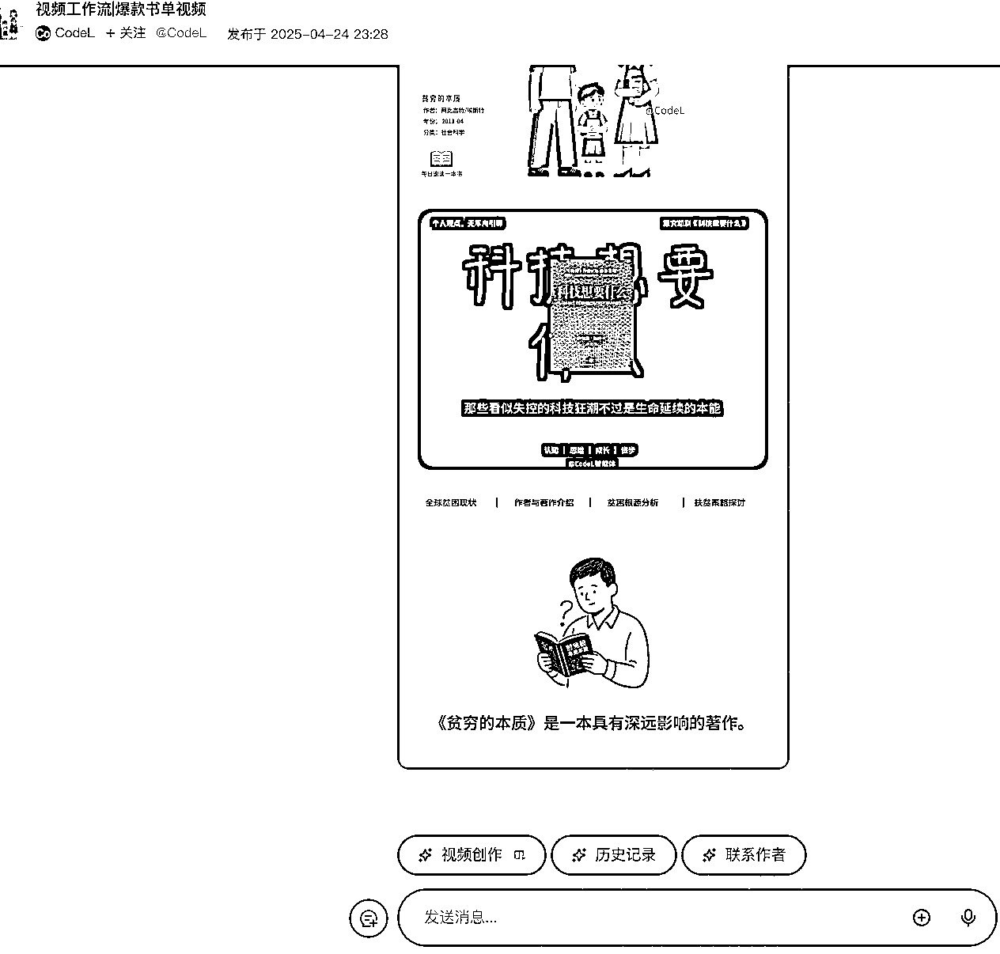

# (36 赞)Ai 实现书单号、国学文化、治愈系等自动化原创视频制作

> 原文：[`www.yuque.com/for_lazy/zhoubao/onrcfiizy2v9gco5`](https://www.yuque.com/for_lazy/zhoubao/onrcfiizy2v9gco5)

## (36 赞)Ai 实现书单号、国学文化、治愈系等自动化原创视频制作

作者： 小小米

日期：2025-05-08

用 Ai 实现当前爆款项目的**自动化** ——**自动创作文案、精准分镜、一键生成视频** 。

只要有手，就能快速产出。如**火柴人心理学知识、国学文化、养生口播、治愈系老奶奶、治愈系老爷爷、治愈系动态视频、爆款书单视频、历史故事会、英语系列** 等，如下图：

> **以书单号为例**

## 1、用 coze 智能体生成视频草稿

*   除非你是折腾狂，否则，听我的，**直接用别人已发布的** 智能体，**一搜就有，先跑起来，不合适的话，再去设计自己的智能体**

*   否则，你自己折腾半天都不一定搭起来，遇到问题还要 **求爷爷告奶奶** 的解决，还不一定能解决，我就问你：**有现成的不香吗？自己啥水平不知道吗？还赚不赚钱了？**

 images.zsxq.com/Fi7OzrgIiiViDJQMgQ4oARWyutiZ) images.zsxq.com/Fj2LlUMkJYY1T_AfeOgLRTcXmuV7) images.zsxq.com/Friorp7RWiL56OP42sSQ93eqY39A) images.zsxq.com/FhV31pm7FK4E4yGhYHHHyBqHRCdZ)

*   **选一个** 爆款书单**的智能体，能运行就行**

*   点击 【**视频创作】，** 填入**书名、作者** 等信息**，提交** 等待生成**（不同的智能体，生成的画面风格不同，多试几个，找你最满意的）**

*   **生成后会有一个 json 文件，复制链接，稍后得用**

## 2、将上一部结果转化为剪映草稿

*   找到**速推 AIGC** ，[`ts.fyshark.com/`](https://ts.fyshark.com/)

*   安装**剪映草稿工具，** 页面下滑就能找到，然后下载安装

 GDaSwKWm6pcF3BwgVpcgi) images.zsxq.com/FgefYsJB1ayeodanK0cy5ugRkcj-)

*   **安装后，将前面得到的 json 链接给导入，可以配置你电脑上剪映草稿的位置，导入后，直接打开剪映就看到成品了**

## 3、剪映导出视频

*   剪映，打开上一步 自动导入的草稿，**导出** 即是**【原创】**

## 4、啰嗦一点

**基础设施：** 里面所用的工具，该搜就去搜、该登录就去登录、智能体不能用就去找平替的智能体、该付费就付费、不想付费就多找账号去薅羊毛，别让一点点障碍成为你可能赚钱的借口，有些基础的东西不要消耗你的信任（别啥都问别人，因为你是有一个脑子的成年人）；

**原创问题：** 比如书单，别怕同一个书被人用同样的智能体做过了，你就不是原创了，你试试，每次生成的内容**都不一样（Ai 厉害着呢）** ，再说，你可以用不同的模板、换不同的背景图片、还不同的背景音；别人做心理类书籍，你可以开其他赛道的书啊；

**其他领域** ：开头说的那些治愈系、火柴人、国风等，都可以用这个方法去做；

**建议** ：非 IP 类账号/视频，**矩阵是你扩大收益的不二之选** ；

**时间比较紧，字还是太多了（** 2500 多字了） ：你没看错，【**时间多的话，我会逐句推敲，不浪费你半秒钟的时间** 】——就烦那些**保姆级** “万字长文”。

* * *

评论区：

七天@生财有术 : 图片未显示完全，可以重新上传下哈~

小小米 : 这是星球文章摘要的问题，点击文章链接，里面是全的，我也很无奈啊