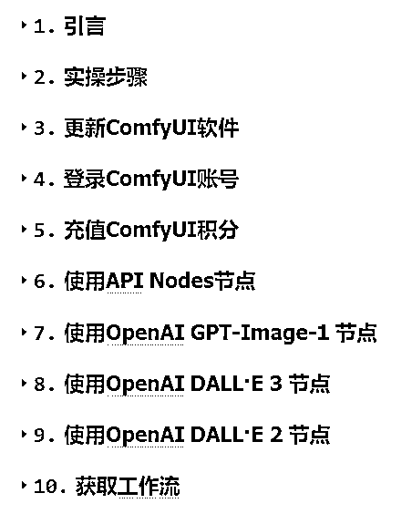

# (精华帖)(88 赞)ComfyUI 工作流使用 OpenAI 三种最新生图模型自动批量出图（保姆级教程+工作流下载）

> 原文：[`www.yuque.com/for_lazy/zhoubao/ebr86dcp30rqahei`](https://www.yuque.com/for_lazy/zhoubao/ebr86dcp30rqahei)

## (精华帖)(88 赞)ComfyUI 工作流使用 OpenAI 三种最新生图模型自动批量出图（保姆级教程+工作流下载）

作者： 来来

日期：2025-04-24

OpenAI 在今天发布了 GPT-Image-1 API（与 ChatGPT 4o 图像模型相同的模型）。**ComfyUI 现在支持通过原生的 API
节点（测试版）来使用 OpenAI 最新的图像生成模型** — 让你无需复杂的 API 密钥，直接在 ComfyUI
中访问最先进的功能。而且可以使用微信或者支付宝直接充值使用 OpenAI GPT-Image-1，OpenAI DALL·E 3，OpenAI DALL·E
2 三个不同的生成图片模型，无需 CHATGPT 账号。下面来来详细介绍 ComfyUI 工作流中使用 OpenAI 三种生图模型
批量出图保姆级教程。**为啥用 ComfyUI？核心是批量自动生成图片，并且可以结合其他 AI 视频模型，AI 音频模型，AI 数字人模型，一起制作 AI 视频。**

**一共分了 10 个章节介绍，保姆级教程+工作流下载
详解飞书文档：**[`aigcstudy.feishu.cn/wiki/LVAIwSPqBivDj1kxisLcO6pHnPe`](https://aigcstudy.feishu.cn/wiki/LVAIwSPqBivDj1kxisLcO6pHnPe)

* * *

评论区：

嘉应岛主 : 超级详细，费用都有列出来*^O*

大圣学长 : 非常感谢老师的分享！[啤酒][啤酒][啤酒]