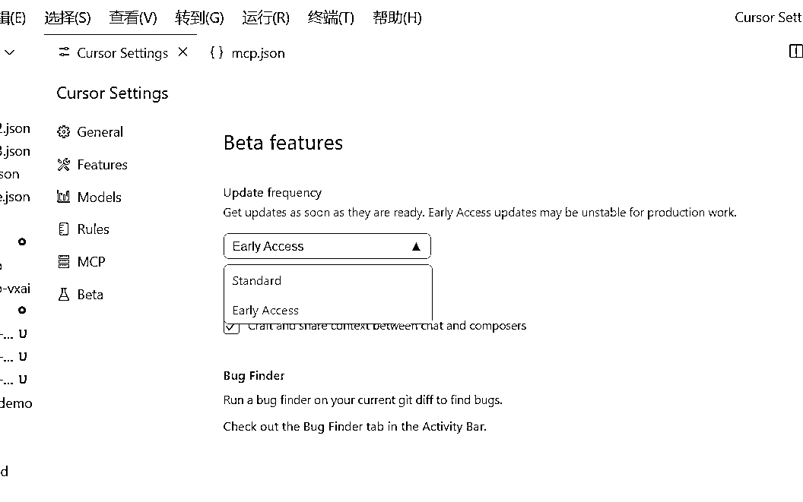
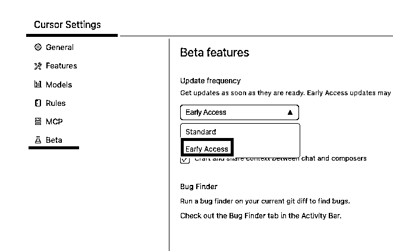
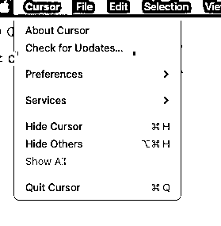
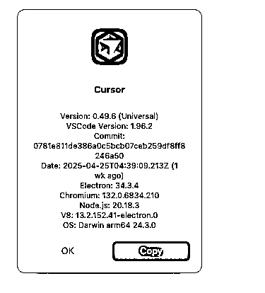
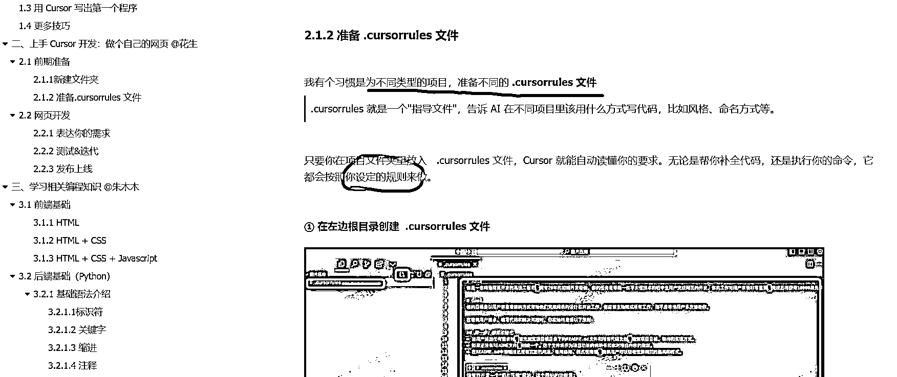
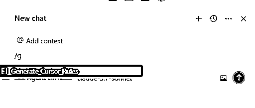
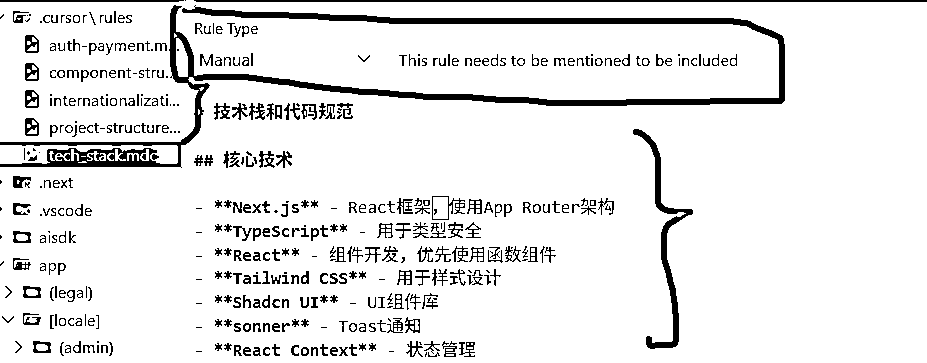
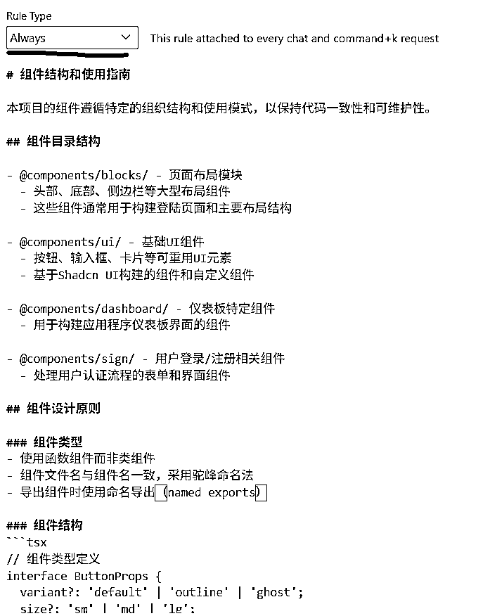
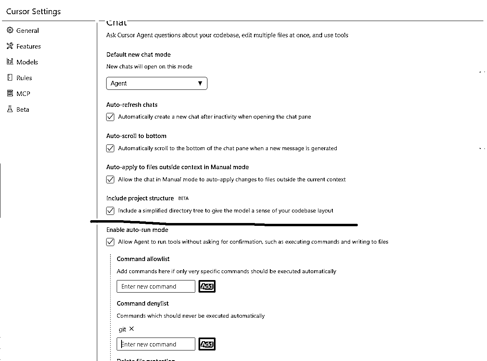
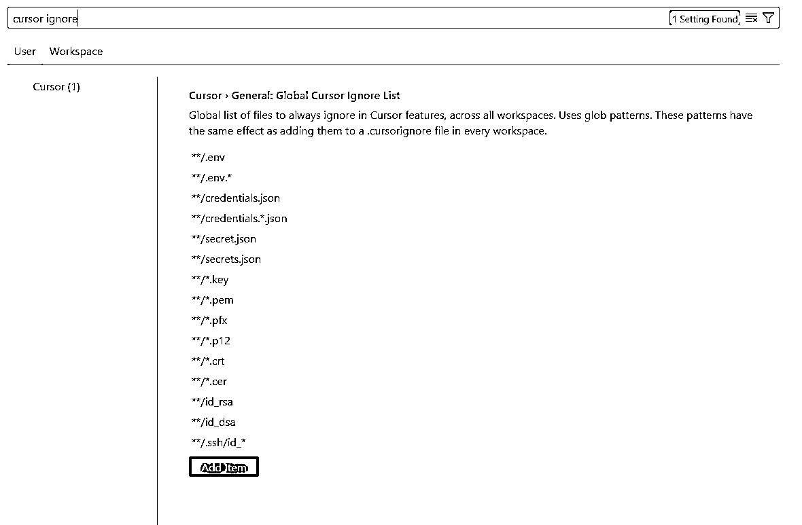

# (58 赞)最新版本 cursor 使用教程 (0.49.x)

> 原文：[`www.yuque.com/for_lazy/zhoubao/umxt6aufewnbvi02`](https://www.yuque.com/for_lazy/zhoubao/umxt6aufewnbvi02)

## (58 赞)最新版本 cursor 使用教程 (0.49.x)

作者： 彩笺

日期：2025-05-06

# 前言

本文的主题是分享当前 Cursor0.49 版本，那些非常好用的方便编程的功能，本次更新的重点，我认为主要就是一件事：让新手和资深开发者都能专注于编码本身而非繁琐配置，

说人话就是：**以前想要达成 70 分或者效果更好的 AI 编程，需要人+对编程相关有一点理解，现在，基本上，只要是个人就可以了。** 更智能，更高效、更易用。

所以我觉得值得一篇文。

**风格上** ，主要是分享这些功能，**有什么用？如何使用** 。

以前完成某件事可能用方式 A，但是有更方便的方式 B，我会尽可能的描述，这个**某件事** 是什么。

**内容可靠性上** ，两周前小排老师跟我提到了这个版本，我用了两个周，结合我印象里去年 12 月 Cursor 航海大多数朋友的使用习惯和两周的编码实践，才写了这篇文章。

## 正文

## 功能版本: 0.49.x

所有的功能特性都是在 0.49 版本更新的，也就是想用的话得升级下版本， 以下是升级方法：  tip：如果当前已经可以正常更新到 0.49，就没必要严格按照流程升级。

在设置中的**Beta** 里面,打开**Early Access** , 然后**检查更新**

windows:

macOS:  

看到版本是 0.49.x 就 ok 了

## 功能 1：一键生成规则 &可能的实践路数

说功能，不便于好理解，我先分享场景

### 场景

最早使用 Cursor 的时候，或者使用别的 AI 做一些事情的时候，我们都会先告诉他，

> 你是一名精通网页开发的高级工程师，拥有 20
> 年的前端开发经验。你的任务是帮助一位不太懂技术的初中生用户完成网页的开发。你的工作对用户来说非常重要，完成后将获得 10000 美元奖励。

这样 AI 才知道该用什么工具、什么思维来帮你更好的写代码。Cursor 以前需要我们手动告诉它这些“身份信息”，现在可以自动搞定。

当前 Cursor 航海手册就是这样写的：  

cursor 航海手册中的内容是，针对每一个我要写的代码项目，制定一个规则，

**我要开发网站，我就写你是网站开发专家 xxx，然后精通网站相关的技术栈 xxx** ，详细的可以看下手册中的，就是网站相关的 rules [`w63nbfedzw.feishu.cn/docx/SNA1dP22HoGu8yxlyYocJg5on0c`](https://w63nbfedzw.feishu.cn/docx/SNA1dP22HoGu8yxlyYocJg5on0c)

那么问题来了，如果我要开发一个别的不是网页的项目，岂不是要再**想个办法** 再写个什么 xxx rules，

**我们写 rules 的目的是** ，为了减少 AI 的幻觉，给 AI 做明确的边界限定，防止他跑偏，在很长一段时间中，我是**这么做的** ：

在 Cursor 的 设置 -Rules - User Rules 中，可以写一个**全局的规则** ，我会在里面写一些无关具体技术栈，项目形态的编程约束规则，  **例如：**

*   思维框架

*   如何测试也验证

*   一致性的递归思维

*   自然的发现思路

*   多种假设，以及避免过早坚持单一解释

*   ......

tip: 我记得当时有在每个群提到这个方式，和一些可用的 rules，手册似乎没更新？

然后，**现在超好用的功能出来了** ：

### 一键生成 Rules

**功能描述：** AI 可以自动分析项目结构，生成高效、精准的规则，无需手动编写 `.cursorrules` 文件

**我的描述：** 在对话空，输入`/` 触发提示，然后有一个功能是`/Generate Cursor Rules`，结果是在项目根目录创建一个目录+一系列文件（.cursor/rules)

这一系列文件，就是具体的规则，你在 cursor 中打开这些规则文件，最上面一行会有规则选项（**下面具体介绍** ）：

*   总是生效

*   自动匹配某些文件

*   艾特的时候再生效

*   agent 请求

**我觉得可以这么玩：**

**对于初始项目**

使用这个功能， 然后再描述你要做什么，他会为你生成多条规则，大概会包括：

*   **项目概览** 做什么，如何做，都有哪些功能点，MVP 版本都包含哪些功能，功能点之间的关系

*   **项目结构** 规划目录，每个目录是干啥的，里面放什么功能的代码

*   **技术栈和代码规范**

*   **每个大模块的编写规则**

*   ....(具体有什么看你想要什么)

放两张我的项目看看：  

**对于之前就写过的项目**

直接输入命令，让他对现有项目编写规则

**细节都藏在对话中** 找到以前的聊天记录，针对重点，让他生成 always 规则，比如他老是搞错的有啥，
最终怎么解决的，问题出在哪，直接从历史上下文中让他总结，生成约束

当然你如果有更好的实践，可以自己手动编辑这些规则文件。

#### 规则类型

每个规则都可以有自己的类型，

如果你想让某个规则应用于你每次的对话，你就选 **Always**

如果你想针对某些特定后缀的文件，应用某些规则，你就选 **Auto Attached**  举个例子：  做网站的时候，有些代码是负责“显示”的前端代码，他的作用就是网页上呈现的哪些肉眼可见的  他们的文件后缀有可能是`html css tsx astro....`

有些代码是负责做逻辑运算的，这些代码不可见，但是功能是由他们构建的，像`ts`这种后缀

这些代码做的事情不同，规则限定自然会不一样，你可以针对他们做不同的规则  **比如让页面的代码，遵守某种设计风格或者规范，让功能代码，写的尽可能的严谨**

如果你在特定场景才想用某个规则，你就选 **Manual** ，在使用的时候艾特就好

这个功能，老少皆宜！无论是新手，还是 AI coding 老鸟，都适合。

### 功能 2：将项目结构纳入上下文

方便易用，一句话描述就是：勾选以后，以后的对话 AI 都会带着一个你的项目结构，更容易的去带着一个全局的视角去处理你的请求。（勾就完了！）

以前没有这个功能的时候，想要让 AI 参考某一块功能代码，写新的代码的时候，或者想要让 AI 把代码写到具体的某个位置，总要手动的艾特，告诉他参考哪里的代码，以及写到哪个位置，现在基本不用啦

比如我直接在 Agent 模式下，想写个读写数据库的一些操作，**我直接说你找找哪里有写过的代码，参考着来**

老少皆宜，**我觉得特别适合，想开发网站的新手，买了个功能比较齐全的模板，然后在写具体功能的时候直接让 AI 参考模板中已经写过的代码！**

### 功能 3 新增“Review Changes”按钮

Agent 写完代码之后，可以在左右两侧的窗口查看代码变更，更方便的进行代码审查，避免 AI 写错、误写、不相关的上下文改动、去掉了一些注释......

实际效果就是在 Agent 写完代码之后，屏幕正中间下方会有这个按钮，在 Accept 的旁边，点击之后会左右分屏查看代码变动。

### 功能 4：MCP 支持图片了

在这之前，我一般会使用 claude3.7-sonnet 手动粘贴图片过去处理，

现在 MCP 可以把图片给到 Agent 模式了，很大提高了沟通效率，处理样式，视觉效果，方便多了

没用过 MCP 的，强烈建议尝试尝试！

### 功能 5：**Agent 终端控制增强**

这个功能偏向专业一点，

可在 Agent 启动的终端中，运行前编辑或跳过命令，“Pop-out” 重命名为“Move to
background”，操作更直观，不懂命令的可以不看这个功能。

他更适合老鸟，知道 Agent 会使用哪些命令，去创建，检索，一些对文件操作的时候，具体 Agent 执行的那一步，使用的命令是不是 ok 的

### 功能 6：全局忽略文件

开发项目的时候，一些机密文件，中间缓存等，是不需要让 AI 知道的，机密文件知道了可能会泄漏，一些中间无关缓存，在那里占用上下文，也没什么用

举个概率很小但是不为 0 的事情，你也不期望花钱买的 gpt 的 api 接口，被泄漏出去吧~

打开设置或者`ctrl+,` 点击`Add Item` ， 特别说明一下， `id_* *.cer` 中的星号，代表匹配所有，也就是 id_123
id_*sdf id_3f3e 在 id_ 后面接任何字符的文件名，都会被忽略。

以上是我过去两周实测下来，觉得最值得推荐的 Cursor v0.49 新功能。

如果你是刚上手 Cursor 的朋友，或者你还停留在之前的功能中,
强烈建议你从“一键生成规则”和“项目结构上下文”这两个功能开始玩起，绝对会让你感觉自己编程效率 x2 ！！！

* * *

评论区：

文虎 Tiger : 赞啊！

鲈鱼🐟 : 点赞后看🦵

Sunny Boy : 很棒

七天@生财有术 : 赞啊！