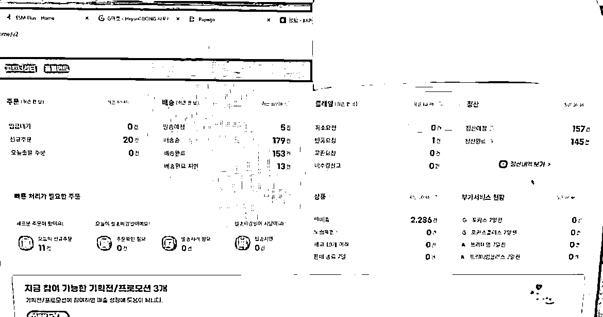

# (39 赞)Gmarket 日记：三人团队靠店群每月 5 万美金纯利（从 0 到 130 家店的全流程拆解）

> 原文：[`www.yuque.com/for_lazy/zhoubao/bfg0h6wxk1u2m7tz`](https://www.yuque.com/for_lazy/zhoubao/bfg0h6wxk1u2m7tz)

## (39 赞)Gmarket 日记：三人团队靠店群每月 5 万美金纯利（从 0 到 130 家店的全流程拆解）

作者： 大犇

日期：2025-05-09

大家好！我是不爱说话的犇同学，一直潜水学习第一次写文章，大家多多指导！

## **引言**

当 90% 的跨境电商从业者还在亚马逊、速卖通、TEMU 等红海战场中奋力拼杀，我们三人团队却在 Gmarket 这片鲜为人知的蓝海中，仅用
2 年时间就成功开设 130 多家店铺，单月利润突破 5
万美金！这个被严重低估的韩国电商巨头，目前正处于迅猛发展的红利期，既没有令人喘不过气的价格大战，也不存在流量被固化垄断的情况。今天，我们将毫无保留地分享从
0 到 1 的实战经验，助力想入局的各位圈友轻松开启跨境电商新征程。

## 

WkfnP1f)

## **

**

## **Gmarket 是跨境新人的黄金入场券**

不同于其他平台的惨烈价格厮杀，Gmarket 堪称跨境电商界的
“清流”。韩国消费者更看重设计感和品质，愿意为有特色的商品支付溢价，这意味着新手无需烧钱打价格战，只要选对产品就能站稳脚跟。更为关键的是，当前
Gmarket 平台正处于快速增长阶段，内部规则尚未完全固化发展较为缓慢，呈现出一种相对 “混乱” 的状态。这种状态看似无序，实则蕴含着无限机遇，就如同
2010
年的淘宝，当时的淘宝规则同样未臻完善，却为众多创业者开辟出广阔天地，无数赛道等待着开拓者的涉足。我们团队敏锐地捕捉到这一窗口期，深入挖掘市场需求，最终在相对冷门的家居创意 DIY 品类中成功找到突破口。在 3 个月时间内，便实现了单店月销售额突破万元的佳绩，充分印证了
Gmarket 平台对于新手卖家所蕴含的巨大潜力。

**从 0 到 130 家店的全流程拆解​**

科学上网就不多说了，自己研究研究

**1****.** **低成本入局：用最少的钱试错​**

入驻 Gmarket 门槛极低，企业营业执照、法人证件、收款账户即可开通，让我们初期只花了不到 5000 元就完成了首批 2 家店铺的搭建。平台
6%-15% 的佣金按品类收取，我们优先选择佣金较低的 3C
配件类目试水，降低试错成本，下店时间也就是 7 个工作日左右，我们要在下店的七天左右的时间内做好其余的准备工作。

**2****.** **选品三板斧：冷门赛道 + 差异化 + 高溢价​**

在 Gmarket 选品，千万不要盲目跟风 “爆款”。我们独创的 “冷门掘金法”：通过软件数据筛选搜索量年增长超 200%、上架商品数不足 100
的小众类目；比如我们发现韩国年轻人热衷的 “桌面绿植加湿器”，通过定制设计和场景化营销，单品利润率高达
65%。同时避开竞争激烈的大众品牌，选择国内优质白牌供应商，用 “微创新” 打造独家产品。

**3****.** **流量爆破：巧用平台规则免费引流​**

利用 Gmarket “新人扶持期” 规则，我们在店铺上线前 7 天集中上架 30
款商品，配合限时折扣活动，快速积累基础销量。韩国有一个比价平台叫做 never，平台也是要去这个网站上买流量的，平台假如抽走百分之十五，可能百分之五得交到比价平台，我们要好好利用下店前七天，把自己的产品打爆店铺权重拉高一点。

## **4****.** **数据驱动，精准运营：每一分投入都掷地有声**

搭建专属的 “选品数据库”，每周深度剖析商品点击率、转化率、退货率等 20 余项核心指标。经数据分析发现，韩国消费者对商品详情页的 “使用场景图”
极为敏感。我们顺势将详情页图片从 5 张增至 12 张，转化率竟奇迹般地提升了 40%。凭借这些基于数据的优化举措，我们店铺的复购率稳稳维持在 35%
以上。

## **给小白的三条建议**

警惕 “伪蓝海”：某些看似竞争小的类目，可能存在韩国本土品牌垄断，选品前一定要查看 TOP50 商品的卖家构成。​

物流是生命线：我们曾因使用廉价物流导致 15% 的差评，后来改用中韩专线，虽然成本增加 15%，但客户满意度提升至 98%。

别尝试高风险类目：母婴，医疗器械，需要很多资质的产品，建议提前了解韩国 KC 认证等规则。​

现在的
Gmarket，就像十年前的淘宝，规则宽松、流量红利充足、竞争环境友好。我们团队用亲身经历证明：只要掌握正确方法，小白也能在这片蓝海中崛起。如果厌倦了红海平台的内卷，想抓住跨境电商最后的野蛮生长红利，Gmarket
可以去试试。

​如果大家感兴趣的话，我就再发一期，更详细的教各位圈友实操等东西，拜拜！

* * *

评论区：

逸尘 : 牛

大犇 : [握手]