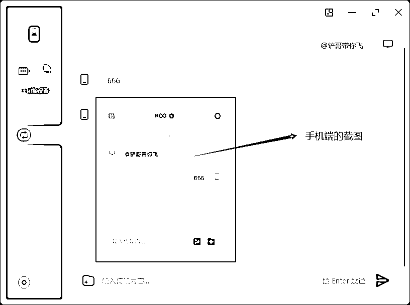
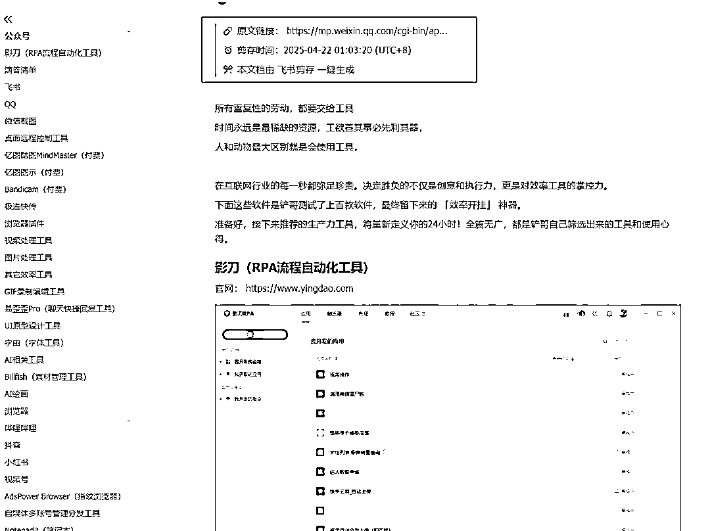
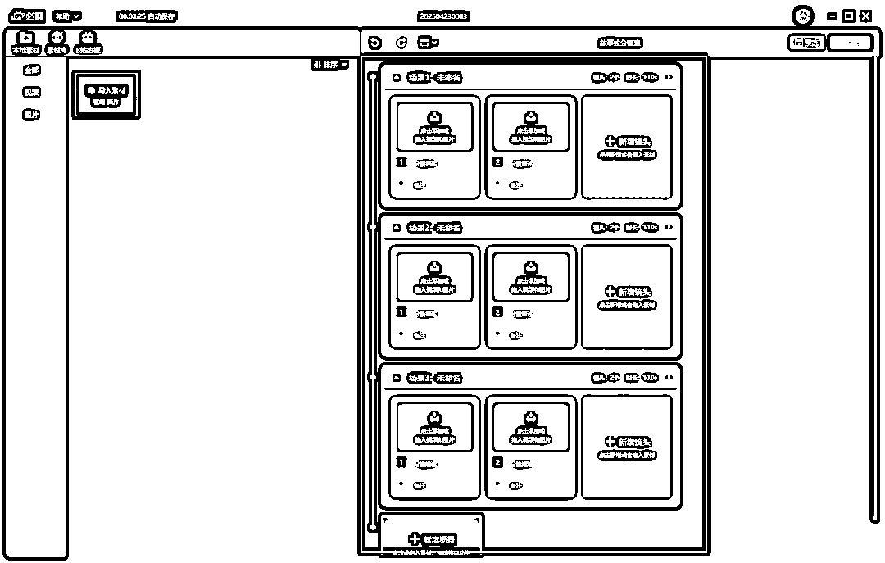
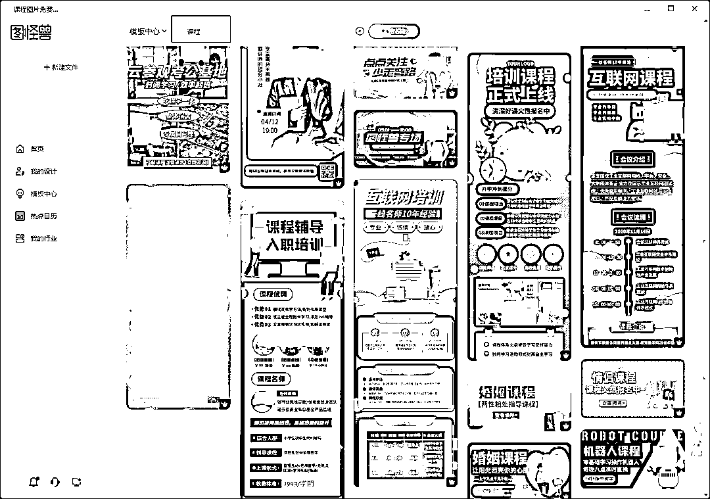
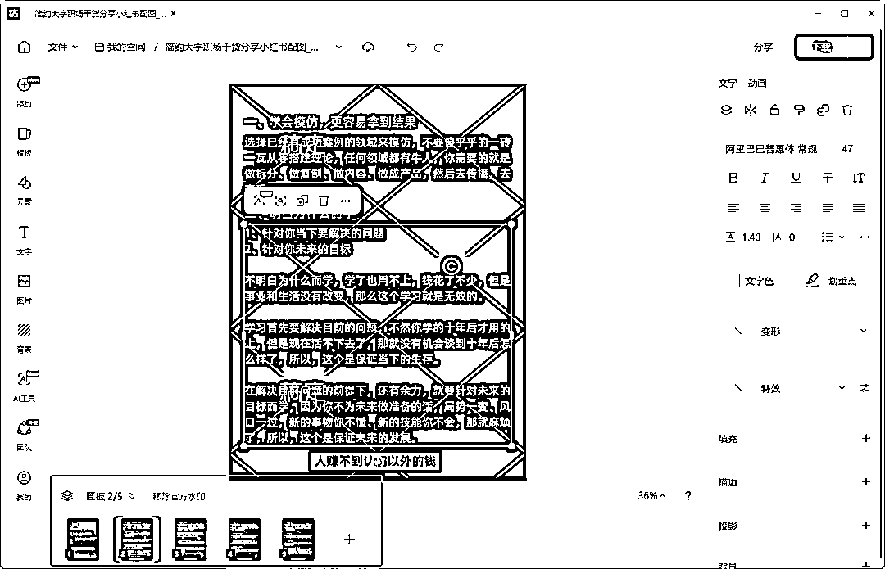
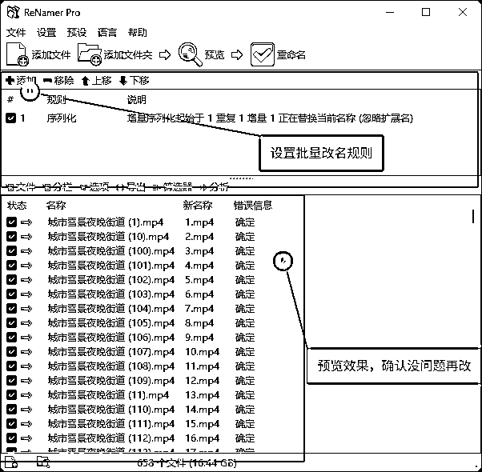
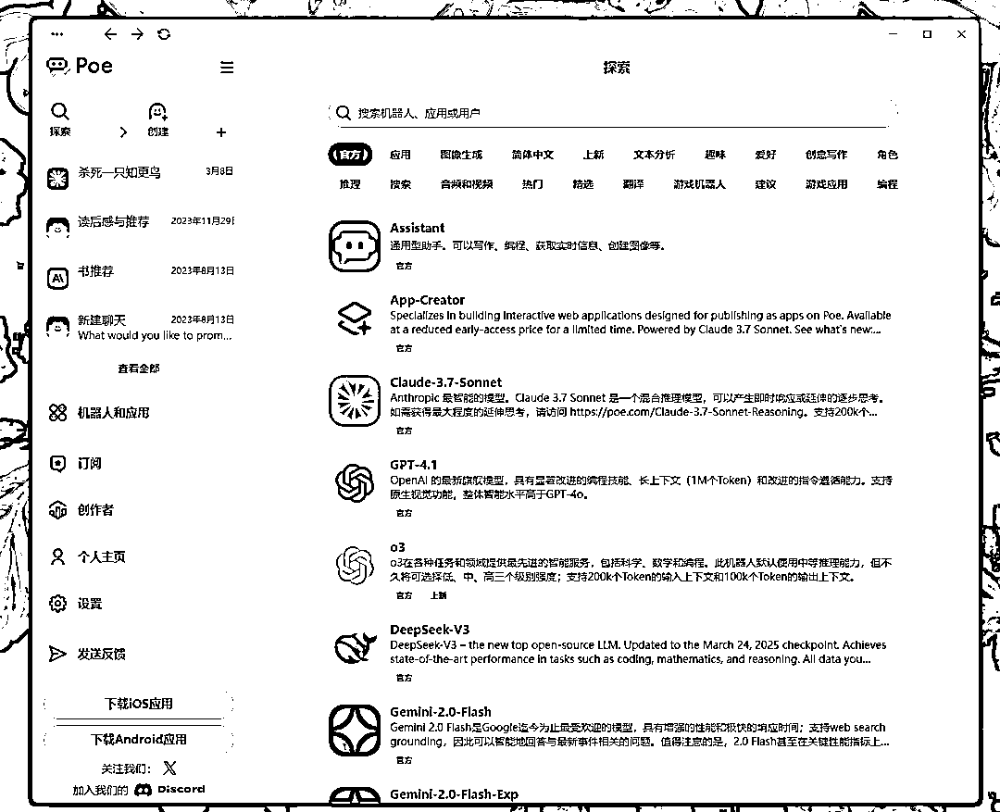
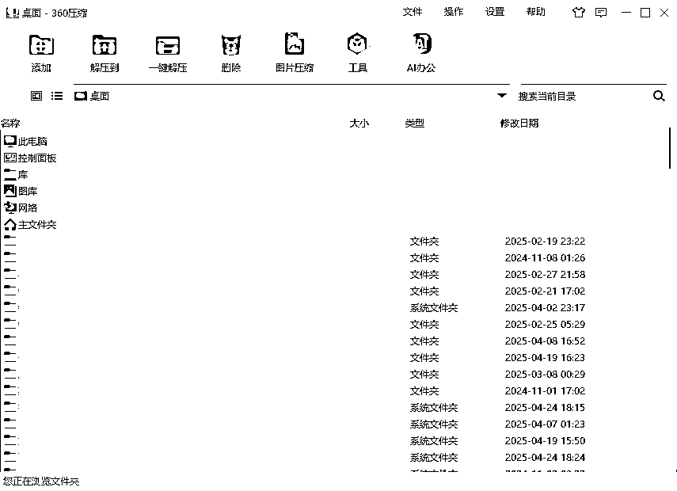

# (75 赞)70 多款软件、100 多张截图、1w 多字，一份全网最硬核的「效率开挂」神器指南！

> 原文：[`www.yuque.com/for_lazy/zhoubao/qruu0mnngbh7vgbx`](https://www.yuque.com/for_lazy/zhoubao/qruu0mnngbh7vgbx)

## (75 赞)70 多款软件、100 多张截图、1w 多字，一份全网最硬核的「效率开挂」神器指南！

作者： 铲哥带你飞

日期：2025-04-25

人和动物的最大的区别，就是会思考和使用工具。

工欲善其事，必先利其器！尤其是做互联网的，所有重复性的工作，都要交给工具。

做互联网十几年，使用了不下于上千款工具，最终筛选出了这 70 多款「效率开挂」神器，这篇文章应该是目前关于效率工具+实用工具方面，最全面的文章，全篇无广，都是我自己筛选出来的工具和使用心得。

更好的阅读效果，可以跳转飞书：[`bh5pm72xfy.feishu.cn/docx/PqQadnIcNoykXOxKjZocf7XBnzb?from=from_copylink`](https://bh5pm72xfy.feishu.cn/docx/PqQadnIcNoykXOxKjZocf7XBnzb?from=from_copylink)

* * *

**以下内容与飞书一致，可以自行根据阅读习惯选择**

* * *

时间永远是最稀缺的资源，所以废话不多说，让咱们直接开始吧！

## 影刀（RPA 流程自动化工具）

官网： [`www.yingdao.com`](https://www.yingdao.com)

办公自动化效率神器，无需编程，支持手机、电脑、网页的自动化操作，花个几天时间去学习一下官方教程，就可以实现简单的自动化脚本。

可以解决那些需要重复操作的工作，比如批量操作 AI 写文章，自动发视频，统计每天的销售数据等等，凡是有规律可循的操作，基本都能胜任。

如果不想自己研究，某鱼、某宝上也有很多接单的高手，谈好需求和价格，能节省不少功夫。

## 滴答清单

官网：[`www.dida365.com/home`](https://www.dida365.com/home)

我主要用里面的四象限表格来规划任务，默认是关闭的，需要手动在设置里面打开（以结果为导向，**列出具体可执行的清单** ，去做具体的事，把执行力拉满！）。

 images.zsxq.com/FvKjgIHblkJZKlJHw8x_ogt_W2Dq) images.zsxq.com/FpITLtLdDvtFewo-oHvg6ceV-53w)

这里简单科普一下， 四象限工作法是一种高效的时间管理工具，通过将任务按 **紧急程度** 和 **重要程度** 分为四个象限，帮助自己明确任务的优先级、合理分配精力。

1.  **第一象限（****紧急且重要****）**

2.  例如：迫在眉睫的主要任务

3.  **处理原则** ： 立即行动，尽量减少这类任务

4.  **第二象限（****重要不紧急****）**

5.  例如：长期规划、人际关系维护、 每天固定时间学习、定期复盘

6.  **处理原则** ： 重点投入时间，制定计划并坚持执行

7.  **第三象限（****不重要但紧急****）**

8.  例如：临时会议、不重要的电话、多数社交消息

9.  **处理原则** ： 快速处理或委托他人，避免被琐事消耗精力

10.  **第四象限（****不重要不紧急****）**

11.  例如：刷短视频、无意义的闲聊、消遣式娱乐

12.  **处理原则** ： 尽量删除或限制时间

## 飞书

官网：[`www.feishu.cn`](https://www.feishu.cn)

我主要用的功能只有 3 个，一个是飞书云文档，主要用来写文章和做表格。在写文章方面，飞书云文档绝对属于第一梯队。

几乎不需要任何学习成本，简单用鼠标拖拽，就可以完成各种文章和图片的排版效果，而且支持云同步和生成分享链接。

一个是飞书云文档里面的知识库，主要用来搭建个人知识库，方便整理那些散落在各处的优质内容，记录一些想法和灵感。

对于互联网从业者来说，搭建个人知识库是非常有必要的，可以把碎片化的知识，转化为更为系统的 sop 流程，方便快速查找和复用。

除了搭建个人知识库，还要搭建内容生产知识库，通过 AI 收集并整理来自抖音、B 站、公众号、知乎、小红书等多平台的爆款内容和选题，形成专业内容素材库，再基于此，用 AI 快速创作高质量原创内容。

最后一个是近期爆火的飞书多维表格，聚合了非常多的 AI 功能，比如 deepseek、AI 绘画、AI 提取文案等，我觉得这功能是内容创作者的必学项，而不是可选项。

不得不说飞书的产品经理真的强，一个表格就可以让 AI 同时执行大量重复性的任务，并且操作比较简单，几乎不需要懂任何的技术，就能实现非常多的玩法，比如批量仿写文案、批量图像复刻、批量采集内容等等。

## QQ

官网：[`im.qq.com/index`](https://im.qq.com/index)

成交用微信，办公用 QQ
，虽然大家基本上都是用微信交流和成交，但 QQ 用来办公，确实比微信好用，比如 QQ 群的各种管理功能（禁言，群文件，设置管理员等），不限速传输大文件，以及 QQ 的长截图功能、截图打码等，都是很好用的。

以下是我比较常用的 QQ 截图功能，帮助我提高了不少工作效率，这篇文章中的截图，也基本都是 QQ 截图做的。

## 微信截图

官网：[`weixin.qq.com`](https://weixin.qq.com)

微信截图中的翻译功能，用起来相当 nice， 可以把译文显示在截图中原来的位置上 ，对像我这种英语差，但是经常要尝试各种英文软件的人来说，简直不要太爽。

 images.zsxq.com/FknGs-t5V4Le2mu3OFlpqHD2EocE) images.zsxq.com/FsdqyH5XcuuuOkspDoeKhhwYxi1M)

## 桌面远程控制工具

### ToDesk

官网：[`www.todesk.com`](https://www.todesk.com)

### 向日葵远程控制

官网：[`sunlogin.oray.com/download`](https://sunlogin.oray.com/download)

两款软件的功能大同小异，都是远程控制桌面的，有时候会用来远程操作用户的电脑，解决对方解决不了的问题。另外还支持手机控制电脑，偶尔应急一下也不错。

## 亿图脑图 MindMaster（付费）

官网：[`www.edrawsoft.cn/mindmaster`](https://www.edrawsoft.cn/mindmaster)

思维导图软件， 亿图脑图说第二，应该没人敢说第一，功能算是思维导图中最全的，除了贵点没啥缺点，所以入手了终身版。

平常主要用来梳理思路，可以直观的把自己的想法和思路列出来。

如果是个人使用，并且频率不高，也可以用 xmind 平替（官网：[`xmind.cn`](https://xmind.cn)），界面比较简洁美观，功能基本上也只保留了最核心的部分，属于简单易操作的类型，免费版就可以满足大部分基础需求。

## 亿图图示（付费）

官网：[`www.edrawsoft.cn/edrawmax`](https://www.edrawsoft.cn/edrawmax)

市面上那种知识海报地图，基本上就是用这个软件做出来的。我主要用来梳理各种流程，比如在开发一些批量混剪的功能时，会先把软件的整体运行流程梳理出来，方便后续开发。

## Bandicam（付费）

官网：[`www.bandicam.cn`](https://www.bandicam.cn)

我把市面上能找到的所有视频录制软件，全都试了一遍，最后留下了班迪。录屏软件最重要的是稳定性，其次才是各种加分项的功能，如果录制到一半的时候软件崩了，自己还不知道，等录好了才发现，就知道有多崩溃了。

测试用班迪录过一次游戏视频，5 个小时都没有崩溃，并且视频清晰，录制出来的文件还很小， 果断入了终身正版。

另外班迪的界面也很简单明了，光看图标就知道是啥功能，无需复杂的设置和学习。

## 极连快传

官网：[`shouji.360.cn/jl.html`](https://shouji.360.cn/jl.html)

跨设备传输神器 ，可以轻松在电脑和手机之间传输文件、电脑和电脑之间也可以传输，并且支持多个设备，还不限速。

平常用来在手机和电脑之间，互相发送文本和传输照片、视频（无损传输，不会被压缩），好处是不用连接数据线，并且支持云传输，哪怕不在一个局域网下，依旧可以传输。

## 浏览器插件

### 壹伴

官网： [`yiban.io`](https://yiban.io)

公众号编辑器，支持更全面的公众号后台数据分析功能，我主要用来排版，这篇文章的排版用的就是壹伴。看到好的文章排版时，可以用壹伴的样式收藏功能直接收藏，就可以直接调用了。

### AdGuard 广告拦截器（需魔法）

官网： [`adguard.com/zh_cn/welcome.html`](https://adguard.com/zh_cn/welcome.html)

非常强大的一款浏览器广告拦截插件 ，是我必装的一款浏览器插件，能拦截绝大多数的各类浏览器广告，并且支持手工标记插件没有识别到的广告。

### 飞书剪存

官方教程： [`www.feishu.cn/hc/zh-CN/articles/606278856233-使用飞书剪存功能`](https://www.feishu.cn/hc/zh-CN/articles/606278856233-使用飞书剪存功能)

插件地址： [`chromewebstore.google.com/detail/飞书剪存/mofcmpgnbnnlcdkfchnggdilcelpgegn`](https://chromewebstore.google.com/detail/飞书剪存/mofcmpgnbnnlcdkfchnggdilcelpgegn)

很好用的飞书剪存插件， 可以一键把当前网页的内容收藏到飞书文档中 ，很多优质的内容，会因为各种原因失效，所以我会把优质的内容，提前转存到自己的飞书知识库中。

### 篡改猴

官网： [`www.tampermonkey.net`](https://www.tampermonkey.net)

脚本搜索： [`www.tampermonkey.net/scripts.php`](https://www.tampermonkey.net/scripts.php)

必装的浏览器插件之一， 可以找到大量其它用户创建的浏览器脚本 ，比如某音某书下载、解除网页复制限制等，功能太强大了，不方便截图，建议自己搜索一下就知道了。

### 沉浸式翻泽

官网： [`immersivetranslate.com/zh-
Hans/`](https://immersivetranslate.com/zh-Hans)

这个浏览器翻译插件，应该是人手必备了吧， 但是信息茧房的存在，估计很多人还是不知道，所以还是分享一下。

之前的各种翻译插件，都是直接把整个网页翻译了，翻译出来很鬼畜，并且不能对照原文，但这个沉浸式翻译不一样，给世界各大的网站做了适配，可以做到仅翻译需要翻译的部分，比如只翻译评论区，并且可以选择原文对照等模式。

### AIX 智能下载器

官网： [`aixdownloader.com/zh/`](https://aixdownloader.com/zh)

一款网页资源批量下载插件， 支持图片、视频、音乐、文档 ，可以嗅探出当前网页中的各种资源链接，只要不是加密的，基本都可以下载。

并且支持在新标签页打开，可以根据图片分辨率大小、图片格式、视频大小、视频格式等，筛选后再下载。

## 视频处理工具

### 剪映专业版

官网： [`www.capcut.cn`](https://www.capcut.cn)

面试要求精通 PR，工作全都用的剪映。剪映最大的优势就是简单、高效，一键识别字幕、大量的 AI 配音、视频人物美颜、各种进出场特效、贴纸、上百种花字、视频一键抠像、镜头分割、还有各种滤镜等等。

以前给视频添加字幕，甚至需要一个岗位来专门负责，自从有了剪映，几乎把视频剪辑的门槛拉到“ 负数”了。

### 万兴喵影

官网： [`miao.wondershare.cn`](https://miao.wondershare.cn)

除了剪映，还有一款国产剪辑神器就是万兴喵影，也走的简单易用路线，比剪映出道更早，功能方面和剪映大差不差，但是有很多差异化的功能，可以结合剪映一起用，能提高不少效率。

### 必剪

官网： [`bcut.bilibili.cn`](https://bcut.bilibili.cn)

这款国产剪辑软件，知道的人应该不多，是 B 站出品的，目前完全免费。如果只是做一些简单的剪辑，又不想开会员，必剪是个很好的平替，也支持一键识别字幕、录屏等功能。

另外这个故事线功能很有特色，可以快速导入视频粗剪。

### Bandicut 班迪剪辑（收费）

官网： [`www.bandicam.cn/bandicut-video-
cutter/`](https://www.bandicam.cn/bandicut-video-cutter)

软件就三个功能：截取、分割、拼接。我主要用的截取功能，可以人工把一个长视频，精确分割出自己需要的片段，并且全程可视化。

拼接功能偶尔用一下，可以拖动视频快速排序，比剪辑软件更加直观，适合做一些简单的混剪视频，但是不可以批量。

### 格式工厂

官网：[`www.pcgeshi.com`](http://www.pcgeshi.com)

可以完成几乎所有文件格式之间的批量互转，比如视频、音频、图片等，而且免费，必备神器之一。

### 铲哥批量剪辑神器

官网： [零基础也能批量产出高质量带货视频，超强视频批量剪辑软件！](https://bh5pm72xfy.feishu.cn/docx/BOnrd0uMWoINRrx9BcCcJEh5nRg?from=from_copylink)

铲哥自己开的视频批量剪辑软件， 功能比同类的大部分付费软件还要强大
，支持批量剪辑解说类视频、带货视频批量混剪、批量提取视频文案、批量裁剪视频、批量语音合成等功能，并且终身免费（指的软件本身）。

### Moo0 视频压缩器

官网：[`zhs.moo0.com`](https://zhs.moo0.com)

和下面的小丸工具箱一样，都是视频压缩工具，两款软件都挺老的了，不过免费软件，就不要挑三拣四了，能用就行。

Moo0 视频压缩器支持多种压缩方式，比如指定视频压缩后的大小，然后把视频拖拽进去即可压缩。

### 小丸工具箱

官网：[`maruko.appinn.me`](https://maruko.appinn.me)

小丸工具箱的使用也比较简单，拖拽导入视频后，选择导出目录，直接点击压制按钮即可。

### CRTubeGet （视频批量下载工具，后期需付费）

官网：[`www.cr-soft.net/crtubeget.html`](https://www.cr-soft.net/crtubeget.html)

用过最顺手的视频批量下载工具，支持几乎所有主流的平台，比如某音、某站、油管等。

输入某个用户主页链接，可以解析并下载这个用户的所有视频，还可以设置下载规则，比如点赞大于多少、视频时长小于几分钟等，新电脑可以免费下载 99 个。

## 图片处理工具

### 美图秀秀

官网： [`pc.meitu.com`](https://pc.meitu.com)

P 图神器，我主要用里面的拼图功能，支持多种拼图模版，使用起来很方便。

### 图怪兽

官网： [`818ps.com/home`](https://818ps.com/home)

下面这几款工具，核心功能大同小异，都是傻瓜式操作的 PS，都有大量的官方模板，会改字基本就会用，主要用来做各种课程海报、商品主图等。

因为每个平台的模板都不一样，所以几款工具可以组合使用，有更多的模板选择，所以建议都收藏下。

我以前的公众号文章主图，就是用图怪兽做的，比 PS 简单快速多了。

### 稿定设计

官网： [`www.gaoding.com`](https://www.gaoding.com)

稿定设计除了基础功能，创新了一个画板模式，做好一个模板以后可以复制成多个，适合做某红书图文笔记。

### Canva

官网： [`www.canva.cn/templates/`](https://www.canva.cn/templates)

这个工具有一个很好的批量创作功能，就是做好一个模板之后，可以按照这个模板，批量生成相同的内容，每一个元素都可以进行随机替换，很适合做图文矩阵。

官方有教程，使用起来也很简单，会员到期就不做演示了。

### 美图设计室

官网：[`www.designkit.com`](https://www.designkit.com)

这个是美图秀秀旗下新出的工具，除了和上面一样的功能之外，还多了很多 AI 相关的工具，效果也是相当 nice。

比如这个 AI 商品图功能，只需要导入商品图片，选择想要的场景，AI 就会自动抠图，并生成效果还不错的成品图。

### 创客贴

官网： [`www.chuangkit.com/designtools/designindex`](https://www.chuangkit.com/designtools/designindex)

除了基础功能外，也开发了很多 AI 相关的功能， 感兴趣的可以自己去试试，应该没人会嫌弃工具多吧。

### PixPin（截图工具）

官网：[`pixpin.cn`](https://pixpin.cn)

非常强大的截图工具 ，除了基础的截图功能，还支持长截图、屏幕录屏（可以保存为视频或者 GIF 动图）、屏幕贴图等。

还有一些其他截图工具没有的功能，比如聚光灯、各种标注工具等， 很适合用来做图文教程 ，突出重点。

## ReNamer（文件/文件夹批量重命名）

官网： [`www.den4b.com`](https://www.den4b.com)

用了好几年的批量改名神器，目前除了 AI 编程，还没找到更好用的批量改名工具。

ReNamer 的界面也比较直观，上面预览添加的改名规则，下面预览改名后的效果，确认没问题后再批量重命名，可以极大地防止误操作。

规则也非常好理解，几乎覆盖了所有常用的改名场景，批量改名用这款软件就对了。

## ScreenToGif（GIF 录制编辑工具）

官网：[`www.screentogif.com`](https://www.screentogif.com)

一款强大的 GIF 动图录制+编辑的神器， 并且完全免费。

使用也比较简单， 鼠标放到录制框的四个角，可以拖动改变录制框的大小，然后拖动这个录制框，到需要录制的区域即可。

编辑功能可以精确到每一帧动画，并且支持按住快捷键 Shift 快速框选，并删除无效帧。

## 易歪歪 Pro（聊天快捷回复工具）

官网：[`www.eyy250.com`](http://www.eyy250.com)

聊天快捷回复工具
，支持市面上大多数的电商客服软件，以及聊天软件，比如某信、某牛，非常适合客服使用。提前设置好常见问题的快捷回复，就可以一键回复，并且支持快速搜索，能节省大量重复问题的回答时间。

我主要用来做私域运营，比如新用户应答、常见问题回复、精细化运营等。

## UI 原型设计工具

### 即时设计

官网： [`js.design`](https://js.design)

以下三款软件都是相当优秀的 UI 原型设计工具，官方也都有大量的模板和素材可供参考 ，使用起来比 PS 简单太多了，不过需要自己有一定的审美能力。

可以结合 AI 生成产品原型图后，再通过这些原型设计工具，根据自己的想法二次修改，可以达到事半功倍的效果。

我开发的一些自用工具的 UI 界面，用的就是即时设计，在没有任何 UI 设计经验的情况上，经过一周现学现用的研究后，做出来的界面，基本可以达到商用级别。

### MasterGo

官网： [`mastergo.com`](https://mastergo.com)

和即时设计的功能基本一样，个人认为即时设计的功能细节方面更好，所以一直用的即时设计，这款主要是备用。

### Pixso

官网： [`pixso.cn`](https://pixso.cn)

虽然定位是原型设计工具，但是里面的白板功能很好用，所以我主要用来当白板工具。在录制一些实操类的课程时，这个白板功能非常方便，可以更加直观地做讲解。

如果是刚需的，也可以用博思白板（付费）：[`boardmix.cn`](https://boardmix.cn)，市面上的白板工具我都试过了，这个博思白板属于天花板级别的，亲测好用，如果不是刚需，这个 Pixso 就是完美平替。

## 字由（字体工具）

官网： [`www.hellofont.cn/home`](https://www.hellofont.cn/home)

字体版权查询： [`fonts.safe.360.cn`](https://fonts.safe.360.cn)

字体都是有版权的，很多人可能会忽视这个问题，最后被起诉赔偿，所以要提前避免这个问题。

如果是用来商用，比如做电商产品图、视频带货、图文带货等，要么使用免费商用的字体，要么开会员授权，这个字由就很好用，可以直接预览字体效果，以及是否可以商用。

## AI 相关工具

### 豆包

官网： [`www.doubao.com`](https://www.doubao.com)

豆包在产品应用交互层面，绝对是目前国内天花板级别的，网页端、电脑端、手机端、浏览器插件端，基本覆盖了所有的使用场景。

重点来说说电脑端和浏览器插件端，先说电脑端的交互，除了基础的 AI 功能， 我比较常用的两个功能，第一个是 截图提问
，AI 的图片理解能力真的很强，遇到不懂的地方，会直接截图提问发给 AI，让 AI 分析，尤其是英文的内容，用 AI 理解比直接翻译要好太多了。

使用自定义快捷键，可以直接截图向豆包提问，让 AI 解答这张图片的内容。

AI 会快速理解截图中的内容，并给出解释 ，在很多场景中都很方便，比如之前设置主板的 bios，不懂每个选项是什么意思，就拍照发给了 AI，很快就解决了问题。

第二个是快捷键启动 AI 对话框，不要小看这个设置
，它可以让我随时和 AI 交互，比如在写作时，可以快速调用豆包辅助写作，遇到问题时可以快速向 AI 提问，在阅读文档时可以快速调用 AI 阅读等等。

豆包做到了把 AI 融入到日常工作和生活中，让 AI 成为了一个日常助理，而不仅仅是一个 AI 网页对话框。

### Monica（需魔法）

官网： [`monica.im`](https://monica.im)

应该是目前最好用的 AI 聚合工具，
不需要复杂的 API 获取步骤，直接开通会员后，可以使用目前主流的各种 AI 对话模型，比单独购买所有 AI 平台的会员要划算很多，并且可以避免因为 IP 等原因造成的封号问题。

### Poe （需魔法）

官网：[`poe.com`](https://poe.com)

和 monica 一样，都是 AI 聚合工具，不过界面有点简陋，感觉不像这个时代的产物，可以当做备选。

### Cherry Studio

官网： [`github.com/CherryHQ/cherry-
studio/`](https://github.com/CherryHQ/cherry-studio)

模型 API 调用（ 硅基流动 SiliconCloud）： [`siliconflow.cn/zh-cn/models`](https://siliconflow.cn/zh-cn/models)

开源的本地 AI 聚合工具，可以直接调用各大 AI 模型的 API，不用来回在各个 AI 网站跳转，并且支持本地知识库功能。

好处是按照使用量付费，而不是会员制，但是需要手动去获取各个平台的 API，适合喜欢折腾的用户。

### Chatbox

官网： [`chatboxai.app/zh`](https://chatboxai.app/zh)

和上面的工具一样，都是 AI 聚合工具，可以根据个人喜好选择。

### 讯飞绘文

官网：[`turbodesk.xfyun.cn/home`](https://turbodesk.xfyun.cn/home)

讯飞出品的 AI 自媒体写作工具， 很适合做自媒体时，辅助创作内容，从热门选题、内容创作，再到内容配图，一气呵成。

并且使用了 deepseek 模型，写作效果还是很不错的，删删改改就能当原创文章使用，算是一款不错的 AI 写作落地产品。

## **AI 绘画相关工具**

### Discord（需魔法）

官网：[`discord.com`](https://discord.com)

国外 web 端是主流，也就是网页端，不过我更喜欢使用 PC 端，省的每次还要打开浏览器，再打开需要的网站。

这个 Discord，我主要用来使用 MJ 绘画（全名：Midjourney），MJ 是一款效果相当不错的 AI 绘画工具，在 AI 绘画方面，算是天花板级别的。

### 即梦 AI

官网： [`jimeng.jianying.com/ai-
tool/home/`](https://jimeng.jianying.com/ai-tool/home)

国产 AI 绘画工具 ，即梦 AI 绝对是属于第一梯队的，有超越 MJ 的潜力，甚至已经不相上下了，国内就直接用即梦，能省去不少麻烦。

### 绘世（ Stable Diffusion WebUl）

官网：[`space.bilibili.com/12566101`](https://space.bilibili.com/12566101)

搞本地 AI 绘画的，应该没有人不知道这个软件吧，这个软件是 B 站 UP 主开发的 Stable
Diffusion 的 WebUl 启动器，完全免费，可以直接去作者主页，下载最新版整合安装包。

绘世可以说是研究本地 AI 绘画的必备软件之一 ，市面上的教程也是最多的，是 SD 的成品整合包，下载既用，不用自己去折腾复杂的本地部署。

本地部署 AI 绘画的优势就是效果可控，并且可以批量生产内容，除了硬件成本和电费，几乎无任何其他费用，可以极大地降低成本。

### liblib（ 哩布哩布 AI）

官网：[`www.liblib.art`](https://www.liblib.art)

国外 AI 模型网站（需魔法）： [`civitai.com`](https://civitai.com)

国内目前最大的 AI 模型资源网站 ，如果想要研究 Stable
Diffusion，这个网站是必不可少的，上面的绘世软件，解决的只是本地部署 SD 的问题，模型还是需要自己去下载。

如果想让 AI 绘画，生成自己想要的各种效果，就需要下载各种 AI 绘画的模型，这个网站就可以解决这个问题，里面汇聚了各种 AI 绘画高手制作的模型。

哩布哩布还有 PC 端，和上面的绘世一样，都是 SD 的 WebUl 启动器，不过绘世更新迭代了很久，比较成熟，这个软件还有待发展。

## Billfish（素材管理工具）

官网：[`www.billfish.cn`](https://www.billfish.cn)

素材管理神器，可以管理各种素材，比如视频、音频、图片、文档、字体、源文件等，性能很强劲，不会因为素材过多而卡死，并且支持多种预览方式，无需借助第三方工具就可以轻松预览。

非常适合自媒体和内容从业者， 可以用来管理大量素材，搭建本地素材库 。

## 浏览器

### 360 极速浏览器 X

官网： [`browser.360.cn/eex/index.html`](https://browser.360.cn/eex/index.html)

这个是我一直在用的浏览器，几乎无任何广告（需要在设置里关闭），支持各种谷歌浏览器插件，并且收藏夹可以多端云同步，也有手机版本，算是为数不多的良心软件了。

### Google Chrome

官网：[`www.google.cn/chrome/index.html`](https://www.google.cn/chrome/index.html)

公认的浏览器之王，强大的兼容性和性能，是其他浏览器所达不到的，并且无任何广告，有非常多的浏览器插件，最大的缺点就是谷歌被屏蔽了，不开魔法就没办法同步收藏夹，另外自定义功能较少。

### Microsoft Edge

插件市场： <[`microsoftedge.microsoft.com/addons/Microsoft-Edge-Extensions-`](https://microsoftedge.microsoft.com/addons/Microsoft-Edge-Extensions-) Home>

电脑自带的浏览器，界面简洁无广告，关键使用起来的流畅度，居然和谷歌浏览器可以掰手腕，并且有国内可以直接访问的插件市场，插件也非常丰富，支持收藏夹云同步
，算是谷歌浏览器的平替。

## 哔哩哔哩

官网：[`www.bilibili.com`](https://www.bilibili.com)

哔哩哔哩简称 B 站，相当于国外的油管，主要用来学习和看评测视频，比如 AI 相关的实操视频、各种产品的评测等，不但内容丰富，而且质量非常高，可以说是国内质量最高的免费视频学习网站了，我愿称之为赛博菩萨！

尤其是 AI 相关的实操教程，B 站的内容质量，甚至比大部分付费的课程都高，自学认准 B 站就对了。

## 抖音

官网：[`www.douyin.com/`](https://www.douyin.com)

玩抖音和用抖音，是两种不同的结果 ，如果你用来娱乐，那它就是抖音，但如果你用来挖掘项目，那它就是黄金宝库。

平常没事会刷一刷视频和直播间，但是会带着主观意识去刷，而不是只看自己感兴趣的视频，每刷到一个有变现能力的视频，就会打开主页，看它是怎么盈利的，有没有留微信，有没有带货什么的。

## 小红书

官网： [`www.xiaohongshu.com/explore`](https://www.xiaohongshu.com/explore)

同理，小红书里面的存在的机会也很多，没事也会刷一刷，看看有什么新的玩法，笔记的内容创作难度比较低，更适合矩阵操作。

比如这个笔记，就可以通过评论区，挖掘出用户的真实需求和潜在需求，然后根据用户需求，去做产品、做变现。

## 视频号

官网：目前没有网页版，只能在微信入口里访问

打开视频号和视频号的直播间只有一件事：那就是挖掘目前有人拿到结果的玩法。

视频号依托于微信庞大的流量基础，即使是粗糙的视频、简陋的直播间，也丝毫不影响变现的能力。一个普通人坐在镜头前，就只教学别人怎么下单，居然能卖出去十几万单，这也许就是视频号的魅力。

下面这个账号，甚至没有露脸，就是拿个产品在那里读话术，开播第一天就卖了将近 3500 单。

要把抖音、视频号，以及小红书等平台，当做挖掘最新项目的宝藏工具 ，而不仅仅是娱乐消遣工具！ 同样的工具，不同的用途，最终的结果也是完全不同的！

## 多账号管理工具

### AdsPower Browser（指纹浏览器）

官网： [`www.adspower.net`](https://www.adspower.net)

首先科普一下， 浏览器指纹是一种通过收集浏览器和设备的多种信息（ 如 IP、屏幕分辨率、字体、时区、插件等 ），来识别和追踪用户的技术。

各大平台基本都会通过浏览器指纹， 生成唯一的“用户身份”，来识别用户。

如果需要同时管理多个账号、或者采集信息，但平台可能会检测浏览器指纹，如果指纹相同，就会判定关联，导致限流或者封号。

指纹浏览器的核心功能是模拟不同设备的浏览器特征，通过为每个账号分配独立的环境（不同 IP、时区、User-
Agent 等），模拟真实用户，可以有效的规避平台检测， 解决账号被关联的情况。

### 浏览器指纹在线检测网站

[`www.dingxiang-inc.com/business/fingerprint`](https://www.dingxiang-inc.com/business/fingerprint)

[`www.yalala.com`](https://www.yalala.com)

[`browserleaks.com/ip`](https://browserleaks.com/ip)

### 其它指纹浏览器工具

比特浏览器：[`www.bitbrowser.cn`](https://www.bitbrowser.cn)

VMLogin：[`vmlogin.com`](https://vmlogin.com)

### 小火花

官网：[`www.xhh.com`](https://www.xhh.com)

可以在软件内统一管理各个平台的自媒体账号，并且支持一键分发到多平台和多账号操作，可以节省不少时间。

但不支持指纹浏览器的功能，有被关联的风险。

下面 4 个和小火化的功能大同小异，都是自媒体多账号管理分发内容的工具，就不全部介绍了。

1.  推兔， 官网：[`www.tuitool.cn`](http://www.tuitool.cn)

2.  蚁小二， 官网：[`www.yixiaoer.cn`](https://www.yixiaoer.cn)

3.  易媒助手， 官网：[`www.rmeibao.com`](https://www.rmeibao.com)

4.  融媒宝， 官网：[`yimeizhushou.com`](https://yimeizhushou.com)

## Notepad3（笔记本）

官网：[`rizonesoft.com/downloads/notepad3/`](https://rizonesoft.com/downloads/notepad3)

一款轻量化且功能强大的记事本，用来替换系统自带的记事本（功能比较单一），支持代码视图、多次撤消或重做、显示换行符和字数等等。

## TTime（截图翻译）

官网：[`ttime.timerecord.cn`](https://ttime.timerecord.cn)

很多时候，需要翻译的内容不是网页，浏览器插件就不好使了。

这个 TTime，是我一直在用的一款 PC 端的截图翻译软件，支持大部分的翻译接口，并且可以自定义翻译源的 API，第一次使用就被种草了。

已经被我设置成开机自启动了，设置好快捷键后，随时可以截图翻译以及 OCR 文字识别，真的巨方便。

## 360 桌面助手

官网：[`www.360.cn/desktop/`](http://www.360.cn/desktop)

电脑安装系统后，必装的软件之一， 可以把桌面的各种快捷方式和文件进行分类，帮助自己快速找到需要的软件和文件，能极大提高工作效率，并且支持很多实用功能。

内置全盘文件极速检索功能
，方便快速找到想要的文件，之前一直用的 Everything 来查找文件（官网：<[`www.voidtools.com/zh-`](https://www.voidtools.com/zh-) cn/），用了这个桌面助手后，直接省了好几个软件> 。

双击桌面空白处，还可以隐藏桌面上的所有图标，在工作时，可以保持自己的注意力在当前页面上。

还有桌面待办事项，可以用来记录当天和明天的主要任务，我一般用来提醒自己一些重要的事情。

比如“遇事不决问 AI”，“以目标为导向，列出具体可执行的清单，去做具体的事，把执行力拉满！”，“时刻保持注意力：流量、产品、转化、交付、自我提升”等。

另外还支持截图功能，就不用为了临时截一张图，去打开第三方软件了。截图功能中，也都是平常用的最多的几个主要功能，比如打码、OCR 识别、翻译。

## 本地视频播放器

### PotPlayer

官网：[`potplayer.tv/?lang=zh_CN`](http://potplayer.tv/?lang=zh_CN)

PotPlayer 是一款功能强大的本地视频播放器，自定义程度高，可以根据自己的喜好，更改软件的各种设置，适合喜欢折腾的用户，也是我最常用的播放器。

除了支持视频播放，也支持音频播放，如果把同名称的字幕放到音频同目录，播放时就会显示字幕，非常方便。

### QQ 影音

官方直链下载地址：[`dldir1.qq.com/qqyy/pc/QQPlayerSetup4.6.3.1104.exe`](https://dldir1.qq.com/qqyy/pc/QQPlayerSetup4.6.3.1104.exe)

界面简洁无广告 ， 绝对是为数不多的良心产品， 这是我对 QQ 影音最高的评价 ，不喜欢折腾的，选择这个准没错。

可能因为不盈利，官网已经停止更新和下载，最新版是 4.6.3.1104，如果上面的下载链接失效，可以去第三方下载。

## 腾讯会议

官网：[`meeting.tencent.com`](https://meeting.tencent.com)

和名字一样，是个会议软件，支持多人同时在线，可以多人一起语音或者视频，操作起来很简单，还可以共享屏幕做演示。

之前用来做过一对多的直播演示，并且可以录制全程的视频，总体使用下来不错，如果有相关需求，非常值得一试。

## 360 压缩

官网： [`yasuo.360.cn`](https://yasuo.360.cn)

在免费压缩软件中，360 压缩算是我心目中的天花板，持续更新，并且几乎无广告（即使有，也可以在设置里关闭），也是为数不多的良心软件。

界面简约美观，并且压缩和解压速度也很好，支持多线程处理。其它知名压缩软件，我也都使用过，最终还是留下了这个 360 压缩。

## 360 安全卫士

官网：[`weishi.360.cn/`](https://weishi.360.cn)

用 360 的有两种人，一种是小白，一种是高手。 小白用来防止病毒，高手用来优化系统，比如关闭用处不大的开机启动项，删除鼠标右键的多余选项，清理各种弹窗广告等。

 images.zsxq.com/FiXaVMZEdTEhlJG9k2Iz9OndShkR) images.zsxq.com/FrjyP9X32vZf9oryQHYMEuLvGvh5) images.zsxq.com/FkoZFmwETUfW7cU48exhyOA0qxGk)

至于 360 本身的广告，只要设置好，几乎都可以在设置里面关闭，这里只是关闭一部分广告，建议从头把设置看一遍，就可以关闭 99%以上的广告了。

还有 360 里面的 360 软件管家，谁用谁知道，可以一键安装软件，并且自动去除捆绑和净化广告，登录账号后还可以收藏软件列表，如果换电脑了，可以一键把大部分的软件都安装好，还不限制下载速度。

说 360 广告多的（毕竟完全免费，有广告也正常，可以理解），都是不懂怎么设置的人，只要设置好，那就是一款电脑优化神器。

## Windows 系统自带功能（WIN11）

### 快捷键

1.  Win+D ， 显示/隐藏桌面（最小化所有窗口）

2.  Win+TAB ，以全屏形式，显示当前打开的所有窗口，在同时打开的窗口比较多时，需要精准切换窗口的时候，比较高效。

1.  ALT+TAB ，切换当前已经打开的窗口，如果按住 ALT 键不松，多次单击 TAB 键，可以切换窗口。

1.  Win + Z ，打开窗口布局选择器，点击可以切换不同布局，在需要多个窗口同时显示时很有用。

1.  Win+R ，打开「运行」对话框，一般用来执行一些命令。

1.  WIN+E ，快捷打开我的电脑，需要按照步骤，简单设置一下。

1.  Win+H ，系统自带的语音输入功能，识别准确率很高，可以设置成鼠标侧键快速调用。

我用的是雷蛇鼠标，刚好有 3 个侧键，使用起来比那些 AI 语音输入鼠标更方便些，因为是系统自带的语音输入，不需要单独打开任何软件。

建议选那种可以自定义侧键功能的鼠标，比如罗技、雷蛇、ROG 等，下面是雷蛇鼠标的设置方法。

1.  F2 键 ，选中一个文件/文件夹后，按 F2 键，可以重命名选中的文件/文件夹。

1.  如果选中多个文件/文件夹，可以批量改名，系统会自动加上序号。

1.  Ctrl+A ，在文本场景可以全选文本，在文件夹中可以全选文件/文件夹，在剪辑软件中可以全选视频等，主要是全选功能。

1.  按住 Ctrl 键不放 ，用鼠标左键点选文件/文件夹，可以选中这些文件/文件夹。

1.  按住 Shift 键不放 ，选中一个文件和另一个文件，可以选中这两个文件中间的所有文件/文件夹。

以上所有软件的推荐，为个人使用后的主观判断，仅供参考。由于版权问题，所以只做工具推荐分享，大家可以自行去官网下载。

希望这份互联网时代的「效率开挂」神器指南，能让你学以致用，N 倍提高自己的工作效率。

同样的工具，不同的人会有不同的使用心得，如果你也有比较好的软件推荐或者使用心得，欢迎打在评论区中抛砖引玉，越分享越收获！

* * *

评论区：

施霖终生学习者-链接 : 有很多做工具箱集合的，比如针对 Ai 或者其他细分的赛道，整理收集相关工具软件，能分销的就把自己的分销链接挂上，后续有人购买后，就有收益，铲哥，也可以考虑搞个效率工具箱，小红书，闲鱼等平台卖虚拟资源文档，加网盘拉新，丝滑，供参考，

铲哥带你飞 : 不冲突，这篇文章并不是工具箱合集，而是每个工具的使用心得，比如我重点用哪些功能，实现什么样的效果。 分销倒是没必要，纯属分享，没打算靠这个变现

才 : 师傅牛逼