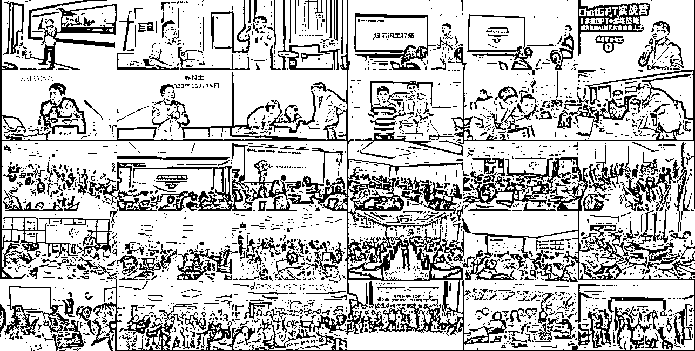

# (精华帖)(73 赞)《普通人如何成为年入百万的 AI 培训师？6 大核心模块+15000 字实战解析！》

> 原文：[`www.yuque.com/for_lazy/zhoubao/hqgzg9lw8unq061a`](https://www.yuque.com/for_lazy/zhoubao/hqgzg9lw8unq061a)

## (精华帖)(73 赞)《普通人如何成为年入百万的 AI 培训师？6 大核心模块+15000 字实战解析！》

作者： 乔帮主

日期：2025-04-23

大家好，我是乔帮主。

从 2023 年 5 月，我开始切入 AI 培训赛道。那时候有幸还参加过刀姐和 SKY 首期 AIGC 培训师的线下课，也算是国内最早一批从事 AI 培训赛道方向的 AI 培训师。

在过去两年，我在 AI 培训方面也拿到了不错的结果，也积累了蛮多经验和收获。借助这个机会，把我在 AI 培训中的一些实战干货跟大家分享出来。

AI 的落地，是 AI 人才的落地。当下及未来，市场及企业都需要大量的 AI 人才。特别是今年年初 DeepSeek 大火，AI 培训的需求暴增，这不仅是一个很好的商机红利期，也标志着我们正处于 AI 时代的高速发展期。

我们不应该成为这个时代的旁观者，而应该成为积极的参与者和见证者！希望本文能给到正在从事或者想要进入 AI 培训赛道的圈友一些参考和借鉴。

**商业的本质是利他，但作为 AI 培训师，作为“老师”的崇高伟大角色，我们思想觉悟和价值观更应该在利他基础之上，真正践行那句：“燃烧自己，照亮他人”！为市场、为社会、为国家、为 AI 时代培养更多优秀的 AI 人才！**

**文章目录：**

> 1、商业方向
> 
> 1.1、教育方向
> 
> 1.2、企业方向
> 
> 1.3、创业方向
> 
> 2、流量获取
> 
> 2.1、方式一：身边圈子的资源
> 
> 2.2、方式二：跟流量机构合作
> 
> 2.3、方式三：跟流量博主合作
> 
> 2.4、方式四：跟经纪公司合作
> 
> 2.5、方式五：销售拓客
> 
> 2.6、方式六：IP 拓客
> 
> 2.7、方式七：投流获客
> 
> 2.8、怎么分辨流量渠道的好坏？
> 
> 3、营销转化
> 
> 3.1、销转产品
> 
> 3.2、销转方式
> 
> 3.3、讲师介绍
> 
> 4、课程产品
> 
> 4.1、体系化
> 
> 4.2、专业性
> 
> 4.3、通俗性
> 
> 4.4、实用性
> 
> 5、培训交付
> 
> 5.1、表达能力
> 
> 5.2、演讲能力
> 
> 5.3、互动能力
> 
> 5.4、应变能力
> 
> 6、售后服务
> 
> 6.1、课前服务
> 
> 6.2、课中服务
> 
> 6.3、课后服务

**读前说明：**

**  **

1、本文干货内容量较大，有差不多一万五千字，通过商业方向、流量获取、营销转化、课程产品、培训交付、售后服务这六个方面，详细分享了入局 AI 培训赛道方向的认知、路径、经验、技巧、素材等实战干货。

2、写这篇干货，
前后花了差不多三周，也是一直在加干货内容及优化内容，想跟大家真正带来一些有用且有价值的实战干货。第一周做了主题+大纲目录规划，第二周做了内容撰写，初稿就写了一万两千字。

第三周，在这里也顺带感谢下我们生财 **@瓜斯** 及 **@欢欢** 帮忙提的内容完善建议，然后我又加了三千字，甚至把我在 AI 培训方面压箱底的家底干货都给掏出来了，最终完成这篇深度长文实战帖。

一些压箱底的干货刚开始我本来不准备写的，公开会跟自己增加竞争压力。但后来想了想，还是格局大点，极致的利他才会跟商业带来更多可能。

3、由于内容篇幅较长，包含的图片、附件等素材也较多，强烈建议电脑浏览器阅读更加方便高效。

**正文移步飞书：**

[`w91h2gmtrn.feishu.cn/docx/Epcmdcw4booK0FxUAe2c9e8dnFy`](https://w91h2gmtrn.feishu.cn/docx/Epcmdcw4booK0FxUAe2c9e8dnFy)

* * *

评论区：

林凡 : 这篇帖子非常有帮助，让想进入这条道的我可以很好地自我评估和自我完善，让我们新人少走弯路就已经赢了一大步[强][强][强]

嘉应岛主 : 先收藏之后再反馈

沈林易 : 感谢分享

Quintalynn : 逐字逐句拜读了。字字干货[强][强][强]

乔帮主 : 对你有帮助就好[握手]

乔帮主 : 虽然字多，但还是你识货[呲牙]

乔帮主 : [握手][握手][握手]

兮 : 先收藏，必须认真仔细读一遍，多谢分享