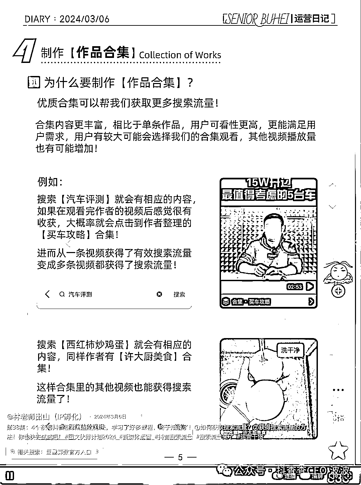

# (70 赞)优质图文账号卡搜索，注重每一个细节！搜索+图文批量化工具使用

> 原文：[`www.yuque.com/for_lazy/zhoubao/ybzhaybned7f8xme`](https://www.yuque.com/for_lazy/zhoubao/ybzhaybned7f8xme)

## (70 赞)优质图文账号卡搜索，注重每一个细节！搜索+图文批量化工具使用

作者： 波波@抖查查@爱盈利

日期：2025-04-20

今天带着大家拆解一个精细化运营的图文账号。

本文以一条拿到 **“搜索流量”** 的图文作为案例，详细拆解下，优质图文的细节把控。该内容为 24 年 3 月发布，在 25 年 4 月依然在搜索流量关键词结果页的第二名的位置，可见其**搜索引流能力** （图文形式+优质内容+精细化运营）之强大。

数据来自：[www.aidso.com](http://www.aidso.com)

**  **

**封面** —>标题、出品 logo、系列标识、精彩插图、色彩搭配。

这个案例，达到了一本书的外包装的标准。评论区的用户夸奖账号注重细节。（这里波波插入一个知识点，**近期的评论互动** 有助于帮助内容排在搜索词结果的高位。）

**图文的作品描述：**

第 38 集：4 个获得抖音**搜索流量** 的方法。学习了好多课程，终于知道了！①如何获取**搜索流量** ？②获得**搜索流量** 的方法！你也快去试试吧！# 图文伙伴计划 2024 #新媒体运营 #抖音**搜索流量** #**搜索流量** 来了 #运营干货

**知识点：** 搜索流量反复出现，有助于覆盖关键词，以及抢排名，因为关联性强！但是不要刻意生硬重复，而是文案合理，适合人阅读，同时也适合机器阅读。

后面五页内容如下：（大图+每页详细的拆解）

**内容页首页：**

依然清晰的给出内容标题：《**4 步****快速** 获得**抖音搜索流量** 》

**标题中带有数字，** 吸量和点击率都会上升。

**快速** 是很好的转化词，引导急于求成的用户去看。

**抖音搜索流量** 是核心词，带来精准的搜索人群

**图文并茂** ，生动详细阐述内容，信息量大，内容一目了然。

**第二页：** 包含核心干货，引入搜索词的搜索量概念。

**  **

**第三页：** 详细介绍了**巨量算数** （官方产品），会**拍马屁** 是平台流量获取的核心奥义。所以也可以看到底 bar 的相关搜索引导：**巨量算数官方入口** ，所以这条 24 年 3 月的内容能够持续出现在搜索流量这个词的 top2 的位置，不无它的道理呀^_

**  **

**最后两页：** 图文内容的关键部分，封面与合集，都讲到了！不过选的两个案例封面选的不好，第一个图文 show
case 字特效太重了（不方便算法抓取），颜色也不清晰（不方便真人阅读），有很大的优化空间。

还有一点小遗憾！如果再加上一点搜索算法原理最好，能够帮助稍微高阶一点的玩家，快速搞懂搜索结果页排名逻辑，以及数据考核指标。

图文看完了！

**我们来看下这个账号的整体运营情况，** 以及流量层级。粉丝 7 万，点赞 33 万，作品 93 条，很多作品点赞过千，甚至是过万，账号流量非常不错。

**变现方式：** 收徒+代运营、IP 操盘、卖课工具、广告植入等

具体的账号内容与数据请看下图：

前两天发布新版本 DSO 工具：[www.aidso.com](http://www.aidso.com) 有点小爆，一下子加了几百人了，还在继续爆量！

**承接搜索流量，图文的效率是最高的。**

**种草内容做口播，图文承接搜索流量。**

不是说完全不能用单人口播或者混剪的内容承接搜索，因为有**些泛搜索的词** ，本身用户还拿不定的时候，是可以通过口播去帮助客户快速做决定，甚至是排除掉一些竞品的决策。

但是大量的**直接成交词** ，一定是图文的效率更高！

之前分享的文章，无数的账号已经展示出来，图文线索获客的魅力。做过的人肯定都懂！^_

**关键词举例**

**酒店住宿** ：（日均 1000 搜索量）

数据来自[www.aidso.com](http://www.aidso.com)

**  **

**如果是口播，看一张大脸絮絮叨叨 3 分钟没看明白** ，还是直接点进这样的图文几秒找到关键的信息？你不真正的去体验下搜索场景是不会明白的！^_

图文生产配合着优质的关键词选词，简直就是豺狼配虎豹，吊炸天！

同时好的 DSO 内容也非常适合承接关键词搜索流量的投放。

当然工具还很多问题，**还很菜，** 不是说生成的图文可以直接使用了，目前还没那么完美，还需要你手动调优一下，刚上线，为了快速上线功能，很多参数是写死的，还需要不断调优。还需要更赛道的流量大神，多多指点，多多帮咱的工具打磨打磨。

MVP 研发策略就是，**先上线个垃圾，然后快速推广使用，收集反馈，快速迭代，** 几个版本下来，几乎就非常流畅丝滑了。所以早点来使用，就会把自己的想法，尽早的告知我们，融入产品当中去！

为了排版不爆炸，现在是**很傻逼的，锁死了每个段落的字数** ，后面会逐渐放开一些，方便大家更快速的调优。很多建议，都在陆续收集+改进排期中，产研团队虽说有点**蜗牛爬** ，其实等不了多久，也就上了!^_

同时很多**高亮、划线、还有小装饰配图** ，只是堆砌在图片里，等你人工去调整下，还没有像剪映那样可以做到自动识别。毕竟人家剪映什么豪华的产研团队，**我们还很弱 b，** 但是也会根据需求看看有没有必要进行排期进来。

选好样式，自己手动编辑下，**虽然还 TM 是模版半自动模式，但是纯大模型生成我们也试了，效果更加不可用，** 虽然省事，但是挑不出一张可以实战的好图。

这种半自动步枪，已经可以让单人的优质好图文日产量，从每天 5 条扩大到 30-50 条，（资深 DSO 优化水平的图文）已经是提效了 6-10 倍的效果。下一步，波波想法是加一些 AI 筛图，AI 筛文的功能，提升我们人工选择的效率，让 AI 来替代我们做更多的决策。

**如果你单个项目还没有做到日发 300+条图文，估计看我说了这么多废话，** 跟 TM 放屁一样，但是如果你有海量账号发布能力的时候，优质内容跟便秘一样发不出来，你就知道工具提效的重要性了。如果还没动搜索流量打法的话，这篇文章更加不适合你，可以看下波波公号之前的文章，就知道我在说什么了。

什么你海量账号发不了，老被平台封，用了很多手段，老是需要重新登录授权，这个苦吃不了，咱就别吃，好好舒舒服服的睡大觉打游戏不香吗，非要来研究流量获取，这种卷到天际的死亡赛道，不是找虐么。

**你每个账号都投放猛点试下，** 总是想白嫖，（天诺老吴喊了那么久的能付费绝不白嫖，通投拉满 999，依然活跃没有被限制死，你就知道平台要什么了。）平台是来做慈善的么。所有平台都 TM 是要赚钱的，看人下彩蝶，你掏钱也猛一点（比你赛道同行猛）你就是平台他爸爸，有人说平台里面审核是你爷爷，那赶紧去给爷爷磕一个。^_

品牌升级了

由原 DSO114 升级到了 AIDSO

不管你爱不爱用，你想怎么用，工具就是来帮你更好的解决问题的，一个按钮点了就挣钱，这种工具 TMD 我们做不出来。但是选词你不用我们平台你能做好，几亿个词条，不够你做的？图文这不玩命在想办法给你解决提效问题么，还觉得不满意，不满意你做一个我看看。让我和我们的傻逼产研团队服气的话，也给你磕一个。^_

可能有大神还要问，AI 生图这么牛 B 了，为什么现在还用模版的思路来解决问题。**确实 GPT-4o 很牛 B 了，但是真到海量图文实战，无论是成本，还是速度，还是实用性，还是差了一大截。** 估计在等等第一梯队的公司，彻底优化算法，解决上述两个问题后，模版的方式可能才会彻底终结。我们当下就要，所以先这么安排着，团队一直在看主流的模型的图文生成能力，有点能力但是还无法实战，成本也太高了，一旦可用，会第一时间生成版本给大家测试。

AI 选词照顾的是还没学过抖音搜索优化的同学，没有成熟的 DSO 方法论，你就尽量用 AI 选词，为啥选这个词，你先不要理解，先 TM 干拿流量结果就完事了。

懂选词逻辑的同学，DSO 培训陪跑过的同学，你们可以自行用知识+经验选词，会更牛 B 一些。毕竟这种高级一点的运营思维，别说 DeepSeek 了，谁也暂时没办法替代呢。

开关在这里，人工选词，适合精细化运营，如果账号多，交给 AI 拿个 60-70 分就可以了。毕竟绝对数量面前，质量就没那么重要了。还是看你团队的基因到哪里了。

今年，**波波最看好的三个方向** ，就是知识付费、AI 工具、早期项目挖掘与孵化。我们也会围绕着这几个方向发力。

**1）知识付费** 是当下变现效率最高的方式，我为什么看到了这个机会，因为我们在抖音主要做的方向就是知识付费（这个类目唯一一家三星最高等级服务商，服务的超级 IP 和中小 IP 很多：K12 非成赛道和成人赛道，其中很多老师自然流一年做大几百万 GMV，付费打法单月破千万 GMV 的也非常多。AI 时代到来，传统的教育体系是无法应对飞速发展的时代变化，最新的技术应用，产品应用，AI 提效等方面都有很大的知识付费的机会。虽然早期会出现鱼龙混杂，博傻割韭菜的现象，但是随着行业越老越规范，一定会出现一些口碑良好的品牌方甚至是大平台。适合意识超前，all
in 拥抱 AI 的创业者，快速拿到方法论和优质案例，做成优秀的知识付费服务产品。

**2）如果是 AI 方向，** 早期盈利比较慢，所以配合知识付费比较好，如果纯是做一些收益，不考虑长期，做知识付费类变现是最好的方式。人群需求对了，产品+流量获取能力就可以快速拿到大结果。当然如果想要更大的成果，就需要借助互补的基因，进入市场最需要的赛道。

**  **

**3）早期项目挖掘与孵化。** 是最佳的进场方式，速度快，试错成本低。

本文完！

* * *

评论区：

波波@抖查查@爱盈利 : 抖音 DSO 获客航海大家也可以关注一下！^_

波波@抖查查@爱盈利 : 工具会配合航海送大家使用！

追风少年 O2 : 期待~3 月初去杭州听过波波老师的 dso 分享，非常真实，真诚干货

刀子嘴 AK 心 : 新人一枚，很多看不懂[白眼]是不是先挑选高流量的关键词，再依靠工具高效的把关键词做成内容？

波波@抖查查@爱盈利 : 是的 太高流量也未必好抢 挑选适合的

抖音电商-时光 : 干货满满，看了波波老师的这个拆解，感觉一下通透了，把很多零碎的知识串在一起， 以前也会去做主图，视频封面，字幕，标题，话题标签，埋长尾词，算数指数，微信指数
搜 关联词，关联视频等，却没有进一步拆解分析，学到了🎉🎉🎉

淼淼 : 刚来就找到我想要的信息分享了，感恩。