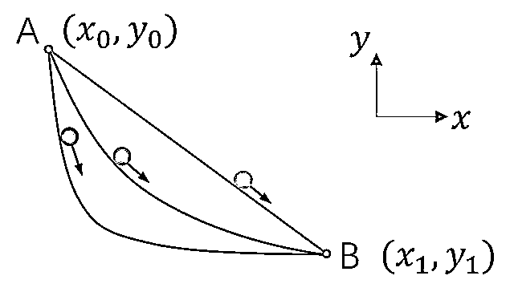
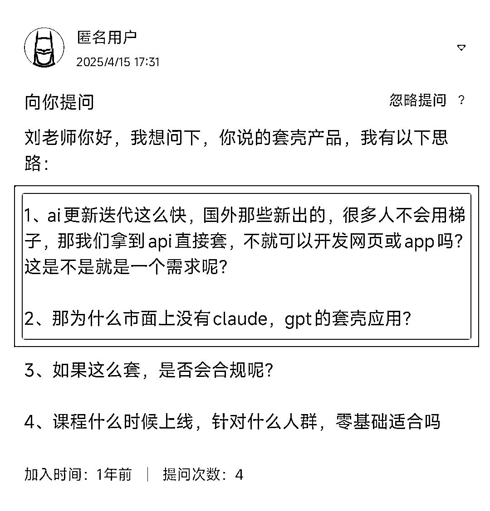

# (精华帖)(978 赞)加入生财的第一周，做什么最重要？

> 原文：[`www.yuque.com/for_lazy/zhoubao/az4u2r7ko39i5o7b`](https://www.yuque.com/for_lazy/zhoubao/az4u2r7ko39i5o7b)

## (精华帖)(978 赞)加入生财的第一周，做什么最重要？

作者： 刘小排

日期：2025-04-21

每一年的 418，我们都会被同一个问题困扰：**新手朋友刚刚加入生财，面对琳琅满目的信息，应该先做什么？**

这个问题每一年都比前一年更加严重，因为生财有术已经走到了第 9 年了，圈友越来越多，信息越来越多。

怎么办呢？

别急，我们先从一个故事讲起。

1696 年，身在荷兰的瑞士数学家约翰·伯努利在欧洲顶级学术刊物《博学通报》上向全欧洲的数学家提出公开挑战，看谁能解决当年伽利略提出的“最速降线”问题。

这个问题很好理解：让一个小球从最高处的 A 点，在引力作用下自然沿轨道下落到 B 点，最快的路径是什么？

在伽利略时代，数学界都已经知道了：答案并不是从 A 到 B 的直线，肯定是一条曲线。可是还没有人计算出来最快的路径长啥样。

在一年多的时间里，约翰·伯努利收到了 5 份正确答案。前 4 份都是来自知名的数学家，第五个人，却没有署名。

约翰·伯努利在写给哥哥雅克布·伯努利的信中，谈到了匿名信的事。他在信中说：“**从爪印判断，那是一头狮子** ”。

什么意思？这句话的意思是，他看出来了，这是牛顿。
（英国从亨利一世起，家族旗帜和纹章上就是狮子图案。提到狮子，就是提到英国，英国当年首屈一指的数学家就是牛顿。）

是的，匿名答案的确来自牛顿。牛顿在傍晚时分拿到挑战，一晚上就解决了问题，并用匿名信的方式对欧洲数学界展示了藐视。牛顿不知道的是，另外四个人都花了十几天到几个月的时间。

约翰·伯努利不需要看到姓名，只需要看到解题的手法，就能断定它来自牛顿。

亦仁常说，他最喜欢的事情是研究赚钱情报，然后分享给朋友。无论是在生财有术诞生前的公众号、还是在生财有术第 9 年的超级标，他都是在持之以恒地做同一件事。
每当看到亦仁发布新的超级标，我就会想起最速降线的故事。想象一个夜深人静的书桌，亦仁突然在电脑前拍案而起：“**从爪印判断，这是一个超级标！** ”。

我们一起开开脑洞，约翰·伯努利为什么可以只看到解题手法，就断定是牛顿呢？

我想，必须满足两个条件才可以。 第一，约翰·伯努利一定熟知所有欧洲数学家的解题方法。 第二，牛顿的解题方法一定存在独特的指纹。

这两个条件，都是成立的。约翰·伯努利之所以熟知所有欧洲数学家的解题方法，是因为数学家其实也是一个社群，他们平时都在类似于《博学通报》这样的期刊上交流。
牛顿的解题方案当然存在独特的指纹，因为牛顿倾向于使用几何方法而非纯代数方法来解决问题，他对几何方法的偏好和应用，和当时欧洲大陆的数学家有明显不同。

我讲到这里，不知道你是否理解，我到底在讲什么？

没错！
1696 年数学家们的《博学通报》，对于 2025 年的创业者来说，它叫「生财有术」。牛顿在 1696 年在匿名解题手法中留下的独特指纹，对于 2025 年的创业者来说，它叫「异常值」。

如果我们用上了同样的方法，我们也能够在夜深人静的时候，发出“从爪印判断，这个机会属于我”的感叹。

具体怎么做呢？

首先，你需要「全覆盖级阅读生财有术」。

## 一、为什么需要「全覆盖级阅读生财有术」

由于生财有术的信息量过于广博，有人建议新手朋友，先找到自己感兴趣的来阅读、找到垂直赛道深入学习。

我声明：我反对这种“头疼医头、脚痛医脚”的学习方式。

我有三个理由。

**第一：洞察的前提是见多识广**

你为什么要加入生财有术？ 因为你想跳出打工人的视角，走出信息茧房。 如果刚进来你就直奔你熟悉的、垂直的赛道深入研究，请问你走出信息茧房了吗？

在政治学领域有一句话是怎么说的： 如果你只了解一个国家，那么，你不了解任何国家。

小时候看电影，我们经常看到警察局的标语写着“坦白从宽，抗拒从严”，我们会觉得天经地义。一个人做了坏事，面对警察时，当然要坦白，难道还能抵赖？直到后来看了 TVB 剧和外国电影有“你有保持沉默的权利，但是你所说的每句话都将成为呈堂证供……”，我们会觉得三观碎了一地。罪犯还有“保持沉默的权利”？？
至少，世界上还有很大一部分人是这样认为的。

我们在坐出租车的时候，往往听到出租车司机侃侃而谈，大谈中国哪里哪里好、美国哪里哪里不好。 可是，他却从来没有出过国。 请问，他的观点有多大的可能是正确的呢？

真正的洞察力，首先是和“见识”有关。只有你读过、听过、走过、思考、尝试过的领域足够多，你才可能把你熟悉的某个创业方法当成“一万种可能性之一”来对待，你才可能对其他万分之九千九百九十九的可能性产生好奇。

心理学领域有个“村花效应”。如果你从来没有走出过你的村子，你很可能认为，你们村的村花，就是全世界最美的女人。

同样，如果你从来没有了解过其他领域，你很可能认为，你正在做的领域就是全世界唯一的赛道，而你正在使用的方法就是全世界唯一的方法。

**第二：建立沟通前提**

前几天，看李翔对泡泡玛特创始人王宁的访谈记录《因为独特》一书，里面有个让我印象深刻的小故事。

> 记得有一次有一家很有名的基金通过 FA 找过来，我就跟 FA 说，我有两个要求：第一，合伙人必须来，投资经理来是浪费大家的时间，必须有决策能力的人来；第二，他必须了解我们公司，看过我们的财报，做过功课，充分了解了之后直接问核心问题，那我们愿意聊，看看对不对脾气。
> 
> FA 就打包票说，保证对公司很了解，而且很迫切，是能很快做决策的，可以的话，大概两周之内就能打钱。
> 
> 然后这个人就来了，来了以后，第一个问题是：你们的核心产品是什么？
> 
> 问完第一个问题，我就说：“不好意思，今天我们挺忙的，等你改天有机会了解了解我们之后再说。”
> 
> 真的，不到 5 分钟，我直接这么说，那天司德也在。
> 
> 我不管你是多么大的基金、很有名的合伙人，你不能都不做功课就来聊。
> 
> 不做功课就是浪费大家的时间。

不禁让我想到，前些天有圈友在生财有术里找我提问，他问我的问题，不是一个好问题，我的确有点不想回答。

这位朋友提到我的“套壳产品”那篇帖子，在帖子里，我一上来就提了 Monica.im，我想，这位朋友恐怕根本没有看完我的帖子、或者也根本没有打开过 Monica 看看到底是个啥，就来提问了。不经过调研，就直接笃定“市面上没有 ChatGPT 的套壳应用”，我不认为他和我建立了沟通的前提。

衷心希望这位朋友能够看到这里。

正如王宁所说，“不好意思，今天我们挺忙的，等你改天有机会了解了解我们之后再说。” “不做功课就是浪费大家的时间。”

做好功课，全覆盖级阅读生财有术，是你和先行者们做有效沟通的前提。

**第三：所有的触类旁通，都藏在你不熟悉的领域中**

一些朋友觉得我写的文章很有新意。正如你正在阅读的这篇，明明是讲生财有术，却顺便讲了数学、牛顿、泡泡玛特、王宁、政治学、米兰达警告、心理学。

他们问我是如何做到的？

我想，可能是因为我不排斥所有不熟悉的领域，才有幸做到一点触类旁通吧。

**所有的触类旁通，都藏在你不熟悉的领域中** 。

所谓创新，不过就是“旧元素的新组合”。

掌握足够多的不同领域的旧元素，才能把它们触类旁通成为新组合。

希望以上三个理由，能够说服你，足够重视「全覆盖级阅读生财有术」的好处。

## 二、如何「全覆盖级阅读生财有术」？

我是在四年前加入生财有术的，那个时候信息没有那么多，我花了几天的时间就阅读完了几乎所有精华帖。

今天的生财有术和当年已经不可同日而语了，当年我做的这件事，今天似乎已经不再可能。

但是没有关系。只要你建立了「全覆盖级阅读生财有术」的意识，我们还是一些途径，可以实现同样的效果。

这里推荐两个方法。

第一个是涛哥 @杨涛 的方法

1.  1.打开“生财有术”公众号，把里面 1009 篇文章全部阅读一遍，不求甚解。

2.  2.打开 scys.com 官网，输入上一步中自己有感觉的关键词，可以找到一切。

3.  3.打开 scys.com 看航海手册，里面的每个内容都是外面大几千的课

第二个是我的方法

1.  1.打开 scys.com 看航海手册，里面的每个内容都是外面大几千的课

2.  2.看生财有术榜单的全部精华帖。[生财有术年度榜单](https://shengcaiyoushu01.feishu.cn/docx/BpMVdgU4aowBznx2YtncFBCEnIh?from=from_copylink)

3.  3.尽快参加周边的生财线下见面活动

两种方式均可。如果你愿意结合起来，那就更好啦。

无论是哪种方式，都只需要你花不到一周的时间。

对了，两个方式有共同点，你不知道你发现了没？ 共同点是：相信生财有术官方的筛选。公众号文章、榜单、航海手册，都是经过生财有术官方优中选优后的成果。

我在涛哥的基础上额外增加了“线下见面”。因为线下见面帮助了我很多。

看书多了，我发现，看一本书的收获，往往不如和这本书的作者面对面聊两个小时。

同样，看航海手册的收获，也不如你和同行者当面交流。

## 三、然后呢？

然后，开始实干。

你可以抓紧未来三周的时间做好准备，从 5 月中旬的航海活动开始实干。

生财有术是实干派创业者社群。

何以解忧？唯有事干！

祝愿大家在生财有术，和下个版本的自己早日相遇！

* * *

评论区：

Mr.陈 : 先赞再看

文祥宇 : 💪💪💪💪

生 : 很有帮助

黄金号 : 逐字拜读[啤酒]

奇异点 : 感谢～受益匪浅

有情 : 大概是看多了，新事物也会有似曾相识的感觉～

北极贝 : 太有货了，虽然不知道什么时候能赶上大部队，但是有小排老师这样精华赋能，我相信相信的力量！

阿辉 : 赞！共感！我是因为喜欢小排老师才毫不犹豫的加入了 scys。说起来难为情，我花了两天周末的时间才把 web 航海手册的视频逐帧看完，并做了香酥鸡的笔记。我是个客户经理，年 kpi1.7 亿，但做业绩确实已经是身体和精神上的极限了，希望剩下的人生可以为自己奋斗。在这里我就是个小卡拉米，我也贼期待我这个小卡拉米的种子选手可以开出绚丽的浪花！[呲牙]