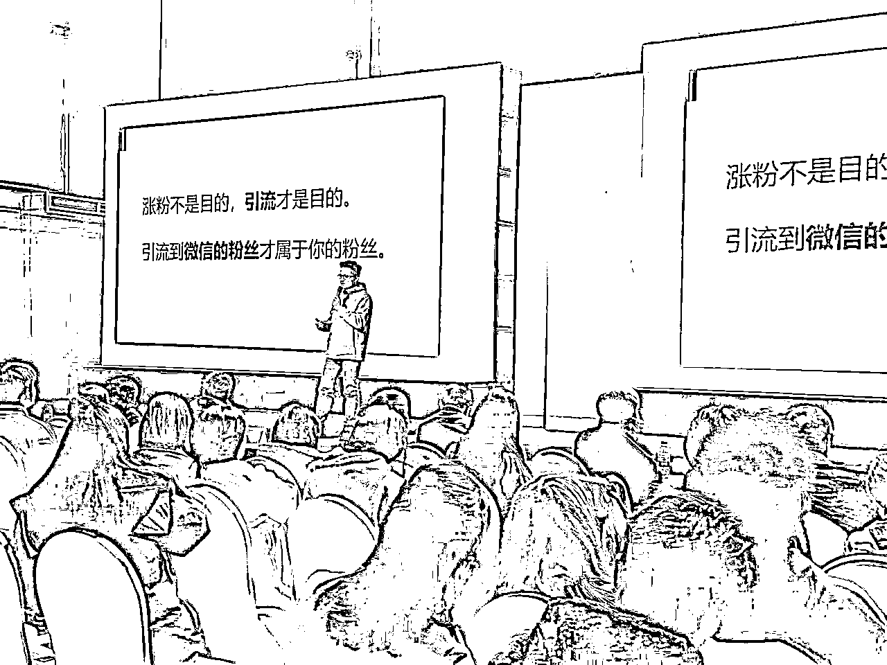

# 70%团队消失背后，打粉生意的思考与出路

> 来源：[https://pghe992qie.feishu.cn/docx/APtpdFde2oEBqFxLnKHcxfAWnnf](https://pghe992qie.feishu.cn/docx/APtpdFde2oEBqFxLnKHcxfAWnnf)

大家好，我是星城，曾任生财有术3次小红书航海教练，写过5篇精华。好久没和大家分享了，一晃时间过得很快，这个阶段我受到很多圈友的指导，也帮助过很多圈友在小红书上拓宽了新的渠道业务，可以说是互惠互利。

从22年开始涉足小红书，我的团队经历了多次人员调整，多的时候有20余名员工，少的时候4，5个。操盘过教育、绘本、同城交友、亲子研学、创业粉等，我们主要是做矩阵引流的，自然流为主，时而裁员时而又增员，可谓是起起伏伏又起起伏伏，有做得不错的地方，赚到一些钱，也引来许多同行的模仿；但也有因盲目自信而走错弯路，亏损了一波。

今天写这篇，也是想阶段性总结下自己的项目复盘吧，反正秉持着越分享越幸运的原则，我每次分享总能链接到意向不到的收获！

（23年做得好的时候，经常被人邀请当嘉宾出去分享，后期混圈少了，再出去，发现好多后起之秀，很多人都不认识了）

# 一、认识“打粉”——机遇与现实

## 什么是“打粉”？

“打粉”，可以理解为早期我们所说的“引流”，核心是与甲方（需求方）进行流量合作。

*   结算方式通常为CPA（按效果付费）或CPS（按销售付费）。

*   其特点在于，每个获取到的粉丝（流量）都有其商业价值，尤其适合可规模化、可复制化的项目。大概在2023年左右，“打粉”这个词就比较火，也是这个阶段，很多人都想参合进来玩玩。

## 说个结论：只靠打粉营运的团队，24年70%的团队都消失了

消失，你可以理解成团队解散，也可以理解成，他们不单独做单粉，转型做自营了。只靠打粉来营运，24年没那么好做。之前平台规则宽松的时候，就还可以，但现在，别再指望仅凭“打粉”就能撑起一片天啦。

为什么不好做呢？

如果缺乏自营盘支撑，单纯依靠“打粉”，业务形态会非常不稳定，这是由“打粉”的业务模型本身决定的。 你可能会问，那“打粉”团队自己搭建自营盘不就行了吗?如果团队之前就有相关基因，那还好，但如果是后期搭建，则会遇到不少弯路。接下来我将一一说明。

# 二、“打粉”的业务模型与核心挑战

## 规模化无法稳定产出

在打粉行业中，有这样的共识：一个员工扣除成本，能给公司带来2w左右利润，这已经是不错的员工产值了。你看如果一个打粉团队，有10个员工，保底起码也能8～10w利润。

理是这个理，但在实际的过程中，打粉会存在“不稳定”因素：

a、「免费流量的不稳定性」：你做免费流，意味着你的流量就会出现不稳定，免费流时高时低，很正常。

b、「放量导致后端转化率波动」：

*   流量精准度变化：放量意味着，你的模版可能迭代不一样，导致流量的精准度不同；

*   销售承接能力瓶颈：放量也意味着，后端的销售在面对原先10个人聊一天和50个人聊一天，带来的话术和转化率都不相同。

*   成交场景的被迫改变：放量也意味着，原先可能一对一私聊模型，现在要变成群聊，直播课成交等，成交场景也发生了改变。

c、「人员流动性」：打粉”行业对基层员工的技能要求相对不高，是一个劳动密集型流动性产业，当项目存在不稳定时，就会离职潮。

当业务顺利时，一个员工能带来1万利润，招10个员工似乎就能带来10万利润。但当你信心满满准备招20人冲击20万利润时，上述三个“不稳定”因素往往会集中爆发。

## 如何应对“无法稳定产出”的问题?

#### 2.1、通过聚光（投流）的方式，来辅助流量产出

免费流不稳定，这个避免不了，所以不稳定额时候我们会通过聚光的方式去投流。但对于我们来说，免费流获客是最香的，因为我们团队基因擅长打免费流。“聚光”的投放计划有时效果不可控，甚至可能亏本，心会滴血。如果聚光跑出去是不亏不赚的，我们也会坚持一段时间。因为换项目很麻烦，而且换人也很麻烦。我们愿意接受这不亏不赚一段时间，等自然流好做，就可以无缝衔接。但如果是亏损的，测试一段时间，那就肯定换项目了。

#### 2.2、准备多个项目以确保员工有事可做

项目本身的流量会受行业周期性波动影响，例如卖皮草大衣，旺季主要在冬季;高考志愿填报咨询，则集中在高考前后。 另外，除了行业常见的时间性高低峰期，平台本身也有内容偏好的旺季和淡季。

有一段时间，平台可能偏好你这类内容，就会给予更多流量;反之，则会减少流量。 我们不可能只让员工工作3个月的旺季就解雇，因此需要准备多个备用项目。

当某个项目不好做时，我们就转向其他项目。 (有时甚至会出现A项目“养”B项目的情况。当然，最理想的状态还是所有在做的项目都能盈利。

#### 2.3、黄金期过后，对赛道选择要求更高

免费流成本低，24年之前都非常好做，22~23年小红书黄金期。

25年会比较挑项目，引流难度变高了，平台越来越正规，越来越聚光化了，还要打粉的话，就要选个高产值的项目赛道，或者自营盘后端有私域控制权，慢慢精细化照顾好自己的粉丝，那还是可以的。

## 分享下你们的模式？

一个普通员工3500底薪+绩效提成。手机一台设备300~400，当时我们选nova4或v20，手机成本不用考虑那么多，项目做黄了还可以再卖出去。员工入职前先说清楚要办卡运营，直接联系营业厅的人过来先办卡，后续离职注销。我在广州，如果你要这个资源可以找我（通过鱼丸找我），可以一次性办理电信、移动、联通，省去你让员工办理到营业厅，而且有些营业厅你开太多卡不行。

像我们之前打高中教育粉，一个粉回收是5元，一天我们能产值1000~2000粉，特别是临近高中填报志愿的时候，还是非常吃香的。这也导致我们技术比较容易复制，我后面有2个员工都自己出去开工作室，启动资金只要你胆子大一点，5万就够了。

这里延伸出一个很有趣的现象，有些员工自己出去做，刚做的时候挺好的，由于技术同源，难点就在于商务甲方的寻找。他们找不到甲方，我会以赚中间商的方式给他。比如甲方给我15元，我让他（前员工）帮我做，13元。我什么都不用做，赚2元。当然，他们也是赚到钱的，对我也好，因为我请多员工扩盘，有一定的管理成本在。他们能够独立出去，后续技术迭代也能保持一定联系，还是不错的，也算互利。如果他们找不到甲方，团队就马上凉了。创业团队都是如此，活着比什么都重要。

当然，更有趣的是，有时候前员工接到不错的单，也会分单子给我做，我觉得太有“生财”精神了，互惠互利，大家都能帮助到大家。后面接触这行的人多了，发现他们把这个叫做“阿米巴”模式。

有一些大的打粉团队，他们会通过“阿米巴”的方式，衍生出多个打粉团队，这点还是非常有启发的，这里我也说下。

项目“打粉”相对来说稳定，如果想赚更多，就要更多员工，但更多员工涉及到更多管理风险，而为了培养更优秀的人才，会新建一个联合公司，让他成为公司负责人，账目另外单独计算。

这样的好处是：

①、账号设备不会堆在一起，基建ip不同分散在不同地方，流量更稳定

②、如果组长也成为老板/合伙人，他的驱动性是不一样的，主动能观性会强太多

③、管理成本的风险。相当于两人合资，成本共担，这样能应对更多的风险和更多深层次的讨论

④、之前说了，打粉技术相对来说比较简单，与其让员工自己跳槽，还不如一起捆绑

当然，也存在一定的弊端：

①、分出去的利润肯定没直营高

②、对人的要求更高，他是你的合伙人，不是你的小组长

③、要找非常信得过的人，账目要算清楚。

如果按能力值排名，我觉得是：

人品>快速迭代能力（找模版）>商务能力（甲方）>管理能力>引流技术。

所以，你看似是打粉是靠技术的生意，但如果是团队，技术反而是最其次的。你得依靠上面的哪几项能力，才能放大。

# 三、如果独立出去干，大概的流程是什么，会遇到什么困难？

生财里，我想应该很多人正准备独立出去干。有一部分人是自己做点流量，想扩盘，也有一部分人是帮公司做了多年，想出去干的。那我觉得这点大家可以认真看一下。

首先大致上的流程，你必须有好几个不同项目的“打粉”结果。如果你单纯只会打一个领域，太被动了，这个点达不到的，建议回炉再造，不要轻易出来。虽说你在打工，天花板可见，但公司也在保护你，外面很残酷的，你在公司技术好点提成就高点，独立去外面，你要涉及到项目资源问题。

假设你具备多个类目的打粉经验，接下来，你可以尝试接单的形式，先做。单从哪里来？你得庆幸你就在生财。你把你的案例结果，发到生财上去，就会有人来找你。注意，这里我不是让你去生财引流，一定是要真实分享自己的案例，用案例撬动案例。接着你就可以进行“效果付费”的形式交付，我第一批客户，就是这么来的。所以我特别感谢生财这个平台。

现在流行一句话叫，AI的出现实现了程序员的技术平权。但我们认真思考下，类似"生财"这种平台的出现，是不是实现了资源/认知平权呢？老板和打工者最大的区别，无非就是资源和认知，你能沉浸下来，你的思维方式会非常不一样。

但是呢，很多时候人们就不愿意尝试，比如我发朋友圈，我员工都是看到得到，我会发生财相关朋友圈，在拉新的时候会发，但也没见他们进。要知道这可是我的信息和人脉窗口啊，所以。。。。

回到刚刚的话题来，前期你在独立创业的时候，肯定要先做自己做过的项目，有大概率把握的事情，因为是效果付费，成本压力在你这，当你没势能的时候，你就得承担这样的风险。

我推荐这样的结算方案，比如让客户预付款3万元，谈好一个粉多少钱，先测试2周，如果效果不满意，把剩余的钱退回。如果没预付款，很可能对方根本不重视，热脸贴上冷屁股。还有另外一种方式，就是熟人推荐，这个解决了对方重视程度的问题，所以某种程度来说，混圈，线下碰个面，还是很有必要。

这里分享一个实操，像高中教育粉，因为我之前都在做教育相关的领域，在同一个大类目下，不同的细分，还是比较容易看出来是否有流量的，有时候看一下模版，大概率就知道这件事能不能成。只要引流模版符合“批量化”、“评论区很多人问”、“账号是可复制的"，我们入局都会拿到不错的效果。

当觉得某个方向可以做时，就先去微信通讯录里通过关键词搜索。因为现在很多人都会在微信个人介绍中注明自己的业务领域，微信的这个搜索功能可以很好地利用起来。 然后就直接和他们沟通，洽谈一个粉丝多少钱。

同理，其他领域也也一样，关键就是对模版的判断。

我觉得就在甲方客户的寻找下，就区分了打工人和创业者的区别。比如到了组长的级别，我认为他的打粉技术，有时候比老板还要好，老板有时候出去分享的ppt，很可能还是组长做的，毕竟常操盘一线，体感不一样。但组长能出去自己干的，还是少数。客户的来源是最重要因素之一。至于手机成本和员工成本，相对透明，压力并不大。

# 四、“打粉”实战中的常见问题与解决方案

### 跑单！！！

和甲方谈好，一个粉是10元收，刚开始一天进200粉，测试还不错。后面我们测通了个模版，爆了，一天进1000多粉，甲方微信都加爆了，由于我们前期经验不足，加上甲方也经验不足，好几个微信竟然搞封了。后面的粉进不去这个价值流失不说，也由于量太大，他们销售接不过来，觉得这样的粉变现效率低。这就会导致，原本我计划我团队去做这些事，但业务直接喊停，我还要承担团队继续发工资的成本。

所幸，马上找到另外一个甲方，低一点价格先收粉。

所以，这件事我们经一事长一智，我们得出的复盘思考是，

①、前期先预收款，和客户说清楚我们爆发起来，你们必须要有这个预算准备，合同签订写清楚。

②、告诉客户，要多个微信储备，做好后端承接的工作。如公众号、企业微信、其他微信登。不要因为粉爆了被封号

③、自己预备储备方案，找第二个同行做planB计划去承接。这已经是下下策了。

主要还是把控住前两点，麻烦事会少很多。

### 自己搭建自营盘

你看，我们打粉，能判断出哪些客户是稳定收，意味着哪些客户能赚钱。所以，当时萌生出一个想法，干嘛打粉给他们，还不如自己搭建给自营盘？相信很多打粉团队都走过这条路。

但你会发现，有些做得好的，有些做得不好的，大多数是做不好的。先说个结论：最佳的方式是找到一个懂后端的合伙人，而不是自己从零开始搭建后端。

你看别人赚钱很轻松，实则自己搭建太麻烦了。也因为搭建后端，项目的时间窗口和人的精力是有限的，如果不去搭建这个后端，而专注前期的打粉，在同一时间段内，可能那段时间赚得更多。

后端你要涉及到人的管理，销售话术，产品等，你要学习起来，都是时间成本。我前期就是踩这个坑，自己摸索，太费时间了，错过了项目的黄金期，后面逐渐开窍，能成的，都是找了懂后端的合伙人。

其实我们想做后端，核心目的无非是想获得私域流量的归属权，不想再做一次性“打粉”赚一笔钱没沉淀的生意。 既然如此，想自己打造自营盘，并非是为了学习后端的技术和学问。所以，找后端合伙人，才是从本质上解决问题的最佳路径。

还有一种快捷的方式，是发展出一种“联营”模式。就是要出资与甲方共担成本，利润方面不再是单纯的流量计费，而是通过项目整体分成的形式。这种方式是在帮甲方做增量的，并不是在他原有的基础上去分，而是只分增加的部分。

### 人才管理

老板的时间，大多数是谈单或者新模版的测试，像执行层面，一般需要组长来把控。

组长还是非常重要的！！！最基层的员工流动性大点也没关系，比较好招和好培养，组长就比较难培养。组长要求是能自己挖掘创新模版，能带团队的，这类人才要保留。而像基层的员工，培训3天，都能出粉。BOSS上招聘，基本面都面不完，写小红书引流、运营、美工运营，这三个岗位最多人投。

# 五、展望与判断：

### 做流量，到底是做宽，还是做深？

我个人建议，还是做深！！！

深入一个行业去做，虽然说“打粉”前期会接触到很多赛道，但到了后期，要么绑到一个大客户稳定产出供粉，要么自营盘（自己本身有后端项目的经验、或找合伙人）形式挖深流量，建立更多的竞争壁垒。你只有对这个行业/产品有更深的认识，才能做出细分更好的产品和服务，才能在如今这么卷的市场里有生存空间。

前期我踩比较大的坑，是陪着客户去成长。做久了你会发现，不要去陪客户成长，如果客户是没接触过接粉的，你就不要做，后期会遇到很多问题。要做就专门找那些接过粉的团队，谈好一个粉多少钱。因为打粉讲究还是效率，效率快的话，马上进粉马上变现，还是非常香的。

### 用ai提效率

像之前，我们经历过人工回复阶段，但后面发现有小红书自动回复，直接省去好几个客服，而且工作效率上也提升了，降本提效，我效率比你快，我成本比你低，我就能在这行更有竞争优势。而如今，ai时代的到来，我们也在研究怎么利用ai快速出模版内容，至少在内容「辅助」上，ai已经可以节省很大部分时间，继续往内容批量化和流程化去走。

### 最后一点，最重要：安全性

如果在这个行业有呆过一年以上，应该也听过谁谁谁那个啥了。

曹大说过，安全性大于一切。

不要去打灰黑产，这个是肯定。但有时候，你根本不知道对方会拿粉做什么，只要后端出了问题，你前端肯定是有牵扯的。所以还是建议：

①、要实地考察，或对这个人有一定的信任基础，是特别重要的。

②、自营盘，全流程自己能够把握的住，把安全风险降到最低。

③、签合同，责任风险的归属。

————

庆幸，我们还活着，做一些小众的自营赛道，深耕自己的田，外加现在ai的流行，开始花时间去接触学习ai，我觉得某种程度来看，是错位的竞争，这里又可以长篇大论5000字，等结果吧，希望下次分享不用一年后哈哈。

好啦，以上就是我的分享，看完起码让你少走半年“弯路”，这些都是宝贵的学费啊，实打实的用钱/时间弄出来的经验。欢迎其他同行看完补充，最后感谢生财有术这个平台，与时间做朋友，与同行做朋友，一起做大做强，加油加油，继续努力，一起生财有术~

往期精华帖：

(点击标题可直接跳转）