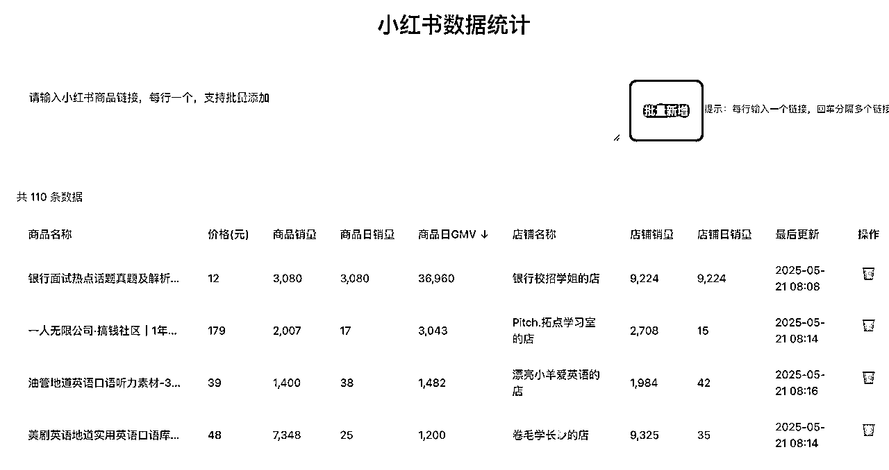
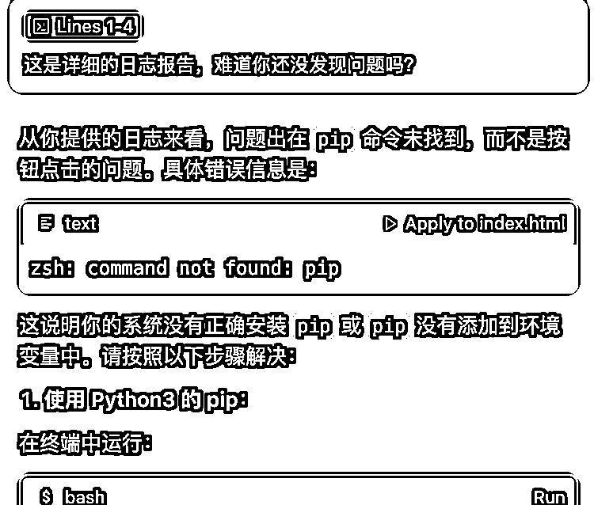
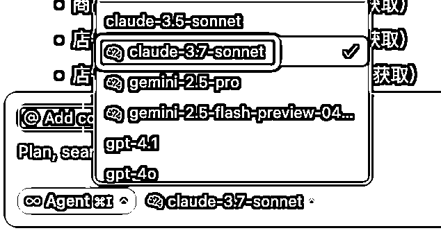

# 用Cursor搭建一个小红书商品监控系统

> 来源：[https://t5p7acblat.feishu.cn/docx/AafjdpTwxosTf2xhjTjcn5UKnag](https://t5p7acblat.feishu.cn/docx/AafjdpTwxosTf2xhjTjcn5UKnag)

大家好，作为生财4年的透明人，很少在生财发言。

难得写篇帖子，就很纠结怎么写一段开场白让大家记住我，想了很久不知道怎么写，索性不写了，毕竟社恐。

# 我在小红书做过的品

### 1、某某剧台词本，实体资料，做了30w+的利润。

这个品背后的需求是什么？

很多人会通过看美剧或者英文动漫的方式来学习英语，这样学习起来不会那么枯燥，又能给自己构建一个英语环境。但是现实情况是大多数人都会沉浸在剧情里面，不会去关注语法结构、词汇等等，最后什么英语知识也没有学到。所以需要台词资料整理出来，方便大家去记忆。

我构建的场景是什么？

我梳理了一下我的目标用户有两类，然后针对这些用户去设置对应的场景。

a.不知道看美剧可以学英语的人群

我构建的场景是：实拍一台电脑和一个台词本的视频，电脑上播放着电视剧的画面（尽量是有趣的画面，这样会勾起别人的兴趣。），然后一个人在观看美剧的同时在台词本上划重点笔记。配合的音频内容大概就是：原来看美剧学英语真的轻松啊，一边看着美剧一边把重点台词圈起来重点学习，学习效率太高了，不知不觉的就掌握了很多地道的英语表达方法。

b.听说过看美剧可以学英语，但是觉得没什么用处的人。

我构建的视频场景是和上面一样（也是实拍一台电脑和一个台词本），但是我的音频话术变了：原来这才是看美剧学英语的正确打开方式啊！以前看美剧只知道沉浸在剧情里，刷完好几部剧英语水平也没什么变化，现在才知道原来台词本才是灵魂。就这样一边看美剧一边在台词本上划重点学习，轻轻松松就掌握了很多地道的英语表达方法。

我提供的解决方案是什么？

这个项目是前年做的，我当时就是提供了纸质的台词本，打印成本也就十几块钱但是售价大几十块钱，而且退货率几乎可以忽略不计，可以说是暴利。

现在我发现有人提供了更好的解决方案，把台词内容做成一个飞书知识库，还把台词中的重点表达方法做了解析和例句。商品定价最低是48元，最高是99元，销量是7000+，这就是至少30w的利润。

感兴趣的可以看一下这个小红书商品链接→商品详情

这个项目我在去年彻底停下了，店铺也注销了，所以没有办法给大家看后台数据，因为这个项目还是有版权风险，也不建议大家去做。

### 2、***英语资料

这个是我现在正在做的项目之一，也是虚拟产品的英语资料，但是很抱歉不能给大家分享出来，因为还在产生利润。

给大家看一下其中一个号的后台数据把。

# 我的小红书选品策略

学术派总结：需求→场景→解决方案。

为什么说这是学术派？是因为我发现很多大佬做分享的时候都会讲类似的理论。无论是做小红书，快手，抖音甚至淘宝和跨境电商等等，大家都会提到类似的理论。讲句不客气的话：听到我耳朵都起茧了😭

但是当我自己做起来几个品之后再去总结，发现还真的就是这么一套理论在支撑。

所以后来我选品的时候就会去逐步分析这个品是否有需求，竞争对手是如何构建的场景以及解决方案是什么。我对这三个要素的简单理解是：

1、需求

我不谈小马的需求层次理论了，我觉得太学术派了。

在小红书上，我认为用户的需求分2种“我知道我要什么”和“我不知道我需要什么”。两者的差异是：前者依赖搜索流量，后者依赖推荐流量。比如我上面提到的台词本这个产品，其实主打的就是推荐流量：用户不会主动去搜索“**电视剧台词本”，即使去搜索这个产品，那也一定有价格比我低的，我不去卷。

2、场景

这些年我想“场景”这个词大家都听了很多很多遍了，但其实我想用一个简单的段子让大家更好的理解这个词：

什么情况下1+1＝3？

错误的情况下1+1=3

错误也是一种情况（场景）。

放到小红书里面，我们要思考的是“用户什么情况下会买这个产品”，这个就是小红书的场景。

场景的构建有很多种方法，面对不同的人群、不同的痛点都能构建出很多场景。所以我们需要很多种尝试，找到一种有共性的、真正有痛点的、市场竞争不算太激烈的场景。

比如一款美白产品，我们可以构建这些场景：

a.对开车人群：每天开车几小时担心晒黑怎么办？快用我们这款产品也让你变白

b.对不自信的已婚人群：你老公还在偷看街边肤白貌美的美女吗？快用我们这款产品也让你变白

假设你在做一款美白产品，是不是会觉得这两个场景基本上已经被大品牌给渗透，如果你进场就完全没有机会了？

没关系，我们还有更小众的场景：

a.对夏天骑车上学的学生：骑车晒黑，喜欢的女神逐渐冷落你怎么办？

b.对练太极拳的老头老太太：清晨练拳固然好，可是被晒的越来越黑跳广场舞都没伴怎么办？

c.对中老年：我的孙子因为我很黑而觉得我脸上很脏，所以不愿意抱我怎么办？

这些场景是否成立？不一定。所以去试试看吧。

3、解决方案

解决方案即我们售卖的产品。

针对一个需求，不同人有不同解法。比如美白这个大需求，有人做美白霜，有人做防晒帽，有人做防晒衣。

再比如我上面提到的“看美剧学英语”这个细分需求，有人买纸质资料赚了几十w，有人卖知识库赚了几十w。

# 讲点真话

感谢你有耐心看到这里，接下来我要给你泼一盆冷水：作为一个个体户，你真的有时间去研究这么多需求、场景、解决方案吗？

上面这些做法也是我之前上班时的工作方法论变迁过来的。

以前我有充足的时间去做各种分析、调研，还能有很多帮手帮助我一起去完成任务，更关键的是即使项目还处于调研阶段或者最终项目失败了，我的工资仍然不会少一分钱。

但是个体户不一样，只有手上的品还没盈利，可能吃饭都是问题，很难有心思沉淀下来。我没有办法对一个还没有做起来的品去做这么深入的研究，如果有这个时间我还不如多测几个品。更何况，调研需求、场景的结果很可能也只是一个书面报告，不等同于真实的情况。不得不说的是，这种方法论确实有价值，但我认为更适合高举高打，或者希望逐渐在一个某一个品类深耕下去的的品牌方。

把上面的学术方法拧巴拧巴糅合在一起，我觉得更适合我的选品方法是：找一个日GMV还不错并且比较稳定的品，研究一下自己能不能做类似的笔记。能就干，不能就放。

为什么我关注的重点是“日GMV还不错并且比较稳定的品”？

因为对手已经帮你把需求、场景、解决方案跑通了。

你的竞争对手不是给你一份虚头巴脑的调研报告，而是是实打实的用数据告诉你，这个品可以干！

以上，就是为什么我会需要一个小红书商品监控系统的缘由~（铺垫太长了请谅解😭）

咱们可以进入正题了：如何用cursor搭建一个小红书商品销量监控系统？

# 什么是cursor？

cursor是一款AI编程软件，完全可以实现零基础写代码。

我本科学的是软件工程，也不怕大家笑话，大学学了四年我完全不懂代码。

一方面确实是我完全没花心思去学，另一方面是我不懂老师讲的所谓“if”、“else”、“输出一个Hello World”有什么用？这些东西如何和用户的需求关联起来？

逐渐我就对专业完全放弃了。倒是后来利用cursor，我写了好些个程序出来，而且是能实际应用在我的业务当中的。一旦开始写程序，会发现沉浸其中无法自拔！

这里对于cursor的安装、使用等等我都略过不谈，这些内容在生财有术的航海手册里都有，真感兴趣的可以去刷一遍。

其实cursor的使用没有那么高深，一切只需要从说清楚需要什么功能开始，本质上是要求你对功能目标要足够清晰。

写一份准确的需求描述，我有两个法宝：讲情况、举例子。

a.讲情况

对于情况的准确描述，会让人有一种“你不用讲了，我知道你想要什么”的感受，能确保你所写的需求大方向上不会出错。

比如“我3天没有喝过水了，我现在感觉非常渴”。只要讲完这句话，其他人就知道你现在最需要的是水。至于别人是给你一杯奶茶还是一瓶矿泉水已经不重要了。

b.举例子

我们在描述一件事情的逻辑往往很容易让人产生歧义，但是举例子可以很大程度的避免这个问题。

举例子：

我们说“我要吃饭”，这是一个不那么清晰的需求，cursor可能真的只给你上一碗米饭。

这个时候我们可以举一些例子来补充说明“我要吃饭，比如辣椒炒肉盖浇饭、南昌炒粉”，这个时候我们得到的结果会更加准确一些。

就上面这段话，如果我只说“我们在描述一件事情的逻辑往往很容易让人产生歧义，但是举例子可以很大程度的避免这个问题。”，但是完全不举例子，你能真正理解我想表达的意图吗？至少每个人在阅读这句话时容易产生不一样的理解，放在cursor也是一样。

# 原始需求文档

1、需求背景说明

我是一个小红书商家，我希望能够关注我的竞争对手的商品销量的变化情况。

我会时不时的提供一个或多个竞争对手的商品链接给你，需要你去爬取对方的商品销量等数据功我参考。

2、数据爬取功能

我将提供给你小红书的店铺链接，你需要模拟用户点开链接，然后获取链接内的html代码去获取商品相关的信息；

比如我将提供这个商品链接给你：https://www.xiaohongshu.com/goods-detail/66e3bb1b1e3d5f00012ee4bd?xsec_token=YBHAo1C2rWX17vpX6AtetHUTYQGW_lu8GGjkJs91ZodoM=&xsec_source=pc_wind

你需要获取到以下数据：

商品名称：一人无限公司·搞钱社区｜1年会员｜轻创业案例库｜CEO运营笔记

商品销量：2014（随着时间推进，商品销量可能会有变化，仅供你参考）

商品价格：179（随着时间推进，商品价格可能会有变化，仅供你参考）

店铺名称：Pitch.拓点学习室的店

店铺销量：2708（随着时间推进，店铺销量可能会有变化，仅供你参考）

商品价格、店铺名称、店铺销量

另外你还需要注意的是，我发现有些商品或者店铺的销量超过了10000，那么数据会折叠显示。比如13000，就会显示成1.3万或者1.3万+ 这个时候你需要转化成13000。

3、数据爬取时间

我希望每次我每次添加商品的时候，就需要去爬取一次数据。

另外，你需要每天早上8点自动帮我爬取数据。

4、数据计算功能

爬取到了基本数据后。我希望你能够帮我做一个简单的计算，获得商品日销量、商品日GMV、店铺日销量。具体的计算规则如下：

商品日销量=今天爬取到的商品销量-昨天爬取到的商品销量。如5月22号爬取到的商品日销量是100,5月21号爬取到的商品日销量是99，那么5月22号我查看数据时，商品日销量就是1.

商品日GMV=商品日销量*商品价格

店铺日销量=今天爬取到的店铺销量-昨天爬取到的店铺销量。如5月22号爬取到的店铺日销量是100,5月21号爬取到的店铺日销量是99，那么5月22号我查看数据时，店铺日销量就是1.

4、数据展示功能

a.我希望在网页中有一个列表可以查看这些数据（商品名称、商品价格、商品日销量、商品日GMV、店铺名称、店铺销量、店铺日销量）。并且我还可以根据商品价格、商品日销量、商品日GMV、店铺销量、店铺日销量来进行排序。

我希望这个网页看起来简约大气。

5、数据下载功能

我希望在网页中，针对每一个商品提供一个数据下载按钮。当我点击这个按钮时，会下载一份excel表格文件，文件内容是这个商品自有数据以来每一天爬取到的销量数据。

例如，商品A是在5月1日添加的，那么在表格中要显示其5月1日、5月2日、5月3日的销量数据。

# 小红书商品监控系统成果展示

如图，这个网页可以帮我监控所有商品的日销量增长情况，辅助选品决策。

# 迭代思维

你是不是以为，把我上线的原始需求文档放在cursor中，就也能立刻拥有一套这样的系统？

那我又要泼冷水了：当然不行。

因为在实际开发过程中会遇见各种各样的问题，有可能是cursor没有理解清楚你的需求，也有可能你自己在开发的过程当中又有了一些新的灵感，但更多的可能是运行过程中出现各种各样的系统报错，比如这个字段缺失、环境错误、重复定义、空指针等等。

是不是感觉听不懂这些词？没关系，因为遇到简单的问题我们基本上质问一下cursor就可以了。

例如：我按照cursor的提示要求我输入某个命令，然后报错了。我直接反问cursor：咋报错了，什么情况？（附带错误提示）

好好好，你只说简单的问题如何解决，那遇到复杂的问题就直接关机睡觉就可以了是吧？

遇到复杂的问题，我们就需要化身为“没有专业能力、只会坐享其成的小领导”这一角色，去训练我们的硅基员工（cursor）完成任务就可以了。

不知道大家有没有遇到过那种业务能力很一般的领导。这种领导可能在实际业务上指导不了你什么，但是他能够作为局外人的角色帮你理清思路。

我们试想一下，当你遇到一个难题后向这种专业能力很差的领导报告，他会如何回应你？

他可能会说：是哪一个步骤出错了？为什么会出现这样的错误？你写一个详细的报告给我看看。（看吧！看吧！浓厚的班味儿又来了！😭）

其实我在让cursor帮我解决复杂的bug时，我也是用这个“写报告”这个法宝。

只要这个报告写的够仔细，那么这位名为cursor的员工便能自己发现问题从而进行优化。

例如：

第一步：pua Cursor，你连详细的日志都没有记录我如何指导你解决问题？

我发现点击“**按钮”没有反应，并且这个问题我按照你的提示去做之后还是没有效果。我要求你你在浏览器控制台输出一个详细的日志，这个日志要包含程序运行的每一个步骤，这样我才能明白问题到底出在哪里。

第二步：假装你发现了问题，然后质疑Cursor的能力

把浏览器控制台输出的日志报告截图给cursor，然后告诉他：这是详细的日志报告，难道你还没发现问题吗？

看看，看看，其实我看都没看一眼这个日志，然后直接截图扔给cursor，可怜的cursor就会帮我苦思冥想解决方案。

# 常见问题解决办法

### 1、无法获取到商品信息

cursor可能没理解我们给的商品链接中哪些信息是商品价格，哪些是商品销量等等。

这个时候我们需要利用浏览器工具来帮助，比如商品价格这个字段，我们右键选中，点击检查按钮会发现，在html代码中179标签中间的元素179就是价格，我们把这个信息告诉给cursor即可：我发现在html代码中，商品价格在标签的中间。

### 2、爬虫无法访问小红书页面

告诉你的cursor，请他使用这两个办法来爬取数据（这是一种小红书官方反爬虫的机制，我们不用纠结具体的技术细节是什么，反正cursor会处理）

*   采用无头浏览器模式（headless: 'new'）

*   设置自定义 User-Agent 来模拟真实浏览器

### 3、我的cursor不够聪明怎么办？

建议选择claude3.7的模型，听说gemini也不错，但我还没试过。

