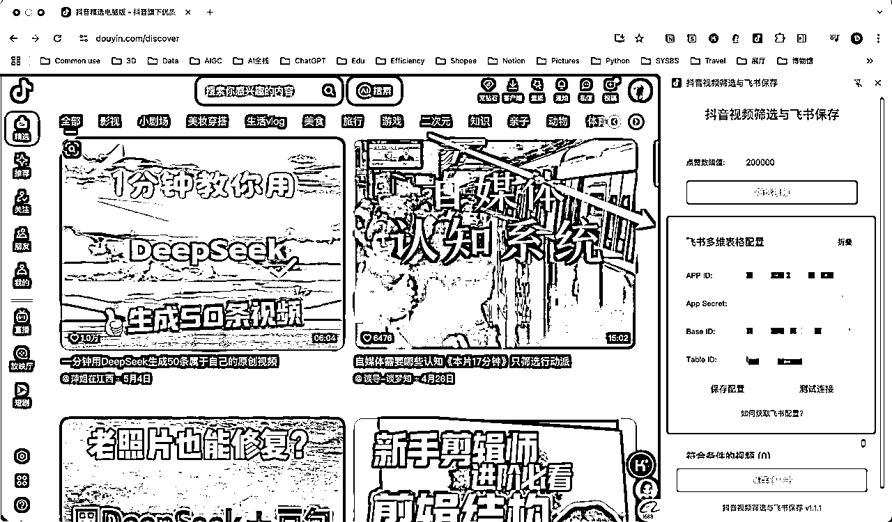

# 🔥一键批量爆款视频转AI 视频工作流

> 来源：[https://r0rel9lqdms.feishu.cn/docx/ApaJdYIkcohPKXxgVXLchBoSnwf](https://r0rel9lqdms.feishu.cn/docx/ApaJdYIkcohPKXxgVXLchBoSnwf)

做了一件十分有意思的事情，把@super 黄和@一泽的工具结合了下，做了一个只用点击1次就可以生成 AI 视频的工作流。可用，还算稳定，可迁移场景（只要是模版化的内容都可以优化生成），所以觉得是有意义的，分享给大家～👏欢迎有兴趣的朋友找我一起探讨定制工作流、优化效果🌹

# 一、一键操作流程+示例效果（视频）：

实际第一条视频生成耗时5分钟左右。

视频案例仅作工作流展示用，非真实使用。

# 二、工作流原理：

# 三、实现教程：

工具准备：

*   Chrome 浏览器

*   trae/windsurf/cursor都可

*   Coze 账号

*   飞书多维表账号

*   剪映小助手（下载地址：剪映小助手下载地址（请点击））

*   剪映专业版（电脑）

## 第一步：定制 Chrome 插件（抖音/小红书）

### Chrome抖音插件：

可以直接在@Super 黄的精华帖 获取；

（来源于@Super 黄）

### Chrome小红书插件：

在抖音插件的基础上，我用 trae改写了脚本，做成了小红书的插件。可以按照@Super 黄的教程自行开发，或者找我获取；

### ⚠️ 配置注意事项：

1、飞书多维表参数需要逐步配置：

APP ID、App Secret：在飞书“开发者后台”界面获取；

Base ID、Table ID：在飞书多维表的 link 内截取；

以上获取方法都可以参见@Super黄的如上教程

2、飞书多维表需要配置固定字段：

*   标题：文本格式

*   链接：超链接格式

*   点赞数：数字格式

以上两个配置容易在操作中忽视，出现视频链接不能批量写入飞书文档的情况（请不要问我为什么知道😅）

## 第二步：定制文生视频Coze智能体

具体步骤可以参看我的上篇帖子：

智能体：

工作流： @一泽

⚠️ 注意点：

制作Coze 智能体请在发布的时候点击“飞书多维表”选项，只有智能体才能嵌入飞书多维表字段捷径功能；

发布“飞书多维表”需要先点击“配置”，“控件”请选择成“字段选择器”☑️勾选所有选项就好；

发布需要审核，一般半小时左右。

## 第三步：定制视频转文案Coze智能体

有两种方法：

1.  自建智能体：请参照@Super 黄的教程

1.  调用字段捷径：直接在飞书多维表中调用“视频转文案”的字段捷径，需要氪金（登录 API 账号，买 Token）

1.  优缺点对比：

| 视频转文案插件 | 优点 | 缺点 | 适用场景 |
| 自建智能体 | 免费 | 提取效果不稳定 | 自用 |
| 调用字段捷径 | 提取效果稳定 | 氪金 | 商用 |

## 第四步：飞书多维表设置

打开与 Chrome 插件设置时同一份表格，就可以进行流水线操作了：

*   标题、链接、点赞数是固定设置；

*   文案提取——字段捷径——选择“视频转文案 Coze 智能体”自定义的名称；

*   风格分析——字段捷径——选择 Deepseek——输入指令*根据自己的需求输入，选择引用“文案提取”字段；

*   改写文案——字段捷径——选择 Deepseek——输入指令*根据自己的需求输入，选择引用“文案提取”字段；

*   火柴人视频——字段捷径——选择“文生视频 Coze 智能体”自定义的名称，选择引用“改写文案”字段；

⚠️注意事项：

*   飞书多维表的基础设置可以参考： 中的教程步骤；

*   字段设置时，请拉到最下面，开启“自动更新”选项。

# 四、商业价值：

### AI 的作用从效率工具到结果产出：

为什么要把黄叔和一泽的两个工作流拼一起，逻辑上，是把整个内容生产的工作链粗暴地打通了。既：爆款选题✅——生成大纲✅——生成口播脚本✅——录制✅——剪辑✅——提供封面标题及图片✅——发布运营（可写脚本实现）——数据复盘✅（智能体实现），整条线路的打通。从提升效率到直接产出可复用结果。

### 可迁移场景：

输入：抓取爆款内容数据

过程：url 转文本、文本分析、提取要点、改写、文生图/语音/视频

输出：图文/视频

由于工作流逻辑框架可实现，只需要根据自己需要的产出结果，倒推去设置工作流的执行标准（改 prompt）。只要是模板化的内容都可以实现，并且可能有比人脑更惊艳的分析和视觉呈现，比如（仅举例）：

结构化故事：

养生主题：

食物科普：

育儿知识：

当然还可以通过调用即梦、可灵等等工具设置参数生成自己需要的风格3D、超现实、赛博朋克、极简风......语音也是可以用不同风格的 tts，工作流插件里面是可设置的。之后要是还有https://www.lovart.ai/，惊艳了！

### 具有一定稳定性能：

理论上只要调用的插件稳定，整条工作流产出的质量就是稳定的。如果不行，有必要的情况下就多买一些平台的 token。

# 五、制作心得：

*   当把自己的想法💡一键真的跑通的时候，觉得还是挺小激动的。毕竟要人工选题、人手做一条视频出来，至少也得好几个小时。一瞬间还是会有种“这真的可以也”的惊喜。所以觉得一定要相信 AI 赋能后的各种可能性！

*   其实出来的效果还是比较粗糙的，只是迫不及待的想先记录就分享出来了。可优化的节点：

*   一是在调用工具的稳定性上要找到最稳定和跑最快的插件；

*   二是在 prompt 的优化，建整个工作流花时间最长的也是在调试产出的结果，会要一点一点的优化。尤其是做智能体，编辑人设的时候，限制条件需要越明确越好，不然智能体的回答会有漂移。

*   商业变现需要实践测试，有想法来个养成系实验🧪，在实践中看反馈；

*   这是一条技术小白搭出来的工作流。