# AI+养生视频实操步骤

> 来源：[https://kecr953yuc.feishu.cn/docx/ECO1dDsrto7TAyxVgJmcWVOLnZc](https://kecr953yuc.feishu.cn/docx/ECO1dDsrto7TAyxVgJmcWVOLnZc)

# 引言

大家好呀，我是大刘。3月DeepSeek航海最活跃的教练。龙珠圈友，多期AI航海教练。实体书《一本书读懂DeepSeek》作者。en，最重要的，也是一个有趣的人。

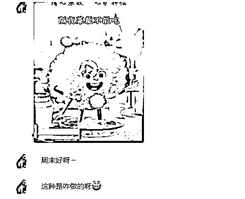

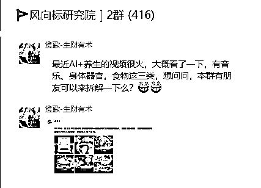

这几天有圈友找我交流这种养生视频怎么做的。正巧咱们风向标里面也有很多类似的养生AI+视频。非常开心收到澄歌大大的邀请，来把这类视频做个拆解。正值418咱们生财9周年。也算是献上一份小礼物。祝生财越来越好！也祝大家心想事成，多多赚钱。

提醒下，本次分享仅做技术实现分享哈，新手橱窗挂部分养生商品需注意资质~

## 视频分类

目前刷到的这类视频还是以养生类为主，从画面呈现上说，包括食物、身体器官、音乐、茶等类型。其中食物和身体器官刷到的最多。当然，这里只是指同类型的卡通拟人类型的视频。而且大部分视频点赞、转发、评论量都还挺不错的。

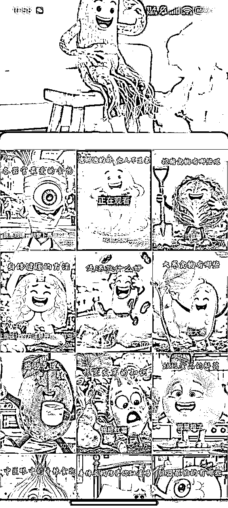

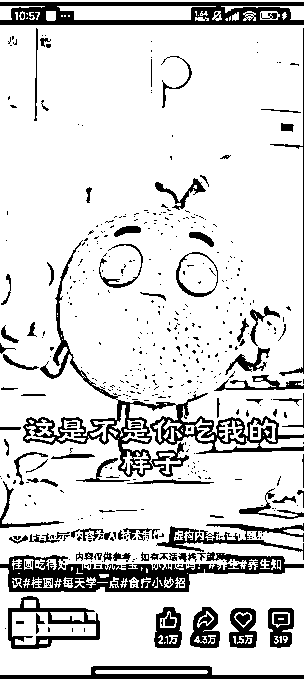

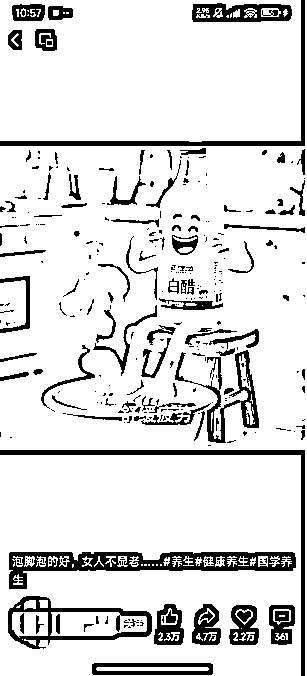

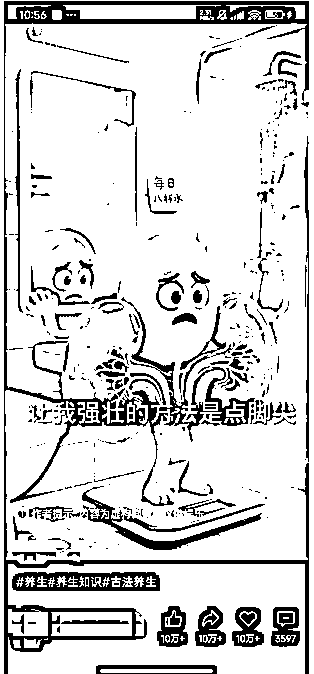

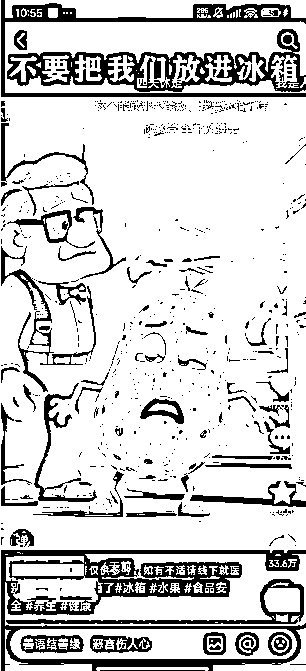

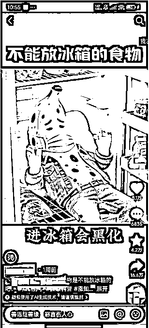

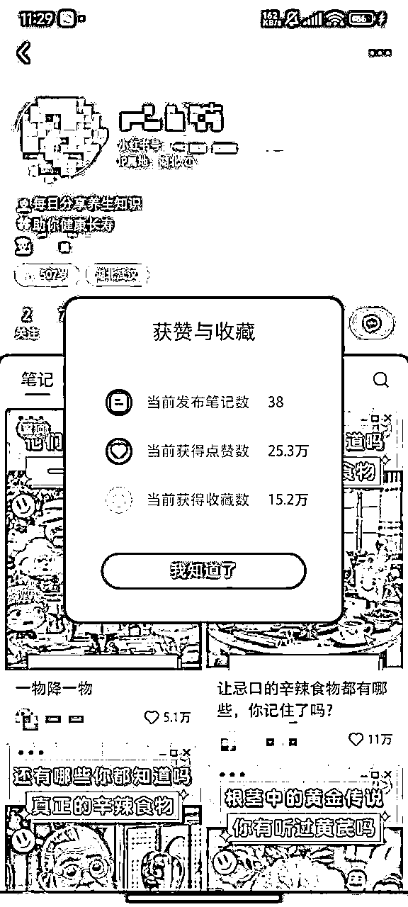

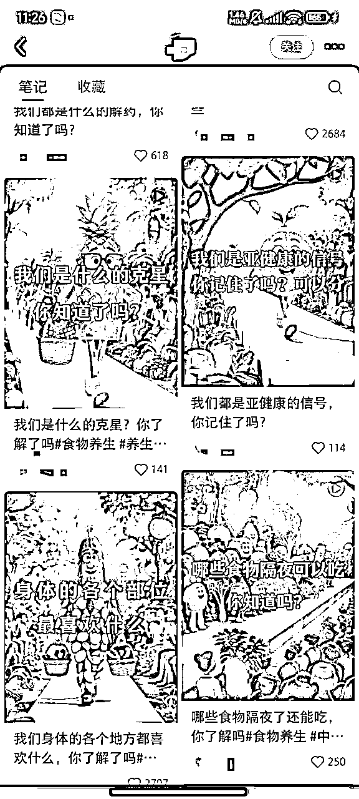

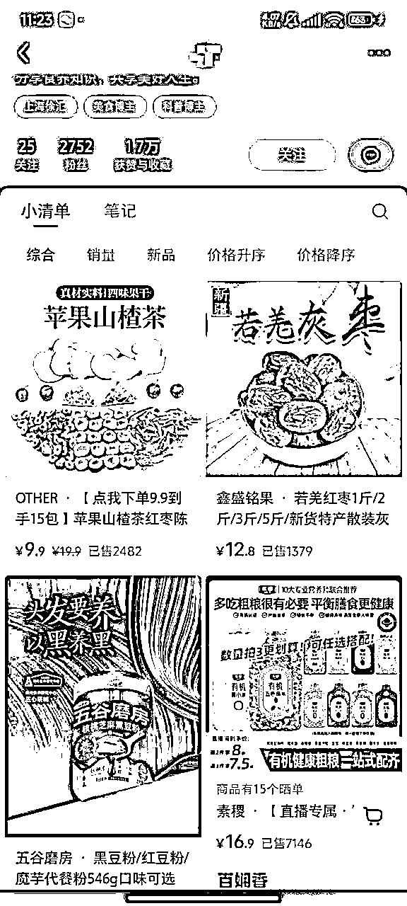

## 变现方式

因为我自己现在不是做养生赛道的。所以没办法说“具体每个账号”能赚多少钱。

但是通过疯狂的刷这类视频的账号。稍作总结。现在主要的变现方式

*   视频号：涨粉、广告分成（评论区广告）、橱窗（养生商品）、收徒（教人制作视频，收费99-399不等）

*   抖 音：涨粉、橱窗带货、收徒、恰即梦or剪映的推广（需要累积在其他推广收益累积达到10元，可在抖音搜索"即梦AI推广任务"）

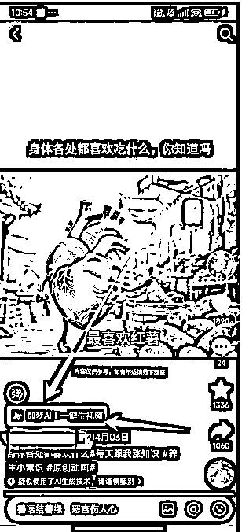

*   小红书：涨粉、小清单（带货）、收徒、引流（有一个还是卖成人用品的）

*   视频号广告分成需要有100以上有效关注数且有原创作品。之前大概是1W播放5毛左右。这个收益很有浮动，取决于用户点击评论区的广告。要是不点开评论区滑到广告位置，或是点击广告。收益率会有所降低。

*   橱窗的转化率算一般，看到很多出单几单到几百单不等（主要是视频中没有引导，基本靠点头像进去）。

*   收徒和引流可以看成是同一种，通过小号引导、简介留微信、群聊留微信、账号ID等于微信等等方式。转化率要看价格和话术了。

变现的方式一如既往，还是圈友们一直使用的那些，只是视频换了个新东西展现。

# 制作流程

整体制作流程分为提取对标文案—>仿写文案—>生成图片—>图生视频—>配音剪辑，5个步骤。

## 提取参考文案（各种工具）

*   我们可以先在视频号或者抖音上找到对标视频，利用工具获取文案。

*   工具各个渠道都可以找到，例如咱们生财官网里面搜关键字。或者微信上直接搜关键字“抖音文案提取”、“文案提取”等等。

*   这里分享个好用的工具，豆包。

*   比如抖音视频，点击分享时复制链接，然后直接发给豆包，让豆包来提取视频文案。

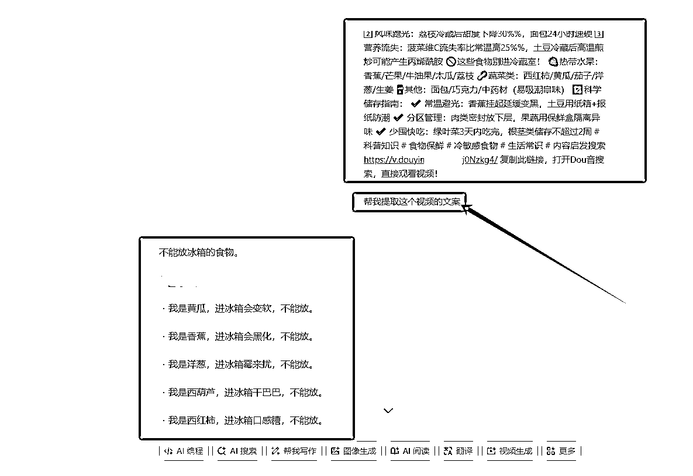

*   要是有两部手机或者有电脑的朋友，有个骚操作。直接用其中一个手机播放视频，然后另一个手机打开微信对话框，语音转文字。

## 生成文案和图片提示词（DeepSeek）

*   把文案复制粘贴到DeepSeek中，让DeepSeek根据这个参考内容，写类似的文案，以及文案对应的图片提示词。

【我是黄瓜，进冰箱会变软，不能放。我是香蕉，进冰箱，会黑化，不能放。我是洋葱，进冰箱，霉来扰，不能放。我是西葫芦，进冰箱，干巴巴，不能放。我是西红柿，近冰箱，口感遭，不能放。我是南瓜，进冰箱，烂得快，不能放。我是土豆，进冰箱，糖分高，不能放。我是茄子，进冰箱，会变皱，不能发。我是芒果，进冰箱，香味消，不能放。】以上是我的参考词，需要你帮我根据参考词的格式和内容，重新帮我写一份类似的文案。要求每一种不同的内容，对应有一张图片的描述词。先单独给出文案，再把文案和描述词用表格的形式展示。

*   这里直接以新手的角度来写的提示词。可以看到效果不是很好，因为没有背景之类的元素。图片大概率不是很好看。

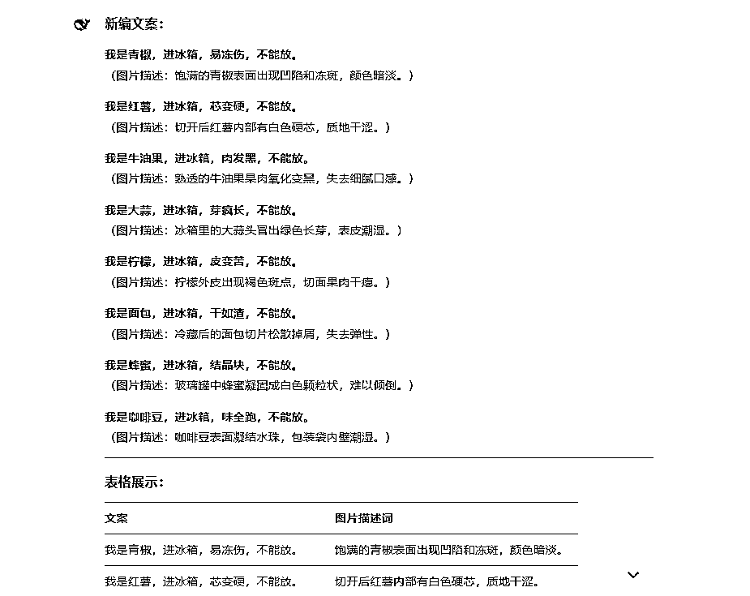

*   这里用一个小技巧，把参考视频截个图，发给豆包，让豆包帮我们反推提示词。

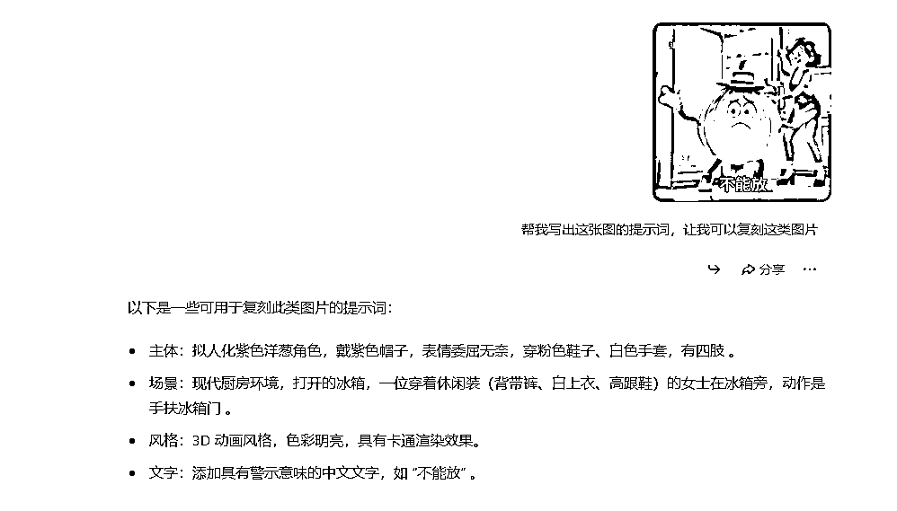

*   再把这个提示词作为参考发给DeepSeek作为参考。可以看到效果好了很多

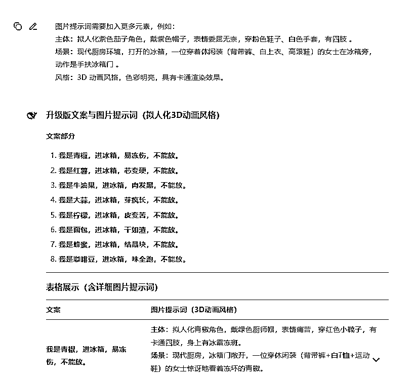

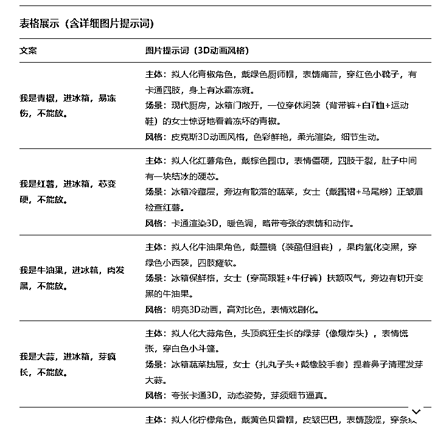

## 即梦生成图片（即梦）

*   复制DeepSeek给的图片提示词，打开即梦文生图，把提示词粘贴进去

*   设置图片比例，模型选3.0，效果会比较好。点击生成图片

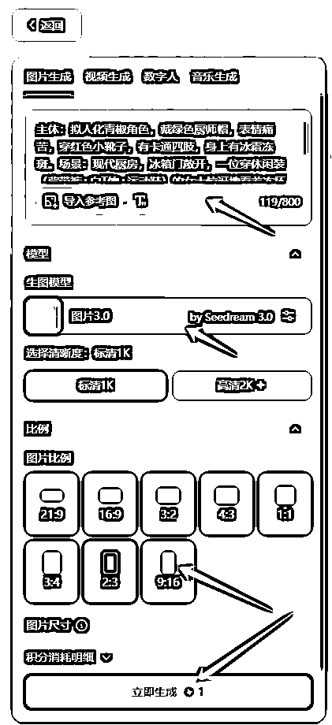

*   在右边可以看到生成后的图片。

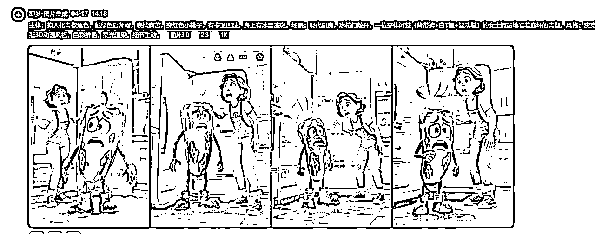

## 图片生成视频（即梦）

*   生成图片后，选择一张满意的图片，在图片右下角点击生成视频。

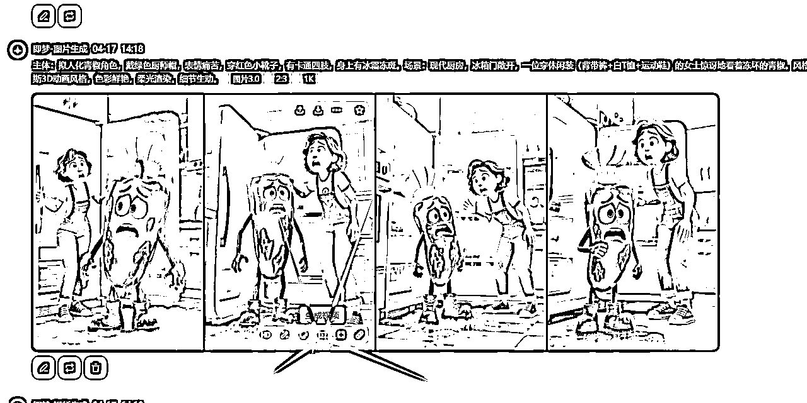

*   这里会再次让输入提示词，可以手动根据图片重新输入"右边的女孩把青椒往往冰箱里面推"，也可以不用改动，直接再次粘贴刚才的图片提示词。当然也可以偷懒不输入提示词，让AI自由发挥。（反正也不需要对口型）

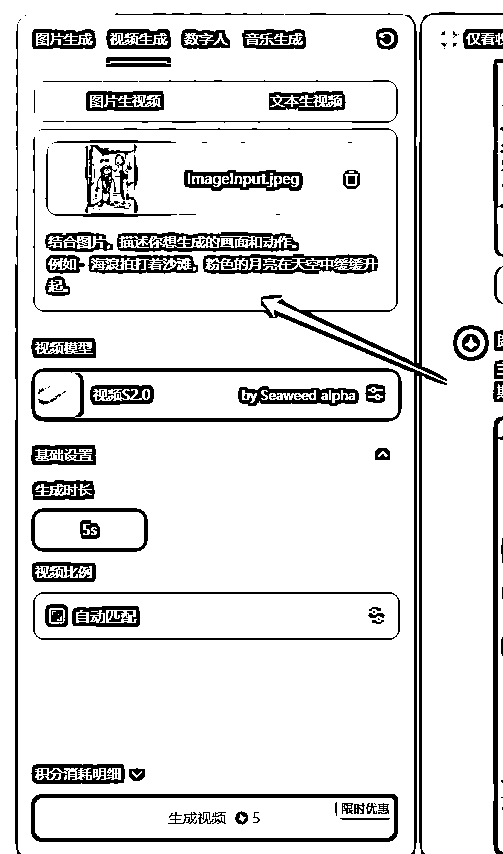

*   上面的步骤重复操作。复制下一段文案图片提示词，生成图片，再转成视频。直到所有文案的视频生成完毕

## 合成剪辑（剪映）

*   把所有生成完成的视频导入到剪映中。

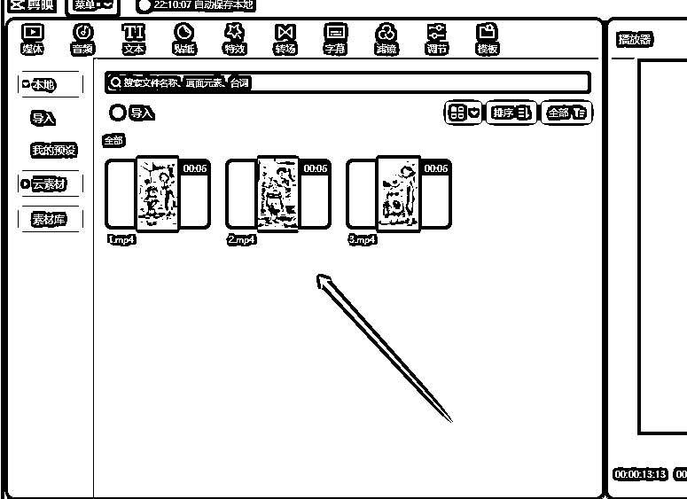

*   新建文本，把文案复制到文本中。

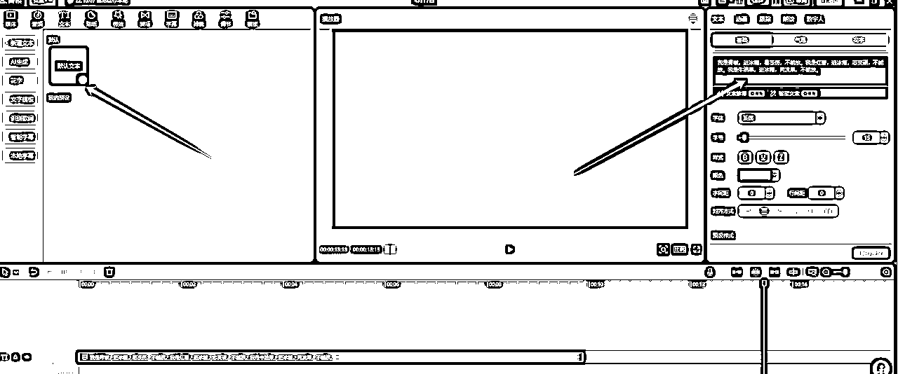

*   点击右侧朗读，里面选择音色。再点右下角的朗读，这里可以整段文案都用同一个音色朗读。也可以每个文案单独用不同的音色朗读。区别在于分开朗读就要多建几个文本。每个文本单独设置音色朗读。

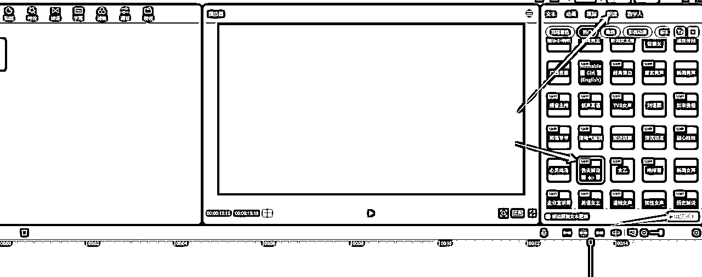

*   删除文本，手动调整一下音频，因为有些音频中间停顿有点长。重新点击音频识别文案。为什么要多操作这一步呢？因为之前我们的文案都是粘贴到一起的。这里重新识别可以帮我们根据语音和文字对准位置

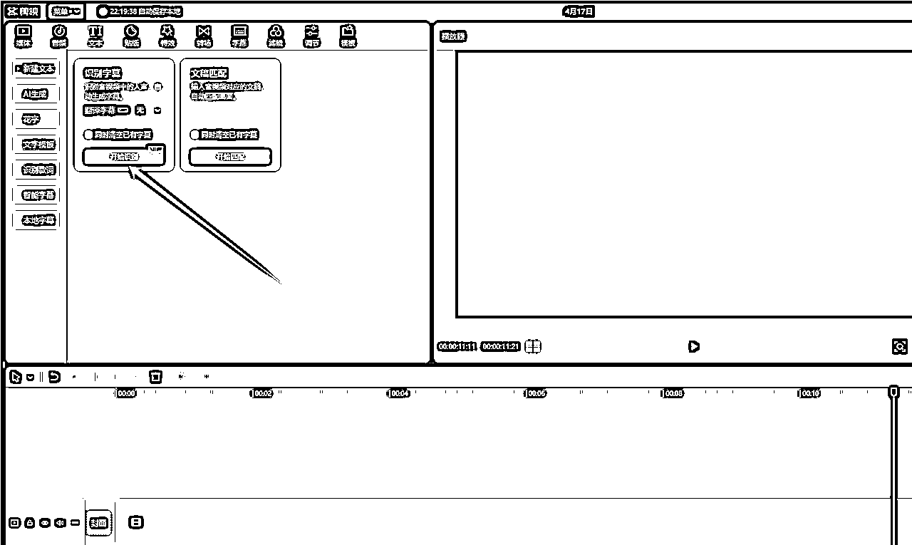

*   添加视频，根据文案长度剪辑各个视频。

*   再次一个小技巧，视频不要直接放到主轨道上面，可以把视频放到上面一层。免得剪辑的时候下面的语音和字幕会跟着变。

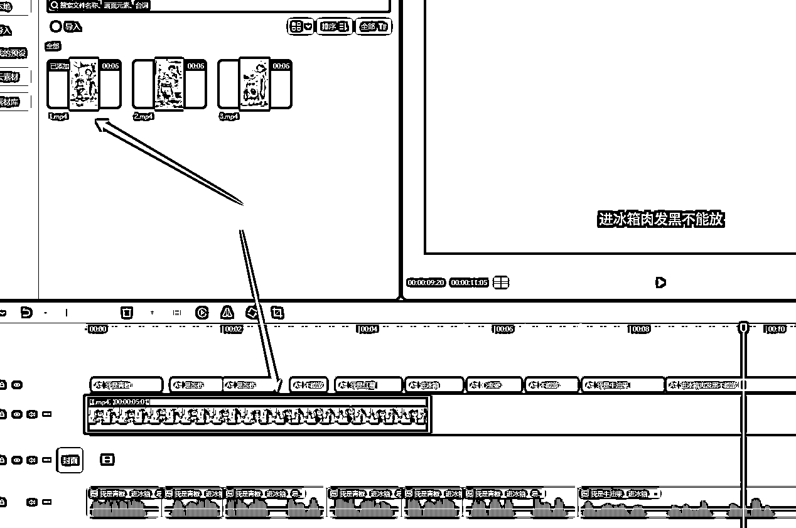

*   又一个细节，视频有时候比音频长，建议可以用变速，比直接剪掉更好。因为即梦视频动作相对较慢，而全视频平台动作幅度大一点，可以更有冲击感。

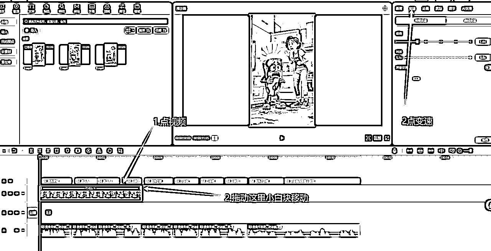

*   最后设置字幕的颜色，添加标题，添加视频背景音乐等。

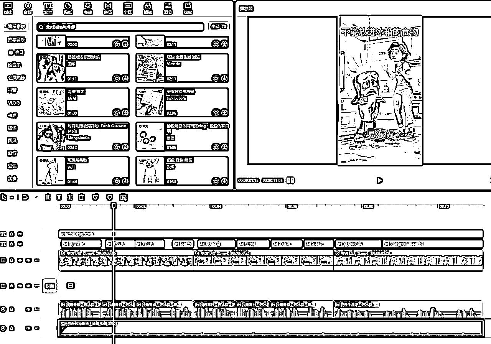

*   自此，一个视频就复刻完成了。完结撒花❀。效果如下

# 延伸领域

以上面演示的视频为例，可以看成是养生类型，那从养生的角度来看。也可以做古人教养生秘诀。这是养生领域。

从器官健身的角度来做类似视频。就是健身领域。

一些热门的教育对话也可以用这种方式来做，只是把画面提示词换一下而已。比如换成一个妈妈和一个孩子。这种动漫甚至不需要用其他AI工具对口型。只要画面中人物的嘴在动或者手在动就可以。这是教育领域。

上面的演示视频还可以看成科普类。一到科普类，那就更广了啊。比如我卖乐器的，我就生成各种乐器来配文案。例如“我是唢呐，能送人来，也能送人走”。比如我卖水晶的，就借助动漫的角色说自己的优点等。我是上班的牛马，还可以发发怨气，引起其他牛马的共鸣。这是科普领域（万物领域？）。

感谢大家看到这里。如果这次分享能给你带来一点收获或帮助。也可以点个赞让我知道。下次才更有动力肝帖子分享更多的内容~

祝你好运~ 我说的是每一天都好运~