# 手把手教你小红书获客和私域运营（祛魅篇）

> 来源：[https://diopczaeo03.feishu.cn/docx/PCL6dvF44ozzrhxLtANc0fMHnBb](https://diopczaeo03.feishu.cn/docx/PCL6dvF44ozzrhxLtANc0fMHnBb)

## 一、引言和背景

大家好，我叫yeye/耶耶，汕头人，广州暨南大学大三在读，2024年4月加入的生财，曾做过有货源和无货源电商（小红书、抖音）和私域（情感，雅思/托福，k12）25年大方向依旧是私域获客和运营。

生财培养了我的商业思维以及各方面认知，在加入生财之前，我只知道互联网可以做网红带货卖课和电商赚钱（毕竟10个潮汕人创业有9个做电商哈哈哈）进入生财后才发现原来世界有这么多项目。对于我来说，大学上课出勤率10%，生财大学出勤率接近100%。

4.9号亦仁老大在提到小红书相关，如下图所示

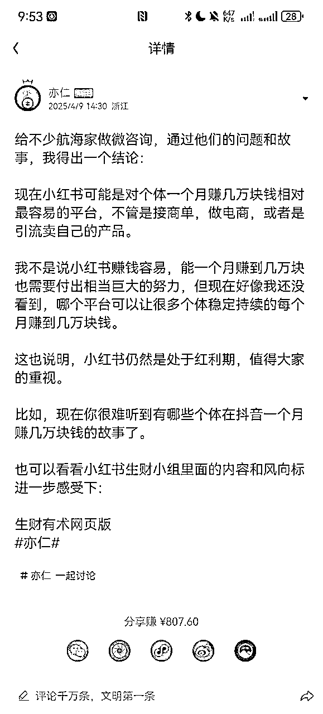

赚回圈费真的是有手就行（一年前我不信，现在信了）但在赚到第一块钱之前，也因为生财各种大佬和数据而异常焦虑，走了很多很多弯路，做了很多低效率的事情，曾与航海家圈友共事，面试近百家流量公司，也在一些私域/电商公司实习过

但我发现在电商/流量公司待过的和没待过的人，中间的信息差巨大，核心还是有没有祛魅，存在滤镜。

因此我想结合我做多个项目经验，写一篇小红书获客和私域运营相关的文章。本文会尽可能简单通俗，会用大量的真实案例和数据给大家普及如何0-1，1-10赚到人生第一桶金。

本文适合受众：

1.  看生财有术文章没有大方向？无头苍蝇？

1.  不知道选什么赛道？感觉赚钱好难

1.  不知道怎么做流量/销售/营销？

1.  不知道怎么全方位放大业务？（1-10，祛魅）

1.  想了解运营，但不懂运营的细节？

1.  不懂行业黑话？对私域/电商有畏难情绪，懵懵懂懂（比如打粉，矩阵，sop，投放）

1.  直男，接触女生少的，不注重细节的（不注重细节，怎么精细化运营？）

1.  缺乏执行力，不知道怎么定目标，不懂算账

1.  感觉自己懂很多，但是依旧没赚到钱，迷茫

全文3w字，预计阅读时长50-60分钟。

目前主流线上社交平台变现的形式

1.  广告收益/商单/直播带货/打赏（接广，新人不是那么建议，因为门槛不低，这方面做的好的是一些经纪公司（mcn）或者大博主，一个20-60s的广告20w到账，但普遍需要露脸，你会不会整活/有没有特色/镜头感强不强很重要，较难拿到第一个正反馈）

1.  电商

1.  私域（和微商差不多，不过是装b的说法）

私域：

你自己能直接联系和运营的客户群体。比如微信、QQ群、或者自己App里的用户，这些都是“私域流量”。你可以在这里直接和他们互动，做营销活动，不用担心平台规则的限制。

公域：

公开的、用户量巨大的互联网平台，你可以在上面吸引用户，但是这些用户并不完全属于你，受平台限制。 比如抖音，小红书，快手等

小红书目前的优势：

1.  门槛相对较低（图文以主，不太需要剪视频）方便规模化

1.  商业化逐渐成熟，投放相对抖音简单操作

1.  小红书平台调性高，高净值人群/韭菜相对较多

虽然现在国内各大平台引流整体没那么容易了，但相对抖音快手平台，小红书依旧是最好的论坛和种草平台。（我是各大短视频平台深度上瘾用户，抖音是算法最牛逼的娱乐软件，没有之一）

## 二、如何选赛道和项目

我认为有三个判断体系可供参考

### 1.宏观市场分析

现在赛道这么卷，哪里还有出路？

只要赛道在增长的，这个盘子会被越卷越大，会越来越细分化。个人努力倍数*5，赛道*2，则个人利润*10。

哪怕赛道很卷，但，弱水三千，我们只取一瓢

宏观市场分析，引用生财大师兄杨涛的观点

选项目的三个法则：

*   基本面大不大

受众是否足够多，比如沙县小吃的受众就非常多，老少皆宜，可以天天吃，星巴克的受众相对而言比较小，但不意味着星巴克比沙县小吃差，毕竟星巴克走的是精致小资路线，路线和受众不一样，但生财更多小伙伴是轻创业，我们没资源，需要容错率更高，成本相对低的赛道

*   发展趋势

人群是否递增，例子：时间拉长到10年来看：医美，口腔，高端服务业显然是上升趋势，母婴显然是存量市场，除非出很多政策利好消费，鼓励生育

*   系统性稳定

是否受政策和平台影响，一刀切。灰黑产（高利贷，玄学，黄赌毒等）显然就是系统不稳定性，私域相对而言会更加安全（当然只是相对，微信号也会被封）能够带着用户穿越周期。

如果硬要补充一点的话，那就是能否规模化和标准化

注意：产品规模化和标准化意味着很难高客单高利润，因为高客单交付往往会相对较重，高客单通常是非标准化，带有一定程度的定制化。比如医美，情感，大健康，留学，高端定制旅游等。除非你做出课程或者社群这种边际成本很低的产品

边际成本低

举个例子：做一个课程，我只要做出来了，我无论卖给多少人我都不需要额外付出精力。演唱会和唱片也是一个逻辑，只要我开一场演唱会，无论是1000人还是5000人，并不需要增加多少精力，多一个座位而已。

很多圈友看到别人天花缭乱的数据，真的会很怀疑是不是自己赛道不够好，我曾经也是。到后来我见了不少圈友，也待过一些流量公司，才发现大家在做自己项目的同时也在观望其他人的赛道，哪怕对外说自己年入xxxw，单月几百万销售额GMV，很多你看到的只是别人想让你看到的。

当你发现目前已经跑通项目了，已经赚到钱了，就不要轻易换赛道！！哪怕没那么香，哪怕不符合上面三个法则。

哪怕短期主义，但先赚着先，能够短期的暴富也是一种能力，赚钱往往是一阵子的事情（一个爆款模板，一个爆款视频，电商一个爆品吃几个月，销售一个大单够吃一个季度，凡是做生意赚钱，赚大钱都是一阵子的事）

能合法赚快钱的时候就闭着眼往前跑，如果可以持续短期暴富那也是相当有生活了！！

选项目就像在我们单身时，对未来伴侣会列很多条件，比如年龄，身高，家庭条件，性格，学历等等，但当我们和对象三观匹配，能够一起进步搞钱，还都在生财有术，这个时候还需要看什么条件？条条框框更多只是一时无奈之举。

当然这种选项目的逻辑有一个局限性，那就是过于宏观，万一这个赛道要10-20年后才起飞呢？就好比买股票，你知道这个公司10年后一定会起飞，但是短期5年不会被重视，几乎无人问津，你愿意买入并持有10年么？从一开始就要想明白一个问题，你是打算投机套利还是投资，是打算做短线还是长线，短是多短时间，长是多长，赚哪一部分的钱。做项目也一样，我们心里可以简单估个底，我们能不能坚持做1-5年？

### 2.自身资源盘点

根据第一个法则，大家会发现我们有特别多赛道可以做，其实不然，有很多赛道我们没实力做（更准确来说，是没耐心）大家都知道是好赛道，比如说医美

有人说，完全可以单纯做流量啊，但单纯做流量，我们会发现几件很尴尬的事情

*   频繁封号/审核都过不了

*   不会剪视频，ps（有些赛道人均口播，人均实拍就不要再进去了，除非你有一定的资源/实力）

*   没有模特（特别是医美赛道，每次看医美/化妆视频都给我一种反差感，变化真的很大）

*   买设备（觉得自己拍的视频质感不好，其实很多时候根本没必要）

*   销售周期太长，销售乏力（对用户痛点不够了解）

比如说，你不是医美受众，那你可能不知道超声炮，水光针，光子嫩肤，欧洲之星，点阵激光，热玛吉

比如说，没有经历过高考，那你可能就不知道新高考，一轮复习，二轮复习的侧重点和学生的痛点

比如说，你没在市场独立赚过钱，你就很难做商业粉，你不知道赚钱路上会遇到什么样的问题

当然这些我们可以去抄同行，但想要做出差异化是比较难的，一开始也没有什么优势，因此个人建议先去做一个你很熟悉/小众细分赛道，拿到第一个正反馈，赚到第一块钱，等赚到钱有了体感再去研究高净值赛道。

如何盘点自己的资源（感兴趣的可以看一下，建议结合ai，让AI给你盘点）

耐心/长期主义很重要，但实力更重要，不少有结果的大佬会提长期主义，但长期主义是需要一些实力/阅历在的，如果从来没有正反馈，怎么可能坚持下来（就好比健身，一直没结果，谁能坚持下来）

有些赛道和平台未来大概率是要起飞的，但可能是5年后，也可能是10年后。不意味着我们现在要梭哈，我们留点注意力即可。比如说哔哩哔哩app，一个年轻人最多的平台，如果时间拉长3-10年，肯定是有前途的，但这些年平台亏了不少钱。

近五年各大自媒体平台年度利润表：（单位：亿元）

标注：

*   快手 2020 年 “-80.00*” 为调整后净亏损（剔除优先股公允价值变动等非经营性因素，原始报表亏损 1166 亿元，主要为一次性会计处理）。

*   小红书 2020-2021 年未公开具体财务数据，亏损状态为行业普遍认知；2022 年后数据来自彭博社及第三方机构估算。

*   抖音数据为字节跳动集团整体利润（抖音业务贡献超 80%，2022 年后为公开财报或权威信源披露值）

同比抖音和小红书，bilibili业绩实在有些难看，本质还是商业化还不够成熟，大机构在这个平台不怎么投放（平台利润主要由广告和电商业务构成）赚不到钱，可能是年轻人群付费意识弱，平台调性差（娱乐抽象）等等。

我们要的是赚钱，要拿到结果，那我们就应该优先选择有一定确定性的赛道或者平台。

钓鱼第一条法则：去有鱼的地方钓鱼，第二条法则：遵循第一条法则。

如果你有耐心/能力的话，那固然可以陪平台/用户一起成长，前提是当你看到其他人在抖音/小红书赚麻了，你不眼红，你说你有定力。

不出意外的话，未来几年是小红书和bilibili的时代，当然抖音依旧是最强的，只不过抖音商业化太成熟了，品牌方/大机构框框烧钱，我们很难赢。如果你有实力一定要做抖音。

### 3.基于单粉产值/LTV评估

如果你已经做过不少赛道了，赚到一些钱了（30w内），那恭喜你！这篇文章也适合你。

我要引入一个概念：

单粉产值：

一个顾客到你微信你能产出多少钱。可以作为一个指标用来判断你的赛道天花板。

比如：你卖的商品平均利润是50元，10个加微信的顾客里有2个买了东西，那么每个加微信的顾客的“单粉产值”就是 (2 * 50) / 10 = 10元。

客户生命周期价值（LTV）：

什么是LTV?(Lifetime Value)

一个顾客在TA与你的品牌或公司建立关系的整个生命周期内，能够为你带来的总价值或总利润。简单来说，就是这个顾客“一辈子”能为你贡献多少钱。

这两个概念在我看来是同个意思，所以大家也不要被这些行业黑话给吓到。

行业黑化优点就是提高内行沟通效率，缺点就是提高了进入的门槛。在外行来看就是在装b

为什么单粉产值/LTV很重要？

衡量顾客的价值： 帮助你了解哪些顾客更有价值，从而更好地进行客户管理和维护。

指导营销决策： 了解获取一个顾客的成本是否低于TA的LTV，从而判断你的营销投入是否划算。如果获取一个顾客的成本高于TA的LTV，那你的营销策略就需要调整。

预测未来收益： 通过分析现有顾客的LTV，可以帮助你预测未来的收入，方便定kpi（结尾提及）

直接上数据和案例：

我之前待过半天的情感挽回公司（这个团队内部沟通问题很大，sop也没有，流量很不稳定，带我的空降主管叫我快跑，我拿到短期数据和爆款模板就跑了，现在团队已经解散了）

大概8人左右，因为这个团队在流量端就开始筛选有意愿付费的顾客，所以用户都比较精准，转化率相对较高，单粉产值181r（相当于只要有一个人加你微信，你的账户差不多多了180块）

进线：多少人加我们微信

一开：成交第一单，一般是低客单，体验一下

二开：成交第二单，升单操作，可以理解为复购

我们还要考虑效率，现金流（后文讲）：

比如说你引流的难度（竞争对手多少）和销售成交的时间和难度，都是需要考量的。

1.  假设客单价3w，但一个月引流100个人的话，假设转化率是2%，那月销售额30000*100*2%=6w

1.  假设客单价3k，但一个月引流500个人的话，假设转化率是5%，那月销售额3000*500*5%=7.5w

因此不是说赛道客单价高，单品利润越高，听起来更高级，A赛道就一定好，还要看你对赛道的敏感度还有你主观意愿度（千万别小瞧主观意愿度和厌倦度，同样的项目有人做的浑身难受，有人做的风生水起，很多圈友赚第一桶金真的是巧合，对项目好奇就直接下场实干了）

哪怕是同样的赛道，不同团队的单粉产值会不同，因为前端来的用户质量和销售营销/能力也会有所差异，优秀的团队能力才是核心竞争力，任凭风浪起，稳坐钓鱼船，因此，少怀疑赛道的上限，多提升自己/团队的核心能力才是王道。

ps：同样是生财的风向标小项目，我发现有精华帖写一个月赚1.5k，但我之前最高月收益是3w。

## 三、0到1你需要什么？

### 1.生财思维/认知

想赚钱，主要有三种变现模式。

1.  流量驱动（产品不算特别强，差不多刚刚好的水平，常见就是各种服饰，日用品，沙县小吃（你吃不出多大区别，只要有持续的人流就有概率变现））

1.  产品驱动（小米汽车，deepseek，电影哪吒，黑神话悟空，微信等）一个爆款，公司直接原地起飞

1.  模式驱动（互联网，共享xxxx（充电宝，单车），chatgpt，短视频，亚马逊）模式驱动可以理解为发明一个新的东西，和99.99%的人没太大关系。

产品驱动，模式驱动的商业模式很难很难，跟创业差不多，但如果仅仅只是想赚钱，做点生意，做点副业，难度指数下降，当然依旧不轻松。

在第二节，我们选项目提到盘点资源，其实就是看看有什么服务/产品自己能卖？

如果是虚拟物品，优先选择：

咨询---陪跑---课程---社群

为什么？

因为越是靠前，我们不需要在产品端发力，可以集中精力在流量和销售。

千万不要一开始就做知识星球/微信社群，交付很重很重，不要看生财做的很好，人群破了7w，背后可是有那么多鱼丸和运营和嘉宾一起发力的结果。

也不建议一开始就做课程（除非你很有自信会坚持做这个赛道），现在除了ai课很少课程能卖个好价格，普遍都是做5.2r，9.9r，作为引流品，结合陪跑一起做。

不管怎么样，最后还是需要回归到流量，去宣传，去落地，让大家知道产品。流量和销售是所有行业都绕不开的槛。

要赚钱，首先我们要培养商业闭环的思维（MVP，说白了就是卖产品赚到第一块钱）

最小可行产品（Minimum Viable Product），是指产品开发过程中在阶段性的产品迭代中最小化功能和特征，以快速验证和检验产品想法的一种方法。

MVP必须要解决以下三个点：

*   流量----------------客户从哪里来？（客资/线索/引流/打粉）

*   转化----------------如何把产品卖给顾客？（销售/营销）

*   产品----------------你的产品是什么？/你提供的服务是什么？

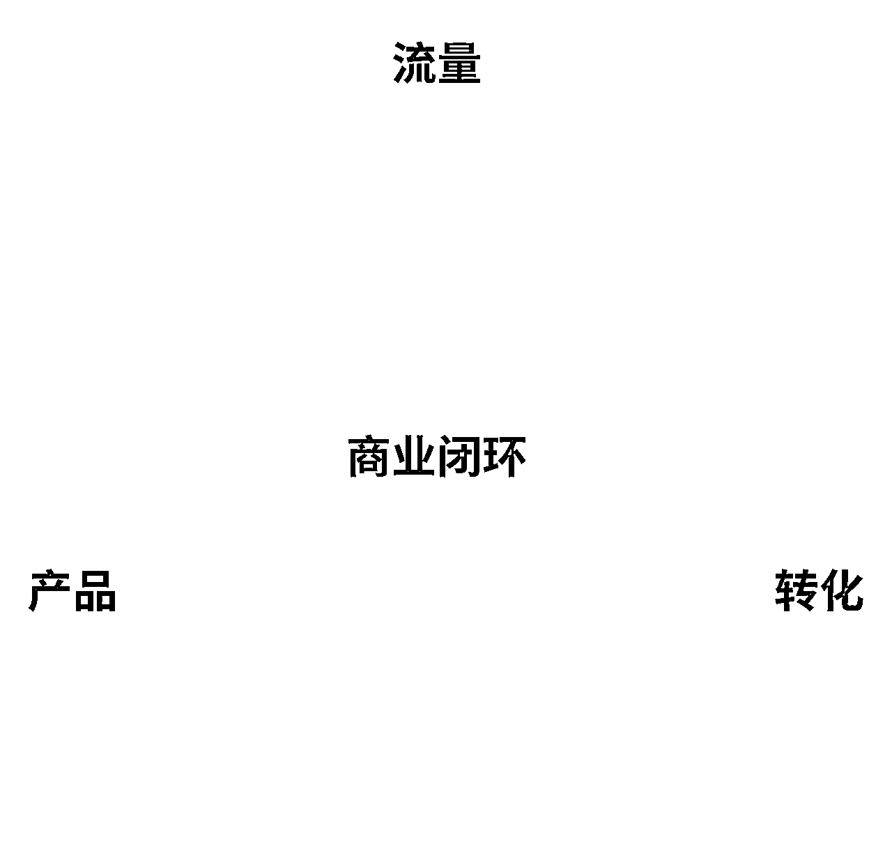

如果这三者都能自行跑通，那就是自营盘。如果只是做流量，那就是CPA（也有人叫做打粉/引流），如果同时做流量和销售，那就是CPS

CPA (Cost Per Action)

例子： APP推广，“每次成功注册付费5元”。如果有人通过你推广的链接下载并注册了这个App，你就能获得5元的推广费用。比如广州地铁口就有不少人拿着滴滴二维码，说：帅哥打车吗？三块钱

CPS (Cost Per Sale)

例子： 最常见的就是分佣，比如生财有术推广，你卖出去一份，你就能赚850r佣金，你不需要负责后端的交付，利润高且还能积攒自己的影响力，妥妥好生意啊！

自营盘的门槛较高，对个人/团队的综合能力要求较强，因此新人赚钱建议先从cpa/cps开始，也就是做中介

只要你的搞流量能力和销售能力足够强，后端团队会自己找上门的。（现在大部分项目，会搞流量和销售才是甲方，如果你想长期主义，赚复利的钱，且有信心有实力，那就直接做自营盘）

介绍一下我自己看生财帖子的方法论/思维（可以直接照抄）

主/副线的思维（主线是地基，副线是高楼）

1.主线：围绕“流量-转化-产品”这个闭环

流量：顾客从什么渠道什么方式获取，对标同行，是付费流量还是免费流量，怎么放大的

转化：如何成交顾客（如何一步步挖掘顾客的痛点）形式是电销，还是微信1v1点销，群聊成交，还是纯朋友圈营销（后文细讲），公域直播成交，私域直播成交（自己开发网站，避免直播间因为敏感词被封）还是会销等

产品：自己做产品还是别人的产品，有货源/无货源，产品是虚拟服务还是真实物件，成本/利润大概多少，回款周期（估算一下））对标同行？

2.副线：团队搭建（人才培养体系，招聘系统，kpi），各种提效工具，公司注册/税务，Ai提效工具，各种认知层面（耐心、执行力、心态），企业文化，团队（凝聚力，沟通，干劲，信任，信心）等

一定要分清主线和副线，生财文章很多很多，如果你为了降本增效/享受学习的获得感/提高认知，那随便你看帖子，生财信息源已经非常干净了。

但假如你没有主线，你一定没法拿到结果，搞不好只会加大你的焦虑，你会觉得我已经懂了这么多，为什么还是赚不到钱，其实你不懂，你没有看同行在干什么，你没有下场实干，你再怎么学习，你都没办法通关，从一开始你的大方向就错了，没有地基，怎么建高楼。

所以，要想快速拿到第一个正反馈，独立在市场赚到第一桶金：

要么专注于前端（流量和销售），要么专注于后端（产品/服务），但我国是工业化强国，你想要什么样的产品和服务都能找到，所以对于大部分人想要在市场上赚到第一分钱，那就是先做流量和销售！同时如果基础不是很好，建议优先选择前端或者后端相对轻松的项目。建立第一个正反馈很重要！！！

因此，选赛道不要选择教育成本较高的赛道，最好就是大家已经形成了一个共识了。

教育成本意思是，你还需要花时间告诉顾客xxx产品/理念多重要。

顾客他不懂这个东西有什么好，就比如说大健康，很多人还没有那个养生意识，也不愿意付费。

那你怎么说服都没有用---放下助人情结，接受他人命运！

你应该做的是流量端放大，筛选更多有意向的人群，而不是教人做事。

因为只有建立第一个正反馈，才有更多的能量，才有更强的执行力，进而正向循环。很多人说自己执行力差，大概率是因为没有建立正反馈，是因为没有爽过，不应该一味骂自己懒，骂自己菜，骂自己不行。

上图可以看到我们责备自己属于愤怒/愧疚阶段，只会损害自己的身心健康，让自己更加低能量，长期低能量，怎么可能高执行力？（除非是见到棺材落泪了，不得不冲一把了，直接原地反弹，但这种情况非常非常少，更多的是更为颓废）

所以，停止自我攻击，放平心态潜心学习才是正道～就如亦仁老大说：“加入生财有术，给自己三年时间”

现在市场会比以前卷，经济增速放缓，社会的戾气比较重，心态再不好那不就完了？俗话说得好，好死不如赖活着，而且现在还有ai，搞不好真有AGI实现那天？直接躺平，装b点说：悲观者往往正确，乐观者往往成功。也建议大家对一些从事服务业人员态度好一点～（外卖员，快递员，司机等等）

### 2.流量打法

做私域获客，什么才是流量？

这个世界只有两种东西是真的，一个是到你口袋的钱，一个是加你微信的粉（人）------杨涛

所谓的爆款，热门，如果不能变现就等于0。

如果你是打算接广变现，那你确确实实需要发优质的作品，去打磨文案以及培养你的镜头表现力，但这些都是很难量化的，反馈是很难的，普通人都是极其想要拿到正反馈的，所以不是特别推荐通过商单接广变现。（我们比不过专业拍摄机构，当然现在的ai自媒体刚刚起步，赛道刚开始，钱途无量，现在入场完全来得及）

科普一个概念-------引流钩子

具体来说，“引流钩子”可以是： 比如一份电子书、一份清单、一份行业报告。一个免费试用账号，一次免费咨询。

目的： 通过提供这些有价值的“鱼饵”，吸引潜在顾客留下他们的联系方式（比如微信号、手机号、邮箱），或者关注你的账号，从而把客户从“公域”引到你的“私域”里，方便你后续的运营和转化。

例子：一个教英语的博主，可能会提供一份“英语口语常用100句”的免费电子书作为引流钩子，用户需要关注并加微信才能领取。

最牛逼的钩子不是什么资料，不是什么咨询，而是你的人设，你写的东西牛逼，别人自己来问你你怎么知道这么多，你怎么做到的，直接上来就打钱，当然前提是你需要持续经营，你是真的有内容。

如果钩子设置的不好，那就只能得来虚无飘渺的爆款和流量（单纯精神高潮而已）

反面案例：

如下图所示，这是我某个账号的后端数据，爆款很多，但没人私信/加我微信，我的收益仅仅是给平台增加了停留时间，纯纯做公益去了。。。

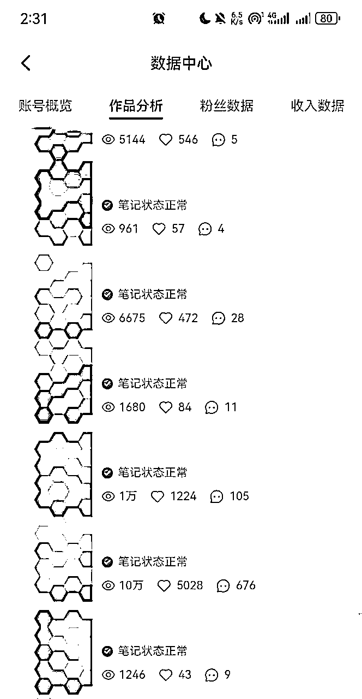

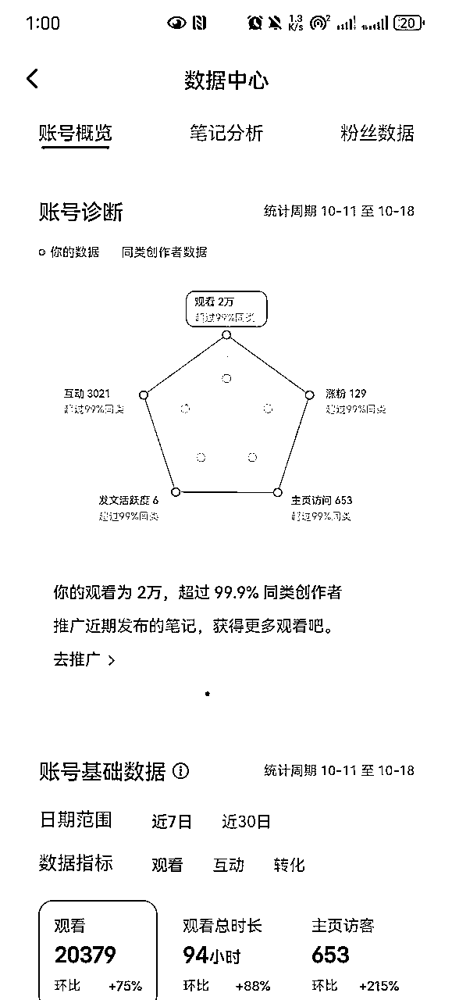

正面案例：

这是情感赛道，钩子下的足够好，引流足够丝滑，直接私信来找我联系方式。

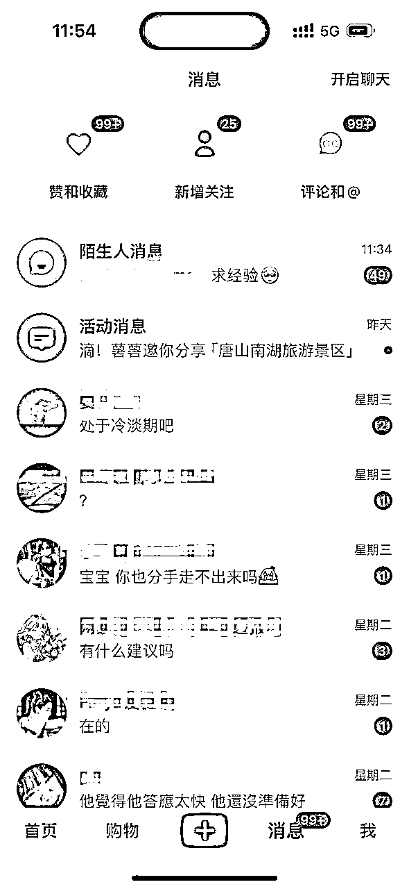

所以做流量，最重要的就是私信量或者评论区”求“！（引流链路较短，引流相对丝滑）而不是评论区娱乐搞笑

但要记住，做免费流量有个不可能三角，精准/性价比，稳定，量大（除非你做付费流量，高客单精准投放价格非常昂贵）就像找对象，专一，帅气，多金，不可兼得，除非你美若天仙，或者你纯纯命好，又或者你遇到杀🐷盘了。

那有多少引流方式呢？主要有以下五种引流方式：

1.  群聊留微信： 通过加入小红书群聊，找到我们的联系方式。（用小红书小号留微信号）

1.  截流： 在别人的热门帖子下面评论/私信

比如在别人减肥成功的评论区说，我前阵子用了xxx产品，效果xxxx

注意：千万不要小瞧截流，我曾经非常看不起，觉得这算啥啊？去偷别人帖子下的流量？后来发现大部分打粉团队平时就是靠截流养活自己，偶尔来个爆款就算赚到。

1.  自热矩阵：和电商shua单差不多，比如说你现在手上有ABCD个账号，A账号发帖子，B账号在底下评论说你的产品好，CD账号在底下评论说：集美怎么联系等，A账号说丝/私我。

1.  小红书电商拿客资：设置1r单品，引导顾客留下联系方式（比如手机号、微信号）

1.  付费投放

第三种打法在医美/口腔/情感等高净值赛道特别多（我讲下这个打法的细节)

举例：

A账号发布作品，我们会判断一个指标：入池/收录（真的太装b了这些词），什么意思呢？

比如我在小红书发布一个作品，我的标题是手把手教你如何小红书获客，内容是xxxxxx

过了10分钟，我在其他设备上用小红书搜索“手把手教你如何小红书获客”，如果能搜到，那就说明入池/收录了，说明帖子的流量是正常的（如果过了几个小时依旧搜不到，那就检查一下是否违规，或者账号本身有无问题）

检测账号流量，一般有两种方式：

1.能不能薯条推广（同理，抖音就是抖+，付费流量就是钱能不能投出去）

2.主页账号检测

一旦帖子收录/入池

这个时候我招募大量兼职/自己账号（兼职账号一般都是真人使用，权重较高）帮我评论，比如说我在帖子里放了一个钩子，叫做需要小红书获客资料评论区扣”666"

兼职必须要手动在小红书搜索栏搜索，“手把手教你如何小红书获客”，或者“小红书获客” 等关键词

找到这一篇帖子后，然后模拟真人刷了一段时间后评论666，一旦评论数量多了，平台的算法就会误判，哪怕你的作品质量一般般，也会给你流量，因为你的作品帮助平台停留更多的观众停留时间。

本质上和电商的shua单特别像，骗过平台的算法

在电商领域，雇宝妈群体/大学生，手动搜索xxxx产品，比如说电动牙刷，随便点击几个链接后，最后点击我们的链接还和客服聊了一会，最终买下产品，过几天带图片五星好评。本质就是模拟真实的用户。

简单说一下大概的价格

电商平台shua单，低客单的价格在4-5元/个，如果要好评和回头客，在8元/个。

如果是中客单（100r左右），好评在15元-20元/个左右（需要让顾客事先垫钱）

t宝店铺很多全球购也是可以shua出来的，全球购也不一定是正品噢~目前的价格在3000r/店铺，全球购难一个点在于shua单账号有年龄范围限制，所以宝妈账号是不符合的~

关于小红书评论+点赞+收藏，最便宜的价格在0.8元一个，贵一点的3-5块

如果是专门用来截流，有人专门卖美号（美号就是美国虚拟手机号注册的小红书账号，发帖子没流量，但可以私信，一个账号5r）也有人专门去租素人号，一个月30r左右，视频号的价格也差不多

（不做任何渠道推荐，别找我哈）

为什么要shua单/自热矩阵呢？

算法逻辑是这样，一开始有个1000小眼睛/浏览量的门槛，你过了这一关平台就继续给你推流，如果没过，平台就不给你流量。门槛依次是500-1000-5000-10000-20000-30000-60000-100000-200000（因为我没有过百万浏览，我最多就是卡在20w小眼睛，追求小爆款就够用了，大爆款很多时候流量都掉地上了，我们承接不住）

平台算法具有不确定性，哪怕你的帖子内容很好，但是就是不给你流量，利用这种方式可以有效对冲这种不确定性（本质上就是骗过平台的算法）当然，如果你的帖子质量确实很差，哪怕你前期完成冷启动，平台给你推流，但真实的用户没看完立刻划走，平台会识别出垃圾的作品，进而又不给你推流，因此生产优质的内容是创作者躲不开的宿命。

插播一个概念，引流的丝滑程度

我们总共说了五种引流方式，但每一种方式都有好有坏。比如：

1.  通过进群聊再找到你的联系方式，虽然相对安全（不容易封号）但用户需要花的时间太长，效率太低，不够丝滑，因此更多团队选择的是付费流/截流

1.  付费流本质是和平台付费合作拿量，付费流就考虑好现金流

1.  但有些高净值赛道不能投放（不合规，情感、婚恋、减肥、大健康等）就只能招人堆号放大

因此，打免费流量的公司的人员流动性一般会相对较大。

1.  一方面是做免费流量本身就是一个很枯燥的过程（每天就是重复发帖子，下班回家还要看手机回消息，没多少人能常年干这个）

1.  另一方面就是公司账号需求(每个人就只能办15张电话卡，换言之就是15个小红书号，假如号都被封了，却没什么收益，那就亏了。这些流量公司也偏爱招潮汕人，因为潮汕人家里兄弟姐妹多，有大家族的概念，见过有人把整个家族的手机卡都开完了，一个员工顶20个员工！）

### 3.现在这么卷，还能做？

很多很多人，会觉得现在小红书/抖音上应有尽有，什么帖子都能找到，都已经很内卷了，我们现在做小红书/抖音还有什么红利吗？

首先，我们要从平台和人性角度去思考：

1.  平台永远需要新的内容，平台不希望大博主吃遍所有流量，它巴不得大家都发作品，提高活跃度，所以平台都会给新人流量。生财也是一样，这半年来AI精华的帖子比重在上升，一方面是时代趋势，一方面是如果一直讲ip，获客，电商来来回回就那些，大家不愿意看。

比如：为什么生财要悬赏优秀创作者龙珠？

本质也是鼓励大家发优质文章，这样才能提高社群活跃度呀，社群最怕的就是没人发声，微信最怕死群，就像和喜欢的人聊天，最怕尬聊了（情感博主10个有6个在教挽回，3个在教聊天哈哈哈哈哈）

1.  人的欲望永远没法满足（举个例子，其实在过去我们没有ai，大家都觉得没啥，但是现在有ai了大家发现没有ai不行了，以前司机跑高速都不需要高德地图，只需要看路边指示牌，现在要是没有高德你试试？以前大家不需要微信，现在呢？）人永远喜欢新鲜/刺激/有趣的内容，永远希望速成高效。

其次，大部分人错过红利的原因就在于对100%确定性的追求（希望一个能长期干的项目，想要稳定，想要别人告诉他100%能行）

人为什么那么追求安全感和确定性？

我想是我们的祖先大都是农民，习惯春耕秋收，确定性较高，安全感满满，但沿海地区台风多，耕种不确定性高。一些祖先不得不以海洋捕捞为生，一日有一日没，甚至可能遇到风暴，直接丧失性命。

根据达尔文的自然选择学说，那些活下来的就是能适合大自然繁衍的，那我们保留的基因就更加追求确定性啦。也就有了江浙沪，福建，潮汕沿海地区，做生意赚钱的更多。内陆地区做生意少，当然也有海运发达的因素。——橘生淮南则为橘，生于淮北则为枳

追逐安全感完全没有问题，这是人的天性，但问题是很多人既要安全感又要高收益，这种好事怎么可能轮到你？

很多事情都有不可能三角，一定要摒弃既要又要的思维

*   工作不可能三角：离家近/稳定，钱多，事少。（除非你是天选之子/富二代，有句话说得好，好的工作只能通过母婴传播，血液传播，x传播）

*   项目不可能三角：高客单/高利润，标准化/规模化，竞争少

*   投资也有不可能三角：高收益，稳定/安全，流动性（买房致富就必然失去流动性，买股票赚大钱失去安全/稳定）

根据项目不可能三角，其实目前大部分赛道早就有人占坑了，真正的蓝海市场极少，要么就做小众细分赛道（强推：风向标，不单单要看中标的）要么就利用ai降本增效，优化各种细节，做有增长的大赛道。

千万别看不上一些小众细分赛道！！！！！

跟着我一起读！

高级≠变现！高级≠变现！高级≠变现！

生财很多项目真的很小众很细分化，你会发现这都能赚钱？而且还赚不少？你甚至会看不起？就这？？

但同比对比我同学去四大会计事务所实习，每日出入深圳春笋华润大厦，妥妥高级打工人，结果一看薪资3500r。。。（虽然是实习本来就不是为了钱，但活是真没少干）

我的意思是，高级是给别人看的，自己的钱包余额才是真的。只要这个项目能赚，哪怕看着土不拉几，屎上雕花，也先赚着先。

其实我也想表达，我们要分清手段和目的：

短期来看，进大公司/大厂工作从来不是目的，小公司未必比大公司差，去大公司更多只是手段，是为了有个title，多个背书，多点权力/钱。能多赚钱、提升能力才是目的，什么好赚钱做哪个行，什么项目你做的舒服能赚钱你就做什么（只要合法，不厌恶即可）

长期来看，赚钱也不是目的，赚钱是为了更好的生活品质，追求更多丰富的人生体验，实现自己的人生价值，提高自己的人生幸福感，钱只是实现价值的附带品。

过去我也常常追逐安全感，不管是赚钱还是亲密关系，本质上是以线性思维看待人生，当学生当习惯了，以为拿到A，进而就是B，进而就是C，其实不如勇敢拥抱不确定性，适度展望未来，认真活在当下，走一步看一步

小时候大人说，吃得苦中苦，方为人上人，但想成为人上人吃的苦是不确定的苦，要是大家都确定一个事物能赚钱，那就不叫吃苦了，那叫劳动，那红利期基本已过。

很多人一直抱怨说时代造化弄人，但就是不愿意去尝试，去执行。

普通人/韭菜的一生：

在知乎火的时候不写文章，该摇花手的时候不摇花手，你说摇花手是短期的钱，但你可知道人家几年就摇出劳斯莱斯。哪怕是小红书这种精致平台，我今年也见过摇花手直播间破万的。

该做拼多多不做拼多多，该做抖音不做抖音，该做小红书不做小红书，该做私域的时候不做私域，该买btc的时候不买btc，该用ai提效的时候不用ai，该学习不学习，该睡觉不睡觉。。。

结果就是到最后看到别人赚钱了，失去理智，在房价到顶开始接盘，在牛市顶部开始梭哈，一路追涨杀跌，一会说做波段，一会说坚持定投，长期持有，一会说要用钱了哪怕亏本也要拿出来，一会说妖股不稳定，一会说大盘股涨幅小，太稳定看不上。。。

寻思从一开始，你就不知道自己要什么，逻辑/框架/目标是没有的，只是凭借冲动，见不得别人赚钱，别人搞钱/学习/投资是为了变富，你只是为了消费情绪/逃避生活。

你要趁早执行啊，可能没结果，很多事情本来就没结果，但不做，我们不可能赢

不要一味批判审视和“学习”，到头来就拍大腿说大环境不好，又或者等到别人钱赚完了，才去做接盘侠，又说运气不好

早点下场把手弄脏才是真道理哇！！！早就是优势！

如果有需要拆解个别赛道，我再写帖子~避免文章太长。

## 四、1-10需要什么？

公式：利润=流量（加微信的人数）*转化率*客单价—总成本

因此跑通0-1后，想要1-10，10-100

那就是把流量*n，转化率*n，客单价提高xxx，成本降低xxx，即可实现十倍增长。

具体我分为6个板块

1.  招聘/矩阵搭建/知识付费/合作

1.  打造高效SOP体系（流量、销售、产品）

1.  付费投放

1.  关键词布局与SEO思维（网感）

1.  精细化运营（朋友圈、私域ip、提效工具、换量）

1.  善用面试（被面试/面试官角度）

### 1.人员招聘/矩阵搭建/知识付费放大/合作

#### 1.1员工招聘

如果是基层员工，优先招兼职

为什么招兼职?

1.  成本低：不少项目的生命周期较短，一旦遇到大规模封号（每年3.15前后），或者迭代能力跟不上同行节奏，刚开始招员工基本都是第一个月亏损，第二个月打平，第三个月盈利，要养活团队是很困难的。

1.  第一次做项目，我们更多的是借假修真，做项目是”假“，培养我们的底层能力（商业闭环，表达，写作，沟通能力，逻辑能力，搜索能力，抗压能力，心力)是“真”，很少人能够一开始就找到自己深耕的项目。招正式工我们也需要场地等，光是这中间所耗费的时间，最后可能钱没赚到，红利就过了(比如：教育赛道高峰显然是寒暑假，高考志愿填报往往就15天）

如何招到兼职/助理?

1.  小红书/抖音平台（可以具体到城市，如果想要更快速的话，小红书搜xx兼职，比如广州兼职，基本上都是大学生，便宜又好用）

1.  boss直聘

1.  生财圈友/朋友（强烈建议，前两者还是比较耗费时间）

具体招人的特质/岗位：

一般做私域，最开始招人

*   要么就是招做流量（岗位名称：引流专员，私域引流）

*   要么就是招销售

*   当然也可以招助理打杂，哪里需要点哪里。

因为不可能一上来就去做产品，我们依旧是流量驱动（近期的ai套壳产品除外，AI套壳产品虽然也是私域的一种形式，但和微信私域获客逻辑不太一样~）

特质的话（不绝对）

*   流量岗偏向内向和细心的女生（大部分女生做事情比男生细致不要太多）

*   销售岗，偏向生活压力大，身上有贷款的

具体生财有很多帖子关于人事系统的~

#### 1.2阿米巴/知识付费放大

什么是阿米巴?

简单理解----你发现一个项目跑通了，你拉着你亲戚/朋友干，你把思路和流程告诉他们，让他们自己去赚

知识付费（和早期的微商代理差不多）

优点：不需要招人去放大，没有人员的固定开支，向你付费学习的人多半执行力和学习能力都挺强的，毕竟钱都花了

缺点：被一些人非议（说你卖项目，肯定是在割韭菜），但我们在这个世界上一定有人喜欢我们，有人不喜欢我们，就像我们总会喜欢/不喜欢吃一些食物，没有为什么，这就是自然而然的事情。

一个月入2000r的项目，你可以把他卖到5980r是完全没有问题的。为什么？

你给了对方确定性，给了对方希望，手把手教学，创业难点之一就是面对市场的不确定性。未来想赚钱离不开卖希望卖陪伴卖情绪价值

ps：生财有术的一个卖点就是卖希望，创业总会有心力不足的时候，而你在生财有术不单单可以找到解法，还可以获得心力上的补充，也可以理解为一碗鸡汤，内容的尽头就是鸡汤，这不可耻，有信心是黄金，信心是很昂贵的，如果你能长期给别人带来希望/信心，你以后必然会有钱的。

知识付费总会有一些达不到效果，这是很正常的，但是我们只要交付到位，问心无愧即可。做这种知识付费和早期的微商代理差不多，你多少都会有一些负面的声音，你会意识到物种多样性，实在遇到麻烦的该退款退款。（反正没什么成本）

#### 1.3圈友合作/学习

如果你跑通了项目，但是对投放什么的一知半解，对招聘什么的都比较无力，那就大胆带着项目和一些有结果的圈友合作/学习吧。毕竟提升自己的能力才是真。看到很多优秀的圈友互相合作，拿到大结果真的羡慕。

不建议轻易给股份，能发红包就发红包咨询。

关于人才

可遇不可求，要么刷量多见人，见500个人能有一个人才就是赚大发了，要么玄学，看老天什么时候赏口饭吃。

但一定不要放弃对人才的渴求，一个人可以走得更快，但一群人才能走得更远。

#### 1.4矩阵搭建

什么是矩阵？

一个号做出结果了，那就上多个号，因为一个号每天发布的帖子数量是有限的（发太多会被屏蔽、限流）那就只能多几个号

矩阵在电商领域叫店群和铺链接：

店群（一群店铺的意思）：

比如我一个店铺做到利润1w元，要想把单个店铺利润从1w到5w是很困难的，只能慢慢迭代。

但我们已经跑通了0-1，我们完全可以再做很多个店铺，不一定要做到1w元，做到5000元就算胜利（有些店铺就是没法做起来）那我起10个，100个，1000个呢？

铺链接：一个商品往往有很多sku组成

比如一款产品A，有红橙黄绿蓝等颜色，那我们把这些sku拆分出来，变成A红,A橙,A黄,A绿,A蓝，拆分成足够细的链接，只要链接足够多，用户总会搜索到我们，特别是对一些小众细分商品，可以吃掉整个赛道。

所以电商和私域获客的底层逻辑是相通的，围绕流量---转化---产品这个闭环，所以我平时也会看看跨境电商怎么做，海外私域怎么做（Facebook、tiktok获客）（ps：不得不说，Facebook私域获客是真的暴赚啊，同样都是私域，对比国内，简单粗暴，但是很考虑现金流！！你不可能既要有要！！）

具体如何做矩阵？（我主要讲模板）

*   二手手机购买渠道app：转转、拍机堂、咸鱼等，价格在500-2000r

*   手机号/手机卡：这个我提一嘴，建议和营业厅直接谈，我之前办卡100r一张，后来才知道营业厅可以5张100r，足足差了五倍！！不敢想要是我一直这样，成本得高多少。

*   模板：这里模板有很多种形式，爆款是概率，是各种爆款因素叠加的结果，可能是我们的标题，可能是我们的图片，可能是语气，可能是头像，可能是主页装修。

我自己罗列出了30多种爆款封面。

1.  风景图（高山，田野，冰川，室外建筑）

1.  室内实拍图片（实况和非实况）（ins风格，简约风，AI风格）

1.  苹果/安卓备忘录（白色和深色模式）

1.  微信聊天记录（深色模式和白天模式）

1.  小红书自带的文字做图

1.  抖音评论区截图

1.  小红书评论区热点截图

1.  可画模板（这里有10＋）

1.  飞书文档截图（黑色和白色）

1.  ai生成（这个太多了）

...

*   具体大家可以移步生财官网的生财小组～https://scys.com/

### 2.打造高效SOP体系（流量、销售、产品）

sop简单来说就是员工入职教学手册/标准作业程序，教会一个员工每天具体要干什么，手把手教怎么做。只有打磨好sop，才能放大业务。

很多团队对sop不够细致化，造成员工低效（我们以为懂了，实际上员工不懂）

这往往是造成很多团队低效率和亏钱的原因。所有项目想要做大肯定是sop打磨的足够足够足够足够足够足够足够足够足够足够足够足够细致，细致到90岁老奶奶都能上手！！！！！

#### 2.1流量端sop

1.  怎么装修小红书的封面

1.  怎么留联系方式

1.  怎么对标同行（细节细节细节，无死角模仿）

1.  为什么要养号，怎么养号（如何模拟真人）

1.  怎么切换账号?

1.  被限流怎么申诉

1.  怎么注册账号？

1.  如何留钩子引流

1.  如何刷机（为什么要刷机？）

1.  如何面对同行截流？

1.  如何看引流方式是否违规?

1.  号被封了怎么办?（作品被限流怎么申诉，怎么骗过平台的算法/审核？）

1.  截流的话术是什么？（具体到顾客加我们微信还是我们加顾客微信）

1.  怎么改网络地址（如果在同个地方用太多手机，平台会显示异常）

1.  怎么锻炼网感？（具体方法论）

1.  怎么找到最新爆款？

1.  ...

#### 2.2销售sop/百问百答

1.  顾客来了，第一句话是什么？是叫宝，还是宝子，还是哥，是您好，还是你好

1.  表情包发什么类型的(卡通，真人，抽象，微信自带），要不要发表情包

1.  怎么用企业微信？头像？个性签名？怎么发朋友圈？如何注册，账号区分？怎么对接小红书聚光？

1.  如何引导顾客xxxx？

1.  如何激发顾客的痛点？

1.  如何逼单?

1.  如果当天的顾客太多应该怎么办？

1.  忘记及时回复顾客消息应该怎么办？

1.  如何引导顾客往我们成交的方向走？

1.  成交之后做什么，仪式感？

1.  销售的心态是什么？

1.  我们的人设是什么？我们的言语风格应该是怎么样的？（比如说高考教育板块，假如我们的顾客是因为我们的前面的人设来的，我们的人设是知心学长，还是老师，还是逆袭自学学长，都是有很大区别的）

1.  我们的受众是什么样的？（年龄，认知，痛点，痒点，性别）

1.  如何群发？群发什么？

1.  如果顾客说价格太贵了怎么办？/考虑考虑？

1.  提成是怎么样的？KPI?考核指标是怎么样的？

1.  工作时间？

1.  紧急情况？

1.  遇到要退款怎么办？

1.  如何打用户标签？

1.  谈单谈一半顾客删除我们怎么办？

1.  如何复盘聊天记录？

...

#### 2.3销售漏斗模型/销售节点（重点）

我们的顾客加我们普遍都是有带有一定的痛点，不然不可能去加你的微信（加微信是件很麻烦的事情，同行除外）

那我们想要顾客买我们的产品，我们需要做些什么呢？

首先，销售三条核心法则：

1.  1000%相信自己的产品（又或者销售本人生活压力巨大，把黑说成白的，算是不少销冠的基本功了）

所以我们会发现，销冠都是最相信自己的产品的，卖房销冠就是自己曾经买房受益，卖保险销冠就是自己/家人通过保险捡回半条命，医美销冠就是通过整容获得自信/收获伴侣。

ps:过去的基金经理除外！！！！很多基金经理就是跟热点，哪个板块火就炒哪个，很多就是靠炒作吃饭的，到头来就是他收佣金赚麻了，一个熊市你直接套牢。（2025年5月国家刚改规则，现在不让这么玩了，但具体需要看落实如何）

为什么呢？基金公司的利益来源是管理基金的规模大小，而不是收益率。所以，盈利策略有两点。

*   扩大购买基金的用户规模

*   减少赎回基金的用户群体，其中第一点，要求你赚到远超市场平均收益的收益率，只有如此，才能吸引散户买买买。

其中第二点，最好在散户买入后，基金在某个时间点进入长期跌势，因为散户被套住了，就不会轻易赎回，而是追求回本。

只要他们不回本，每年1.5%的管理费，对于公司就是稳稳的现金流收入。因为在每年1.5%的管理费提取的前提下，散户回本并不是容易的事。

比如，历时五年，也许基金里的股票组合终于回本，但由于每年1.5%的管理费扣减，基金净值也就依然亏损7.5%（1.5%管理费*5年）

那么基金公司如何实现上述的策略呢？如何实现短期远超市场平均收益的收益率？

对于某些基金公司，答案并不是靠能力，而是多方押注，靠概率。比如我成立十只基金，分别押注不同的行业和不同的周期。因为股市在短期，会有短期抱团和炒作的题材，会有行业板块轮动，会有短期的风格。

那么这十只基金里，可能有那么一两只押中了短期的风格，就能跑出远超市场平均水平的高收益。至于剩下的八九只，可能大幅跑输市场平均收益，可能和市场平均收益持平，但这并不重要！！！

因为，基金公司重点宣传的，一定是那只踩中了短期市场风格的高收益基金，从而吸引到大量的散户买入，使得基金规模急剧膨胀。至于剩下的9只基金，呵呵。然而，短期大幅跑赢市场的行业，有可能出现估值过高（价格太贵）转跌，那么散户也就被套住。

这样，也就实现了我们上述说的第二点，散户为了回本，会减少赎回，于是，他们会在之后漫长等待回本的时间里持续贡献管理费。——你看中他的收益，他看中你的本金和管理费。

1.  ”要么你花钱买我的产品，要么你需要花很多时间去试错”。——不卑微，不讨好

1.  学会筛选，销冠核心之一就是高效利用时间，筛选出对产品有意向的顾客，进而集中精力攻破，量大出奇迹。（而不是去教育用户，不喜欢你的人你再怎么尬聊都没什么用，你要通过做事慢慢去吸引对方）

其次是痛点挖掘，特别是资料粉(加你微信来领资料的人)

比如你是做减肥赛道的，你的产品是xxx保健品，你在小红书平台留下的钩子是减肥计划和饮食表

那顾客肯定是希望减肥的，但是她缺乏意志力，不知道方向，缺人带着跑（人都是需要陪伴的，如果有人带会好很多）

你就要慢慢一步步引导痛点，比如减肥反弹，半夜饿肚子，晒案例（同样体重的人已经减下来了），减肥后的生活状态（美美拍照，自信，找到对象等等）进而推销产品

现在资料粉没以前那么吃香了，不少赛道转化乏力，宁可流量精准一点，也不要这种白嫖的资料粉(本质上也是人群厌倦被销售：我只是要领个资料，老是推销)

很多打粉/流量团队现在不做资料粉了，为什么？

资料粉不够精准，如果转化很困难，哪怕我微信一天能加很多人，但就是转化不了，甚至说我需要招很多销售来接流量

结果发现大部分都是白嫖的流量，我没多赚就算了，还要花更多钱养团队，规模起来了，但有什么用？那还不如不要

做业务重要程度：现金流＞利润＞规模

关于现金流（还记得在选项目资源盘点环节，我说效率和现金流么？）：

1.  投产比：我们做流量的如果纯走自然流，那我们就是在破坏平台的生态，早晚会被封号，只要平台封的号赶不上我们赚钱的速度，那也值得。只要算好投产比就行（比如一天一个账号赚40块钱，损耗5块，投产比=8，很高的，上100台设备，一天就能收入3500r了）

1.  回款周期： 比如说你做付费投放（后文会详细聊），引流100人/天，引流一个人到微信需要给平台付费15r，你单笔成交需要耗费1个星期（从用户破冰到了解产品到熟悉产品到成交，1个星期不算久了，有些泛一点的粉成交要一年半）那你赚到第一笔钱时你需要先垫钱100*15*7=10500r。这还没有销售，运营，后端人员的成本，以及场地，水电，设备的费用（如果是私域电商，压货成本更是笔费用，快递费，包装费，当然私域电商有一个好处，传统电商平台回款要7-21天，私域电商考虑压货即可）。因此有其他现金来源并把钱投入到项目扩大中，对于一个初期创业者是非常舒服的事情。

推荐一个youtube销售课程（记得魔法上网）

https://www.youtube.com/watch?v=JE2_7elAcxM

销售漏斗模型

销售节点/卡点（这个很重要！能帮你判断销售提升维度，到底哪里出问题）

1.如果卡在AB阶段，那大概率流量端出现问题，(是不是钩子不精准？还是破冰太生硬？)

2.如果卡在C阶段，是不是痛点引导不足（是不是回消息不够及时，朋友圈没有打造好？话术太生硬？）

3.如果卡在D阶段，那是不是逼单压力不大，又或者对方没有释放一定的需求，你单方面自嗨推销了？当然也可能是产品宣传的不够好（没有吸引力）

无论卖什么产品，最后其实就是卖海报，卖情绪价值，卖方案，也建议大家建一个群，平时看到好的海报保存下来，一方面是为了培养自己的审美能力，一方面是如果未来有需要，方便与设计师进行沟通。比如：我想要的就是这种效果，苹果那种简约高级的感觉等等

同理，男生一定要学好拍照！审美是个越老越吃香的技能！！

销售漏斗模型和海王差不多：

1.  广撒网

1.  筛选对自己有意向的异性

1.  判断对方需求，多展示自己的长板，避开自己的短板（颜控？是喜欢大肌肉还是薄肌帅哥？是喜欢内向/外向的？是喜欢成熟/幼稚的？是看中物质还是没那么看中物质？是重视仪式感还是不重视.....）舔狗是做不了销售的，因为不懂对方的需求，不懂得根据对方反馈进行腾挪（当然也有可能是懂：知道对方不喜欢自己，但硬要讨好，利用道德赌个大的，本质是太贪婪！！）

1.  建立联系，适度表达好感，引导对方付出，制造独特体验

1.  等待合适的时机，一击入魂

#### 2.4销售正负法则

销售正负法则：其实就是告诉基层销售，什么是对的，什么是错的。

正（鼓励销售做的）：

1.  给顾客一些正向情绪价值（鼓励夸赞）

1.  小范围测试话术

1.  吸取同行经验

1.  鼓励顾客转介绍

1.  积极询问负责人

1.  ...

负（禁止销售做的）：

1.  已读不回，躲避顾客问的问题

1.  调侃/敷衍顾客

1.  辱骂顾客

1.  发不合适表情包（具体看人设和风格）

1.  单删顾客

1.  跪舔顾客

1.  偷偷收款

1.  造假数据，为了满足业绩，自己花钱通过第三方冲销量（隐藏了企业可能存在的问题）

1.  ...

#### 2.5产品sop

1.  我们的产品是什么？

1.  我们的产品的优势是什么？缺点是什么？我们的竞品优势是什么？缺点是什么？

1.  我们产品的客单价是多少？分为几类，引流品是什么？利润品呢？主推什么产品，次推什么产品？

1.  我们的受众是谁？年龄？性别？一线/二线/十八线城市？是否已婚？消费能力？

1.  如何交付服务/产品？（仪式感是什么？什么样的频率去交付，是每周/每天进行交付？）

1.  如何公关？（比如k12赛道，顾客买我们的私教定制服务，学生发现不满意，要换老师怎么办？）

1.  公司名字是？有什么资质？有没有什么奖项？有没有代言？

1.  有没有什么案例（最好就是有案例库，没有就搞两个微信号，左手倒右手）

其实到这里我们会发现，任何小项目都是大厂（腾讯/字节跳动/美团/拼多多等）的前身，只不过大厂岗位足够细分化，足够螺丝钉。

拿国内电商举例（不说跨境电商是因为我不懂，光是搞定FBA/FBM/SFP/海外仓/不侵权/走墨西哥避关税就难倒我了）

1.  一开始做电商，你要全面负责店铺运营（看同行，选品，美工，找供应商，上产品，剪视频）shua单（刷单要进一些qq群,对接宝妈）包装物品，发快递，拦截快递（如果有人要退货），处理退货，算账，客服。

1.  你做起来了，你开始招人了，那你第一个员工一般是运营助理（打杂，一会帮你发货，一会帮你ps，一会帮打包...）

1.  第二个员工一般是美工/设计，因为ps基本上占据了你大块时间，必须找个人专门做。

1.  此刻你的第一个员工（助理）如果给力的话，愿意学习，愿意跟你，大概率能变成合伙人/运营（那太棒了！恭喜你！走在1-10放大的路上）

1.  第三个员工一般是运营助理/客服，运营助理负责：处理退货，shua单对接，看看同行培养网感，发快递。你和合伙人集中精力运营店铺，做多平台，做店群，铺链接，投放

1.  在这之后，你招员工，可能是打包员/运营助理/客服（可能外包）/美工，此刻你依然不可能闲着，爆单（大卖）你也要负责打包，客服不够你还要负责回消息等

1.  此时你对运营助理的工作进行拆分，可能有运营助理专门负责一个板块：shua单/拦截快递/处理退货，可能运营也开始只做单个平台（只做淘宝/拼多多/天猫）看！此刻已经非常螺丝钉了

1.  如果你想大展身手，你开始做直播间了，最开始一定是自己上手做直播，直到跑通变现闭环，再开始招人（主播----中控---直播运营助理）做多个直播间（矩阵）

你和合伙人分开负责：

*   阿里巴巴（如果你自己做货源，做批发，也做零售，那你就属于自营盘）

*   淘宝、拼多多、天猫，京东

*   直播间（抖音、视频号、拼多多）

已经开始有部门/业务线的感觉了，这个时候朋友/亲戚看到你拿到结果，跟着你干（阿米巴）还可以做知识付费，进而继续做矩阵/投放/更多平台。

此刻，运营岗已经细化到极致了，比如运营：用户运营，社群运营，产品运营，直播运营，电商运营，平台运营，内容运营，游戏运营

为什么岗位要这么细分化呢？

当企业达到一定规模时，如果一个岗位过于重要/不够细分，你无法取代，甚至影响整条业务线的利润时，对企业很危险的，企业会没有安全感，而且不够细分，企业的教育成本太大了，好不容易培养你，万一你跳槽/单干了，怎么办？

很多人说打死不去小公司，总是在打杂，但是打杂就是做副业/创业的必然过程呀。如果未来想创业选择小公司也未尝不可，去小公司前景未必比大公司差，但跟对人很重要，找对人也很难。

赚钱本身就很不容易，能拿到大结果的都是无数次迭代，慢慢打磨，持续执行的。

### 3.付费投放/扩展流量渠道/算账

这个很好理解，就是给平台花钱，让你光明正大引流，目的是让更多潜在的顾客看到，并且引导他们加你的微信。加微信后就能更直接地和顾客沟通，卖东西或者提供服务。

#### 3.1付费投放获客/扩展渠道

首先，为什么要做付费投放？

用钱去换流量端的轻松，避免持续劳作，平台一直需要新的内容，我们需要持续更新，我们这种自然流投流量，封号是必然的

我们很难同时去优化流量---销售---产品，经常是流量好不容易解决了，销售出现问题了，销售好不容易解决了，产品端又出现问题，团队士气偶尔低落偶尔高昂。创业就是不断救火的过程。

而付费能让我们专心搭建销售团队和优化后端产品，花钱买加速度，花钱换时间。

案例：

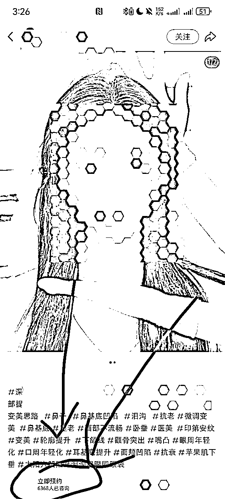

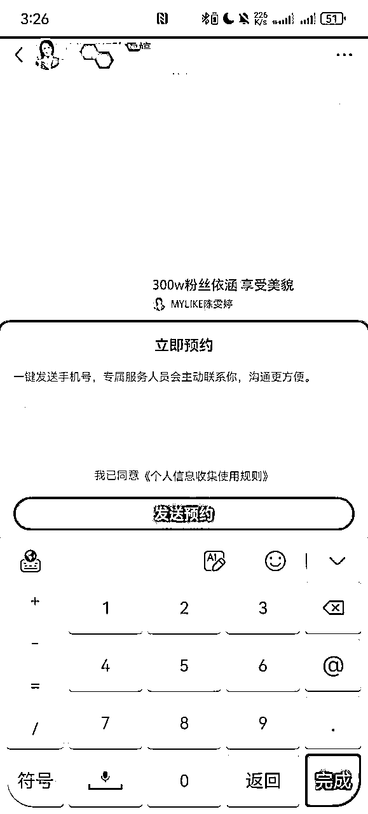

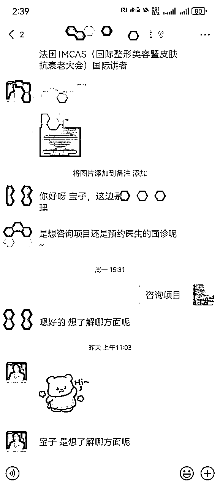

点一下，我加这个医美机构微信，对方账户起码几十块钱没了，贵一点的几百块钱，也推荐大家多点广告，看看别人怎么销售你的，哪怕赛道不同，因为运营/销售的本质是一样的，思路都是通的，看看别人怎么逼单的，怎么秀案例的，朋友圈怎么运营的（日更，周更，案例，是否生动真实，节假日有没有发祝福，是否断更，朋友圈置顶是什么，朋友圈背景，以及账号名称，有无真人出镜，总共几条置顶，置顶的是什么内容？有没有做视频号？有没有公众号？多久回复？）

包括微信名后面的备注，休息/回消息/飞机上/火速敲键盘回消息/休假中，比如我的理发师，要把细节扣到极致

如果发现有账号以前更新，现在断更了，就不建议抄这个账号了，长期更新朋友圈就跟健身/冥想一样，需要有正反馈才能坚持下来。

具体如何做小红书投放（非常详细）

还有一点非常非常重要，和小红书、字节跳动的广告销售打好关系，搞不好就把你同行的数据告诉你了（不亚于开透视）

其次，多渠道引流

简单理解，如果你小红书获客做起来了，能不能做做抖音获客，咸鱼获客，bilibili获客，每个平台的模板都不一样，调性也不一样。（跨平台很难的，如果你很熟悉某个平台受众和调性，会容易一些）

#### 3.2学会算账

这里要细说一下算账，因为太重要了

1.  ROI（投产比）

可以理解为“投资回报率”，就是衡量你投入的钱能赚回多少钱的一个指标。ROI的计算公式通常是： ROI = (投资收益 - 投资成本) / 投资成本 × 100%

案例：你花10000元做了一个广告推广活动，最终带来了20000元的销售额，假设这20000元的销售额的利润是5000元（扣除商品成本等），那么你的投资收益是5000元，投资成本是10000元。你的ROI就是：(5000 - 10000) / 10000 × 100% = -50%。这意味着你是亏本的，每投入1元钱，你亏了0.5元。但一开始投放，肯定是会亏损的，因为各方面协调不好，不要轻易关投放，基本都以一周为单位进行测试。比如：投放引流太多人了，销售回复速度慢了，销售漏斗，销售sop没有打磨好

1.  算账具体化

我们在2.3部分提到单粉产值，之前我们做某个赛道犯了个错误，成本算的不够细致，后端成本太重了。

什么意思？

比如我们投放小红书一个客资是15r，假如我们的单粉产值是50r，也不代表我们的roi是正的

因为我们还有销售人员薪资，后端服务成本，设备/软件（包括企业微信/客服宝/剪映/小鹅通），日常费用（下午茶），水电，手机，手机卡，月租，知识付费，场地等等

其实私域做知识付费成本挺容易算的，电商才难。包装费用（纸箱），快递拦截费用，shua单费用，仓库存储费用

最佳的算法是以周/月为单位，列出所有成本，所有收益，进而计算

当然你也可以专门开张银行卡，一开始就丢10w块钱进去，所有开销和提现都用这张卡，等一个月后看余额就知道是赚还是亏了

### 4.关键词布局与SEO思维

SEO (Search Engine Optimization)：电商/自媒体领域，通过一些关键词的优化来获取更多精准流量的行为

关键词入口思维：

不知道大家有没有使用电脑上的豆包，已经往浏览器方向发展了，以后也许会取代大部分浏览器，翻译软件，因为占据了入口。如图

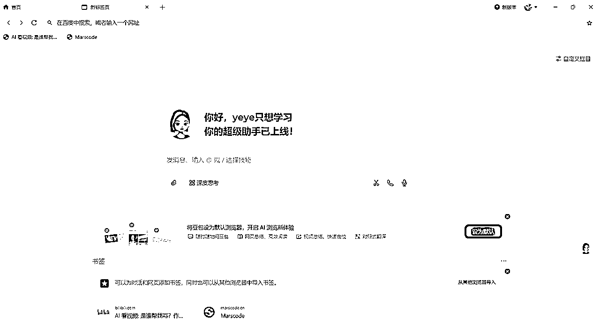

小红书案例：

假如你是做牙齿正畸的，作为医生，你以为顾客会搜：牙齿正畸，隐适美，牙冠等等专业名词，过度专业只会吸引同行

顾客更多的是搜：

*   xxxx口腔医院/医生靠谱么？（假如你是A口腔诊所，你的竞争对手是B，行业顶尖是CDE，那你完全可以写一篇帖子几家顶级口腔诊所的测评，顺便穿插A，也就是夹杂私货的意思）

*   牙齿不整齐自卑xxxx？

*   矫正牙齿要多少钱？

*   矫正牙齿要多久？

*   成年矫正牙齿作用大么？

*   牙齿矫正失败案例？

*   牙齿不齐拍照xxxx？

*   龅牙凸嘴怎么办？

*   ...

你应该是铺这些关键词，来的流量才会更精准。

扩展一下：

以前我们更多依赖于我们个人的网感，但现在你还可以辅助ai，直接举个例子

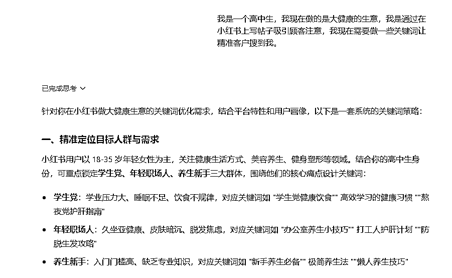

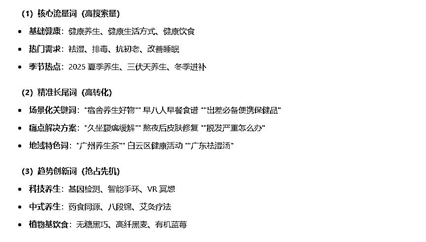

当你的小红书帖子以顾客为导向，搜索到你帖子的顾客都是精准用户，哪怕小红书帖子流量不大，但你的小红书帖子足够多，当每一个关键词下都是你自己的帖子时，你相当于吃掉了整个赛道的利润。(这也是为什么做矩阵的原因)

### 5.私域精细化运营

#### 5.1私域个人IP

IP就是品牌/知识产权，个人IP指的是活生生的立体的人，这两年最成功的IP就是雷军了。如果特朗普也算IP的话，那显然他是全球顶流。

IP分为KOC和KOC

*   KOL (Key Opinion Leader) 大网红/较大影响力的人，比如李家琦，抖音小杨哥，快手辛巴。

*   KOC (Key Opinion Consumer) 素人，KOC指的是粉丝不多，但是非常信任你的朋友或者小圈子里的人。比如你有个朋友特别懂球鞋，他推荐的够鞋，渠道你可能更容易相信。

成功的ip，主要满足以下3个点：

1.  每日出摊，认真经营，讲好故事，讲好产品（ps：我的来时路永远不过时，人们永远喜欢看逆袭/鸡汤）

1.  最顶级的ip：有活，有梗，口头禅（“我嘞个豆” ， “那很有生活了”，“天塌了”，“来财”，”Are you ok“，”先定一个小目标，万一实现了呢“，“清华北大不胆子大”，“我对钱不感兴趣”，“泪水打湿猪脚饭，发誓要赚一百万”，听到这些话，你有没有想起谁？）

1.  反差感，雷军说：友商是xx；特朗普的出尔反尔，炒作股市，一会加税一会减税

为什么我的标题是私域个人IP？

在抖音小红书平台，太多专业机构/天赋选手了，不管是视频内容还是视频特效，我们都很难超过他们，但是到私域就不一样了，竞争对手直接少一大截，且只需要写好朋友圈，最多加个视频号直播即可，因为你的顾客微信好友大概率就只有你在卖xx产品（就好比，生财有术的大佬很多，但是我们微信上的大佬没那么多，清华北大的学生很多，但微信朋友圈清北学生很少）

ip核心是让你这个人或者你的产品深深根植在顾客的心里，这需要长期经营，需要持续出现在对方的朋友圈/生活。这也是私域不建议频繁换赛道的原因。

成功的ip必然是有亲切感的，有情绪的，真实的。比如：鱼丸现在改成本人头像显然亲切的多

如果想要做好销售/ip，个人认为必须记录自己的感受，人都是需要情绪的，需要能量的，只有能量发生流动，才能让我们的形象在ta人心中更为生动，更加具体，没有能量很难做好销售/营销。

人们只会记得故事和感受，而不是干货，参考雷军和周鸿祎，周鸿祎偏理性，相对而言没什么情绪，亲切感不够，当然不可否认，他们都是很成功的IP

建议大家多去记录自己的生活细节和感受，哪怕是不开心的点，也是我日常的习惯之一。（面对面建群即可，简历一个人的群聊）

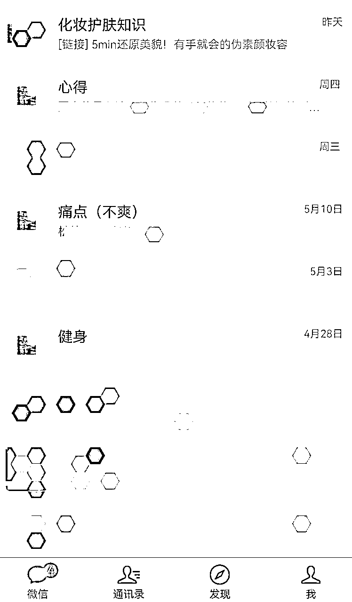

*   小的方面：

只有持续记录，你才能敏锐捕捉到痛点，才能更好做爆款，内向的人往往能打磨出真正震撼人心的作品，对人心的洞察非常非常细致，天生外向的人更多时候是大大咧咧，吸引人群注意力，活力满满，各有各的好。

*   大的方面：

人活着不单单只是为了世俗意义上的成功，人就活一辈子，体验和幸福感才是最最最重要滴！

情绪：贪婪，恐惧，焦虑，开心，好色，八卦，难过，怨恨，尴尬，煎熬，无聊，愧疚，平淡，乏力，心累，抑郁，紧张，怀念，感动，不满，平和等等

#### 5.2朋友圈运营

为什么我们要发好朋友圈？

1.  信任前置---现在社会的信任成本太高了，小的方面是我们个人之间的信任，大的方面就是企业的暴雷跑路，比如恒大，碧桂园。持续认真经营朋友圈本身就是一件很累的事情，因此才显得重要/珍贵。很少有人持续经营大半年就为了你这个顾客。

1.  低成本持续触达---ip的本质就是因为持续触达，种下心锚（你看，读书人又在装b了，其实很简单，可以理解为刻板印象/生态位，比如一听到遥遥领先四个字，你就会想起华为，想起创业和副业搞钱社群，你第一时间就是想起生财有术，想起广州，你就想起拖鞋佬...）

如何运营好朋友圈呢？？

核心就三句话

1.  你的生活我的梦（老子也想过你的人生）

1.  看完还有点收获（我又懂了，指点江山，激扬文字）

1.  万一你还有点用（未来我可能需要）

千万不要发广告刷屏，控制好广告比例，多了也不行，少了也不行，建议参考优秀的同行。

下面仔细解读下这三句话

1.你的生活我的梦

学会造梦是个很重要很重要的能力（讲好故事很重要！）

简单直接的：自己消费不看价格，给父母买东西，日入xxx，奢侈品，豪车，买房，旅游，名校毕业，和xxx大明星/网红/企业家合照，出入高端会所

高级一点的：卖美好的生活状态，轻松，家庭和睦，优质社交圈，不内耗，对未来有信心，团队信任，热爱，自然醒，不失眠，通勤时间短，人生伴侣，自洽的生活状态。

2.看完还有点收获

尽可能不要直接讲道理，而是先说故事，调动情绪（今天遇到了xxx/最近的热搜，你想起xxx，你想到了什么）

成长感悟类，干货类

比如

1.  热点：最近京东大战美团，看似进攻，实则是美团动京东蛋糕了

1.  xxxx前辈，各种语录的笔记（段永平，巴菲特，马云，张一鸣等等）

1.  你对恋爱（人都喜欢八卦），婚姻，家庭，创业的感悟

3.万一你还有点用

举个例子：

大家都说：至少要认识两个医生，两个律师，两个交警，两个警察（原话是一个，但是凡是留个万一，多多益善嘛）

五年前我加过一个代购，但我直到今年才向对方买产品，ta持续这么多年一直做代购，我为了方便和信任，第一时间肯定，先想起ta。（永远不要低估人的惰性）

只要这个人一直在你的心中存在，哪怕你1年不需要，5年不需要，但一旦遇到事情，你第一时间想到ta，这就是私域/微商/ip的魅力。

这里提一点，平时记得怼号，多多益善

大家平时要多留几个微信号以及各大平台的账号，哪天流量爆了，有账号好承接，哪天需要放大做矩阵，不需要再去养号。

*   书到用时方恨少

*   钱到用时方很少

*   号到用时方恨少

不管男生女生，建议留有一个微信号，性别设置与自己相反，我自己就有一个女号，朋友圈打造尽可能精致（为了让销售觉得我有实力付费）专门来调研同行。ps：朋友圈有真人照片更好，更真实（打码照片是我朋友，请朋友吃饭或者帮个忙即可，这点不强求，看人情世故啦。）

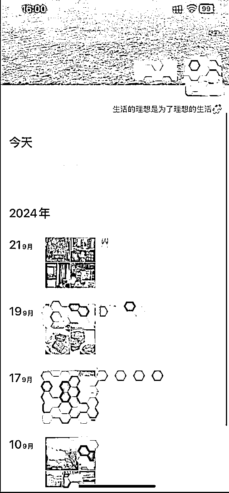

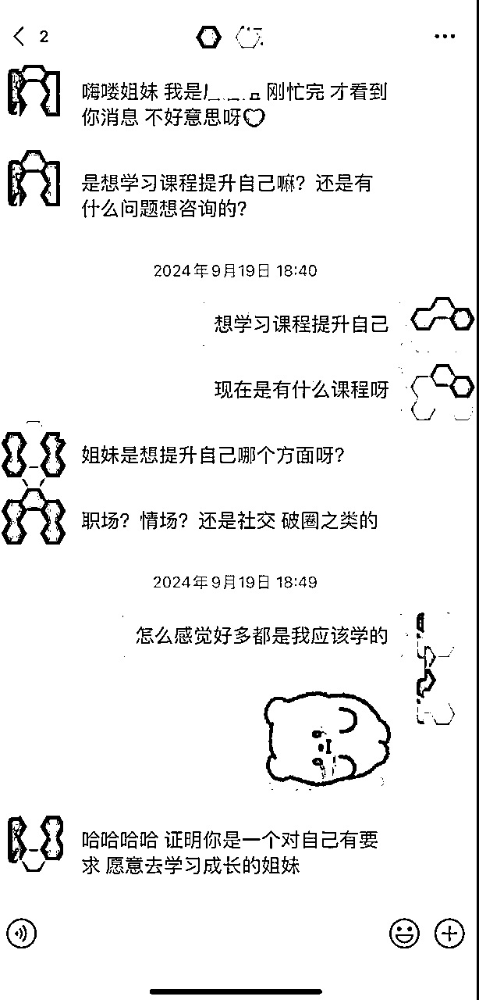

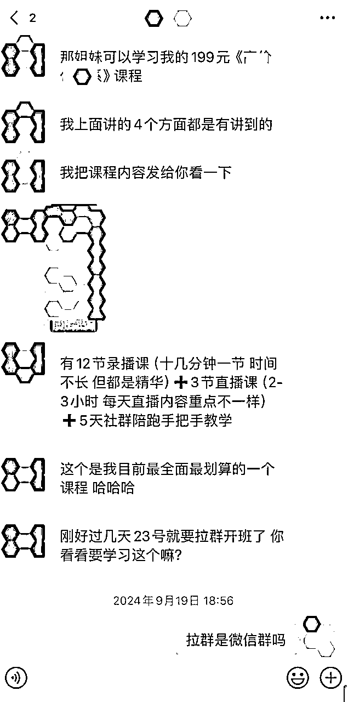

很多销售对男生和女生的态度是不一样的，一般来说会愿意花更多时间在女生身上（实话实说，做男生生意太难了，处处考虑性价比和回报率，消费力不如狗真不是吹的）这一点要细细用心去感受。

#### 5.3换量/转介绍/裂变

1.  私域换量

前提：你和对方拥有一定的影响力/微信好友，以及不同垂直业务。

举个例子：

比如A是卖水晶的，B是卖女装的，C是卖化妆品的，D是瑜伽教学的

这四个人都有一定的微信好友，但产品不同（不然就是同行了），服务的群体（客群）大概率都是重叠的，比如：20-30岁，在一二线城市，对生活质量有一定追求的女性。

那就可以让A发BCD的广告，B发ACD的广告，C发ABD的广告，D发ABC的广告（或者微信二维码）

原因：

你的微信可能短期不需要你的产品，但可能需要BCD的，对方的微信好友可能短期不需要ta的产品，但可能需要你的。

用这种方法，你不用去公域平台获客，这样增长速度快，有一定信任背书（具体看对方的公信力如何，如果对方风评不好，那就没必要合作）

1.  转介绍/裂变

转介绍

把部分利润让给别人，我们用心打磨产品，这个时候可以慢慢往产品驱动方向发展了。伟大的公司往往就是产品/模式驱动

裂变

在营销领域，“裂变”指的是通过现有用户的分享和传播，像病毒一样快速地获取更多新用户的营销方式。

常见的裂变方式：

*   拼多多砍一刀

*   支付宝集五福

去年很火的10年合伙人/战队/茶园股份（懂的人笑了，真的很像传销哈哈哈）

比如你是做A业务的，他是做C业务的，我是做B业务的，我们业务之间有些交集，那我们就做捆绑，一起做一个产品“10年合伙人”，承诺交付期是10年，让别人觉得有性价比。

同时让一群小弟给我们分销（特征：他们会疯狂在各种群聊疯狂加人，亦仁老大已diss)我们搞分销排名，给冠军队伍较高的物质回报和曝光（约等于影响力），曾经有一段时间我朋友圈被某些海报刷屏，也有圈友长期困扰于此，但不得不说，从业务角度来说这种模式很强大。

这种模式本质就是互相借用对方影响力/信任进行变现，把别人的私域当自己的公域。

我个人不喜欢10年合伙人这种模式，在我看来影响力可以换短期的钱，也可以换长期机会，我才21岁，对未来是很乐观的，我自己每年也在10倍增长，没有必要透支我未来10年来给你交付，为了当下你那1-2w块？

当然啦，只要你确定能用心交付10年，绝对不跑路，我双手赞成，nb！那确实高性价比了。

#### 5.4提效工具/精细运营

1.  用户打标签（其实就是微信备注的意思）

大家看完就知道怎么回事，祛魅很重要！

形式不重要，高效才重要（核心是结合销售漏斗模型和销售节点）

有了标签/备注，你就知道你该集中精力攻破谁，避免忘记回消息，这也是提高LTV/单粉产值的一种方式

如果用的是个人微信，不是企业微信，那就更好了，我们可以看到顾客的朋友圈，观察对方是怎么样的人，针对一类人发朋友圈。

建议：可以用个人微信尽可能用个人微信，企业微信有种天然的距离感，并且企业微信是看不到个人的朋友圈的~不好针对性发圈，不好判断对方性格爱好物质条件。如下图

企业微信也有优点：

*   防止加微信好友频繁，被腾讯官方屏蔽(个人微信显示：该好友加人频繁，暂时无法添加好友

*   防止员工带微信跑路，造成私域用户损失

*   收款更加合规，不需要各种证明，如果是个人微信添加好友，是很难在当天大额转账的

*   能组建n个群聊

*   ...

针对性发朋友圈，比如：

*   对方喜欢旅游，你就多发旅游照片（注意审美，如果拍不好就算了）

*   对方喜欢哪个明星，你就偶尔发发这个明星的博客，分享xxx歌曲

*   对方是创业者，那你就多发创业感悟/名人语录/AI提效等

*   也可以透过对方朋友圈，判断出对方是否有条件去付费，进而更多时间精力投入

销售也可以根据对方朋友圈引入话题进行破冰

*   比如对方刚去长沙旅游，那你就说你很爱长沙的小龙虾/夜生活/笨罗卜

*   比如对方刚去重庆，那你就说重庆火锅

*   比如杭州就说美食荒漠，但西湖walk惬意/小笼包好吃（但，千万不要贬低）

*   比如看书，你就结合书进行联想，对方喜欢看心理学，那你就聊阿德勒，弗洛伊德，荣格（现在ai很方便，哪怕你没看过你也可以问ai/小红书啊）

自古真情留不住，唯有套路得人心。

有套路很多时候并不是坏事，毕竟你提供了满满的情绪价值啊！！哪怕对方知道你是主动接近，但谁又能忍心拒绝一个愿意了解自己的人呢？

大多数人对“被理解”、“被认真对待”的渴望，远超对“真诚”“事实”的渴求。（恋爱脑、人性本身就是这样滴）

而且，现在短视频如此发达，都追求短平快，我们渴望被理解，却失去了理解别人的耐心。你有耐心，可能就已经赢了。

1.  ERP和SaaS软件（直接上AI）

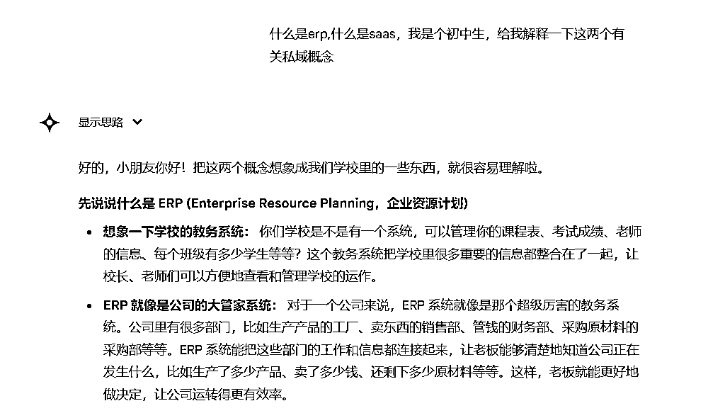

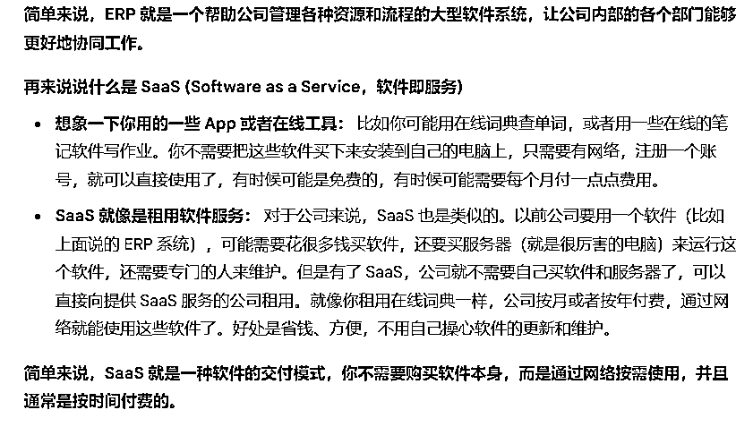

*   ERP 的作用： 比如，哪个顾客买了什么东西、订单处理得怎么样了、仓库里还有多少货、需不需要补货等等。ERP 可以帮助商家高效地处理这些信息，确保顾客的订单能够被准确、快速地完成。（ERP主要是用在私域电商，如果是虚拟服务，大家要学会用好飞书多维表格！）

*   SaaS 的作用： 可以帮助商家管理微信群、自动回复顾客消息、分析顾客的喜好、精准地给不同的顾客推荐不同的产品等等。商家不需要自己开发这些复杂的软件，直接租用这些 SaaS 服务，就可以很方便地把“私域”运营起来。比如企业微信，有赞，微盟

1.  SCRM聚合平台

简单理解，我们手头微信号如果太多，用不同手机回消息是很麻烦的，SCRM系统有点像多开微信

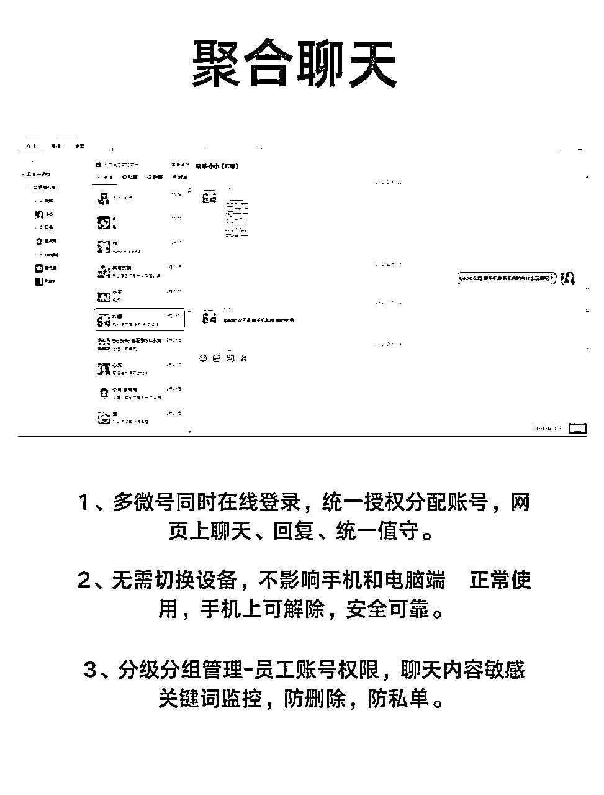

注意：

其实这里私域管理方面有很多工具（有不少是纯割韭菜，有人甚至卖自动获客软件，要是这个能做到，怎么轮得到你？？？完全就是利用平台漏洞啊！！！顶天就是用几天）一定要注意软件的运行逻辑，防止被封号，特别是微信聚合平台，永远不要去对抗腾讯爸爸的规则。

运行逻辑举例：

比如说A，B，C，D，E五个微信号，聚合平台运行逻辑最好是收集微信号信息，再上传到聚合平台（类似复制粘贴），我们在聚合平台统一看到消息，再进行回复。而不是直接利用微信漏洞，修改程序，打乱信息链路传递

1.  一些app/网站

*   SEO：

DSO110

https://dso100.com/

DSO114

https://www.aidso.com/

*   小红书封面：

可画/稿定设计（电脑）

*   朋友圈做图工具：

微脉水印相机app（很方便打码）

### 6.面试

这里有两种角度，一种是被面试者，一种是面试官

#### 6.1被面试者角度

为什么要面试？如何高效面试?

很多时候，哪怕互联网再发达，生财的小伙伴再愿意分享，也不可能直接把自己做到项目/账号告诉你，人之常情

但是去面试/实习（哪怕就干半天就跑）是能真实接触赛道近况的，你可以随便在互联网装b，可以随便晒结果，但一旦到具体业务，我们必须求真，必须诚实面对自己。同时如果遇到流量困难，找不到高效的模板，去待一天就知道近期爆款模板是什么了。

甚至不用待一天，直接问面试官/老板具体形式（有些小公司未必有hr）

理由：你不确定你能不能快速上手，是否需要很强的剪辑/ps之类

实在不行可以这样，你拿过去你的模板（我之前就是这样知道不少爆款模板）问他们现在的模板是什么，类似于换模板，多了其实可以吃掉整个赛道的模板

我大学零零散散面试过接近百家公司了，可能有人问怎么做到的？一天约10个面试，一般人是很难顾及时间的，但是假如我们按照区域来面试呢？

广州分为天河，白云，越秀，番禺，海珠，黄埔，南沙区，你选好同个区的流量公司，一天就刷一个区，约好时间，通勤时间大大简短。而且现在ai很发达，你可以把公司的地址给ai，让ai帮你规划路线和时间安排，特别方便。

如果有点点小钱，那就派你的助理去面试或者去学习，这是我最爱的用法，特别舒服，前提是你的助理是个情绪稳定、懂业务细节的人，如果是女朋友就更好了！

如果有点钱，通过关系/钱找到hr（人事）和小组负责人，hr肯定是知道企业要招什么样的人，需要什么样的特质/品质，业务需要做什么。直接了解内幕，这样效率高。

看一个企业的前景，要么看创始人的价值观，要么看hr，hr非常重要，是企业的门面，如果hr拉跨，这个企业就不用看了。

还有一点：

面试多了，你会慢慢锻炼自己的表达能力，我大学以前蛮内向的，说话磕磕巴巴。

#### 6.2面试官/老板的角度

以高于行业20%的薪资去招人，疯狂筛选，搞不好可以听到一些从未听过的流量打法和运营细节，遇到一些人才就可以留住。----杨涛

因为本人之前招助理，没面试多少人，不过多说

主要考虑以下几个维度：

1.  对方学习意愿（平时喜欢干什么，平时有没有学习，学什么）

1.  抗压能力，生活压力

1.  e人i人，是否自我设限

1.  对时间的观念，执行力（安排个任务给ta，让ta完成，看对方完成度和效率）

1.  简历写的怎么样（有没有符合岗位描述，最快到岗时间）

1.  有没有对象（很重要，特别是需要出差的岗位）

1.  眼缘（相信自己的直觉）

1.  容貌（邋遢与否）

## 五、心得

这一整篇文章是我一年以来的成长和认知，能全部落实文章所提0-1，1-10的非常非常非常非常少，哪怕是50人以上的团队！！大部分就是有A没B，有AB没C。

其实看完这篇文章，你的商业闭环思路应该是一通百通的。

比如你现在想要开一家实体店：

第一，你要想你能开什么店（宏观市场分析）

什么市场是上升趋势，什么是下降趋势，比如医美肯定是上升，如果你开个店卖奶粉，那就完了。

第二，你要自身资源盘点，总不能你余额100w就想开个医美店吧，光是设备和场地就不够

假如你真的有一百万，你最多的预算就是30-50w，预算噢，实际上你的成本大概会是预算的1.3倍往上走（大概就是39w-65w，这个比例很高了，一般来说拿你的现金余额1/10去博一个机会就差不多，你不会动作变形)

第三，我们要知道我们想的是赚钱，不是去发明个新东西，那我们就要解决流量和销售（商业闭环思维，mvp)

哪一个地段人多人少，你要线下去感受和调研，最好就是可量化可视化（具体到多少人），周一到周日，节假日的人流量，有没有同行，同行做的怎么样？方圆1-3公里有多少家同行？

第四，你要开始严格控制成本，尽可能在你跑通闭环前，减少成本投入，最好就是你本身有一批用户（你从你的上家公司偷来，信任你的用户，你从现在开始获客都可以，这样是最稳的打法）

第五，如果你赚到第一块钱了，那你就可以开始考虑放大，流量---销售---产品，把客流量提高（线上，线下），销售转化率优化（看看同行怎么做的，抄过来）把产品成本降低，尽可能提高复购率。毕竟公式利润=流量*转化*客单价-成本。（你也可以派助理去同行偷师学艺，你也可以自己去，也可以招hr，可以挖人）

第六，搭建和优化关于流量——销售——产品的sop，销售漏斗，销售正负法则（假如你是开奶茶店的，怎么招待顾客，怎么配奶茶，怎么处理退款，不能对顾客做什么，都是可以标准化的）尽可能标准化和规模化，小企业的优势是灵活，大企业的优势是稳定。

第七，你可以开始优化自己的产品（争取做一款80分的产品），招人才来管理，招基层员工来执行，定制好kpi，提高效率，你也可以搭后端erp/saas（微信小程序/自己的软件等等），也可以搞起直播孵化ip

第八，开始放加盟（知识付费放大）或者阿米巴（如果周围人有实力+愿意参与的话），或者自营盘放大（不单单开一个店铺，开n个，注意现金流！！防止回款周期过长，直接一批倒闭，口罩时期拷打一批不重视现金流的人）同时甚至和一些ip联名（借势）做裂变（分享得券，免费体验xxx，类似拼多多砍一刀）

第九，你开始重视合规，税务，企业文化，文化价值观，长期主义。

第十，准备ipo上市敲钟吧！

很少将这些方法全部落实到位，放大真的很难，只能一步步迭代，我只是把我知道的，我看到的全部集合总结。大家也不用太焦虑，世界是个巨大的草台班子。

顺便聊聊自己的一些感想和心得

#### 适度焦虑，循序渐进

在生财有术这种创业社群，创业者本来就集中，和搞钱相关肯定会有噪音，一年前那会真的是数据满天飞，GMVxxxx万，一年投放xx个亿（当然现在数据少了很多，官方也不鼓励，这一年生财变化很大！）

看多了容易焦虑和迷茫，怀疑自己的节奏，让自己动作变形。

但其实不用很焦虑，四个方面：

*   平台变化很快，时不时就封号，闭环跑通也未必能持续多久，对普通人如此，对团队打击更大。

*   团队都不一定能算好账，roi都不一定能打平

拒绝GMV焦虑

例子： 在抖音卖出了100件商品，总共的销售额是10000元，那么GMV就是10000元。但他不一定赚，他的商品成本，投流成本，人力，设备，水电，租金可能就不止10000元，搞不好亏本，且爆款不是天天有

提一嘴，关于知识付费

我哥是做国内电商的，自有货源，之前有客户和他进货，但是卖的比他的成本价还便宜，我哥干不过他，对方店铺销量10w+。后面才知道他不是为了赚电商的钱，是为了赚知识付费的钱，所谓的销量10w+店铺是背书，给别人看到觉得哇！好牛逼！怎么做的？教教我/求带？---------有时候，你看到的只是别人想让你看到的，所以要适度谨慎，看到秀数据统一打1-3折。

*   不是所有人都能搭好团队的（薪酬，文化，公司氛围，对抗不确定性，沟通能力，迭代能力），也需要基层执行到位（公司的流量岗位要求很低，很少能招到能打的，下班10点还回消息，很多人是没什么网感的）

*   很多年入百万的数据，你要仔细分析，他的收益是来自业务还是知识付费还是投资还是投机，可能业务年入20w，知识付费卖项目赚20w，买btc或者个别小币种赚了60w呢？（我19年开始关注btc，那会还在读高一，那会最低3000美金/个，前阵子10w美金/个，假如当时买了10个长期持有，且现在卖出，那我也赚了5820000rmb了，综合算下来算不算年入百万？？）

只要你终身学习，足够细致，足够有耐心，慢慢迭代，坚持执行，他们放弃了，你就能吃掉他们的市场份额，你就赢了。

#### 好好吃饭，好好睡觉

平时潜心练剑，多锻炼，发财是一哆嗦/一阵子的事情，真赚钱的那一阵子搞不好通宵，可能会作息颠倒，不敢停也不想停，赚钱的时候天数是很少的，身体和心力一定是最重要的！！！！在项目红利期保持顿感，猛猛赚钱，在低谷期保持开放，多多学习，好好沉淀，好好生活。

#### 善用搜索和ai

生财官网（多用电脑版生财小组，分类好看着是真舒服）

谷歌（谷歌是很强大的，年初我搜到一篇4年前看过的知乎文章，作者已删除，结果谷歌有人留存！)

公众号，小红书，哔哩哔哩，咸鱼，拼多多，淘宝，x，reddit，YouTube等

很多人忽视了咸鱼（咸鱼有很多大家想不到的项目，本地生活变现甚至不亚于小红书）和AI的重要性（Gemini，chatgpt，豆包等）

比如：我在写这篇文章的时候，我让ai帮我完善

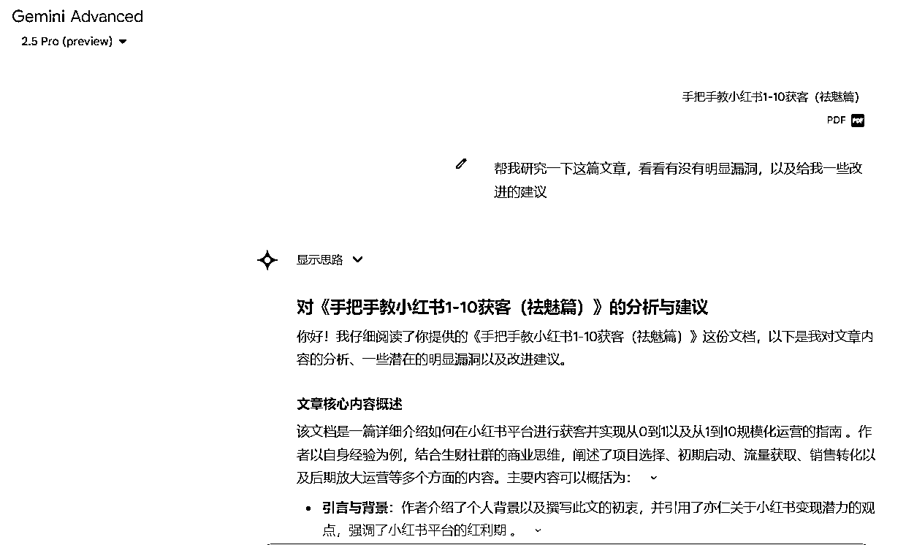

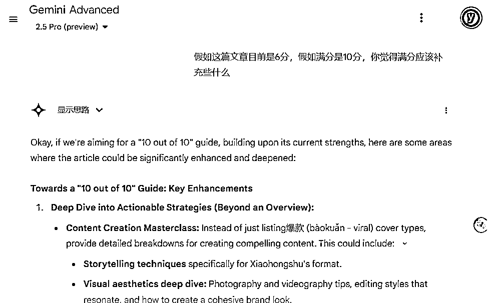

#### 多参加线下组局，十倍增长

我每次飞速进步都是因为参加某个组局，强推万能哆啦A梦---杨涛的局（记得提前准备好自我介绍和问题，起码20个吧，啥都能问，和问AI还是有很大不同的，毕竟阅历摆在这）

我24年9月份周六日连着参加两次，后面认知和搞钱能力指数增长，我的商业思维连点成线，连线成面，爽到大半夜一直蹦出新想法，愣是3天睡了2小时。当你肉身周围是创业者那种感觉，和只在互联网线上看帖完全不一样，谁去谁知道（今年我一定要多组局）

同时，还可以交到不少真心朋友，少走了很多很多弯路，不单单是赚钱层面，我的十倍增长绝对离不开线下聚会

#### 对钱敬畏，向结果致敬

别人在做什么，当下拿到最大的结果，那就跟着谁，而不是以道德角度去评价对方，说割韭菜，在吹牛。只有在路上，才会发现前人已经把路告诉你了。

就像现在，我本身是很不喜欢写这种又臭又长的文章(心流状态莫名写了2.8w字，能看到这里，你太棒啦！），但我发现很多优秀的00后都在生财输出内容，积攒自己的影响力，拿到了大结果，那我就得照做，没有为什么，人家拿到了更大的结果。

#### 定目标

（如图所示～涛哥前两天刚好发了～）

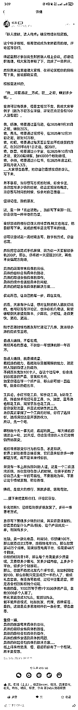

我在大家面前立个目标吧～

我yeye/耶耶要在2025.12.31前，在生财有术社群通过发布5篇精华文，10条中标。

大家还记得我前文提到LTV/单粉产值吗？

我们可以基于数据来定目标。

例子：

如果你的单粉产值是50元，你今年想要销售额100w，你就需要引流20000个人，那你再具体到每天引流20000/365=55人/天。

如果你做免费流量，那你就要准备好辛苦劳作，每日更新。

假如平均一个小红书账号一天能引流3个人（已经很高很高了，特别是精准流量＋高客单）每个账号每天发2个帖子，那你就需要准备18个小红书账号（根据一机一卡原则，你需要18个手机），每天发布36篇帖子。一个月就是36*30=1080篇帖子，一年就是发12*1080=12960篇帖子。

成本：

18个手机，一个600块钱，10800r。

18张手机号码，假如你本身有一张日常用的，一张我们算20块钱，那办理手机卡就大概17*20=340元。

手机号每个月的月租是29r的话，一年的手机套餐费用是29r*17*12=5916元

我们先不算场地、水电、软件、后端成本、网络、人力，注册公司/执照，税，人情世故，我们这里总成本是17052元。

但，你以为这就算对了么？

错！你做免费流量引流到私域必然是会被封号的啊，就不说315一次性封几十百个号了，手机会被限流，手机卡就不对，绝对不止那么多手机卡，且有些手机卡/账号就是天生没流量的，一个号也发不了那么多帖子，你不用花时间和精力销售和打磨产品？你怎么能保证自己能每天发那么多帖子呢？不休息么？所以这种算法是错误的，根本就不够细致啊！！

所以就有团队按照季度定目标（kpi），分为Q1,Q2,Q3,Q4，细分到Q1,Q2侧重流量端，Q3,Q4侧重销售和产品。通过大促赚钱，比如电商平台618，生财的418，双11

出个题吧，增加一下互动，对于这个题，你觉得要年入百万怎么算呢？（评论区见）

当你考虑赛道天花板，开始招助理（解放自己的时间），开始考虑付费投放，开始找人才，开始拥抱不确定性，开始考虑投产比，开始考虑效率问题，开始考虑现金流，开始慢慢迭代优化，开始尊重结果，尊重人性。——取经之路，就在脚下！

当这些观念刻入到脑子里，你会慢慢有赚钱的体感，就像学骑自行车一样，学会了，只会越来越熟练，一点点调整自己的认知，慢慢也不会那么焦虑，因为你发现再怎么焦虑也没用......你必须慢慢来，一步一个脚印来。

#### 感谢生财有术

感谢大家花时间看完我的帖子，祝大家身体健康，万事胜意，早日发大财！

对这篇文章，如果大家有什么疑惑点，在知识星球评论区提问/质疑即可，我会回复，谢谢！