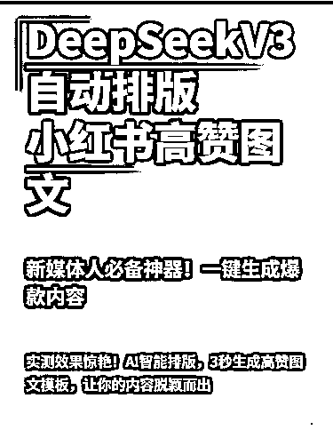
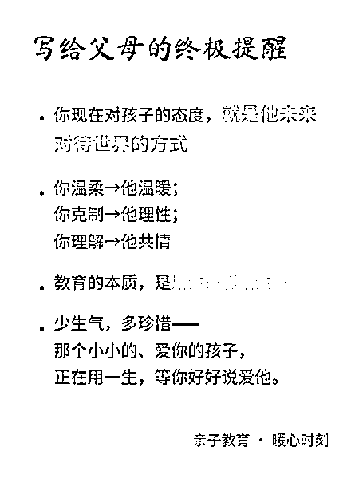
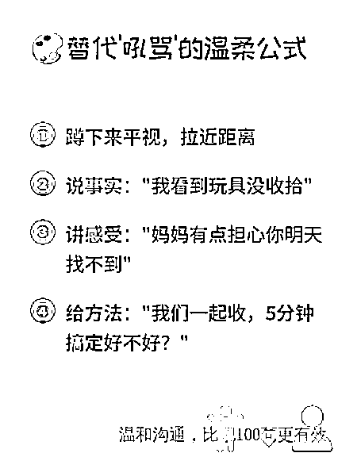
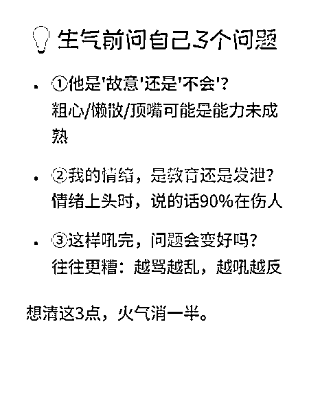

# 我做了个智能体，文章秒变小绿书图片，效率提升不是梦！

> 来源：[https://b121w2zgwyx.feishu.cn/docx/EQqQdi79woDZJbxyogZctCASnzC](https://b121w2zgwyx.feishu.cn/docx/EQqQdi79woDZJbxyogZctCASnzC)

前段时间，我把公众号的文章发布做成了扣子空间的MCP调用，本来只是想自己用用，顺便分享一下，没想到有那么多人有这种需求。还没看过的可以查看

## 那么？有没有人想要做一键发布小绿书的呢？

有的，我自己，我一直以来都想做一个小绿书的自动发布，当时折腾了一半，放弃了，因为有些问题没攻克。coze的图像模型已经加入了即梦3.0，它的图像可以支持文字的生成，非常强，如果做一些治愈语句，或者金句分享之类的，现在应该可以做出很好的效果了。

可是有个问题，就是对于信息密度高的，比如一些小知识分享之类的，因为文字较多，即梦3.0还是有点hold不住。

于是我没有继续。

## 小绿书一键生成的转机

后来，看到DeepSeekV3新的模型出来，因为它的代码能力显著提升，我看到好多人用它来做知识卡片，其实就是利用它的编码能力，将文字转化成html来展示出卡片的样子。效果也是相当不错的，如下图：

但是这个方案又有一个问题就是，大模型生成出来的其实是一个html网页代码，需要部署才能查看，每次都要拷贝代码去做页面也是很麻烦的，于是，我后来做了插件，可以自动帮用户将代码转成网页。

网页问题解决，新的问题又出现了，如果我们需要转换成图片，要么自己截图，要么提示词优化，让生成的代码有自动下载的功能。

然后，新的问题又出现了，即使网页有了保存和下载功能，那我们还要去点保存才行啊。图片一张一张生成保存？多废人啊，而且我有发现，有的时候，通过代码技术下载的图片，有点时候样式跟实际看到的是有差别的，甚至样式丢失，很不好看。所以，这种方案还是不适合做成自动化。

## 关键技术突破

可是我不死心啊，我就一直想要发一篇公众号，然后一键转成小绿书知识卡片。于是我又开始琢磨，既然直接下载的不合适，那么我就应该模拟人为的去截图，这样图片才是最原始的风格。

于是我想到了RPA，不得不说，RPA真的是AI的最佳搭档啊，为了将图片稳定输出，我决定使用代码写RPA功能，而不是用已知的RPA工具。因为我要将这个部署成api，给coze调用，最终实现，输入网页，得到截图。

经过几天不懈的研究，总算是被我做了出来，这个是我智能体的运行效果，我找了一篇爆款，信息密度比较高的文章生成了一下:

以下是其中三张的效果，不知道你们感觉如何，反正是符合我的预期的，就是图片有一点模糊，不过在手机上看还是可以的，后期看看如何优化。

## 体验地址

https://www.coze.cn/store/agent/7505777225267429412?bid=6gb9b31ag1009&bot_id=true

因为截图服务其实是利用我的服务器运行脚本，跟普通API的调用还不太一样，每一次请求起都要有进程跑RPA做截图，如果人多的话，服务器扛不住会出错，因此不适合做成公共服务，最好是人手一套自己的，哈哈。

后续，同样的，我会将这个集成到MCP里面，到时候也可以一键发布到公众号去。敬请期待！