# TikTok小店无货源模式，新手第一个月盈利5000＋复盘

> 来源：[https://zpbk45x53e.feishu.cn/docx/F1uUdMqyFoiC6zxZuFlc3bpdnmJ](https://zpbk45x53e.feishu.cn/docx/F1uUdMqyFoiC6zxZuFlc3bpdnmJ)

# 前言

大家好，我是北苑。

大二暑期加入的生财，到现在也快4年了。从生财学到很多东西，也通过生财赚到了第一个六位数，很感谢生财！！以前真觉得自己没有什么干货可以分享的（好像我知道的大家都知道哈哈），不过看到太多优秀的圈友都在真诚地分享自己的项目经验，我也应该向他们靠近才是，所以我也把我最近在做的TikTok小店无货源的实操玩法分享一下，希望对在做这个项目或者想做这个项目的圈友有帮助。

我是4.16号开店，4.20号开始正式上架产品，第二天也就是4.21号就出单了。上架就出单。一单好的赚个一百多，两百人民币，普遍的是赚30-100人民币，主要看产品，当然也有亏的，第一个月我不懂定价，个别产品会出现亏几块十几块，发现亏损后边就调价了。

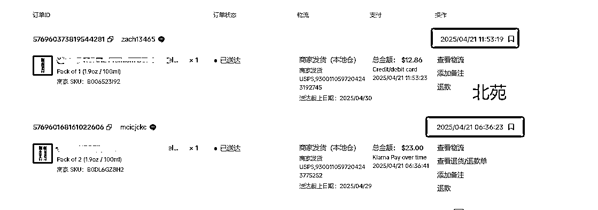

（4.21日出2单）

截止目前2家店月GMV有5000刀，换算成人民币就是3.6万，售后率5%，新店第一个月以先出单起权重为主，利润率只有15%，第二个月开始会慢慢把利润提高到30%。第一个月基本只做一件事，就是选品修图然后定价上架，熟悉后一天花4、5个小时选品上架就差不多了，售前售后咨询都很低。

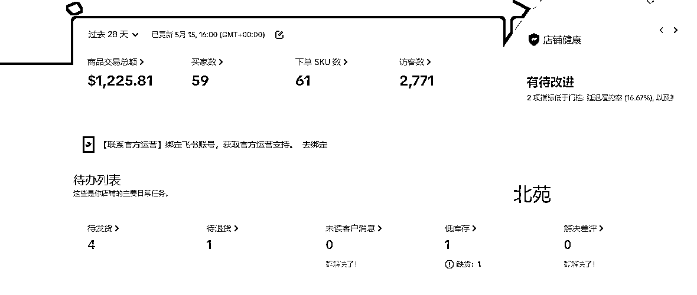

（店铺1）

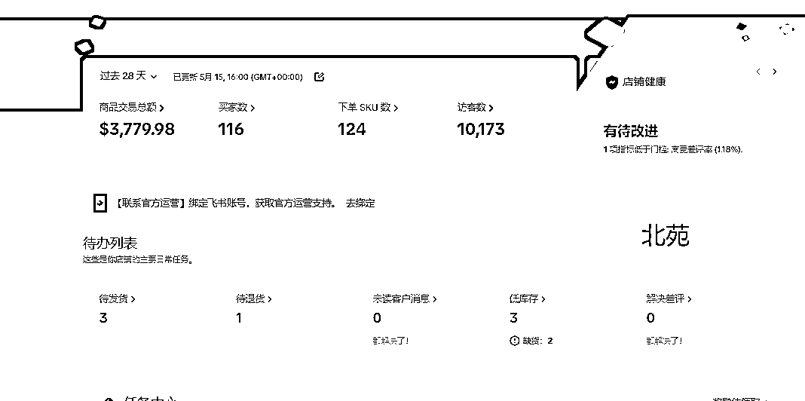

（店铺2）

# 项目逻辑

开Tik Tok美区小店赚美刀，我走的是自运营模式，不是全托管，用的也不是虚拟仓，都是美国本土发货，第一个月也都是铺货模式，没有精细化，只管上架。因为是跨境新手，一开始打算先做3家店，但是我的人脸在开店的时候一直不通过，折腾了半个月，经历了换位置、换设备、换发型甚至最后重新线下办理身份证再人脸识别也不通过，所以只搞了2家店。

项目的逻辑就是和国内的无货源一样。在A平台开店上架产品，有单子了去B平台采购下单发给客户，客户签收后，无售后等回款即可。这里的A平台就是Tik Tok，B平台就是亚马逊。放在国内，A平台就是小红书、淘宝，B平台就是1688、PDD。

做过无货源电商的圈友对这些环节应该就很熟悉了。具体的操作路径就是：开Tik To小店——选品修图上架——通过运营搞流量——出单后去B平台采购——填写单号到Tik Tok小店——处理售后——等回款。

大家可以看一下，图一是Tik Tok上我搜的假花，售价19.17＋运费售价9.99＝29美刀，销量6.1万单；

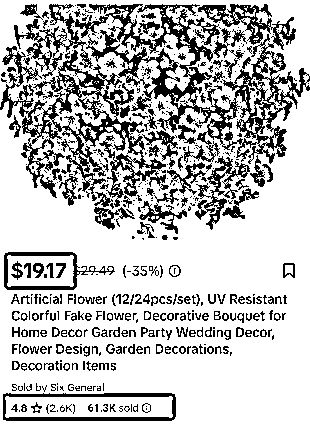

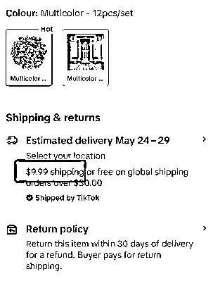

（图一）

图二则是亚马逊上以图搜图搜出来的同类产品，售价18.99,包邮0运费。二者相差10美刀。

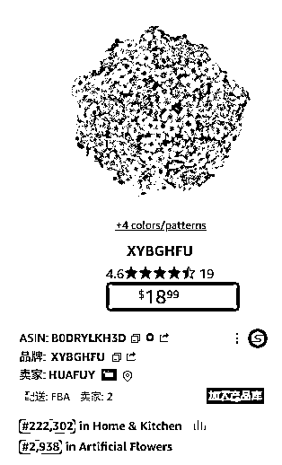

（图二）

下面这个则是搜索的沐浴垫。图三Tik Tok上产品售价14.8＋运费7.99等于22.79美刀，销量457单；

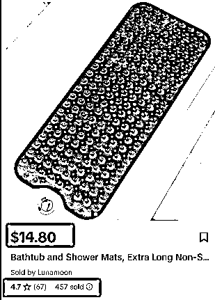

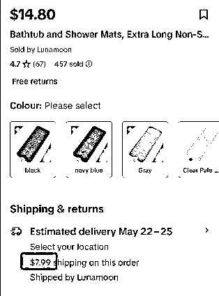

（图三）

图四是亚马逊的售价9.99美刀，同样包邮。二者价差12.8美刀

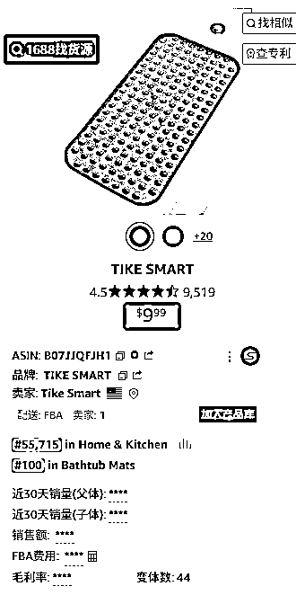

（ 图四）

像上面的这些产品在Tik Tok上有很多，有价差就有实操获利的可能。

接下来，我就分享一下具体的实操。

# 开店

前期准备：

①一张电商经营类目的营业执照（不同站点要求不同，我做的是美区，个体户营业不支持开店）

②注册ushop多开软件（内置IP代理功能，防止多店铺关联封号，USHOP注册官方链接：https://www.ushopbi.com?）

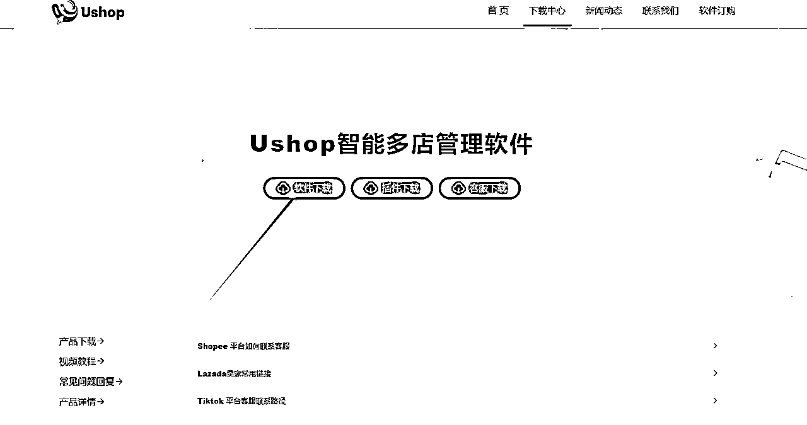

办理好营业执照之后，我们下载注册ushop软件，然后在ushop软件内购买店铺额度和代理IP数量，最后通过ushop注册Tik Tok小店。具体操作如下：

首先是注册ushop，注册之后，就是在ushop软件内购买店铺额度和代理IP数量。

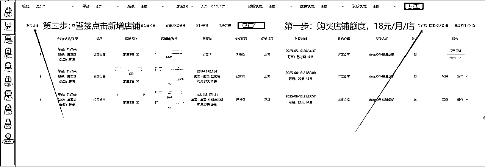

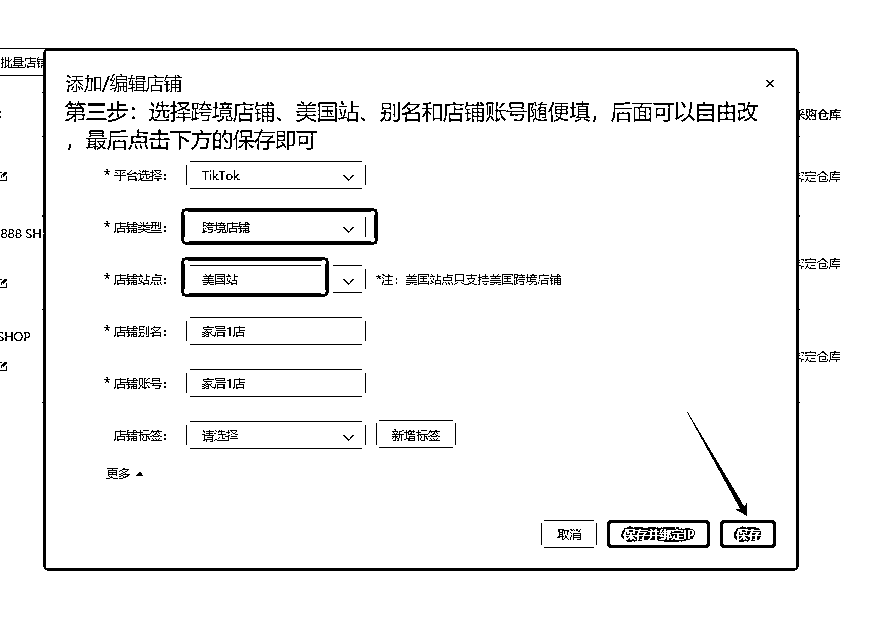

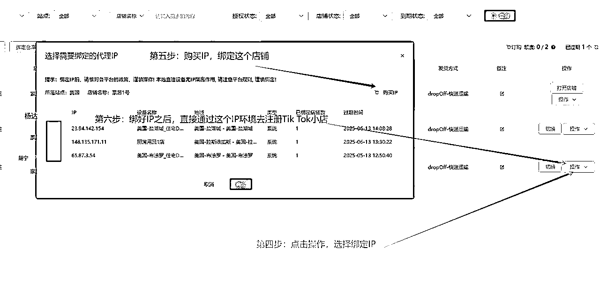

接下来是通过ushop注册Tik Tok小店，注册具体流程和注册完成之后，店铺基础设置生财就有帖子，跟着这篇文章操作就可以了，这里就不重复造车轮了，没有邀请码选择普通入驻即可。

# 选品修图上架

店铺设置好之后，就开始到选品上架了。选品思路，第一种是直接在亚马逊上根据类目关键词选品，价格直接翻倍上架到店铺；第二种是在Tik TokAPP上选择销量数据好的产品然后到亚马逊上核对价格，利润不错的产品上架；第三种就是借助第三方工具选品然后到亚马逊核对价格，价格翻倍上架到店铺，工具网上很多的。第四种是Tik Tok小店里面有个商品机会，平台也会把当下的热销产品推荐给你，可以跟着商品机会里面的产品选品。

选品方法很多，我第一个月就是使用的第一种选品方法，直接采集亚马逊的产品加价到Tik Tok上面去销售。现在开始尝试第二种，专门针对Tik Tok的爆款选品。

## 前期软件准备

选品需要用到的软件、插件以及网址有：

①妙手跨境ERP（这个是用来采集商品的，百度搜索出来的第一个然后注册，接着把妙手与Tik Tok店铺授权关联即可，妙手有授权教程跟着操作就可以了https://erp.91miaoshou.com/help_center/article_3192.html，最后把妙手插件安装到谷歌浏览器上，这样就可以采集亚马逊的商品到我们的Tik Tok小店）

②卖家精灵（这个插件主要是用来看亚马逊上的产品数据的。在谷歌浏览器扩展程序那里搜索卖家精灵就可以下载插件）

③亚马逊官网（Amazon.com）

④Tik Tok(需要自己下载，后面可以直接在Tik Tok上选爆品）

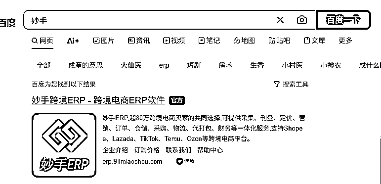

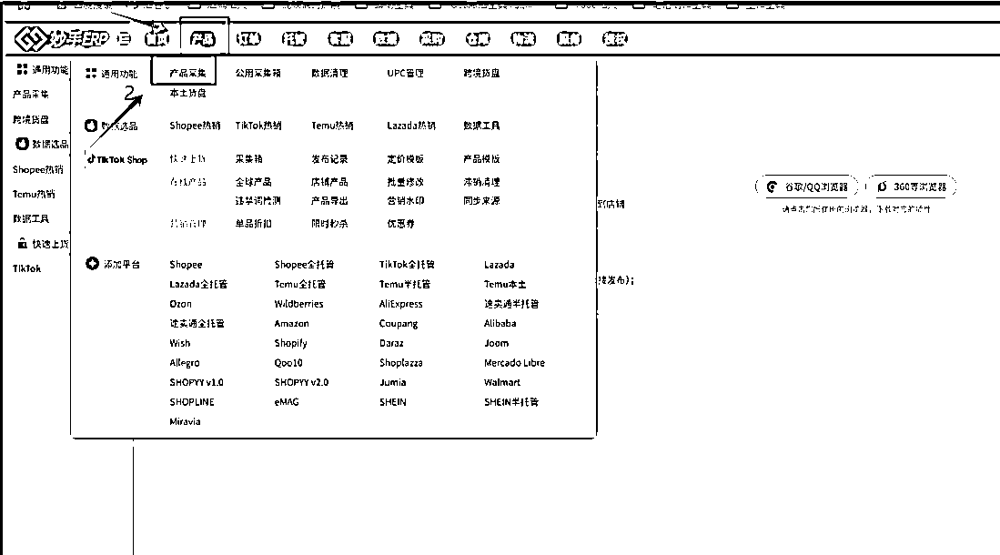

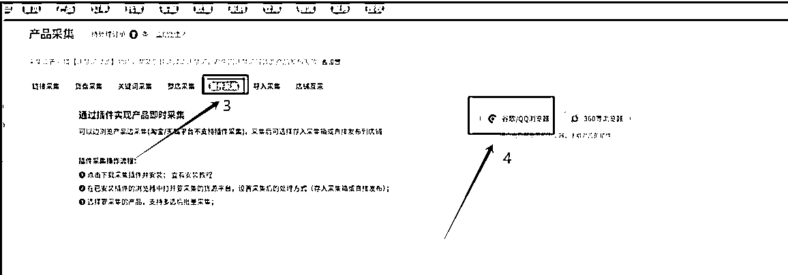

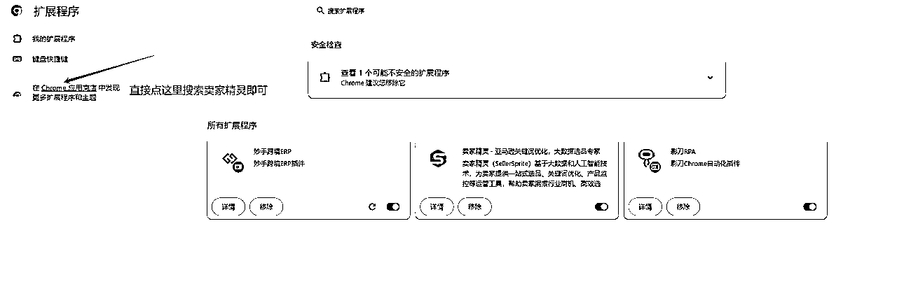

## 选品

好了，当我们安装好两个插件，妙手也和我们的店铺关联后。开始选品采集，这里以第一种选品方法为例，直接根据类目细分词，选品采集。

首先我们现在登录到亚马逊官网，看到的界面就是下面这两张图。亚马逊搜鞋柜这个词，出来的图一，我们就可以直观的看到，一个产品的评分、评价、价格、最近一个月的销量、发货时间、哪家快递发货、是否包邮等。

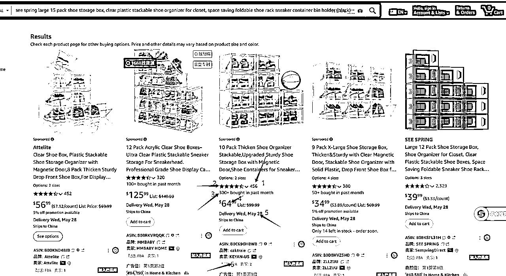

（图一）

点进去这个产品，可以看到右下角有个采集此商品，要是觉得这个产品合适就点击采集，这个商品就到了妙手里面。

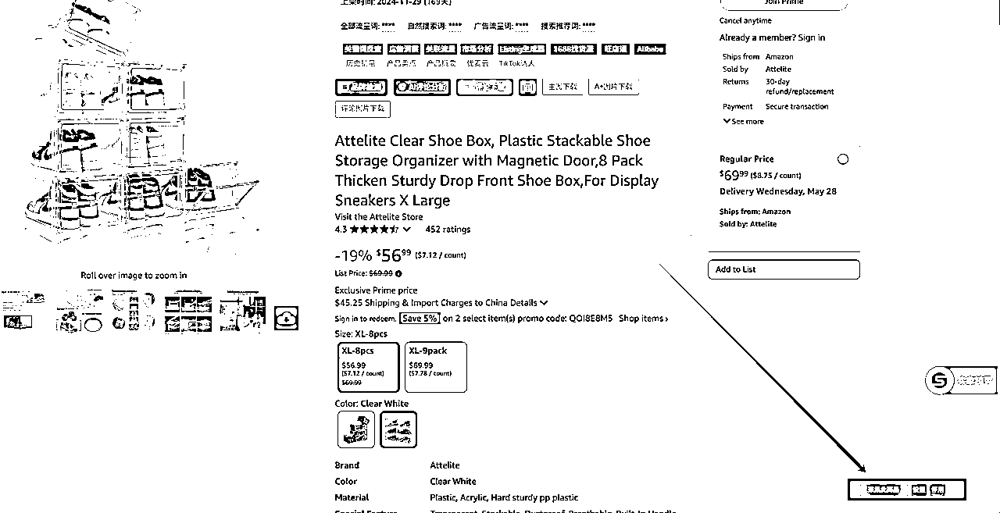

（图二）

回到妙手，点击产品-产品采集-点击Tik Tok，就可以看到我们采集的产品

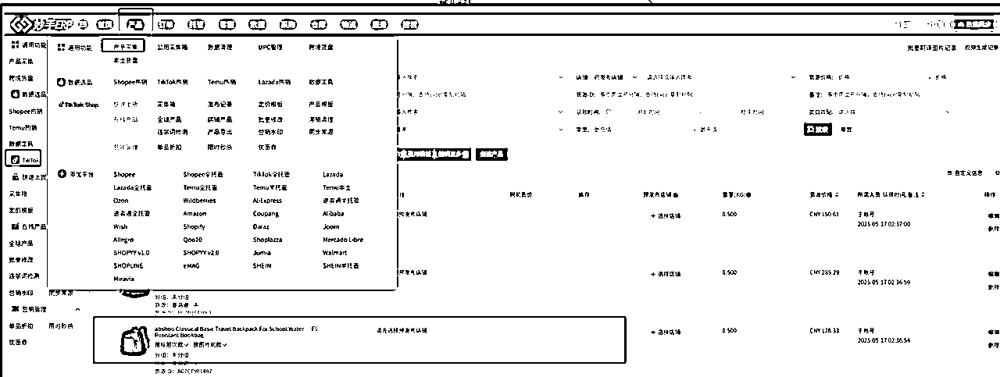

## 修图

为什么要修图？是因为我们采集的产品可能标题、产品详情页带有品牌词，图片带有品牌logo，如果直接上架到我们Tik Tok店铺是侵权的，被品牌方投诉，店铺就会违规，我就吃过一个违规，虽然影响不大，但是还是要慎重，违规多了影响店铺权重。所以我们需要把这些品牌词以及可能出现的一些违禁词删除掉，然后再上架到我们店铺。

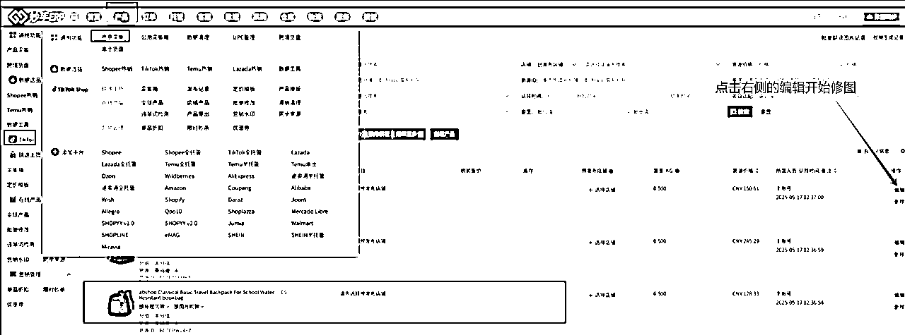

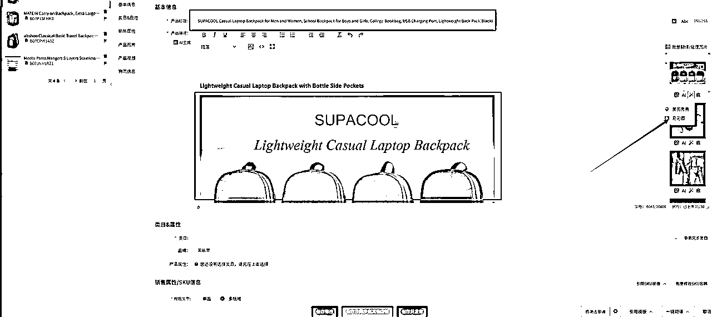

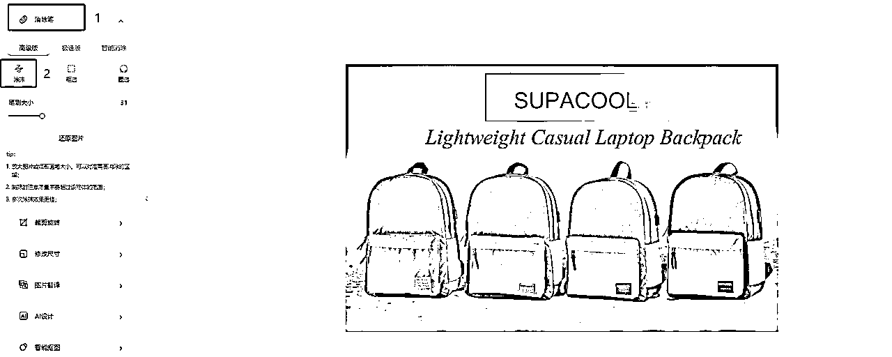

修图也很简单，标题不清楚有没有品牌词的安装有道翻译插件，翻译一下就清楚了，品牌logo一般都会出现在图片做左上角或右上角也很容易判断。看到有品牌logo点击右侧的画笔，选择易可图用消除笔擦去即可。

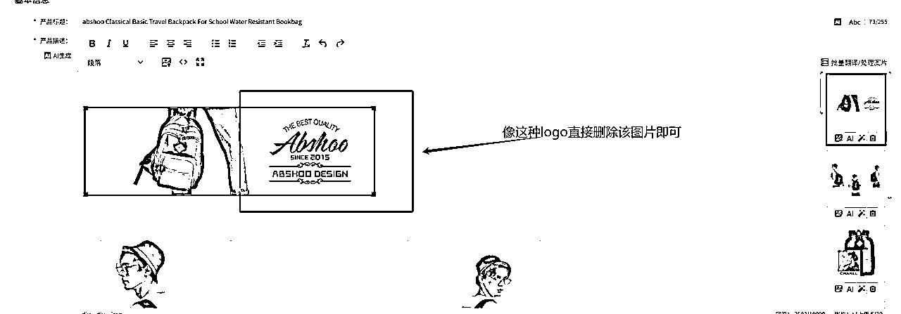

## 定价上架

图片修改完之后，就是定价，然后上架到我们的Tik Tok小店开始售卖。如下图，首先点击设置售价，选择使用公式，我一般设置2.8倍——4倍，然后保留2位小数，选择应用至选中，最后点击批量发布，就会发布到我们的店铺，自动审核售卖。

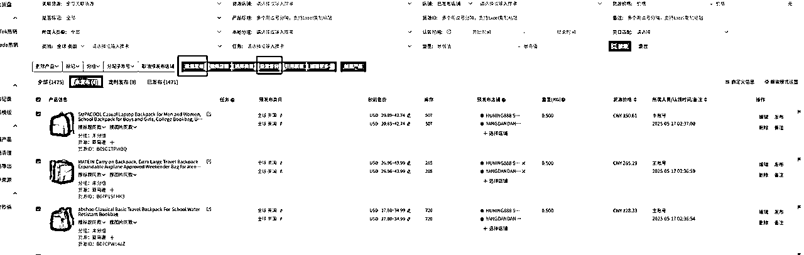

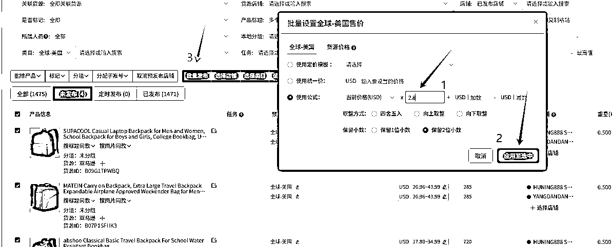

# 店铺运营

产品上架到我们店铺之后，平台会给新品曝光，运营前期可以只做4个动作：①设置折扣活动②包邮活动③优化商品标题④一个周之后删除曝光以及点击率低的产品。

其他的比如邀约达人，开广告，报名参加平台活动，弄短视频等可以等出单有销量了，我们对产品利润清楚了再做，运营一开始主要还是①②③④。

## ①折扣活动设置

因为我们是把亚马逊上的产品加价到Tik Tok上来卖，价格如果太高，卖不动。

当我们把亚马逊上一件售价10美刀的产品翻2.8倍到Tik Tok小店后，现在店铺里的售价是28美刀，价格太高。

我们就建立一个限时秒杀折扣活动，直接打5折，以14美刀的价格售出，再加上包邮的活动。这个策略在起店前期可以帮助我们快速出单。等到店铺每天都稳定出个10来单，就可以把包邮活动取消掉，然后把运费从3.99、5.99、7.99往上加。这样，我们就可以赚取运费的价格以及产品的价差。

具体操作如下图。

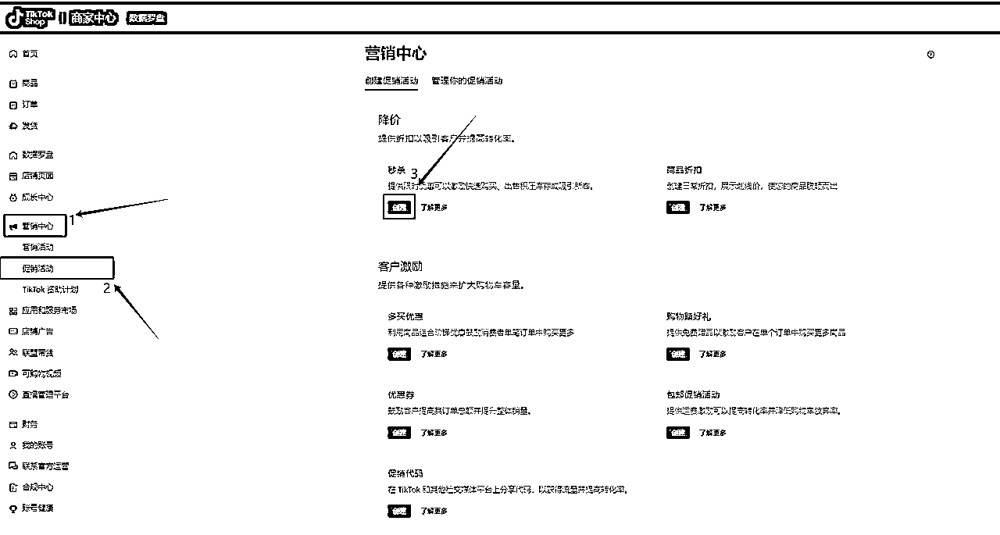

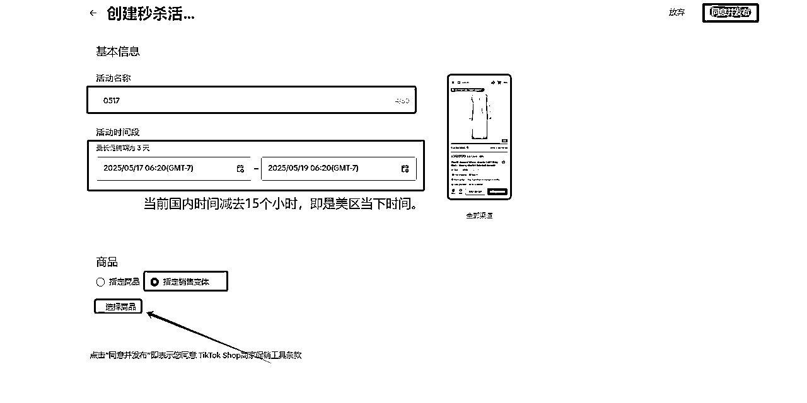

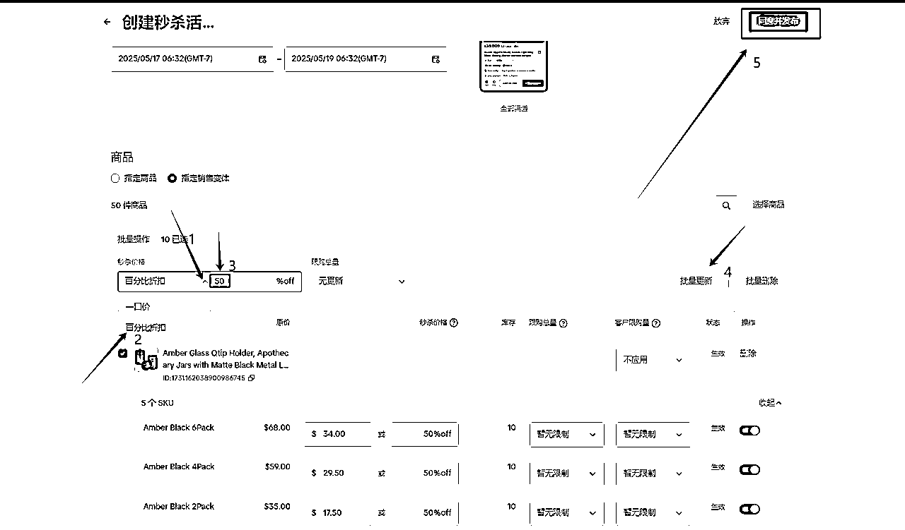

## ②包邮活动设置

包邮活动前期肯定是有利于出单的，后面要提高利润就取消包邮，运费设定3.99——7.99不等。这样的运费定价在Tik Tok是没有问题的，很多产品这样设置，照样卖得很好。

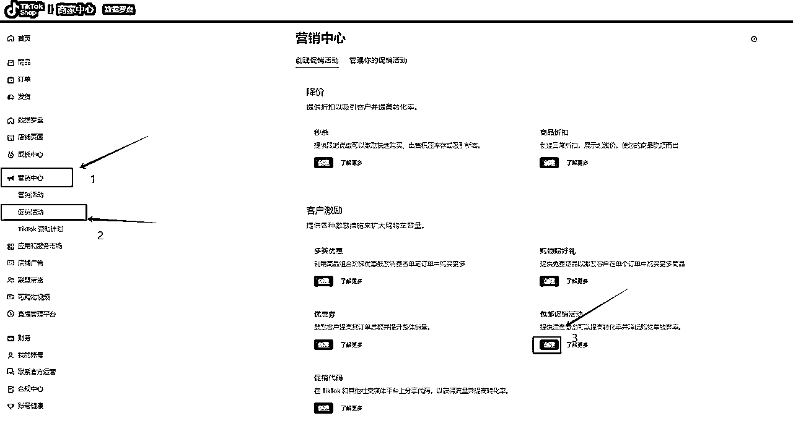

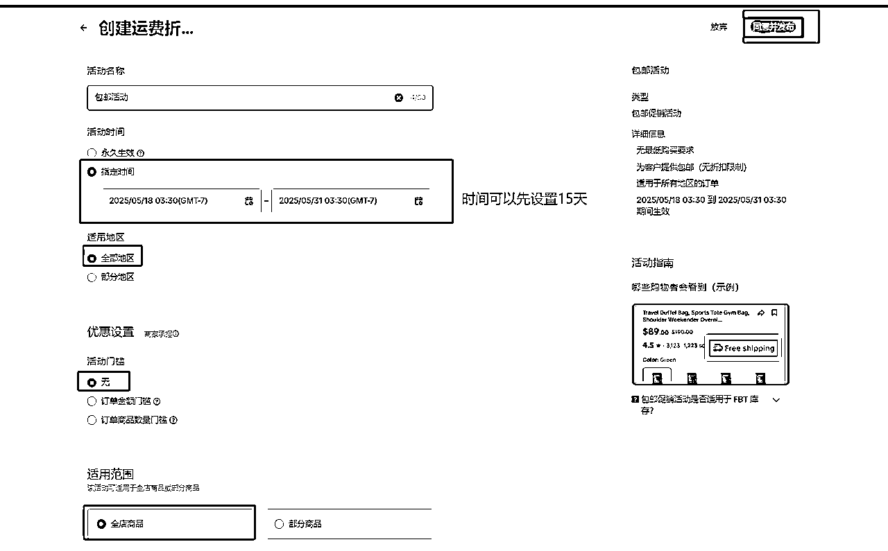

## ③优化商品标题

优化商品标题可以提高曝光和搜索排名。

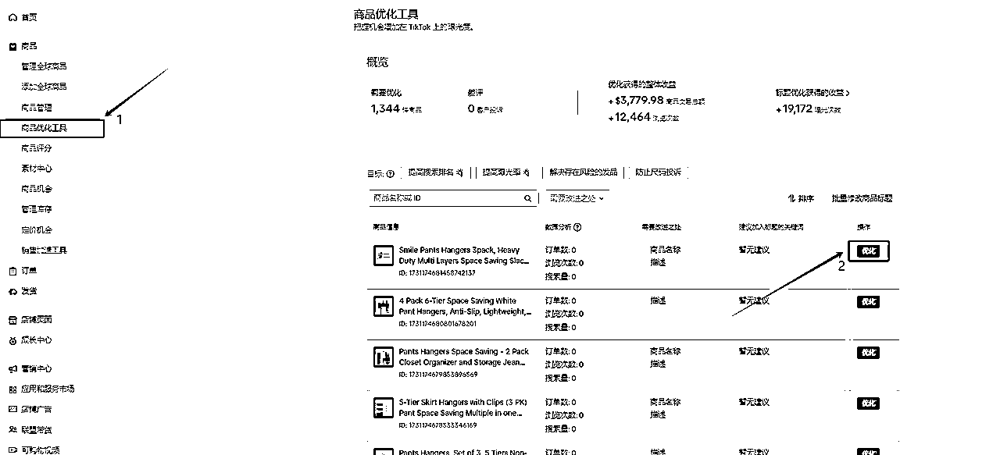

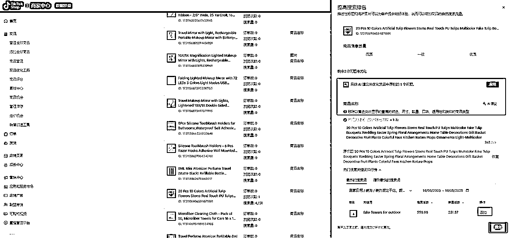

## ④删除曝光以及点击率差的产品

TikTok目前的算法是，​新上架商品前72小时会获得测试流量​，若点击率（CTR）＜1%或转化率（CVR）＜0.5%，后续自然流量将大幅减少。TikTok的流量分配基于单品权重​（点击率/转化率），而非店铺总商品数，所以平台不会因我们上架的商品数量多直接限流。但需注意：

*   滞销商品拉低店铺动销率​：若90天内无销量商品占比＞30%，可能影响店铺整体权重。

*   重复铺货风险​：同款商品多次上架（仅改标题/主图）会被判定重复铺货，导致流量倾斜减少。

具体如何看产品曝光和点击数据，并下架删除产品？

我一般会选择最近七天，然后按照排序找到曝光率和点击率为0的产品，复制商品ID，到左侧的全球商品管理栏删除下架，单天删除下架20个产品，建议不要一次性删除下架太多商品，会影响店铺流量，保证当日上架数大于下架产品即可。（实操看下图）

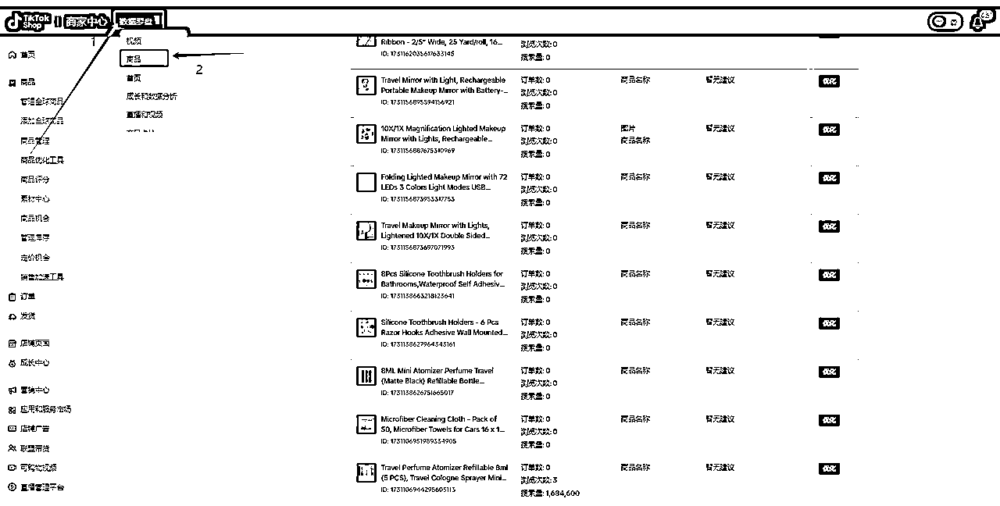

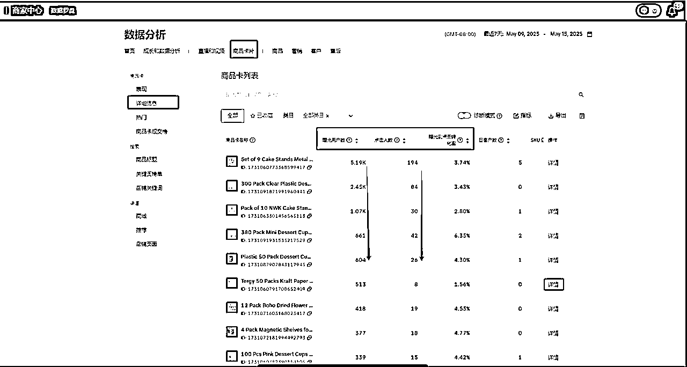

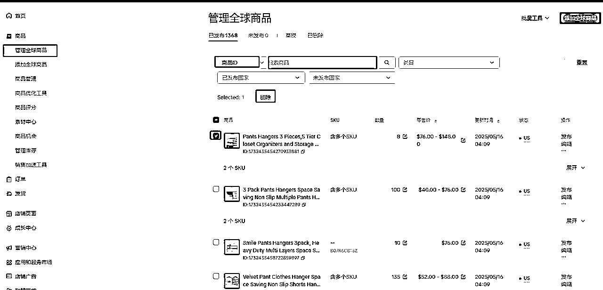

# 亚马逊采购

关于亚马逊采购，我目前使用的是他人的代采服务，这里不做推荐。网上也有专门做这个服务的团队，小红书一搜就挺多的，但是要慎重！！谨防被骗。

我有了解亚马逊采购，不过还没有具体实操，可以讲讲我了解的情况。采购会出现2个问题。①在亚马逊上代采如何确保不会被砍单（无法正常购买）。②客户收到货发现是亚马逊的快递面单，那怎么办？

首先，我们的购买行为如果异常会触发亚马逊风控被砍单，无法正常购买，比如高频下单​，短时间内用同一账号大量采购，会被亚马逊判定为商业采购或刷单；或者直接下单无浏览​，跳过搜索、比价等正常用户行为，直接批量下单，系统会标记为异常。

砍单解决方案，不一定正确，可以参考：

1.  分账号操作​：拆分为多个账号（如50个账号，每账号40单/天），每个账号使用独立IP、设备和支付方式。

1.  模拟真实用户行为​：下单前模拟浏览、加购，间隔时间随机化，避免直接批量购买。

1.  支付隔离​：使用多张虚拟卡，每张卡绑定独立账单地址，避免集中支付。

其次，如果客户收到货看到是亚马逊面单以及面单上面的价格，你猜是什么表情？？（小朋友，你是否有很多个问号）

面单解决方案，不一定正确，可以参考：

1.  使用亚马逊官方提供的「礼品包装」（Gift Wrap）服务：这个礼品包装服务提供专属礼品盒/袋，且默认不显示商品价格；如果是FBA卖家，我们选择礼品包装服务不需要我们支付这个费用，如果是自发货卖家则需要买家支付费用（3−5刀不等），费用因商品尺寸和包装复杂度而异。

# 单号填写

我们去亚马逊采购，等到亚马逊发货出物流单号之后，我们还不能直接把快递单号填写到我们的Tik Tok小店。

因为这个时候的快递单号多是以TBA开头的，这种单号就是亚马逊物流的快递单号。不能直接填。需要我们根据客户的收货信息和亚马逊预计的收货时间，找一个新的单号，俗称B单，填写到我们的店铺。购买B单可通过这个跨境电商物流单号网:https://www.dhldanhao.com/。

这个单号网有两种方式购买，第一种，输入客户收货地址，找到单号，一个单号0.3人民币。（这里的上网时间我理解的是：这个快递出单号的时间。）

第二种直接通过邮编就可以快速找到单号，一个单号0.6人民币。

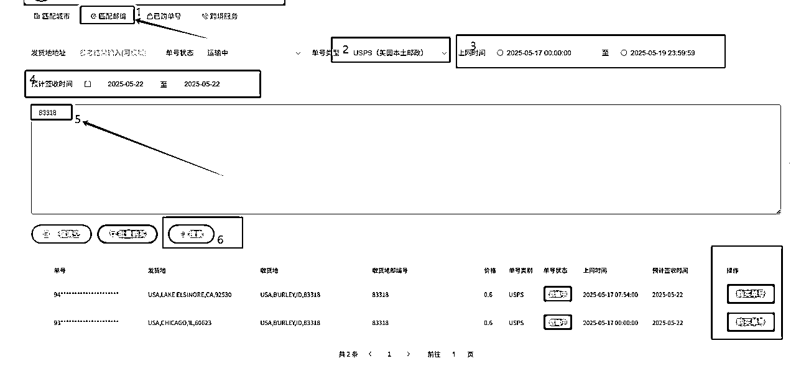

# 售后处理

目前运营一个月，售后率5%，100个人有5个人售后，售后率不高。遇到的售后一般是以下几种情况。

1.未采购未发货，申请仅退款的。

不用理会。

2.已采购未发货，申请仅退款。

我目前还没有遇到过，如果出现这种情况，①自己采购的看是否能取消采购。②找代采的一般代采采购了都无法取消了。③联系客户，给一定的优惠看是否能挽回。

3.已发货，未收到货申请仅退款的。

这种情况比较少见，客户售后理由一般都是不需要了。同样的，只能联系客户，给一定的优惠看是否能挽回。

4.收到货申请仅退款。

有2种情况会出现这种售后。

①B单显示已经送达，实际物流还在配送中，客户反馈未收到货申请仅退款。

处理：①查询快递目前情况；②和客户反馈说，快递单号填错了，给客户发送实际物流截图，告诉客户快递目前在哪里，什么时候送达；③等客户回复了消息，告知他，先拒绝她的售后申请，并且让他耐心等待。

②B单显示已经送达，实际物流也已经送达，客户反馈未收到货申请仅退款。（可能是包裹客户没有找到，可能是包裹被偷等等。）

处理：①查询这个快递在哪里，②给客户发送实际物流截图，和快递投递时的截图证明，告诉客户快递什么时间送到了哪里，让客户找找（我之前就遇到过客户反馈说没有收到货，但实际上包裹已经送到他家附近的邮局了，我在usps网站查快递信息：https://tools.usps.com/go/TrackConfirmAction?qtc_tLabels1=9361289727247902898285给他发投递截图，让他自己去找，就处理好了。）③如果是快递被偷了，就当货损吧。我也遇到过一单反馈是被偷了的。

5.收到货申请退货退款。

这种情况就是客户不满意，不满意我们就给他优惠，让他不要退货退款。

回复：

您好，亲爱的

我们高度重视您的体验，看到您反馈不想要/申请退货退款，为了让您对此次购物满意，我们特赠30%优惠券用于本次购物，希望您能保留此订单。

如果您愿意接受此优惠，可以回复“接受优惠”​​并取消售后申请，我们将立即为您赠送大额优惠券一张。

# 其他

做了一个月，也算跑通闭环了。最后分享一下我对这个项目的感受。总体感受是不太适合零基础小白，也不适合资金不充足的圈友。

1.这个项目开一家店需要大概7000的费用，店铺押金一家店3700（不做可退），然后还有办理企业的营业执照的费用也需要个三千多，软件费用一家店一个月50元左右。货款流动资金需要3-5万（单店），回款要31天左右，如果资金紧张就不适合。

2.虽然售后低，但要承担货损的风险。

3.不考虑精细运营，就佛系运营，一家店一天出个3—5单很简单。

4.如果想长期做Tik Tok跨境的，可以试着短视频和建联达人等方式增加销量。

好啦，这个项目分享就到这里，有疑问的圈友欢迎在评论区留言，能回答的都会回答，记得点赞再走哇！！

我是北苑，第一次分享，圈友们如果觉得哪里写得不好，阅读时候不得劲的，也欢迎提建议，最后感谢你能阅读到这里，下次见！！