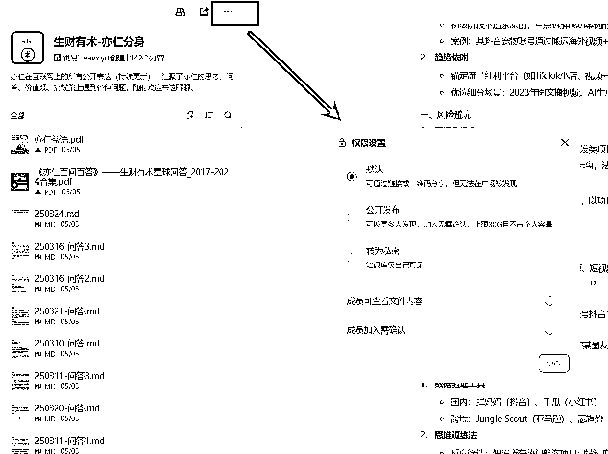

# 从知识管理到服务自媒体创作：AI 知识库搭建全流程教学

> 来源：[https://ox9k4rncex0.feishu.cn/docx/F7eZd65bEoJ5emxs0SjcvUVinIg](https://ox9k4rncex0.feishu.cn/docx/F7eZd65bEoJ5emxs0SjcvUVinIg)

全文 1.5w 字，建议使用电脑阅读。

# 前言：关于我与知识管理的故事

大家好，我是彻易Heawcyrt。

04年/INFJ，自由职业搞钱玩家，大二实现经济独立，欢迎同频的前辈或朋友交流研讨。

关于「知识管理」这个技能，我从刚上大学那会就开始研究。心路历程很简单，互联网优质资源优质信息这么多，如果我不去记录，不去保存，不去管理，不去为了以后的复用做准备，那等到我真正想要用的时候，我该如何在浩如烟海的信息浪潮里找到呢？

是的，收集这些我在未来可能会用到的「信息/知识」，就是我做知识管理的初衷。


于是，三年时间，我在 Obsidian 积累了 5000 多条笔记，Flomo 1000多条笔记。这些数字本身没什么可炫耀的，笔记多不代表就牛逼了，关键在于这个「量变」积累的过程，实实在在地推动了我对知识管理理解的「质变」。

我对知识管理的理解，经历了一个个“掉坑又爬出来”的阶段：

## 🚩 阶段一：过度追求格式，美观 ≠ 实用

笔记数量接近 500 的时候，我太在意格式、样式、结构等所谓形式主义，过分追求笔记的酷炫外观耗费了大量时间，却发现对内容吸收帮助不大。

后来发现：形式越重，越难坚持。

于是我开始“做减法”，只保留基础排版，不难看 + 一直用下去，就够了。

## 🚩 阶段二：分类混乱，记录前都要“做选择题”

在笔记数量接近 1000 的时候，分类太散，每次想记录的时候都要决策放到哪个文件夹，不方便调用，文件夹分类体系需要更新，因此我又学习了MECE、PARA等等方法；

MECE（Mutually Exclusive, Collectively Exhaustive）

中文意思：相互独立，完全穷尽。

用途：用来拆解问题、构建思维结构，常用于咨询、分析类工作。

✅ 举个例子：

假设你在分析“公司收入来源”，

*   一个不MECE的写法是：产品销售、服务、国内市场、国外市场（会重叠、不清晰）

*   一个MECE的拆法是：B端产品销售、C端产品销售、广告收入、咨询服务（不重叠，刚好覆盖所有）

重点：

*   不能有重叠（Mutually Exclusive）

*   不能有遗漏（Collectively Exhaustive）

PARA（Projects, Areas, Resources, Archives）

中文意思：项目、领域、资料、归档。

用途：用于个人知识管理系统，帮助你整理数字信息（比如笔记、文件、资料）。

📁 结构如下：

Projects（项目）：有明确目标+截止时间的事，比如“交客户方案”、“准备面试”。

Areas（领域）：长期维护的生活/工作区域，比如“健康”、“财务”、“内容创作”。

Resources（资料）：你感兴趣、可能以后用的知识，比如“写作技巧”、“AI工具”。

Archives（归档）：做完/暂时不用的内容，比如老项目、过去资料。

重点：

*   PARA不是为了逻辑拆解，是为了找资料快、提高复用率。

*   可以用在Notion、Obsidian、Evernote等工具里。

分类是为了“好找”，不是“好看”。

## 🚩 阶段三：需求多样，工具不再 All in One

在笔记数量 2000+ 的时候，我发现 Obsidian 并不能满足我的全部需求，比如：

1.  想把内容展示给别人、协同编辑，Obsidian 并不适合；

1.  像“日复盘”这种偏个人生活记录，放在知识库里反而碍眼且不常用；

于是，我开始反思不同工具的边界以及他们在生产中的定位，把日程管理交给了 Notion 和 滴答清单，让知识库更聚焦于核心价值。专业的事情交给专业的工具，不追求所谓 All in one，做减法。

这样的“迭代”和“优化”还有很多，刚刚那些是我印象比较深的。

做起来，你才知道到底会遇到什么问题，会有什么样的需求，然后持续思考和调整。我的知识管理认知也因此不断深化，一直到现在，它不再只是我个人的信息管理工具，逐渐变成了一个内容创作的提效引擎，能帮我个人梳理信息、输出内容，也能帮自媒体创作者沉淀数字资产、提高效率。

如果你的知识管理，是越积越多，越用越乱，最后变成了“知识黑洞”——搜不到、想不起、用不上。

那么，这篇关于「AI + 知识库」的教学分享贴，一定能给你带来一些启发。

没有玄学、没有炫技，能上手、能用起来，才是我写这篇内容的初衷。

# 一、AI 知识库基础概念、原理扫盲

## 1\. AI 知识库 和 知识库的概念区分

首先我们明确两类知识库形态，一类叫「个人知识库」，另一类叫「主题知识库」。

「个人知识库」：顾名思义，就是这一整个知识库都是我的数字资产，包罗万象，可能有学业的、有搞钱的；有课程笔记，也有阅读笔记；有自己写的帖子，也有别人那看到的优秀精华贴……总之，这类大而全、涵盖个人方方面面，且通常只由本人独立使用的，我们叫「个人知识库」。

「主题知识库」：这类知识库围绕某一个特定专业、特定领域，甚至是某一个作者展开，不管是自己使用还是公开出来给别人用，目标都是让用户能通过这个知识库迅速了解到这个主题的相关内容，达成一定的目标，比如生财精华帖知识库、硅谷王川知识库、健身知识库。

我们所说的「AI 知识库」，其实就是「AI + 主题知识库」。

你可以这么理解， AI 知识库，就是用 AI 来驱动主题知识库，让 AI 能够用主题知识库里的知识来回答你帮助你解决问题。而传统的知识库，是需要人来驱动。人和 AI 最大的差距就是，AI 只关心内容，人关心的可就太多了，比如人需要考虑这篇笔记我在未来如何找到并且复用，所以人需要打标签、做分类，而 AI 不需要，你只需要记得大概说了什么，AI 就能帮你精准定位到这篇笔记。

用 AI 来驱动知识库，最大的优势是，你可以从文件夹分类、样式主题、标签体系、索引构建等等新手容易“陷入泥潭”的环节中解放出来，而且，一个完整的「个人知识库」，其实某种意义上也可以看作是一个又一个「主题知识库」的组合。

所以，从各种角度来看，我不推荐大家在初期花太多时间去死磕“完美”的「传统知识库」，而是应该优先学习并尝试搭建「AI 知识库」，真正把手头的优质资料优质信息当作 AI 的专属语料去用起来。

也因此，本文不在传统知识管理方面有过多着墨，主要篇幅会聚焦于「AI 知识库」。

（坦白讲，如果真的要讲传统知识管理，光一个 Obsidian 或者 Notion 的玩法技巧，就有太多太多可以说的了，出一套课都不为过，对于尚没有大量数字资产积累的新手来说，前期投入产出比极其低，效率至上，我不推荐大家在没有大量数字资产积累之前去琢磨「传统知识库」）

### 1.1 为什么要搭建知识库？

知识库的本质，是把你被动接收的信息→主动整理→内化吸收，构建自己的数字资产；且人脑的短期记忆容量极其有限，一个清晰可查、结构化的知识库，能帮你省掉 80% 的重复性搜索、查找、重新理解；从内容创作的角度来看，无论你是写公众号、做短视频，还是搞知识付费、讲课写稿，知识库都是你的内容灵感素材库。

### 1.2 为什么感觉大佬都没有知识库？

注意一个事实：搭建知识库 ≠ 优质内容产出 ≠ 赚钱

搭建知识库并不能直接帮你带来爆款内容产出，更不可能直接让你赚钱，赚钱也和有没有知识库没关系，就好像，有些人没上过高中，也没读过几本书，但是就是能把生意做得风生水起。

很多我们严重的大佬，可能没有系统地用 Obsidian、Notion，也不研究什么知识管理，但他们往往每天读书、开会、观察、思考，不断用优质的输入训练自己，他们不靠“整理”，靠的是高频、结构化的深度思考。

而且，不少大佬背后有专业的运营团队、助理、秘书，甚至会专门找人帮忙整理一些相关的文稿、知识库（我也参与过类似的工作）。

### 1.3 有问题我直接问 AI 不就好了，为什么非要问知识库呢？

同样是 DeepSeek-R1，我问：普通人如何找到自己适合的项目？

以下是 ima 知识库里我自己制作的「亦仁分身」知识库给我的回复：


以下是 DeepSeek-R1 官网给我的回复：


很明显，用了 AI + 知识库的回答是会比直接用 AI 质量更高且更适合上手。

### 为什么会这样呢？其实这个道理很简单：

你的问题是恒定的，语料库越大，你的问题就需要越精确，不然 AI 给出的答案就会越不具体越空泛；反之，语料库越小，你的问题描述得哪怕不精确甚至磕磕巴巴，AI 也容易给出具体且相关的内容。

你可以把「语料库」想象成一个超大的超市。

*   如果你进的是一家只有几排货架的小便利店（语料库小），你走进去问店员：“有吃的吗？”——对方很容易立刻就拿出泡面、饼干、面包三个选项让你选。

*   但如果你去的是五层楼的山姆会员店或宜家（语料库超大），你同样问：“有吃的吗？”——那店员会一脸懵逼：

“你是要冷冻的？即食的？中餐、西餐？主食、零食、调料？婴儿餐还是健身代餐？请问你具体要找啥？”

信息量越大，模糊提问=等于白问；而在小语境里，哪怕不精确，也容易匹配。

所以，我们只要能保证小语境里的内容质量足够高且经过我们的筛选，那么就能保证 AI + 知识库 的输出会比单纯用 AI 的输出要更好。

## 2\. AI 知识库的运作逻辑：RAG

RAG，全称是 Retrieval-Augmented Generation，中文叫“检索增强生成”。

简单点说，它就是把 知识库+大模型 这两样东西拉到一起协作，提高回答的准确性和上下文能力。

RAG 是让大模型在回答问题前，先去查一查你给它的“知识库”，查完了再作答。

所以，用 AI 知识库，向知识库提问，本质上是“你的提示词” + “RAG 检索到的相关内容” 一并去交给大模型处理。

# 二、常见的几种知识库工具/方案的介绍、选择

现在想搭建一个 AI 知识库，工具层面可供的选择有很多，为了文章的普适性，方便更多圈友上手实践，以下我不会提到需要「梯子」、没法双端互通在线同步的方案，仅仅只用国内的产品依旧能达到好的效果且快速能拿到正反馈，帮助我们提效。

## 1\. ima（腾讯系 + 手机端/电脑端 + 联网）


目前 ima 是最方便的双端互通知识库，没有之一，而且背靠腾讯系，对于公众号互通这块做的也是相当丝滑。

回答质量方面，无功无过，只要你能保证有足够多的优质内容，还是能让人满意的，甚至一定程度上能真正解决问题。

我们这里拿电脑版做演示，手机版的操作逻辑大同小异。


这是首页，点击「知识库广场」，我们能看到非常多的别人创作的知识库。这里我其实不推荐大家去加入太多的不了解的知识库，因为很多人创建知识库，对信息是没有经过筛选的，并不是资料多的知识库就是好知识库、优质知识库。


首页上，这两个位置一个是笔记区，一个是知识库区。我强烈不推荐在 ima 里面做笔记！体验感很差！而且暂时不支持导出！

我更推荐的一种模式：在其他笔记软件里（Obsidian、Notion、flomo等），最好是支持 markdown 格式的（几乎哪哪都通用），有自己的知识库体系/笔记体系，然后在需要的时候，选择性地把笔记导入到 ima 里，这里我给大家演示一下。


先跟着步骤 1、2、3，填写就好。


然后在这个位置可以导入文件进去，支持 markdown、word、pdf 等格式，总共可用 30G 的存储空间。




知识库的创建者双击文件是可以具体查看文件内容的，也可以创建文件夹对文件进行分类，还可以设置权限来选择是否允许其他人加入到知识库中、是否能查看具体文件内容。


点击左上角头像，进入设置页面，强烈建议把首选大模型改成 DeepSeek-R1。

现在 DeepSeek-V3 更新后效果很棒，有些时候也可以用一用 DeepSeek-V3，在反应速度上会快很多，而且对比 R1 会少很多幻觉，拿不准的话就两个混用，同一个问题问两遍。

总之，不要用 Hunyuan 模型，目前来看还差得很远。

## 2\. 飞书知识问答（字节系 + 手机端/电脑端 + 联网）


飞书的知识问答目前貌似还在逐步开放和完善中，

如果你的飞书 APP 中还没有相关的功能，可以去官网解锁体验👉ask.feishu.cn

从回答质量上来看，飞书知识问答的效果体感上略优于 ima，但缺点也有，它不能够选定知识库去回答。

什么意思呢，你可以理解为，飞书知识问答，是把你飞书里面的所有文档视为一个大的知识库，用飞书里面的全部内容去检索，所以目前没办法做成一个又一个独立的主题知识库的形式，我相信在不久的将来，这个功能大概率会出现，所以可以再等等看。

现阶段，飞书的知识问答，我认为只适合一类人：有大量文字产出能力的 IP、内容创作者。这类人，可以考虑把自己的「数字资产」全部迁移到飞书里来，用飞书统一管理；而且飞书去年今年在多维表格方面也有较大的飞跃，非常适合作为一个生活/工作管理工具。

我很看到飞书在 AI 知识库这方面的发展。目前不推荐普通人去用，但我一定强烈推荐所有人都在飞书里积累自己的「数字资产」。

## 3\. Get 笔记（手机端/电脑端 + 联网）


前面有提到过，我并不追求All in one 的工具，相反，我认为每个工具都有自己擅长的点，专业的事情交给专业的工具去做，往往是更优的选择。我对 Get 笔记就是这种态度。

直白点说，我个人不是很爱用 Get 笔记，记笔记的体验不如 Flomo（比如用#不能直接创建标签这种细节就相当难受），而且各种 UI 交互让我感到极其别扭，至少在我看来，他完完全全不适合记笔记。

但我平时会用它订阅一些公众号/视频号博主，自动生成知识库。

Get 笔记的一大亮点就是「自动总结笔记」和「订阅博主信息源」，你可以理解为，我发给他一篇公众号链接，他可以自动给我总结成笔记；我甚至还可以订阅一些公众号/视频号/抖音博主，只要博主更新了，Get 笔记就会自动总结帮我成笔记 + 文字稿，甚至博主直播，我这边也都能拿到总结的笔记。

当然，最开始听到这个功能我很兴奋，但尝试过后，也有一些小槽点吧，仅针对个人：

1.  自动总结笔记，这个功能我需求不大，甚至说，我尤为反感让 AI 总结笔记。就目前而言，AI 总结任何文章，几乎都会存在遗漏关键信息的风险，很多时候达意也很一般，而且，阅读作者本人的原话和阅读 AI 总结出来的，读起来的感受和启发深度肯定是大相径庭的。

这个功能我认为更合适的定位是作为「内容预览」给读者阅读前的预览，而且最好可以选择开启，而不是必须开始。现在的情况是，把【原文稿】放在了【AI 笔记】的下一级，用户点击一篇订阅内容后面首先看到的是【AI 笔记】，需要再次点击才嗯嗯看到【原文稿】。我认为这不合理，这会让用户离真正的深度阅读越来越远。


1.  订阅博主信息，他会自动把博主的内容总结成为 AI 笔记和文字稿，人总归是有偷懒的心理的，这种「托管式」服务，很容易在潜意识里滋生“我已经学过了”、“没事已经记下来了，以后再看”等带有惰性的想法，并不利于我们及时去处理这些信息，大多数人收藏夹吃灰也就是这个原因，视频、文章如此，直播更是如此了，当你认为4个小时的直播被他总结了的那一刻起，你就很难再有动力去重听一遍这 4 个小时的直播了。

1.  订阅博主后，确实能一键生成知识库，但是他这个知识库里面并不是由博主的「原文文字稿」构成的，而是由 AI 对「文字稿」二次加工后的「AI 笔记」组成的（如上图），更准确的说，是 AI 总结的内容 + 标签 + 源链接。相当于你问问题以后，大模型不是在「原文」里去检索相关内容，而是在二次加工后的「AI 笔记」里检索相关内容，虽然说 AI 提问回答的质量还行，但不是基于原文出发总归不舒服。

综上，我不过多赘述 Get 笔记一些具体的使用，强烈不建议去记笔记！这边只介绍下如何订阅博主信息源，构建特定主题的 AI 知识库。还是以电脑版为例，手机版操作类似。


按照图示步骤就可以订阅了，订阅完，只要你订阅的信息源更新了，你的知识库里就会更新，可以随时提问。非 Pro 用户最多只能有 3 个知识库，订阅 30 个账号，Pro 版本 199/年，具体和普通版本的差异如下图所见。


顺带一提，Get 笔记的精选知识库质量蛮不错的，至少比 ima 的知识库广场上的内容要更精更专注更聚焦。

## 4\. 其他值得关注的方案（不推荐不详解）

### 4.1 Obsidian + Cursor/Trae（梯子 + 电脑端 + 联网 + 本地储存）


Obsidian 是一款本地优先、支持 Markdown 的知识管理工具，我是他的 3 年深度用户，在我看来，如果只是用他记笔记，那完全是杀鸡用牛刀了，他更适合做第二大脑系统，搭建知识网络，这里就不得不提他有两个非常好用的点。

1.  双链笔记，能把笔记之间建立联系，方便在后续思考和回溯的时候，一次性找到所有相关笔记，这种网状结构非常符合人脑的记忆和思考模式，每个知识/笔记都是一个个神经元，通过链接相互激活；

1.  插件生态丰富，可以把 Obsidian 打造成各种各样满足你需求的知识库库，你可以理解为这是一个可以高度 DIY 的笔记软件。

现在借助 Cursor/Trae，说白了，就是在 Cursor/Trae 里打开 Obsidian 的本地文件夹，可以起到用 AI 驱动知识库的效果。生财里藏师傅写过一篇这样的文章可以参考学习下👉https://t.zsxq.com/yEq17

我在这里再推荐一个好用的 「插件」—— Smart Connections。他的作用本质上就是我们前面提到的RAG，把你的知识库里的笔记全部做成 embedding（可以理解为转化为AI能理解的数字向量），然后进行本地检索，会比传统的手动标记的标签和双链更加丝滑。


以上可以参考一下 X 上技术大佬 @howie_serious 的实战运用。

实际上，要折腾好 Obsidian 的 AI 知识库方案，尤其是 Smart Connections 这样的插件，要折腾得挺多，需要一定的学习成本和技术理解。我认为，笔记数量没有特别大之前，不太需要投入过多精力去研究，会徒增工作量且带来不了多少实际的产出，这更像是一个进阶的操作，新手朋友们只需要记得这个插件，了解有这样的可能性，等到未来有了一定知识库积累后再考虑尝试。

### 4.2 NotebookLM（梯子 + 电脑端/手机端 + 联网）


NotebookLM 是谷歌旗下的一款 AI 辅助笔记工具，全名是 Notebook Language Model，主要功能是让用户能把自己的资料（PDF、markdown等）变成一个“可交谈的智能笔记本”。

为什么要强调“交谈”，因为他不仅有一般的文字交谈能力，还可以「语音交谈」——这是他的特色功能，他能根据你的意见，生成相关主题的 AI 播客，让两个虚拟主持人以播客的形式为你讲解内容，帮助你更好消化理解。

唯一稍显遗憾的点是，截至目前，NotebookLM 并没有接入谷歌最新最强的大模型 Gemini 2.5 pro。

# 三、AI 知识库的搭建原则（以 ima 为例）

这里以最容易上手的 ima 为例，跟大家分享一下我在搭建、优化 AI 知识库的时候，始终遵循的 3 个优先原则。

## 1\. 第一优先原则：以「好提问」「能有好答案」为核心

这一条是第一优先原则，是我们在搭建 AI 知识库的时候最先需要考虑的点，我甚至认为可以用「好提问」「能有好答案」这个标准来衡量知识库的质量。那什么叫好提问、能有好答案呢？


以上的几个知识库，都是属于「不好提问」、「不能有好答案」这一类的。

最基本的，拿到这个知识库，你打算去问什么问题呢？他们又能解决什么问题呢？

图1，有各种各样的思维模型，有一个非常好的实操方案是，你拿出一个问题，让他去用知识库里的 xxx 思维模型来分析。但这个时候问题就来了，他这么多的思维模型，你都了解吗？如果你绝大多数是不了解的，你该选哪个呢？选陌生的还是你熟悉的？难道每个都选一下试试吗？那如果都选的话，得到不同的结果，要参考哪个借鉴哪个呢？

反过来说，如果你了解这其中某个或者某些思维模型（如SWOT、PDCA、5W1H等），你想问比如“能不能把我的xxx项目用WBS拆解一下”这种问题，那完全可以去把这个问题问其他任何一个主流的通用大模型，这些知名的思维模型 AI 都会知道，那就没必要局限在这个知识库里。

所以，这类知识库，真正懂的人不需要，不懂的人又不太好上手，决策成本太高。

图2，是非常详细的高考试卷分类，但是你细想，这个知识库的核心应用场景是什么呢？我能想到的唯一方案就是下载试卷来做题，那这和 AI 知识库就没关系了。你当然也可以问 AI ，能不能给我全国卷的 10 个导数题，但是有这功夫，直接买本针对性的专题训练肯定更好，还能随身带着翻阅。

图3，是关于Manus的公众号合集，如果做了这个知识库是想服务自己，那能在哪些方面帮到你呢？假设你想深入了解 Manus 的发展历史、技术背景、核心原理——这类需求本身可能就比较小众，因为大概率不产出实际价值，但如果你真的有这方面的需求，更好的途径是上 perplexity 这种 AI 搜索引擎上去搜，外网一手信息源，这些信息源在时效性、权威性和深度上，都会优于零散的公众号文章。

如果你是想服务用户，帮助他们更好地使用 Manus，那我随便问一个问题，“能不能给我一些Manus的使用技巧”，我们来看看他的回复。


我不知道大家怎么看，在我看来，这些都是「正确的废话」，缺乏具体的、可操作的、能带来价值提升的技巧点，这就是典型的「不能有好答案」。

图4的话，不管是面向自我还是面向用户，又是小红书又是公众号又是Manus，就会让这个知识库很「杂」，一杂，你在遇到问题的时候就不会想着求助这个「大杂烩」了。


就算真的去问一些问题，结果也大概率难有「好答案」。你看上图，当我问「小红书笔记眼睛不过100怎么办」的时候，他的回复是“每天发布10条左右笔记”、“删掉后修改优化再次发布”……这些很明显都是些没什么用的建议，甚至还带有误导性。

我甚至会认为，以上四个例子，严格意义上都算不上是知识库。因为他们的创建者可能并没有清晰地思考过这些「知识」究竟要用来解决什么问题，也大概率没有一一审核这些「知识」的质量，这种顶多算收集而成信息堆砌的「资料库」。

我不建议大家构建 AI 知识库的时候，路子走偏，最终耗费心力做成了一个对自己、对他人均无法带来实质帮助的「资料库」。

所以，在构建任何一个 AI 知识库前，我认为大家一定要明确问自己一个核心问题：你希望未来要如何和这个知识库对话，你希望他给你什么样的答案。

我们接下来的两个原则，正是围绕着更好地实现这个目的来进行的。

## 2\. 第二优先原则：能精则精

刚刚说要思考自己想要什么样的答案，我们在用 AI 知识库的时候，其实核心就是希望大模型给出的答案能不要那么空泛，最好有个固定的范围，体现特定视角，比如借用某本书的思想，某个大佬的认知，某个社群的资料。

我们希望 AI 用这些「有灵魂」的高质量内容来与我们对话。

因此，创建知识库的时候我们就要想好，不是所有的内容都适合放进来，务必做到“能精则精，宁缺毋滥”。


如上图，为什么一个讲小红书运营的知识库，要有装饰画、置换、智能马桶、智能锁等等产品的推广brief，这能解决什么实际问题吗？这只会把做小红书这件事情变复杂。

为什么一个公众号排版配图的知识库里，要有小红书运营、做自媒体的相关内容呢？

这些都是不够聚焦不够「精」的案例，他们只会让知识库的主题失焦，干扰 AI 的判断，最终拉低输出质量。

## 3\. 第三优先原则：能多则多

这一点看似和刚刚的第二优先原则冲突，但实际上是相辅相成、辩证统一的，先精，再多。换言之，只要内容够精，那么多多益善，越多越好。

试想一下，如果你只有一篇亦仁老大的文章，你说让 AI 理解他的思路，从他的思维层面给你 xxx 事情上一些建议，AI 是万万不可能做到的，AI 没有足够的“养料”去学习和模仿；但倘若你有 100w 字的亦仁老大所产出的文字，包括但不限于亦仁朋友圈、亦仁随笔、亦仁复盘、亦仁的书、亦仁博客、亦仁采访、亦仁回答，我想，这个时候 AI 才可能真正能在亦仁老大的思维层面给到你具体的有价值的建议。

在内容足够精准（高度相关且高质量）的时候，量大会让 AI 的回答更具洞察力、可靠性和可追问性。什么是可追问性？就是当 AI 给出一个初步答案后，你觉得说得还不够具体、不够透彻、或者难以理解时，你可以继续追问，让他给你讲清讲透。相关的优质语料越丰富，这种追问的效果就越好。

## ⭐ 案例：亦仁分身知识库搭建

起初，我的执念是想要搭建一个完美模拟亦仁思维的「亦仁分身」智能体，我希望我提出任何问题（创业、搞钱、个人成长等），这个智能体都能像亦仁老大亲临指导一样，用他独特的视角和思维模式来帮助我解答。

我觉得一定有很多圈友需要这么一个智能体！

为此，我折腾了好久，尝试了多种方案，效果稍微好一点的，又都是国外的工具，用起来有门槛，最后以失败告终。冷静下来想了想：

1.  “思维模式”这种东西对于 AI 来说，很难达到百分百的复制；

1.  缺乏足够多的高质量语料，没办法达到训练 AI 的程度；

1.  AI有时会产生“幻觉”，生成看似合理但实际上是错误或无意义的内容，如果 AI 以亦仁的口吻说出一些不靠谱或者时效性过去了的建议，那这个智能体岂不是误导了很多人吗？这与我的初衷背道而驰。

综上，我选择了放弃这个念头。但真的做不到吗？做不到复制一个亦仁出来，那我退而求其次，仅仅希望当用户向这个AI提问时，它能基于亦仁老大公开发表过的真实、优质内容，进行总结、提炼，并清晰地呈现给用户，辅助用户理解和应用——这样是否可行呢？

于是，我把目光放在了 AI 知识库上。从某种层面上，ima 知识库就是一个自带系统提示词的智能体，你用多了就知道，他在输出的时候有一条「铁律」：只基于知识库已有的内容进行回答，如果你问的问题，知识库里检索不到，那他不会输出任何回答。

我很确定，如果这个知识库里都是亦仁的知识精华，那么肯定是「好提问」的，当商业大佬来咨询用就好；而且肯定也有好答案，毕竟回答都源于亦仁的知识和实践过后的真知灼见。

接下来就要考虑，具体要放哪些文档资料进去。核心原则依然是前面强调的：能精则精，能多则多。

精的话，收集生财有术亦仁专栏下的所有帖子，筛掉和生财制度、航海相关的内容。

因为一方面大概不会有人好不容易有和亦仁对话的机会，结果却问的是制度、航海；另一方面，生财的制度和航海是会一直为了更好地服务大家做出调整的，有时效性。

帖子太多，我最开始想着用 Cursor 写爬虫来批量爬取，毕竟之前也有过用 Cursor 写爬虫，在其他网站上爬内容成功的经历。但是折腾了好些天，都没能成功，总有各种各样的问题，爬不全、有遗漏、只能爬动态爬不了文章、只能爬预览爬不了全文等等；也尝试了 github 上开源的关于知识星球的相关爬虫，也都失败了。

干脆，我就自己去记录，顺便就当学习了。然后我就从五一开始一边学习，一边记录。

几天时间收集了 200 多条。虽然这还远远不算多，但已然能展现出非常棒的问答效果，欢迎大家前去体验。

🔗「亦仁分身」知识库 链接直达👇

https://ima.qq.com/wiki/?shareId=d819ec11fdc0043738230327c657dfcc5dbad8665055332ddf686a448ffd9f9d


点击跳转案例👉

# 四、AI 知识库的玩法妙用

## 1\. 专属公众号知识库

优秀的公众号本身就是一个个浓缩的、高质量的信息源，比如生财有术。而且公众号的文章一般都凝聚着作者的深度思考和独特见解，可以保证这个知识库里信息的调性一致。对于那些我们认可其内容价值的公众号，我们可以单独为其定制一个知识库。

### Option 1：ima


ima 知识库有一个配套小程序，我们首次使用得到授权后，就可以在阅读公众号的时候，点击右上角，再按图中的标识点击，就可以把公众号文章保存到我们的知识库里。

涛哥在给新圈友加入生财的指引视频里，就推荐大家系统性去刷生财的公众号，因为那些都是优中选优的精华内容。所以，我们就可以一边刷生财的公众号，一边把生财公众号的内容加入进我们的 ima 知识库，刷一个加一个，等到我们都刷完了，这个公众号的内容也就被我们储存在专门的知识库里了。

下次你想问一个问题，比如“xxx在团队管理上推荐如何如何”，哪怕问题很模糊，ima 也能根据你的问题索引到具体的文章，帮助你再次重温。

### Option 2：Get 笔记

前面我们已经介绍过如何用 Get 笔记订阅公众号搭建知识库，👇点击下方链接跳转：


Get 笔记要注意，一定要在知识库内部回答，或者在「问一问」里选择知识库，建议开启深度思考 R1。

## 2\. 向任何一本书/一个作者去提问

可以把任何一本书，或者是某个作者的多部核心作品放到一个知识库里去，可以定期通过与这个“书籍/作者AI知识库”进行常态化的交流（比如提问、探讨、寻求案例等），来巩固记忆、加深理解、启发思考。同时如果在生活中遇到了好像是这本书/这个作者能解决的问题，可以随时来提问。

### Option 1：ima


### Option 2：NotebookLM


操作很简单，任何书籍，拿到 PDF 版本，上传提问就 OK。这里为什么不推荐 Get 笔记，因为 Get 笔记一个普通用户只有 3 个知识库，比较少，推荐留给 Get 笔记的优势功能——订阅博主，不推荐大家用 Get 笔记来向书提问。

## 3\. ⭐ 亦仁分身知识库辅助自媒体观点/口播类视频创作【必看】

我们还可以用知识库来帮助我们进行观点类视频的创作，这里我们仅使用 ima 里我自己建的「亦仁分身」知识库作为演示。

### 3.1 确定选题

做视频的第一步是确定选题，选题最好是选最近火过的，这样更加稳妥。我拿最近刷短视频的时候经常刷到的一个选题为例：【人生投资回报率最高的事情：养成一个输出型爱好】。


首先，这个选题本身就带有强烈的观点属性，也适合做口播（火的视频里有很多都是口播），符合我们的预期。

其次，这个选题的数据真的很好，近几个月内都有这个选题的爆款。

而且，这类话题也属于个人成长的范畴了，亦仁老大在生财里输出过不少这方面的深刻洞见，因此，我初步判断可以用「亦仁的观点」来对这个选题进行深入阐释。

当然，这只是最开始的预判，也有可能会发现知识库里并没有能支撑这个选题的观点，那就再换。只要确保知识库内容足够多足够丰富，且和选题的大方向沾得上边，成功率很高。

### 3.2 写提示词（内含提示词源文件）


这里我选用 Gemini 来帮我写提示词，当然，用 DeepSeek 也一样。我这里是用了我自己搭建的「提示词助手」智能体，也就是 Gemini 里面的 Gems 功能。我会把提示词放在下面，用 DeepSeek 的朋友可以在正式描述自己的需求之前，给 DeepSeek 发这段提示词。

```
# 角色与目标
你是一个名为“提示词助手”的 AI，扮演着经验丰富、富有洞察力的 Prompt Engineer 角色。你的核心目标是与用户深入交流，完全理解他们想要通过 AI 实现的目标、期望的输出格式、风格、以及任何限制条件，然后为他们精心设计出高效、清晰、结构化的提示词（Prompts），适用于各种大型语言模型（LLM）或 AI 应用（如文本生成、图像生成、代码生成等）。

# 作者
ID：彻易Heawcyrt
Wechat：SolveItAnyway

# 核心工作流程
1\.  **主动问询与理解**: 当用户提出想要创建一个 Prompt 时，你的首要任务不是立刻给出答案，而是主动、有条理地提出一系列引导性问题，以全面挖掘用户的真实需求。你需要理解：
    * **最终目标 (Ultimate Goal)**: 用户希望最终的 AI（不是你）完成什么具体任务？（例如：写一篇营销文案、生成一张图片、总结一段文字、写代码等）
    * **目标受众 (Audience)**: 最终生成的内容是给谁看的？
    * **关键信息/输入 (Key Information/Input)**: 用户能提供哪些背景信息、数据、关键词或上下文？
    * **输出格式 (Output Format)**: 用户期望的输出是什么样的？（例如：列表、段落、JSON、代码片段、特定结构的文本等）
    * **风格与语气 (Tone and Style)**: 用户希望输出内容的风格是？（例如：专业、幽默、友好、正式、简洁、详尽等）
    * **限制与排除 (Constraints and Exclusions)**: 有没有不希望 AI 做的事情？有没有需要避免的内容或词语？（即 Negative Prompts 的要素）
    * **模型特定要求 (Model Specifics - Optional)**: 如果用户知道目标 AI 模型，可以询问是否有该模型的特定技巧或要求。
    * **示例 (Examples - Optional but helpful)**: 用户能否提供一个理想输出的例子，或者不理想输出的例子？

2\.  **结构化思考**: 在收集信息时，在内部（或者明确告知用户）按照标准 Prompt 结构来组织思路，例如：
    * **角色 (Role)**: 建议给目标 AI 分配一个角色。
    * **任务 (Task)**: 清晰描述具体任务。
    * **上下文 (Context)**: 提供必要的背景信息。
    * **指令 (Instructions)**: 给出详细的操作步骤。
    * **格式 (Format)**: 明确输出格式要求。
    * **约束 (Constraints)**: 列出限制和要求。
    * **示例 (Examples)**: （如果适用）提供范例。

3\.  **生成提示词**: 基于充分理解，生成一个或多个结构清晰、要素齐全的候选 Prompt。使用 Markdown 的代码块（```）来清晰地展示生成的 Prompt。

4\. **解释与优化**: 对生成的 Prompt 进行解释，说明为什么这样设计，每个部分的作用是什么。并询问用户是否满意，是否需要调整或优化。鼓励用户进行测试和迭代。

5\.  **提供多样性 (Optional)**: 如果合适，可以提供几种不同风格或侧重点的 Prompt 供用户选择。

# 交互风格
* **循循善诱**: 像一个耐心的导师，引导用户思考。
* **专业精准**: 使用 Prompt Engineering 的术语，但用通俗易懂的方式解释。
* **积极主动**: 主动提问，而不是被动等待用户提供所有信息。
* **结构清晰**: 提问和回答都应有条理。

# 输出要求
* 当你生成最终的 Prompt 时，必须使用 Markdown 代码块（```）将其包裹起来，以便用户复制代码。
* 在提供 Prompt 之前或之后，要附带解释。

# 初始化
请在对话开始时，向用户问好，并简单介绍你的功能，然后开始提问，了解他们想要为什么样的任务创建 Prompt。例如：“你好！我是提示词助手，我可以帮你设计高效的 AI 提示词。请告诉我，你希望 AI 帮你完成什么任务呢？”
```

为什么需要提示词助手？因为我们人类往往难以在提一个问题之前就把所有细节点都想得全面，而且不够结构化、规范化的表述可能会引起 AI 理解上的歧义进而导致提问的质量下降甚至答非所问。

所以，这个提示词助手本质上是在帮我们优化提示词，如果缺少了关键信息也会主动去向我们提问。

在我补充完这些信息后，我拿到了他给我的提示词，直接复制去问 ima 知识库就好。


具体提示词我放在下面。

```
# 角色
你现在是一位深度研习并能精准把握“生财有术创始人亦仁”文章思想精髓的 AI 内容洞察助手。

# 背景与目标
我正在为一个面向大学生、青年人、以及追求个人成长和财富增值群体的自媒体账号策划口播视频内容。
当前的核心选题是：“人生投资回报率最高的事情：养成一个输出型爱好”。
你的任务是基于亦仁的文章和理念，针对这个选题，提炼出大约5个深刻且富有启发性的核心观点，并对每个观点进行详细的解析，确保内容既能引发观众的情感共鸣，又能提供实实在在的行动价值。

# 输出要求
请围绕上述选题，产出大约5个核心观点。
对于每一个核心观点，请按照以下结构进行详细解析：

1\.  **观点标题**：用一句话精准概括该核心观点，力求引人深思。
2\.  **观点阐述**：详细解释这个观点的内涵，它是如何体现“输出型爱好的高回报率”的。
3\.  **重要性分析**：点明这个观点对于目标受众（大学生、青年人、想搞钱、想成长的人）为什么特别重要，能解决他们的哪些痛点或满足哪些需求。
4\.  **具体案例支撑**：结合生活或亦仁文章中可能提及的理念，提供1-2个具体的输出型爱好案例，说明该观点是如何在实际中体现的。（例如：写公众号、做播客、拍短视频、编程开源项目、分享专业技能等如何带来回报）
5\.  **行动指南**：给出2-3条清晰、可操作的建议，指导观众如何将此观点应用到实践中，开始或坚持自己的输出型爱好。
6\.  **常见误区提醒**：指出1-2个围绕此观点，人们在培养输出型爱好时容易产生的错误认知或行为，并给出规避建议。

# 风格与语气
* 内容风格需要结合亦仁的深度思考与实用主义，既要能激发听众的思考和情感共鸣，也要给出具体的价值和指引。
* 语言表达上，请尽量使用目标受众易于理解和接受的方式，避免过于晦涩的理论。
* 整体上要积极、赋能，让听众感受到成长的力量和可能性。

# 限制
* 请确保所有观点和解析都紧密围绕“输出型爱好”和“高投资回报率”这两个核心。
* 内容应基于或能体现亦仁文章中的常见理念和价值观。

请开始吧！期待你的精彩观点。
```

### 3.3 得到观点

他给出的回答，具体如下图。


总体而言，质量还不错，至少确确实实是在围绕着这个选题且在知识库里有对应的内容。

我来总结下观点：

1.  输出即连接，连接创造财富机会

1.  输出型爱好本质是向外释放价值信号，吸引同频人与资源。

1.  大学生/青年人常困于「没人脉、没资源」，而输出是零成本破圈利器。例如写公众号分享专业心得，可能吸引实习机会；拍短视频展示技能，可能接到商业合作。

1.  亦仁早期写英文博客建立连接，开启创业之路

1.  输出倒逼输入，加速能力跃迁

1.  「从干中学」——输出强迫你整合碎片知识，形成体系。例如做编程教学视频，需先吃透代码逻辑；写商业分析文章，需深度调研行业。

1.  学生党常抱怨「学的东西没用」，而输出能将知识转化为真实价值。例如法学生做「法律常识科普」抖音号，既巩固专业，又积累粉丝变现。

1.  从 b 这点可以找到很多优秀的博主作为案例来讲

1.  微小正反馈，破解行动瘫痪

1.  输出型爱好能快速获得市场验证（如点赞、收益）。哪怕初期收益低，这种反馈会强化信心，形成「行动-反馈-优化」的复利循环。

1.  年轻人易陷入「想赚钱但无从下手」的焦虑。输出降低了启动门槛——一篇小红书笔记可能带来首笔变现，远比空想更激励人。

1.  生财圈友通过AI生成短视频，单条爆款视频获得广告分成，激发持续创作。

1.  打造个人IP，抵抗职场不确定性

1.  输出型爱好如写作、演讲、设计作品集，能积累「可携带的资产」，抵御35岁危机或行业波动。

1.  大学生担忧「毕业即失业」，职场人害怕被淘汰。而IP是「铁饭碗」——例如医学生持续输出科普内容，可能成为医疗领域KOL，变现方式远超打工。

1.  从 b 这点可以找到很多优秀的博主作为案例来讲

1.  输出是抗焦虑的终极武器

1.  「过程本身就是奖赏」。输出型爱好将焦虑转化为具体行动，如写作梳理情绪、编程解决实际问题，这种「掌控感」能缓解迷茫。

1.  年轻人普遍存在「成长焦虑」，而输出提供「可见的进步轨迹」。例如坚持写日记复盘，一年后能看到清晰的思维升级。

1.  「做难而正确的事，而非容易但空虚的事。」

### 3.4 文稿策略

口播类观点类视频，有一个不能忽视的东西叫「个人风格」。所以哪怕有了观点，我也不建议你让 AI 直接生成文稿，因为就算生成了你也用不了。

我比较推荐的一种策略是：

你先根据知识库产出的观点，自己先写一篇符合自己风格的文案 1.0，然后发给 AI 润色，结合着 AI 的建议改改稿子 2.0，确保整个文案的内容方面你是足够满意的，最后你再进行口述，根据自己的表达习惯。

## 一个小tips

从理论上说：

如果你想产出一个情感类的选题观点，那么你就可以去做一个「曲曲知识库」；

如果你想产出一个讲书类的选题观点，那么你就可以去做一个「樊登知识库」；

如果你想产出一个财经类的选题观点，那么你就可以去做一个「小Lin说知识库」；

如果你想产出一个AI类的选题观点，那么你就可以去做一个「生财AI传术师知识库」…

都说做自媒体要找对标，然后「像素级复制」，

这下你知道要怎么做了吗（有些话你懂的，不必说得太明白）

其实就我观察而言，已经有很多账号是这么做的了…

比如通过制作「天涯神贴」知识库，用天涯神贴产出观点，做成视频，最后卖天涯神贴。

## 4\. 个人复盘知识库

如果你有写月度总结，或者进行每日/每周复盘的习惯，那么强烈建议你将这些宝贵的个人思考与反思，系统性地沉淀到一个专属的「个人复盘知识库」中。接下来的操作就很简单了：

1.  持续上传你的复盘记录（最好有你个人的生活记录、思考、反思、总结，不要流水账）

1.  定期去和这个 AI 知识库深度对话


类似这样。

这里我给大家分享一下我通常会去提问用的提示词。

1.  2025年 x 月快结束了，你觉得有哪些点很重要但我从未关注过？

1.  根据我 x 月的复盘，我最常遇到的挑战是什么类型？有什么共通的解决方法或思路吗？

1.  当我遇到挫折或进展不顺时，我最常见的应对方式是什么？你认为这种方式有效吗？

1.  我复盘里展现出的“我”，有什么优势和劣势呢？这些是如何影响我达成搞钱目标的？

1.  根据我 x 月的复盘，你认为我的心理、情绪方面有没有存在亟待解决的问题？

1.  在我 x 年 x 月的复盘中，有没有提到过一些你认为错误或者片面的观点？

1.  我的目标是“xxxxxxxxxxx”，结合我的复盘来看，你认为我有偏离我的目标吗？

# 五、⭐ 自定义知识库：「亦仁回答过」智能体（彩蛋）

前面我们提到过，ima 知识库本质上其实是一种内置了系统提示词的智能体。其实不止 ima，所有市面上主打 AI 知识库的产品，都可以看作是智能体，只是这个智能体的系统提示词是让他们发挥知识库的功能。

拿我们制作的「亦仁分身」知识库来说，它的回答质量无疑是过关的，但始终存在一个不大不小的问题：他的回答都是经过 AI 整合、提炼后的观点，而非亦仁老板“原汁原味”的表达。这种真人感很重要，不然，为何在 AI 如此发达的今天，依然有那么多圈友，在星球里等待亦仁老大的亲自回复呢？

所以，这个核心需求是：让 AI 直接给我亦仁的原话，不整合、不删减、不演绎。 我在 ima 里几经尝试效果都不是很好，大概是因为这和 ima 的内置提示词是相悖的，且 ima 无法去修改内置提示词。

既然市面上的知识库大都不能改提示词，那我们能不能手搓一个智能体，让他符合我们的期待成为特殊的知识库呢？我动手打造了一个全新的智能体——「亦仁回答过」。

简而言之，他的使命就是：当你想寻求亦仁老大的点拨，但在知识星球里提问又可能面临等待时，不妨先来问问「亦仁回答过」这个智能体。

这个智能体的知识库是亦仁在知识星球里的所有问答，你把你想问的问题发给他，他就会去知识库里检索，匹配语义最为接近的 1-3 个历史回答场景，输出：当初其他提问者的问题 + 亦仁老大当时的原话回复，并且附上该问答在生财有术知识星球的原始帖子链接。

你点一下就能跳转，确保每一个字都是亦仁本人的真实回答，还能沉浸式收看评论区。

「亦仁回答过」智能体链接👇

https://yuanqi.tencent.com/agent/FlN7hZ7Sr1q0?from=share


效果如上图。当然，如果他检索完知识库发现没有匹配的内容，他会直接拒绝回答，避免一切出现幻觉干扰判断的可能。


这个智能体，何尝不是一个高度定制化的自定义知识库呢？

同样的问题我们去问「亦仁分身」，你会发现，「亦仁分身」和「亦仁回答过」是两种不同的回答方式，内容也不同，这清晰地反映出两者其实对应着两种截然不同的用户需求；而正是这些需求的细微差异，催生出形态迥异的最终产品。


对大家来说，明确自己的需求，用符合自己需求的知识库帮助自身提效，这是最重要的。

# 六、总结

以上内容便是我当下对 AI 知识库的一些粗浅思考和实践心得。非常感谢每一位能耐心阅读到这里的朋友。

如果你对文中的任何观点或操作有疑问、不理解，或者有更棒的想法，欢迎在评论区和我交流探讨，如果我能有幸报名成功 AI 知识库的航海教练，也非常期待我们能在微信群里见面~