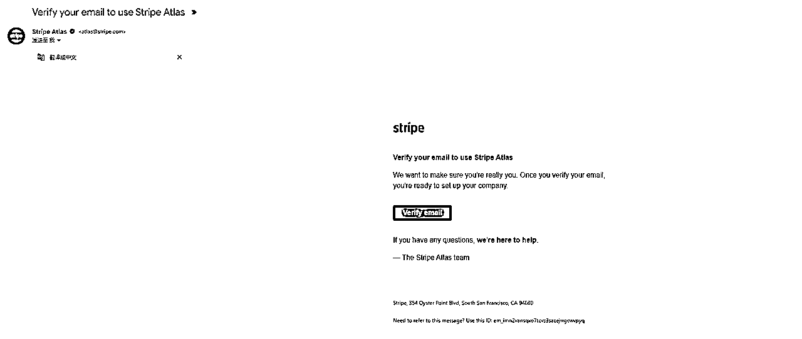
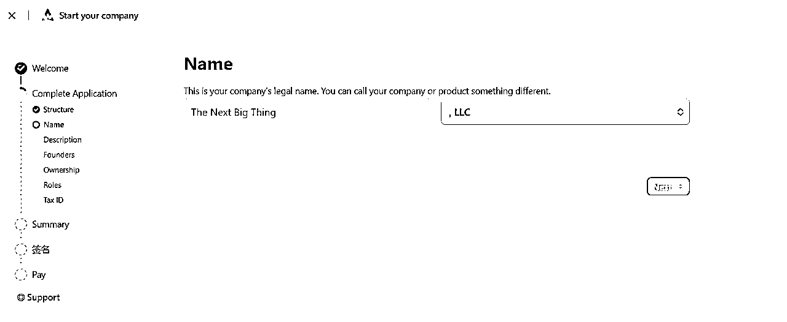
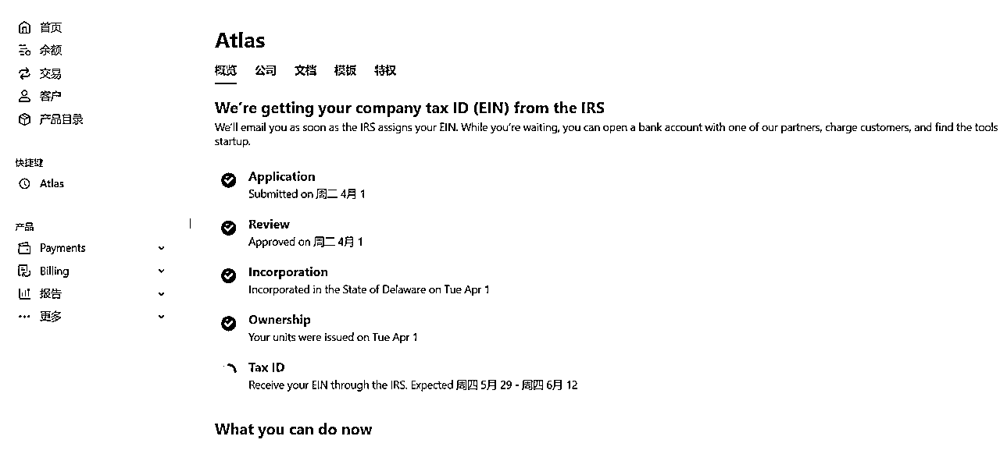
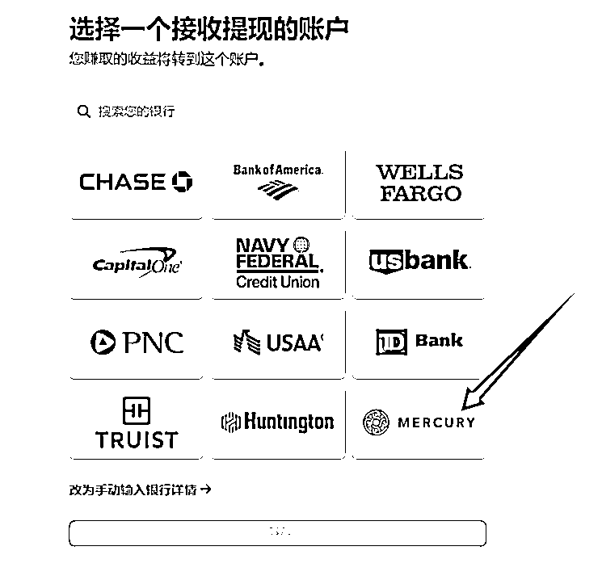
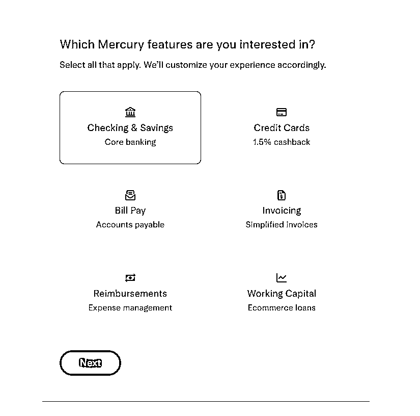
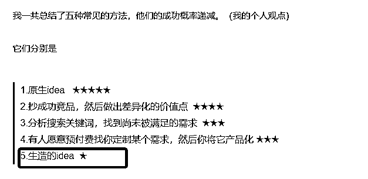

# 通过注册美国公司+水星银行申请Stripe的教程和赚到第一笔Stripe收入的经验分享

> 来源：[https://rk7bq9dqat.feishu.cn/docx/FXLSdCyFPolniAxjBXRcwGO4n1b](https://rk7bq9dqat.feishu.cn/docx/FXLSdCyFPolniAxjBXRcwGO4n1b)

大家好，我是博鱼。

做出海产品一定绕不过去支付这一环，常见的海外支付平台有：

*   Stripe：https://stripe.com/

*   paddle：https://www.paddle.com/

*   PayPal：https://www.paypal.com/

*   Creem：https://www.creem.io/

Stripe是很常用的一个平台，申请Stripe有多种渠道，我跑通的流程是：

1.  注册美国公司

1.  再用公司信息申请美国水星银行

1.  用公司信息和水星银行去申请Stripe

接下来分享整个申请Stripe流程的教程（篇幅70%），和我赚到第一笔Stripe收入的经历经验（篇幅30%）。

# 一、通过Stripe Atlas注册美国公司

有多种方式可以注册美国公司。

*   找万能的淘宝

*   使用firstbase：https://www.firstbase.io/

*   使用Stripe Atlas：https://stripe.com/zh-us/atlas

我是通过Stripe Atlas（以下简称Atlas）注册的，以下是详细教程，每一步都有截图示例。

## 1、费用

如果直接通过Atlas官网注册，费用是500美元https://stripe.com/zh-us/atlas

通过这个链接注册https://stripe.com/zh-sg/atlas/stable，费用是300美元，立省200美元。这是因为Stable和Atlas有合作，它俩在互相给对方导流，这个链接是Stable的专属链接，通过它去购买Atlas的注册公司服务有优惠。

Stable是一家提供美国虚拟商业地址和邮件管理服务的平台，你注册公司的时候是需要提供一个公司地址的，Atlas在页面上会提示你可以用Stable的服务，当然你也可以不用。

其它费用：公司注册成功之后，从第二年起每年都会收100美元的管理费，详见https://support.stripe.com/questions/managing-your-registered-agent-subscription

## 2、开始注册

进入页面https://stripe.com/zh-sg/atlas/stable

点击“立即注册公司”

填写个人信息

验证邮箱

## 3、填写公司信息

接着会进入到填写公司信息的页面，点击“Let's go”按钮继续往下

公司结构：选LLC（有限责任公司）

给公司起个英文名字

填写公司描述和公司网站，网站我填写的是已经上线了的AI图片站

填写真实的个人信息，注意First name和Last name不要写反了

*   First name是名

*   Last name是姓

*   Your home address我填写是现在国内的实际住址

查看所有权信息，点Next

选择谁来管理公司，选自己

公司税号Company Tax

翻译：Atlas 从美国国税局（IRS）获取您的雇主识别号（EIN），您需要用它来报税和雇佣员工。为了更快地获取公司的 EIN，请提供美国公司地址、美国电话号码和美国社会安全号码。

*   填写公司地址

*   方式1：可以买上面提到的Stable提供的商业地址。Stable和Atlas有合作，通过Atlas的专属链接去买有优惠：前三个月免费，后边一年每月有50%的折扣（原价每月49美元，优惠后每月24.5美元），一年后恢复原价。我使用的是Stable的地址

*   方式2：填写国内的住址应该也可以，页面上提供了“Use my home address”的按钮，据我了解，有人填写国内的注册也注册成功了。

*   电话号码：我填的美国电话号码

*   SSN美国社会安全号码：没有，不填

下一步确认公司信息，没问题就继续，有填错的去修改

最后去付款

## 4、激活Stripe

Atlas的速度还是很快的，一般1-2个工作日公司就能注册下来，成功后会给你发邮件，然后点击邮件中的“Accept US card payments”去激活Stripe，或者也可以从你的 Atlas 管理平台中激活，Atlas 会自动填充你在申请过程中已经填写的信息。

如果你在公司注册成功后，好几天都没有激活，Stripe还会给你发邮件提醒。注意这个要及时激活的，不然后边你在登录网页端Stripe的时候可能就登录不上了。我当时就遇到了登录问题，联系客服也没解决，最后在APP上试了一下，竟然登录成功了，然后完成了激活的步骤。

到这里，其实已经可以使用Stripe去收款了，可以在你的网站中接入Stripe了。

Atlas是Stripe官方出的一个代注册美国公司的服务，通过Atlas注册，Stripe允许你在还没有公司EIN号，也没有海外银行账户的情况下去收款，只是不能提现，有了EIN之后，才能用提现功能把Stripe余额转账到银行账户里。

官方文档解释：Accepting payments before receiving your EIN

## 5、等待EIN号

接下来等待EIN号，需要几周的时间

EIN号（Employer Identification Number，雇主识别号）是美国国税局（IRS）分配给企业或组织的一个九位数的税务识别号，用于税务申报和身份识别，非常重要。它通常以“XX-XXXXXXX”的格式显示，例如“12-3456789”。

在Atlas后台能看到申请公司的进度就只剩下EIN号了

## 6、注册过程遇到问题怎么办

（1）英文不好的，可以在浏览器中安装一个“沉浸式翻译”插件，把页面信息翻译成中文

（2）注册过程中有任何不懂的地方，都可以截图问AI，我注册的时候基本上是每进行一步都要问问AI，防止因为理解错误而填错

（3）看看Altas的文档https://support.stripe.com/topics/atlas

（4）对于自己无法解决的问题，可以联系客服邮箱support@stripe.com，清晰地描述你的问题，他们回复很快而且态度很好。

我注册的时候有一个小插曲，最后一步支付时提示我的信用卡被拒绝，尝试了多次都无效。于是我直接发邮件联系客服，经过几轮对话，他们直接把我的卡设置成允许支付了，最后我成功支付。

（5）整个注册公司的过程，Atlas会给你发好多邮件，注意及时的经常的看看邮件

## 7、恭喜你获得一个出海省钱小妙招

做出海网站，肯定少不了要买一些海外产品用。在Atlas的特权界面https://dashboard.stripe.com/atlas/perks，它提供了很多海外产品的优惠，有几十种，通过Atlas去购买能省钱。

Stable也有类似的合作伙伴优惠：https://usestableaddresses.notion.site/572353dfaad54a758bb780a428e8544b?v=74e63ef1e844495b9d2e49c7fd350651 你看第一个就是通过Stable去买Atlas能省200美元

最近ElevenLabs也推出了自己的合作伙伴优惠https://www.aiengineerpack.com/，如果要用到里边的产品，能实打实的省钱。

另外，凡是页面上有能填写优惠码的地方，你都可以用AI的DeepSearch能力帮你找找有没有能用的优惠码。例如我之前购买hostinger的vps服务器，让Grok去DeepSearch帮我找一个优惠码，它真的找到了。

# 二、使用Stripe

在使用Atlas注册完美国公司后，Stripe账号基本上就可以用了，已经帮你建好了一个商户，可以在代码中写逻辑去接入Stripe支付了。

如果还有信息需要补全，Stripe在APP端和网页端都会提醒你，如图所示，根据实际情况填写就可以。例如在你申请完水星银行账户之后，需要在Stripe后台补上银行卡的信息。

## 风险隔离：一个网站一个商户

在使用Stripe的过程中，尽量一个商户对应一个网站，这是为了做风险隔离。前面我们使用Atlas注册公司的时候，Stripe默认给我们提供了一个商户，商户名字就是你的公司名字（可以改），这个能直接用。

如果你现在做了一个新网站要接入支付，就需要新建商户，点击Stripe后台的左上角的商户名字，有个下拉列表，然后点击创建-创建账户。

激活新商户

接下来会填写一系列的信息，其中公司信息用的就是上面我们申请好的美国公司。

中间有一个步骤是验证个人身份，我们没有SSN，改为上传一个身份证件，使用护照

添加银行账户，选择水星银行

审核通过之后，Stripe会发邮件说可以开始收款了。

# 三、申请水星银行Mercury Bank

美国水星银行（Mercury Bank）是一家成立于2017年的数字银行公司，其定位是为初创企业、电商和互联网行业客户提供高效、便捷的金融服务，适合需要绑定支付平台（如Stripe、Paypal）进行全球收款的企业。支持全程在线开户，非美国居民也可以，但目前水星银行不支持个人账户开户，需通过注册美国公司申请。

等公司成功注册下来之后（Atlas会给你发邮件），就可以去申请水星银行了。

一般来讲，申请银行账户需要你有公司的EIN号，但水星银行和Atlas有合作，即使你没有拿到EIN号也可以先去申请水星银行的账户。

水星银行官网是https://mercury.com/，但我们不要直接在官网申请，而是通过Atlas提供的专属链接点进去申请，这样能把你的一些信息带过去。

先进入到Atlas的页面https://dashboard.stripe.com/atlas，找到“Open a business bank account”，点击Mercury后边的Apply按钮

接下来会进入到创建账号的流程，填写一些基础问题

验证邮箱地址

填写公司名称

填写Mercury callsign，我写的是公司名

这个“Callsign”是水星银行用来个性化你的账户的标识，主要用于生成你的专属转账邮箱地址、推荐链接等功能。

*   Callsign 是一个简短、独特的标识符，通常是你的公司名、品牌名或一个简洁的代号。

*   水星银行会用它来生成一个专属的转账邮箱地址，例如 yourcallsign@mercury.com，用于接收付款或处理其他事务。

*   它类似于一个用户名，必须是唯一的，不能与其他用户重复。

问题：你的公司是否属于以下几种？我选的是None of the Above

问题：你对水星银行的哪些功能感兴趣？我选了前4个

你是否雇佣了以下人员？没有就选None of the Above

是否有融资计划？没有就选“No. I have no immediate plans to raise capital.”

接下来会跳转到一个新页面，完善公司信息

## 1、完善公司信息

*   公司名称Legal business name

*   注册地址Country of incorporation：美国

*   电话号码Phone numbe：我填的美国的电话号

*   公司网站Company website：没填

*   公司类型Company type：LLC

*   行业Industry：根据实际情况填写

*   公司描述Company description：根据实际情况填写

*   主要投资者Major investors (optional)：不填

## 2、公司地址Company address

一个是公司的legal address，一个是办公地址。

通过Stripe Atlas跳转过来的应该会自动填写好。

如果没有自动填充：

*   公司的legal address可以填Atlas提供的那个代理注册的地址，在这里找https://dashboard.stripe.com/atlas/company

*   办公地址可以填写你在国内的实际住址，因为它允许填一个国际地址，用英文

## 3、个人信息验证Ownership details

*   个人电话

*   出生日期

*   家庭住址：现在你住的地方，按照实际情况填写，因为等会要上传地址证明

*   上传证件，传护照照片

*   上传自拍照：网站会调用电脑的摄像头，直接拍就行

*   上传地址证明Address Verification，我上传的是招商银行信用卡的账单pdf报告

打开招行的掌上生活 APP → 点击查账 → 更多 → 账单补寄，然后可以选择补寄方式（Email 或本地保存），选择要盖章，然后选择对应的月份，提交申请即可。如果该账单地址和你在水星银行填写的地址不一致，你可以在 APP 里修改成水星银行填写的地址，招行修改立即生效，然后重新补寄一份pdf账单。

信息都填写完成后，会提示“Complete”

## 4、公司文档

会直接填写好，直接下一步

## 5、预期活动

是否会有国际收支？Yes

## 6、填写后续问题

（1）问题：

第一个问题：

*   Do you currently have employees, investors, customers, suppliers or locations in the US? 您目前在美国有员工、投资者、客户、供应商或办公地点吗？

*   我的选项：“No, but I plan to in the next 6 months”

第二个问题：

*   Where will your first deposits come from? 您的第一笔存款来自哪里？

*   如果选self，要提交银行对账单

*   也可以选Revenue（收入），就不用提交银行对账单

第三个问题：验证物理地址，我上传的也是招商银行的信用卡账单pdf

填写剩下的两个问题，如果不会写，可以截图问AI，让AI帮你写

*   Who are your target customers/clients?谁是您的目标客户？

*   How do you usually receive payments and what other types of transactions do you expect to flow through this account? 您通常如何收款？您希望通过该账户进行哪些其他类型的交易？

后续你认为你的银行账户会做以下事情吗？我选的None of the above

提交

等了几个小时后，收到邮件提醒，水星银行Mercury账户成功注册

之后会再发邮件说你的卡已经可以用了。如果你现在直接进入水星银行后台页面https://app.mercury.com/dashboard，会发现各种功能都是不可用的状态，只能看到你的银行账户卡号，因为它需要你转入一笔钱才行，现阶段可以先不转，有卡号就行了。在Stripe中填入你的水星银行账户信息，等赚到钱了，再从Stripe往水星银行里提现就可以。

## 7、提交EIN证明文件

在美国国税局（IRS）给在你的公司分配了EIN号之后（需要几周的时间，我的2周下来了），Atlas会给你发邮件，如图所示，然后你需要再去完善一下公司的信息。

可以还从Atlas的后台进入去完善信息https://dashboard.stripe.com/atlas

要提交一个EIN的证明文件，可以在Atlas后台下载https://dashboard.stripe.com/atlas/documents，我提交的是147c Letter/Approved SS-4文件。其它问题根据实际情况填写。

至此，申请水星银行的流程差不多走完了。不要忘记在Stripe后台填上银行的账户信息，等Stripe赚到钱了，可以往水星银行提现一笔钱，然后水星银行的各种功能就可以用了。

## 8、在Stripe中绑定水星银行

路径：设置-商家-银行账户和货币 https://dashboard.stripe.com/settings/payouts

图中我已经绑定好了

## 9、把Stripe余额提现到水星银行

等赚到钱之后，在余额页面点击提现https://dashboard.stripe.com/balance/overview，也可以设置成每天自动提现。

一般工作日会当天到账，遇到节假日会延后。

# 四、水星银行的钱怎么用

## 1、直接花

水星银行会给你一个虚拟借记卡Debit Card，绑定着你的账户，它有完整的卡号、过期时间、CVC码，可以使用这个借记卡去消费，例如可以买域名、买服务器、买ChatGPT会员等等。买国外的AI会员的时候，经常会遇到国内的卡不能用的情况，但是这张水星银行的Debit Card基本不会有什么限制。

## 2、转到港卡

通过国际电汇可以把水星银行的钱转到香港的银行卡

第一次使用时需要新建一个收款人（Create recipient）

收款人创建成功后，根据提示填写收款银行资料等（收款信息可以在对应银行的APP中找到），其中有一个选项是选择付款方法，我选的是“International wire - USD”

经过实际测试，从水星银行转出100美元到香港众安银行，实际到账80美元

## 3、转到内地

水星银行不能直接转到内地的银行卡，可以先转到香港汇丰或者众安，然后从汇丰或众安转到中银香港，最后从中银香港转到内地同名的中银卡。

由于现在收入较少，我没有往内地的卡转过。具体教程可以在小红书上搜下相关笔记，例如这篇，仅供参考

https://www.xiaohongshu.com/explore/680a22d0000000000d0146f6?xsec_token=ABRRl7rDUVEErRTZqPQbUPLvTweCsa73pzuA_nUMY1lmo=&xsec_source=pc_user

## 4、其它补充

其实中银香港可以在内地直接花，因为中银香港的卡可以绑定微信支付，这个我前几天吃饭的时候试了一下，确实可以花出去，花的港币。

需要先开通香港微信钱包，搜索“微信支付香港”自助开通，然后把微信钱包切换到香港地区（注意只有先开通了之后才有切换钱包地区的入口），接着绑定中银香港卡就可以了。不过香港微信钱包只能绑定中银香港的卡，众安、汇丰和其他的港卡绑定不了，因为它需要香港身份认证。

# 五、赚到了第一笔Stripe收入

## 1、发现需求

4月初，gpt-4o画图功能大火，尤其是“吉卜力风格”的图片在社交平台上刷屏了，与此同时，也出现了越来越多的gpt-4o画图的案例，各种各样的场景，五花八门，还有人总结了一份gpt-4o画图案例的合集https://github.com/jamez-bondos/awesome-gpt4o-images

4月6号，我先在X上发现了一个使用gpt-4o“把宠物照片转成人像”的图片案例，去Google Trends查了下趋势，搜索量和趋势走向都一般，没在意。几个小时后，哥飞在群里转发了一个即刻的帖子，歸藏也在提把宠物照片转成人像的应用案例。

秉着上站成本不高，尽量不要错过机会的态度，就决定做一下。于是花了大概4个小时上线了AI图片站，功能就是用户上传一张宠物的照片，网站使用gpt-4o画图，保留宠物的表情、姿势、位置等特征，把宠物的照片转成人的图片。选取的关键词是：pet to human，整个网站也是围绕这个关键词做SEO。

网站：https://pettohuman.com/

网站的初版页面没有加登录，也没有接支付，进来就能用，没有做任何限制，先跑一跑看看流量。如果流量在上升，再加支付也不迟。

## 2、接入登录和支付

网站在4月7日上线，只有几十个用户。

在4月8号直接激增到1000多用户，当天api的成本将近200块钱。于是我觉得可以接入支付了。

第一次接Stripe，什么都不懂，搞了好久，在4月9号凌晨三四点的时候才把支付功能测试好上线了。策略是新用户登录之后可以免费画一张图，想要画更多图就需要购买额度。

当天出了第一单1.9美元，虽然不多，但还算是一个里程碑的时刻。

高峰时期网站每天要画2000多张图，有三四十人支付。

## 3、流量下滑和补救措施

美好的时光总是短暂的，图中是整个4月份的流量情况，从4月14开始，流量就越来越少。

刚开始也没在意，以为只是小波动，直到4月18号流量已经跌到了每天只有100多用户，才意识到问题的严重性。

### 下滑原因分析

接着分析背后可能的原因：

*   查看Google Trends的数据，红色线条是GPTs，蓝色线条是我做的关键词，它在4月14号到达了高峰，然后开始一路下滑，说明每天搜索这个关键词的人在越来越少。

*   查看Google Search Console的数据，很明显了，网站的平均排名（橙色线条）在4月15日左右开始急剧下降，最低的时候排到了四五十名，排名越靠后进来的用户也就越来越少。

*   网站刚上线的时候，平均排名在前两名，至于后来下降的原因，猜测可能是做类似功能的网页越来越多了，竞争大。我的网站没有也怎么发过外链，权重较低。

### 发外链

关键词在谷歌的搜索量我们无法控制，但是通过一些措施可以让自己的网站排名更靠前。我采取的行动是发外链。

总共发了有六七十条外链，有导航站、博客文章、博客评论，当然不是发的每条外链都会被收录，现在去Ahref查一下我的网站外链情况，只有20个外链域名。

发外链的效果比较明显，我的网站排名慢慢又上去了。

### 发YouTube和TikTok

想要通过做一些视频，发到YouTube和TikTok上给自己的网站导流，在个人主页的简介里留下了网站链接。

YouTube视频的流量有时候能上万，还不错

TikTok流量不行

我还同时把视频分发到了Instagram和facebook上，但这两个平台上几乎没有流量。

至于到底有没有人从YouTube和TikTok过来去使用我的网站，不好判断，只知道网站每天的用户量只有一百多，没有什么增长，估计引流效果一般。

同时关键词在谷歌的搜索趋势也越来越低，大势已去，每天搜索的人在减少。整体来看这是一波短时的热度词，热度快速上升和下降，我的网站收入也是快速上升和下降，如图是4月份的Stripe收入曲线。

## 4、接入Adsence和Adsterra赚广告费

在网站上线的第二天（当天有1000多用户）我就提交了Google Adsence的申请，奈何等了20多天才申请下来，但是网站流量已经很少了，开了广告之后每天也只有零点几美元，图为Adsence的收入。

后来才知道，除了用Adsence，还能用Adsterra和Monetag去赚取广告收入，它俩可以很方便的接入，不像Adsence那样有严格的审核。

在Adsence审核通过之前，大家也可以考虑用这两个。我接入了Adsterra，几分钟就审批通过了。

*   Adsterra：https://adsterra.com/

*   Monetag：https://monetag.com/

Adsterra给我带来了5美元的广告收入

## 5、做其它关键词踩的坑

围绕gpt-4o画图我又做了多个网站，但是都没有拿到好的结果，给大家一些反面案例。

### 人像照片转动物

上面说到，那个网站功能是把宠物照片转成人像，那我就想了，反过来行不行呢？把人的照片转成一张动物的图片，保留人的表情、姿势、衣服等特征。

注：上面图片中的人都不是真人，都是用AI画

说干就干，几个小时快速开发功能上线了网站：https://humantopet.org/，然后流量惨淡

### 宠物虚拟试衣

接着我又想到一个好点子！既然人买衣服的时候会有试衣的需求，那宠物主人给自己的小猫小狗买衣服的时候，是不是也有宠物试衣需求？

能不能开发一个网站，用户上传几张宠物的图片，再上传几张衣服的图片，然后使用AI生成宠物穿着衣服的图片（有正视图和侧视图）。

我还和AI探讨了一下这个是不是真需求，讨论过程：https://grok.com/share/bGVnYWN5_46dc23aa-adb1-4c02-baa3-c2096c247b2b

AI认为是个需求！好说干就干，几个小时快速开发功能上线了网站：https://pettryon.com/，结果流量惨淡

### X-ray照片转换

接着，我又发现一个好玩的东西，把一张人的或者动物的图片转成X射线图片。

和AI讨论了一下，AI认为这个可能没什么需求。但我还是想试一试，这么好玩的东西会没有人用？这么独特能吸引眼球的图片，社交平台传播一下直接起飞……

说干就干，几个小时快速开发功能上线了网站：https://xrayify.com/，结果流量惨淡

### 踩坑的点：臆想需求

这三个AI画图网站的需求来源，全部都是我自己臆想出来的。

虽然做之前看了关键词的Google Trends趋势是比较差的，关键词的搜索量也低，但我却没有相信数据，反而相信自己的主观猜想，觉得这个需求点真的太妙了！于是直接就去做了网站。最终的结果也是非常合理，流量很差。

这让我想到了 @刘小排 老师之前发过的一篇文章：如何获得产品ideahttps://t.zsxq.com/eiQtm，其中就提到“生造的idea”成功率是比较低的。虽然之前早就阅读过这篇文章，但是印象不深，自己踩过坑了才明白。

End.

最后祝大家出海都能赚到多多的美元！