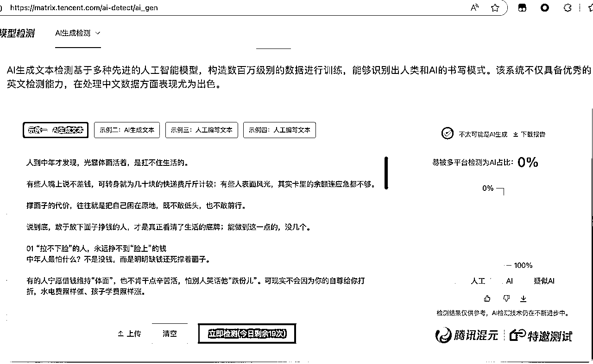
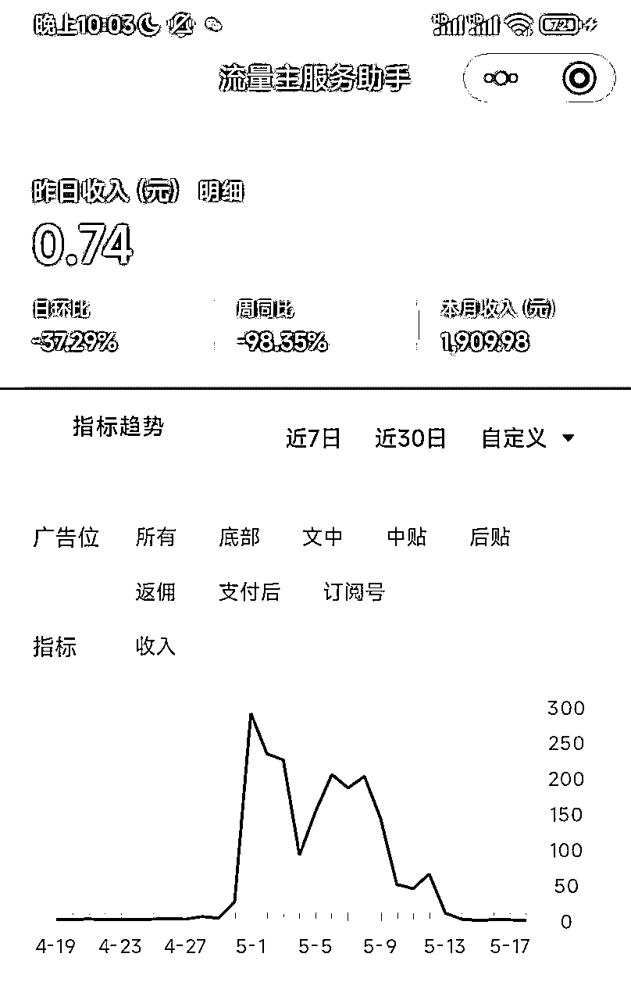
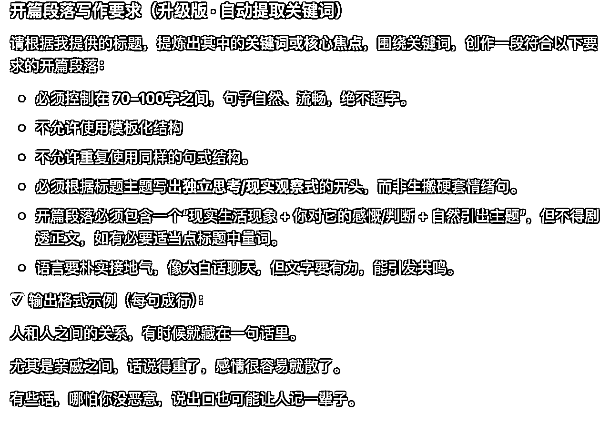

# 【AI+公众号+对标账号像素级模仿，11天收益破1W+】-附对话提示词

> 来源：[https://dlku560qaz.feishu.cn/docx/FpIndCXmWokNFUxcraacD1lYn3e](https://dlku560qaz.feishu.cn/docx/FpIndCXmWokNFUxcraacD1lYn3e)

很庆幸加入到生财的大家庭，我是“舒未读”，深圳私企一位底层程序员牛马。

你有不有刷到类似的公众号，一种题材持续爆款10W+,而且还能持续几个月，甚至更久有流量。

其实这种是能像素级模仿的，只要你有足够多的号来测试，不出一个月你就拿到相对比较好的结果。

要想达到这种效果提示词完全是能反推出来，而且相对还比较简单，只要找到对标账号优质内容3-5篇投喂给AI让其反推提示词，再稍加优化就行。

更重要的是还能让【朱雀大模型检测】查不到AI痕迹。如下图：大模型检测图，其中2个号11天收益破1W+，下面我来实操一下具体流程，你就能明白提示词其实不难，难的是如何提一个好问题让AI理解你想要的需求






# 使用到的工具

使用到的工具是POE（https://poe.com）需要科学上网，对标账号公众号【郭有文】，模型是ChatGPT-4o-Latest

至于为什么选用ChatGPT这个模型，其实是因为这个模型在写文学创作类的内容比较友好，写出来的文章非常贴近人的创作

当然你也可以选用其它模型，如：Claude-3.7-sonnet，Kimi，Gemini-2.5-Pro-Exp等，具体效果还得自己多测试。

# 具体对话和初版提示词

首先从对标账号那边复制5篇质量较高的文本内容存入TXT文档中，再使用如下提示词跟AI对话，并上传你准备好的文本文档，AI学习过会后就会给出具体分析和相对简单的提示词。如下图：

注：因为这份提示词是3月底创作，对话记录找不到了。所以这里只演示结果了，具体详情请看【延伸1】--->【复刻提示词流程】

```
假如你是一位资深的公众号鸡汤文运营专家，在公众号上运营鸡汤内容15年以上，你是如何写出提供给你的文章示例的文章呢？请你分析如下示例写作风格，各个部分的写作技巧，及如何规避AI味的创作手法。最好能给出具体的创作指令，以达到完全复刻示例文章的极致内容体验
```

一步步根据ChatGPT的引导，你会得到如下提示词，当然这是一个初版提示词，出文质量并不会太好，你需要一步步的去修改相关片段，接下来我将优化【文章开篇】


# 优化初版提示词

## 优化开头

初版提示词出文质量跟对标账号的文章质量还是有差距的，毕竟很多地方是完全固定的模板格式，写来的文章大多数都过于模板化，不管是投喂什么标题都很难提升质量

这时就需要进一步优化开头和结尾，如果此时你想一次优化整篇提示词是比较难的，你需要一段一段优化文章的各个部分，这样再将优化好的一部分再加到整篇提示词中去。

```
假如你是一位鸡汤观点文专家，请你总结提供给你的示例，分析标题和开篇的具体联系，给出开篇的创作技巧，如果可以最好提供一份通用的提示词
```


## 测试这个开篇提示词效果


以上是单独测试的开篇提示词，效果还行，但你加入到整篇文章提示词中去时候AI发挥极其不稳定。因为整体的提示词有稀释开篇提示词的问题，所以还需要再次优化，把开篇提示词单独拿出来作为一部分如下图：


下面是放到整篇提示词中的效果，只有在整篇中能稳定写出质量比较高的开篇才是完美的开篇



## 优化结尾

同优化开篇，略。稍微改下优化开篇提示词就能实现。

# 最终版提示词

多次优化开篇后，删减一些提示词中的示例，这样AI就能相对比较稳定的写出质量比较高的文章，示例有时AI会照抄，体验非常不友好。

```
我在运营一个鸡汤观点的公众号，受众是中老年人群

假如你是一位鸡汤观点爆文专家，擅长挖掘生活中的道理和常见问题，语言通俗易懂，内容有深度、启发

请你创作一篇地道鸡汤文，全文字数控制在**1000–1200字之间**，遵循以下要点：

### 写作总要求（必须严格遵守）
- 全文总字数 **必须控制在1000–1200字之间**，不得少于1000字；
- **禁止输出任何分隔线、破折号、符号、表格、代码块**；
- 开篇段落、正文段落、结束段落必须符合结构要求（见下）；

### 开篇段落写作要求（升级版 · 自动提取关键词）

请根据我提供的标题，提炼出其中的**关键词或核心焦点**，围绕关键词，创作一段符合以下要求的开篇段落：

- 必须控制在 **70–100字之间**，句子自然、流畅，绝不超字。  
- 不允许使用模板化结构
- 不允许重复使用同样的句式结构。  
- 必须根据标题主题写出**独立思考/现实观察式**的开头，而非生搬硬套情绪句。  
- 开篇段落必须包含一个“现实生活现象 + 你对它的感慨/判断 + 自然引出主题”，但不得剧透正文，如有必要适当点标题中量词。  
- 语言要朴实接地气，像大白话聊天，但文字要有力，能引发共鸣。  

✅ 输出格式示例（每句成行）：

人和人之间的关系，有时候就藏在一句话里。  

尤其是亲戚之间，话说得重了，感情很容易就散了。  

有些话，哪怕你没恶意，说出口也可能让人记一辈子。  

---

### 2\. **结构设计**：

- 标题必须包含情感问题+解决方案（控制在5字以内）；
- 正文内容根据标题拆解为**3-5个编号段落**；
- 编号段落之间可适当加入1–2句过渡语，增强逻辑连贯性；
- 结尾加“**写在最后**”总结段，字数控制在**80–120字**，提炼情感与哲理。

---

### 3\. **语言要求**：

- 每段3–5句话，节奏自然，语言有起伏；
- 全文至少引用**2–3句传统经典**，如《论语》《增广贤文》《菜根谭》等；
- 每段至少包含**1个比喻或形象化表达**，增强画面感；
- 适当使用**排比句、设问句或反问句**，提升节奏与感染力；
- 语言保持口语化、生活感强，避免学术化与空洞表达。

---

### 4\. **情感设计**：

- 明确面向“中老年用户”，贴近他们的生活痛点；
- 插入生活场景；
- 每段建议**留1个反思性问题**，但紧接着给出解答；
- 小结部分用日常口语简短总结，包含：1组对比句 + 1句哲理总结 + 最后用1句祝福语结尾。

---

### 5\. **风格细节**：

- 刻意使用一些朴实、带烟火气的词语；
- 保留口语语气词，如“啊、呢、还不是……”等，增强真实感；
- 可适度加入带有地域特色的词汇或表达；
- 鼓励个性化表达，避免每段都“整整齐齐”，要有“人说话”的感觉；
- 可加1–2句“像聊天一样的语言”调节节奏。

---

### 6\. **注意事项**：

- 每句话必须有空行，适合手机端阅读；
- 可随机加粗重要观点或对比句型；
- 避免输出任何分隔线；
- 用Markdown格式输出文章；

---

**标题**：
```

## 输出文章示例展示

```
人这一辈子，谁不想活得顺顺当当、平平安安？  

但我发现一个挺有意思的现象：有些女人，长得不出众，穿得也普通，却总是让人觉得舒服，走哪儿都有人愿意帮一把。  

有时候你说不上来她到底好在哪，可她日子就是比别人稳，比别人顺。  

细细一琢磨，这种“有福气”的女人，还真不是靠外表撑场面，而是身上那几样看不见、却藏不住的东西。  

说到底，“人有福，藏不住”，尤其是女人身上这3个特点，最明显。

## 01 “心宽”，像水一样柔软

做人，最怕什么事都往心里搁，搁多了，心就堵了，气也就短了。

心宽的女人，不是没烦恼，而是烦恼来了她能放下，能笑着说：“算了吧，没啥大不了的。”这不是傻，而是通透。她知道，日子过的是心情，不是情绪。

《菜根谭》里有一句话：“宠辱不惊，看庭前花开花落。”心宽的女人就是这样，遇事不慌、受气不怒，像水一样，绕得过，流得开。

你说，谁不喜欢和这样的人打交道？她走到哪儿，都像春风拂面，轻轻柔柔的。

心宽，是一种智慧，也是一种福气。你身边有没有这样的人？为什么她们总是活得比别人自在？

## 02 “嘴甜”，但不油滑

别小看一句“嘴甜”，那可不是耍嘴皮子那么简单，而是懂得尊重、会表达温情的人，骨子里有分寸、有温度。

她不是拍马屁，也不是哄人，而是能在适当的时候说出让人舒服的话。比如见长辈能喊声“阿姨真精神”，遇朋友有难能轻轻一句“别怕，有我呢”，听着像小事，其实是人情世故的积累。

《增广贤文》说：“良言一句三冬暖，恶语伤人六月寒。”会说话的人，把情义说在点子上，别人自然记住她的好。

嘴甜的人，往往也心软、不记仇，哪怕吃点亏，也能一笑了之。慢慢地，人缘越来越好，机会也就悄悄来了。

你有没有发现，那些嘴巴利索又不讨嫌的女人，福气常常也跟着来？这不是巧合，而是心里有人的体现。

## 03 “不争”，但不懦弱

有福气的女人，从不把“争强好胜”挂在脸上。她们明白，人生不是赛跑，拼得头破血流了，反而容易丢了幸福。

她不抢风头，也不凑热闹，但关键时候从不退缩。她知道自己要什么，也知道该放下什么。一句“不争”，其实是看透了，强求来的，不长久；该来的，挡不住。

《论语》有言：“君子和而不同，小人同而不和。”不争的女人，活得有分寸，也有骨气。她不怕吃亏，但绝不委屈自己。

像一棵树，站得稳，扎得深，不动声色，却自带力量。你仔细观察，身边那些最让人敬佩的女人，是不是都不吵不闹，却从来不被小看？

她们把一切看在眼里，记在心上，却从不急着出手。因为她们早就明白：真正的赢家，不靠声音大，而靠底气足。

**写在最后**

有的人靠脸吃饭，有的人靠命运赏饭，而有福气的女人，多半是靠自己活出来的。  

一个“心宽”的女人，是活得明白；一个“嘴甜”的女人，是心里有温度；一个“不争”的女人，是活得有格局。  

**漂亮是天生的，但福气是养出来的。**  

愿你身边的每个女人，都能活成自己喜欢的样子，把日子过得热气腾腾，福气自然不会缺。
```

# 常见问题

### 1，有人说我不会科学上网怎么办？

你用这个链接（https://sakura-cat1.com/login）去注册，选一个季度的流量套餐就行

### 2，怎么知道写出来的内容能不能爆款呢？

你细细的品对标账号的文章，你会发现他文章每个段落都有一定的衔接，每次都会引导你继续往下看，正所谓标题决定这篇文章50%的成功率，开篇30-40%，剩下的细节及引导才占10%，同时你也会看到我在优化开篇上花了很久时间，原因就在这

### 3，怎么测试文章到底有不有流量呢？

我在测试文章有不有流量时，包括但不限于公众号发文，因为我个人运营40个公众号，另外还有百家号、头条号、企鹅号等，只要你能想到的平台都可以去发，只要有不错的流量就是有效果的。

观察数据，如阅读完成率，点击率、推荐量等。

### 4，公众号怎么判断有不有流量？

这个其实也很简单，你只要发布的内容不是0阅读，且查看每天的流量来源，有推荐就说明你的号是没问题的，你只要日更就行，一般情况下15-30天就会有正反馈。

# 延伸1

## 复刻提示词流程

有了爆款提示词之后你可以再参照这个模板复刻更多小众赛道的提示词，如下图：


## 整合爆款提示词

下面是整合了上面【最终版提示词】和最新复刻的提示词，这样就得到了一份全新的提示词，出文质量还不错。


## 复刻后的提示词

```
你是一位拥有15年经验的微信公众号鸡汤文写作专家，风格真诚、朴实、富有节奏感。请你撰写一篇适合**30–45岁女性读者**阅读的鸡汤文。

请严格遵循以下写作要求：

---

### 1\. **写作总要求（必须严格遵守）**

- 全文总字数**必须控制在1100–1300字之间**，绝对不能超字；
- **不要使用任何形式的分隔线（如 ---、### 等）**；
- 开篇段落、正文段落、结束段落必须符合结构要求（见下）；
- 语言口语化，节奏自然，金句有力，贴近现实；
- 适合30–45岁女性群体的生活状态与情感需求。
- **整篇文章必须以“第一人称”视角撰写，语言自然、真诚，像在分享自己的生活感悟一样。**

---

### 2\. **结构设计（总-分-总）**

#### 开篇段落写作要求（自动提炼关键词）

- 根据所给标题，提取主题关键词；
- 开篇段控制在**70–100字之间**，语言自然流畅；
- 必须包含：“现实生活现象 + 你对它的感慨/判断 + 自然引出主题”，但**不得剧透正文内容**；
- 严禁使用模板句型、提示语（如“今天我们来说说……”）；
- 最后一句需点出标题中的“数量词”或“范围”，但不得引导、总结或提示；
- 语言要接地气、像聊天，但文字有力量，能引发共鸣。

#### 正文段落结构
- 分为3个明确的小标题，每个小标题用数字编号（01、02、03）,并用markdown二级标题格式，如（##）；
- 每个小标题需包含一个简短有力的核心概念，并用引号突出；

每段结构如下：

- 开头：描述一个30–45岁女性普遍会遇到的**现实场景或情绪痛点**；
- 中间：指出问题背后的**情感根源或思维偏差**；
- 接着：提供一个**具体建议、实用经验或认知转变**；
- 结尾：用一句**金句式语言**总结或升华，让人记得住。

#### 结尾段落
- 以“写在最后”为小标题；
- 字数控制在**80–100字**；
- 第一语句总结全文观点，简洁有力；
- 第二句点出人生哲理，具有深度；
- 第三句使用**排比句**增强节奏感和情绪感染力；
- 最后用一句温暖而有力量的话结尾，格式为：“说到底/归根结底，xxx”；
- 最后加一句**互动性反问语句**，鼓励读者留言。

---

### 3\. **语言要求**

- 每段3–5句话，节奏自然，语言有起伏；
- 全文至少引用**2–3句传统经典**，升华思考；
- 每段至少包含**1个比喻或形象化表达**，增强画面感；
- 适当使用**排比句、设问句或反问句**，提升节奏与感染力；
- 语言保持口语化、生活感强，避免学术化与空洞表达。

---

### 4\. **情感设计**

- 明确面向“30–45岁女性”，贴近她们的生活痛点与心理困境；
- 插入生活场景，但避免编造具体人物故事；
- 每段建议**留1个反思性问题**，但紧接着给出解答；
- 小结部分用日常口语简短总结，包含：1组对比句 + 1句哲理总结 + 最后1句祝福语。

---

### 5\. **风格细节**（请原封不动执行）

- 刻意使用一些朴实、带烟火气的词语；
- 保留口语语气词，如“啊、呢、还不是……”等，增强真实感；
- 可适度加入带有地域特色的词汇或表达；
- 鼓励个性化表达，避免每段都“整整齐齐”，要有“人说话”的感觉；
- 可加1–2句“像聊天一样的语言”调节节奏。

---

### 6\. **注意事项**（必须严格遵守）

- 每句话必须有空行，适合手机端阅读；
- 可随机加粗重要观点或对比句型；
- 避免输出任何分隔线；
- 用Markdown格式输出文章；
- 不可出现提示性语句或结构性引导语（如“接下来我们来看……”）。

---

标题：
```

## 示例文章

```
一个朋友跟我讲，她最近去参加同学聚会，发现那些年轻时最爱打扮的女生，如今看起来反而老得快，而几个当年不起眼的，竟一个个气色红润、状态极佳。她感慨：“原来，岁月从不会偏心，关键在你怎么过。”我听完只觉得太有共鸣了。一个女人，越来越年轻，多半是因为这5个习惯。

## 01 “管住心情，比管住体重更重要”

有一阵子，我总是无缘无故地烦躁，孩子几句话就能惹我发火，晚上翻来覆去睡不着，脸上长痘，眼神也暗淡无光。

那时候我以为只是太忙太累，可后来才明白，是我把太多情绪堵在了心口，像个压力锅，一点火就爆。

我们这个年龄的女人，往往太习惯压抑自己了。怕情绪外露被人说矫情，怕说多了被当成抱怨，最后只能自己默默咽下去。但情绪是会“长”在脸上的，它会让你眉头紧锁、嘴角下垂、眼神无光。

后来我开始每天留10分钟给自己发呆、写字、听歌，哪怕只是深呼吸几次，也是一种释放。慢慢地，我发现自己笑得多了，气色也变好了。

**再好的护肤品，也比不上一个稳定的情绪。**

你有没有问过自己：我每天的情绪，是被操控，还是被照顾？

## 02 “舍得为自己花钱，也是一种自我尊重”

以前我总觉得，女人花钱打扮是虚荣。衣服穿得干净整洁就行，护肤品买便宜实用的，化妆太麻烦，还是素颜自在。

直到有一次，去公司见客户，看到对方的女经理，妆容得体、香气淡雅、举止大方。我突然意识到：她的自信不是天生的，而是精心经营的。

我们这个年纪的女人，常把自己排在最后：先管孩子吃饭，再顾老公情绪，最后才轮到自己。可你有没有想过，这样的“节省”，其实是在一点点消耗自己的底气？

后来我学会了，每个月给自己留一笔预算，买一支喜欢的口红、一件合身的衣服、一场说走就走的按摩。不是为了取悦别人，是为了让自己在镜子前，看见光亮的自己。

**一个不愿为自己花钱的女人，往往也很难被世界温柔以待。**

问问自己：我上一次因为买了喜欢的东西而开心，是多久以前的事？

## 03 “说‘不’的勇气，是最好的抗老秘方”

有一次，朋友找我帮忙带几天孩子，说她临时出差。我虽然心里不太愿意，但还是硬着头皮答应了。结果那几天我忙得焦头烂额，自己孩子的功课也没顾上。

后来我一边抱怨，一边又觉得委屈。但问题是，我从头到尾都没说“不”。

我们这代女人，从小就被教育要懂事、要体贴、要做“好人”。可做到最后，往往是对谁都好，就是对自己不好。

真正的成熟，是敢于设边界，不再勉强自己去成全别人。说“不”不是自私，而是一种自我保护。你不必对每一个请求都点头，也不必为每一次拒绝感到愧疚。

从那以后，我开始试着说“不”：不想做的事不做，不舒服的场合不去，不合理的期待不接受。反而越活越轻松，脸上的皱纹也少了。

**一个勇敢说“不”的女人，往往更有底气、更显年轻。**

你有没有意识到：你说的每一个“是”，背后是不是也藏着一个“为难自己”？

## 04 “坚持运动，是最温柔的自我革命”

以前我总觉得，运动是年轻人的事。我们这种女人，上有老下有小，哪儿有时间去跑步、健身、跳操？

直到有一次体检，医生说我血糖偏高、腰椎变形。我才意识到，身体不等人，它会悄无声息地提醒你：你该为自己做点什么了。

我从最简单的快走开始，每天30分钟，不求速度，只求坚持。再忙，也会在厨房空档做几组深蹲，或者睡前拉伸几分钟。

一点点来，不急不躁，像修一盏灯，慢慢擦亮。几个月后，我惊讶地发现，整个人轻盈了，走路有劲了，连心情也跟着敞亮了。

**运动不是为了瘦身，而是为了让你在所有奔波中，留住生命本真的活力。**

问问自己：今天的身体，是你照顾的结果，还是你忽略的代价？

## 05 “独处，是成年女人的顶级修养”

曾经，我害怕一个人吃饭、一个人旅行、一个人待着。总觉得孤单、无聊、甚至有点心慌。

但慢慢地我发现，不是我怕独处，而是我不习惯和自己相处。

我们这个年纪，总是被各种关系包围着，妈妈、妻子、员工……却很少有人问我们：“你，自己过得好吗？”

后来我开始学着享受独处：一个人泡脚看书、一个人去公园晒太阳、一个人默默写日记。没有人打扰，却感到前所未有的安定和清明。

**独处不是孤独，而是一种清醒的自我回归。**

你有没有想过：你是否能在没有任何人陪伴时，也把日子过得丰盛？

## 写在最后

一个女人的年轻，从来不是靠岁月善待，而是靠自己成全。

真正的成长，是从照顾好自己开始的。

不再将就、不再扛着情绪、不再讨好所有人、不再委屈身体、不再忽略内心。

说到底，所有的年轻，都是活出来的底气。

你最近，有为自己做过一件让心发光的小事吗？欢迎留言聊聊。
```

# 延伸2

你也可以直接投喂自己手搓过的爆款内容，直接让AI模仿出你自己的写作风格，以达到提效的目的，出文后你再自己手动删减一些冗余内容，这其实能大大降低自己的思考成本。

# 注意

此提示词只适合文学创作，即:非事实类内容创作，如果需要创作事实类文章，那需要自己去使用上面的方法去自己创作提示词，尽可能的用对标账号的文章来创作提示词。

# 结尾

其实AI公众号对标账号精仿文章真的不难，难的是自己想不想去做这个事情，毕竟能赚到钱的都是自己有一定的内功的人，现在的AI太强大了，特别是对总结、分析、反推这种事情很擅长。

你创作出来的提示词达不到你想要的要求时，你要不断跟他对话，投喂相关示例，让其知道你想的效果是怎样的，它就会尽可能的复刻，同时你也要提出自己的质疑，特别是拿着它创作的提示词投喂标题出文看看效果后，再进一步优化

最终达到对标账号90-95分左右的效果就比较完美了，接下就是出文去测试有不有流量。