# 巧用多维表格，让AI成为小红书运营实际生产力

> 来源：[https://qvvx41oj2n7.feishu.cn/docx/GYMvdlduhoQVzSx0uT9cDam8n5p](https://qvvx41oj2n7.feishu.cn/docx/GYMvdlduhoQVzSx0uT9cDam8n5p)

# 0\. 前言

很高兴加入生财社区，我是伍十七，深圳一家AI公司的技术合伙人。

在阅读了生财所有关于AI的精华内容后，我发现大家遇到的问题是相通的，“输出不稳定”、“提示词生成图片次数越多，效果越差”、“输出1分钟，调试1小时”、等等，关于AI落地的讨论多是实现某个具体场景下的功能，一旦开始规模化操作就失控，AI产出难以把控。

这里以多维表格+DeepSeek制作小红书封面为例，如何对AI输出质量进行系统化管控，让AI成为切切实实的生产力，抛砖引玉，给各位提供一个能够将日常工作AI化的通用思路，希望对大家有所帮助。

# 效果展示

首先看效果，已创建为飞书模版，路径如下： ，打开即用。

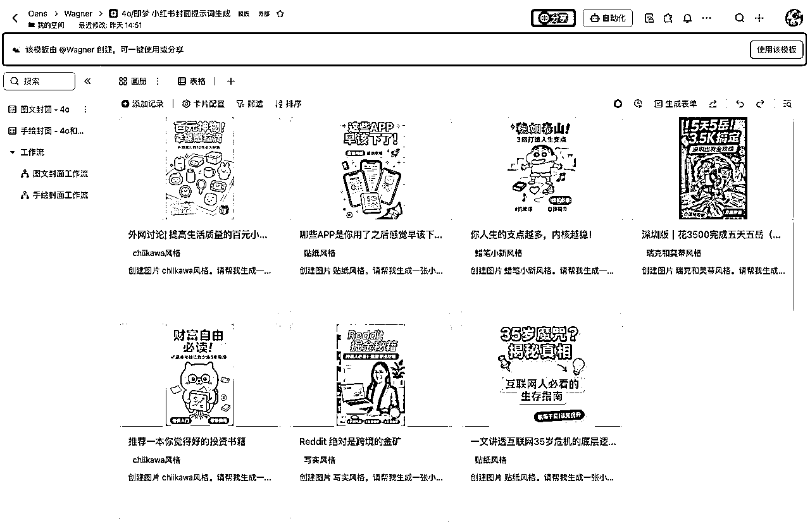

## 图文封面

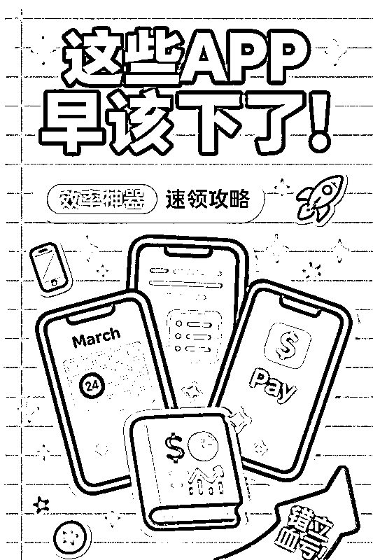

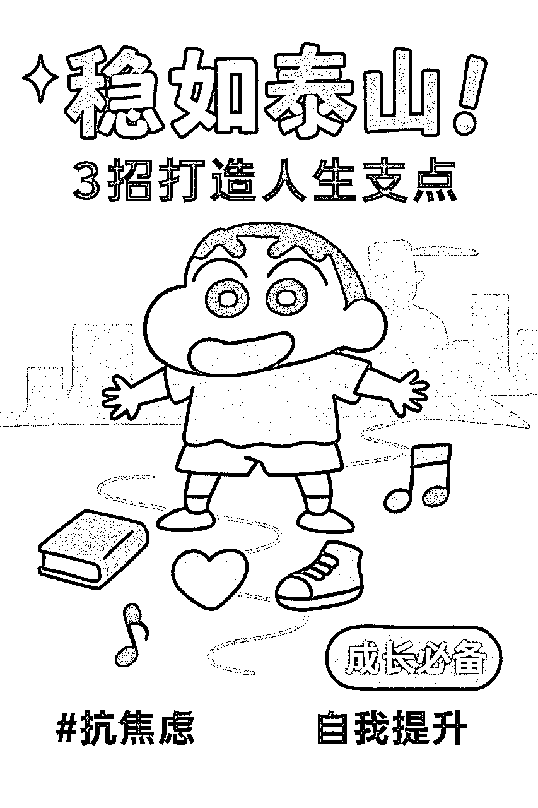

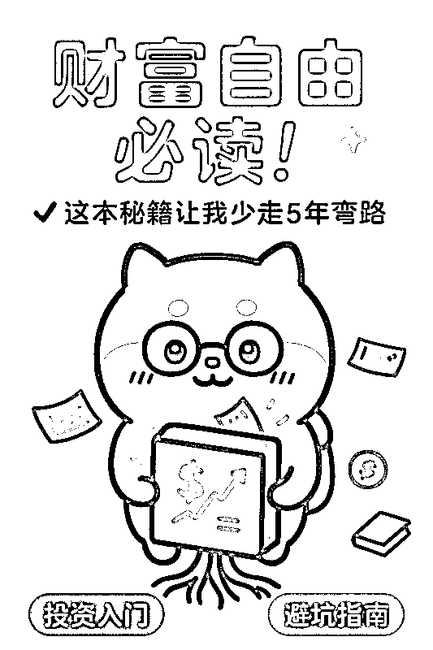

## 手绘封面


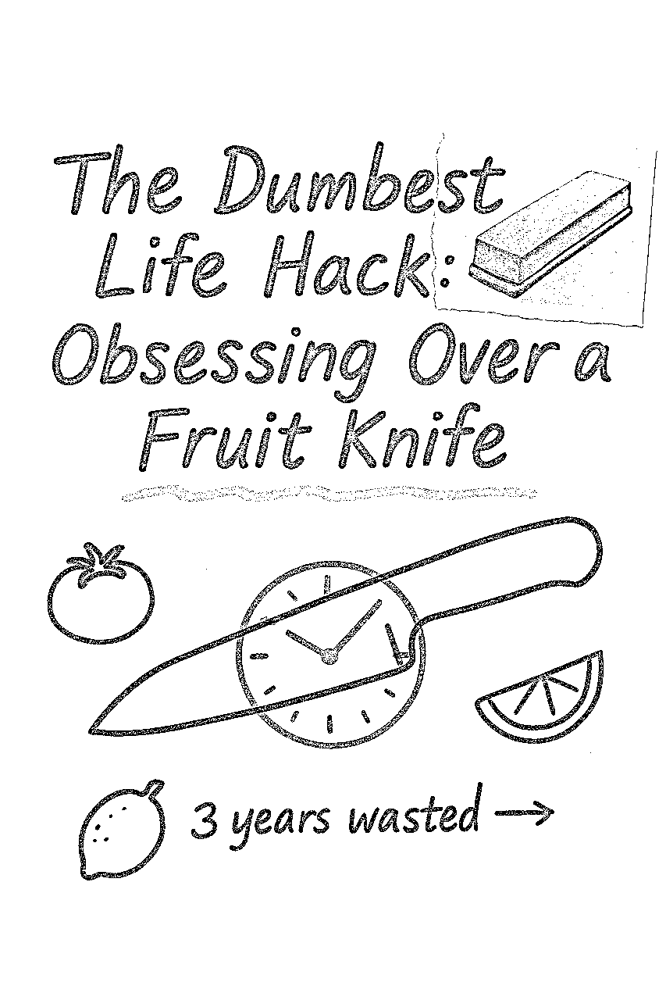

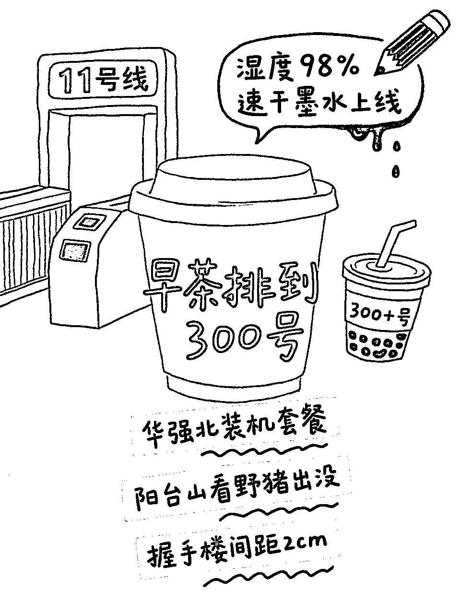

## 使用方式

1.  选择一个封面类型，添加一条笔记主题，填入必填项。


1.  等待片刻，deepseek会自动根据信息生成prompt，将prompt复制到GPT4o中即可，如不满意可以多生成几张。

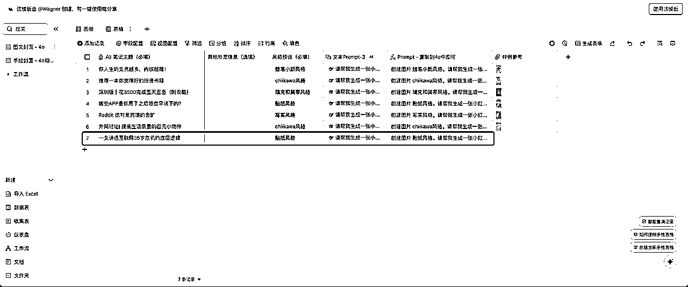

1.  生成效果如下：

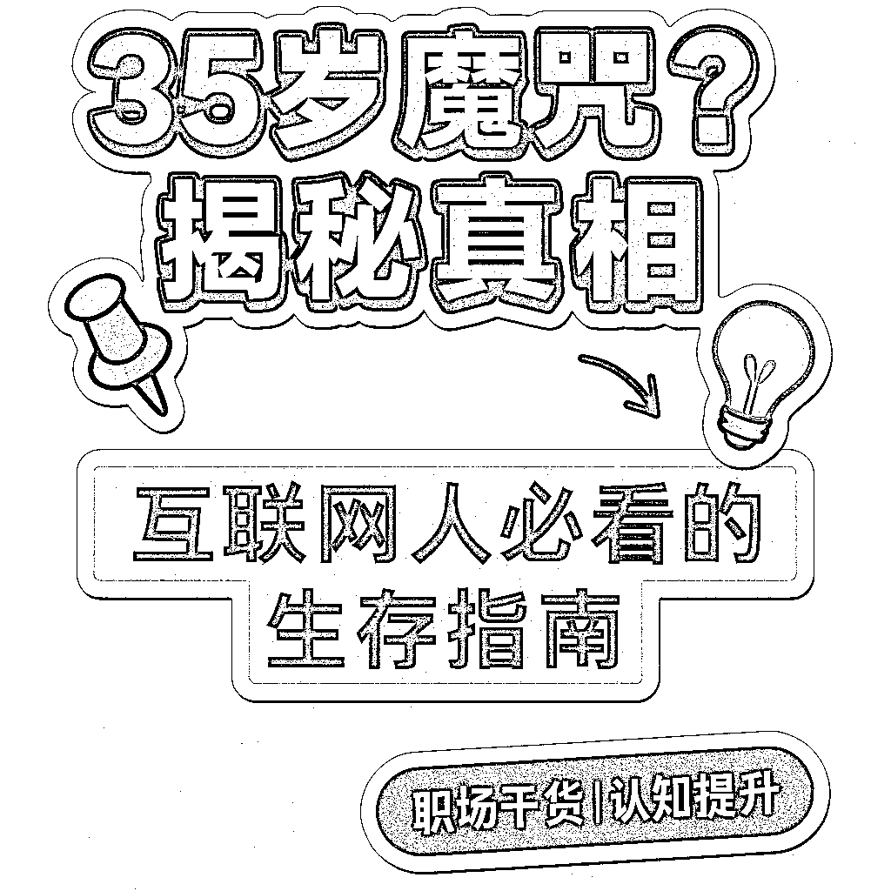

# 动手实操

ok，案例过后，接下来就是具体的实现思路拆解。首先明确一个前提：AI并不是生产力工具，AI就是生产力本身。（非常重要！）

也就是说，要像管理员工一样管理AI。

试想我们要让一个刚入职的新人能够做出符合公司预期的产出，那么他就要知道这个岗位是做什么的，有什么任职要求、以及工作SOP、过程指标、结果指标等等，甚至说的玄乎一点还要理解一下公司的使命和价值观（说远了）。

Prompt、RAG、Workflow（工作流）等等市面上的AI技术，其实解决的核心问题都是同一个，就是：如何管理一个（甚至一群）AI。接下来，我们通过详细拆解来展示如何实现AI的产出管理。

## SOP = 步骤 + 指标

工作标准化需要SOP的支持，对AI而言也同样适用。

如图，完整的小红书封面绘制流程是由多个步骤组合而成，且每个步骤都有不同的任务要求和输出要求。接下来就是根据流程图进行分工。

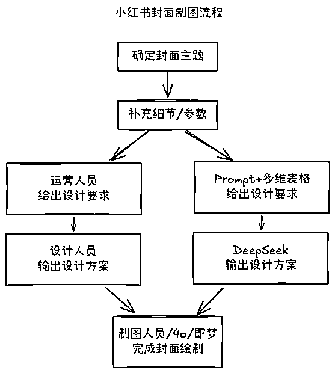

## 运营人员 = 多维表格 + Prompt

运营人员的工作要求是：

通过我提供的主题和补充信息，将prompt补充完整提供给DeepSeek进行进一步输出，也就是说，当我的需求或信息不完整时，他就不需要生成任何信息，这里通过多维表格自带的工作流实现。

1.  例如以下为手绘封面的promtp，需要【笔记主题】、【布局】、【语言】、【插图风格】四项必填信息：

```
你的任务是根据提供的主题、排版布局、语言、色彩方案和插图风格，生成一个结构化、视觉上引人注目的封面图。

在生成prompt时，请严格遵循以下指南：
### 布局:
明确选择一种: **横向** 或 **纵向** 排版，这里排版方向为{{布局}}。确保布局平衡，保持良好的可读性。
### 文字风格:
- **字体大小**:适中、工整的手写风格，便于阅读。
- **主标题**:加粗，使用较大的手写字体，醒目展示。
- **子要点**:使用常规墨水清晰书写，结构分明，注意间距和分支线条的排布。
### 色彩与重点标记:
- **主要内容**:使用浅色背景高亮显示，或采用独特的波浪线(~)下划线突出，具体根据{{色彩方案}}执行。
- **强调笔记**:使用不同颜色的墨水书写，以实现醒目区分，具体颜色按照{{色彩方案}}确定。
### 插图:
包含一个中央插图，插图风格为{{插图风格}}（细致的手绘图、极简风格草图，或拼贴风格的注释照片提取图）。在笔记周围策略性地放置小型相关草图或涂鸦。允许在插图上直接用钢笔风格涂鸦或标注，以营造随意自然的感觉。
### 注释与随笔记录:
模拟记号笔风格的注释、修正、趣味涂鸦、箭头和随手标注，增强视觉互动感。可选地整合与主题相关的拼贴式照片提取图，并附带注释或涂鸦。
### 语言准确性(严格):
若使用 {{语言}}，必须严格遵循公认词典与标准语法规则。若使用复杂书写系统如中文:
- 必须核对每个汉字的正确性、标准用法与准确笔顺。
- 避免使用非标准变体，务必严格确认准确性后再定稿。
```

1.  那么就需要首先在多维表格中加入这四个信息：

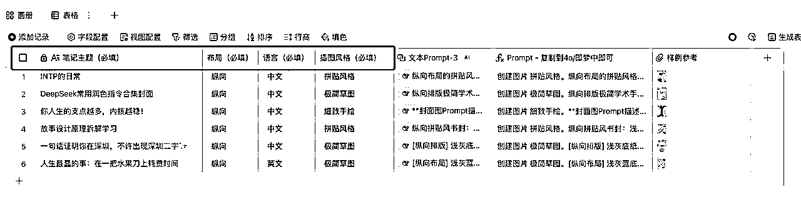

1.  其次我们需要在这四项信息都完整的情况下才进行到下一步，那么就需要借助多维表格的函数和工作流。我们需要一个concatenate函数将信息补充完整，作为文本prompt-1：

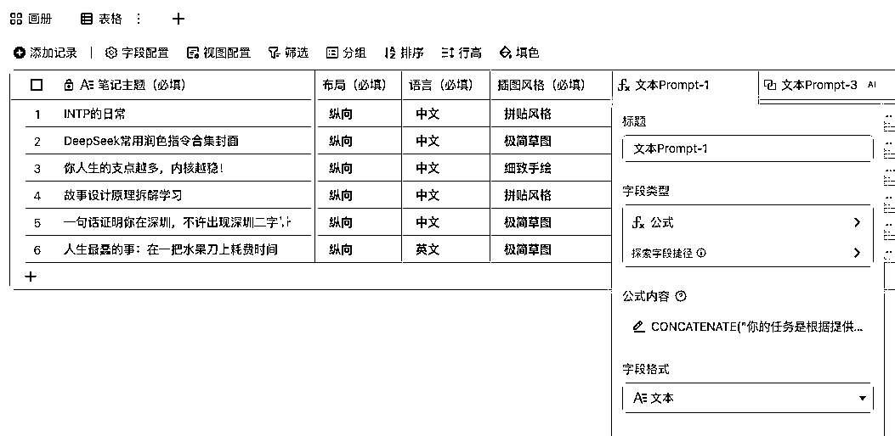

1.  并且需要对prompt进行一些处理，从直接生成结果改为让DeepSeek对主题进行理解并按照要求给出prompt，处理后prompt内容如下：

```
CONCATENATE("你的任务是根据提供的主题、排版布局、语言、色彩方案和插图风格，生成一个结构化、视觉上引人注目的封面图prompt。
以下是用户定义设置：
<主题>
「", [笔记主题（必填）], "」
主题>
<排版方向>
",[布局（必填）],"
排版方向>
<语言>
",[语言（必填）],"
语言>
<色彩方案>
{{色彩方案}}
色彩方案>
<插图风格>
",[插图风格（必填）],"
插图风格>

在生成prompt时，请严格遵循以下指南：
### 布局:
明确选择一种: **横向** 或 **纵向** 排版，这里排版方向为{{布局}}。确保布局平衡，保持良好的可读性。
### 文字风格:
- **字体大小**:适中、工整的手写风格，便于阅读。
- **主标题**:加粗，使用较大的手写字体，醒目展示。
- **子要点**:使用常规墨水清晰书写，结构分明，注意间距和分支线条的排布。
### 色彩与重点标记:
- **主要内容**:使用浅色背景高亮显示，或采用独特的波浪线(~)下划线突出，具体根据{{色彩方案}}执行。
- **强调笔记**:使用不同颜色的墨水书写，以实现醒目区分，具体颜色按照{{色彩方案}}确定。
### 插图:
包含一个中央插图，插图风格为{{插图风格}}（细致的手绘图、极简风格草图，或拼贴风格的注释照片提取图）。在笔记周围策略性地放置小型相关草图或涂鸦。允许在插图上直接用钢笔风格涂鸦或标注，以营造随意自然的感觉。
### 注释与随笔记录:
模拟记号笔风格的注释、修正、趣味涂鸦、箭头和随手标注，增强视觉互动感。可选地整合与主题相关的拼贴式照片提取图，并附带注释或涂鸦。
### 语言准确性(严格):
若使用 {{语言}}，必须严格遵循公认词典与标准语法规则。若使用复杂书写系统如中文:
- 必须核对每个汉字的正确性、标准用法与准确笔顺。
- 避免使用非标准变体，务必严格确认准确性后再定稿。
请现在开始生成prompt。")
```

1.  有了函数以后，就需要工作流，检测信息是否完整。

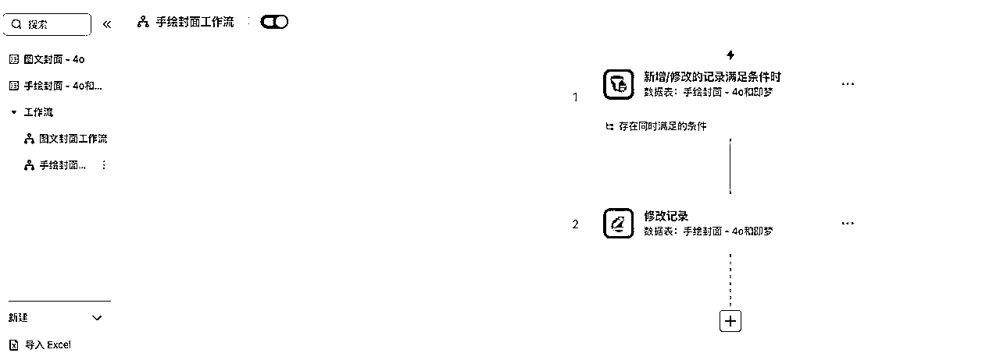

1.  当信息完整时，工作流会自动在prompt2中添加一条信息。

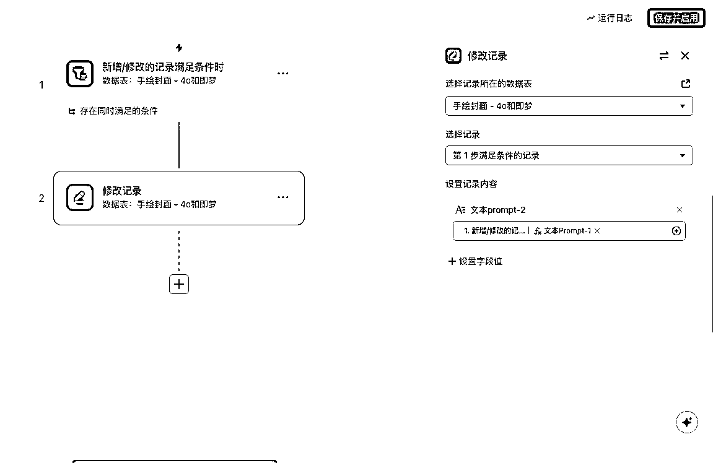

## 设计人员 = DeepSeek

1.  首先需要定义DeepSeek的工作和要求，DeepSeek会根据要求提供prompt：

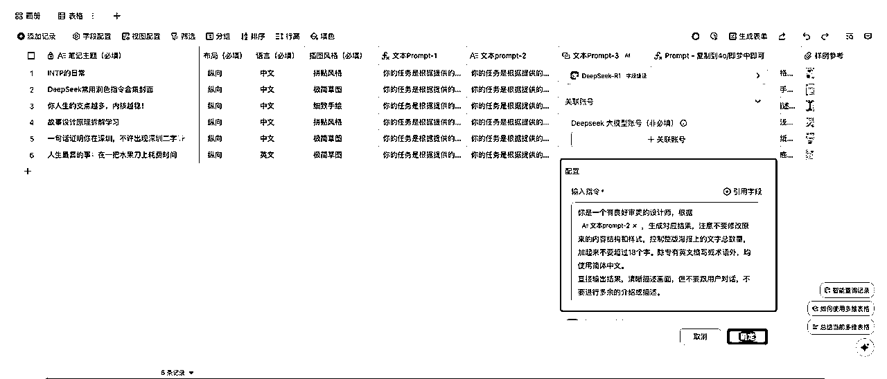

1.  但是此时输出的prompt还无法使用，需要对输出内容进行结构上的要求，这里通过公式实现：

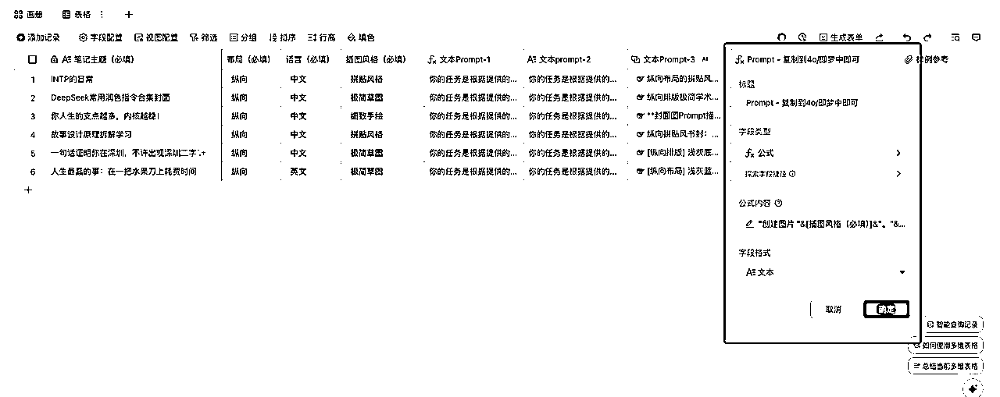

公式如下：

```
"创建图片 "&[插图风格（必填）]&"。"&[文本Prompt-3.输出结果]
```

## 制图人员 = 4o/即梦

此时的Prompt已经可以直接使用，复制到4o或即梦中即可。

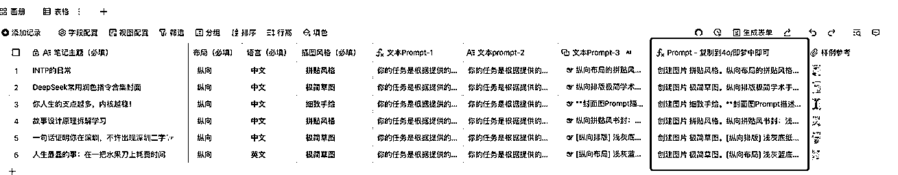

到这里，一个完整的搭建过程就告一段落。

# 总结

通过“多维表格+DeepSeek”构建小红书封面生成流程，本质上是对AI生产流程的标准化重构，这套思路不仅适用于封面制作，所有已经SOP化的工作都可以根据以上方法AI化。

本文完，希望各位有所收获。