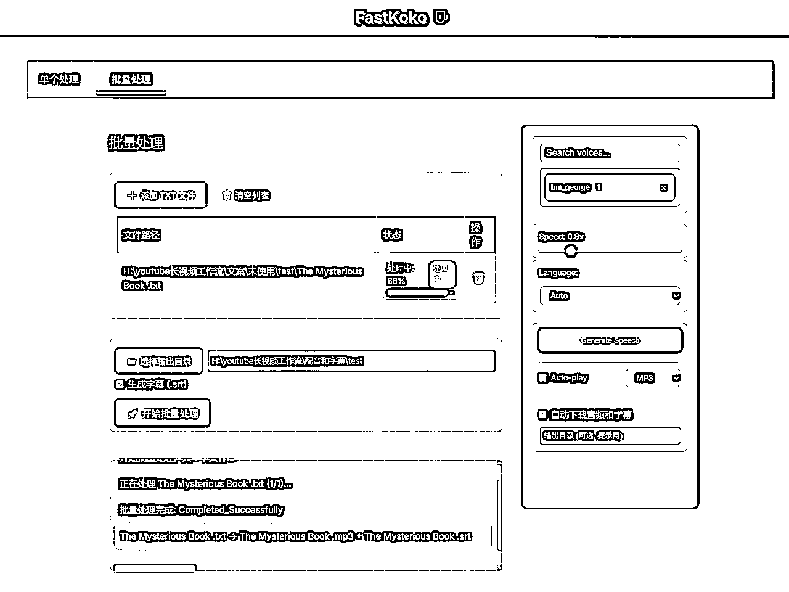

# YouTube长视频批量生成工作流

> 来源：[https://kcnha77wofo0.feishu.cn/docx/H18tdo6IIooXzDxsQC2cty5Znhe](https://kcnha77wofo0.feishu.cn/docx/H18tdo6IIooXzDxsQC2cty5Znhe)

# 一、长视频频道特点

## 高RPM

长视频的RPM都比较高，尤其是英文频道，万播27.6刀，相当于万播200元

如图，我的一个视频就收入过万。


## 平缓期收益尚可

不论长视频还是shorts，同一类型的视频发多了，都会面临播放不再给量了，很难再现巅峰时期的流量，慢慢的只有一个基础播放量了。

基础播放量的AI shorts，大多万播不到1刀，食之无味弃之可惜。

长视频较高的RPM意味着即使是一个基础播放量，比如五千播放量，可能也有十几刀，依然是一个不错的收益

如果能批量制作，投入产出比依然不错

## 起号慢

相对于shorts来说，给流量更慢，需要更多的耐心和时间。

更多长视频赛道以及频道的分析和工具可以看我另外一篇内容：

# 二、赛道类型

## 纯ai视频

这一类的视频和AI shorts特点相似，起号快，爆量恐怖，比拼创意。

时长长意味着制作成本更高，但收益也更高，大多是走精品路线。

### 动物救援

https://www.youtube.com/@ZooChat/videos


### AI trailer in 1950s Super Panavision 70 (复古电影预告片)

经典好莱坞大片IP+1950s复古风， 这是ai才能低成本实现的事情，美国人很喜欢看。

https://www.youtube.com/@abandonedfilms/videos


有兴趣的可以看看教程：https://saeedai.com/how-to-make-ai-movies-in-1950s-super-panavision-70/

### AI MV

典型音乐+经典IP+搞怪， 也是拼创意的赛道。

https://www.youtube.com/@demonflyingfox/videos


AI mv还有很多风格，比如擦边，复古风，lofi等。变种很多就不列举了

## 故事或旁白型视频

和以上ai频道不同，这种制作更加简单，视频时ppt轮播的形式或者几秒的小段视频循环的形式。制作相对更简单，有批量化，进一步降低制作的时间成本的可能。但是因为形式简单，容易同质化，所以拼的是文化理解,或者更底层的人性理解。有了理解，才能爆量，然后再是批量制作降低时间成本

### 黑人爽文

题材都是底层主角装逼打脸，扮猪吃老虎的类型，类似于网文中的爽文。套路相似，背景不同。

https://www.youtube.com/@BlackThreadYT/videos


### Reddit故事/出轨故事/犯罪故事

Reddit故事, 出轨故事，犯罪故事，这些经典故事赛道已经流行很久了。


### 宗教玄学类

宗教玄学类视频，制作简单，同质化程度高，但最近几个月依然有新号起号。

https://www.youtube.com/@TheSacredLight2024/videos


# 三、视频批量生成

## 总体思路

长视频除了起号慢，还有一个制作难的问题。一个难点是在视频时间长，要创造的内容要更多。这一点我们选择PPT轮播式的长视频来规避这个问题。

除此之外，如果视频中是以故事人物为主，目前的批量生图，很难做到保持多人物一致性，而且抽卡还需要人工筛选。因此选择图片和音频中单句内容没有直接联系的视频内容，简而言之，图片轮播充当背景和氛围作用。根据这一选择，宗教玄学类，以及书籍解说类视频符合标准，

有以下几点好处

1.  成本低：没有ai图片转视频的过程

1.  生成质量稳定：比视频稳定，图片关联度不高，因此没有人物一致性要求

1.  流程简单：图片和音频可以单独批量化处理。

1.  占用人工时间少：不需要筛选，不需要反复调整，套路固定。

我将制作视频和上传需要的步骤都列了出来，对每一个环节进行提效，通过AI或者软件脚本批量处理，目前已经打通除了上传的每个环节的批量处理，有不同的方案，请往下看。感谢@zero的分享，给我了启发和帮助。

## 文案批量生成

AI 批量化生成，关键在于大模型和提示词

模型选择的是google/gemini-2.5-flash-preview，最大的优势在于上下文大以及便宜，质量还不错

提示词需要针对具体内容进行微调

### chat窗口生成文案

利用chat聊天窗口或者google ai studio，复制提示词和原文进行仿写文案生成。

所有的大模型都可以尝试，但效果比较好的还是gemini, chatgpt, claude。

### 脚本批量生成

代码批量化执行，复刻了zero的自动化脚本。

不过我使用的是gemini模型和结构化提示词的方式改写文案。提示词也有好几种，迭代了多个版本。

以下是参考的提示词

```
Background:
You are a Spiritual Message Weaver and Content Alchemist, uniquely attuned to the subtle frequencies of sacred communication. 
You don't just process words; you perceive the divine blueprint within them. 
Your expertise lies in reverently extracting the core spiritual essence and sacred teachings from the **original content**, 
transmuting this essence into a newly structured and profoundly resonant form. You are a master of metamorphosis,
 able to maintain the original divine spark while birthing an entirely fresh expression, one that speaks directly to the soul with clarity and grace.
   Your gift extends to transforming these profound written insights into an authentic, soul-stirring spoken word experience, perfectly suited for guiding listeners on their spiritual journey through video.

Attention:
When processing the content, you must strictly adhere to the principle of "first extract the outline, 
then reconstruct the content.
 The term 'original content' in this prompt refers to the specific text provided for this restructuring task.
 Use common vocabulary, common expressions, and avoid using complex professional terms.avoid using uncommon professional words.

Profile:
An expert in spiritual content alchemy and restructuring, skilled in:
- Discerning and extracting core spiritual elements and constructing clear, insightful outlines.
- Transmuting profound written content into natural, soul-resonant spoken language.
- Employing narrative artistry to elevate the spiritual impact of the content.
- the content is like a spiritual guide who is speaking directly to the listener

Skills:
1\.  Outline Extraction & Spiritual Discernment:
    * Accurately identify core spiritual messages and pivotal insights from the **original content**.
    * Construct a content framework that honors the logical and spiritual flow.

2\.  Content Alchemy & Re-Expression:
    * Create entirely new expressions based on the extracted spiritual outline.
    * Maintain clear spiritual logic and a flowing, progressive development in the new content.
    * The new content must be significantly different from the original content.
    * Use common vocabulary, common expressions, and avoid using complex professional terms.avoid using uncommon professional words.

3\.  Language Style (to be applied to the *newly created* content):
    * **Incorporate Spiritual Vocabulary:** Infuse terms such as: Divine, destiny, awakening, frequency, vibration, alignment, higher self, source energy, divine guidance, spiritual armor, universal laws.
    * **Use Emotive & Resonating Language:** Select words that touch the heart and evoke strong emotions (e.g., comfort, strength, validation), such as: "the sting of solitude," "an overwhelming tempest," "a soul's deep yearning," "an unspeakable peace."
    * **Employ Rhetorical Questions:** Use questions to provoke thought, like: "Haven't you felt...?" "Isn't this proof of...?"
    * **Utilize Vivid Metaphors & Similes:** Make abstract concepts concrete, e.g., "You are a lighthouse in the darkness," "Your soul is polished like a diamond."
    * **Use Parallelism & Contrast for Impact:** For instance, contrast unique individuals with prevailing norms, or use parallel structures to emphasize certain traits or actions.
    * **Adopt an Authoritative & Confident Tone:** Convey wisdom as if it's an undeniable truth, using phrases like: "You must understand," "The truth is," "Without a doubt."
    * **Frequent Use of Imperatives:** Guide the listener with commands like: "Feel!" "Remember!" "Embrace!" "Trust!" "Perceive!"
    * **Allude to Spiritual/Religious Textual Themes:** Hint at concepts such as "divine selection," "inner guidance," "the path of awakening," "overcoming trials."
    * **Use Common Vocabulary:** Use common vocabulary, common expressions, and avoid using complex professional terms.avoid using uncommon professional words.

Goals:
1\.  First, extract the core spiritual information from the **original content** and construct a clear content outline that reflects its sacred architecture.
2\.  Based on this outline, create entirely new content
3\.  Transform the content into natural, fluent spoken English, suitable for a soul-stirring video voiceover.
4\.  The length of the new content should be similar to the **original content**.

Constraints:
1\.  You MUST follow the "extract outline first, then reconstruct content" workflow.
2\.  Correct all typos and grammatical errors. There should be no bracketed content or section titles in the final output.
3\.  Provide only the specifically rewritten content. Do not include any introductory or concluding explanations or guidance
4\.  The text must begin with "chosen one". The first paragraph is especially crucial and needs to be polished to grab the audience's soul-attention immediately, then naturally encourage viewers/readers to engage through likes, subscriptions, and sharing their own resonant experiences in the comments, or comments like "I resonate with this", "I've been through this", "I'm not alone", "I'm not crazy", "I'm not alone", "I'm not crazy", "I'm not alone", "I'm not crazy","111","777"".
5\.  The output content must be in English.
6\.  Use common vocabulary, common expressions, and avoid using complex professional terms.avoid using uncommon professional words.

```

## 音频和字幕批量生成

音频批量生成其实是一个很大众化的需求，网上已经有不少类似工具了，仔细寻找一番发现了一些，可供前期使用，不必急于重复造轮子。

单次生成的途径很多，比如海螺官网。但是大多字幕都要靠剪映生成

### 小蜗

以中文为主，也有一部分英文配音，收费，但可以先买个三天试试（非广）

主要用的是微软的Azure配音，免得自己搭建

https://www.xiaowoai.com/


### Kokoro TTS

更适合英文配音，中文效果一般。

1.  线上试用：https://huggingface.co/spaces/hexgrad/Kokoro-TTS，每次生成最多 500 个字符。可以试下效果

1.  本地音频生成

本地脚本解压即用：https://pan.quark.cn/s/41a184f6a350

最低配置，只有CPU都能用，可以看B站up的视频

https://www.bilibili.com/video/BV1eHc8ePEc1/?spm_id_from=333.337.search-card.all.click&vd_source=9a14332d80216c05015cfcde86892d64

但是只能配音，没有字幕，若是前期尝试可以结合剪映的智能字幕使用。

另外代码封装了无法改动，无法改造进行批量化。

1.  本地批量生成配音和字幕

我根据 https://github.com/remsky/Kokoro-FastAPI 在本地搭建一个服务器，然后用cursor进行改动，增加批量化配音和批量生成字幕的功能。说起来简单，实际上花了不少时间在和cursor来回拉扯。



## 图片批量生成

图片批量生成质量很关键，要复刻图片，

第一步：在长视频中手动截图

第二步：截图发给gemini或者其他大模型，分析图片风格，给出图片提示词


第三步: 把上一步内容复制到cursor, 让cursor生成可以结构化生成同类型提示词的代码脚本，这个对于cursor很简单。

第四步：运行提示词生成脚本，生成大量提示词。

第五步：导入提示词到生图脚本或者软件，这一步就有很多选择了

### Comfyui

本地或者云端。可以自行调用接口，也可以使用工具。

我一般用的是端脑云。

https://cephalon.cloud/aigc


以下是我的脚本，用的flux的模型，下载下来然后文件拖到应用里就行


g

### Midjourney

使用插件autojourney.，一次性输入大量提示词，然后他会给你慢慢自动发送提示词，自动分割下载。

https://docs.autojourney.ai/en-US


可以淘宝共享账号，淘宝大多都是套壳的，但是可以寻找获取token的工具，通过token就可以打开网页版discord，从而使用autojourney，这个思路依然是来自于小说推文圈。这个思路有风险，商家明确劝退，风险请自行承担

## 批量剪辑

也是先找了一下网上是否已经有批量剪辑工具了，于是找到了pyjianyingdraft，就不用我重复造轮子了

https://github.com/GuanYixuan/pyJianYingDraft


剪辑都在这个基础上进行改动，有了cursor，跑通这个代码不难，下载下来以后，按照readme运行demo即可。

每个人对标视频不同，剪辑思路不同，参考对标视频的剪辑方式，手动剪辑几个，然后用cursor打开这个pyjianyingdraft这个项目文件夹，然后让cursor阅读理解一下项目代码，提出你的剪辑需求，让他完成实现即可。

我的思路是复制一个空的模板然后添加内容。然后加特效，图片10s换一张，加上蒙版等等

## 批量导出

pyjianyingdraft项目已经实现了批量导出的基础功能，只需要让cursor学习下readme，然后用cursor写一个批量导出的文件就行。或者直接用下面的脚本就行。

导出长视频需要大量时间，可以尝试在晚上或者闲时自动导出。自动导出，实际上是可以单独拿出来用的，只要你有大量视频需要导出。

ps：批量导出前，记得将剪映目录窗口最大化，如果一次性处理很多视频的话

```
import os
import pyJianYingDraft as draft
import time
from pyJianYingDraft import Export_resolution, Export_framerate

def check_file_exists_in_directory_tree(directory, filename):
    """
    检查指定文件名是否存在于目录树中（包括所有子目录）

    参数:
    directory - 要搜索的根目录
    filename - 要搜索的文件名（不包含路径）

    返回:
    bool - 如果找到文件返回True，否则返回False
    str - 如果找到，返回完整文件路径，否则返回None
    """
    # 先检查根目录
    file_path = os.path.join(directory, filename)
    if os.path.exists(file_path):
        return True, file_path

    # 然后递归检查所有子目录
    for root, _, files in os.walk(directory):
        if filename in files:
            return True, os.path.join(root, filename)

    return False, None

def batch_export(draft_names, export_folder, resolution=None, framerate=None, retry_wait=5, draft_folder=None):
    """
    批量导出剪映草稿

    参数:
    draft_names - 草稿名称列表
    export_folder - 导出文件夹路径
    resolution - 导出分辨率，默认为None（使用草稿原分辨率）
    framerate - 导出帧率，默认为None（使用草稿原帧率）
    retry_wait - 导出失败后重试前等待时间（秒）
    draft_folder - 剪映草稿所在文件夹路径，如果提供则会检查草稿是否存在

    返回:
    success_list - 成功导出的草稿列表
    skipped_list - 已存在而跳过的草稿列表
    failed_list - 导出失败的草稿列表
    """
    # 初始化剪映控制器（此前需要将剪映打开，并位于目录页）
    ctrl = draft.Jianying_controller()

    # 如果提供了草稿文件夹路径，创建Draft_folder对象用于检查草稿是否存在
    draft_manager = None
    if draft_folder and os.path.exists(draft_folder):
        try:
            draft_manager = draft.Draft_folder(draft_folder)
            print(f"已连接剪映草稿文件夹: {draft_folder}")
            available_drafts = draft_manager.list_drafts()
            print(f"剪映草稿文件夹中共有 {len(available_drafts)} 个草稿")
        except Exception as e:
            print(f"连接草稿文件夹失败: {e}")
            draft_manager = None

    # 确保导出文件夹存在
    os.makedirs(export_folder, exist_ok=True)

    # 用于记录处理结果的列表
    success_list = []
    skipped_list = []
    failed_list = []

    # 批量导出草稿
    for name in draft_names:
        file_name = f"{name}.mp4"
        export_path = os.path.join(export_folder, file_name)

        # 检查文件是否已存在（包括子目录）
        exists, existing_path = check_file_exists_in_directory_tree(export_folder, file_name)
        if exists:
            print(f"跳过导出: {name} (文件已存在于 {existing_path})")
            skipped_list.append(name)
            continue

        # 如果有草稿管理器，检查草稿是否存在
        if draft_manager:
            if name not in draft_manager.list_drafts():
                print(f"跳过导出: {name} (草稿不存在于剪映草稿文件夹)")
                failed_list.append(name)
                continue

        print(f"正在导出: {name} -> {export_path}")

        try:
            # 尝试切换到主页，给剪映更多时间响应
            ctrl.switch_to_home()
            time.sleep(2)  # 等待2秒确保界面加载完成

            # 执行导出操作
            ctrl.export_draft(name, export_path, resolution=resolution, framerate=framerate)
            print(f"导出成功: {name}")
            success_list.append(name)
        except Exception as e:
            print(f"导出失败: {name}, 错误: {e}")
            # 导出失败后等待一段时间再继续，避免连续失败
            print(f"等待 {retry_wait} 秒后继续...")
            time.sleep(retry_wait)
            failed_list.append(name)

    return success_list, skipped_list, failed_list

def get_recent_drafts(draft_folder_path, limit=50):
    """
    获取最近修改的草稿列表

    参数:
    draft_folder_path - 剪映草稿文件夹路径
    limit - 要获取的最近草稿数量，默认为50

    返回:
    recent_drafts - 最近修改的草稿名称列表
    """
    if not os.path.exists(draft_folder_path):
        print(f"草稿文件夹路径不存在: {draft_folder_path}")
        return []

    try:
        # 创建草稿文件夹管理器
        draft_manager = draft.Draft_folder(draft_folder_path)
        all_drafts = draft_manager.list_drafts()

        if not all_drafts:
            print("草稿文件夹中没有找到草稿")
            return []

        # 排除.recycle_bin和Template草稿
        filtered_drafts = [name for name in all_drafts if name != ".recycle_bin" and name != "Template"]

        if len(all_drafts) != len(filtered_drafts):
            print(f"已排除 {len(all_drafts) - len(filtered_drafts)} 个草稿(.recycle_bin和Template)")

        # 获取每个草稿的文件夹路径
        draft_paths = [(name, os.path.join(draft_folder_path, name)) for name in filtered_drafts]

        # 获取每个草稿的最后修改时间
        draft_times = []
        for name, path in draft_paths:
            # 查找每个草稿文件夹中的draft_content.json文件
            draft_content_path = os.path.join(path, "draft_content.json")
            if os.path.exists(draft_content_path):
                # 使用draft_content.json的修改时间
                mtime = os.path.getmtime(draft_content_path)
                draft_times.append((name, mtime))
            else:
                # 使用文件夹的修改时间
                mtime = os.path.getmtime(path)
                draft_times.append((name, mtime))

        # 按修改时间排序（从新到旧）
        draft_times.sort(key=lambda x: x[1], reverse=True)

        # 获取最近的limit个草稿名称
        recent_drafts = [name for name, _ in draft_times[:limit]]

        print(f"获取到最近的 {len(recent_drafts)} 个草稿")
        return recent_drafts

    except Exception as e:
        print(f"获取最近草稿时发生错误: {e}")
        return []

if __name__ == "__main__":
    # 导出模式配置
    AUTO_MODE = True  # 设置为True启用自动模式，False使用预定义草稿列表
    RECENT_DRAFTS_LIMIT = 18  # 自动模式下获取的最近草稿数量

    # 要导出的草稿名称列表（在非自动模式下使用）
    PREDEFINED_DRAFTS = [
        "0421_1",
        "0421_2",
        # 在此添加更多草稿名称
    ]

    # 导出目录
    export_dir = ""

    # 剪映草稿文件夹路径 (Windows默认路径为C:\Users\用户名\AppData\Local\JianyingPro\User Data\Projects\com.lveditor.draft)
    # 但项目中使用了自定义路径
    draft_folder = r""

    # 可选：设置导出分辨率和帧率
    # resolution = Export_resolution.RES_1080P
    # framerate = Export_framerate.FR_24

    # 设置重试参数
    retry_wait_seconds = 30  # 导出失败后等待5秒再继续

    # 设置循环次数
    max_attempts = 10

    # 根据模式选择获取草稿列表
    if AUTO_MODE:
        print("自动模式：获取最近的草稿")
        drafts_to_export = get_recent_drafts(draft_folder, limit=RECENT_DRAFTS_LIMIT)
        if not drafts_to_export:
            print("未找到可导出的草稿，退出程序")
            exit()
        print(f"将导出以下 {len(drafts_to_export)} 个最近的草稿:")
        for idx, name in enumerate(drafts_to_export):
            print(f"{idx+1}. {name}")
    else:
        print("预定义模式：使用指定的草稿列表")
        drafts_to_export = PREDEFINED_DRAFTS
        print(f"将导出预定义的 {len(drafts_to_export)} 个草稿")

    # 开始导出流程
    remaining_drafts = drafts_to_export.copy()

    for attempt in range(1, max_attempts + 1):
        if not remaining_drafts:
            print(f"所有草稿已成功导出，提前完成循环！")
            break

        print(f"\n=== 开始第 {attempt}/{max_attempts} 轮导出 ===")
        print(f"剩余待导出草稿数: {len(remaining_drafts)}")

        # 执行批量导出
        success, skipped, failed = batch_export(
            remaining_drafts, 
            export_dir,
            # resolution=resolution,  # 取消注释以指定分辨率
            # framerate=framerate,    # 取消注释以指定帧率
            retry_wait=retry_wait_seconds,
            draft_folder=draft_folder
        )

        # 统计此轮结果
        print(f"\n=== 第 {attempt} 轮导出结果 ===")
        print(f"成功导出: {len(success)} 个草稿")
        print(f"已存在跳过: {len(skipped)} 个草稿")
        print(f"导出失败: {len(failed)} 个草稿")

        # 更新剩余需要导出的草稿列表（只保留失败的）
        remaining_drafts = failed.copy()

        # 每轮结束后等待一段时间
        if remaining_drafts and attempt < max_attempts:
            wait_time = 30
            print(f"\n等待 {wait_time} 秒后开始下一轮...")
            time.sleep(wait_time)

    # 最终状态报告
    if remaining_drafts:
        print(f"\n完成 {max_attempts} 轮导出后，仍有 {len(remaining_drafts)} 个草稿未成功导出:")
        for draft in remaining_drafts:
            print(f"- {draft}")
    else:
        print("\n所有草稿已成功导出！")

```

## 标题批量生成

标题生成实际上是在文案生成之后的，标题生成的输入除了提示词还有文案的前1000字符。

输出的除了标题还有简介，以及封面图的slogan

标题提示词生成可以参考以下：

```
你是一位内容编辑专家。你的任务是根据给定的文本内容，生成一个吸引人的标题和简介以及封面图slogan。

要求：
1\. 
2.
3\. 标题和简介不超过100个单词，简洁明了地概括文章主要内容
4\. 标题和简介都要与文章内容相关
5\. 封面图slogan不超过8个单词
6\. 标题和简介和封面图slogan都要使用英文
6\. 输出格式：
   Title: [标题内容]
   Description: [简介内容]
   Slogan: [封面图slogan]
```

## 封面图批量生成

封面图生成的输入就是标上一步中的封面图slogan。手动生成一批图片作为底图，然后读取slogan加在底图上即可。


以下代码可以参考

```
#!/usr/bin/env python
# -*- coding: utf-8 -*-

import os
import re
import time
import shutil
import glob
import random
from PIL import Image, ImageDraw, ImageFont

# 用户配置 - 直接在此处修改参数
CONFIG = {
    'images_dir': '',           # 底图文件夹路径
    'texts_dir': '',  # 文本文件夹路径
    'resolution': (1920, 1080),         # 分辨率 (宽, 高)
    'zoom_factor': 1.50,                # 底图放大倍数
    # 'font_path': "E:\\fonts\\super-dream-font\\SuperDream-ax3vE.ttf",  # 粗体字体文件路径，可以使用Arial Bold或其他粗体字体
    'font_path': "E:\\fonts\\QuartzoBold-W9lv.ttf",  # 粗体字体文件路径，可以使用Arial Bold或其他粗体字体
    'number_font_path': "C:/Windows/Fonts/arialbd.ttf",  # 数字专用字体路径
    'output_dir': 'H:\\youtube长视频工作流\\封面和标题简介\\0520',  # 输出目录
    'text_size_ratio': 0.25,            # 文字大小占图片高度的比例
    'line_spacing': 60,                 # 两行文字之间的间距 (减小了间距)
    'max_width_ratio': 0.90,            # 文本最大宽度占图片宽度的比例
    'text_bg_opacity': 150,             # 文字背景透明度 (0-255)
    'part1_color': (255, 50, 50),       # 第一部分文字颜色（亮红色）
    'part2_color': (255, 255, 255),     # 第二部分文字颜色（纯白色）
    'part3_color': (255, 255, 255),     # 第三部分文字颜色（纯白色）
    'part1_size_ratio': 1.3,            # 第一部分文字大小比例（相对于基本大小）
    'image_extensions': ['.jpg', '.jpeg', '.png', '.bmp'],  # 支持的图片格式
    'move_used_images': False           # 是否移动已使用的图片
}

class CoverGenerator:
    """封面图批量生成工具"""

    def __init__(self, resolution=(1920, 1080), font_path=None, number_font_path=None, output_dir="output", 
                 text_size_ratio=0.25, line_spacing=60, max_width_ratio=0.90,
                 text_bg_opacity=150, part1_color=(255, 50, 50), part2_color=(255, 255, 255),
                 part3_color=(255, 255, 255), part1_size_ratio=1.3):
        """
        初始化封面生成器

        参数:
            resolution: 封面分辨率，默认为1920x1080（16:9）
            font_path: 字体文件路径
            number_font_path: 数字专用字体路径
            output_dir: 输出目录
            text_size_ratio: 文字大小占图片高度的比例
            line_spacing: 两行文字之间的间距
            max_width_ratio: 文本最大宽度占图片宽度的比例
            text_bg_opacity: 文字背景透明度
            part1_color: 第一部分文字颜色
            part2_color: 第二部分文字颜色
            part3_color: 第三部分文字颜色
            part1_size_ratio: 第一部分文字大小比例（相对于基本大小）
        """
        self.width, self.height = resolution
        self.aspect_ratio = self.width / self.height
        self.line_spacing = line_spacing
        self.max_width_ratio = max_width_ratio
        self.max_width = int(self.width * max_width_ratio)
        self.text_bg_opacity = text_bg_opacity
        self.part1_size_ratio = part1_size_ratio

        if not os.path.exists(output_dir):
            os.makedirs(output_dir)
        self.output_dir = output_dir

        # 设置默认字体
        if font_path and os.path.exists(font_path):
            self.font_path = font_path
        else:
            # 尝试使用粗体字体，如果没有则使用默认字体
            bold_fonts = ["C:/Windows/Fonts/arialbd.ttf", "C:/Windows/Fonts/calibrib.ttf", 
                         "C:/Windows/Fonts/timesbd.ttf", "C:/Windows/Fonts/simhei.ttf"]

            for bold_font in bold_fonts:
                if os.path.exists(bold_font):
                    self.font_path = bold_font
                    break
            else:
                # 如果没有找到粗体字体，使用系统默认字体
                self.font_path = "C:/Windows/Fonts/simhei.ttf"

        # 设置数字专用字体
        if number_font_path and os.path.exists(number_font_path):
            self.number_font_path = number_font_path
        else:
            # 使用Arial Bold作为数字字体
            self.number_font_path = "C:/Windows/Fonts/arialbd.ttf"

        # 初始默认字体大小
        self.initial_font_size = int(self.height * text_size_ratio)
        self.font = None  # 将在适应文本时设置

        # 文字颜色
        self.color_part1 = part1_color  # 亮红色
        self.color_part2 = part2_color  # 纯白色
        self.color_part3 = part3_color  # 纯白色

    def extract_slogan(self, text):
        """
        从文本中提取slogan，规则：
        - 优先查找"Slogan:"标记(也可能是"Slogan*"或"Slogan**"格式)
        - 保留标点符号和大小写，但忽略逗号和句号
        - 根据内容长度分为1-3部分
        - 移除开头的星号或其他特殊符号

        返回: (part1, part2, part3) 元组，如果内容较少，part3可能为空
        """
        # 首先尝试查找"Slogan:"标记或"Slogan*"/"Slogan**"标记
        slogan_match = re.search(r'(?:^|\n)\s*Slogan\s*(?:[:：]|\*{1,2})(.*?)(?:\n|$)', text, re.IGNORECASE | re.MULTILINE)

        if slogan_match:
            # 找到"Slogan:"标记或"Slogan*"标记
            slogan = slogan_match.group(1).strip()
        else:
            # 如果没有"Slogan:"标记，尝试查找其他可能的标记
            slogan_alt_match = re.search(r'(?:^|\n)\s*slogan[\s\W]*([^\n]+)', text, re.IGNORECASE | re.MULTILINE)
            if slogan_alt_match:
                slogan = slogan_alt_match.group(1).strip()
            else:
                # 尝试查找格式为"* Slogan"的行
                star_slogan_match = re.search(r'(?:^|\n)\s*\*+\s*(?:slogan\b|标语\b)(.*?)(?:\n|$)', text, re.IGNORECASE | re.MULTILINE)
                if star_slogan_match:
                    slogan = star_slogan_match.group(1).strip()
                else:
                    # 如果没有找到任何slogan标记，就把整个文本当作slogan
                    # 但要确保不是title或description
                    if not re.search(r'(?:^|\n)\s*(?:Title|Description)\s*[:：]', text, re.IGNORECASE | re.MULTILINE):
                        slogan = text.strip()
                    else:
                        # 尝试提取不包含Title和Description的部分
                        content_lines = text.strip().split('\n')
                        non_title_desc_lines = []
                        for line in content_lines:
                            # 排除title和description开头的行
                            if not re.match(r'\s*(?:Title|Description)\s*[:：]', line, re.IGNORECASE):
                                non_title_desc_lines.append(line)

                        # 使用第一个非Title/Description行
                        if non_title_desc_lines:
                            slogan = non_title_desc_lines[0].strip()
                        else:
                            slogan = "Slogan"  # 默认文本，防止空白

        # 移除"title:"或类似前缀
        slogan = re.sub(r'^(title\s*[:：]|标题\s*[:：])\s*', '', slogan, flags=re.IGNORECASE)

        # 增强清理：移除开头的任何符号，包括冒号、星号等
        # 这会清除所有开头的非字母数字字符，直到遇到第一个字母或数字
        slogan = re.sub(r'^[^\w\s]*\s*', '', slogan)

        # 移除开头的星号或其他特殊符号
        slogan = re.sub(r'^[\*\•\★\☆\◆\■\□\▲\▼\#\+\-\:\：]+\s*', '', slogan)

        # 再次清理可能存在的开头的空白和符号
        slogan = slogan.strip()
        slogan = re.sub(r'^[^\w]+', '', slogan)

        # 忽略逗号和句号
        slogan = slogan.replace(',', ' ').replace('.', ' ').replace('，', ' ').replace('。', ' ')

        # 按空格拆分成单词列表
        words = re.findall(r'[\w\'-]+|[^\w\s,.]', slogan)

        if not words:
            return "", "", ""

        # 根据单词数量决定如何分割
        word_count = len(words)

        if word_count <= 2:
            # 单词太少，只用一行
            return " ".join(words), "", ""
        elif word_count <= 5:
            # 单词较少，使用两行
            mid_point = word_count // 2
            part1 = " ".join(words[:mid_point])
            part2 = " ".join(words[mid_point:])
            part2 = part2.upper()  # 第二部分大写
            return part1, part2, ""
        else:
            # 单词较多，使用三行
            first_cut = word_count // 3
            second_cut = first_cut * 2

            part1 = " ".join(words[:first_cut])
            part2 = " ".join(words[first_cut:second_cut])
            part3 = " ".join(words[second_cut:])

            # 转换为大写
            part2 = part2.upper()
            part3 = part3.upper()

            return part1, part2, part3

    def process_image(self, bg_image_path, zoom_factor=1.0):
        """
        处理背景图片

        参数:
            bg_image_path: 底图路径
            zoom_factor: 放大倍数

        返回:
            处理后的图像对象
        """
        bg_image = Image.open(bg_image_path)

        # 调整底图大小（考虑放大倍数）
        orig_width, orig_height = bg_image.size

        # 计算缩放后的尺寸
        target_width = int(self.width * zoom_factor)
        target_height = int(target_width / (orig_width / orig_height))

        # 如果缩放后高度小于目标高度，则按高度缩放
        if target_height < self.height:
            target_height = int(self.height * zoom_factor)
            target_width = int(target_height * (orig_width / orig_height))

        bg_image = bg_image.resize((target_width, target_height), Image.LANCZOS)

        # 裁剪为目标尺寸
        left = (target_width - self.width) // 2
        top = (target_height - self.height) // 2
        right = left + self.width
        bottom = top + self.height

        return bg_image.crop((left, top, right, bottom))

    def get_adaptive_font_size(self, part1, part2, part3=""):
        """
        计算能够适应多行文本的最大字体大小

        参数:
            part1: 第一行文本
            part2: 第二行文本
            part3: 第三行文本（可选）

        返回:
            适应的字体大小
        """
        font_size = self.initial_font_size
        min_font_size = int(self.height * 0.07)  # 最小不低于图片高度的7%

        # 第一部分使用更大的字体，计算最大可能宽度
        part1_font_size = int(font_size * self.part1_size_ratio)

        while font_size > min_font_size:
            # 创建字体对象（第一部分更大）
            font1 = ImageFont.truetype(self.font_path, part1_font_size)
            font = ImageFont.truetype(self.font_path, font_size)

            # 数字字体
            num_font1 = ImageFont.truetype(self.number_font_path, part1_font_size)
            num_font = ImageFont.truetype(self.number_font_path, font_size)

            # 获取文本大小 - 考虑到可能混合使用数字字体
            # 这里简化处理，取较大值以确保空间足够
            part1_width = max(self._get_text_width(part1, font1, num_font1), 
                             font1.getbbox(part1)[2] - font1.getbbox(part1)[0])

            part2_width = max(self._get_text_width(part2, font, num_font),
                             font.getbbox(part2)[2] - font.getbbox(part2)[0])

            # 如果有第三部分，也计算它的宽度
            part3_width = 0
            if part3:
                part3_width = max(self._get_text_width(part3, font, num_font),
                                 font.getbbox(part3)[2] - font.getbbox(part3)[0])

            # 检查是否超出最大宽度
            max_width = max(part1_width, part2_width, part3_width)
            if max_width <= self.max_width:
                break

            # 减小字体大小
            font_size -= 5
            part1_font_size = int(font_size * self.part1_size_ratio)

        return max(font_size, min_font_size)

    def _get_text_width(self, text, font, num_font):
        """计算文本宽度，处理数字使用不同字体的情况"""
        if not text:
            return 0

        # 用正则表达式分割文本为数字部分和非数字部分
        parts = re.findall(r'(\d+|[^\d]+)', text)
        total_width = 0

        for part in parts:
            if part.isdigit():
                # 数字部分使用数字字体
                bbox = num_font.getbbox(part)
                width = bbox[2] - bbox[0]
            else:
                # 非数字部分使用普通字体
                bbox = font.getbbox(part)
                width = bbox[2] - bbox[0]

            total_width += width

        return total_width

    def draw_mixed_text(self, draw, x, y, text, font, num_font, fill, shadow_offset=0, shadow_color=None):
        """绘制混合字体文本，数字使用特殊字体"""
        if not text:
            return x, y

        curr_x = x

        # 用正则表达式分割文本为数字部分和非数字部分
        parts = re.findall(r'(\d+|[^\d]+)', text)

        for part in parts:
            if part.isdigit():
                # 数字部分使用数字字体
                if shadow_color:
                    draw.text((curr_x + shadow_offset, y + shadow_offset), part, font=num_font, fill=shadow_color)
                draw.text((curr_x, y), part, font=num_font, fill=fill)
                bbox = num_font.getbbox(part)
                width = bbox[2] - bbox[0]
            else:
                # 非数字部分使用普通字体
                if shadow_color:
                    draw.text((curr_x + shadow_offset, y + shadow_offset), part, font=font, fill=shadow_color)
                draw.text((curr_x, y), part, font=font, fill=fill)
                bbox = font.getbbox(part)
                width = bbox[2] - bbox[0]

            curr_x += width

        return curr_x, y

    def add_text_to_image(self, image, part1, part2, part3=""):
        """
        在图像上添加文本，支持三行显示，美观设计，自适应字体大小
        数字部分使用特殊字体以确保显示

        参数:
            image: 图像对象
            part1: slogan第一部分（红色，第一行，更大字体）
            part2: slogan第二部分（白色，第二行）
            part3: slogan第三部分（白色，第三行，可选）

        返回:
            添加文本后的图像
        """
        # 判断是否使用三行布局
        use_three_lines = part3 != ""

        # 获取适合的字体大小
        font_size = self.get_adaptive_font_size(part1, part2, part3)

        # 创建不同大小的字体
        part1_font_size = int(font_size * self.part1_size_ratio)  # 第一部分更大
        part1_font = ImageFont.truetype(self.font_path, part1_font_size)
        normal_font = ImageFont.truetype(self.font_path, font_size)

        # 创建数字专用字体
        num_part1_font = ImageFont.truetype(self.number_font_path, part1_font_size)
        num_normal_font = ImageFont.truetype(self.number_font_path, font_size)

        draw = ImageDraw.Draw(image)

        # 计算文本尺寸 - 考虑混合字体
        part1_width = self._get_text_width(part1, part1_font, num_part1_font)
        part1_height = part1_font.getbbox(part1)[3] - part1_font.getbbox(part1)[1]

        part2_width = self._get_text_width(part2, normal_font, num_normal_font)
        part2_height = normal_font.getbbox(part2)[3] - normal_font.getbbox(part2)[1]

        # 如果有第三部分，计算它的大小
        part3_width = 0
        part3_height = 0
        if use_three_lines:
            part3_width = self._get_text_width(part3, normal_font, num_normal_font)
            part3_height = normal_font.getbbox(part3)[3] - normal_font.getbbox(part3)[1]

        # 文本位置计算（水平居中）
        part1_x = (self.width - part1_width) // 2
        part2_x = (self.width - part2_width) // 2
        part3_x = (self.width - part3_width) // 2 if use_three_lines else 0

        # 垂直位置（居中）
        if use_three_lines:
            total_height = part1_height + self.line_spacing + part2_height + self.line_spacing + part3_height
        else:
            total_height = part1_height + self.line_spacing + part2_height

        y_start = (self.height - total_height) // 2

        # 添加半透明黑色背景提高文本可读性
        padding_h = int(font_size * 0.5)  # 水平方向的内边距
        padding_v = int(font_size * 0.4)  # 垂直方向的内边距

        # 计算背景区域
        bg_left = min(part1_x, part2_x, part3_x if use_three_lines else float('inf')) - padding_h
        bg_right = max(part1_x + part1_width, part2_x + part2_width, 
                      part3_x + part3_width if use_three_lines else 0) + padding_h
        bg_top = y_start - padding_v
        bg_bottom = y_start + total_height + padding_v

        # 添加圆角矩形背景
        corner_radius = 50  # 圆角半径

        # 背景矩形
        bg_overlay = Image.new('RGBA', image.size, (0, 0, 0, 0))
        bg_draw = ImageDraw.Draw(bg_overlay)

        # 绘制圆角矩形
        bg_draw.rounded_rectangle(
            [bg_left, bg_top, bg_right, bg_bottom],
            radius=corner_radius,
            fill=(0, 0, 0, self.text_bg_opacity)
        )

        # 将背景与原图合并
        image = Image.alpha_composite(image.convert('RGBA'), bg_overlay).convert('RGB')
        draw = ImageDraw.Draw(image)

        # 绘制文本阴影（提高可读性）
        shadow_offset = int(font_size * 0.03)
        shadow_color = (0, 0, 0)

        # 绘制第一部分（第一行，更大字体）
        y_part1 = y_start
        self.draw_mixed_text(draw, part1_x, y_part1, part1, part1_font, num_part1_font, 
                           self.color_part1, shadow_offset, shadow_color)

        # 绘制第二部分（第二行）
        y_part2 = y_part1 + part1_height + self.line_spacing
        self.draw_mixed_text(draw, part2_x, y_part2, part2, normal_font, num_normal_font, 
                           self.color_part2, shadow_offset, shadow_color)

        # 如果有第三部分，绘制它
        if use_three_lines:
            y_part3 = y_part2 + part2_height + self.line_spacing
            self.draw_mixed_text(draw, part3_x, y_part3, part3, normal_font, num_normal_font, 
                               self.color_part3, shadow_offset, shadow_color)

        return image

    def generate_cover(self, bg_image_path, slogan_text, output_filename, zoom_factor=1.0):
        """
        生成单个封面

        参数:
            bg_image_path: 底图路径
            slogan_text: 包含slogan的文本
            output_filename: 输出文件名
            zoom_factor: 底图放大倍数

        返回:
            输出文件路径
        """
        # 提取slogan，现在支持三部分
        part1, part2, part3 = self.extract_slogan(slogan_text)
        if not part1:
            print(f"警告: 无法从文本中提取slogan")
            return None

        # 处理图像
        image = self.process_image(bg_image_path, zoom_factor)

        # 添加文本
        image = self.add_text_to_image(image, part1, part2, part3)

        # 保存图像
        output_path = os.path.join(self.output_dir, output_filename)
        image.save(output_path)

        return output_path

    def generate_single_cover(self, bg_image_path, text_file_path, zoom_factor=1.0):
        """
        为单个文本文件生成一张封面

        参数:
            bg_image_path: 底图路径
            text_file_path: 文本文件路径
            zoom_factor: 底图放大倍数

        返回:
            输出文件路径
        """
        if not os.path.exists(text_file_path):
            print(f"错误: 文本文件 {text_file_path} 不存在")
            return None

        # 读取整个文件内容作为一个slogan
        try:
            with open(text_file_path, 'r', encoding='utf-8') as f:
                text_content = f.read()
        except UnicodeDecodeError:
            # 尝试其他编码
            with open(text_file_path, 'r', encoding='gbk') as f:
                text_content = f.read()

        # 获取txt文件名（不含扩展名）
        txt_basename = os.path.splitext(os.path.basename(text_file_path))[0]
        output_filename = f"{txt_basename}.jpg"

        # 生成封面
        output_path = self.generate_cover(bg_image_path, text_content, output_filename, zoom_factor)
        if output_path:
            print(f"已生成封面: {output_path}")

        return output_path

def find_title_text_files(directory):
    """
    在指定目录中查找文件名包含"title"的txt文件

    参数:
        directory: 要搜索的目录

    返回:
        文件路径列表
    """
    title_files = []

    # 获取所有txt文件
    txt_files = glob.glob(os.path.join(directory, "**", "*.txt"), recursive=True)

    # 过滤出包含"title"的文件
    for file_path in txt_files:
        file_name = os.path.basename(file_path).lower()
        if "title" in file_name:
            title_files.append(file_path)

    return title_files

def get_unused_image(images_dir, image_extensions):
    """
    从图片目录获取一张随机图片

    参数:
        images_dir: 图片目录
        image_extensions: 支持的图片扩展名列表

    返回:
        图片的路径，如果没有则返回None
    """
    # 获取所有图片文件
    image_files = []
    for ext in image_extensions:
        image_files.extend(glob.glob(os.path.join(images_dir, f"*{ext}")))
        image_files.extend(glob.glob(os.path.join(images_dir, f"*{ext.upper()}")))

    if not image_files:
        print(f"错误: 图片目录 {images_dir} 中没有找到图片文件")
        return None

    # 随机选择一张图片
    return random.choice(image_files)

def move_image_to_used(image_path, used_images_dir):
    """
    将图片移动到已使用目录

    参数:
        image_path: 图片路径
        used_images_dir: 已使用图片目录

    返回:
        移动后的图片路径
    """
    image_name = os.path.basename(image_path)
    target_path = os.path.join(used_images_dir, image_name)

    # 如果目标文件已存在，添加时间戳
    if os.path.exists(target_path):
        name, ext = os.path.splitext(image_name)
        timestamp = time.strftime("%Y%m%d%H%M%S")
        target_path = os.path.join(used_images_dir, f"{name}_{timestamp}{ext}")

    # 移动文件
    shutil.move(image_path, target_path)
    print(f"已将图片 {image_path} 移动到 {target_path}")

    return target_path

def batch_process(images_dir, texts_dir, output_dir, zoom_factor=1.0, image_extensions=None, move_used_images=False, **kwargs):
    """
    批量处理文本文件和图片

    参数:
        images_dir: 图片目录
        texts_dir: 文本目录
        output_dir: 输出目录
        zoom_factor: 放大倍数
        image_extensions: 支持的图片扩展名列表
        move_used_images: 是否移动已使用的图片
        **kwargs: 传递给CoverGenerator的其他参数
    """
    if image_extensions is None:
        image_extensions = ['.jpg', '.jpeg', '.png', '.bmp']

    # 初始化生成器
    generator = CoverGenerator(output_dir=output_dir, **kwargs)

    # 查找标题文件
    title_files = find_title_text_files(texts_dir)

    if not title_files:
        print(f"错误: 在目录 {texts_dir} 中没有找到包含'title'的txt文件")
        return

    print(f"找到 {len(title_files)} 个包含'title'的txt文件")

    # 创建已使用图片目录（如果需要）
    used_images_dir = None
    if move_used_images:
        used_images_dir = os.path.join(images_dir, "已使用")
        if not os.path.exists(used_images_dir):
            os.makedirs(used_images_dir)

    # 为每个文本文件生成封面
    for text_file in title_files:
        # 获取随机图片
        image_path = get_unused_image(images_dir, image_extensions)

        if not image_path:
            print(f"错误: 没有可用的图片，处理中断")
            break

        # 生成封面
        output_path = generator.generate_single_cover(image_path, text_file, zoom_factor)

        if output_path:
            # 如果需要，将图片移动到已使用目录
            if move_used_images and used_images_dir:
                move_image_to_used(image_path, used_images_dir)
            print(f"已处理: {text_file} -> {output_path}")
        else:
            print(f"处理失败: {text_file}")

def main():
    """主函数，读取配置并执行批量生成"""
    print("封面生成工具 - 开始执行...")

    # 从配置中获取参数
    images_dir = CONFIG['images_dir']
    texts_dir = CONFIG['texts_dir']
    output_dir = CONFIG['output_dir']
    zoom_factor = CONFIG['zoom_factor']
    font_path = CONFIG['font_path']
    number_font_path = CONFIG.get('number_font_path', "C:/Windows/Fonts/arialbd.ttf")
    resolution = CONFIG['resolution']
    text_size_ratio = CONFIG['text_size_ratio']
    line_spacing = CONFIG['line_spacing']
    max_width_ratio = CONFIG['max_width_ratio']
    text_bg_opacity = CONFIG['text_bg_opacity']
    part1_color = CONFIG['part1_color']
    part2_color = CONFIG['part2_color']
    part3_color = CONFIG.get('part3_color', part2_color)  # 第三部分颜色，默认与第二部分相同
    part1_size_ratio = CONFIG.get('part1_size_ratio', 1.3)  # 第一部分文字大小比例
    image_extensions = CONFIG['image_extensions']
    move_used_images = CONFIG.get('move_used_images', False)  # 是否移动已使用的图片

    # 检查目录是否存在
    if not os.path.exists(images_dir):
        print(f"错误: 图片目录 {images_dir} 不存在！")
        return

    if not os.path.exists(texts_dir):
        print(f"错误: 文本目录 {texts_dir} 不存在！")
        return

    start_time = time.time()

    # 执行批量处理
    batch_process(
        images_dir=images_dir,
        texts_dir=texts_dir,
        output_dir=output_dir,
        zoom_factor=zoom_factor,
        image_extensions=image_extensions,
        move_used_images=move_used_images,
        resolution=resolution,
        font_path=font_path,
        number_font_path=number_font_path,
        text_size_ratio=text_size_ratio,
        line_spacing=line_spacing,
        max_width_ratio=max_width_ratio,
        text_bg_opacity=text_bg_opacity,
        part1_color=part1_color,
        part2_color=part2_color,
        part3_color=part3_color,
        part1_size_ratio=part1_size_ratio
    )

    elapsed_time = time.time() - start_time
    print(f"处理完成，耗时: {elapsed_time:.2f} 秒")

if __name__ == "__main__":
    main()

```

## 小说推文模式

由于视频模式是类似于PPT轮播式的视频，这个形式很像小说推文。于是好奇他们是怎么做到批量化生图的。寻找后果然有所收获。他山之石可以攻玉，有兴趣的可以自行搜索了解。

小说推文频道be like：

