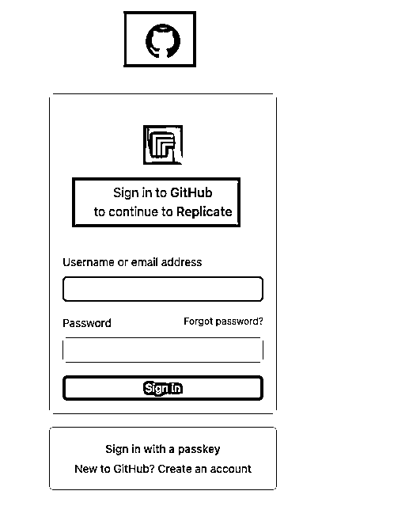
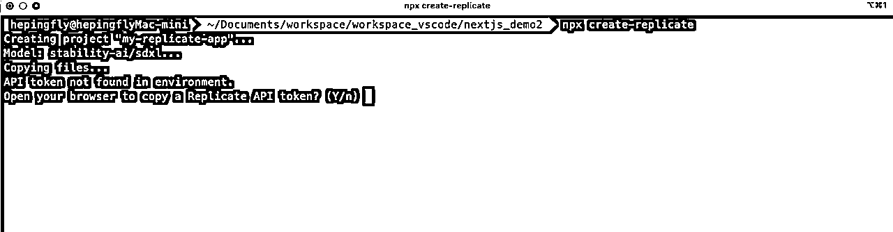
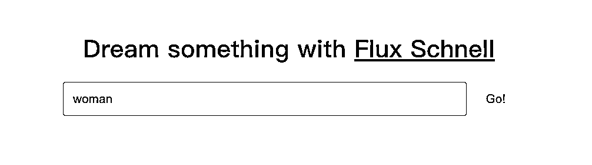
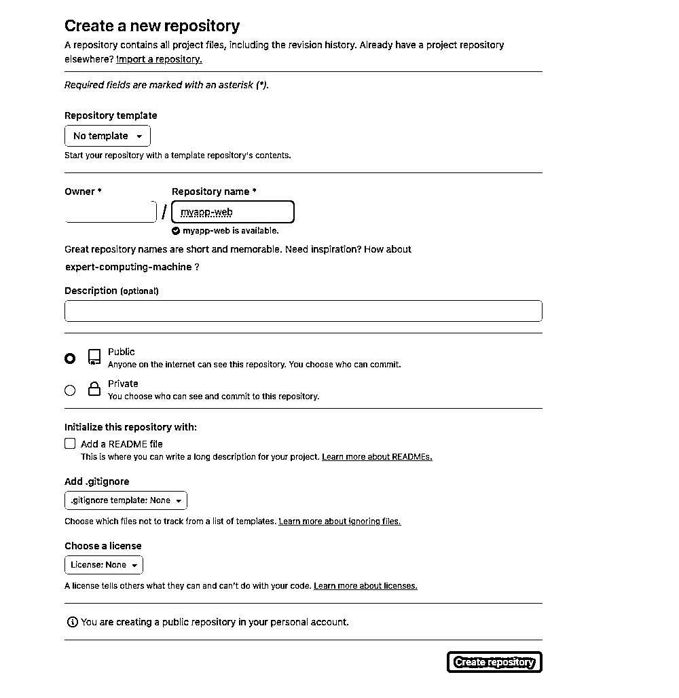

# 怎么样做一个套壳网站（AI 图片站）

> 来源：[https://pk0zg2jkji.feishu.cn/docx/HDKCdrFZ0oqqKXxhmMEcquzDnzg](https://pk0zg2jkji.feishu.cn/docx/HDKCdrFZ0oqqKXxhmMEcquzDnzg)

## 1、replicate 介绍

目前市面上有非常多的 AI 模型，如果你想要去了解和体验这些模型的话，需要自己去把这些模型部署到服务器上才能使用，你要懂技术，还要有硬件设备，对小白来说非常不友好。

Replicate 就可以解决这个问题，它是一个可以运行和微调开源模型，部署定制模型的 AI 平台。

对于普通用户来说，可以在 replicate 上运行各种别人部署好的 AI 模型，包括但不限于生成图像、文本、视频、音乐，有些项目甚至不需要登录就可以免费体验。

同时所有模型都开放了 API 调用接口

地址：

https://replicate.com/

## 2、准备事项

### 2.1 replicate 账号准备

1）因为 replicate 是需要使用 github 登录的，所以你需要一个 github 账号


2）有了 github 账号之后，输入 github 的用户名和密码就能登录了

或者先登录好 github ，然后授权登录 replicate



### 2.2 添加支付方式

点击头像 - Account settings


然后点击 Billing - Manage billing


添加你的信用卡，卡号一栏有支持的银行卡类型，把卡号输进去，就可以正常添加了

我用的是国内银行的 visa 卡，可以正常添加


之所以一开始就要添加支付方式，因为 replicate 里面的模型调用都是需要成本的，添加支付方式以后，才能正常调用，否则会调用失败

如果你担心调用超出额度，可以在 这个页面设置调用限额，后期也可以根据需要进行调整


### 2.3 NodeJS 环境安装

Nodejs 下载地址：

https://nodejs.org/zh-cn/download

下载下来之后，直接就是点击下一步，傻瓜式安装，如果不会随便问下 AI 能完全能搞定

安装完成之后，使用 node -v 命令查看一下版本号，如果正常出现，证明安装成功


## 3、快速见效果（纯后端调用）

### 3.1 一行命令快递搭建程序

create-replicate 它是一个 npm 包，执行这行命令之后，会自动创建一个项目目录，然后写入初始代码

```
npx create-replicate
```

1）我先创建好一个目录，然后进入到这个目录中打开命令行窗口，执行上面的命令


2）获取 API token

这个时候，它会要求你粘贴 Replicate API token

我们敲击回车之后，它会自动帮我们打开浏览器，进入到获取 Replicate API token 的界面



3）创建一个 token

这里随便给 token 取个名字，然后点击 Create token


4）复制 token 粘贴回命令行


5）项目初始化完成


咱们的文件目录下面也多了初始化文件


6）用 vscode 或者 cursor 打开这个项目

直接把最外层文件夹拖进 cursor 里面


其实到这里我们就已经完成了一个最简单的服务端代码，调用图像模型的过程了

如果有点晕的话，下面和平带大家来看一下代码

### 3.2 代码原理讲解


① 我们在用一行代码创建项目的时候，当时让你填写了一个 token ，就是在这里用到的

这里用变量名的方式展示，真实值是写在一个专门配置环境变量的 .env 文件里面


② 定义你要调用哪个图像模型

我们调用的是 replicate 上这个模型

https://replicate.com/stability-ai/sdxl

我们使用的是 nodeJS 调用，在官方给的调用示例上写的具体的模型名称


③ 调用图像模型，需要传入参数包括 prompt

不知道怎么传的话，代码里面和官方保持一致就可以了，这个 input 里面封装的就是传入的参数，prompt 你可以随便修改成你想生成图像的提示词


Replicate 上会有很多模型供你选择，每一个模型官方都提供了调用示例

### 3.3 效果展示

在效果展示前，我们需要对代码做一点处理。因为我们用一行命令生成的初始化代码，它最后的结果只是在控制台把图像生成的结果打印出来了。

我们需要把生成的图像下载到本地，这样我们才能看到效果。所以我们借助 cursor 给它加一点代码，让它把图像下载到本地


然后我们按照 cursor 的提示，安装必要依赖


运行项目，看成果

在 cursor 控制台执行运行命令

```
node index.js 
```


然后再我们当前根目录的 images 文件件下就能看到用 AI 生成的图片了


### 3.4 总结

以上就是纯服务端代码，通过调用 replicate 提供的图像模型 API 直接在我们电脑本地生成图像的方法

很多文生图的网站，背后其实也是这个逻辑，调用某个模型的 API 来生成图片，只不过配置了一个前端页面，让用户在前端页面编写提示词，然后把这个提示词传到后端调用模型 API 生成之后再返回给前端展示给用户

## 4、使用 nextjs 构建一个最简单的文生图网站

上面我们的方式是通过纯后台服务端代码调用 replicate 平台的图像模型，去生成图片

下面我们就搭建一个网站，然后把它部署到 vercel 上，通过 vercel 提供的域名，我们在浏览器访问之后，这个网站可以接受提示词输入，并且调用 replicate 上的图像模型去生成高质量的图片。

### 4.1 前置条件

1）Nodejs 环境

只有安装 nodejs 我们才能把应用程序跑起来，怎么安装前面有提到。

2）replicate 账户

我们会去调用 replicate 上的应用模型，来帮助我们生成图片

3）github 账户

我们开发完成之后，会把源代码托管到 github

4）vercel 账户

我们会把我们的 Web 网站部署在 vercel 上

### 4.2 搭建过程

#### 4.2.1 创建应用程序，初始化项目

我们在本地新建一个文件夹 demo-web ，名称可以随意起

我们在 demo-web 目录下打开命令行，或者你打开命令行然后 cd 命令进入到 demo-web 目录下

执行下面这行初始化项目的命令：

```
npx create-next-app@latest --js --eslint
```


这行命令会去帮我们初始化项目，在这个过程中它会让我们去设置项目名称，或者其他一些选项，嫌麻烦直接使用默认的就可以，一路敲击回车


项目初始化成功


我们在 demo-web 目录下多了一个 my-app 的项目，然后我直接把 my-app 文件夹拖到 cursor 里面去，用 cursor 打开这个项目


#### 4.2.2 本地试运行，确保初始化项目能正常运行

```
cd my-app
npm run dev
```


启动成功之后，我们访问控制台提供的地址，http://localhost:3000 如果出现 nextjs 页面，证明项目可以正常启动成功


#### 4.2.3 新建环境变量文件

因为我们要调用 replicate 的图像模型去生成图像，这个时候就需要 replicate 平台的 API TOKEN 才能调用成功。

所以我们需要把 API TOKEN 配置在环境变量文件中，让项目一启动就能读取到这个 API TOKEN ，从而在调用图像模型生成图片的时候，可以使用这个 API TOKEN

在项目的根目录中，使用下面的命令创建一个环境变量文件

创建了这个文件之后，nextjs 就会自动加载这个文件，然后就可以读取到这个文件里面的配置信息

```
touch .env.local
```

不同的环境变量配置文件可以在不同环境下生效：


文件创建好了以后，我们去把 replicate 平台的 API TOKEN 填写在这里


#### 4.2.4 构建后端服务器代码

现在我们来编写后端服务器代码，在后端服务器代码中我们会去调用 replicate 模型

1）新建项目目录，用来存放业务代码

在 src/app 目录下 创建 api/predictions 目录


2) 新建 route.js 文件，并添加如下代码

这个文件实现的功能主要是，接收 POST 请求，提取用户输入的提示词，然后调用 Replicate API 进行模型图像生成，并且返回生成结果

```
import { NextResponse } from "next/server";
import Replicate from "replicate";

const replicate = new Replicate({
  auth: process.env.REPLICATE_API_TOKEN,
});

// In production and preview deployments (on Vercel), the VERCEL_URL environment variable is set.
// In development (on your local machine), the NGROK_HOST environment variable is set.
const WEBHOOK_HOST = process.env.VERCEL_URL
  ? `https://${process.env.VERCEL_URL}`
  : process.env.NGROK_HOST;

export async function POST(request) {
  if (!process.env.REPLICATE_API_TOKEN) {
    throw new Error(
      'The REPLICATE_API_TOKEN environment variable is not set. See README.md for instructions on how to set it.'
    );
  }

  const { prompt } = await request.json();

  const options = {
    model: 'black-forest-labs/flux-schnell',
    input: { prompt }
  }

  if (WEBHOOK_HOST) {
    options.webhook = `${WEBHOOK_HOST}/api/webhooks`
    options.webhook_events_filter = ["start", "completed"]
  }

  // A prediction is the result you get when you run a model, including the input, output, and other details
  const prediction = await replicate.predictions.create(options);

  if (prediction?.error) {
    return NextResponse.json({ detail: prediction.error }, { status: 500 });
  }

  return NextResponse.json(prediction, { status: 201 });
}
```

3）补充知识：

上面的代码中我们定义了一个 WEBHOOK_HOST，解释一下这个的作用：

Webhook 回调，在使用某些 API（如 Replicate）时，模型的运行可能需要时间，比如生成一张图片可能需要花费几秒钟。在这种情况下，API 可以通过 webhook 向你的应用程序发送状态更新（例如，模型开始运行、完成运行或出现错误）

这里我们就使用 WEBHOOK_HOST 来构建这个 webhook 的 URL，以便 Replicate API 可以将状态更新发送到你的应用。

这是一个三元表达式，在生产环境中，它使用 VERCEL_URL，而在开发环境中，它使用 NGROK_HOST


配置方法：

*   在生产环境中

*   当你将应用部署到 Vercel 时，Vercel 会自动设置 VERCEL_URL 环境变量。你无需手动配置，只需确保你的应用在 Vercel 上运行即可

*   在开发环境中

*   如果你在本地开发并希望接收 webhook，你可以使用 ngrok 工具。ngrok 可以将本地服务器暴露到公共互联网，并提供一个可用于 webhook 的 URL。

*   你启动 ngrok 之后，ngrok 会提供一个公共 URL（如 https://abc123.ngrok.io）。你需要将这个 URL 设置为 NGROK_HOST 环境变量。

如果没有配置 WEBHOOK_HOST 可能会出现下面几种情况

*   无法接收状态更新

*   WEBHOOK_HOST 的主要作用是为 Replicate API 提供一个 URL，以便在模型运行时发送状态更新（如开始、完成或错误）。如果没有配置这个变量，Replicate API 将无法找到有效的 webhook URL，从而无法发送这些更新。

*   模型图片生成请求可能失败

*   在某些情况下，Replicate API 可能会期望 webhook URL 的存在。如果没有提供有效的 URL，可能会导致模型生成图片请求失败，返回错误信息，或者无法正确处理请求。

*   调试困难

*   如果你在开发过程中没有配置 WEBHOOK_HOST，你将无法获得模型运行的实时状态更新，这可能会使调试和开发变得更加困难。你将无法知道模型是否成功运行，或者在运行过程中是否遇到错误。

*   影响功能完整性

*   如果你的应用依赖于 webhook 来执行某些功能（例如，更新用户界面或触发后续操作），那么没有配置 WEBHOOK_HOST 将导致这些功能无法正常工作。

注：

如果你只是为了跑通 MVP 可以先不管这个 WEBHOOK_HOST 因为部署到 Vercel 上时，Vercel 会自动帮你设置

4) 新建 [id] 目录，然后新建 route.js 文件，并添加如下代码


[id] 目录下新建 route.js 文件，并且添加如下代码

注意目录结构中的 [id] 。它是 Next.js 中动态路由功能

这个文件实现的功能主要是，通过 Replicate API 获取特定图片模型生成的结果

```
import { NextResponse } from "next/server";
import Replicate from "replicate";

const replicate = new Replicate({
  auth: process.env.REPLICATE_API_TOKEN,
});

export async function GET(request, context) {
  const { id } = await context.params;
  const prediction = await replicate.predictions.get(id);

  if (prediction?.error) {
    return NextResponse.json({ detail: prediction.error }, { status: 500 });
  }

  return NextResponse.json(prediction);
}
```

在第2）和第 4）中，我们分别建了一个文件，这两个文件共同实现了一个完整的图像模型生成的 API：

*   第一个文件 POST 请求用于创建新的图像生成，接收用户输入并返回预测结果。

*   第二个文件 GET 请求用于根据图像生成 ID 获取已创建的图像生成结果，支持错误处理。

通过这两个接口，用户可以方便地提交图像生成请求并查询图像生成结果。

#### 4.2.5 构建前端页面代码

在上面一步中，我们完成了与 Replicate 图像生成通信的服务器端代码编写，现在我们在前端页面创建一个表单，当用户输入提示词并且提交表单时，前端会把数据发送到我们在上一步中写好的服务器端代码，然后服务器端代码调用 replicate 图像模型给我们生成图像

1）编写 page.js 文件

我们项目目录下，有一个 page.js 文件，这个文件在项目刚初始化的时候，就被自动创建了，他默认渲染的是“欢迎来到 Next.js” 页面


现在我们把 page.js 里面的代码全部删掉，然后粘贴如下代码

这个 js 文件会帮我渲染一个前端页面

*   显示一个标题和一个输入框，用户可以在输入框输入提示词。

*   提交按钮用于触发图像生成。

*   如果有错误，显示错误信息。

*   如果有图像生成结果，显示生成的图像和当前状态。

```
'use client';

import { useState } from "react";
import Image from "next/image";

const sleep = (ms) => new Promise((r) => setTimeout(r, ms));

export default function Home() {
  const [prediction, setPrediction] = useState(null);
  const [error, setError] = useState(null);

  const handleSubmit = async (e) => {
    e.preventDefault();
    const response = await fetch("/api/predictions", {
      method: "POST",
      headers: {
        "Content-Type": "application/json",
      },
      body: JSON.stringify({
        prompt: e.target.prompt.value,
      }),
    });
    let prediction = await response.json();
    if (response.status !== 201) {
      setError(prediction.detail);
      return;
    }
    setPrediction(prediction);

    while (
      prediction.status !== "succeeded" &&
      prediction.status !== "failed"
    ) {
      await sleep(1000);
      const response = await fetch("/api/predictions/" + prediction.id);
      prediction = await response.json();
      if (response.status !== 200) {
        setError(prediction.detail);
        return;
      }
      console.log({ prediction: prediction });
      setPrediction(prediction);
    }
  };

  return (

# 
        Dream something with{" "}
        [Flux Schnell](https://replicate.com/black-forest-labs/flux-schnell?utm_source=project&utm_project=getting-started) 

      {error && {error}}

      {prediction && (
        <>
          {prediction.output && (

              

          )}

status: {prediction.status}

        >
      )}

  );
}
```

总的来说，这个文件实现了一个简单的用户界面，允许用户在浏览器页面输入文本提示词，然后这个前端页面会把请求发送到后台服务器代码，然后调用 replicate 图像模型生成图像

#### 4.2.6 添加基本的样式

我们把项目初始化时生成的 globals.css 里面的样式全部删掉


然后粘贴我们的基本样式：

这一步就是给前端页面添加一点基本的样式

```
@tailwind base;
@tailwind components;
@tailwind utilities;

.container {
  padding: 2rem;
  font-size: 1.3rem;
  max-width: 48rem;
  margin: 0 auto;
}

form {
  display: flex;
  margin-bottom: 2rem;
}

form input {
  width: 100%;
  padding: 1rem;
  border: 1px solid #000;
  border-radius: 0.25rem;
  font-size: 1.3rem;
  margin-right: 1rem;
}

form button {
  padding: 1rem;
  border: none;
  border-radius: 0.25rem;
  box-sizing: border-box;
  cursor: pointer;
  font-size: 1.3rem;
}

.imageWrapper {
  width: 100%;
  aspect-ratio: 1 / 1;
  position: relative;
}
```

#### 4.2.7 配置图片 host

因为我们在自己项目里面调用的是 replicate 图像模型 API ，我们不确定这个第三方 API 是否存在风险。配置图片 host 可以做到一下两点

*   安全防御：防止攻击者通过图片 URL 注入恶意内容（比如加载钓鱼网站图片或窃取用户数据）

*   资源控制：避免应用随意加载未经审核的外部图片资源

在 next.config.mjs 文件 中添加如下代码

```
const nextConfig = {
  reactStrictMode: true,
  images: {
    remotePatterns: [
      {
        protocol: "https",
        hostname: "replicate.com",
      },
      {
        protocol: "https",
        hostname: "replicate.delivery",
      },
    ],
  },
};

export default nextConfig;
```


配置内容解析：

```
// next.config.js
const nextConfig = {
  reactStrictMode: true, // 与图片配置无关，是 React 严格模式开关
  images: {
    remotePatterns: [ // 远程图片规则配置
      {
        protocol: "https",  // 强制使用 HTTPS 协议
        hostname: "replicate.com", // 允许的域名1
      },
      {
        protocol: "https",
        hostname: "replicate.delivery", // 允许的域名2
      },
    ],
  },
};
```

#### 4.2.8 启动项目，测试图片生成功能

1）启动项目

在 cursor 控制台输入 npm run dev 启动项目


成功启动之后，访问 http://localhost:3000 就可以看到我们的页面了


输入框输入提示词，输入完成之后点击 Go 生成图片。Flux Schnell 是一个超链接，链接到的是我们调用的图像生成模型

2）报错解决

我们提示词输入一个 woman 然后点击 Go ，结果页面报错了




这个时候我们直接回 cursor 看控制台，选中错误信息，把错误交给 cursor 解决即可

我们按照 cursor 提示，安装 replicate 包，然后重启项目


重新打开页面，http://localhost:3000 输入提示词 woman ，发现已经能够正常生成了


到这里我们已经完成了一个前端页面搭建，用户可以编写提示词，然后提交之后由后端服务器调用 replicate API 生成图像的整个过程。

### 4.3 本地代码提交 github

目前我们开发的代码都在本地，因为我们最终想把这个网站部署到 vercel 上，所以我们需要把本地的代码提交到 github 进行托管

1）github 上新建一个仓库

直接建一个空仓库就行



2）关联本地仓库与 github 远程仓库

```
git remote add origin 你的GitHub仓库地址.git
```

仓库地址在这里：


3）提交本地代码并且推送远程仓库

```
# 添加所有文件到暂存区（或指定文件）
git add .

# 提交更改到本地仓库
git commit -m "Initial commit"

# 推送到 GitHub（首次推送需设置上游分支）
git push -u origin main
```

上面命令执行完之后，github 远程仓库就会出现我们本地代码了


### 4.4 网站部署到 vercel

1）登录 vercel 之后，选择 Add New Project


2) 从 github 仓库导入你要部署的项目


3）deploy 发布，等待部署完成


4）部署成功页面


5）打开域名验证

部署成功之后，vercel 会给你分配一个临时域名，我们打开测试一下

输入提示词 woman 然后点击 Go 生成


我们发现没有任何反应，接下来我们去看调用日志排查问题

6）看运行日志，排查问题


进入之后，如果没有看到报错


把右下角的这个勾去掉，然后再看


通过上面的错误日志，我们知道是因为部署到 vercel 没有配置 replicate 平台的 API token ，所以没办法调用平台的图像模型去生成图像

现在我们去把 API TOKEN 配置到 vercel 线上环境

7）解决报错问题


我们之前在本地使用的 token 同样要配置到 vercel 才能生效，你可以去本地的环境变量文件，获取这个值，或者你也可以去 replicate 平台去获取 api token


重新发布，让配置的 API Token 生效


重新进入网站，测试功能已经完全正常


### 4.5 总结

到这里我们已经完成了整个套壳网站的全流程，在页面提供一个输入框给用户输入提示词，然后把这个提示词交给后端代码去调用 replicate 平台图像模型 API 生成图片，最后再回显到页面上

接下来可以把 vercel 上的域名，绑定成自己的域名，3月航海手册有非常详细的教程

## 5、补充信息

### Ngrok 介绍

ngrok 是一个内网穿透工具，主要用于将本地服务器（运行在你电脑上的服务）暴露到公网，生成一个临时的公共 URL，方便外部网络访问你的本地服务。它解决了开发测试过程中需要临时公开本地服务的需求，无需部署到线上服务器，特别适合开发调试、演示和临时共享场景。

核心功能

*   反向代理

*   在本地运行 ngrok 后，它会创建一个安全的隧道​，将公网请求转发到你的本地指定端口（如 localhost:3000）。外部用户通过 ngrok 提供的 URL（如 https://abc123.ngrok.io）即可访问你的本地服务。

*   支持多种协议

*   支持 HTTP/HTTPS、TCP、TLS 等多种协议，可转发 Web 服务、数据库、SSH 等。

*   安全特性

*   默认使用 HTTPS 加密。

*   可设置身份验证（如密码或 OAuth）。

*   支持限制访问 IP 或域名。

典型使用场景

*   开发测试​：快速测试 Webhook（如支付回调、API 通知），无需部署到线上。

*   演示分享​：临时将本地的项目演示给客户或同事。

*   调试移动端​：在手机端访问本地后端 API 或网站。

*   穿透防火墙​：访问内网的数据库、NAS 等设备。

如何使用？

1）先下载安装

官网下载地址：

https://ngrok.com/downloads/mac-os?tab=download


压缩包下载下来之后，直接解压，然后把解压后的文件，放到 /usr/local/bin 目录下


2）配置和运行

先去官网注册一个账户

https://dashboard.ngrok.com/login

添加认证令牌

```
ngrok config add-authtoken <你的令牌>
```

注册完账号之后，去这里获取令牌


命令行执行，这一步会将你的 ngrok 账户与本地客户端绑定

执行完之后，它会把你的令牌保存在本地的一个文件里面


3）启动服务

```
ngrok http 80
```


*   将本地 80 端口 的服务（如本地网站）暴露到公网，生成一个临时 URL（如 https://abc.ngrok.app）。

*   访问此 URL 即可从外网连接到你的本地服务。