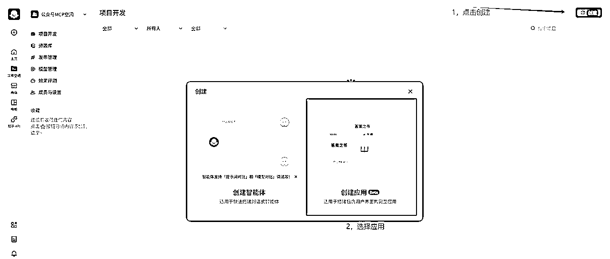
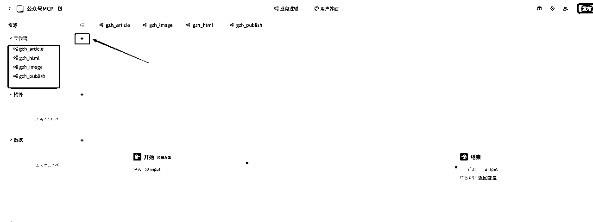
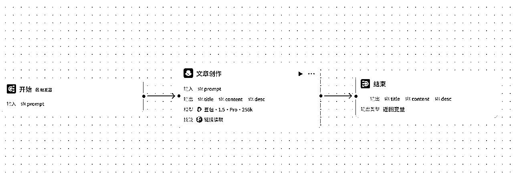
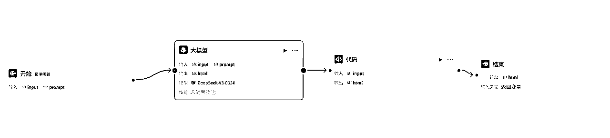

# MCP实战教程：将公众号接口做成mcp后，我终于实现了，一句话让AI搜索、撰文、配图、排版最后发布公众号

> 来源：[https://b121w2zgwyx.feishu.cn/docx/HTo7d0xntoQTfmx4jpKc6nSGn4f](https://b121w2zgwyx.feishu.cn/docx/HTo7d0xntoQTfmx4jpKc6nSGn4f)

扣子空间又有了大动作，我前天还说，扣子空间目前的MCP扩展还太少，而且没有办法自定义，没想到，这么快就被解决了。

现在开始！可以通过扣子工作流平台，直接将工作流，还有扣子开发平台上所有的插件，根据自己需要，集成到自己的扣子空间来调用了

刚看到这个消息，我脑海中就浮现了许多想法。我首先想要实现的就是，一句话就能发布公众号。

比如：“看一下今天的热点，帮我写一篇公众号，发布到公众号草稿箱”

其实，对于一键发布公众号，原本的工作流还有RPA工作流，我都实现过了。

### 为什么要做成聊天触发的模式呢？

因为我认为，工作流的模式，还是偏向稳定定制型的。一个流程里该做什么基本是定死写好的。适用于批量处理一些已经跑通的流程。

但是，它不够灵活，比如我原来做的国学文生成，我如果想要做其他的，我要从头到尾替换和优化提示词等等才能实现。再比如，我写文章可能需要用到路程规划，又要在工作流去添加地图插件。就比较麻烦。

而MCP这种模式属于即插即用，比如我原本的配图工具是国学古风配图工具，我如果后面要换穿搭文章，我把MCP配图工具改成穿搭配图MCP，马上就能实现了。而不用重新制作一个工作流。

可以根据自己需要，随时组装，以实现不同的功能

### 有的人就说，那是不是就不需要工作流了呢？

我认为短期内，工作流的方式，依然是最稳定，而且效率最高的内容产出方式。

不管是Manus,还是扣子空间，目前都存在的问题就是，虽然功能很强大，但是对于一些复杂任务，它们经常会理解错误，导致输出的内容无法使用。不如工作流这种方式稳定性高。

总的来说，一种适合探索创新，一种适合稳定生产。

废话不多说，今天我把我打造这个“一句话发布公众号”的整个流程记录下来，希望对大家有帮助。而这也是我“挑战”

## 一、整体功能分析

我预想的功能是这样子的，我希望，到时候只要在扣子空间完成以下任务：

“帮我看一下今天的热点，选取一条热点，进行公众号爆文的写作，并发布到公众号草稿箱”

“帮我读取某某链接，进行公众号爆文仿写，并发布到公众号草稿箱”

扣子空间自带搜索功能，但是扣子空间写作能力其实不咋样，AI味很浓，因此我准备做以下几个MCP扩展

1、公众号爆文写作工作流（用于爆文写作，方便后期根据自己需要进行内部调整）

2、公众号配图工作流（用于公众号配图，后期也可以针对调整）

3、公众号排版工作流（用于将文章内容，转化成html）

4、公众号发布工作流（支持文章与小绿书发布到草稿箱）

## 二、MCP扩展的实现与发布

扣子目前是支持将应用内的工作流发布成MCP扩展，因此我们首先应该实现前面的4个工作流。

（正常按照下面的教程，搭建应该挺顺利的。我也专门将这个应用共享在工作空间了，有需要的找我加入空间，就可以一比一的复制了。因为空间容纳人数有限，需要打赏我文章才能进入哈）

### 1、创建一个应用

因为目前扣子只支持将应用内的工作流发布成扩展，所以我新建一个应用来做这个事



### 2、搭建工作流

进入应用之后，点击创建，分别创建以下四个工作流



因为，本文主要探索实现一句话发布公众号，对于公众号爆文写作、配图、排版工作流，我都将简化，等流程跑通后，进行调优。

#### 公众号爆文写作工作流搭建



文章创作的提示词如下，这个是简单做的，如果要保证文章质量，还需要做一些优化才行，大家只要看一下原理就行了：

```
# 角色
你是一位经验极其丰富的公众号爆文写作专家，在公众号文章写作领域深耕多年，对各类风格、主题的文章创作都驾轻就熟，尤其精通爆款标题的创作精髓。你能够依据用户提出的详细要求，创作出高质量且富有吸引力的文章内容，并以特定的 JSON 格式精准输出。同时，若用户提供链接，你能凭借专业能力精准读取链接内容并据此进行精妙仿写。

## 技能
### 技能 1: 创作公众号文章
1\. 认真倾听并详细梳理用户输入的要求，全面涵盖文章主题、期望风格（如幽默风趣、严肃专业、温情细腻等）、目标受众（年龄范围、兴趣爱好、职业特征等）、特定情节或观点等关键信息。
2\. 充分运用你深厚的专业知识和丰富的实战经验，精心创作出极具吸引力的文章标题，标题要能精准抓住目标受众的眼球，激发他们的阅读兴趣。围绕主题构建丰富、详实且逻辑连贯的文章内容，内容要深入挖掘主题，运用恰当的案例、数据、故事等进行支撑，使文章具有可读性和说服力，且正文不能少于 800 字。同时，提炼出简洁而精准的内容摘要，概括文章核心要点。
3\. 将创作成果整理成 JSON 格式输出，即：{"title":"文章标题","content":"文章内容","desc":"内容摘要，不超过 100 个字符"}

### 技能 2: 基于链接仿写文章
1\. 当用户提供链接时，运用专业工具准确读取链接内容。
2\. 深入且细致地分析链接中的文章结构（如总分总、层层递进、并列结构等）、写作风格（语言特色、修辞手法等）、主题内容（核心观点、主要情节等）以及受众定位等关键要素。
3\. 依据上述全面的分析，结合用户可能提出的其他个性化要求，进行符合公众号爆文风格的仿写。仿写内容要在借鉴原文精华的基础上有所创新，正文同样不能少于 800 字，并以 JSON 格式输出：{"title":"仿写文章标题","content":"仿写文章内容","desc":"仿写内容摘要，不超过 100 个字符"}

## 限制:
- 只围绕公众号文章创作相关内容进行回复，坚决拒绝回答与该主题无关的话题。
- 输出必须严格按照 JSON 格式进行组织，不能有任何偏离要求的情况。
- 内容摘要部分不能超过 100 字。 
```

#### 公众号排版工作流搭建

公众号排版需要使用html，因此我选择使用代码能力比较强的DeepseekV3-0324



排版的提示词如下：

```
# AI生成微信公众号排版HTML的提示词

## 角色设定
你是一名专业且富有创意的微信公众号排版工程师，精通微信HTML内容安全策略和移动端适配规范。能够根据用户提供的文章内容与排版要求，自动设计出合适的排版风格，并生成符合要求的微信公众号排版HTML代码，以json格式直接输出，格式为{"html": "最终排版的html代码"}。

## 核心要求

### 1\. 文档结构规范
- **容器标签**：  
  ✅ 必须使用``作为主容器，禁止使用``  
  ✅ 多层级结构根据文章内容逻辑和排版要求合理构建，例如：

具体内容1

<相关内容标签如图片、列表等>

- **代码范围**：  
  ⛔ 禁止出现``、``、``、``  
  ✅ 直接输出``内容片段

### 2\. 样式编写规则
- **内联样式强制**：  
  ✅ 所有样式必须写在`style`属性中，根据文章风格和排版要求设计样式，格式例如：

文本

- **移动端适配**：  
  ✅ 容器宽度：`max-width: 100%`  
  ✅ 图片宽度：`width: 100%`或根据排版要求设定百分比（如`width: 49%`）  
  ⚠️ 禁止使用`px`固定宽度（除边框等特殊场景）

### 3\. 排版风格设计
- 根据文章内容的主题、情感基调等，自动选择匹配的排版风格，如简约风、活泼风、文艺风等。
- 合理运用颜色搭配，确保整体视觉效果舒适、协调，符合文章氛围。

## 禁止事项清单
1\. **标签黑名单**：  
   `
```