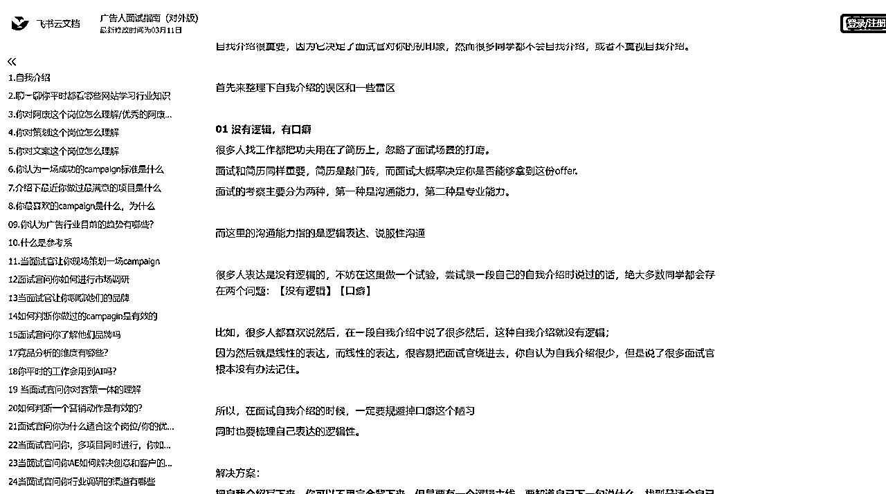
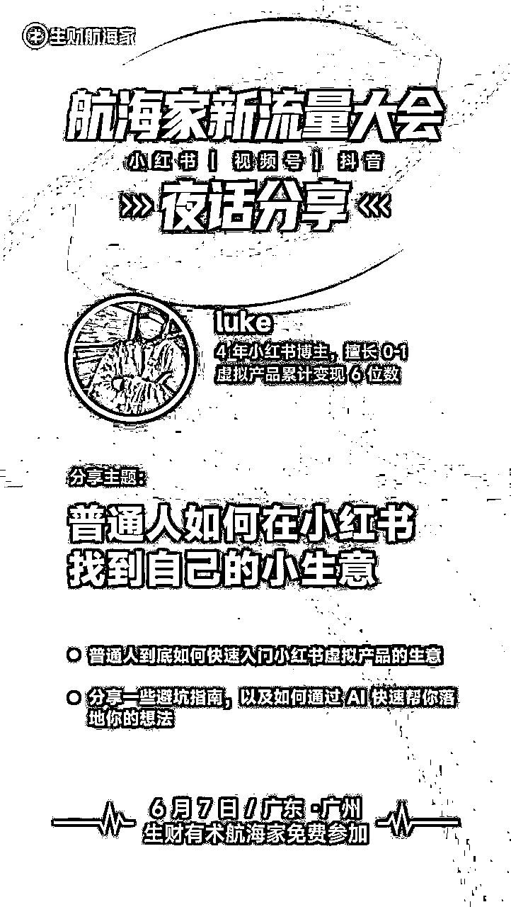

# 普通人如何在小红书构建你的小生意

> 来源：[https://g8ekpu7h0l.feishu.cn/docx/HZWQdO4sdoew5ExQoybcgJY7nyf](https://g8ekpu7h0l.feishu.cn/docx/HZWQdO4sdoew5ExQoybcgJY7nyf)

大家好，我是luke

今天想跟大家分享一下，普通人到底如何在小红书构建你的小生意

## 小红书是实现你目的的手段

小红书并不是目的，你目的不是做一个小红书，小红书只是你完成商业目标的手段

这个思维如果没有转变，可能会要走很多弯路

你会陷入一种对流量的迷思，一篇笔记爆了，也不知道这篇笔记到底有什么用

追求的是假象，和一堆没用的小眼睛

偶尔可能有几个商单，对你努力进行“褒奖”

但是，这种策略性价比太低了。

而当你把小红书看作手段，一切都很明朗了

我举个例子，比如现在你是一名AI产品独立开发者，小红书就是你的市场部，你需要的就是在小红书制造流行

假如你是一名商家，你就需要在小红书找到你的受众，把东西卖给他们

假如你是一名职场老炮，你也可以在小红书打造你的副业，去售卖你的虚拟产品。

这个视角下，你的一切动作，都有了目的性，创作方向也有了主线，不仅可以聚焦，提高性价比，同时还可以避免过多的心理内耗。

有很多人粉丝不多，但是他们的商业化能力很强，就是因为他们看的很清楚，比如有的博主专注于婚礼请帖的DIY设计，有的博主会专注于在小红书获客，为他们的店铺引流。

有的人手工特别好，在小红书做高级私人定制。

有的人疯狂追星，做起了明星周边的生意...

发现了吗？

小红书是消费者的决策圣殿，他们在小红书做决策，而你只需要在某个领域，证明你专业就可以了。

小红书是你实现目的的手段（再强调一遍）

## 虚拟产品生意的优势有哪些？

再来聊聊小红书虚拟产品的生意

对于打工人来讲，虚拟产品就是你的生产资料

在传统职场的叙事框架下，打工人是没有生产资料的，你的生产资料就是你的时间

但是虚拟产品是可以让你拥有自己的生产资料，它的价值是帮助你实现身份的转变，你不再是受雇者，而是创造者，价值的创造者。

同时，虚拟产品也是你的“赛博养老金”

理论上讲，假如你的虚拟产品满足消费者的需求，只要小红书不倒闭，这个东西就可以一直卖，而且得到的都是利润。

另外，虚拟产品最大的优势在于，它可以让你和受众构建“金钱关系”

可能你的第一款产品售价不是很高，但是你获得了信任，你和消费者构建了金钱关系，消费者对你的产品或者交付很满意，当你以后再要去销售其他产品的时候，这位顾客也有可能去下单。

你做的不是一次性生意，而是客户的终身价值，你做的是人群生意。

那么，普通人如何快速构建你的虚拟产品呢？

只需要搞清楚，你是谁，你与其他人有哪些差异化优势，你在哪个方面有表达欲，你是否可以系统化你的认知

结合到一起，再去小红书看看消费者的需求，差不多就可以开发出你自己的原创虚拟产品了。

你还要注意一点，虚拟产品并不一定只有一个，万物皆可虚拟产品，模板/指南/表格/话术，一切你想到的，想不到的，都可以成为虚拟产品。

## 我是怎么把想法快速落地，并赚到钱的？（一次自我复盘）

我还有一个身份，就是职场博主，对于职场这个赛道，其实有很多虚拟产品可以挖掘的

在3月的求职季，有一个需求很刚需，就是找工作，那么找工作这个场景下，其实是有很多虚拟产品可以挖掘的

比如简历模板、作品集模板，还有一个很刚性的需求，面试。

于是我快速构建了一个面试题库的虚拟产品，这个面试题库，我整理了找工作过程中可能会遇到的一些问题

那么，可能很多有人会问，你的面试题怎么来呢？你的答案怎么来呢？

答案很简单，小红书上就有很多面试题，关于答案部分，一部分是我自己产出，另一部分是我通过AI辅助产出

除此之外，假如消费者有面试题库需求，那么他们也有一个需求，就是面试辅导。

通过面试题库这个虚拟产品制造一个缺口，再通过面试辅导完成高客单变现。

题库还有一个优势，它是一个永恒的刚需，当你创造完这个产品后，其实你只需要去写笔记就可以了，它可以源源不断帮你创造收入。

可能还会有人问，我们都可以在小红书搜到这些面试题，为什么还要去做一个【已经存在的产品】呢？

我认为关键是：系统化

系统化是关键，你是否能够系统化去呈现一个核心问题的解决方案，做到最全，最系统，这就是需要你构建的优势。

那么系统化的关键是什么呢？我认为是做深做全。

比如，你要做面试题库，你就需要做某一个行业里最全，最系统的。

举个例子，假如你要做运营行业，你不仅需要把热门的面试题准备起来，最好还要有一些行业真题，并且针对应届生、1-3年工作经验，3年以上工作经验的运营题目都整合到一起。

让消费者看到你这个产品的时候，就知道这是他想要的，而不是选择其他家。

这就是把运营行业既做深，又做全。

虽然，小红书确实可以搜到很多面试题，但是并没有系统的呈现，消费者需要的是一个系统化、体系化的内容，而你只需要把这些东西和内容整理出来就可以。

这就是我的题库，一个很简单的呈现形式，我只是定期更新我的内容，2月和3月大概卖出去了300单左右。

另外，我分享给大家一个思路，假如你做人群生意，最好是要加上客户的微信，因为人群生意的本质是你可以卖他们任何东西。

比如，我做职场领域，我可以卖他们简历模板、写作方法论、作品集模板、简历修改 作品集指导，求职陪跑，面试辅导等等

这些都可以成为虚拟产品或者服务，引到私域成交。

我再强调一遍，你要做高客单，做消费者的终身客户价值（CLV）

这份面试题库，我不仅上架到小红书店铺，而且还在我的朋友圈进行了宣发，因为我加了很多之前买过我虚拟产品的顾客。

所以，当我在朋友圈发这个产品的时候，就已经有人私信我去购买。

另外，怎么快速引导成交呢？

这就需要设置一个老客优惠政策，这也是很常见的玩法，比如你的小红书店铺售价是59.9，那么你给老客户的优惠可以是29.9、39.9等等。

否则，人家为什么要下单....

换个角度，虚拟产品其实是你的信任工具，你通过销售虚拟产品获得客户的联系方式，导流到私域，当你有新的虚拟产品的时候，就可以再次卖给他们。

这里可以引出凯文凯利的1000个铁杆粉丝理论，虚拟产品是你找到1000个铁杆粉丝的敲门砖，这里的1000个铁杆粉丝，是能够持续性给你付费的人。

为什么他们会为你付费？又回到了之前提到的逻辑，你的虚拟产品很有价值，获得了他们的信任，下次你推出新产品的时候他们就会继续下单。

想象一下，当你拥有了这1000个铁杆粉丝，假如每个人每月给你贡献19.9元，那你还有19900元的固定性收入。

这是长期主义视角，而不是你只做一次性生意。

不要把虚拟产品只局限在小红书这个渠道，用系统的视角来看，你的销售渠道不仅有小红书，还有朋友圈，各个社群，公众号等等。

先说这么多，6月7号我会在航海家新流量大会的夜话分享，与大家见面

一起来聊聊，普通人如何快速在小红书构建自己的小生意，以及如何用AI更好地构建虚拟产品，赋能你的小生意。

