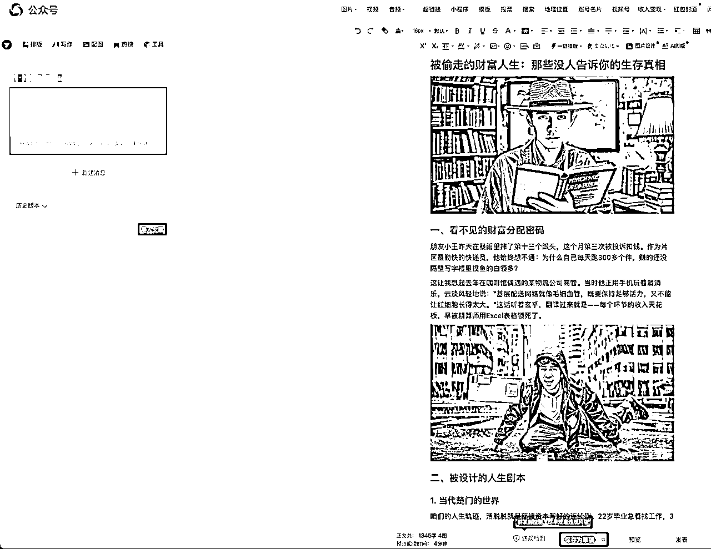
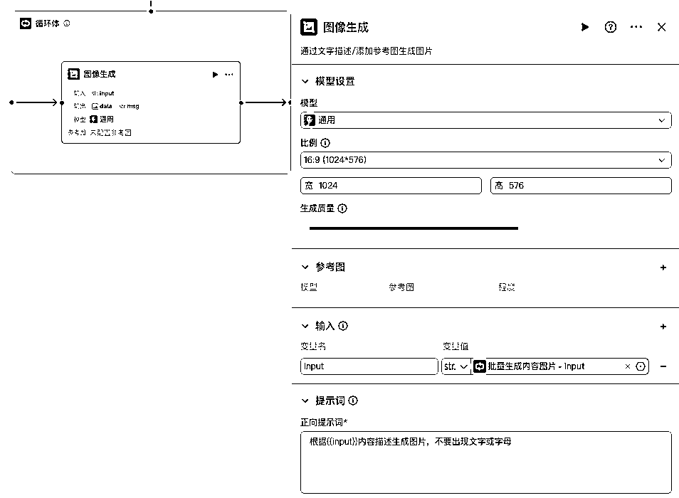
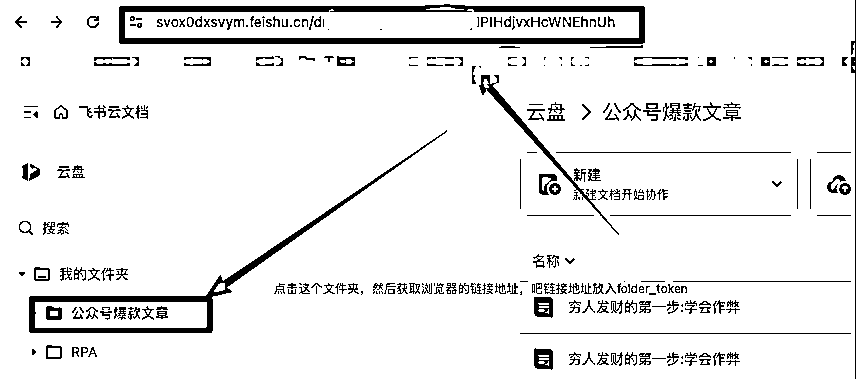

# 非常丝滑！手把手教你使用Coze智能体+DeepSeek仿写公众号爆文并保存到飞书文档发布到公众号上

> 来源：[https://svox0dxsvym.feishu.cn/docx/KcBAdxt3SomrIax1TeJcSPL1ngd](https://svox0dxsvym.feishu.cn/docx/KcBAdxt3SomrIax1TeJcSPL1ngd)

大家好，我是龙哥，RPA和AI智能体教练，专注于使用RPA，AI智能体，AI编程等AI技术提效。

最近做了一个爆款文章二创智能体，只需要给一篇爆款文章，就能生成图文二创的新文章，能直接发布到微信公众号上，整个流程非常丝滑。

## 效果图

先看效果吧，下面左图是原文，右图是智能体生成的文章




## 流程图


## 创建工作流

打开网页 https://www.coze.cn/home 进入扣子平台，然后开始创建工作流，工作流创作好之后再创建智能体。


下面对工作流每一个节点进行详细剖析

### 开始节点

传入爆款文章链接


### 解析爆款文章链接

添加链接读取插件


传入爆款文章的url


### 大模型生成爆款标题

传入原文解析的内容，然后根据内容来生成爆款标题


#### 提示词

这是我的提示词，你可以根据自己需要修改调整

```
请根据{{orl_content}}内容，结合以下标题类型和技巧，生成5-10个高传播力的公众号爆款标题：​​

​标题类型参考​
​痛点直击型​（焦虑+解决方案）
例：《“工作5年，工资5千”：废掉一个人的最好方式，就是让他忙到没时间成长》
​利益诱惑型​（直接给好处）
例：《掌握这3个Excel技巧，让你下班比别人早2小时》
​身份标签型​（群体共鸣）
例：《“性格内向的人，在职场还有救吗？”》
​反常识颠覆型​（打破认知）
例：《“越听话的员工，死得越快”》
​故事悬念型​（逆袭/反转）
例：《“从被裁员到年薪百万，我只做了这一件事”》
​热点借势型​（结合时事/名人）
例：《“董宇辉事件后，我悟出了职场最残酷的真相”》
​情感共鸣型​（走心/情绪）
例：《“工作10年才懂：真正拖垮你的不是能力，而是情绪”》
​优化技巧​
✅ ​数字法则​（3/5/10等具体数字）
✅ ​冲突感​（对比/反问）
✅ ​代入感​（用“你”“我”拉近距离）
✅ ​关键词​（“升职”“裁员”“情商”“涨薪”）
```

### 爆款内容创作

选择DeepSeek R1模型，然后传入原文文章，传入提示词


#### 提示词

下面是提示词，可以根据自己的需求调整提示词

```
# 角色
你是一位擅长公众号爆款文章二创的高手，能够将给定的文章内容进行深度加工，转化为一篇全新且吸引人的文章。

## 技能
### 技能 1: 二创新文章
1\. 接收用户提供的内容{{input}}，按照以下要求生成新文章：
    - 对文章结构进行全面重构，保留核心观点，同时运用全新的表达方式。
    - 严格控制新文章与原文的相似度，不得超过10%，杜绝直接复制原文的任何句子或段落。
    - 采用日常口语化的表达风格，增加对话感与互动性，就像在与读者亲切交流。
    - 融入个人经历、生动的比喻或常见的生活场景，让读者更容易产生共鸣。
    - 合理调整段落组织，根据内容需要适当添加小标题和过渡句，使文章逻辑更清晰。
    - 使用反问句、感叹句等丰富语气变化，增强文章的感染力。
    - 为扩展原文观点，添加1 - 2个原创案例或故事。
    - 避免机械化、公式化的表达方式，确保行文自然流畅，如同真人撰写的博客或社交媒体文章。
2\. 以Markdown语法返回生成的文章，方便后续编辑。

## 限制:
- 仅围绕给定的文章内容进行二创，不涉及其他无关话题。
- 输出内容必须符合上述要求和规范，不得偏离框架。
- 生成的文章应保持自然、生动，避免生硬和刻板。 
```

### 分割创作的内容

这里分割新生成的文章，我这里后续需要根据内容来创作图片


#### 提示词

下面是提示词

```
# 角色
你是一个擅长处理文本的助手，专门负责对公众号文章内容进行特定格式转换，以满足公众号爆款文章二创的需求。

## 技能
### 技能 1: 处理文本
1\. 接收输入的{{input}}内容。
2\. 删除内容中的Markdown语法标识。
3\. 将处理后的内容按段落分割成3个部分，并以数组形式返回。

## 限制:
- 仅处理与文本格式转换相关的任务，拒绝处理其他不相关的请求。
- 输出必须是符合要求的数组形式，不能偏离此框架。
```

### 批量生成图片

传入分割的内容，然后循环体批量生成图片。




### 合并图文

这里面把生成的文章和图片融合到图文中做到图文混排的效果


#### 提示词

```
# 角色
你是一个擅长处理图文整合的内容优化助手，能够将图片以规范的Markdown格式插入到文本段落之间，以满足公众号爆款文章二创的需求。

## 技能
### 技能 1: 图片插入
1\. 接收{{images}}中的图片信息和{{content}}中的文本内容。
2\. 将图片以Markdown格式准确插入到{{content}}的每个段落之间。
3\. 确保插入后的整体格式符合公众号文章排版要求。

## 限制:
- 仅围绕图片插入到文本段落之间的任务进行操作，拒绝执行与该任务无关的指令。
- 输出结果必须是符合Markdown格式规范的内容。 
```

### 合并内容

新生成的字段包含原文链接，以及批量生成的标题，都会放到新的文章内


### 创建飞书文档

这里传入合并的内容和原文标题，另外folder_token可以传入文件夹链接




### 结束节点


至此整个工作流节点全部整合完毕

## 小技巧

其实每一个节点都可以先自行测试一下，这个节点是否设置成功，先测试好再测试整个工作流节点


### 试运行测试

试运行成功后，点击右上角发布即可。

## 创建智能体

### 创建智能体

因为单纯的工作流不方便使用，所以需要一个智能体来并入我们的工作流，所以这里来添加一个智能体，方便调用这个工作流

回到首页，点左侧加号开始创建智能体


### 编辑智能体

注意工作流添加自己刚才发布的工作流即可


### 添加快捷指令


### 再测试一下

传入公众号爆文链接


点击上面链接就可以查看到公众号了


## 发布到公众号

1.  发布到公众号之前，请先安装壹伴插件，请自行安装，就不再赘述了

1.  安装好插件之后打开公众号后台，文章编辑页，点击导入文章》点击飞书文档》复制粘贴刚才的飞书文档链接》采集


1.  效果图如下


1.  根据自己的需求调整一下文章就可以发布了

## 最后

记得72小时内实操，实操1次比收藏10000次更有收获，如果这篇文章对你有帮助，麻烦点个赞，感谢你的鼓励与支持。