# “转化大于流量”一套全员销冠的SOP搭建流程（90%私域行业适用）把销冠的价值留在公司

> 来源：[https://kkehvdiodf.feishu.cn/docx/IYbtdXEiHovCP7x9w8Hc9jEhnGd](https://kkehvdiodf.feishu.cn/docx/IYbtdXEiHovCP7x9w8Hc9jEhnGd)

# 做个自我介绍

大家好，我是天堂地狱，生财编号677，生财航海家，聚光航海教练。

加入生财8年，可以说我个人的写作能力全是在生财锻炼的，真心感受到，越分享，越骄傲。

作为生财航海家，我可以自豪的说：“我是龙珠航海家，一直都是！”

感谢生财有术和亦仁以及生财的小伙伴提供的平台。

# 前言

这个月，借用了一次微咨询的机会，咨询了下亦仁：

在各平台流量都趋向于流量本身价值的当下，在流量获取越来越卷，各个赛道红利期逐步消退的时候。

*   SOP化销转团队搭建和完善，对中小B端（年营收千万以下）做私域的老板是否是很重要的需求？

*   在销售团队搭建上，标准化，流程化，乃至后续的自动化，是不是未来私域团队的基础模型？

*   这些需求是不是伪需求？值不值去花大精力去打磨成一套完整的系统方法论，甚至是课程？

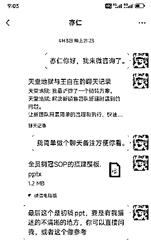

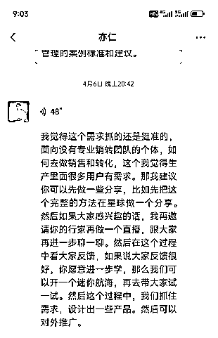

这里我先做一个分享，这个分享几乎是一个完整的方案，内容会比较多（1.4万字），如果大家觉得这次的分享确实是自己需要的，记得点赞，我后面会把方案做的更系统，希望可以帮大家在生财的路上少走弯路。

# 正文

最近两年公司转型私域类业务，近一年多的时间，我都在一边抓流量，一边抓销售，遇到和解决过很多问题，越来越意识到私域销转的重要性。

过程中，我自己公司经历了数次销售团队磨合，获得了一些经验，整理成了一套SOP方案，方便后续销售团队招聘，培训和管理，也就是这次的分享。

简单讲就是把销售整个路径SOP化（只分6-7个节点），销售只要明确每个节点的核心目的即可，然后合理使用公司按照标准搭建的问题叶下的话术果库即可。

每个节点只解决一个核心目标，每个目标也都只有一个核心目的，这样销售很快就能学会自己要做什么。

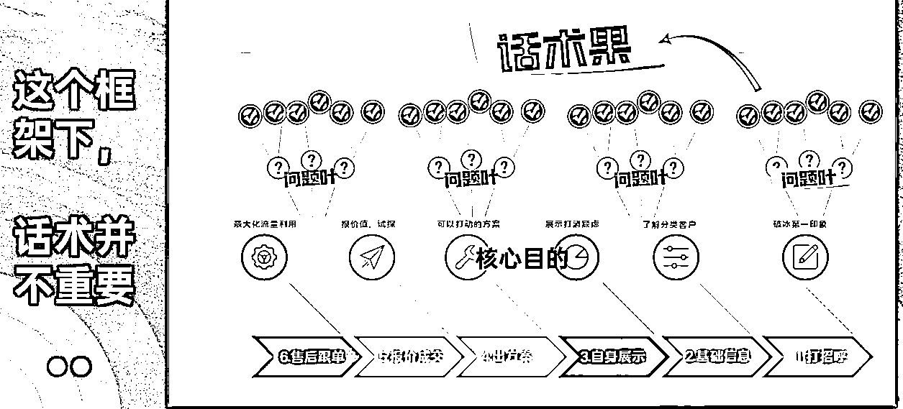

细节在文章里我们会慢慢讲，这里大家理解我们主要解决销售团队搭建过程中的三个难点：

新人培养难：只需要教会新人理解每个节点的核心目的，话术不重要，因为一直在生产。

老人执行难：既然有标准有话术，通过督导就可以抓执行。

销冠管理难：销冠的话术会通过督导，第一时间整理成系统的话术销售树，方便培养全员销冠。

我们用这套方案把销转率从20%拉到了30%，新人培训期从1个月缩短到1周。

这里先预报下，整套SOP并不需要高大上的团队，任何一个私域公司都有能力听话照做。

整个体系强调的是简单，快速，有效的搭建起来可执行的销售团队，尽量用标准化，流程化，来解决销售团队的问题。

为了讲的更新清晰，全篇我们用三个部分来讲解。

*   第一部分：私域销转SOP的优势。

*   第二部分：组成这套SOP的三大框架。先了解再框架实操，问题就会变少。

*   第三部分：实操，如何快速有效的搭建出自己的销转系统。

全文1万4000字，三个大部分，同时包含了图文，有标题分级，方便大家选看，切记第二部分才是重要，不要跳过了，也可以看了第三部分的实操，再回来消化第二部分，同样不影响与欸的体验。

## 第一部分：私域销售转SOP的优势

提起私域行业，大家第一个想到的应该就是流量，搞定流量，吃喝不愁。

但是入局以后，我发现，不对。

### 【销转VS流量】

不合格的销售团队就是在浪费流量！而优质的销转可以让公司开出第二增长曲线，且巨大。

为什么？

在做私域业务以后，我思考了一个做私域业务的，双20%理论。

即：任何一个私域赛道，你要做到流量整体成本低于同行20%，销转率高于同行20%，占其一，你就能在这个行赛道活下来。占一双，你就能活的很滋润。

我自己的体感，销转的价值绝对不会低于流量，以前我们都在注重拿流量的能力，但是在流量越来越卷的当下。

优秀的销售能力，才是一家私域公司盈利，甚至生存下去的关键。

你具备流量+销转的能力，你才能形成初步壁垒，稳定下来，慢慢构筑自己的团队，体系，赚长期的钱，又或者叫长期赚钱。

不然就只能一个赛道又一个赛道的跳，美名其曰，找蓝海。

因为只有流量能力的话你没得选，你不具备卷的资格，同样的成本，你就是没有别人盈利能力强。

这些是见过太多朋友或者同行的感慨，在一个行业红利期，流量靠买，销售约等于客服，就能快速盈利，但是很快就结束。

### 【销售团队搭建的痛点】

而管理和搭建销售团队和做流量一样都是巨消耗的事情，相信搭建过的朋友都有同感，所以才有那句话，“大部分流量做的好的公司流量销售都不怎么样，反之也是一样。”

很多团队老板自己就是销冠，但是搭建销售团队和自己做销售完全不一样。

自己做销售，找到大佬好好学，加以应用就够了，我自己就是，最初不太懂，生财找了很多大佬的内容，看了涛哥，看了靠谱老师，看了根源老师，甚至还看完了一个公众号的全部内容。

内容真的很干，讲解销售应该怎么做，如何才能成为一个好销售，这些内容对于我的销售能力帮助非常大。

但是，后来我发现，其实对我打造销售团队的帮助并没有那么大。

不是你说的对，大家就愿意去做的，不是你有道理，新员工就要服从的，更不要说搭建销售团队了。

没有合理的流程和要求，每个人都会给自己找各种理由去精简自己的工作，潜意识无视真正的结果，包括我自己。

大部分传统的销售团队是基于个体的销售能力的，很多流程无法SOP化，销冠就是销冠，小白就是小白。

如果你能挖到很多销冠，那么管理上也许会有很大的问题，因为销冠很难管理，如果遇到销冠离职，公司的业绩还会直接打折。

大多数情况下，你也招不到那么多销冠，就只能招小白，培养小白就会浪费大量的资源和流量，而这些，都是利润。

更多情况下我们甚至可能招到一些伪销冠。

就是具备销售能力，但是不怎么服从管理，做业绩靠能力，靠心情，最近状态差就差点，过几天再赶赶，反正到月底搞个突击还是前几名，公司盈利多少我是不考虑的，我做舒服点做好自己业绩就行，至于带新人？看心情吧。

不要问我为什么知道，当年我自己做销售的时间就是这个样，一个月我只上7天班，照样前三，公司有任何漏洞我一定能抓住，流量尽量挑好的吃。（真是天道好轮回）

这就形成了困局，招聘但凡有点销售能力的人，都是很聪明的，哪怕是小聪明，自持有经验，不受约束。

招聘小白又要靠大量资源去培养。

真正有能力又稳定的的销售那叫可遇不可求。

我们不能靠可遇不可求的事情来支撑公司发展吧？

### 【这套流程起始点】

把公司销售的内容，话术大部分都标准化，流程化，甚至自动化，那么自然就可以大量的让只具备基础销售感的新销售快速上手。

我们今天分享的就是这套方案框架，我认为这个框架可以往任何行业去套，然后用几周到几个月的时间去磨合搭建自己的销售细节话术就好。

还有一个优势就是：

执行这个流程的人甚至都不需要太懂销售，我们公司的话术搭建很多都是我助理在做。

我们自己团队用了这套方法以后，现在新人销售3-7天开始接线，7-13天 ROI打正，一个月内不限量接线。

（我们的行业对销售要求还是很高的，销售树的话术有小几万字）

这个流程下，话术就显得不那么重要了，因为我们可以一直生产和更新话术。

## 第二部分：组成这套SOP的三大框架。

重要：想要理解这套SOP的逻辑，我认为第二部份最重要，比实操的第三部分更重要，实操部分你只会觉得好，但是没有吃透第二部分，你把方法论套在自己身上的时间，或许还是不知道怎么做。

因为必须要讲清楚所以先放第二部分。

但是如果没有相关经验，第二部分可能会看起来吃力，不过没问题，可以先看第三部分，看的过程中会产生很多关于如何执行的问题，再配合第二部分食用，风味更佳。

### 三大框架：【销售路径的核心节点】 【督导制度】 【用人标准】

### 【销售路径的核心节点】

销售路径的核心节点，这套体系下，我叫它【销售树】。

#### 什么是销售树？

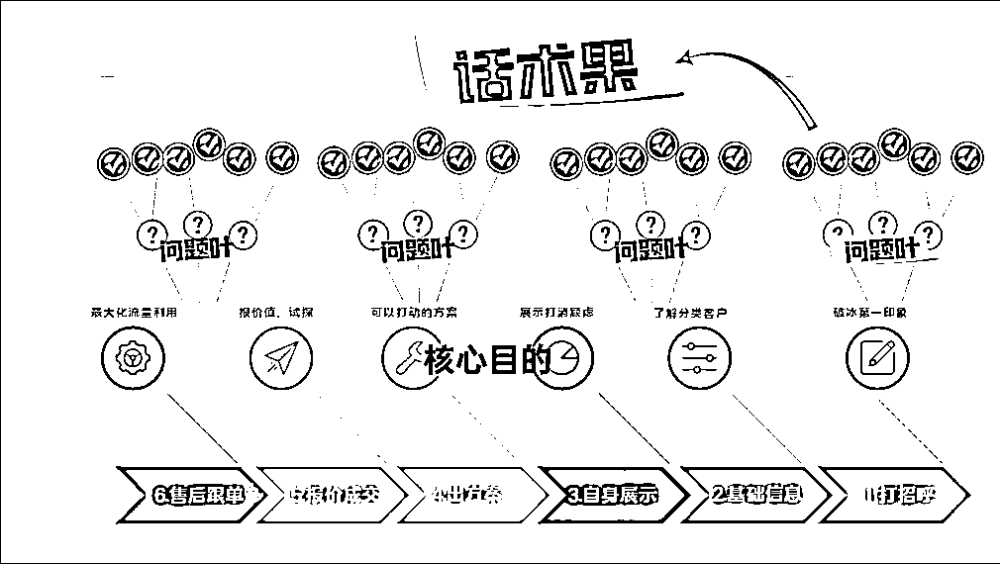

简单讲，就是把整个客户销售路径SOP化（只分分6-7个核心节点），销售只要明确每个核心节点的核心目的。

基于要达成的这个核心目的，我们在销售的过程中不断的提出优质问题（问题叶），同时在流程机制上不断的补充和更新话术果实，就可以达成不需要销冠，也可以长期保持更新优质话术库的目标。

好的话术库一定是长期在迭代状态的，所谓铁打的流程和话术更新，流水的销售，把流程和结果留在公司里。

搭建一套自己行业的销售树以后，用督导机制，话术补充机制，奖励制度，再大量招聘具备最基本销售感的销售，快速放大和提升销售团队的业绩。

（细节我们会在第三部分详细讲，大家先理解基础）

#### 如何做销售树？

我们日常接待客户的路径，几乎必然跳不出这几个节点的，也叫做客户旅程。

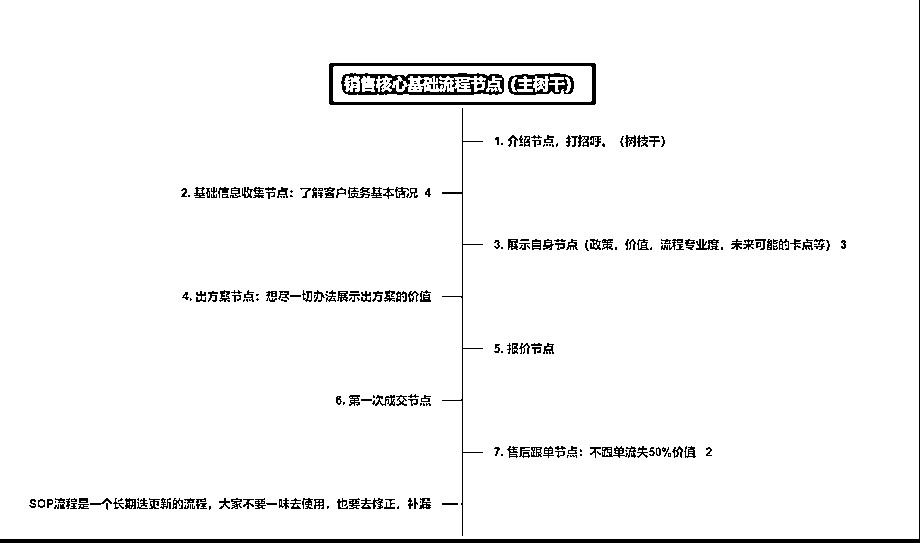

每个核心节点，我们销售过程中不必考虑太多，只要考虑是否再这个节点达成了核心目的即可。

我们用逆向思维去做销售框架树，我们先思考我们要什么结果，再去倒推问题。

比如打招呼节点，我们只有一个核心目标，获取客户好的第一印象，也叫破冰。

好，有了这个就够了，我们只要一直提出问题就可以了。

比如节点一：我们这个赛道怎么打招呼可以获取好的第一印象？

服务型怎么做？

专家型怎么做？

陪伴型销售怎么做？

有好问题就有好答案，可以自己想，可以找同行，而作为管理我们只需要激励即可，说白了就是给钱，给方法，给标准，然后督促大家去完成。

我们先不用管答案，只要问好问题就好，确定这个问题可以协助我们达成核心目的。

最后：

合理用好督导制度，逐步协助大家挂上问题叶的答案果，不出以一个月，你们的话术就搭建起来了，很复杂的赛到一般3个月也能完善。

是不是很简单？

当然，过程中还会有很多问题，以及具体如何做，我们放在下面的督导制度和实操环节里面讲。

### 【督导制度】

说句实话，这个名字我起的很不满意，就像监工一样，不和谐，但是暂时又想不出更准确的名字代替，大家看完这部分以后可以在岗位名称上留言给我下建议，不胜感激。

#### 督导的职能

督导是一套机制，而不一定是某一个岗位，它可以由一个管理岗来执行，也可以拆分成一个管理岗和多个执行岗来执行，很灵活，取决于公司的规模大小和需求。

而督导的职能目标有很多，我把督导机制的职能划分以下几点进行说明。

##### 职能一：聊天记录审查（最重要的职能）

不管是企微还是个微信，微信管理工具是必不可少的。

在我对接的数十个年营收额不低于200W的B端小老板中，8成的老板还是认为：

微信工具的最主要的作用，就是用来防止员工飞单的，只要他的员工管理的好，就没有必要上工具了。

（有6成甚至都没有完整的上工具）

这个想法很错误，防止飞单，只是聊天记录审查职能的一部分，很小一部分。

这个部分我们重点来一一讲下，聊天记录审查可以发挥的作用。

基础作用1：优质话术获取

这里给大家分享一个我跟进话术时间，整理的一些话术原则，好话术应该符合这些标准，或之一。

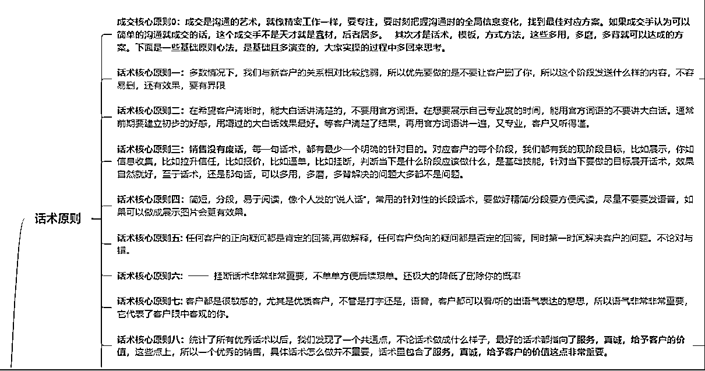

整个销售框架下，按照这些正原则和负原则，督导在做每天的聊天记录审查时，符合正原则，且符合销售核心节点目的要求的话术，同时解决问题叶库问题的话术都是优质话术。

哪怕不懂销售，在这个标准下都能判断话术是是团队需要，且更优秀。

如果更优秀就摘录出来放在话术果库中，定期团队开会做二次确定，同时更新话术库。

（这里不做案例讲解了，具体实操环节会讲，如果不明白可以到时间再回到这里来看，总之，这个环节，督导负责优质话术的选取）

很多情况下，优质的销售话术没有留在公司，是因为没有这个流程，销冠没有义务分享自己的话术，很多时间销冠也不会主动分享自己的话术。

而且我发现，很多时间销售沟通时会“暴击”的，这个“暴击”是不自主的，销售本身可能都没发觉，需要回头去看下，发现这个问题这样去沟通很好，我们很多话术都是这样摘录出来的，销售本人甚至不知道他这次解决的这么优秀。

基础作用2：核心风险把控

刚才是正原则的优质话术选取，风险把控就当然是负原则的问题筛查。

销售态度风险：

这个风险其实普遍存在，并且是核心风险，很多时间不成交就是某个销售，在态度和习惯上转变不过来，还不自知，好的监管可以最大程度上避免这方面的损失。

尤其是个别情况下可能还会发展成辱骂客户的情况，我们不能保证这种情况100%不发生，但是至少可以100%保证发生了以后公司是知道的，是可以及时解决的。

我就有见过一个公司因为多次辱骂客户，直接被甲方取消合作资质，因为没有业务了，100多人的销售团队就地解散。

销售违规处罚风险：

可以说，90%的私域行业，都存在着销售违规的处罚风险，比如虚假承诺，比如极限保证，且做不到，比如引导欺骗。

尤其是食药类的产品，一个处罚就是2-5万。

这些做在督导的日常里面，避免很多不必要的投诉和麻烦，后续上AI自动化辨别关键词。

不过还是那句话，人都不知道怎么做的情况下，AI也很难会，要先有流程，标准。

飞单风险：

这个不多讲，反而没那么重要了。

进阶作用1：销售的基础执行情况和管理解决办法

我们既然要标准化，流程化，难免要做出很多执行标准（标准在文章实操环节有），而销售去执行是有困难的，因为多少都加了工作量，这些抓执行的工作，就由督导来做。

但是单单靠监督和处罚是无法完成这个工作的，这套流程里，我会设计一些管理办法，让销售用最简单的工作，拿到销售增加的结果，自然就愿意执行了。

我们每个周期只抓一件最重要的事情，且销售执行是最简单的，比如只要求使用做好的开场白，比如只要求使用做好的挂断话术，只要求S客户要区别对待，可能我一周只抓一个开场白，同时让销售拿到结果。

然后由督导监督，同时慢慢搭建起大家的习惯，和所有要执行的体系。

（这些细节标准在实操环节都详细讲）

进阶作用2：销售团队能力判断

根据标准，督导在审查聊天记录的过程中，还会给团队的各销售，做能力判断，这个评级是根据销售现场能力的，不单单只看业绩。

可以看出那些新人销售的潜力方便培养，或者那些销售状态不好需要人事跟进，那些销售会有不好的跟单习惯等等，统计成数据表单定期汇报销售总监。

销售总监根据情况日常周会，甚至定点针对性解决，对快速提高团队能力有很大的帮助。

高级职能：当下的流量质量判断

很多时候，ROI下降，要么是销售的原因，也有可能是流量本身出了问题，这个就很严重了，很多团队找流量都是靠蒙的，就是纯粹花几万块钱，如果销售做的好，那就接这个量，如果做的不好那就再换一个渠道再花几万。

我自己经常使用的方法：先查聊天记录，排除销售的问题，先确定是流量的问题还是销售的问题，这样就不会错过一个好流量渠道，也不会在一个坏的渠道上花费过多的成本。

因为我是做流量出身的，也懂销售，我甚至可以进阶应用到，通过聊天记录判断这个渠道的意向度是否高，同比其他高或者低多少，低在哪里了，然后再以这些数据去跟渠道谈价格，有理有据的情况下，我们谈的价格就是比别人低。

这个并不难，长期看聊天记录慢慢的就具备判断能力了，你想啊，销售都是按照最优的流程在做销转，一个渠道挺好，另一个渠道就是经常会有不小比例的底信任客户或者流程客户，那肯定有问题，要么刷量，要么素材不精准或者钩子过于虚构欺骗，同等泛流量。

##### 团队激励的设定和发放

整个SOP话术搭建的过程中，是需要全团队一起去推进才效率的。

而带动销售的积极性最好的就是奖金了。

我们现在的机制是每个4-8人小组每月拿出5000元奖励由督导去推进：

基础奖励3000：

所有问题库的问题不管多小，按照标准解决被采纳的，奖励2-5元，多条或覆盖的也算奖励（保证基础的更新）

其中主动1500（销售提出的）

被动1500（督导找到的）

大家可以抢，分完为止。

问题悬赏奖1000-1500，每周解决一个当下最重要的核心问题：

比如通过沟通数据审核，当下最影响成交的问题是：报价以后很多客户说贵怎么回答？

100-300悬赏，一周内完成，督导督促销售解决，可以在日常工作中多思考，也可以组织大家去同行那边拿答案。

督导的主要目标就是找到当下最困扰销售的重复性待解决问题，在有标准和准则的前提下，用最快的时间先搞定基础话术，哪怕以后再迭代。

尤其是新销售团队，每周解决一个这样的问题，进步神速的。

流程执行奖500-1000

由督导选出执行标准最好的销售，鼓励执行，奖励执行，为管理执行进一步减少阻碍。

同时每周开一个周奖励会议，会议只讨论三件事，发钱，发钱，和发钱。

发上周的奖金，现金。

这周主要发什么奖金。

怎么能拿到，且拿的更多。

以此来快速搭建和更新团队的话术库。

同时，如果有经验的小伙伴还可以把金钱奖励更换成积分奖励。

除了能力，配合，人品等都可以打分。

然后在分配线索资源和销售福利（比如带人奖，分不够不分配徒弟），岗位晋级上给予高分销售优先权。

##### 明确当下团队话术搭建主要目标和协助推进

很多情况下我们刚刚开始搭建这套体系，销售就算是了解且愿意配合，也不知道从哪里去做，甚至这套逻辑有时间跟销售一说，还会反感（因为会增加工作量，我们就是）

所以督导体系很重要的一个点就是，有优先择最重要的，且最简单的给到销售去执行，这样才能价值最大化，冲突最小化。

比如新团队，先抓最简单的开场白和挂断话术。

先抓所有销售遇到重复率最高，且最重要的那些问题。

我们团队第一次讲解这套方案还是有不小阻力的，销售只有一句话，“太麻烦了”，（这相当于销售上的改革起步）管理上来说法不责众，你不能都开了。

我直接给一个方案，一周只抓一件事情，【开场白】，一概不允许使用“你好”，公司做好标准的开场白，销售只要执行复制粘贴。

这么简单的事，做不到的直接离职就好了。

同样的流量渠道做好了开场白，转化率当周拉了5%，后续自然好推行。

总之，督导机制更像是是一套工具箱，在合适的时间，组合出合适和工具应用即可。

同理，不同的时期，应用也不一样。

可能你觉得做么多工作，是不是要搭建一个团队去做，那成本多高?

不用，我一直强调督导是职能不是岗位，一般来说前期督导的搭建由销售总监来担任最好，后期可以把很多琐碎的工作交接给助理完成。

销售团队扩大了，比如8-12人配1-2个督导就可以，督导给赚回来的钱远大于成本。

有了这套体系，大家的团队可以自行开发出各种高效的工具，比如中台督导体系，可以协助多个团队完善销售管理等。

### 【用人标准】

前面讲了整个框架，但是没有人来支撑，这个框架是搭不起来的。

我们先不假设我们在高线城市，招到的都是高素质销售人员。

大部分情况下，我们都是非高线城市，招聘的都是以这个城市为基准的销售人员，甚至有些没有做过销售的客服。

那么我们就需要一套简单标准来尽量找出合适我们流程的人员来培养成本才更低，毕竟销售团队是出了名的流失快。

先明确下，由于销售岗位的特殊性，我这边无法给出明确的好的销售怎么筛选，这些答案。

能给大家的只是一些基础的素养标准，来做粗筛。

#### 基础能力：具备销售感的销售

这个是基础能力，没有这个能力，基本就psaa了。

什么是销售感？

初级：主要体现在具备基础的感受对方对话的能力（私域通常是微信文字沟通），具备通过聊天的内容相对准确感受对方情绪的能力。

同样一句话，客户是在认可你，还是在讽刺你？（一句“嗯，你继续说”，通过前后的对话就可以判断）

客户当下痛点是刚才沟通的哪一个点上？（体现在客户多次重复提问或强调）

客户到底是想要单纯的咨询，还是想要付费购买？给客户分类分级的能力。（通过对话和初步的交叉问题了解）

进阶: 控制文字情绪的能力，在感受的基础上，销售可以通过合理的运用话术，控制客户的部分情绪。

不信任的客户，针对客户痛点，提前服务，免费讲解，来拿到客户的信任。

快速判断客户意向和等级，低意向低等级的走流程，高等级的客户跳起来服务。

有没有情绪价值拉满引导客户购买欲望，对话中表情包含量拉满（夜息老板发明的词，先借过来）

这些都可以从聊天记录里体现出来，具备这些能力的哪怕没有做过销售，也能快速培养出来。

尤其是进阶的控制文字情绪的销售，要重点培养。

#### 价值观：认可公司和SOP流程化的销售

这也是核心点，不认可的销售，反而会给搭建SOP流程体系增加困扰，能力越强，可能困扰越大。

（这里不是讲能力强不能用，这套框架下，能力强有能力强的用法，后续会讲）

#### 利益驱动：对钱敏感的销售

唯三重要的点，对钱不敏感的销售，哪怕能力强，但是很多时间发挥不出来。

大部分销售成交通常都是在全天的，不是说只在公司，私域流量都是花钱买的，如果销售本身对赚钱不敏感，在下班时间，吃饭时间，对客户的服务的优先级别是很差的，销售本身不在意这个钱，但是是在浪费公司的流量。

并且我们的很多激励方案可能也推不动这个销售。

这部分督导去观察是最方便快捷的，根据行业，设立一个标准，一个销售长期在非工作时间回复慢，或者效率，是有问题的。

比如明明客户就快成交了，在吃饭时间让客户多等1个小时。

这点不能完全psaa一个销售，但是这个销售很难成为销冠，判断是否减少流量的分配。

#### 个人能力：行业销冠

这一点毋庸置疑的有价值，但是单单只符合这个能力的化，对于我们的SOP流程来说，定位就是话术供应器。

如果销售只符合这一条，其他都不行，用不用？用！

尤其是在团队初期，尽量发挥他们的价值，尽快给团队搭建出一套基础的话术库和问题解决方案。

把他的话术留在公司就好。

到这里第二部分讲完，下面我们根据树干，也就是基础的客户旅程实操部分来讲，我们进入第三部分，怎么搭建这个SOP。

## 第三部分：实操，如何快速有效的搭建出自己的销转系统。

这套流程做完了以后我发现每个节点都很像渣男行为，为了下面的分享更有意思，每个节点的核心分享完以后，我尝试用渣男思维对比下。

我会分析，渣男会怎么做，销售应该做什么，督导配合应该做什么。

（澄清下，我本人是大直男 ：））

### 实操：销售的七个核心节点

整套SOP流程，通过且只做好这七个节点的核心目标，就可以简单快速的做好成交。

介绍和优势我们在第一部分讲过，下面我们直接上细节干货。

### 节点一：打招呼节点

最重要的节点，没有之一。

节点核心：通过打招呼，给客户最基础的第一印象，这个第一印象在跟客户后续的跟进过程中起着至关重要的作用，打招呼的内容根据后续的沟通形式，或各渠道的客户属性，做成不同的类型。

核心目的就是一个：客户第一映像好感，也叫建立信任，也叫破冰。

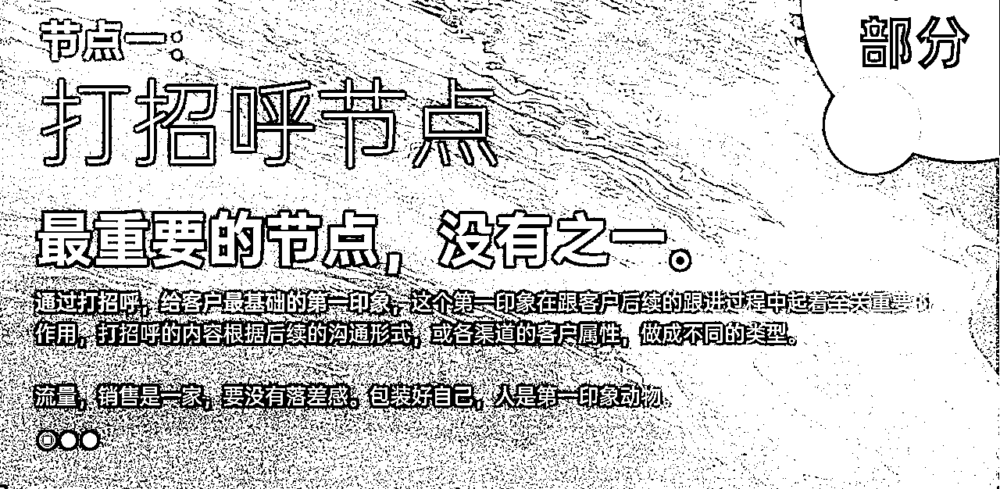

我们之前遇到一个情况，同样的流量渠道，能力差不多的销售，差不多的话术。

一个销售认为该渠道很差，一个认为很好。

我排查了好多聊天记录以后发现，跟打招呼有着绝对的关系，一个好的打招呼会有一个好的第一印象，会让客户破冰，愿意跟你沟通，因为人是第一印像动物。

如果反之，客户一开始就不认可你，那么客户后续跟你的沟通，可能只是为了证明自己的判断，”你不行“的这个判断，因为来找你是有沉默成本的，或许客户不会直接走，他证明你不行以后，自然就结束了。

换句话说，这个业务从开始的打招呼其实就已经结束了，只是销售本人不知道而已。

（你做为客户自己买东西的时候有没有过这个情绪？）

可能销售拿到的反馈是，客户来了就各种问题，问的很刁难，问完了就不回了。

这就是打招呼的价值，通过包装，修正话术，以及对应渠道客户的特色，做好一个第一印象破冰沟通的开场流程，从而让客户先有基础的好感。

怎么做？很简单，我们套公式。

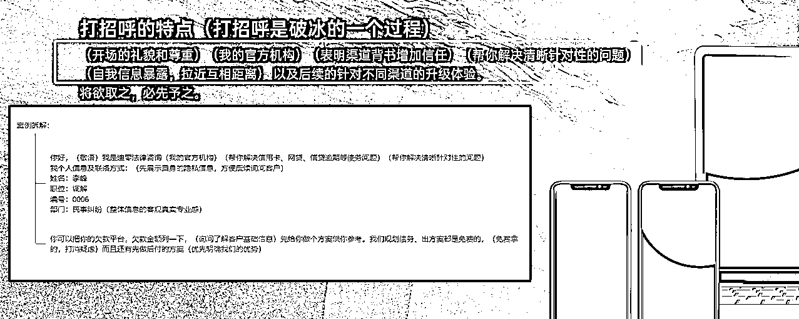

我们实测，只做了这样一个动作，比只说“你好，说说你的需求”，我们的转化率从20%直接到25%。

你会发现不少比例的客户对你的态度变了。

SOP对销售的要求很简单，做出3-5套打招呼的方案，根据你自己的情况自己选，复制粘贴即可，但是必须要做到。

做为销售：

大部分时间都是复制粘贴。

做为督导：

则只需要监督打招呼的应用即可。

是不是很简单？后面也是一样。

我们拆解一下公公式，你们也可以做自己的打招呼话术。

礼貌和尊重，资质背书/渠道背书，针对性帮你解决问题的专业性，自我暴露（重点）

说说自我暴露这个点，因为下一步我们需要客户提供自己的基础信息，客户能会反感。

所以欲将取之，必先与之。

有没有发现其实很多时间能打动我们的不经意的销售小细节，其实是对方有意为之的。

像不像渣男，打扮的干净漂亮，展示稀有的背书（车，名牌）很有礼貌，很尊重你，还在小细节上不经意的暴露的自己的信息，尽量解除你的防范。

作为销售也一样，至少我们在这个节点要最大化的降低客户不喜欢你的比例，做好最开始的破冰。

然后做成标准和流程，督促大家做最基础的执行。

### 节点二：基础信息收集节点

我叫做承上启下的节点。

刚才我们说，欲将取之，必先与之。

与过之后，我们就要取了，取客户的基础不敏感信息。

这个节点，我们要达成的目的是什么呢？

在获取客户基础信息的同时，销售这个时间就可以通过几个问题，和客户的回复状态，来判断这个客户好不好成交，好的销售甚至都已经给客户打上分级SABCD标签了。

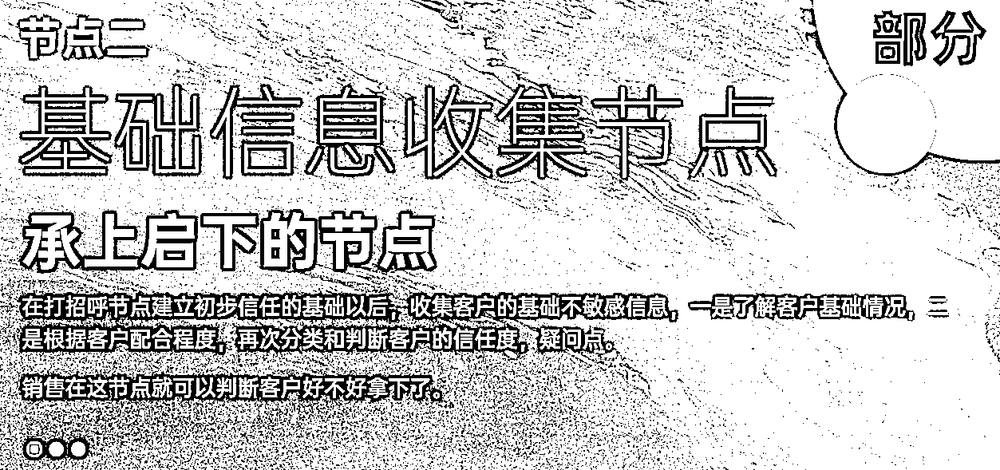

怎么做问题话术呢？继续套公式。

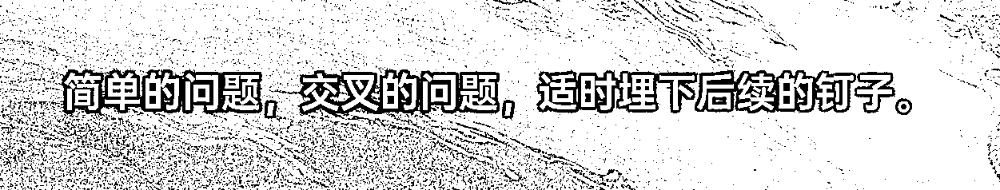

简单的问题：

跟你业务息息相关的问题，正常客户必须回答你的问题。

交叉的问题：

我可以问你产品需求，同时交叉价格需求，或者交叉性能需求，也可以交叉个人信息，交叉过的问题我才能合理判断客户的意向。

适时埋下后续的钉子：

以上问答如果正常推进，大概率会有机会暴露客户的部分痛点。

一定记得，不要再成交逼单的时间去爆这个痛点，客户会反感，我们在这个时间就暴露一下，埋个钉子进去。

因为这个时间讲痛点是不功利的，是服务性的，是在免费帮助客户解决问题，成交的时间就不行了，客户会理解成是你在逼他。

这个节点，做为销售：

只要具备基础的判断能力就好，用相对固定的话术，达成这个节点的目的，判断和分级客户。

这个节点，作为督导：

经常跟进调整销售判断的不对的地方（或统一整理上报销售总监），针对性培训，做的好的地方整合成话术果，丰富话术库。

有些新团队，迫切需要解决某一个问题叶的，直接去同行那边去拿就好，只要是符合我们核心目的的都是好话术，先拿来用，后续在迭代即可。

你想想，如果是一个渣男，在破冰以后，用几个不经意，或礼貌性的，你大概率会回答的问题，跟你交谈几句，就能判断你是否适合进一步聊，如果合适，你就是S级，那就加把劲继续推进。

如果不合适，简单走个加微信的流程，按照流程养起来，下一个目标。。。。。。。

至于具体话术，那不重要，每个行业都有自己的话术，每个赛道都有自己的问题叶。

不重要是因为我们的SOP下是长期更新的，一句话术根本不重要，重要的是能达成我们当下目的的都是好话术。

团队形成这个思维以后，话术迭代的会非常快。

### 节点三：展示自身价值节点

前面套路再多，也只是做铺垫，后面还是要拿出真功夫，做出好产品，来满足客户需求的，不然客户为什么要买你的产品？

但是，大多数情况下，我们的产品其实和市场差异不大，甚至是标品，那么我们怎么才能让客户在我们这里成交？

节点三，是价值最大的节点，也是搭建最重的节点，你大部分的成交问题解决，都在这里解决。

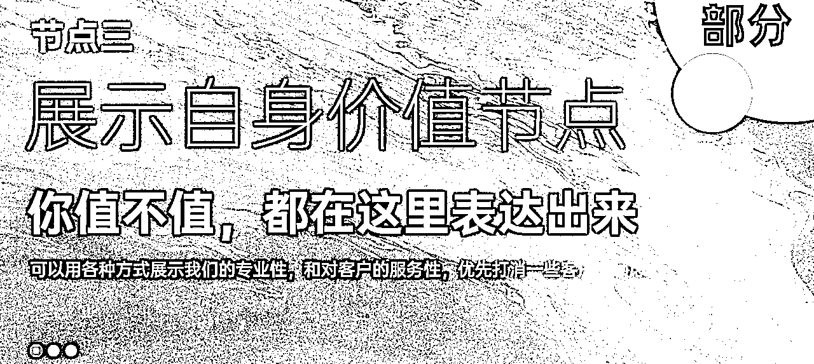

我们先思考一个问题，如果我们的产品和市面上的差不多，为什么客户要买我们的？

答案或许是：

我们讲的清楚，而同行没有讲清楚。

我们态度真诚，而同行不太真诚。

我们只展示价值吸引客户，不跟客户抬杠，而同行。。。。。。

客户在意的事情先讲清楚，尽量不让客户问出来，客户感官上天然就认可了，甚至客户还会有内疚感。

想想一个场景，坐上渣男的跑车以后，很多人会想这个是不是租的呀？这个时间渣男说，麻烦帮我拿下烟，在箱子里，箱子一打开，里面有绿本还打开着。。。。。。。。。。。

有，你也得合理的展示呀？

那具体到搭建话术时怎么做？还是套公式。

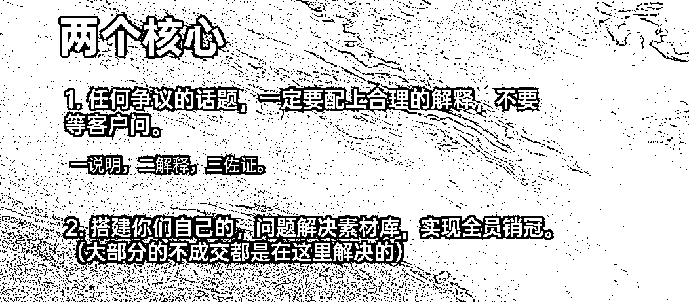

用标准来搭建行业解决问题的百问话术库：

任何行业都有百问，这个百问是销售日常中筛选出来的最常见的百问，给这些问题按照这个公式配上清晰的答案，呈现给客户即可，剩下的就是要求销售合理的使用这些话术果，同时督导监督就行。

这个工作可能耗时会很长，但是是持续累积的，一旦初步的内容填充好，你们的新人销售会快速媲美销冠。

我先说下什么叫一说明，二解释，三佐证。

例：如果要给客户解释一件事情，不要只用文字描述，先说明，然后主动解释为什么，最后配上视频或图片的立体佐证。

可以是文字→图片→视频，也可以只是文字→图片，敏感的问题都按照这个标准去做。

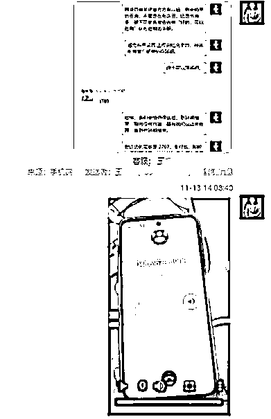

你想想，是不是很多情况下，重要的事情，你以为你解释的很清楚了，一大堆话术，但是客户根本没仔细看？或者看了没理解，还是以为他以为的情况。

如果两个销售同样的产品，一个人说明的很清晰，图文，视频并茂，并且在这个节点时刻通过对话确认客户是否理解了这个痛点解决方案，而另一个销售只是发一个他以为有价值的话术过去，然后继续往下沟通，谁的成交率高？

那么如果行业百问的疑问库都以这个方式来跟客户沟通，你觉得你转化率会拉高多少？

你说那不可能啊，哪有可能所有销售都有这个能力？

对，肯定没有，所以我们按照这个标准搭建问题叶，和答案果的库。

那你再说，我们自己在这个行业没有什么经验，也没法按照这个标准去搭建如此丰富的答案果的库呀？

还是没问题，因为这个搭建是以月为单位的，只要你们不断的累积优秀的问题即可，在强调一遍，我们专注好的行业，话术本身真的没有那么重要。

有好的问题，就可以搭建优秀的答案果库，只要按照我说的标准做，你就是优秀的话术答案，就可以把同行没成交的客户卷过来成交，就可以做出比同行高的ROI，流量出价时就敢比同行出价高。

还记得双20%原理吗？到了这个程度，你，不缺流量。

### 有了好的问题，怎么找到好的答案？

我们刚刚讲到节点三，这里我们插入一个小环节讲解，没有经验，怎么低成本高效的搭建百问库？

我大概计算过，根据公司的效率不同，和行业难度，一个可以正常运转的百问库的搭建，大约要1-3月。

不过首先我们先默认一件事情，我们需要答案，就要先需要有问题。

而一个行业的销售疑问你的销售团队或者销售负责人都整理不出来的话，那就要从自身找问题了。

#### 内部基础沉淀

这些在第二部分我们讲过，这里小小讲下带过。

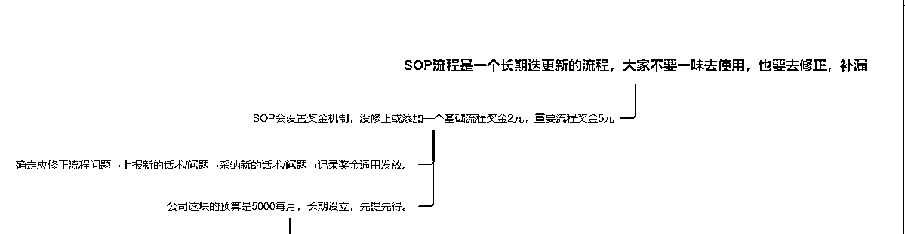

任何私域都需要管理软件，不管企业微信还是个微接线，都必须要。

销售的聊天记录，必须要保存，并定期审核整理。

不管是及时发现问题，还是及时发现价值这都是必要的，必要的，必要的。

日常工作中，尤其是周会议，我们会开会提出本周我们要攻克的问题果，并推出奖励，要求完成了问题果符合标准答案的销售自己记录并回复拿奖金。

很多销售你不用给答案，你只把标准给他们，哪怕他不知道怎么做，但是在大量的接线客户的时间，他潜意识里会去做的，我们叫聊暴击了，聊出超级话术，可能下一次都不会这样聊，但是这一次，记录下来，整理修饰下，放在话术库，拿奖金。

你说很多销售懒得汇报怎么办？

由督导跟进被动汇报，奖金督导分走7成，是的，直接做好预算，花钱买优质话术就行。

#### 外部获取

一些重要但是未解决，又比较急迫的问题怎么处理？

高悬赏+有效方案，我想销售是愿意去赚这个钱的。

很多情况下高奖金销售不去做，或者做不到是真的没有找到好办法。

我们的解决方案很简单，老规矩，给标准。

做一个客户画像，什么样的客户我必须要全力给他开单？

超S级客户，高付费，高付费意向，什么都好，还是大单，就是卡在1-几个问题点过不去。

给自己做一个这样的人设，去同行那边找答案，找专业，牛X的同行，如果他没有跳起来服务你，不浪费时间直接换一个。就针对这个问题要他的完美答案，符合我们标准的答案。

每周组织大家解决几个核心的问题叶，形成答案果，再加上日常的内部话术沉淀，你的超级话术库很快就能搭建起来。

如果你说，销售还是不知道怎么做大客户人设，我只能说，如果销售没吃过猪肉，还不知道猪怎么走，那就还是人的问题了。

很多内容再督导体系里讲过这里就不多讲了。

## 节点四：出方案节点

出方案节点我们只抓一件事情，有没有把你方案的高性价比展示出来，只琢磨这一个就好。

（大部分赛道其实都有出方案节点的，哪怕你是标品，也有不同的套餐）

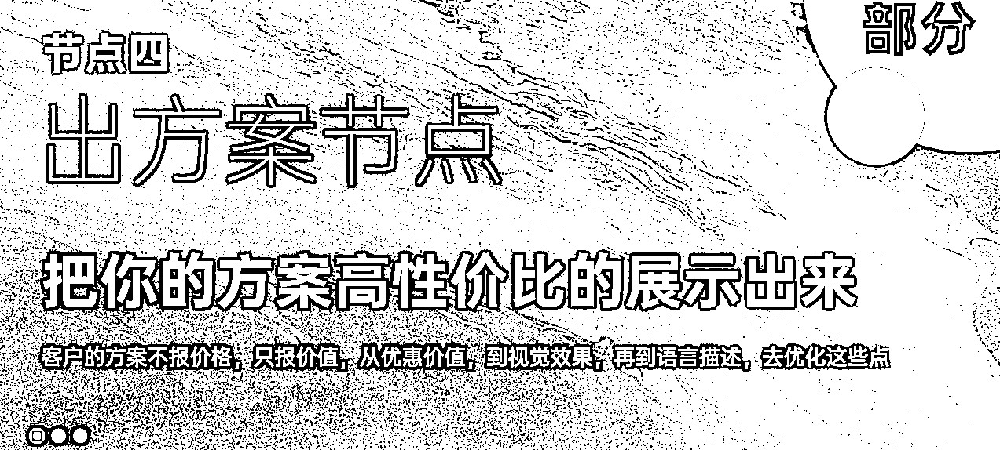

出方案节点的标准，咱们也有，也很简单。

举几个栗子：

小杨哥买加送的方案为什么更能打动人？

视觉上一波一波的加产品，视觉效果拉满。

价格上一次一次的降，就是要打破你的预期。

直播硬拉也要拉起人流和销售额，卖的多，名气大就是背书。

至于产品我们不评价，但是不这样做的同行是肯定卷不过的。

如果是合同型方案，能不能做成纸质的方案，手写，拍照片给客户？

同时照片里附带销售的工牌，名字，在线上做出线下感。

再加上一句：“您好，这是给您出的方案，您看下，照片里是我的铭牌，公司要求每个方案都要配上专员的签名，方便后续给您服务的保证”。

专业感拉满。

每个行业的出方案的方式都不同，好好打磨几套你们出方案模板，做好优质的标准化，非常重要。

销售理解到目标以后，并照做就好，是不是简单很多？

千万不要一个销售一个想法，一个销售一个做法，甚至一个销售不同的时间不同的做法，你的转化率能上去吗？

这年头连渣男话术都是标准化了，做为销售，没有标准和流程，怎么拥抱以后的自动化，AI化？

## 节点五：报价节点

销售的过程中，大家应该遇到最多，最头痛的事情就是“报价死”了把？

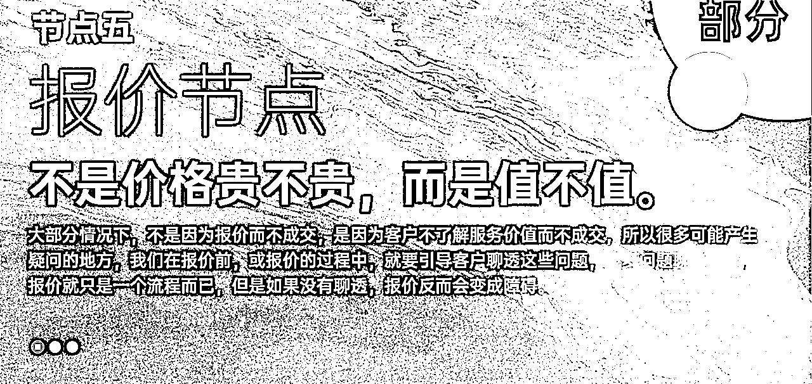

说实话，我解决不了报价死，没这能耐。

但是我们可以拆解下报价死的原因，找到节点的核心目标，针对去做就好，就可以大大降低报价死的概率。

大多时候，不是因为报价而不成交，而是因为没聊透，客户确实没了解到价值。

很多疑问点没有解决，我们叫做没聊透，不要去纠结价格，多关注客户是否了解了价值，有没有了解你的优点。

拉回聊天记录，这时如果发现客户对某个点存在疑问，没聊透，没讲清楚，OK，我们带着客户回到节点三（这里就要发挥控制情绪的能力了），一说明，二解释，三佐证。

报价一定报的不是价格，而是“价值”，报完价格以后，话题就应该往自身价值，好感，信任，上去带，感觉差不多了，才能再次沟通成交或者付费。

而我们要求销售的就是关注到这个节点的核心，先判断，判断是否达成了节点的核心目的，”聊透“这件事情。

而督导就是尽量再日常关注销售这方面的执行，能力，和成长，并反馈。

## 节点六：成交节点

成交的重点不是在逼单，而是之前所有节点做的功夫。

逼单的本质是一种试探，如果行，就成交，如果不行，就拉回到沟通部分，磨刀不误砍柴功。

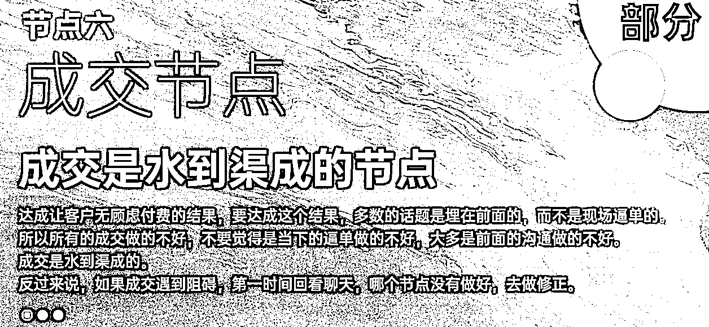

就像渣男，出手一定是带着试探目的的，被拒绝后一而再，再而三就变成纠缠了。

如果成，那便好，如果不成，说一句晚安，情绪价值给到位，直接再去下一个。。。。。。。

打个标签，明天再约（跟单）。

这个节点销售不要盲目逼单，要准确的感受到客户成交的意向后，再逼单。

如果不成，留个挂断话术，情绪价值拉满，直接下一个，该忙啥忙啥，时间管理，效率拉满。

不能明知山有虎，还向虎山行。

同时这里督导要关注销售的判断能力，准确度，感受销售是因为不懂，不会，还是因为知道，但是为了自己效率刻意浪费流量，然后给予适当的辅导和跟进。

## 节点七：跟单节点

大家算下，如果流量成本占我们整体成本的40%，我们的跟单成交率拉高了10%，我们这一单的利润提高了多少？

你没看错，是50%，你可以理解为这一单是白得的，没有流量成本的。

大部分赛道的跟单成交率都不应该低于10%。

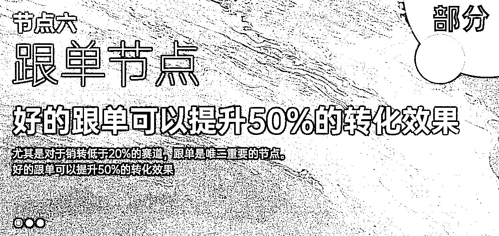

下面，我们把跟单分成两部分讲：

不成交跟单，和成交跟单。

老规矩，我们整个模板只化繁为简，为了简单，为了方便销售执行。

用最简单的落地方式，套模板。

### 不成交跟单部分：

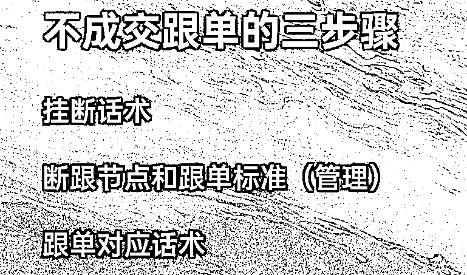

#### 第一阶段 挂断话术

第一阶段，我们只要求销售执行一件事情，每次客户沟通都要有一个挂断话术：

初期这个挂断话术只有一个目的：可以方便近期再次跟进客户而不唐突。

杜绝好的，是的，再见，结束。

杜绝跟单时间以你好，在吗？还考虑吗开头。

我们会给多个通用的基础的挂断话术给销售，复制粘贴也要杜绝以上。

这一步很简单，三天的磨合期基本上都能做到。

#### 第二阶段 跟进销售的断跟节点，以及断跟标准

每个销售都要有一个接线表，实时更新接线情况，接线时间如果是1号，备注S级客户第二天跟进，3号下班了还没有跟进，就是不合格，（后续有打分体制，减少流量分配，数据造假是重罚，聊天可以看出来）

同时表格登记客户的基础情况，以及在哪个节点断跟的。

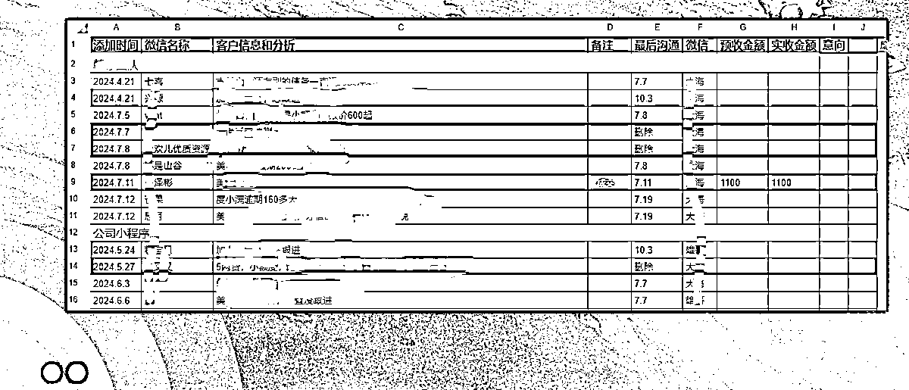

所有节点的断跟，公司销售部整体磨合出来对应节点的断跟话术，每个节点配合数条话术给销售选择。

后续销售简单判断，就可以直接使用话术高效的解决问题。

#### 第三阶段 跟单对应的话术

有了每个阶段的断跟话术以后，磨合每个节点的跟单话术，每个客户都是有信息备注的，针对客户的痛点去跟单，客户才愿意回复你，而不是看着像群发，客户想回你可能都找不到话题的那种。

整个不成交跟单的过程中，督导主要跟进/协助销售一步一步简单的适应执行，然后一起磨合出合理的对应话术。

我们再拿渣男做个比喻，渣男心里是不是有个小本本，今天聊到了什么阶段，这次主要聊的啥，下次打招呼用什么话题做钩子开场，主要针对什么聊，都有备注？可况我们做为销售？

### 成交跟单部分：

没错，不单单是不成交，成交我们也是要跟单的，通过简单的跟单流程，其实会有意外的收获。

执行起来同样是三步，越简单才越能流程化。

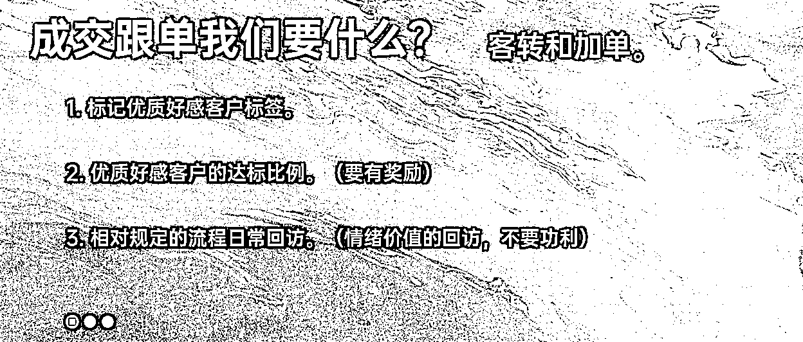

最开始我们只要求销售标记优质好感客户，必须标记就可以了，执行起来很简单，有个基础的比例数据就行。

不可能没有的，如果你按照前面节点的标准做成交，就一定会有的。

然后根据平均值，定一个好感客户的打标比例。

因为大家都有标记，并且有奖励，所以可以统计一个基础的比例，如果低于这个比例，督导会重点关注下，看看是否成交流程执行的不对。

最后设置一个简单的回访流程，要求大家去执行就好。

我们的回访是，每周的好感成交客户要回访询问一次，提醒客户还在售后期间，遇到任何问题都可以来咨询，祝福祝客户，鼓励客户。

好，每周一次，哪怕群发，没要求了，不功利，不要求，不啰嗦。

如果客户回复，就按照这个标准聊几句就好，如果长期不回复的客户可以从好感客户删除，这样不骚扰。

然后，每个月一次（时间销售自己定），表示希望，如果客户有同类需求的朋友的话，可以推荐一下转介绍，到时红包感谢，同时接帮助了自己，减少了业绩压力。

就这样就可以了，简单，但是长期做性价比超高。

整个SOP设计落地时，切记，以不给销售增加太多工作量为核心要求。

每个节点，每个核心，每个执行我都以简单为目的，不管要求多复杂，我们总结落地的时间就要简单，这样执行时的阻力才最小，效果才最好。

## 最后

以上就是这次的分享了，凝聚了近2年时间在销售和流量上的反复横跳，反复打磨的经验和总结。

如果各位是私域B端老板，如果各位在流量上有所优势，正在或者想要做销转，或者搭建销售团队的，应该能给大家不小的帮助。

如果有用可以多给几个赞，我来判断要不要做成更体系的内容，然后去亦仁那边申请一个航海。

还有督导这个名字，我自己确实不喜欢，有好的建议可以留在评论区。

谢谢大家，大家一起，生财有术！