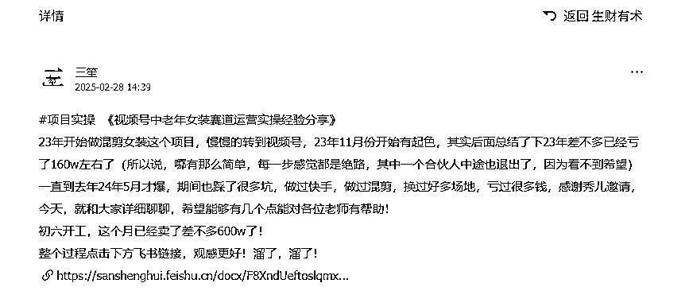
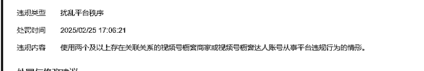
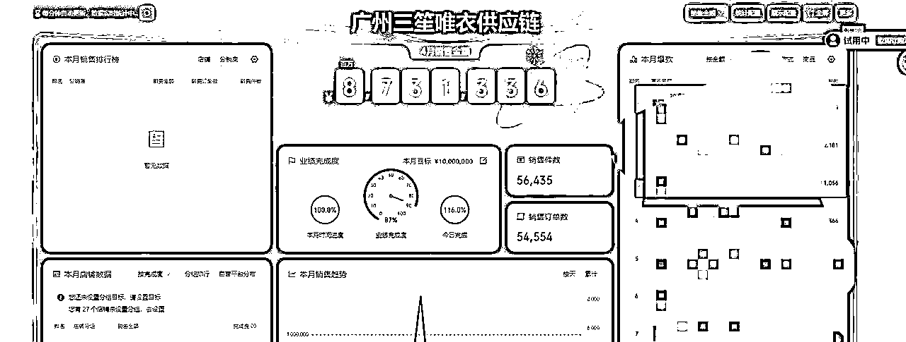
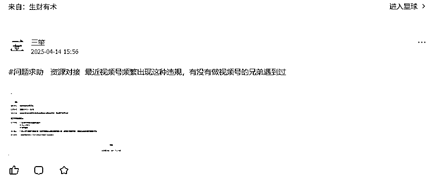
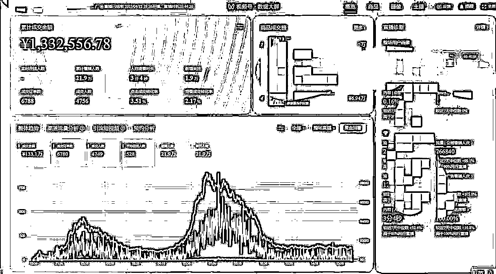
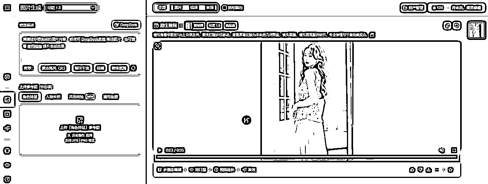
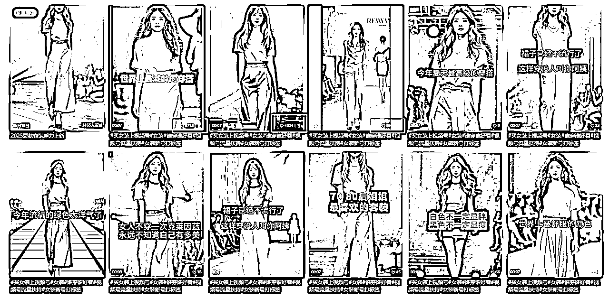

# 视频号+AI(一个月销售额做到1000w）

> 来源：[https://sanshenghui.feishu.cn/docx/TFRhdNdWaon1Zsx3jN0cM9oZnEf](https://sanshenghui.feishu.cn/docx/TFRhdNdWaon1Zsx3jN0cM9oZnEf)

吸引同行最好的途径，就是展现自己，让别人知道自己做什么，这样才能产生链接，这样才能获取更多资源，更多的合作！这也是写这篇文章的目的！

# 一，关于我

各位星球的朋友大家好，又开始写了，作为星球的7年老人，现在表达欲直线下滑，没办法，星球里面大佬越来越多了，总感觉写不出啥东西很丢人，又因为文笔有限，导致现在分享的越来越少！

话不多说，先自我介绍下！

三笙，生财7年老人，如果大家对我感兴趣可以去看下我之前的精华帖子，也有个全面的了解！

从最开始店群到现在其实也是做店群，只是从店铺端变成了账号端，本质就是矩阵！

这篇文章也是这个文章的续写，毕竟已经过了3个月了，感兴趣的可以去看看！

中老年女装赛道:从亏损160w到月销600w的逆袭之路-知识星球

# 废话不说，直接开讲

时间回到2月份，业绩是真的可以，直接一个开门红，做了600w左右，然后3月份到了！电商恐怖月！由于视频号的生态被打短引的兄弟们搞的乱七八糟，平台趁着315来了一波清洗，出现了大范围的关联违规！

法人关联，店铺关联，管理员关联，总之简直是恐怖的一个月，整整3月份，就买了7天的货，从8号开始，就直接断流，直播都不敢开！但是人员还是开支继续支出！

只找到了个违规截图，时间太长了

直到3月29号，流量才开始恢复，开始出数据，整个3月才买了200w左右，太惨了！

4月流量恢复，猛干，一个月做了1000w的业绩，也有出现违规，但是整体调整后，其实没有受到很大影响！

当初还在生财发了个救助帖子，毕竟做视频号的圈子太小了，我也很少对外去交流，都是自己干！服装这个类目，狗都看着摇头的，也没办法去给别人交流！

在4月13号，做了个牛逼的账号出来了，当天自然流买了130w+，零付费！

听我唠叨了这么久，直接上实操和思考，希望对大家有帮助！

我们整体是前端是500+的视频号账号，通过批量去做短视频，批量发布，获取流量，视频号的短视频爆发，就立刻开播，整个4月份测试出了模版，就直接批量了！

整个视频全是AI生成，然后混剪发布！

# 短视频+AI，业绩翻倍

上面的流程图就是整体的的工作流程，重复，反复的做就可以了！基本上测试出一套模版可以全部去套用！

下面展示我们做的账号的数据，基本上属于无脑，整个套路清楚，立刻就可以做的！

# 不太会写文章，直接给大家做了个视频

# 记住，复杂的事情很难批量去做，批量去做的视频绝不复杂！

其余的其实和我上一篇写的没有任何区别，我们就因为看到了这套模版，直接去复制，去模仿，去抄，全部去按照这套模版去做就行了！真没有考虑那么多！别人能买，我们也肯定可以的，服装就是看款式的一个逻辑！既然别人都测试出来了，跟款就行了！

# 结语

6月7日，广州生财航海家新流量大会，我希望遇到更多做视频号的小伙伴，给我思路，女装能做业绩，但是利润太低了，也希望能做私域的团队也可以聊聊，毕竟中老年女装的用户群体，都是一群很优质的客户，我们需要发掘更多的价值！这也是我们所欠缺的！

# 生财的圈友们，你们不是不会，只是你们的眼光没有看向这里，对你们来说，你们的到来真是碾压这个行业！