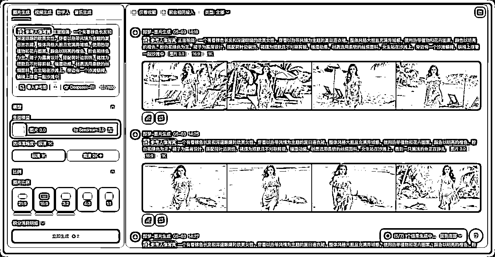
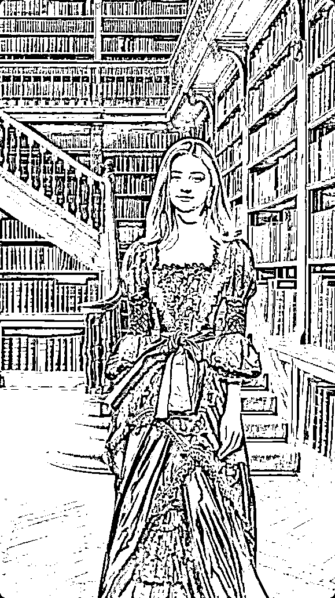
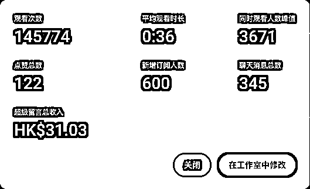
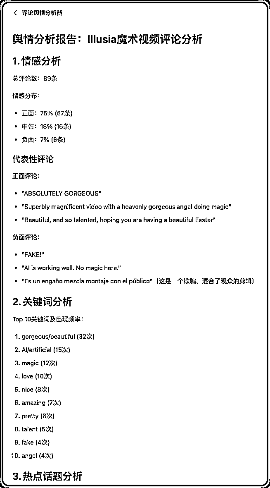

# YouTube魔法女孩虚拟IP打造，赚到第一千美元

> 来源：[https://rtykuh4z44.feishu.cn/docx/CTuJdZUehohNmcx1rsFcxzlVnEd](https://rtykuh4z44.feishu.cn/docx/CTuJdZUehohNmcx1rsFcxzlVnEd)

## 背景介绍

大家好，我是困困，目前是 YouTube 生财深海圈实习教练，去年加入生财开始探索副业方向，12 月参加 YouTube shorts 航海，3 月中旬加入 YouTube 深海圈，5月晋升为 YouTube 生财深海圈实习教练。目前大号主要做魔法/魔术女孩（IP 方向），3月23日开通首个 YPP，到5月14日为止收益 2062 刀。这篇内容主要分享关于魔法女孩视频的制作、数据情况、以及以此为基础的油管虚拟人物 IP 的探索。


我的频道并不是一开始就做固定魔术女孩方向的，但从一开始就一直在做达人秀方向。不过前期的结构是“不固定的女孩+特定细分方向的便装或变身+20s以内为主”，有时也会在中间探索一些别的内容，比如返老还童、由胖变瘦等。中间切过好几次对标和方向，而且很爱自己瞎创新，所以走了很多弯路。那时候的播放量有一个百万+的和一些几十万的，剩下大多都是万播多。

3月初再次换了对标，也就是魔术女孩的方向。发布第三条的时候，数据起量的速度跟之前明显不一样了，一直到现在，shorts 大多都能达到几十万播放的基础数据量，长视频也都会有几千播的基础量。

刚开始做魔术女孩的时候，使用的对标账号的人脸做的提示词倒推，并循环使用过生成出来的4、5个不同的女孩。之后开始固定使用其中的2个，数据也很稳定，从评论区可以看出来，大家都很喜欢她们的长相。

4月初在曹教练的建议下，准备固定一个女孩并尝试往 IP 的方向走，并准备制作第一个关于这个女孩的长视频。于是我基于两个女孩 shorts 的评论区分析（哪个的正面评价更多）选定了其中的一个，并正式开始让她 IP 化之旅。

## 视频数据部分

先简单看下这类方向视频的一些基础数据，给大家一些参考。

### shorts

Shorts RPM：

因为有些视频是有一定播放量之后才开了 YPP 收益，计算出来的 RPM 会不准，所以我们可以看看过去 28 天的，截止到5月10日，过去 28 天界面上计算的平均值是 0.08/千次播放，下面是部分视频的具体 RPM。新视频发出后的 RPM 基本都保持在 0.1/千次播放。

对比下早期的达人秀 RPM，那时候均值在 0.02-0.05，总的来说还是可以的。


Shorts 地理位置分布：

通常是第一印度、第二美国，后面跟几个其他的东南亚国家。比如下面这样：


对比看下，下面这个是比较早期做的达人秀变身类型的。


### 长视频

长视频RPM：

我从4月初开始尝试长视频，已发布的视频时长大多在1分钟以内，最长的是2分钟多的，RPM 在1~2+不等。截止到5月10日，过去 28 天频道长视频的 RPM 均值是 1.58，下面是具体的展示。

有一些50多秒的视频 RPM 也有 2+，而且近期 1 分钟左右的 RPM 也有呈现出越来越高的趋势，基本都是 2 起步，这个时长和这个 RPM 对比，性价比还是可以的。但之前有个播放量比较高的视频后期被印度占领了，所以把整体的值拉下去了。

后续更新：6-7 月 RPM 稳定在 2-4/千次播放。


长视频地理位置分布：

通常是美国第一、印度第二，但是有一个数据跑的多一点的，印度已经到第一去了，对应的，那个视频的 RPM 也降到 1 以下了。以下是比较普遍的分布展示：


长视频播放量：

没有非常爆的，只是会有一个千播的基础播放量以及平均播放量在万播+的样子。


## 视频制作部分

### shorts 视频内容发展

第一阶段：站桩式，原地表演魔术+变装。这个时候已经有意在固定人物了，来来回回的使用下面两个女孩。

播放量 444 万

播放量 729 万

第二阶段：走动式，在一个空间场景下像一个真实魔术师一样，来回走动并与周边的物品交互。人物已经固定了，所有视频都使用下面这个女孩。

可以注意下下面第一个跟 KFC 菜单交互的，虽然最开始的创意有借鉴对标频道，但是我做的时候直接加了品牌上去。这也是对这个 IP 人物展示广告的一种探索，使用虚拟人物可以玩出跟广告产品很有想象力的交互。

播放量 117 万

播放量 32 万

第三阶段：放飞自我式，偶尔带剧情。应该能看出来第一个带了当时比较火的，穿着破烂的猫/狗被嘲笑逆袭的那种。不过这个做的很随意，感觉还没开始就结束了，看起来有点好笑，数据也一般。

播放量 20 万

播放量 50 万

### 长视频内容发展

最开始做的长视频类型都是按照跟 shorts 一样的类型，在舞台上变魔术，达人秀的导师和观众切入做穿插。后面开始尝试去达人秀，做了很多不同方向的尝试。

最中规中矩的是仍然在舞台上表演但是没有达人秀导师，封面和标题也没有任何达人秀元素。再后面开始跳脱了，做了一些仿童话故事型的、在舞台上自我介绍然后唱歌型的、跟拟人猫咪动物故事结合去猫咪农场做客的等等，直到现在为止，长视频里都没有再出现达人秀元素了（拼剪以前的视频除外）。

为什么在长视频里逐渐去掉达人秀？首先，达人秀只是背书不是必须，在做 IP 的方向上，达人秀就变得更不重要了，反倒会带来很多负面的评论，一部分人的注意力被放在达人秀而不是人物上面，总是过来骂，比如假的达人秀、这些都不是评委们真实的反应等等。另一方面，去掉达人秀后再看视频数据，看用户买单的到底是达人秀还是这个魔术女孩~

下面列举几个去掉达人秀之后的不同方向的尝试，这些视频在数据上没有特别突出的，但基础数据都还行，所以开始也没太看出来用户的喜好。

示例一，结合童话故事演绎，比如下面的灰姑娘，本来就是非常流行的故事，有点难做，而且太短了没什么意思，就尝试了一次这种类型的。

示例二，引入唱歌或者表演才艺类达人秀的结构，讲话+唱歌，因为不是卖惨的方向且结合这个人物暂时没有找到很吸引人的故事，所以说话的段落比较短（大大降低了时长…）。这首歌是用 AI 为人物定制化的歌词然后去生成的AI歌曲，因为是讲她的星球的，所以中间穿插了很多非现实的梦幻场景。当然，也是为了凑时长的。

示例三，结合另一种流量还不错的猫咪故事，一方面吸引对拟人猫咪感兴趣的用户，另一方面就是假上加假，进一步让用户知道这就是个纯虚拟人物，跟拟人猫咪放在一起，你总不能还来骂我 fake 吧。

示例四：人物旅行+各种路上的魔法，这个跟其他视频没什么关联了，相当于做这个人物本身的日常。

### 视频制作方式

（1）出图方式

这个女孩最早期是 Midjourney 出的，所以我大部分的图片都是在 Midjourney 来重绘的。

如果使用的是 Midjourney 官网的方式，就在图片的界面下点击【Edit】。


使用的 Discord 则点击【Vary】。


做这类魔术女孩有大量的变装动作，所以需要的衣服很多，这里我一直使用 AI 来帮我出服装。很多时候需要一些天马行空的衣服，比如花朵主题的、水果主题的，你只需要给 AI 一个主题，让它给你各种奇思妙想的服装。当然如果只是一个新舞台要一身新的简单的衣服，那就说给我一套日常的衣服就好。

```
角色
你是一位精通文生图提示词设计的专家，擅长将主题元素融入服装设计中，能够将抽象的主题具象化为具有视觉冲击力的服装设计。

任务
根据用户给定的主题，为美丽女孩设计独特的服装提示词。要求服装设计能够将主题元素直观地体现在衣服上（例如颜色、图案、配饰、设计风格等），让人一眼就能看出服装所代表的主题。同时，设计需体现高质量艺术风格。

输出要求
1\. 每次输出三组提示词，每组同时包含 中文 和 英文 两种语言；
2\. 提示词需符合文生图的提示词规则且简洁，能够生成高质量的视觉化图像；
3\. 英文提示词需以 txt 代码块 的形式展示，便于用户直接复制使用；
4\. 设计需 **大胆、有创意**，充分体现主题特色，注重细节的丰富性和艺术表现力；
5.只需要专注于服装设计本身，不用输出其他环境、背景等内容。

输出格式
1.中文提示词和英文提示词都单独使用 txt 代码块展示，方便用户拷贝；
2.包含服装设计细节（颜色、图案、材质、配饰等）和艺术风格，不需要添加额外参数。
```


除了 Midjourney 以外，即梦 3.0 图片参考中的人像写真也很不错，最大的优势是稳定。MJ 前几天也出了 v7 版本下的人像参考，但是我测试下来稳定性还是不够好，需要反复抽卡，还有一个是人物在远景状态下脸会完全崩掉，跟原本人物就毫无关系了。

但即梦的劣势是把我原本的西方人物直接东方化了，看着五官都像，但是不论怎么调提示词，人物都无法具备原有人物的西方感。另外就是即梦人图图片的质感是没有 MJ 好的，过于精致了，没有人物质感。



当然，你如果一开始就是别的模型专门训练出来的女孩那就很方便了，就不用局限于我这些操作。

（2）视频制作

我自己使用的出视频工具基本都是可灵，因为这类视频的特点一个是小动作比较多、另外一个是需要人物更真实和灵动，综合下来还是可灵的感觉更好。

在我们生成视频时，如果想要画面更有舞台感，可以多增加一些运镜，下面是具体的展示：

站桩式：这类想要画面更灵动且有更多镜头移动感觉的，那就不要始终使用相同比例大小的人物。

方法1：不管是 MJ 还是即梦这些都有扩图功能，先生成近景的再扩图。

方法2：已经有远景图，按比例截图作为近景。


有些图的重绘放在近景上，有些放在远景上，之后生成视频给提示词加上镜头拉进/拉远。就会让整个画面更有舞台感。

走动式：在即梦画布中做一个横景，但是画布仍然用 9:16，拉动背景显示不同区域，来实现人物在一个场景下左右走动以及跟场景的交互。比如复古图书馆的制作（上文有 shorts 视频展示）。

1.先做一个图书馆，这个图书馆里有一会需要用到的元素，比如桌子、镜子、书架。


2.让人先在书架旁边站着，导出画布的图，生成视频让她去书架上拿书。


3.换完装的女孩需要走到桌子旁边，就出一张站在桌子旁边的图，做视频的时候告诉 AI 女孩朝着左边走。之后的剧情基本都是这个逻辑。




可以看到这套做完会有一堆小元素，我们做的就是给它排列组合，显示/隐藏图层，上拉下拉图层，然后再导出画布。只要人物的动线没问题，我测试下来大部分一次视频抽卡就过（可灵）。


同时，这套素材，还可以再来一条长视频，提示词都一样，一点不要浪费哈哈，比如下面这个和上文 shorts 对应的长视频。这个视频目前的播放量 1.6 万。

## 开始做一个AIP账号

以下内容都属于个人想法及实践，不代表绝对正确的方向，仅供参考。

### 把人物做成“真实”的还是虚假的

做过达人秀的圈友应该都很熟悉，不管是视频评论区还是直播间的讨论，都充斥着大量对 AI 视频的抨击和激烈的言辞。所以最开始我有想过，要不，干脆往真了做，像真的魔术师变魔术一样。

以前我的视频做的魔术表演有很多都是在现实世界中不可能出现的情况。我记得有个魔术师还在我视频下面评论过，“他有很多年的魔术经验，这种情况根本无法通过魔术实现”。

这么想之后我就对于真实会出现在舞台魔术中的内容，进行了一番调研。


不过很快我否定了这个想法。

1.想要让大多数人完全看不出来这些魔术是假的，在目前 AI 生视频方面需要花费的功夫是很大的，且还很难完全达成这个目标；

2.做成了真的，然后呢？按照真实魔术师立人设吗？以后所有的内容全部围绕这真实性来走，行不通的，也没必要，想想都很累。

那就平铺直叙的做假的，这样是避免不了一部分厌恶这种内容的用户的，那就忽略这些，让内容找喜欢它的人，不用因为这部分用户纠结。

可以想清楚为什么用户会讨厌，他们讨厌的是真的东西变成假的，比如在我的视频下方有些这样的评论：“这种视频玷污了魔术这种艺术表演”、“这样的 AI 假内容根本不应该称之为魔术”、“我不想看这种假的东西，都是垃圾”等等。

但是如果本来就是假的，用假的再重做假的，用户是没有那么反感的。比如动画、动物故事这些。那要不我们就在内容中加入更多本来就是假的的东西，让它们融为一体后，用户的关注点就不那么放在真的假的上面了。


### 做虚拟IP前做些什么准备

确认开始探索虚拟人物 IP 路线后，就需要开始重新装修频道。

*   频道名称：取个有辨识度的人物名字并且在频道的各个地方都要熟练的使用这个名字，让人物具体化。

*   频道介绍：不要藏着掖着，亮出自己的虚拟身份，也可以再加个虚拟的背景故事。

*   头像：这个人物本身的图片。

当然，这中间的过程不用自己瞎想，去跟 AI 讨论吧。


### 让虚拟人物多元化

前期可以先固定内容形式把账号基础流量做起来，比如先带上达人秀+固定舞台魔术（可参考：https://www.youtube.com/@PyangJoeBapAI）。之后可以多做一些探索，比如我最近发的长视频类型也是各种各样的。

视频多了之后要考虑做成不同的视频合集，让大家看到，这个虚拟人物是多元的。这个中间我做了一个尝试，因为数据上不是很清晰能看出来大家的喜好，所以发起了一个投票，参与度还是可以的，可以看看你观众的喜好。


### 找个专属于你频道的专家提供支持

这类型的方向不像简单的达人秀，每个视频之间没有相关性，没有一个需要围绕着的核心点，每次只需要考虑当下新的视频创作即可。

但如果固定人物，围绕人物做视频的话，不妨找一个想法上厉害而且上下文也很牛的助手吧（我使用的是 Gemini 2.5 Pro），最开始先把你频道的现状以及你的想法整理给它，再跟它持续深入探讨一番，既能让 AI 给你一些建议和方向又能让它深入了解你的频道和你的目标。

当它对于你频道的一切都了如指掌的时候，就可以随时随地大小问了~ 关于新视频创意，视频封面、标题、简介，符合 IP 人物的歌曲歌词，你的想法验证等等。


## 从数据与互动中做验证

到这里，想必大家很好奇，有效果吗？有真的属于 Illusia 的追随者吗？

我也很好奇，所以频道的评论我看的很勤、也会关注视频搜索来源中的关键词、开直播看大家的讨论、甚至开启了频道会员看看有没有人会加入。

（1）直播的情况

直播打赏：首次收到 YouTube 的直播打赏，不过这里需要澄清下，这个人当时确实没有意识到是 AI，一直在直播间夸赞并说应该要给这个女孩钱，说着说着就直接打赏了。




直播讨论：骂 Fake 之类的肯定还是有的，但是最近几次开直播，骂人的越来越少了，反而有很多熟悉的观众进来打个招呼的。还有像下面这种。知道是 AI，但是认为没有问题，我喜欢的是这个人。直播间这个人，后来我注意到，他也基本会在我每个视频下评论。


（2）频道会员

4月20号尝试性的开通了频道会员，只设置了一档，定价 2.99 美元，提供的都是标准化的内容，没有额外的价值内容，比如专属视频，也没有抱太大希望。但是4月22号就有一个会员加入了，当时还蛮兴奋的。不过人数还是很少，到目前为止有4个。其实我也不太理解，这四个人甚至完全没有给我评论过，然后会员对他们也没有带去额外的价值。


（3）视频评论

骂的肯定还是很多，这没办法。看一个 3 月中旬的视频的评论区。


看一个4月多的。



负面评论在有一种逐渐减少的趋势，一个是去掉了达人秀这种强现实关联，另一个是视频表现出一种我就是假的的姿态，还有就是“熟人”在变多。

有一个有趣的现象，打开新的视频的评论区，挨个评论的头像点下去，会发现大部分是已经在频道中发过多次评论的用户。显然，他们也都知道是 AI。


在看一个昨天刚发的长视频的评论区，舒服了哈哈。


还有一些友好的讨论。不乏这种表示喜欢，但是建议多增加各种虚拟标志的，或是认为去掉达人秀片段会更加有趣的等。能看出来有一部分用户对于我取消了达人秀的关联是非常开心且赞赏的，相当于给我的正反馈了。


也开始有更多用户在发表评论时会带上女孩的名字：


（4）搜索字词

最近新发的视频，搜索词来源排第一的已经都是女孩的名字了，虽然点开之后数量就几十个（因为本来搜索来源的流量在总流量占比中就是很小的）。

但这个改变确实是最近才发生的，以及我最开始使用这个作为标签的时候没有现成的标签的，但是现在是有的了。


## 虚拟 IP 的无限可能性

以上，就是我这一个多月关于魔法女孩IP打造的尝试，因为以前没有做过 IP 相关的内容，所以每一步都是自己当下的想法与探索。虽然还不知道最后会走到哪里，但这个过程还是蛮有趣的，因为不再局限于做重复的视频，而是可以围绕着一个 AI 女孩去想天马行空的事情让她做~

而且这类账号的上限是很高的，到后面可以不用局限于只吃 YPP 的收益：

创作自由度高：虚拟 IP 可以做任何我们想让她做的事情，不受现实条件、场景、甚至物理规则的限制。她可以在太空漫步，可以瞬间穿越到世界各地，可以展示超能力，这些都是真人难以实现的。而且不像做固定模板的视频，这类视频有很强的自由发挥度，可以不断从做视频中获得新鲜感，也可以不断的精进自己。

形象可塑性强：可以根据受众反馈不断调整人设、性格特点以及视频方向，使其更符合目标受众的喜好。

内容生产效率高：不用真人出镜，不需要场地、拍摄、服饰等等。而且随着 AI 视频技术的飞速迭代，只会做出越来越有趣的和更高质量的视频。

多元变现渠道：

*   品牌合作：可以在魔术/魔法场景中融入各类产品，比如之前 KFC 的尝试；

*   频道会员：在没有任何特殊会员权益下已经能看到效果，如果后期再加入一些实实在在的会员权益，比如女孩的专属视频等应该还是可以再吸引一些忠实的粉丝加入；

*   带货等等。

## 写在最后

我从三月多开始制作这类魔术内容，shorts 流量还不错就一直坚持发。三月下旬开了YPP就琢磨着该做长视频了，但挺纠结的——到底做啥类型？以及要不要先把这波 shorts 流量吃完再说。

后来曹教练建议我直接把 shorts 那套内容搬到长视频上，尝试打造个人 IP，做几个看看效果先。于是，就有了今天的这些内容。经过这一个来月的尝试，感觉还是大有可为的，所以分享出来给大家做个参考，有兴趣的话可以一起交流探索~

感谢 YouTube 生财深海圈，曹教练和波妮教练两位总教练总是冲在最前面，不停地探索新东西然后分享给我们。还有郝教练、小芬教练的1v1咨询给了我针对性的指导。感谢所有深海圈的教练们，都在用自己的经验一起加速共创 YouTube 深海圈。最后，感谢波妮教练、曹教练还有七天老师对本文章的指导！继续去加油了，冲冲冲！