# 注册公司常见问题【工商/财税/社保】

> 来源：[https://rcnlkluxe52z.feishu.cn/docx/Py5sdVGzgorMQNx5FMDc2Sa7n2e](https://rcnlkluxe52z.feishu.cn/docx/Py5sdVGzgorMQNx5FMDc2Sa7n2e)

# 一.背景介绍

大家好，前段时间看到精华帖里有一篇关于开办企业的帖子，里面有很多人评论说能不能分享一些税务相关的问题，本着爱分享、利他的生财价值观，作为财税行业服务十几年的创业者，怎么也得分享下。

自我介绍下：我是smonkey，4月加入生财的新人，星球号是152006；上海财税行业的创业者，从事行业十几年，每天都是在解答/解决客户问题，跟税务局、工商局、社保局、园区等打交道。

本贴主要整理一些客户的高频问题，涉及范围包括工商、税务、社保等，均为小微企业老板的常见问题；本人主要服务的是上海地区的客户，但是公司法、税法都是全国性的，大部分问题差异不大，但是有些细节具有区域性，我会具体说明。

# 二.工商部分

### 1.注册公司怎么选，个人独资企业、个体工商户、有限责任公司怎么选？

个人独资企业、个体工商户是非法人的性质，个人承担无限责任；

有限责任公司是法人企业，承担的是有限责任，正常也就是注册资本的对应的金额；

关于概念的问题我就不过多赘述，想了解的可以自行搜索，我主要说明大家普遍关心的内容。

个人独资企业-不推荐：在疫情期间个人独资企业是有对应的税收优惠，这个时候就可以考虑注册来降低企业税收成本；而目前政策（上海）个人独资企业跟有限责任公司对比，基本没有什么优势，都是查账征收，个体经营所得税税率从5%-35%

个体工商户-适合有门店，toc的用户：很多小伙伴有自己的门店，平时主要的客户是c端用户（基本不开票），那可以注册一个个体工商户，也不用找代办，自己去附近的市场监督管理所办理下就行（要什么材料去问下就行，不同行业要求不一样）。

❗但是要注意：上海区域已经全面取消核定征收（根据行业核定一个税率，按照税率纳税），都是查账征收（根据收入与支出纳税），要记得每个季度、每年要进行增值税和个体经营所得税纳税申报，还有工商年检，都是要按时去做的，比较简单（目前成本都是自己填😃）。目前全国对于核定征收的政策基本也在收拢，但是部分城市还是有的，例如河南、湖北等

有限责任公司-推荐： 我们主要聊的也是有限责任公司，除了部分用户可以选择个体工商户，其他的基本都是选择有限责任公司，有限责任公司小可0申报，大可发展成上市公司，我们后面介绍的基本都是介绍有限责任公司。

### 2.注册公司需要哪些材料？（后面所有注册公司指的都是有限责任公司）

这里指的是上海，其他地区可能有细微差异。

*   如果对注册地址没有要求，就找代办提供园区地址，那你就只需要提供身份证正反面照片就可以办理了！其他信息你跟代办沟通好，可以自己想，也可以让代办给你整理，你来确认，具体信息请看下图。

*   如果你要实地注册，也就是使用你的办公地址作为营业执照上的地址，那材料就要增加对应的产权证明，要看你产权的性质，产权人关系等，例如租房合同、房产证、产调、分割图等。

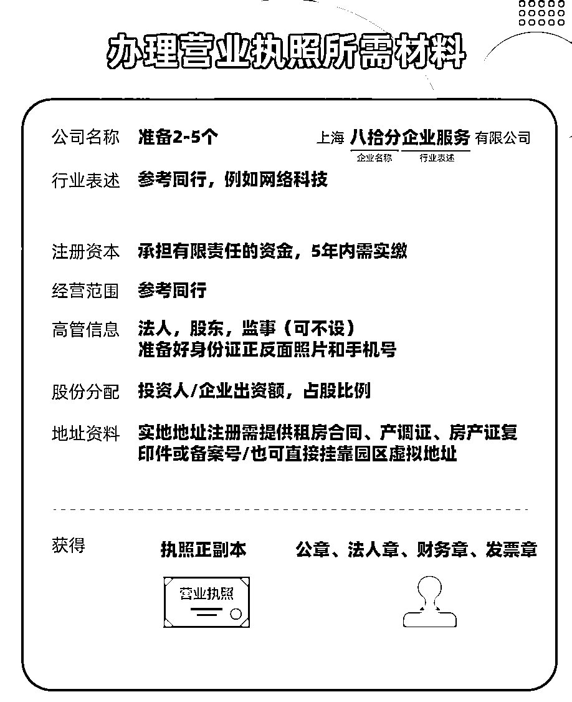

### 3.注册公司要花多少钱？

这里特指上海，其他地区不是很了解

*   如果你自己不会做账，也不准备招个单独的财务，那找财税公司就行，注册公司都是免费的，收取的都是代账费用（怎么选择财税公司，以及代账费用，后面单独写）。

*   如果你的行业有特殊要求，需要挂实地地址，那很多园区就需要挂靠费，1000到5000/年不等，看对应的区，市区一般比较贵，所以小微企业一般都是注册在奉贤、临港、崇明、金山等，这些园区挂靠地址都是免费的。

*   如果你不准备找代账公司，那代办一般是500-2000，看你用什么地址，实地注册麻烦一些，所以相对贵一些。

### 4.注册公司的流程，以及注册好后要做哪些事？

请看下图，如果急着开票，也可以先税务登记再开户，社保公积金可以不开；

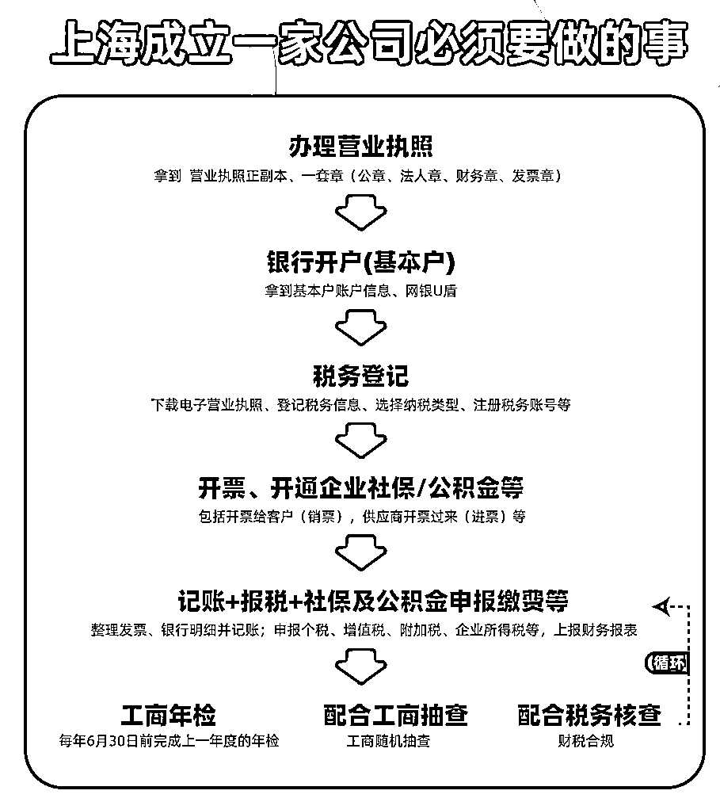

### 5.关于实缴政策，什么时候缴，怎么缴？

2024年7月1日推行新公司法，要求新注册的公司5年内实缴，老公司给了3年过渡期（3+5）；

实缴没有次数限制，操作也很简单，股东通过自己的银行卡打款进公司账户，备注投资款，然后跟财务说下，其他的财务操作就行。

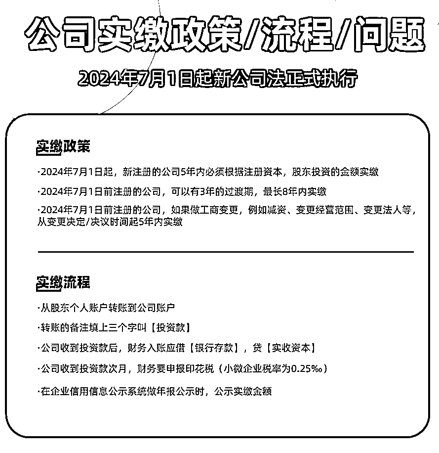

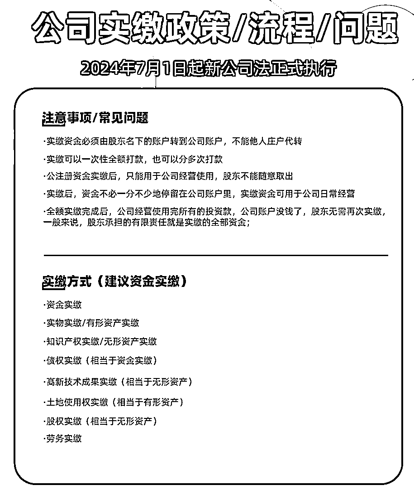

### 6.电子营业执照，电子印章

每个公司法人都可以下载电子营业执照，下载电子印章，通过扫码就可以给pdf文件盖章了，很简单方便而且免费，执照批下来就可以下载了。

# 三.财税代理

### 1.财税代理公司怎么选？

代账公司我大概分为四种

#### 1.规模比较大的公司

这种公司一般都是层层架构，例如【老板-总监-组长-财务】，而你合作之后一般是拉一个工作群，主要服务你的就是对应招的财务，财务正常都是到点下班，上班的主要工作也是记账报税，所以这种公司的缺点也很明显，费用不低（组织架构比较重，成本高），服务跟不上（实际服务你的是招聘的财务），优点是流程正规，跑路风险相对较低。

#### 2.会计事务所

会计事务所一般由几个注册会计师合伙经营，公司规模一般不大，主要服务高客单价的用户，特点就是专业性强，适合公司业务很复杂，有审计需求，需要跟税务局谈判等用户，缺点就是价格高。

#### 3.规模不大，有完整的团队，正规的办公场所

市场上这种公司比较多，我也属于这种类型，记账报税的财务是招聘的，销售/客户服务是老板。这种公司也分两种，一种老板不是很懂财税，所以一般也是拉群让财务沟通；另一种老板自己懂财务，所以很多时候都是自己人（包括合伙人或者家人）对接客户，这种相对服务体验要高很多（有问题能随时沟通，老板对客户也更有耐心），性价比也高很多；这种公司缺点是需要注意甄别，遇到不靠谱的，会乱收费，动不动说这个事要花了多少钱找了多少关系，其实可能就跑一趟税务局的事。

#### 4.家里几个人就是一个财税公司，小区里办公

这种公司超级多，听说前几年一个村的人都来干这个了，这种公司谨慎选择，虽然也有靠谱的，但是不容易甄别，跑路风险也高，乱收费概率高，这部分人往往就是通过低价来吸引客户，然后通过其他途径收费

### 2.财务代理，工商服务费用参考？

这里信息仅限上海-仅供参考；像会计事务所的价格肯定远远高于这个，低价内卷的可能低的不可想象！

现在ai兴起，如果是纯机器人做账，现在价格也可以更低，但是其实只要有真实业务，目前机器记账还存在很多不可控的潜在风险，技术尚未成熟，如果有真实业务，还是需要有个懂税务政策的人沟通协助！

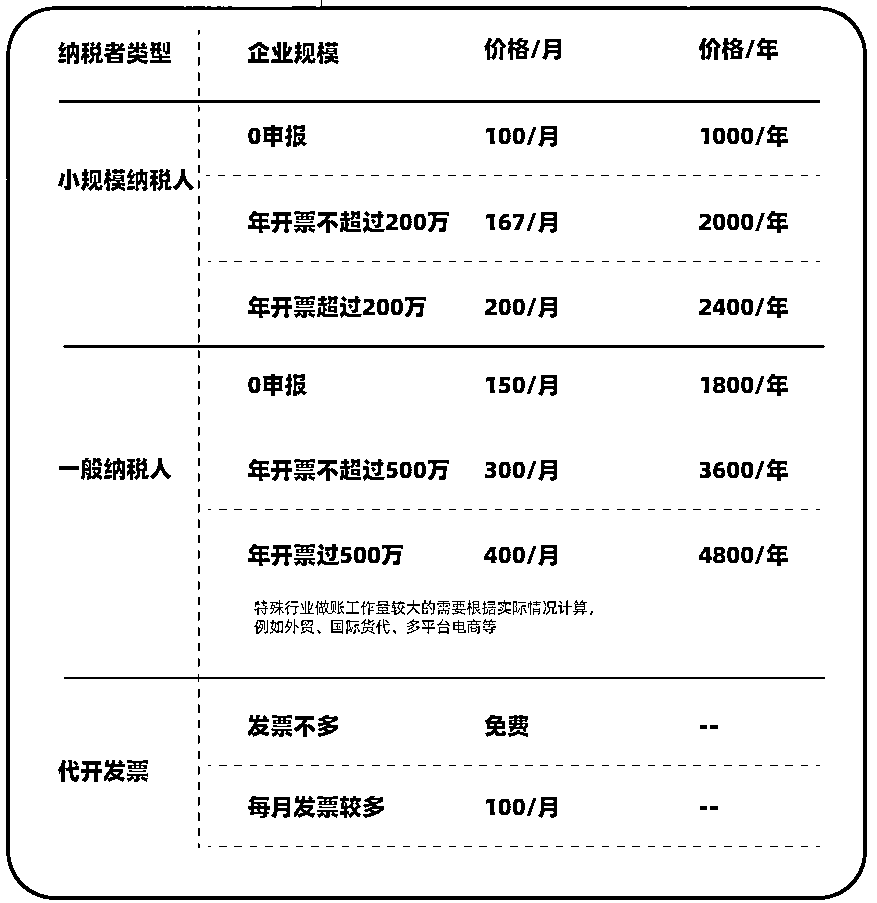

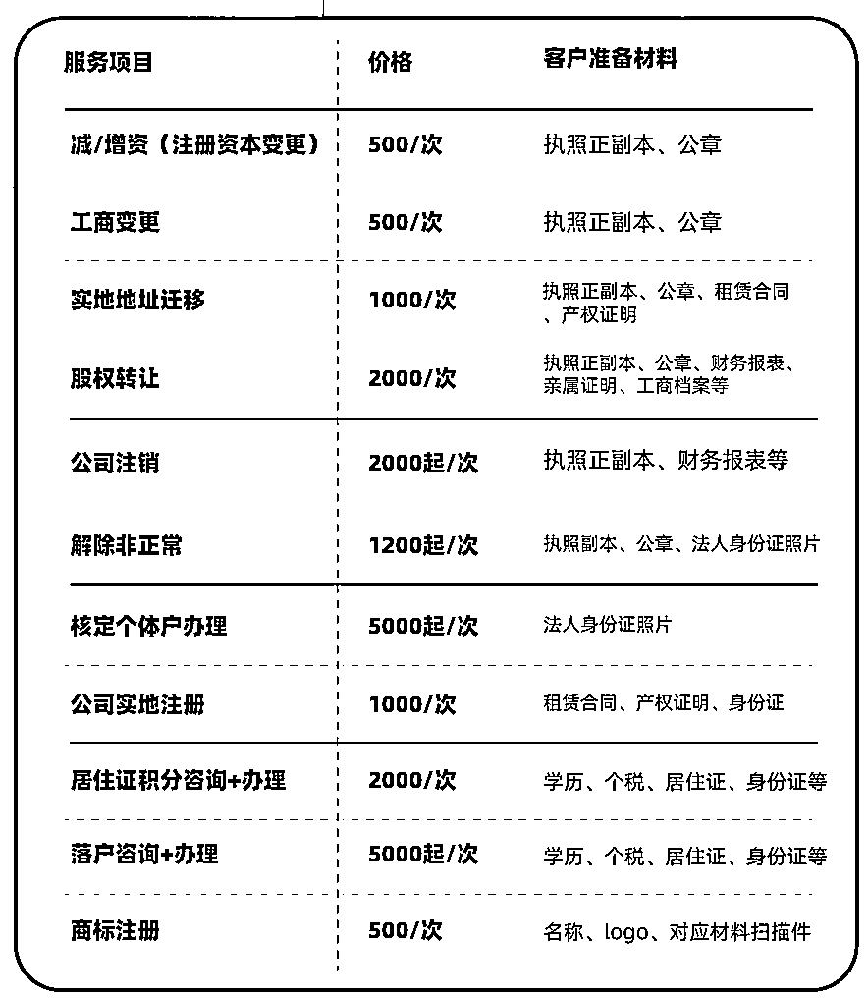

四.税务部分

### 1.小规模纳税人、一般纳税人是什么，怎么选？

正常开普票，且开票金额不大（例如季度30万内），都是选小规模公司；

有些公司客户要求开13/9/6%个点的专票，那就必须要一般纳税人的公司了，具体怎么选，以及对应差别，请看下图；

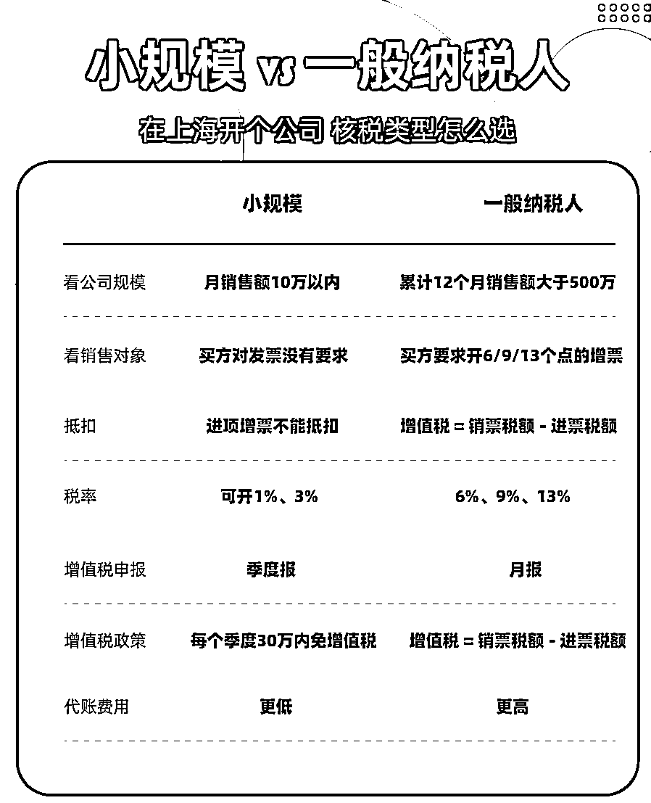

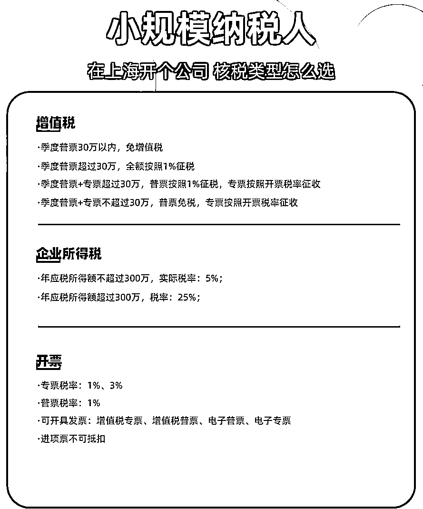

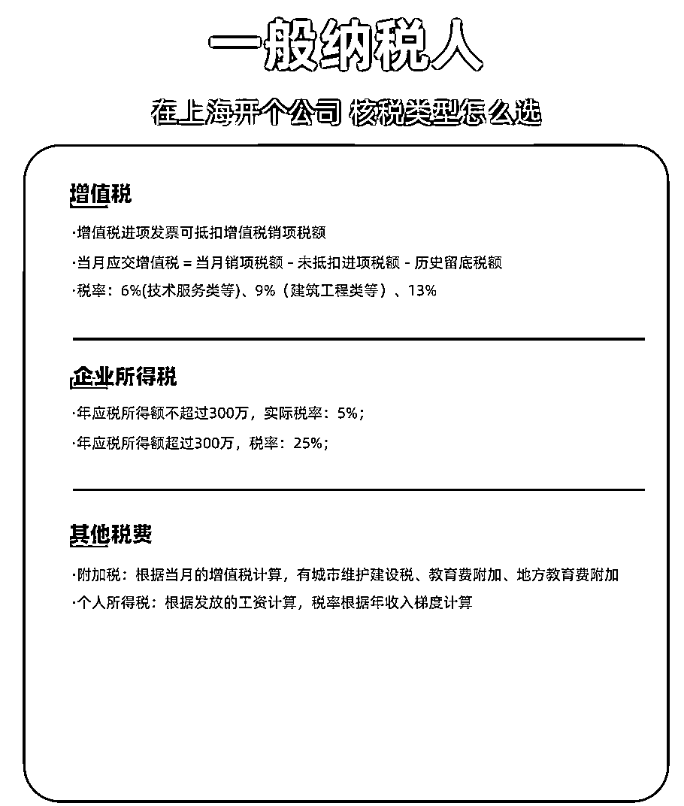

### 2.企业主要需要考虑的税费（增值税、企业所得税、个人所得税）

2.1增值税——小规模公司

*   小规模公司目前有优惠政策，1个季度30万以内的普票是免征增值税的，所以只要你开的是普票，季度金额30万内，就不用考虑增值税。

*   但是有些客户要求你开专票，那这个专票对应的税费你是必须交的，可以开1个点，也可以开3个点，税费是多少你就交多少。

*   1个季度开票超过了30万（包括普票和专票的总额）呢，那就没有这个免征的优惠政策了，全额都要交增值税的，所以请注意，超过30万不是超过的部分交税，是全额按照对应的税费缴纳增值税

风险提示：请尽量规避连续3个季度开票金额都在25-30万之间，现在税务大数据识别，到时候要你提供凭证就麻烦了。

备注:小规模的增值税是不能通过进项发票抵扣的，所以只要开了专票或者超了30万，就必须要交了！

2.2增值税——一般纳税人

一般纳税人增值税没有减免政策，但是进项专票可以抵扣。

一般纳税人的增值税=销项税额-进项税额{例如你买进来发票总金额113元（不含税金额100，税额13），卖出去226（不含税金额200，税额26），那你就要交增值税26-13=13元}。

注意：只有增值税专用发票才能抵扣增值税，普票不行。

2.3企业所得税

企业所得税其实就是利润税，企业所得税=（销售收入-销售成本-其他企业成本等）x税率；

销售收入和成本很好理解，贸易公司就是你的进货和卖货的钱，其他企业成本就包括员工工资、房租、水电费、交通费、办公用品等一切与公司正常经营有关的费用；

只要利润不超过300万，企业所得税税率是5%（小微企业的优惠政策），超过了就是25%了

很多人问怎么少交企业所得税，答案就是有进票或者报工资，合规的成本入账基本只有两种方式，要么开票（企业经营相关），要么报员工工资；

2.4个人所得税

公司税务登记之后，每个月都要进行个税申报，不管公司有没有业务，必须报，不报的话每个月是有罚款的，慎重！

个人所得税怎么算呢？

按月来就是5000以内免征，按年来是6万，具体算法还涉及社保、专项扣除等，年终奖一年有一次的单独计税的机会（单独计税就是不跟全年的累计工资一起算，使用自己单独的税率扣税），具体请看下图

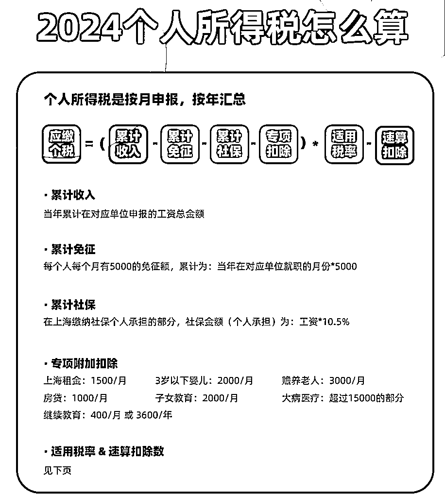

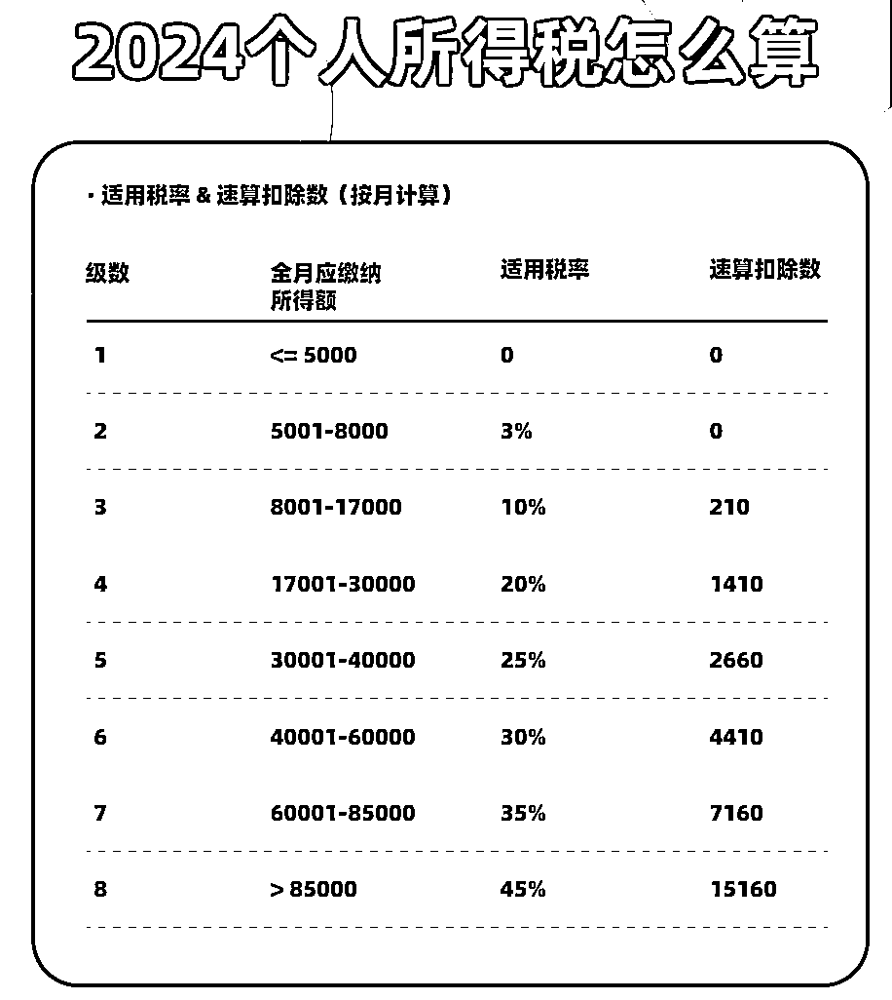

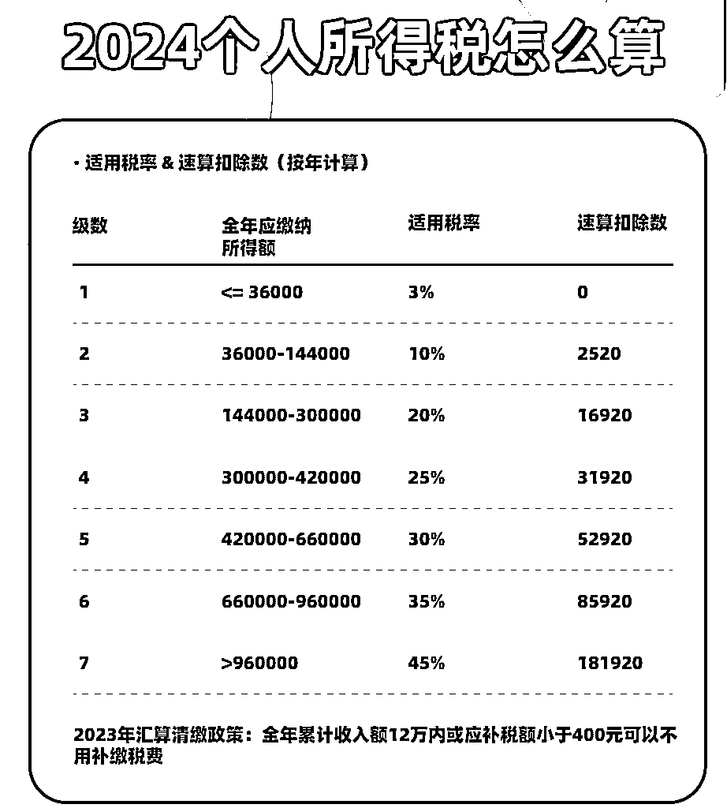

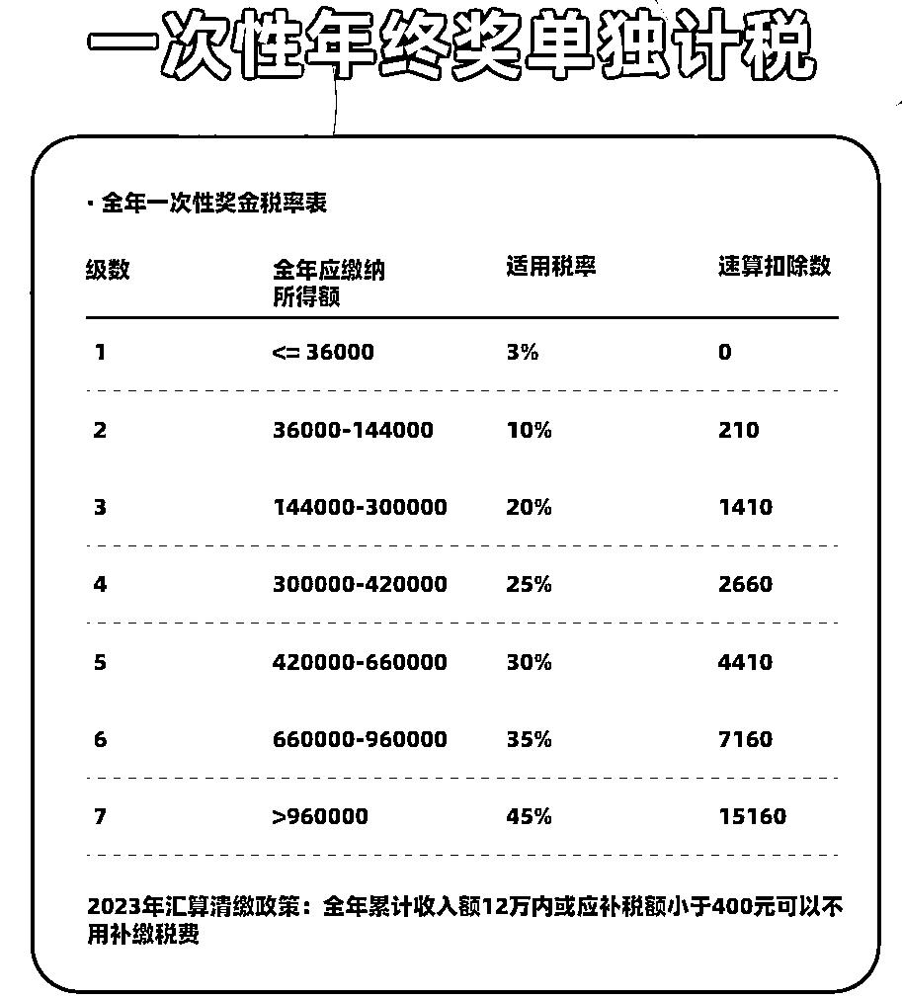

备注：个人所得税都是通过公司代扣代缴，然后个人如果有退税或者全年收入高于12万，第二年就必须进行汇算清缴，进行对应的退税或者补税，截止时间是6月30前，不操作税务局会各种催！

2.5其他税费

其他税费包括附加税：有增值税就有附加税，这个税率不高；

印花税：实收资本、合同等都需要申报印花税，税率也很低，万分之五，还减半征收；

特殊行业还会有一些单独的税，就不一一展示了

### 3.企业账户的钱怎么转到个人账户？

3.1发工资（需合理考虑个税）

3.2报销：拿与公司正常经营的票报销，例如油费、餐费、办公用品、差旅费、业务招待费、福利费等

3.3股东借款：备注下往来款，但是这个钱是要还回去的，合规的要在当年还回来

3.4劳务费：劳务费也是要个人开票的，这个不建议，劳务费也是要公司代扣代缴个税，超过800是20%的税率😂

3.5提取备用金：也是需要写去干啥用的

3.6将个人的车租给公司：也是需要个人开票给公司，这个个税也挺高

3.7股东分红：交了企业所得税后，公司就有未分配利润，可以分给股东，个税也是20%😂

3.8其他不常见的方式就不举例了，基本也用不上

### 4.税费都是什么时候交，怎么交？

*   个税都是按月申报；增值税小规模是按季申报，一般纳税人是按月申报；企业所得税是按季申报，然后还有年报；

*   不管是季报还是月报都是周期结束之后的那个月申报缴费，正常是15号前，有放假就顺延；

*   税费缴纳超过申报期，就会产生滞纳金，滞纳金按日算，税率万分之五/日，时间拖得久会影响企业纳税信用，建议及时缴纳；

*   税费正常都是通过公司账户签订三方协议扣款，也方便财务按时扣款。

### 5.发票内容怎么开？

现在税务都是大数据匹配，贸易类开票要注意进销一致，就是买进来怎么开的，就怎么开出去，否则很容易被判定为虚开发票；服务类的就开对应服务的类目，例如设计服务、咨询服务等，这种就不需要进票，主要是人工成本。

### 6.没有进票怎么办？

有些客户总说，我没有进票，直接交税还不行吗？例如开钢材出去，没有进项，增值税全额交！

答案是不行，贸易类的有销无进，风险特别大，就算现在不查，注销或者其他需要税务审批的时候，就很麻烦了！

有销无进，基本就被判定为虚开，目前大数据时代，税务专管员是不敢解除你的风险的！

服务类的、咨询类等公司就不一定需要进票了，其实原理就是符合真实的业务场景，禁止虚开

# 四.社保部分（仅上海）

上海社保基数，以及对用公司的成本，个人的成本，请看下图，对应基数主要是为了办理积分、落户或者其他用途;

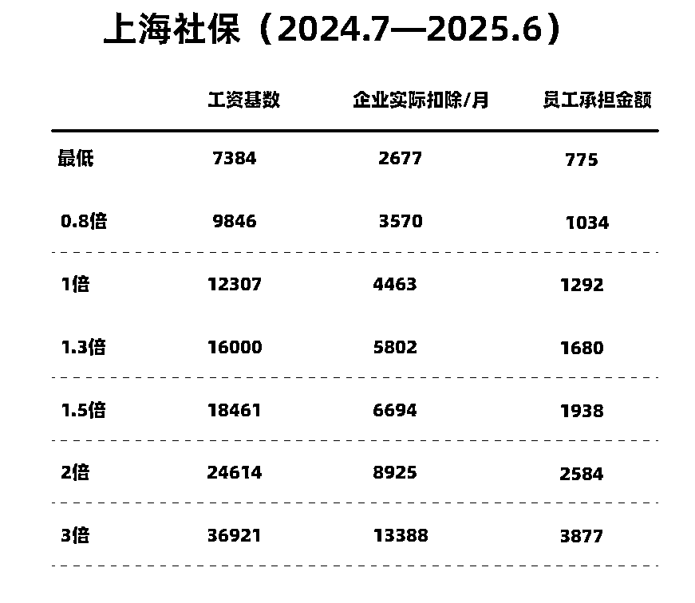

如还有其他问题，可找鱼丸链接，我的星球号是152006；

也可留言，欢迎咨询！