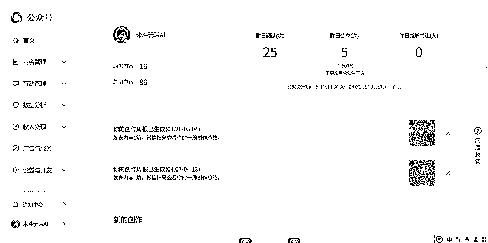

# 【保姆级教程】《新手创作者如何用 AI+RPA 一天创作100篇公众号原创SEO文章获客》@米斗@岳嘉

> 来源：[https://s296cam1nz.feishu.cn/docx/JcoldSFjYoc6wQxUsdncNFJNn2d](https://s296cam1nz.feishu.cn/docx/JcoldSFjYoc6wQxUsdncNFJNn2d)

RPA+AI让内容创作提效10倍？这份保姆级教程喂饭到你嘴里！

Hello，我叫米斗，我是AI商业提效实战教练，擅长用「AI + 设计 + 内容」的方法，帮助中小创作者与品牌主打造能赚钱的个人IP与高转化产品体系。

搭档岳嘉，操盘100+公众号矩阵的生财圈友！4月深圳聚会我们聊爆 AI+RPA ，联手花一天磨出这篇干货！点赞评论转发三连，解锁更多提效秘籍！

* * *

## 前言｜我们是谁？为什么写这份教程？

你好，我是米斗，日常在公众号【米斗玩赚AI】分享各种「保姆级AI实战教程」。

今天这篇内容，不是我一个人写的，是和我非常欣赏的AI实战派——岳嘉老师，一起合作完成的。

* * *

### 我们为什么要联手写这份教程？

事情得从4月一次线下小聚说起。那天岳嘉老师组织了一场AI实战爱好者的聚会，大家围坐一圈，聊的核心问题就一句话：

“AI这么强，我们该怎么结合自己行业，用好RPA+AI，让效率提10倍以上？”

越聊越兴奋，我们发现太多人还停留在“AI能干嘛”的阶段，而不是“AI怎么用得上、落得地、做得深”。

岳嘉老师说：“你擅长写保姆级教程，我把我这套本地流量+AI的打法讲给你，你来写，能帮到很多人。”

于是就有了你现在看到的这篇内容。

我们从场景需求出发，从工具选择到实操流程，掰开揉碎、全流程截图演示，一步一步带你做。

你可以直接复制、套用、照着做。

这一套实战打法，来自我们真实操盘的项目经验，不是拼凑，不是概念，是真正能落地、能提效的干货。

* * *

### 我们是谁？

#### 👨‍💼米斗老师

公众号【米斗玩赚AI】主理人

AI工具实战玩家，擅长“把复杂的AI操作，写成普通人能看懂能上手的教程”

代表作包括字体图片版权、用DeepSeek做IP定位、AI数字人视频、全自动写公众号等系列教程。

口号：知识不值钱，改变才值钱。

精华帖：【生财认知】老板与设计师必读:字体和图片如何避免侵权

https://t.zsxq.com/tPpZ7

精华帖：【生财技能】如何用DeepSeek结合个人优势做差异化定位?

https://t.zsxq.com/tPpZ7

精华帖：【生财技能】如何用DeepSeek协助IP创作公众号文章

https://t.zsxq.com/AMfrF

【保姆级教程】新手小白如何做出自己的第一条AI数字人视频

https://t.zsxq.com/4c0Jm

* * *

#### 👨‍💼岳嘉老师

深圳本地流量操盘手

从线下销售小白起步，到打造100+公众号矩阵、40+视频号矩阵

擅长AI+私域+SEO自动化增长体系

* * *

## 任务概览 & 前置准备

### 目标：

只花一天时间搞定公众号一个月的更新量，一天创作100篇高质量公众号文章，符合“米斗玩赚AI”风格（AI工具、效率提升、创业干货），完成文章创作并定时发布到公众号上（一周文章更新仅需半天即可完成）。

* * *

### 成功标准：

*   数量：100篇/天，字数500-1500字/篇。

*   质量：文章无明显“AI味”，符合公众号调性（实用、干货、轻科普）。

* * *

### 执行平台/工具：

当前流程：搜索同行文章→下载标题和内容→AI改写→手动排版→发布。

*   微信搜一搜（搜索对标内容）。

*   微信公众号文章批量下载工具（新榜、新媒体管家）。

*   Excel（标题整理）。

*   POE平台（Claude-3.7改写文章）。

*   按键精灵（RPA自动化录制）。

*   96编辑器（文章排版）。

*   微信公众号后台（文章发布）。

* * *

### 可能遇到高频问题：

*   标题吸引力不足，阅读量低。

*   AI改写文章有“机翻味”，被读者吐槽。

*   手动排版耗时，易出错。

*   忘记定时发布或发布时间不佳。

* * *

### 关键指标：

*   文章数量（100篇）。

*   改写效率（每篇改写≤5分钟）。

*   排版错误率（≤5%）。

*   发布准时率（100%）。

* * *

### 设备与环境：

*   电脑：Windows/Mac，内存≥8GB，网络稳定。

*   手机：微信登录，确保接收验证码。

* * *

### 素材准备：

*   预设关键词：AI工具、提示词、效率提升、创业干货。

*   爆款标题模板：举个例子：“震惊！XX工具让效率暴涨10倍！”、“新手必看！XX保姆级教程”。

*   Claude-3.7提示词（详情见后文）。

*   96编辑器模板：选择“科技风”模板，预设封面图（1080x720px）。

* * *

# 保姆级AI实战教程

## 第一步：搜索同行，找对标公众号和文章

目标：收集50-100篇优质对标文章，提取标题和内容灵感。

工具：微信搜一搜。

### 1.1 如何实操？

#### 1.1.1 打开微信搜一搜：

*   手机打开微信 → 点击“搜一搜” → 输入关键词（如“AI工具”）。

*   筛选“文章”标签 → 按“综合”排序 → 记录阅读量≥1万的文章。


* * *

#### 1.1.2 添加长尾词：

*   输入长尾词（如“AI写作提示词”、“RPA自动化教程”）→ 重复筛选。

*   保存10个对标公众号。


* * *

#### 1.1.3 确定对标公众号：

*   找到爆款文章链接（点篮字 → 关注对标账号）。

*   关注对标账号（去看他公众号文章：标题、封面、阅读量）。


ps：这个公众号“沙丘社区”，仅仅用来做案例演示举例子。

* * *

## 第二步：批量下载公众号文章

目标：下载50-100篇对标文章内容，供改写使用。

工具：微信公众号文章批量下载工具3.7 网址： https://pan.quark.cn/s/09bdfa78d09b#/list/share

### 2.1 如何实操？

#### 2.1.1 打开微信公众号文章批量下载工具3.7：


* * *

#### 2.1.2 批量下载：

复制粘贴“微信文章链接” → 获取公众号ID→ 获取秘钥成功！请点击下载按钮。

点击“批量下载文章” → 保存为Word文件（路径：C:\Users\Hasee\Desktop\微信公众号批量下载工具3.7\下载）


#### 2.1.3 手动收集：


#### 2.1.4 导入表格：

把标题、阅读量、链接、手动复制到Excel里面。


## 第三步：整理标题到 Excel 表格

目标：提取100个标题，生成改写任务清单。

工具：Excel。

### 3.1 如何实操？

#### 3.1.1 打开Excel：

*   新建“标题清单.xlsx”


#### 3.1.2 复制标题：

*   全选Word文档 → 复制路径 → 粘贴到Excel里面


* * *

#### 3.1.2 替换：

*   输入快捷键“Ctrl + F” → 替换 → 把要替换的内容粘贴到“查找内容”里面

*   替换为”保持空白即可 → 点击“全部替换”

*   重复一次操作，把后缀“.word”也替换掉即可得到选题列表


* * *

## 第四步：用 Claude-3.7 改写文章

目标：改写100篇无“AI味”的文章，符合“米斗玩赚AI”风格。

工具：POE（Claude-3.7）。

### 4.1 如何实操？

#### 4.1.1 登录POE：

*   打开Chrome → 访问POE官网 → 登录账号。

*   选择Claude-3.7模型 → 进入对话界面。


* * *

#### 4.1.2 创建智能体：

*   点击“创建” → 提示词机器人

*   设置提示词机器人 → 名称“20250511”（可以以日期为名）

*   基础机器人选择 → “Claude-3.7-Sonnet” → 填写提示词

Prompt提示词模板：

```
你是一个20年经验的资深SEO写作大师，帮我写一篇公众号原创文章，要求用户搜索最好我的文章排名到第一位，文章标题是：
```


* * *

#### 4.1.3 创作公众号文章：

*   搜索“20250511_Midesign” → 点击进入智能体

*   输入原文标题 → 例如“即梦AI字体我有点玩明白了，用这套Prompt提效50%”

*   AI创作公众号文章


* * *

AI创作公众号文章示例：

# 标题：我用一套Prompt把即梦AI字体玩明白了，生成效率直接飙升50%！（保姆级教程）

你是不是也有过这种感觉：兴冲冲打开即梦AI想整点炫酷字体图，结果一顿操作猛如虎，出来的字丑到哭，还不如自己P图？

别急，我之前也踩过坑，直到我摸索出一套专属Prompt，效率直接提了50%，关键是生成效果一个比一个惊艳，朋友圈点赞爆了！

今天，我就来和你掏心掏肺分享这套「高效即梦AI字体Prompt模板」，干货满满，保证你看完就能用，立马见效。

## 【痛点一箩筐】：不是不会用，而是没用对！

即梦AI字体火是火，玩法也多，但有几个“隐藏Bug”真是劝退了不少人：

*   ❌ 一会儿输出日系动漫风，一会儿又突然变成恐怖片海报风。

*   ❌ 字体歪歪扭扭，不对称，还老带奇怪装饰。

*   ❌ 明明只想要三个字，AI偏偏给你整十个字的“咒语”。

这些问题，归根到底一句话：你没“喂”对Prompt！

## 【解法来了】：一套万能Prompt模板，生成字体不再靠运气！

别乱试了，我整理出一套实测好用的Prompt模板，亲测生成成功率高、风格稳定、细节控制力强，直接帮你提效50%。

🎯 核心Prompt框架如下：

"请以字体风格为主要元素，生成三个字【你的词】，风格为【风格关键词】，颜色为【颜色要求】，整体构图居中，背景干净简洁，适合用于【应用场景】。禁止生成无关图案和多余文字。"

比如我最近在做一个AI短视频封面，用的Prompt是：

“请以字体风格为主要元素，生成三个字【爆款课】，风格为霓虹赛博风，颜色为紫蓝渐变，整体构图居中，背景干净简洁，适合用于短视频封面。禁止生成无关图案和多余文字。”

结果：出来的图像不仅字体超有未来感，而且每次风格都统一，根本不用再P图！

## 【实操教学】：如何高效玩转即梦AI字体？

🎬 Step 1：锁定你要的关键词

*   字数建议：2-4个字最合适。

*   场景明确：是短视频封面？公众号头图？海报？

*   风格定调：国潮风、科技感、二次元、像素风……越具体越好。

🎨 Step 2：精准描述风格关键词

*   不要写“好看”“酷炫”这种虚词，要具体到“像素风”“手绘风”“霓虹灯感”“毛笔笔触”这种。

*   推荐你建个“灵感词库”，积累一些好用的关键词组合。

⚙️ Step 3：提示词中加上“禁止项”

这一步很关键！很多人生成失败，就是因为AI“自作聪明”加了花里胡哨的东西。

所以Prompt里记得加句：

“禁止生成无关图案和多余文字。”

就像你给熊孩子立规矩，立马规矩多了。

🖼️ Step 4：尝试多个变体

即梦AI会自动给出多个版本，别急着选，点进去逐个看细节，选一个最稳的。再用“优化”功能微调颜色和细节，效果更上一层楼。

## 【真实案例】：一位做自媒体的朋友直接靠它搞定10套封面！

我一个朋友做知识付费的，每天都要做封面图，之前他用Canva做图要半小时一张，头都大了。

我把这套Prompt给他，他试了一下：“震惊了！5分钟生成一张，关键根本不用修图！”

他现在都用这套模板配合即梦AI批量出图，不仅图好看，效率翻了不止一倍，连粉丝都说封面专业多了！

## 【结尾福利时间】

好了，今天这套即梦AI字体Prompt模板你学会了吗？真的是一次掌握，天天省事！

如果你还在为了封面图、字体图发愁，不妨试试这套模板，保你用上瘾。

🎁 想要我整理的《20个高转化Prompt关键词词库》吗？

在公众号后台回复关键词：字体Prompt，我马上发你！

别忘了点个关注【米斗玩赚AI】，每天一个AI实用技巧，让你效率飙升、赚钱更轻松！

* * *

#### 4.1.4 爆款短视频文案：

*   点击进入智能体

*   输入提示词 → 例如“你是从业20年的资深短视频创作专家，请根据这条文案<高铁之路，逐梦传奇！自信人生两百年，会当水击三千里！>，改为一个爆款短视频文案，字数300字以内，开头要有黄金三秒，口语化一点，多用短句金句。我是一名95后创业者，现在做的视频号热点爆文。”

*   AI创作爆款短视频文案（PS：横线部分可替换）


爆款短视频文案：《高铁之路，逐梦传奇！》

【黄金三秒】

震撼航拍！中国高铁穿云破雾，时速350飙过世界！老外跪了！

十年前，他们说我们永远追不上！

现在，全球高铁里程，中国第一！

看啊，这是怎样的奇迹？

从零到4万公里，

从学徒到领跑者，

从被嘲笑到被膜拜！

记得那些冷眼旁观的日子吗？

"中国人造不出自己的高铁"

"这辈子都别想赶上日本"

"照搬技术，永远是二流"

打脸来得猝不及防！

最难走的路，我们硬是走出了一条大道！

最不被看好的赛道，我们硬是跑出了第一！

自信人生两百年，会当水击三千里！

这不只是一句诗，是中国速度的真实写照！

穿越雪山，跨越沙漠，

越过江河，飞向远方！

从北国冰封到南疆炎热，

从东海日出到西部落日，

四通八达，纵横天下！

年轻人，你为什么还不自信？

这片土地上，不可能的正在成为可能！

点赞转发，为中国高铁骄傲打call！

让世界看到我们的速度与梦想！

#中国高铁 #民族骄傲 #国之重器 #青春中国

* * *

## 第五步：RPA自动化创作营销文章

目标：用按键精灵自动化生成10篇营销获客文章（嵌入公众号二维码）。

工具：按键精灵 网址：http://download.myanjian.com/。

### 5.1 如何实操？

#### 5.1.1 录制RPA脚本：

*   打开按键精灵 → 点击“新建脚本” → 选择“录制”。

*   执行以下操作并录制：

*   打开POE → 粘贴营销提示词（见下）。

*   复制输出 → 粘贴到TXT文件 → 保存。

*   停止录制 → 保存脚本（路径：C:\RPA脚本\营销文章.q）。


* * *

#### 5.1.2 营销提示词：

```
创作一篇500字营销文章，推广“米斗玩赚AI”公众号。要求：
1\. 开篇讲述痛点（例如：内容创作效率低）。
2\. 介绍“米斗玩赚AI”解决方案（免费教程、提示词）。
3\. 结尾嵌入公众号二维码（描述：扫描关注领取资料）。
4\. 语气热情，像朋友推荐。
```

* * *

#### 5.1.3 运行脚本：

*   打开按键精灵 → 加载脚本 → 设置循环10次。

*   运行 → 确认10篇营销文章保存到TXT（路径：C:\文章输出\营销）。

*   记录RPA运行次数和成功生成文章数。

*   检查每篇营销文章是否包含二维码描述。


* * *

### 5.2 演示视频：

*   为了方便圈友实际操作，米斗和岳嘉老师用OBS录制了演示视频，让新手也能看懂是怎么操作的。

*   原来 RPA +AI 是如此简单，如此神奇，不懂代码，小白也能轻松上手。

* * *

## 第六步：批量导入和排版文章

目标：将100篇文章排版为公众号格式，错误率≤5%。

工具：96编辑器。（工具获取：去“米斗玩赚AI”回复“AI教程”，即可获取工具包）

### 6.1 如何实操？

#### 6.1.1 登录96编辑器：

*   打开Chrome → 访问96编辑器 → 登录账号。


* * *

#### 6.1.2 导入文章：

*   点击“新建文章” → 粘贴内容（1篇/次）。

*   调整排版：点击“一键排版” → 快速排版。


* * *

## 第七步：定时发布文章

目标：半天搞定一周7篇文章，按计划发布，准时率100%。

工具：微信公众号后台。

### 7.1 如何实操？

#### 7.1.1 打开微信公众号后台：

*   打开Chrome → 进入微信公众平台 → 扫描二维码登录。



* * *

#### 7.1.2 导入文章：

复制HTML内容（从96编辑器）→ 粘贴到编辑器。

检查标题、封面图、正文格式 → 保存。


* * *

#### 7.1.3 添加图片：

*   每篇插入2-3张无版权图（来源：Pexels.com）。


* * *

#### 7.1.4 定时发布：

*   点击“定时发布” → 设置时间（比如每天晚上9点发布）。

*   确认一周7篇文章全部发布 → 检查“定时任务”列表。

*   记录发布文章数量和定时任务状态。


* * *

## 常见问题与解决方案

### 标题吸引力不足：

*   参考“米斗玩赚AI”爆款（如“7个动作让TA给你打工”）→ 套用“数字+情绪词”公式。

* * *

### AI文章有“机翻味”：

*   优化Claude提示词，加入案例和语气要求 → 手动润色高频词。

* * *

### RPA脚本失败：

*   重新录制脚本 → 确保鼠标操作一致 → 测试单次运行。

* * *

### 发布时间不佳：

*   分析爆款文章发布时间（微信后台“数据统计”）→ 调整为7:00-9:00 PM。

* * *

### 账号被限制：

*   分批发布（50篇/账号）→ 降低频率 → 申诉（后台“帮助中心”）。

* * *

知识不值钱，改变才值钱。别光看保姆级教程，光收藏没用，动手落地实战才有用。

复盘一下：这份RPA+AI教程，0经验也能10倍提效，内容创作从此“躺赢”！米斗+岳嘉联手，保姆级干货喂到你嘴边！想解锁更多AI秘籍？关注“米斗玩赚AI”，立刻实战，10分钟让你效率翻倍！

## ✅结尾｜看完别走，点个三连支持下！

这篇教程我们花了一整天的时间，从底层逻辑到实操流程，挖空心思做成喂饭级、抄作业级的版本。

💡希望你：

*   看得懂：我们都按最小白的角度来写

*   用得上：你能结合自己行业直接套用

*   提得快：让你的内容产出效率直接翻倍

如果你觉得有帮助，

拜托你动动手指，点个赞、发个评论、转发给朋友，

你的一次转发，就是我们继续写下去的动力。

免责声明：

本教程仅为教程学习分享，教你 AI+RPA 创作思路，不提供任何工具！请严格遵守法律法规，用户对内容合法性全责，严禁非法爬取数据、编造社会事件、抄袭或牟取平台利益等违法行为。米斗和岳嘉仅提供创作思路，不承担任何滥用责任，违者后果自负！若有疑问，请咨询律师！