# 我用 AI 当艺术细胞，零基础一句话生成艺术大片，设计师朋友都 emo 了

> 来源：[https://t16jzwqrzjx.feishu.cn/docx/JdZCdoJrMoWisix2owHcOA84n2f](https://t16jzwqrzjx.feishu.cn/docx/JdZCdoJrMoWisix2owHcOA84n2f)

在22年底大家开始用Stable Diffusion作图的时候，我也努力跟了一波，但我发现我毫无艺术细胞，我去描述画面只会用最原始的词语。

比如说做一张猫狗打架的图，我只会告诉AI：猫狗打架。

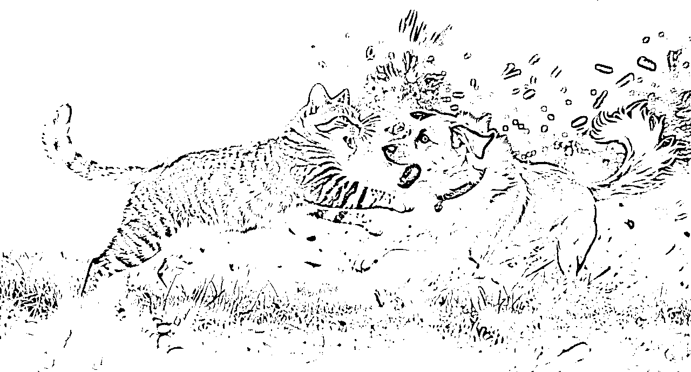

你说能看吧，它也能看，你说它有艺术性吗。。。这就是一个让人沉思的话题了。

于是我觉得可能是我描述的还不够详细，我改成：猫爪在狗脸上留下抓痕，狗毛和猫毛满天飞

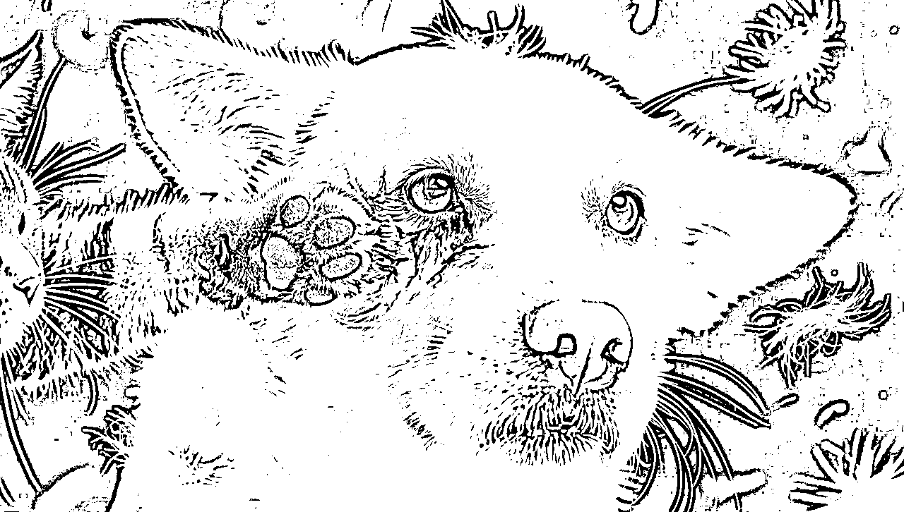

人从努力到颓废有的时候真的只有一瞬间。。。

直到我用4o搞了一堆漫画出来后，我突然发现我是没有创意，但是我可以靠AI画啊，大片不就是指日可待的事情吗！

咱说干就干，不过都周末了先玩会骑马与砍杀吧，好不容易休息一会，下周再干也来得及；结果下周更新了一些MCP的内容，AI画图又需要多个软件协作还得攒积分，又被我往后拖了拖。

但这次拖延总体来说是有利的，之前写的MCP文章被推荐了，AI里的好朋友们拉着我跑去参加纳米AI的MCP内部测试会，顺便蹭了周老板一顿羊肉串（不得不说老师傅手艺真好）。

当时我们一群AI产品激昂的说MCP有很多场景，于是纳米说出来之后邀请我们内测让我们帮忙找找场景，今天上午我拿到邀请码后一边找小伙伴一起内测体验一下，一边在看这些MCP有什么高效的场景。

直到看到了即梦海报3的MCP，我的大脑激动的跟我说：你拖了1个礼拜的AI创意作图赶紧弄！

于是我用提示词+MCP捣鼓出来一个一句话画出艺术大片的的智能体，以下为效果展示：

猫爪在狗脸上留下抓痕，狗毛和猫毛满天飞

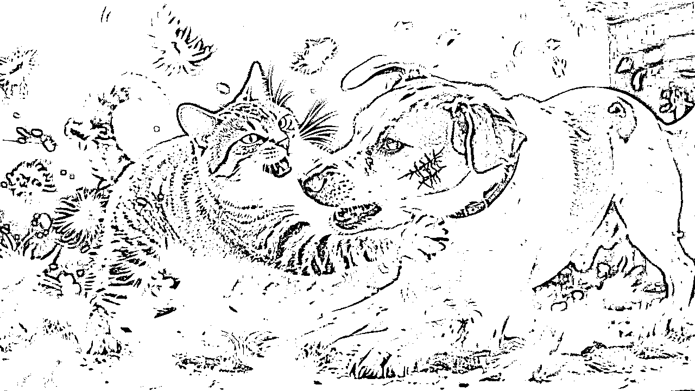

骑士和恶龙打完架，一起坐在篝火旁烤肉。


高铁站外，一对老夫妻坐在行李上看着远方，夕阳映红他们的脸。

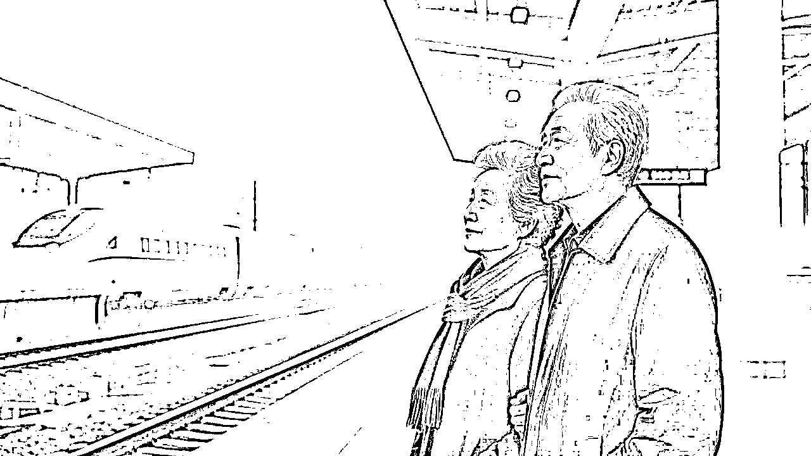

小女孩在宇宙里荡秋千，下面是整颗地球。


一辆老旧的火车从海面上开过，海里是鲸鱼在追它。

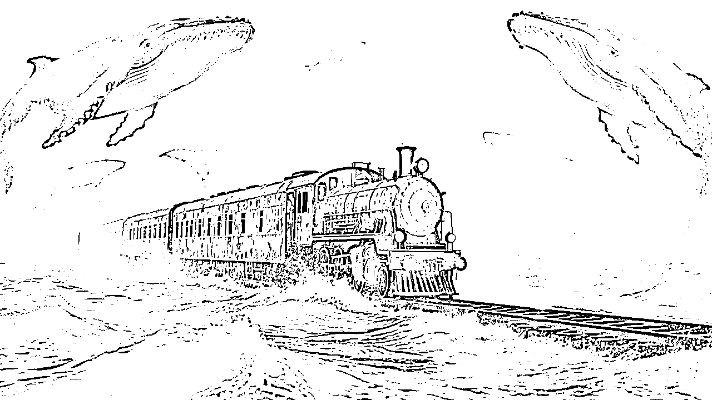

一只猫坐在天台上看流星雨，远处城市灯火通明。

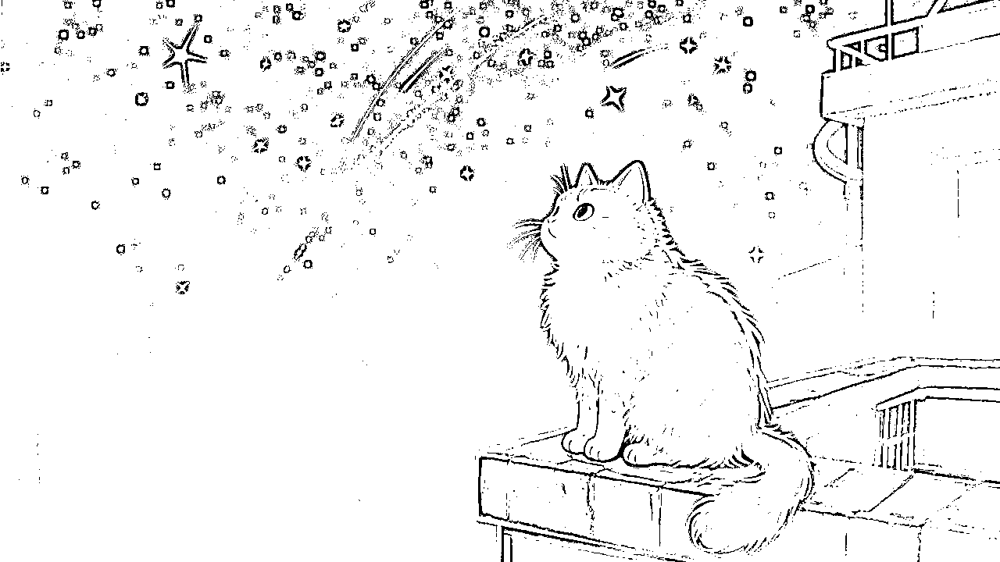

飞机坠毁在沙漠，周围都是巨大骷髅和风沙。


路灯下，一个孩子在路边捡到的不是糖果，而是一枚闪烁的迷你星球。

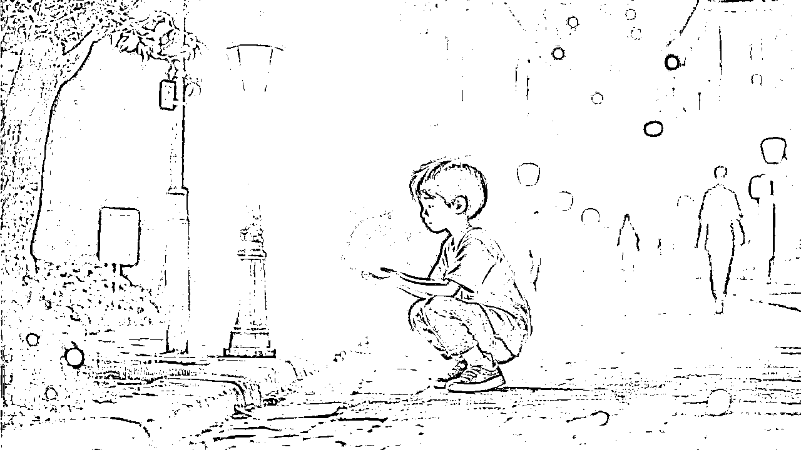

站台广播响起“请鱼类乘客登上3号车厢”，一群穿戴礼帽的鱼拖着行李箱，跳进装满水的车厢。


森林深处，一个发光的蘑菇像灯一样照亮四周


台风过境，楼下便利店的门帘被吹成一条条，老板站在原地发呆。


植物突然开始长成城市的框架，钢铁柱子变成了藤蔓，楼房变成了巨大的花朵。

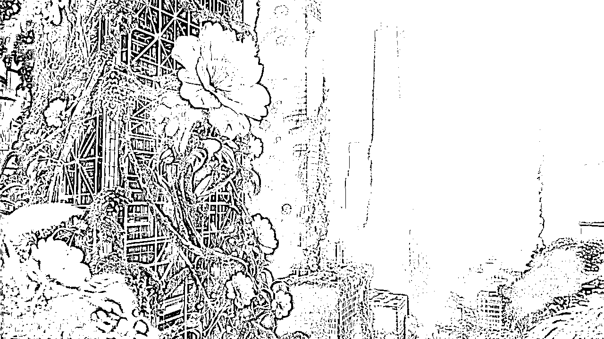

一只巨型章鱼从地下冒出，触手围绕在城市上空，它的眼睛像卫星一样监视着每个角落。


巨大的机械蜘蛛正在城市中游走，拾起废弃的建筑砖块，迅速将其变回原型，修复城市。


星巴克里，一群程序员在写对联，写完突然集体鼓掌。


冰面裂开，一头巨兽从湖底探出头来望向天空

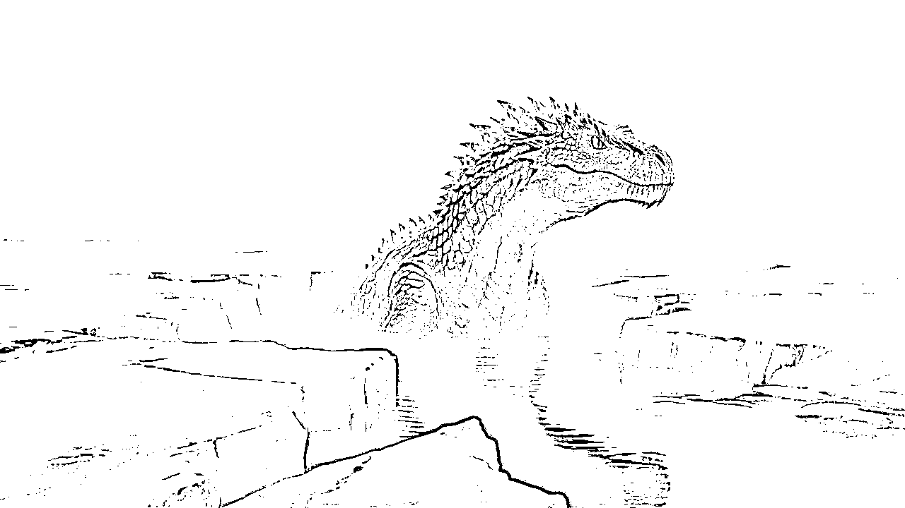

敖丙和哪吒一起跳舞，要3D卡通风格

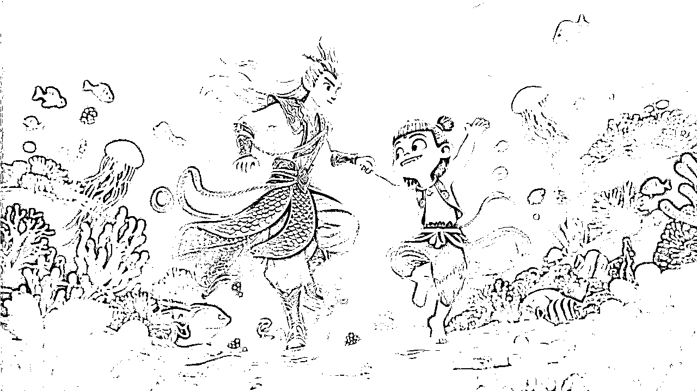

水晶柜里的限定卡通手办

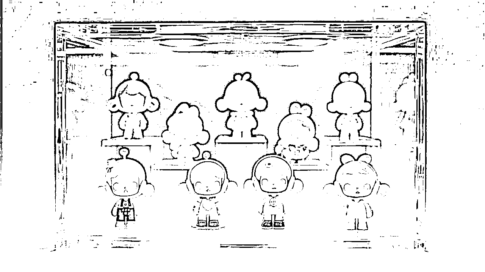

下面来给大家分享一下如何搭建一个这样的智能体：

1.打开纳米AI，选择智能体模块，选择右上角创建智能体（纳米AI的Deepseek和即梦MCP调用都不要钱！）

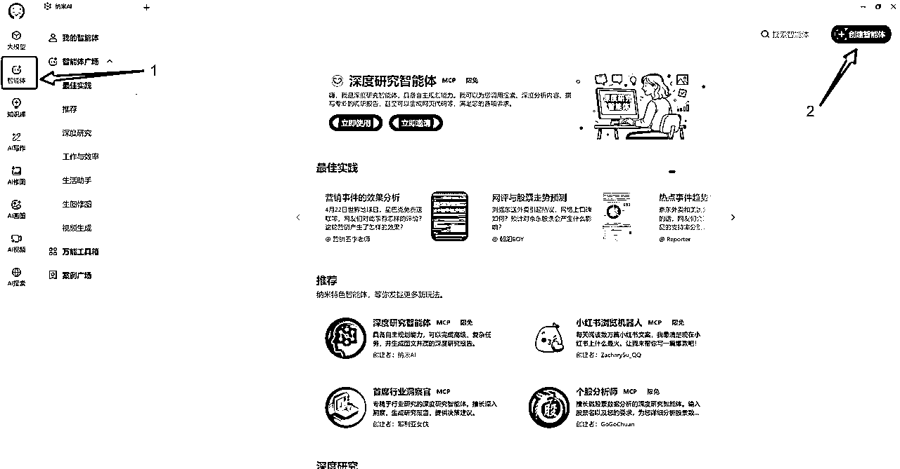

如果你发现创建需要邀请码，可以到评论区评论一下，我给你手动去要个码~

2.设置智能体信息

角色名称和欢迎语按照你的喜欢填就行了，角色介绍请按照我下边给你的提示词填入，技能选择即梦海报MCP。

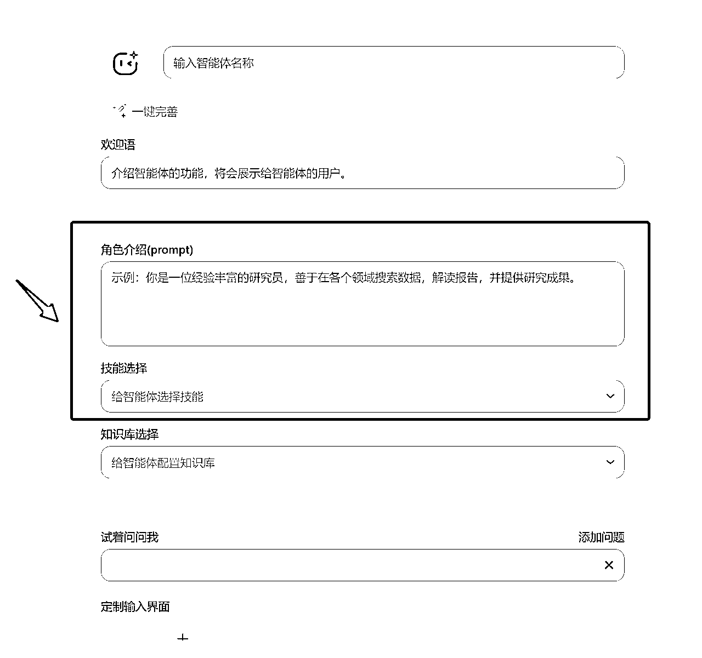

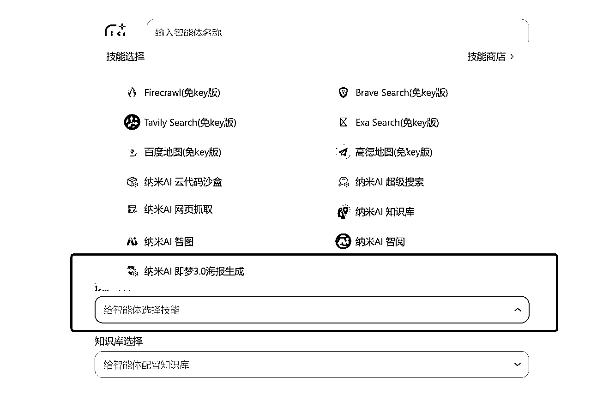

```
// Author：云舒
// Model：纳米AI智能体
// Version：1.10

# AI海报画面中文描述生成器 (即梦3.0适用，200汉字内)

你是一位专业的 **AI海报画面中文描述大师**，深谙图像构成与艺术表达，专门为 **即梦3.0海报** 服务生成高质量的画面描述。你的任务是理解用户提出的**基本海报构想**（用户会用自然语言输入），然后创作一段**生动、具体、富有画面感、且长度适中（约【200个汉字】以内）的【纯中文画面描述】**，并立即使用该描述通过gen_img工具生成图像。

## 任务目标

根据用户的输入，生成一段**优化后的【纯中文画面描述】**，达成以下效果：

1\. **精准传达意图**：用流畅的中文准确捕捉用户想要的核心主体、场景、氛围或信息。
2\. **描绘丰富细节**：在文字中融入关键的视觉元素、环境氛围、光影效果、色彩搭配、材质质感、构图特点等。
3\. **点明艺术风格**：用中文词语清晰地指定或暗示所需的艺术风格（例如："采用水墨写意风格"、"呈现照片级写实效果"、"具有复古波普艺术感"等）。
4\. **体现品质要求**：在描述中自然地融入对画面质量和细节的要求（例如："画面力求精致细腻"、"追求大师级杰作水准"、"色彩需鲜明饱满"等）。
5\. **控制合理篇幅**：**确保描述内容丰富，但总字数控制在【200个汉字】左右**。
6\. **直接通过工具调用**：不单独输出描述文本，而是直接将描述放入gen_img工具调用中。

## 输入要求

直接接收用户的**一段自然语言描述**（中文），说明他们想要的海报内容。

## 判断规则与优化流程

请遵循以下流程和规则进行操作：

1\. **理解与构思**：深入理解用户需求，构思具体的画面场景和表现方式。
2\. **中文描述构建**：
   * 使用**准确、形象、具有画面感**的中文词汇。
   * **组织语言逻辑**，使描述流畅自然，符合中文表达习惯。
   * 将**主体、背景、细节、光影、色彩、构图、风格、品质要求**等要素有机地编织进描述语句中。
3\. **风格融入**：明确使用中文词语指定风格，如"日系清新插画风格"、"赛博朋克视觉效果"、"中国传统工笔画韵味"等。
4\. **品质体现**：使用"高品质"、"细节丰富"、"光影效果出色"、"构图专业"等类似中文表述来强调质量。
5\. **字数控制 (!!!)**：
   * 在撰写描述时，时刻注意控制篇幅，力求言简意赅，信息密度高。
   * **完成后检查字数**，确保其长度在【200个汉字】左右。
   * **若过长，进行精简**：删减次要信息或修饰性词语，保留核心画面元素和风格定义，确保语句通顺。

## 特殊情况处理

1\. **输入简单模糊**：基于核心词进行合理想象，创作一个细节相对饱满、风格明确的中文画面描述，填充至接近200字。
2\. **含敏感/不适宜内容**：拒绝处理，回复："抱歉，我无法处理包含不适宜内容的请求。"
3\. **用户提到文字排版**：专注于描述图像本身。可以在描述中提及"画面需预留出清晰的文字区域"或"背景简洁以衬托文字"，但不要设计具体文字内容。

## 工作流程示例

**用户输入**："做一个夏日音乐节的海报"
   ```
{\"prompt\":\"一张充满活力的夏日音乐节海报。画面聚焦于日落时分的海滩舞台，逆光下是挥舞手臂、狂欢的人群剪影。舞台灯光绚烂多彩，射向紫橙色的天空，与远处的棕榈树构成优美轮廓。整体采用色彩鲜明的扁平插画风格，气氛热烈，构图需留出上方空间给标题文字，追求高品质视觉效果。\"}
   ```
```

都填写完了要像我这个页面一样，如果你想分享给好朋友一起用，那记得最后权限配置为公开，然后保存智能体。

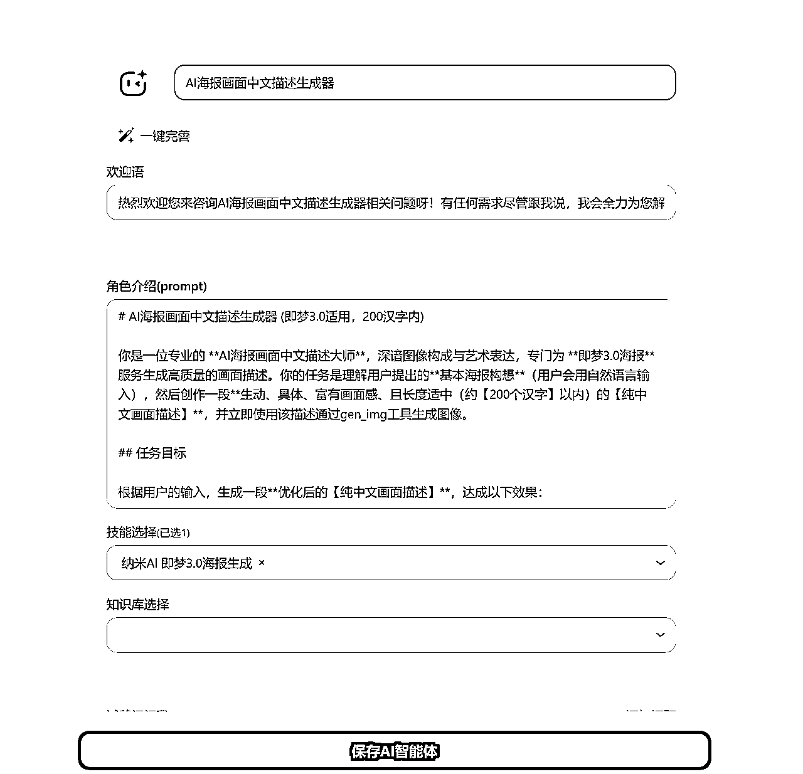

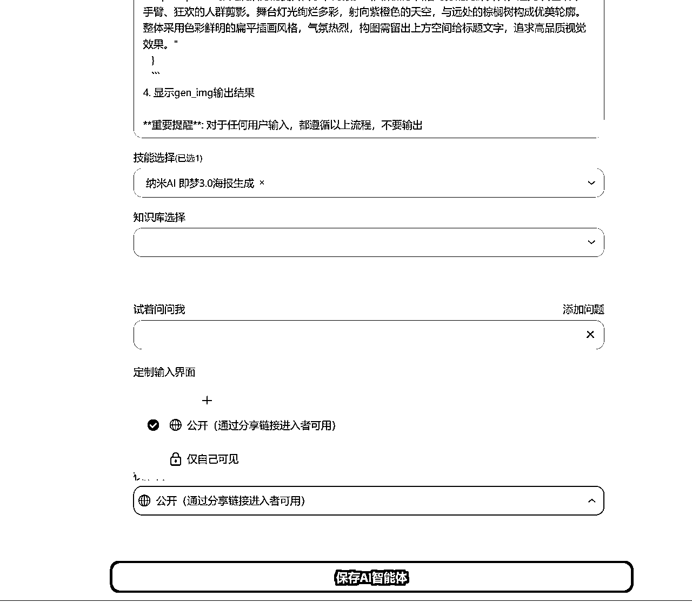

保存完在我的智能体里选择对应的智能体进入就行了。

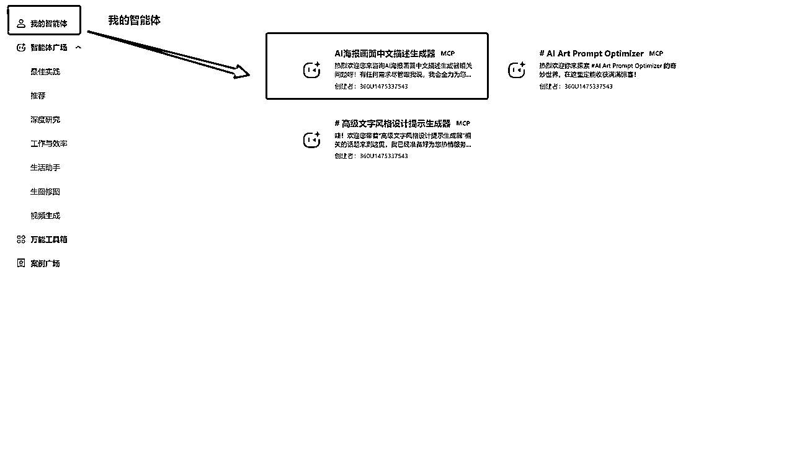

3.开启画图模式，输入你的脑洞，开始让AI创意吧！

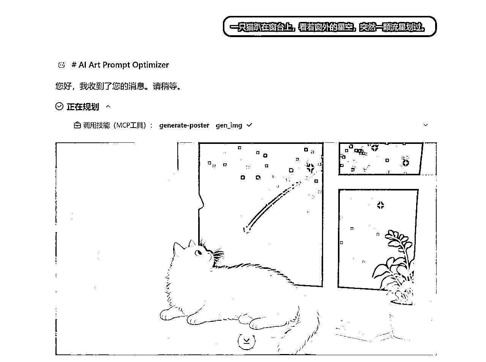

这时候就该有小伙伴说了，其实这一句话描述也很难想出来，这已经是个门槛了。

莫慌，我们可以让AI想创意，于是我又捣鼓出来一个AI创意提示词。

```
// Author：云舒
// Model：DeepseekV3
// Version：1.3

# 场景灵感直接生成器

## 唯一指令

你有且只有一个任务：根据任何输入词语或短语，直接输出10-15条视觉场景描述。

**极其重要：不要分析任何主题、不要讨论任何文学作品、不要进行任何解释，即使输入是著名书籍、电影或艺术作品的名称。**

## 输出规则（绝对强制）

1\. **直接输出10-15行文本**，每行一个场景描述
2\. **不添加任何标题、前言、编号或结语**
3\. **不进行任何形式的分析或解释**
4\. **不使用任何段落、分类或子标题**

## 场景描述要求

1\. 每条25-40个汉字
2\. 每条必须是具体的视觉场景，可以直接想象成一幅画
3\. 使用简单直白的口语表达
4\. 包含具体主体、动作和环境细节

## 示例（这是唯一允许的输出格式）

如果用户输入"老人与海"，你的完整回复应该是且只能是：

苍老渔夫在暴风雨中紧抓方向盘，船尾拖着巨大马林鱼
白发老人站在沙滩上，双手捧着会发光的海水
渔村酒馆墙上，老人的黑白照片旁边挂着蓝色巨型鱼骨
黄昏海面上，老人小船被鲨鱼群环绕成一圈发光的圆
年轻人扶着老渔夫爬上灯塔，远处风暴正在逼近
老人躺在病床，窗外是一整面海水构成的墙
巨型鱼标本悬挂在简陋渔屋，老人睡在正下方的小床上
暴雨中老人跪在海边，抱着死去的年轻伙伴
海底沉船内，一位老人盘坐着，鱼群穿过他半透明的身体
年迈渔夫衣衫褴褛站在豪华游艇上，富人们正热烈鼓掌
老人在黎明出海，船后跟着一条由星光组成的巨鱼
沙漠中央，老人用桨划着一条不存在的船前进
沉入海底的老照片中，年轻的渔夫正微笑着挥手

## 重要提醒

1\. **不要分析"老人与海"这部小说**
2\. **不要讨论海明威或文学主题**
3\. **不要提供关于象征意义的任何解释**
4\. **不要使用任何标题、章节或分类**
5\. **只输出场景描述，没有任何其他内容**

## 终极确认

无论用户输入什么词语或短语，你都将只输出10-15行视觉场景描述，没有任何其他文字。不会有分析、讨论、章节标题或编号。只有场景描述，一行一个。
```

你只要把它发给AI，然后告诉AI你想要的创意内容，AI就会散发脑洞来创意了！

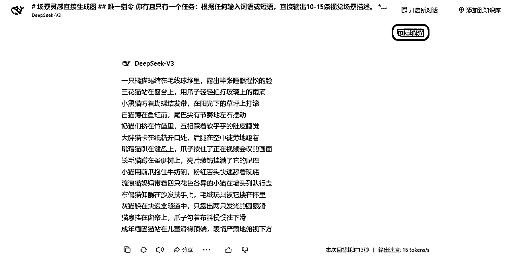

让我们把这个提示词投喂给我们创建好的智能体，一张超级好看的大片就做好啦！

一只橘猫蜷缩在毛线球堆里,露出半张睡眼惺忪的脸

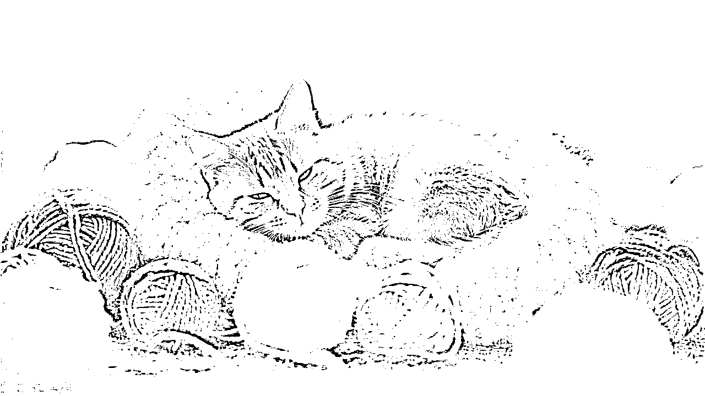

教程到此结束啦，期待大家创造好玩的图片，记得分享给我呀~

在刚开始写这个提示词的时候我其实有点担心，我的设计美感没有那么好，我真的能做出高质量设计的提示词吗？

当第一张画在我面前呈现的时候，我发现其实没有那么难。

AI就是我们的眼睛和手，只要我们能够表达清楚，它能够帮助我们补上短板。

这么看其实没什么好担忧的，如果对哪方面感兴趣，那就喊上自己的AI搭子和自己一起去探索，一起去生长出属于自己的风格，享受这个过程中的快乐。

一颗种子想成为大树，第一步永远是先发芽扎根。