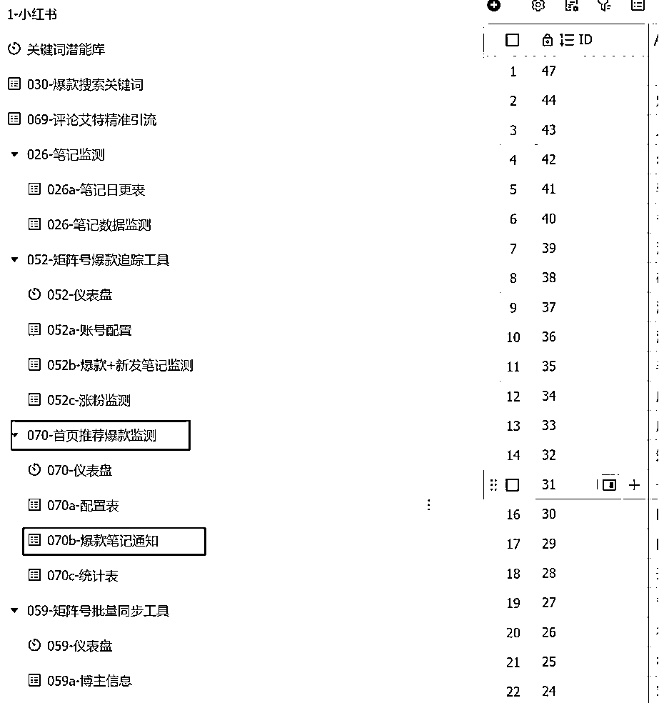
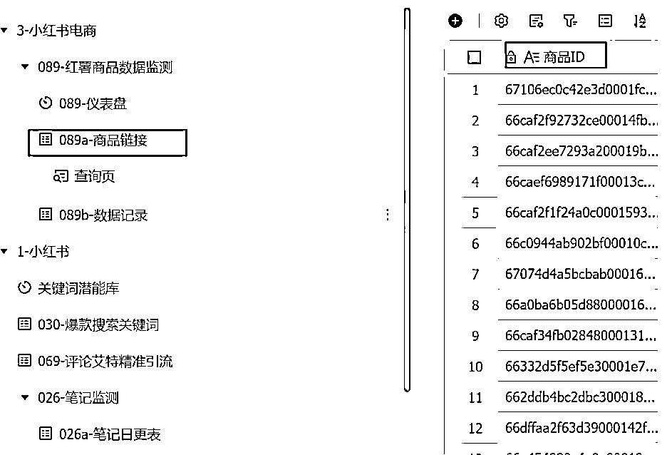
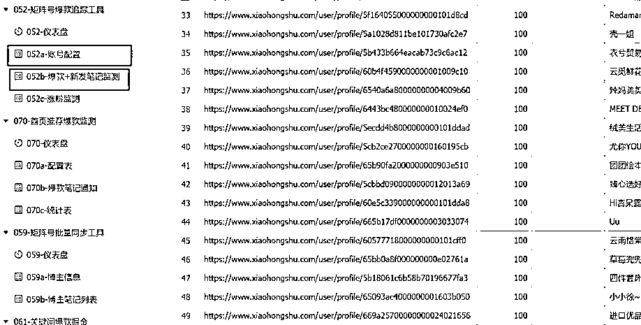
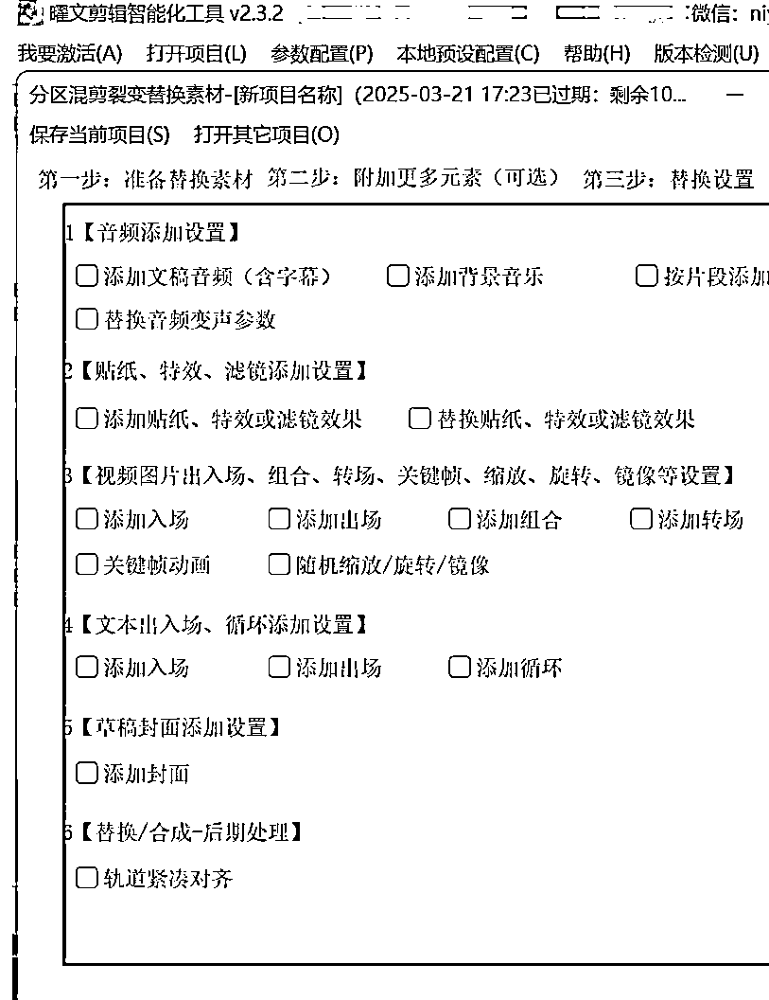
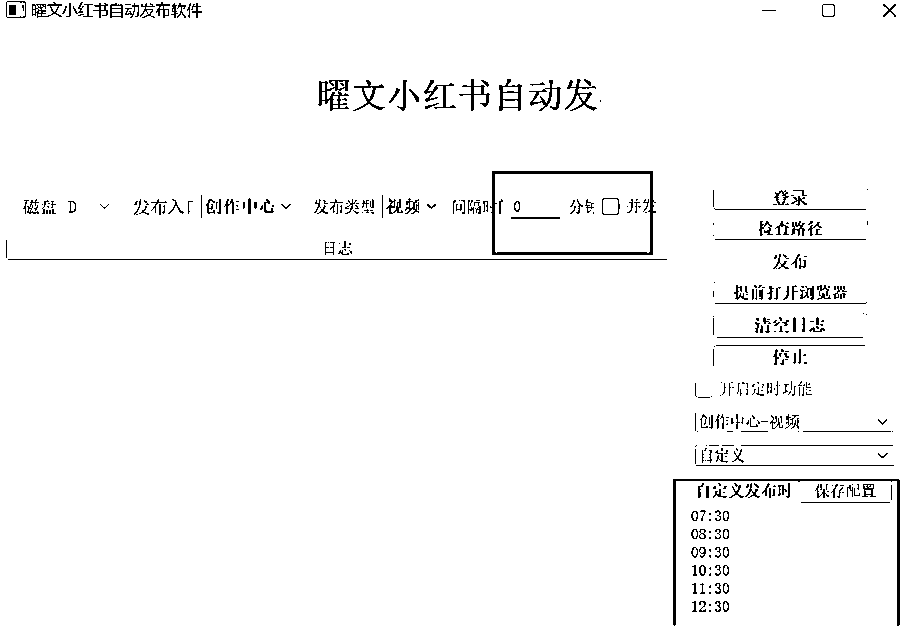

# 小红书自动化运营让效率超级加倍

> 来源：[https://go6xq64elg.feishu.cn/docx/KYnFdbmjToX3ImxlRTSciOVBnJh](https://go6xq64elg.feishu.cn/docx/KYnFdbmjToX3ImxlRTSciOVBnJh)

Hi~ 我是曜文

今天和大家分享我们目前小红书运营在使用的自动化自动化工具在小红书提效20倍！

如果你有这种感觉：每天早上醒来第一件事就是查看数据然后开始一天的"搬砖"工作——研究爆款、策划内容、剪辑视频、编辑文案、安排发布、回复评论...忙得连喝水的时间都没有

别担心！今天我就来把我们运营过程，如何利用自动化工具（内容后附工作流搭建教程点击链接）

让一个人轻松管理20个小红书账号，将效率提升至少20倍！

做正确的事，才能快速看到效果！

## 一、自动化运营体系

1.  提取笔记数据，建立完整分析链

小红书成功的第一步是什么？

对标数据！但手动收集太耗时了，我们目前建立自动化数据采集体系：

*   自动提取笔记数据：设置关键词监控，自动抓取同行爆款内容

*   查看商城数据：输入商品，对标链接，实时追踪商品转化率、点击量

*   Coze工作流：搭建自动化分析流程，一键获取竞品分析，手机点一下自动同步到表格

*   飞书表格记录：所有数据自动汇总至飞书，便于团队协作

我们运营之前每天花3小时手动收集数据，现在用了自动化后，只需10分钟审核数据报告！解放出来的时间都用来做内容策划了，效率翻倍清晰可见。

1.  数据分析与内容优化的自动化

光有数据还不够，还需要分析和优化：

*   自动标记热门话题：飞书机器人会自动标记近期数据高的内容自动推送

*   互动率分析：自动提醒账号内容评论收藏比高，及时进行数据优化

*   最佳发布时间：AI爬取账号历史数据，自动推荐发布时段

数据分析不是目的，而是为了指导下一步内容创作 通过自动化工具，你可以在喝咖啡的时间里完成一整天的数据分析工作！

## 二、视频内容自动化生产线

1.  素材获取与处理自动化

视频是小红书最受欢迎的内容形式，但制作太耗时？试试这些：

*   哼哼猫工具：无水印下载爆款内容，自动过滤低质量内容

*   自动化剪辑工具：根据模板自动剪辑，添加配音、字幕，去重素材

*   自动导出分类：按话题、风格自动分类存储，方便后续使用

举个例子，我们运营之前做的美妆号，每天要剪10个视频，光剪辑就要4小时。用了自动化工具后，输入文案，选择模板，10分钟15个视频就出来了！

1.  批量生产的秘密武器

*   模板库建设：使用飞书创建多维表格针对不同内容类型建立模板

*   一键批量生成：同一素材，不同剪辑风格，批量生成，使用自动剪辑工具批量生成

*   智能添加热门音乐：自动匹配当前热门BGM

*   水印与品牌元素：自动添加账号水印

"工欲善其事，必先利其器" 花一周时间建立好你的模板库，后面每天只需要投喂新素材，就能批量生产高质量内容了！

## 三、图文笔记的自动化生产

图文笔记虽然看起来简单，但要做好同样不容易

下面是自动化的秘诀：

1.  模板自动替换系统

*   设计多套模板：不同风格的图文模板，适应不同主题

*   文字内容自动替换：输入关键词，AI自动生成相关文案

*   AI自动抠图换场景：产品图自动换背景，提升精致感

*   智能排版：根据内容长度自动调整排版，美观大方

使用可画设计模版批量套图https://www.canva.cn/

种草号，每天要P10张图，编辑5篇文案，忙得焦头烂额 用了自动化工具后，选好产品图，AI自动帮我换背景、生成文案、套用模板，效率提升了10倍！

1.  一键美化与优化

*   智能配色：根据主图自动选择协调的配色方案

*   热门话题标签推荐：自动推荐相关热门标签

*   标题优化：AI分析爆款标题特点，自动优化你的标题

*   智能排版检查：自动检查排版问题，提供优化建议

准备10套不同风格的模板，接下来一个月就能轻松用这些模板快速生产内容了！

## 四、自动化发布与互动管理

1.  对标账号，提取爆款，去重优化

*   定期对标账号：自动监控同领域头部账号动态

*   爆款内容提取：自动识别近期爆款要素

*   内容去重优化：避免重复内容，AI辅助二次创作

*   自动发送笔记：按照预设时间自动发布内容

"不要重复发明轮子"，研究爆款是最快的学习方式。

通过自动化工具，你可以持续追踪同行的爆款，提取其中的成功要素，应用到自己的内容中。

## 五、自动化复盘与持续优化

自动化不是一劳永逸，而是需要持续优化的过程：

1.  周期性自动复盘

*   每周数据报告：系统自动生成周报，包含关键指标

*   内容表现分析：哪些内容效果好，哪些需要改进

*   竞品动态监控：自动追踪竞争对手的内容变化

*   趋势预测：根据历史数据，预测未来内容方向

复盘不是为了数据而数据，而是为了发现问题，指导下一步行动！

1.  持续优化的良性循环

*   重复的动作交给AI：发布、互动、数据采集等

*   优化动作交给人：内容策略调整、创意升级等

*   建立优化闭环：数据分析 → 发现问题 → 调整策略 → 再测试

每周五固定做复盘，把一周的数据分析透彻，然后调整下周计划 三个月下来，他的账号从0变现了5W＋，关键全程自动化只需要优化内容！

## 六、一个人管理20个账号的秘诀

通过自动化工具，一个人真的能管理20个小红书账号吗？答案是肯定的！

1.  多账号统一管理平台

*   账号分组管理：按不同领域、不同定位分组

*   统一内容日历：所有账号的发布计划一目了然

*   批量操作功能：一键执行多账号任务

*   权限管理：可设置不同权限，方便团队协作

1.  差异化运营策略

*   内容模板差异化：确保每个账号有独特风格

*   发布时间错开：避免同时段发布造成竞争

*   主题细分：即使是同一领域，也要细分不同切入点

*   互动标签管理：不同账号互动不同社区，避免重合

我们有的运营一个人管理20个美妆号，每个号都有不同定位：学生党、宝妈、上班族、美妆工具、平价种草等。 通过自动化系统，她每天只需工作4小时，却能维持所有账号的日更！

## 总结：自动化是小红书成功的加速器

在小红书这个竞争激烈的平台上，自动化工具就像是你的秘密武器，能让你以一敌十，甚至以一敌百！

1.  找准自己的定位

不盲从热门，结合自己的专业和兴趣，找到独特价值点。用自动化工具帮你快速测试不同方向的效果。

1.  从简单开始，建立工作流

先建立基础的自动化流程，再逐步完善。第一个月的目标是跑通从0到1的全流程，建立创作习惯。

1.  持续复盘，系统优化

定期分析数据，收集用户反馈，有针对性地优化内容。让系统越来越智能，越来越符合你的需求。

自动化工具只是工具，核心还是你的内容价值和创意

把重复性工作交给AI，把创意和策略留给自己，这才是真正的效率提升！

希望这篇文章对你有所帮助！

如果你正在小红书创作的道路上奋斗，不妨试试这些自动化工具，让你的创作之路事半功倍！