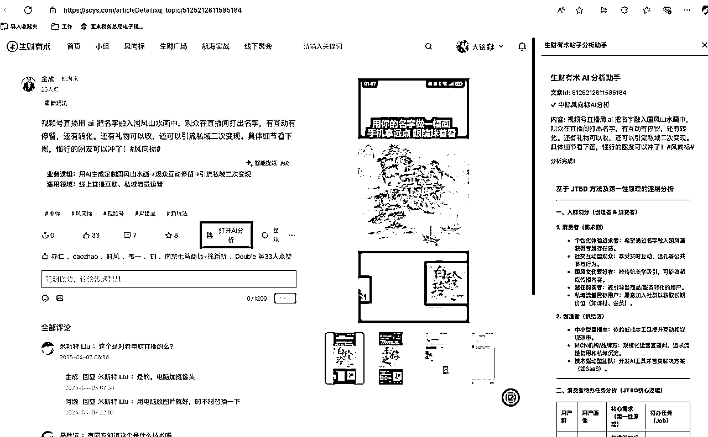

# 生财布丁的诞生

> 来源：[https://rxas35pmvn.feishu.cn/docx/KiyCdoN2togyzixrfmocJzq6n1e](https://rxas35pmvn.feishu.cn/docx/KiyCdoN2togyzixrfmocJzq6n1e)

# 

生财是一个非常高质量的社群，高质量的内容，高质量的人，不计其数。

但是丰富也就意味着难啃

大家一年花上千块钱进生财，看着这堆内容，如果不能快速的吸收精华，不能透彻的理解内容，那就亏死了。一定要想办法把生财的每一滴汁水都挤出来吸收到。

我相信很多人有这个需求，反正这个问题困扰我很长时间了。我想快速挖掘真金白银！

于是有了生财布丁

# 生财布丁是什么

自动识别并分析生财有术#中标/#风向标帖子，AI辅助分析与对话。

生财布丁🍮 - 生财有术帖子分析助手

下载地址： chromewebstore.google.com


生财有术 JTBD 分析助手

本扩展可自动识别并分析「生财有术」网站（scys.com）上的 #中标/#风向标帖子详情页，结合 AI 能力，自动提取页面内容并进行结构化分析。

- 支持自动检测合规页面，侧边栏一键展示分析入口

- 分析结果以 Markdown 形式美观展示，支持表格、分段、列表等格式

- 支持多标签页、页面切换自动刷新，体验流畅

- 适合 JTBD（Job To Be Done）分析、用户需求洞察、竞品/案例分析等场景

使用方法：

1\. 访问 scys.com 的中标/风向标详情页，侧边栏会自动弹出分析入口

2\. 分析结果将在侧边栏自动展示

3\. 支持多页面切换、自动刷新，无需手动操作

注意事项：

- 仅在 scys.com 的中标/风向标详情页生效

- 本扩展不会收集或上传任何个人隐私信息

# 是怎么想到要开发生财布丁的

## 工具侧的思考

那段时间刚好 Cursor 升级到 0.49.6，感觉 auto model 有了很大的变化，所以也希望测试一下，具体的变化我在实施的部分会提到

## 内容侧的思考

生财布丁的目的是为了更好的使用生财有术这个社群。

生财有术里最重要的是内容。很多圈友已经分享了如何更好地运用这些精华内容。如果把所有内容比作金矿，挖掘这座金矿有两个难点：一是读懂当前内容在说什么；二是当想进行更深度阅读或解决当前问题时，如何找到更多相关内容。

总结下来就是两点：

1.  这篇文章讲了什么

1.  如何找到合适的相关文章

### 数据的角度思考生财的内容

生财的宝藏是内容，而且生财的内容是有一个人工的筛选的，有两个被生财认证过的内容

*   中标的风向标，认证的商业机会

*   精华文章

这是被筛选过的内容，也就是被清洗过的内容。这些清洗过的内容是生财的精华，是亦仁、生财的大脑帮我们做了筛选的结果。

我们只要更好的使用这些内容，如何使用？

### 内容到底讲了什么

我们每个人并不是万能的，意思就是我的领域我明白，别人的领域也就听个大概，甚至很多别的领域的积累没有的情况下，是无法深度的洞悉内容到底在讲什么，有哪些隐藏的知识如何挖掘出来。

提问？没得问题，我问不出来自己不知道的东西。

如果能有一个人/工具，帮我把这些内容，从最本质的角度讲明白就好了

### 如何快速的找到内容

生财还有一种使用方式是进行检索，就是找到我现在关心的内容，能够根据我提出的问题找到内容，甚至能够根据我提出的问题判断我关心的本质问题，然后再找到内容

现在的内容组织方式是

*   筛选（精华、中标）

*   标签（分类）

内容的检索方式为

*   关键字

现在还不能特别好的回答我的问题，理解我的问题，理解并帮我检索回答

#### 内容的联动

如果内容可以联动起来就更好了

*   中标的精华帖看到商业机会， What

*   精华帖寻找这个机会的详细解释 Why，以及如何落地实操 How

要是一个工具帮忙分析文章到底讲了什么，能更有针对性的找到我要的文章就好了

因为上面都是我自己的需求，所以生财布丁，本就准备作为一个测试工具的小项目，就这么诞生了

# 开发过程落地和产品思考

## 思考第一步，我到底要一个什么样子的产品

因为只是做一个工具测试（Cursor 0.49.6），所以就想在 2 天内完成第一个版本，就一定要保障第一个可以跑起来的版本是足够小的

我的目标

1.  帮助我更方便的看生财

1.  产品足够小

1.  要可以发布，被别人使用

### 帮助我更方便的看生财

基于上面我对生财的内容的理解，这个工具要不解决

1.  告诉我这个文章讲什么

1.  帮助我检索内容

2 我做过一些技术的探索了积累，很难在 2 天内做到非常简单，要做的事情非常多。而 1 很可能只需要一个提示词套壳就可以了。

那就来做内容分析

#### 为什么选择分析中标的风向标

生财的精华是宝藏，宝藏就意味着很大很全，那一套分析的提示词可能是不够用的。

一个讲思维方式的文章，和一个某个项目实操落地的文章，用一套分析方式，一套提示词，不合适吧。 暂时先不足精华帖分析

风向标就是一个好选择，所有的风向标都是商业机会，非常聚焦。

中标的风向标是被验证的，基本上是应该有供需和具体方向性的，所以一套提示词搞得定。

#### 怎么分析内容

分析内容的前提是得有内容可被分析。 是个废话！是个废话？

内容可以从哪里获得？技术性的，自动的，站在每个用户自己本地的角度

*   爬虫，但是我无法方便的让每个人都跑个爬虫吧。

*   页面内容抓取，浏览器插件可以搞得定

故选择浏览器插件的形式

### 第一个版本的产品的需求

完全是自己给自己的需求

1.  可以在浏览器里面看到中标风向标的内容分析

1.  可以向这个风向标提问，问啥不知道，怎么回答不知道。既然不知道，砍掉

## 思考第二步，这是我自己的需求，还是一个大众的需求

这个需求点，首先来自我自己的需求，更好的方便我看生财的文章。当然我也希望以后可以更好的帮我发现、分析、落地商机。

可以从几个点进行辅助验证

*   生财有数迎新的新人贴阅读量巨大，说明生财用户对内容有需求

*   微信、小报童、知识星球，大量的付费商机社群，付费用户都在千人以上

*   虽然需要下载安装，很不方便，但还是有很多群友点赞评论

同时也收到了一些群友的反馈，比如自定义提示词进行分析，对精华等文章进行分析，也进一步说明了大家是有需求的

这也许不是一个超级大的需求，但拥有一定的用户量是没问题的

## 从 0 使用 Cursor 构建生财布丁浏览器插件 （这部分都是开发向的，不感兴趣可以折叠这部分内容跳过）

我没做过浏览器插件，我对浏览器插件开发的了解只知道需要使用 V3 版本，能用 JavaScript 写，完了

就靠 AI 了

### 语音输入第一版需求

新开一个项目，全空。找一个可以语音输入的软件，我用的是豆包桌面版，借助语音录入的功能


可以看到，这里面有大量的语音录入出问题的地方，尤其是中式英语他识别不到位啊

*   Forever → Server

*   Logo issues → Local Issues

*   Melstone → milestone

最后的地址是我手工贴进去的

没问题，就这样的输入的内容，Cursor 能看得懂。

（Local Issues 的内容请看我之前的文章 ）

Cursor 生成的内容为

```
# 001-story-chrome-extension-for-scys-article-analysis

# Title
创建生财有术帖子分析Chrome插件

# Story
作为一名生财有术社区用户
我想要一个浏览器插件能自动识别并分析带有"#中标"和"#风向标"标签的帖子
以便能快速获得对这类帖子的AI辅助分析，提升阅读效率和理解深度

# 基本概念
- 生财有术：一个分享创业、副业和赚钱经验的在线社区平台
- 中标/风向标：社区内特定的内容标签，通常代表值得关注的趋势或机会
- 侧边栏分析：在不离开原网页的情况下，在右侧展示补充分析内容
- AI辅助分析：使用AI技术对帖子内容进行结构化理解和见解提取

# 场景
前置条件:
- 用户已安装Chrome浏览器
- 用户已安装此Chrome插件
- 用户正在浏览生财有术网站

主要流程:
1\. 用户访问一个生财有术的帖子页面（如：https://scys.com/articleDetail/xq_topic/1524418825214852）
2\. 插件自动检测页面是否包含"#中标"和"#风向标"标签
3\. 如发现标签，自动在浏览器右侧打开侧边栏
4\. 插件读取帖子主体内容并将其发送到服务器
5\. 服务器使用AI分析内容并返回结果
6\. 插件在侧边栏中显示分析结果
7\. 用户可以在侧边栏底部输入框中提出后续问题
8\. AI根据帖子内容和上下文回答用户提问

异常处理:
- 网络连接失败：显示错误信息并提供重试选项
- 内容解析失败：提示用户可能的原因（页面结构变化等）
- 服务器响应超时：设置合理的超时提示和重试机制

# 验收标准
功能要求:
- [ ] 插件能够正确识别包含"#中标"和"#风向标"标签的帖子
- [ ] 能在浏览器右侧打开侧边栏
- [ ] 能准确提取帖子主体内容
- [ ] 能将内容发送到服务器并接收分析结果
- [ ] 侧边栏有对话输入框支持后续提问
- [ ] AI回复内容符合用户期望的分析深度

非功能要求:
- [ ] 插件启动不影响页面正常加载和浏览
- [ ] 内容提取过程无感知（<1秒）
- [ ] 服务器响应时间控制在可接受范围（<5秒）
- [ ] 界面设计符合直觉，易于使用

# 子任务
- [ ] 002-feat-chrome-extension-setup 创建基础Chrome插件结构
- [ ] 003-feat-content-detection 实现页面内容和标签检测功能
- [ ] 004-feat-sidebar-implementation 实现浏览器侧边栏功能
- [ ] 005-feat-content-extraction 实现帖子内容提取功能
- [ ] 006-feat-server-communication 实现与服务器的通信
- [ ] 007-feat-ai-analysis-integration 集成AI分析结果展示
- [ ] 008-feat-chat-interface 实现对话界面功能

# 依赖关系
技术依赖:
- [ ] {DEP-001} Chrome扩展开发环境
- [ ] {DEP-002} 服务器API接口（支持AI分析请求）
- [ ] {DEP-003} 网页内容解析技术（DOM操作）

业务依赖:
- [ ] {BIZ-001} 生财有术网站页面结构的稳定性
- [ ] {BIZ-002} 获取生财有术对外部工具的使用政策

# 状态历史
- 2025-04-26: 创建

```

然后让 Cursor 生成 issues，前几个 issues 就可以帮我快速了解项目的技术框架

```
# 002-feat-chrome-extension-setup

# Title
创建基础Chrome插件结构

# Introduction
搭建Chrome插件的基础框架，包括manifest.json配置，background scripts，content scripts等基础组件的设置。确保插件具备所需的基本功能和权限配置。

# Tasks
- [ ] 创建项目基础目录结构
  - manifest.json
  - background.js
  - content.js
  - popup.html/js
  - styles/
  - assets/
- [ ] 配置manifest.json
  - 基本信息（名称、版本、描述）
  - 权限配置（tabs, storage, activeTab, host permissions）
  - CSP设置
  - 资源引用
- [ ] 实现基础background script功能
  - 插件生命周期管理
  - 基础事件监听
- [ ] 实现基础content script功能
  - 页面注入逻辑
  - DOM操作基础设置
- [ ] 创建基础UI组件
  - 插件图标
  - popup页面基础结构
- [ ] 添加开发环境配置
  - 配置webpack/vite等构建工具
  - 设置开发热重载
  - 添加基础lint规则

# Dependencies
- [ ] {001-story-chrome-extension-for-scys-article-analysis} 主用户故事
- [ ] {DEP-001} Chrome扩展开发环境

# Status History
- 2025-04-26: 创建
```

```
# 003-feat-content-detection

# Title
实现页面内容和标签检测功能

# Introduction
开发页面内容检测机制，用于识别生财有术文章页面中的"#中标"和"#风向标"标签，并触发相应的插件功能。

# Tasks
- [ ] 实现URL匹配检测
  - 识别生财有术文章页面URL模式
  - 设置URL变化监听
- [ ] 开发标签检测功能
  - 实现DOM解析器
  - 添加"#中标"和"#风向标"标签检测逻辑
  - 处理动态加载内容的情况
- [ ] 实现检测结果通知机制
  - 创建检测结果事件系统
  - 实现background script和content script间的通信
- [ ] 添加性能优化
  - 实现节流/防抖机制
  - 优化DOM遍历性能
- [ ] 添加错误处理
  - 处理页面结构变化异常
  - 添加重试机制
- [ ] 实现检测状态管理
  - 存储检测结果
  - 管理检测状态生命周期

# Dependencies
- [ ] {001-story-chrome-extension-for-scys-article-analysis} 主用户故事
- [ ] {002-feat-chrome-extension-setup} 基础插件结构
- [ ] {DEP-003} 网页内容解析技术

# Status History
- 2025-04-26: 创建
```

### 项目结构的设计

我不想暴露我的提示词，更不想暴露我对内容的操作过程，所以具体的操作步骤我是不可以放在插件里面的，一定要有一个 Server 端的程序接收内容，并返回结果。

从一开始，项目就有两部分

*   浏览器插件，识别内容，传送给 Server，展示结果

*   Server 端，主要是用来做数据接口

基于此，开始和 Cursor 进行第二次对话


Cursor 会给出建议

```
jtbd-fxb/
├── apps/                       # 所有应用程序
│   ├── extension/              # Chrome插件
│   │   ├── public/             # 静态资源
│   │   │   ├── manifest.json   # 插件配置文件
│   │   │   ├── icons/          # 插件图标
│   │   ├── src/                # 源代码
│   │   │   ├── background/     # 背景脚本
│   │   │   ├── content/        # 内容脚本
│   │   │   ├── popup/          # 弹出窗口
│   │   │   ├── sidebar/        # 侧边栏组件
│   │   │   ├── components/     # 共享UI组件
│   │   │   ├── utils/          # 工具函数
│   │   │   ├── services/       # 服务层（API通信等）
│   │   │   ├── types/          # 类型定义
│   │   ├── tests/              # 测试文件
│   │   ├── package.json        # 依赖管理
│   │   ├── vite.config.js      # 构建配置
│   │   
│   ├── server/                 # 服务器端应用
│       ├── src/                # 源代码
│       │   ├── controllers/    # 控制器
│       │   ├── services/       # 业务逻辑
│       │   ├── models/         # 数据模型
│       │   ├── routes/         # 路由定义
│       │   ├── utils/          # 工具函数
│       │   ├── config/         # 配置文件
│       │   ├── types/          # 类型定义
│       ├── tests/              # 测试文件
│       ├── package.json        # 依赖管理
│       
├── packages/                   # 共享包/库
│   ├── common/                 # 通用功能
│   │   ├── src/                # 源代码
│   │   │   ├── types/          # 共享类型定义
│   │   │   ├── utils/          # 共享工具函数
│   │   ├── package.json        # 依赖管理
│   │   
│   ├── ui-components/         # 可能的共享UI组件库
│       ├── src/
│       ├── package.json
│       
├── .issues/                   # 项目管理和需求
├── .gitignore                 # Git忽略文件
├── package.json               # 根目录包配置
├── pnpm-workspace.yaml        # pnpm workspace配置
├── tsconfig.json              # TypeScript基础配置
├── turbo.json                 # 可选：Turborepo配置
└── README.md                  # 项目说明
```

从这里基本上可以开始正式开发了

### 开发过程，略

## 第一版 V0.1.0 本地可用

一天不到，就做成了一个本地的测试版本，本质上是一个套壳提示词的包装，所以这个速度会很快

因为我还想做提问，所以花了一些时间是做浏览器侧边栏，第一个版本也是在侧边栏进行内容展示



### 在 Chrome 市场上架

访问 https://chrome.google.com/webstore/devconsole/ ，认证基本资料，然后交 $5 刀，就可以提交应用了

#### 提交应用要注意

1.  信息资料完整

1.  权限要设置的合适 这部分我是一边问 AI 一边提交的，当时也不知道到底应该给什么权限，一方面是要在提交的时候的选择，另一方面也要在 manifest.json 里面设置

1.  隐私页面，需要一个隐私页面，这个当然 AI 生成 生财有术 JTBD Chrome 扩展隐私政策

我就是在第一次提交时候 manifest.json 中，多添加了个需要在页面执行 script 的权限，导致审核失败。再次提交过了

整个的审核过程，断断续续的，两周才完成上架。 这个过程，就只能通过打包的 zip 文件进行 Chrome 的本地开发者模式进行安装

这时候开始小范围给一些朋友试用，但开发这模式本地安装的确是太麻烦了

### 第一版遇到的问题

在真实使用的时候，会发现一个常见的浏览方式是在不同的浏览器标签中不断的进行切换，当前访问的标签可能是

*   中标的风向标，正确的需要分析和展示结果的标签

*   scys.com 的其他页面（非中标的风向标）

*   非 scys.com 的页面

如果希望一个比较好的体验，就是在中标的风向标中才展示对应的内容，而且切换到不同的中标的风向标的页面，侧边栏要展示的内容也要正确的切换；如果是访问其他的页面，要提示进入中标风向标才能使用

这个体验太怪了， 而且非中标风向标的页面，右侧还要占据一个很大的侧边栏的位置，还是无效的内容，不可接受。

同时技术上也存在一些问题，要在当前页面，要等待抓取的内容层面有很多的处理。 工作很大，收益超级小

#### 再次思考为什么要使用侧边栏作为展示区域

侧边栏，作为一个固定在浏览器侧边的区域，有独立的完整的交互区域，可以做很多事情，非常适合做深度的交互。

但是在我们的第一个版本中，以展示为主，真的需要有一个单独的，暂时用不到的，技术难度很大的区域么？

如果把内容展示在内面内呢？就好像


这好像也是一个不错的选择哦

带来的好处

*   页面展示直接

*   不用显示的告诉用户要访问什么网站，怎么才能展示出来内容

*   技术操作简单

#### 问答怎么办？

我们要的是问答么？还是一个针对当前中标风向标的深入研究？还是检索？还是其他？

不知道。 既然不知道，那就砍掉

## 第二版 V0.2.x

趁着 Chrome 插件市场还没过，赶紧升级

### 首先询问现状，通过代码和 AI 学习

再次说，我对开发 Chrome 插件不熟悉，甚至完全不知道，所以借这个机会，不断向 AI 追问，用来快速学习


### 修改插件

简化插件模型，找到页面要展示的位置，插入内容。

*   只在中标风向标页面展示分析结果

*   侧边栏启用（代码不删除，谁知道以后可以用在哪里呢）


## 第三版 V0.3.x ？

回到对内容的思考

1.  这篇文章讲了什么

1.  中标的风向标 ✅

1.  精华文章

1.  如何找到合适的相关文章

如果添加对内容源的思考呢？

如果添加对人的思考呢？

🏃‍♀️希望生财布丁可以是一个起点～

# 后续的商业机会的一些思考

## 浏览器插件是一个巨大的快速入门的商业市场

Chrome 浏览器占据现在整个浏览器市场超过 7 成，算上兼容 Chrome 插件的浏览器（如 Edge 等）已达到 9 成左右，浏览器插件从开发难度低，和页面结合深的角度，还是一个很好的市场

从浏览器到独立站的过程也是非常顺畅的。

### 浏览器插件是天然的浏览内容的爬虫

通过浏览器可以很方便的和网页内容进行互动，浏览器插件也支持网络调用等很多功能，这样就可以特别方便的做一个大模型的套壳

1.  阅读网页内容

1.  给定提示词

1.  大模型调用

1.  返回并展示大模型结果

这个顺序是可以做很多事情的，比如我们有很多可视化提示词，那就特别方便结合浏览器插件，把页面可视化

按照这个路径，相信圈友可以创造出很多有意思的东西

## 生财布丁的商业可能性

生财布丁如果站在内容的角度可以做成更好的生财内容的辅助，如果站在商机发现和分析的角度，可以引入更多的商机和商业产品分析的内容，如 Reddit， ProductHunts， Hacker News 等

### 轻量级商机发布、分析工具

扩大内容源，生成商机发现分析日报、周报，进行付费订阅

### 个人副业分析工具

帮助每个人，根据自己的情况，推荐适合用户的副业机会

*   适合用户的机会

*   副业雷达

*   分析用户给的机会

*   商机实操落地

*   找到同类竞品、竞品分析