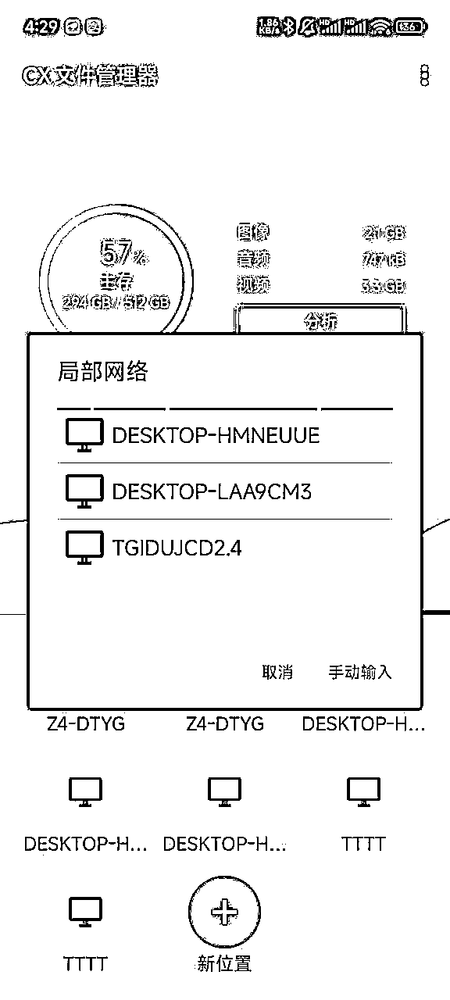

# 新手全平台矩阵化操作指南：从0到1，如何省钱搭建矩阵

> 来源：[https://udxxg5rx5m.feishu.cn/docx/H5DmdTJmyoYp3QxB5IBcoAQknxf](https://udxxg5rx5m.feishu.cn/docx/H5DmdTJmyoYp3QxB5IBcoAQknxf)

我是施仁，【星球编号】43456

擅长自动化软件编写，深耕过各种小众领域项目。

也为一些工作室提供高效人工+工具自动化解决方案。

多账号矩阵管理工具，

目前断断续续开发更新快两年，最近打算招代理合作。有合作意向可以联系。

工具介绍页：

这个是我从2019年开始，

操作账号矩阵，一直到现在总结的经验，

能尽量让新手少走一点弯路。

少花一点冤枉钱。

毕竟在项目初期拿到结果不明显的情况下，

投资的成本少一点就可以最大化投产比。

之前写了矩阵化操作的一些省钱方式，

但是当时因为某些东西写的想当然，

以至于没接触过的朋友有的不知道该从哪里入手，

针对我最近了解到的一些问题，这次我直接花了些时间从头一步一步讲。

整理了一部《互联网，多账号矩阵搭建指南》。

手把手教你如何一步一步搭建。

## 本次主要增加内容：

如何购买最低月租套餐。

如何更改手机号为最低月租套餐。

三大运营商手机号注册小号具体操作流程。

多设备数据互传方案分享。

群控手机软件推荐等

内容主要讲了一个人做项目如何批量放大操作，

该如何高效且低成本拥有并管理多个手机号，

提供了矩阵管理账号的方法，

主要是从长期性价比和实用性的方向上来给出的方案。

理论上适用所有平台。

所需的所有电脑端、手机端工具最下方有总结整理。

# 《互联网，多账号矩阵搭建指南》

# 如何高效注册多个手机号？（成本：一个号一个月5元-12元）

首先最基础的就是手机号。

目前，互联网中如果想要一个人拥有多个手机号，常见的方式就是注册卡。

一个人可以在不同品牌下实名注册多个手机号。

优点： 月租费用相对较低。

缺点： 品牌太多，管理上比较困难。我之前曾经实名注册了四十多张卡。平时不用时倒没什么问题，但一旦开始使用，就会遇到各种麻烦。最常见的就是二次实名风控，导致经常接不到验证码。每次询问卡商时，才得知需要再次实名解除风控。因为卡的品牌不一，风控措施也不同，每次解除风控的操作方式都不一样，久而久之就变得非常麻烦。

最初这些卡几乎都能顺利使用，

但随着时间推移，陆陆续续有些卡出现了问题，

经过多次操作后，我也不再愿意去解除风控。

最后这些卡只剩下了几张能用的。

所以我的感受就是，

要搞手机号还是主流的三网卡最方便。

但是三网卡也有区别，移动卡可以注册和多号（上限3），联通卡可以注册联通小号（上限4），电信目前没有小号。

我指的小号并不是插在手机卡里的手机号，而是绑定号。

注册小号是通过APP登录，比如移动就是和多号app,联通是微信里联通小号。

在APP里申请一个手机号，这个手机号可以通过你的实体卡接到电话和短信，相当于是一个号有了马甲，他实际并没有实体卡。

先说一下我整理的表格，三网分别可以注册的小号和价格。

一个实名可以注册的账号信息如下，

运营商套餐对比表

说明：

*   移动： 最低套餐为9元，每个额外小号的费用为5元，四个号码的总费用为24元，性价比中等，但注册没有地区限制。最大的优点是可以直接绑定到支付宝进行自动充值，绑定多少个移动号都可以。当话费低于10元时，会自动进行充值，使用起来非常方便。

*   联通： 最低月租为8元，每个账户最多可以注册4个小号。如果选择优惠方案，每个号的年费为48元（某些地区有注册限制）。不过，根据不同地区的政策，可能无法注册小号。而且，联通小号只有在注册时才能购买优惠套餐，活动期结束后，每个号的月租会涨到12元，费用相对较高。另外，自动充值功能有限制，每个支付宝账户最多只能绑定一个号码。

*   电信： 最低消费为5元/号。电信的小号服务已经下线，目前只能注册实卡，但月租为最低。

## 移动号如何设置自动充？

支付宝搜索 自动充 进小程序就可以了，最低可以设置，低于10元自动充。

## 小号如何注册？

移动：

手机下载和多号app，

用你的移动卡接码登录，

因为这个APP不能截图，我就另外的手机拍照简单说一下。

因为我的和多号已经三个了，所以没有申请按钮。

如果你和多号少于三个。

页面会有一个申请虚拟副号的按钮，

点按钮会进入选号界面。

按他的步骤一步步就会申请下来，很快。

需要注意的是。注册和多号，一个自然月只能注册一个。

联通：

微信搜联通小号，

这里有在线申请，但是这个申请分区域，不是每个地区的联通号都可以申请的。

点在线申请会跳转到联通客户端，所以手机最好先下个联通客户端。

电信小号：

天翼小号目前不开放，所以无法注册。

## 最低套餐如何办理？

TB、PDD上搜，但是一定要仔细看他的要求。

不要是什么合约优惠套餐（前几个月优惠后面涨价）

一定要找真正的最低套餐，没有任何合约的。

也可以用已有的卡去转最低套餐，

移动10086

联通10010

电信10000

打客服电话转人工，记着一定要转到你手机号归属地的客服，

直接说你要求转最低套餐保号。

只要你号上没有什么合约限制客服是没有理由拒绝的。

客服会先跟你核实资料。

手机号，姓名，服务密码。

这个都提前准备好。客服核实完没有问题。

会告诉你已经帮你申请了。

24小时内会打电话或者发短信到你要修改套餐的手机号让你确认。

当然如果有合约也可以试一下看客服能不能给你转。

# 手机号最优解：

条件允许的情况下，可以考虑找几个朋友帮你，一人只用实名一张移动卡即可。

一张移动卡可以注册三个和多号，

一个手机插两张移动卡，相当于可以接8个手机号的验证码（2移动号+6个和多号）。

然后把实卡绑定支付宝自动充。话费快没的时候就自动扣钱。

如果你拥有多个手机号，套餐不同月租不同导致的手机话费轮流欠费，

在实操项目的时候真的很耽误事，

但是自动充值这个功能对我来说是真的太省心了。

而且小号的话费是从实卡主号扣除，所以只需要充实卡话费就行。

# 一个人如何拥有多个邮箱？（成本：0元起）

国内其实需要邮箱作为必要条件的并不是很多了。但还是要提一下。

先说谷歌邮箱，Gmail的“别名”功能。

通过（.）符号创建别名

*   基本原理：Gmail允许在邮箱地址中加入点号（.），但这些点号对Gmail的邮件系统没有影响。因此，所有带有不同点号的邮箱地址都将指向你的主邮箱。

*   示例：

*   example@gmail.com

*   ex.ample@gmail.com

*   e.xample@gmail.com

*   exam.ple@gmail.com

*   效果：这些邮件都会发送到你的主邮箱example@gmail.com，但你可以通过添加点号来创建看似不同的邮箱地址。

*   用途：如果你希望在多个平台上使用不同形式的邮箱地址，又不想设置多个账户，这种方式非常有用。

通过“+”符号创建别名

*   基本用法：你可以通过在你的Gmail地址中使用“+”符号，创建多个别名，所有这些别名的邮件都会发送到你的主邮箱。例如：

*   example@gmail.com（主邮箱）

*   example+shopping@gmail.com

*   example+news@gmail.com

*   example+work@gmail.com

*   邮件管理：使用这种方式可以让你根据不同的用途来管理邮件，比如注册购物网站、社交媒体、订阅新闻等。当你收到来自example+shopping@gmail.com的邮件时，你就知道这封邮件是与购物相关的。

*   优点：不需要创建多个邮箱，邮件依然集中在一个邮箱中，而且可以轻松设置筛选规则和标签。

## 市面上的无限邮箱。

无限邮网址：

https://www.2925.com/login/

百变邮网址：

https://www.uu.me/mail/main.html

操作起来都很简单。注册一个主账号进去，就可以有无数个子账号邮箱用来接邮件。

## 拥有一个自己的无限邮箱。（成本：80元）

这里需要自己购买一个域名。

通过ForwardEmail.net配置，

这是一项提供免费且隐私友好的电子邮件转发服务的工具，

它允许你为自己的域名设置电子邮件转发功能，

而不需要将邮件内容暴露给任何第三方服务商。

我找了一下网上的教程好像并不多，

但是官网做的教程引导非常全面。

只不过英文界面可能稍微有点麻烦。

把官网改成中文，按照他的教程引导。并不难。

有耐心一点，半小时左右就能设置好。

首先需要先购买一个域名，具体买什么样的域名后缀，

我这边首先还是推荐买.com的。

当时我买了两个域名都搭建了，但是后来ForwardEmail取消了.vip后缀的转发。

导致这类域名后缀再也接不到邮件了。

所以保险起见就买主流的.com最好。

## 设置教程：

1.  注册 ForwardEmail.net 账号

*   访问 ForwardEmail.net 网站。

*   点击右上角的 “Sign Up”（注册）按钮，创建一个免费账户。

*   输入你的电子邮件地址、设置密码等必要信息，完成注册。

1.  添加你的域名

*   登录到你的 ForwardEmail.net 账户后，点击 “Add Domain”（添加域名）按钮。

*   输入你的自定义域名（例如，yourdomain.com），并点击 “Add Domain”。

1.  设置 MX 记录

为了让邮件能够正确地转发，你需要将域名的 MX 记录指向 ForwardEmail.net 的邮件服务器。这是设置邮件转发的关键步骤。

1.  登录到你域名注册商的管理控制台（如GoDaddy、Namecheap、腾讯云等），找到 DNS 管理页面。

1.  创建或修改以下 MX 记录：

*   记录类型：MX

*   主机：@（表示主域名）

*   值：mx.forwardemail.net

*   优先级：通常设置为 10（根据域名提供商要求设置优先级，一般10即可）

1.  你可能需要删除现有的MX记录（如果有的话），并确保 mx.forwardemail.net 是唯一的MX记录。

1.  保存更改并等待DNS记录生效。这可能需要几分钟到数小时，具体取决于你的域名注册商。

注意：为了确保邮件正常转发，请确保你的 MX 记录配置正确，并且指向 mx.forwardemail.net。

1.  验证域名配置

完成MX记录的配置后，返回 ForwardEmail.net 网站，点击 “Verify”（验证）按钮来验证你的域名配置是否正确。

*   如果配置正确，ForwardEmail.net 会显示 “Domain is verified”（域名已验证）的提示。

*   如果未能验证，检查你的 MX 记录设置，确保 DNS 已正确传播。

1.  创建邮件别名并设置转发地址

一旦域名验证成功，你可以开始为域名创建电子邮件别名，并将其邮件转发到你的目标邮箱地址（如Gmail、Outlook等）。

步骤：

1.  在 ForwardEmail.net 的后台，点击 “Create Forwarding Address”（创建转发地址）。

1.  在弹出的窗口中，输入你想创建的 别名地址，例如：

*   info@yourdomain.com

*   support@yourdomain.com

*   contact@yourdomain.com

1.  输入你希望将邮件转发到的 目标邮箱地址，例如：

*   yourname@gmail.com

1.  点击 “Create Forward”（创建转发）保存设置。

你可以为同一域名创建多个转发地址，每个地址都可以转发到不同的目标邮箱。

1.  配置反垃圾邮件（可选）

ForwardEmail.net 提供了反垃圾邮件功能，帮助你防止垃圾邮件发送到你的转发地址。你可以通过以下方式开启反垃圾邮件功能：

1.  在 ForwardEmail.net 的后台，找到 “Spam Protection”（垃圾邮件保护）部分。

1.  启用垃圾邮件过滤，或者根据需要选择其他保护选项，如 DKIM、SPF 等。

1.  测试邮件转发

完成以上设置后，你可以通过向你的域名邮箱地址发送测试邮件，检查邮件是否能顺利转发到你的目标邮箱。

# 邮箱最优解：

低成本就考虑用平台的无限邮+谷歌。

如果自己有域名并且长期使用。可以自己搭建一个。然后把收件地址指向自己常用邮箱。

# 一个人如何拥有多个ip？（20元起）

## 一、最简单的就是爱加速。

一个月20元，优点是IP多，缺点是和别人公用同一个IP。

毕竟爱加速IP一共就那些。用来用去你的IP可能已经被别人用烂了。

## 二、自己搭建ip

B站上搜索“华为云 20IP”相关教程会有很多。

一个IP的成本大约是1.7元，每GB流量约为0.6元。

原本有天翼云搭建教程，但现在已经不可用了。

按照教程一步步搭建IP时，需要注意，自己创建的华为云账号是没有优惠的。必须通过教程中提供的链接进行注册，通过别人邀请链接才能享受优惠。

如果你不懂搭建，可以联系教程中的UP主，他大概率会帮你搭建。毕竟你充值购买服务器，他也能获得返佣。

缺点： 成本会比爱加速高。

优点： 使用的是自己的IP，干净且可控。并且可以直接设置到一些矩阵软件中，电脑登录账号时会自动切换到指定IP。

# IP最优解：

如果打算在这条路深耕，自己搭建IP是必须的。

# 一个人如何矩阵化操作多个互联网账号？

# 手机端：矩阵化操作账号。（0元起）

目前我自己的话是小米+vivo。

小米是我几乎以一年一部手机淘汰下来的机子当做设备。

vivo是去年做快手留了一部分。vivoX27。去年买的时候大概200+买的。

感觉真的是嘎嘎好用。几乎没什么卡顿。

个人感觉啊不代表任何。

如果说你是一个人前期不想投入太大去买设备。

可以考虑安卓手机的虚拟机

通过在手机上安装虚拟机APP创建环境。

现在的虚拟机APP功能都很多。

可以任意修改手机参数。

我一直用的是voms虚拟机。

链接:https://pan.baidu.com/s/1TQ9OcgR4n3-WJDaYFCPQvA?pwd=ms5e 提取码:ms5e 复制这段内容后打开百度网盘手机App，操作更方便哦

酷安APP也有很多破解版，

自己可以去找适合自己手机系统的。我这个适合安卓12-14的。

如果项目可以放大操作利润客观，则可以购买云手机。但是要注意，购买的云手机IP是否独立。

不考虑成本的情况下就是直接买实体机。200元左右的机子几乎就OK。我之前用的是VIVO X27。

# 手机端最优解：

不考虑成本情况下就是直接买实体机。

但是刚入局的小伙伴前期可以通过虚拟机+云机使用。

有这个能力再考虑购买设备。

# 电脑端：矩阵化操作账号。（成本：0元起）

### 1.多账号矩阵管理器

因为很多项目需要，所以我前几年写了很多平台全自动发布的软件，

今年年初的时候我思考了一下把所有软件整合在一款软件上，

通过软件控制浏览器，可以进行切换账号、浏览器环境伪装、IP隔离、自动发布。微信视频号数据异常监控。飞书机器人消息提醒。

软件是一直免费对外开放的。

这里有说明和下载链接

### 2.市面上各种指纹浏览器

AdsPower：

https://www.adspower.net/

致力为跨境电商、海外社媒等场景的账号营销提供账号环境服务，还有RPA能够实现自动化Web任务，适合重复性高、批量大的任务。

在AdsPower使用IPFoxy代理，可以通过AdsPower授权登录、IPFoxy密钥添加、手动添加代理三种方法进入。

比特浏览器：

https://www.bitbrowser.cn/

比特指纹浏览器，采用谷歌内核深度开发，可以实现物理层面的模拟真机信息的效果，代理IP深度匿名化，群控系统，也是多开浏览器窗口、多登账号、防关联防封号的神器。

VMLOGIN

https://www.vmlogin.com/

紫鸟等等非常多。

有免费也有付费版。

# 电脑端最优解：

这个见仁见智，看自己的项目适合什么软件。

我个人是一直用我自己写的工具管理。

# 新手入局多账号方案推荐：

这里解释一下IP池。

手机流量关闭打开，

路由器重新拨号，

IP是都会改变。

但是在你实际应用过程中，

操作账号对应不同IP，

如果你只通过这种方式去换IP，实在是太降低效率了。

自己搭建IP成本并不高。

千万不要因为这样捡了芝麻丢了西瓜。

账号少这样操作没什么，

但是如果账号多起来还这样属实没必要。

# 多手机、电脑设备数据如何互相传输？

数据传输我目前是通过QQ\微信\局域网共享来操作的，

每个设备登录QQ或者微信。

然后把所有QQ和微信都拉到一个群里。

有什么就直接发群里。

如果文件比较大或数量比较多。

我就通过局域网共享传。

但是前提是你得所有电脑和手机，上一级网络都连的是来自同一个路由器，

局域网共享因为一些权限问题可能无法成功，

我这里分享两个软件，可以傻瓜设置文件为局域网共享。

打开按操作运行即可。设置好要共享的文件夹。

按他的提示选择，完成后重启电脑。

然后你就可以从电脑的网络里看到共享文件夹了。

手机连接局域网我习惯用cx文件管理器。

下载安装好后，

依次点击，新位置，远程存储，局部网络，选择你共享文件夹所在的电脑，勾选匿名，然后确定，

这样就可以访问里面的共享文件夹，复制粘贴里面的任意文件了。

前一阵圈友铲哥也分享了一个工具，我偶尔使用了一下。

极连快传。PC、安卓端可以数据互传。

也挺好用。百度搜就能搜到。

为了数据能更好互传，

最好保证所有设备在同一个局域网下。

所有设备都连接的是同一个路由器。

比如连接电脑的网线的上一级节点是指向这个路由器。

那么无线网就也要是连接的这个路由器。

不要电脑连的光猫，手机连得路由器，这会导致设备不在同一个局域网。

# 电脑群控手机软件：

声明不是打广告，这个群控免费版是只能控制一台手机。但是效果超级好，没得说。

控制两台就要付费激活，我当时是某些项目需求付费买了两个。

但是买完发现用不到群控的功能。虽然同时连接两个手机，但是我操作还是一台一台操作的。

用完感觉还不如不花钱。操作一台连接一台手机完全够用。

我用的最舒服的就是传输文件。直接拖进去文件就传手机里了。

复制粘贴文字也方便的很。

免费版就已经非常好用了！！！

我也用过其他投屏比如Anlink之类。

感觉ARDC这个用的最舒服。

如果真要群控可以考虑这个软件。

# 矩阵所需软件下载地址：

PC端：

这里有说明和下载链接

这里有说明和下载链接

这里有说明和下载链接

安卓端：

voms虚拟机。链接:https://pan.baidu.com/s/1TQ9OcgR4n3-WJDaYFCPQvA?pwd=ms5e 提取码:ms5e

邮箱：

无限邮网址：https://www.2925.com/login/

百变邮网址：https://www.uu.me/mail/main.html

局域网数据互传所需文件：