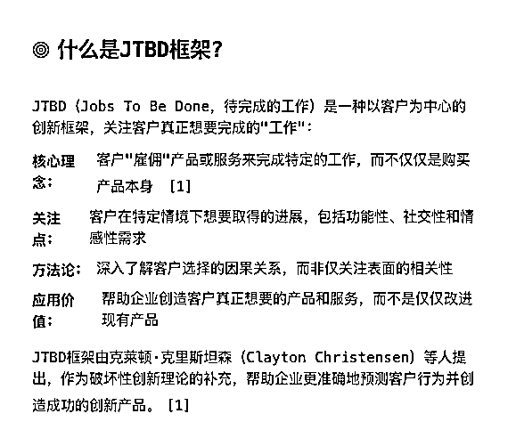
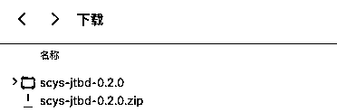
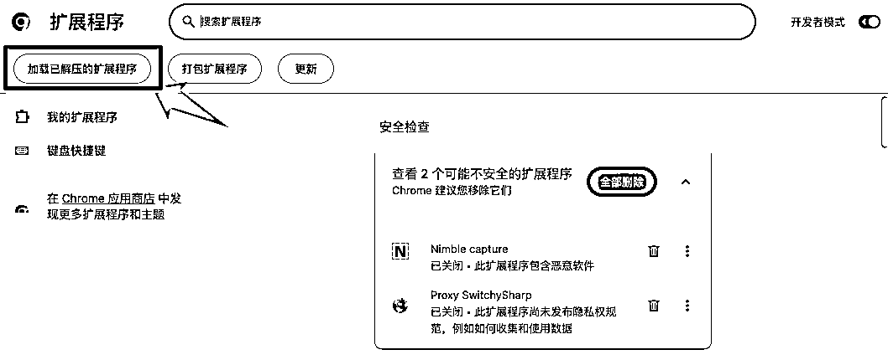
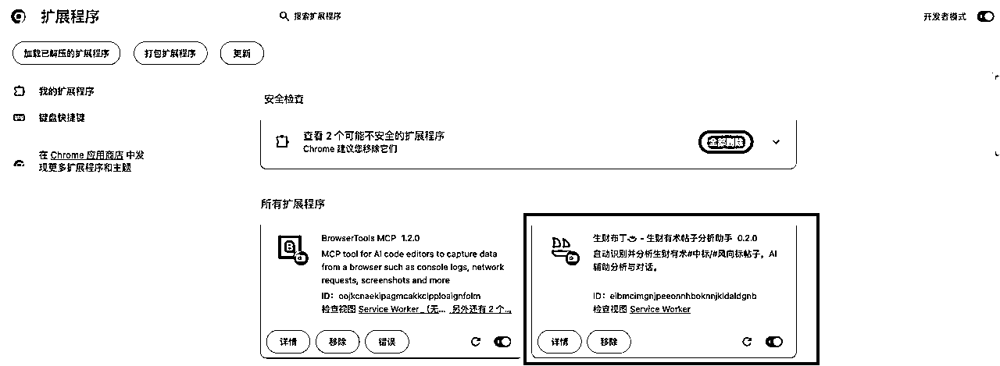

# 帮你更深入的拆解中标风向标 - 生财布丁 0.2.0

> 来源：[https://rxas35pmvn.feishu.cn/docx/KxoddksIgoZtrnxuV6ScdweUn1c](https://rxas35pmvn.feishu.cn/docx/KxoddksIgoZtrnxuV6ScdweUn1c)

中标的风向标是生财的宝藏，这是大家的共识。但是发布者和阅读者天然就有一些信息差的障碍，导致很多风向标并不能第一时间完全看明白，所以我做了一个帮助分析的 AI 助手

更新 安装链接：

chromewebstore.google.com

# 先看疗效

# 怎么分析的

## 主要通过 JTBD 和 第一性原理进行分析

JTBD = Jobs To Be Done

https://hbr.org/2016/09/know-your-customers-jobs-to-be-done?ref=blog.helpdocs.io

## 分析的维度有

*   核心人群，分别站在消费者和生产者角度

*   需求侧本质需求分析，关键洞察

*   异常值

*   机会拆解

*   一句话总结，消费者和生产者

# 如何安装

## 下载安装包

应用市场还没审核通过

## 手工安装 Chrome 插件

### 进入插件管理

### 右上角，打开开发者模式

### 解压缩插件 zip 文件

解压缩到一个文件夹，如

### 手工安装

选择刚刚的文件夹

看到这个说明安装成功

# 如何使用

1.  访问生财有术的官方网站 scys.com

1.  进入某一个中标的风向标的详情页面，不是列表页面哦

1.  在正文下方，会自动展开

# 使用反馈

大家使用中有什么问题，可以向我反馈