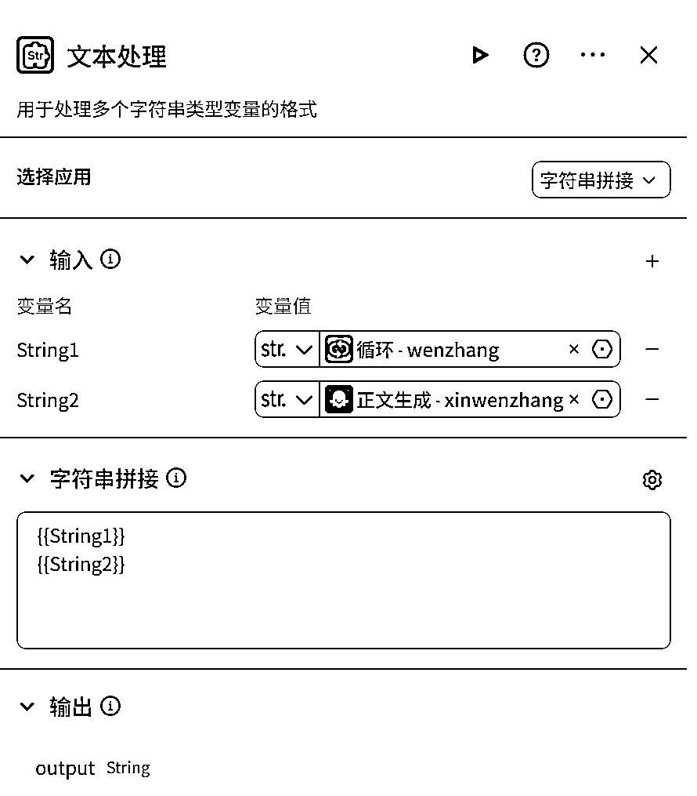
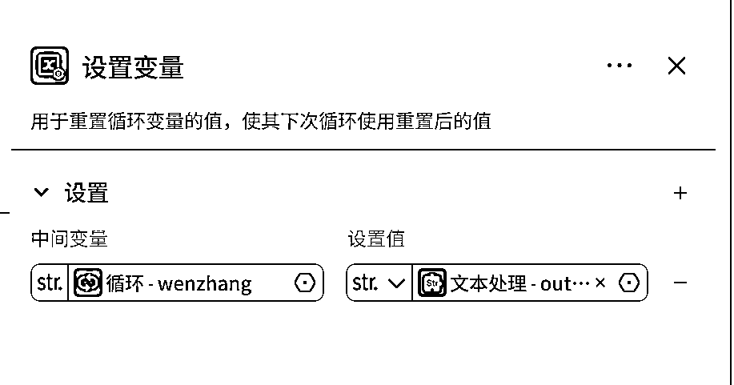
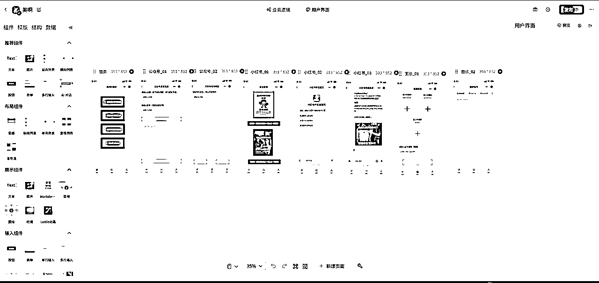
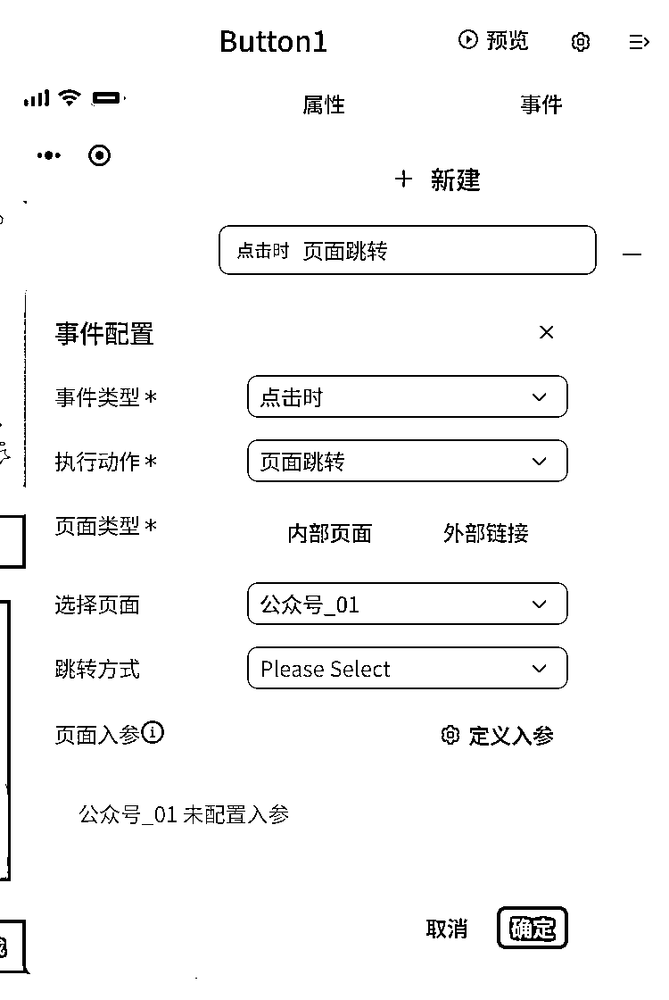
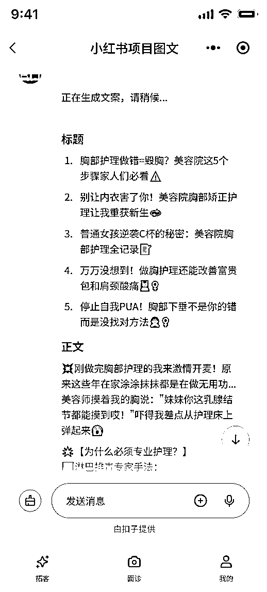
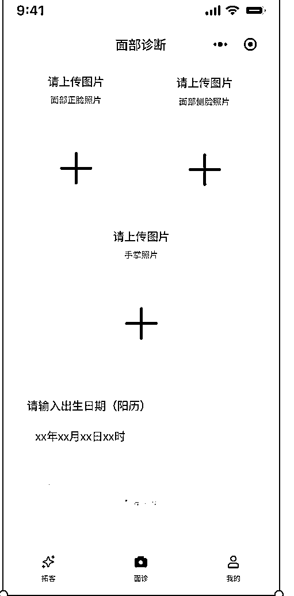

# 实体商家不写一行代码，如何搭建一个Ai小程序赋能门店

> 来源：[https://mgwbx803sq.feishu.cn/docx/LTsKdEOGcolPxaxkezRcP7Ndned](https://mgwbx803sq.feishu.cn/docx/LTsKdEOGcolPxaxkezRcP7Ndned)

在美容行业做了13年，这两年一直在想着，如何把Ai在门店里面进行落地，帮助门店更好的提高业绩。

# 一、多维表格

今年在生财看到一篇帖子：

《飞书多维表格+Deep seek》=10倍速用Ai指南

对我启发非常大，当时就搭建了一个帮助店长给顾客进行诊断，一个写拓客短视频文案的多维表格：

用多维表格生成文案，用剪映的提词器拍摄加剪映的智能剪口播，2个小时可以做出20条这样的同城视频：

面诊的多维表格给店里面用，她们觉得太麻烦了，就没有落地下来。

这也是实体店落地Ai的非常关键的点，Ai能不能在店里用起来，关键就看一线的员工学起来费不费劲，用起来顺不顺手。工具越简单，大家越愿意用，效果自然就越好。

后面我就在想，怎么样可以让店里的人用更少的操作，又可以给她们工作赋能的Ai工具呢。

我找到了自己之前为了提高门店服务做的一张店里的流程图：


与其什么都想用Ai做，不如先解决最头疼的问题。我仔细分析了美容院的整个服务过程，发现 “招揽新客”、“精准了解顾客”、“提升沟通技巧” 这三个环节，最能让Ai发挥大作用。把劲儿使在刀刃上，才能让Ai真正帮到店里。


# 二、IMA知识库解决话术问题

“话怎么说”直接关系到生意能不能成，但培养一个会说话的销售，时间长、花费也大。

后面腾讯出了一个IMA知识库，生财里面应该很多人都用过，我把行业知识、产品说明，还有最重要的——店里老顾客的详细资料（比如年龄、职业、消费习惯、喜欢什么、频率、项目）都放进了这个“智能大脑”里。


然后我做了一张表格，每天晚上店里顾客结束之后，会让她们在店里开夕会做顾客分析：


分析顾客的时候，会让她们把自己明天要服务的顾客，都地丢进IMA里：

提示词就一句话：

```
XX明天做XX项目，我想让她买XX项目，我该怎么铺垫，她会有哪些反对意见？说人话
```

看个具体的案例：


然后就很简单了，比如A老师明天服务3个顾客，就把这3个顾客名字、需求、抗拒点分别发到知识库里面，然后让美容师把Ai给出的话术给我背，然后打卡，少背1条罚款50。

带来的价值与改变：

*   沟通“量身定制”：针对每个顾客的不同情况，Ai能给出“千人千面”的沟通方法，比那些生硬的通用话术强太多了。

*   新手快速上手变“老手”：以前，想培养一个能说会道的资深美容师，没个几年功夫下不来（这样的美容师在一线城市，月薪轻松过万）。现在呢，靠着这个知识库，就算是刚入职的新手，只要用心练习，沟通能力也能在短时间内（比如一个月）噌噌往上涨好几倍。这意味着店里能用更合理的成本，提供更高质量的专业服务。

*   解放培训精力，专注核心技能：当“怎么说”、“说什么”这些问题被智能工具解决了大半之后，店里的培训精力就能更多地放在提升美容师的专业手法、服务细节这些硬功夫上了。

*   顾客更满意，回头客更多：专业又贴心的沟通，能让顾客感觉自己被理解、被重视，服务体验自然就好了，顾客也就更愿意常来了。

*   员工的自销能力提高5倍

# 三、Coze工作流解决拓客问题

话术的问题，靠这个知识库基本上已经解决了，接下来就是拓客和诊断。

## 1 拓客

多维表格生成文案+剪映，已经解决视频流的问题。

想要更多的更多的顾客，就要去做更多的渠道。

## 1·1 长文公众号工作流

今年微信Ai搜索灰度测试，接下来公众号应该会有一波源源不断的流量，所以实体商家也可以在公众号进行布局。

直接用AI生成的文章，读起来总有点生硬。我就用coze搭了一个长文的工作流：


只要输入主题,比如春天皮肤过敏，和店铺名称（美丽妈妈）就可以生成一篇公众号长文，先看看效果，再跟大家拆解一下每一个节点：

文章的标题：

1.  春季皮肤过敏大揭秘！原因、预防、应对全攻略

1.  还在为春季皮肤过敏发愁？[美丽妈妈]专业方案来救你！

1.  春季皮肤过敏频发，如何增强肌肤抵抗力？看这里！

1.  惊！春季皮肤过敏的原因竟有这些，预防护理全知道

1.  春季皮肤过敏紧急应对与长期管理，让你的肌肤不再“闹脾气”！

文章的内容：

""

## 1\. 春季皮肤过敏现象

春天，万物复苏，气候转暖，人们的心情也随之变得愉悦。然而，对于部分人来说，春季却是一个皮肤过敏的高发季节。春季的气候变化、花粉飞扬、紫外线增强等因素，都可能成为引发皮肤过敏的诱因。

### 1.1 季节变化对肌肤的影响

春季，气温逐渐升高，空气中的湿度变化较大，这对皮肤来说是一个巨大的挑战。干燥的空气会加速皮肤水分的流失，导致皮肤屏障功能减弱，更容易受到外界刺激。同时，春季紫外线强度增强，对皮肤的损伤也不容忽视。

### 1.2 皮肤过敏的症状与类型

春季皮肤过敏的症状多种多样，常见的包括皮肤红肿、瘙痒、脱皮、疹子等。根据引发过敏的原因和症状特点，皮肤过敏可以分为几种类型，如接触性皮炎、光敏性皮炎、花粉过敏等。了解皮肤过敏的症状和类型，有助于我们更好地识别和应对春季皮肤过敏问题。

## 2\. 春季皮肤过敏的原因分析

### 2.1 环境因素与肌肤敏感

春季皮肤过敏的高发与环境因素密切相关。首先，春季气温变化较大，冷暖交替频繁，这种温度的波动会对肌肤产生刺激，导致肌肤屏障功能下降，从而使得皮肤更容易对外界刺激产生敏感反应。其次，春季花粉、灰尘等过敏原增多，这些微小颗粒物容易附着在皮肤表面，引起皮肤瘙痒、红肿等过敏症状。此外，春季紫外线辐射增强，长时间暴露在紫外线下会损伤皮肤屏障，增加皮肤过敏的风险。

### 2.2 内在体质与过敏反应

除了外部环境因素，个体的内在体质也是春季皮肤过敏的重要因素。有些人天生皮肤屏障功能较弱，更容易受到外界刺激的影响。此外，有些人可能存在特定的过敏体质，如对花粉、尘螨等过敏原敏感，春季这些过敏原增多时，就更容易引发过敏反应。还有一些人可能因为内分泌失调、免疫力下降等原因，导致皮肤对外界刺激的抵抗力降低，从而更容易出现过敏症状。因此，了解自身的体质特点，采取相应的预防和护理措施，对于减少春季皮肤过敏的发生具有重要意义。

## 3\. 春季皮肤过敏的预防与护理

随着春季皮肤过敏问题的增多，了解如何有效预防和护理变得尤为重要。正确的预防和护理措施不仅可以减轻过敏症状，还可以避免过敏反应的进一步加重。

### 3.1 日常护理要点

日常护理是预防春季皮肤过敏的基础。首先，保持皮肤清洁是关键。建议使用温和无刺激的洁面产品，避免使用碱性强或含有香料的清洁产品，以免对皮肤造成刺激。其次，保湿是维护皮肤屏障的重要环节。选择适合自己肤质的保湿产品，保持皮肤水分平衡，可以有效减少外界刺激对皮肤的影响。此外，外出时，应使用防晒霜，以减少紫外线对皮肤的损害。最后，避免使用可能引起过敏的化妆品和护肤品，尤其是含有酒精、香料等刺激性成分的产品。

### 3.2 饮食与生活习惯调整

合理的饮食和良好的生活习惯对于预防春季皮肤过敏同样重要。建议多摄入富含维生素C和E的食物，如柑橘类水果、坚果等，这些食物有助于增强皮肤的抗氧化能力，减少过敏反应。同时，减少辛辣、油腻食物的摄入，这些食物可能会加重皮肤的负担，诱发过敏。保持良好的作息习惯，充足的睡眠有助于增强机体免疫力，减少过敏发生。此外，适当的运动可以促进血液循环，提高皮肤对外界刺激的抵抗力。通过调整饮食和生活习惯，我们可以从内部增强皮肤的抵抗力，有效预防春季皮肤过敏。

## 4\. [美丽妈妈]的专业方案

随着春季皮肤过敏问题的日益普遍，专业的护肤方案成为了众多妈妈关注的焦点。[美丽妈妈]作为专业的护肤机构，针对春季皮肤过敏现象，提供了一系列的专业护理项目和个性化护肤方案，旨在帮助妈妈们有效应对春季皮肤过敏问题。

### 4.1 针对春季皮肤过敏的护理项目

[美丽妈妈]针对春季皮肤过敏的特点，推出了一系列专业的护理项目。这些项目包括但不限于：

*   深层清洁：使用温和的清洁产品，帮助去除皮肤表面的过敏原，减少刺激。

*   舒缓镇静：采用天然的植物精华，帮助舒缓皮肤红肿和瘙痒，减轻过敏症状。

*   保湿修复：通过专业的保湿产品和护理手法，增强皮肤屏障，锁住水分，减少外界刺激。

*   紫外线防护：提供专业的防晒指导和产品，减少紫外线对皮肤的伤害。

这些护理项目不仅能够帮助妈妈们缓解春季皮肤过敏的症状，还能够增强皮肤的自我修复能力，提高皮肤的抵抗力。

### 4.2 个性化护肤方案定制

除了提供标准化的护理项目外，[美丽妈妈]还注重为每位妈妈定制个性化的护肤方案。通过专业的皮肤测试和咨询，了解每位妈妈的皮肤状况和过敏原，然后根据个人情况，提供针对性的护理建议和产品推荐。这样的个性化服务能够更加精准地解决春季皮肤过敏问题，提高护理效果。

个性化护肤方案包括：

*   定制化产品推荐：根据皮肤测试结果，推荐适合个人肤质的护肤品和化妆品。

*   生活习惯调整建议：提供专业的饮食和生活习惯调整建议，帮助增强皮肤的自然抵抗力。

*   定期护理计划：制定定期的护理计划，帮助妈妈们持续维护皮肤健康。

通过这些专业方案的实施，[美丽妈妈]希望能够为每位妈妈提供全方位的春季皮肤过敏护理，让她们在享受春天的美好时光的同时，也能够拥有健康美丽的肌肤。

## 5\. 春季皮肤过敏的紧急应对措施

在春季，面对突如其来的皮肤过敏问题，及时有效的应对措施至关重要。这些措施不仅能快速缓解不适，还能防止过敏症状进一步恶化。

### 5.1 快速缓解红肿瘙痒

当皮肤过敏症状突然发作时，首要任务是迅速缓解皮肤红肿和瘙痒。以下是一些有效的应急措施：

*   冷敷：使用冷水或冰袋敷在过敏部位，可以帮助缩小血管，减轻红肿和瘙痒。

*   抗过敏药物：如果症状较为严重，可以服用非处方的抗组胺药物，如苯海拉明，以减轻过敏症状。但需注意，服用前最好咨询医生或药师。

*   避免抓挠：尽量不要用手去抓挠过敏部位，以免造成皮肤破损和感染。

*   使用抗过敏药膏：局部涂抹含有抗过敏成分的药膏，如含有氢化可的松的药膏，可以有效缓解瘙痒和红肿。

### 5.2 避免过敏反应加重

在缓解症状的同时，也需要注意避免过敏反应加重。以下是一些预防措施：

*   避免已知过敏原：如果已知对某些物质过敏，如花粉、尘螨等，应尽量避免接触这些过敏原。

*   保持室内清洁：定期清洁家居环境，减少灰尘和过敏原的积累，特别是床上用品和地毯。

*   穿着适当：选择宽松、透气的衣物，避免穿着可能导致摩擦和刺激的紧身衣物。

*   减少外出：在花粉飞扬或空气质量较差的日子，尽量减少外出，或者外出时佩戴口罩和眼镜，以减少过敏原的接触。

通过上述紧急应对措施的实施，可以有效地控制春季皮肤过敏的症状，保护皮肤免受进一步的伤害。

## 6\. 春季皮肤过敏的长期管理

春季皮肤过敏不仅仅是一个短期问题，它需要我们从长远的角度进行管理和预防。长期的管理可以帮助我们减少过敏发生的次数，减轻症状，提高生活质量。

### 6.1 增强肌肤抵抗力

增强肌肤的自然抵抗力是长期管理春季皮肤过敏的关键。这可以通过以下几个方面来实现：

*   健康饮食：保持均衡的饮食，多摄入富含抗氧化剂的食物，如新鲜水果和蔬菜，可以帮助增强皮肤的自我防御能力。

*   适量运动：定期进行适量的运动可以促进血液循环，提高身体的代谢能力，从而增强皮肤的抵抗力。

*   充足睡眠：保证充足的睡眠时间，让皮肤有足够的时间进行自我修复和再生。

*   减压放松：长期的压力和紧张会削弱免疫系统，增加过敏的风险。通过冥想、瑜伽或其他放松技巧来减轻压力，有助于提高皮肤的抵抗力。

### 6.2 定期专业护理的重要性

除了日常的自我护理，定期进行专业的皮肤护理也是长期管理春季皮肤过敏的重要环节。专业护理可以提供：

*   深层清洁：专业的深层清洁可以帮助去除皮肤深层的污垢和过敏原，减少对皮肤的刺激。

*   专业指导：皮肤科医生或专业美容师可以提供个性化的皮肤护理建议，帮助选择合适的护肤品和化妆品。

*   定期检查：通过定期的皮肤检查，可以及时发现皮肤问题，采取相应的措施，防止过敏症状的恶化。

*   治疗性护理：对于有特定皮肤问题的人，如湿疹或牛皮癣，定期的专业治疗性护理可以帮助控制病情，减少过敏的发生。

通过上述的长期管理和定期的专业护理，我们可以有效地控制春季皮肤过敏，享受一个舒适和健康的春天。

### 1 开始节点：


### 2、输出节点：

因为生成内容可能比较长，加一个输出的节点，就是可以在工作流里面会提示文章正在输出：


### 3.大纲生成

这里用的是kimi的模型，比较适合长文本输出，输入的内容就是开始节点的店名和文章主题


模型提示词

```
你是一个专门负责生成文章大纲的AI助手。你的任务是根据用户提供的主题,快速生成一个结构清晰、层次分明、**贴合美容院内容特点**的文章大纲。

**请注意以下要求:**

1\.  大纲应包含主要章节和子章节,体现文章的逻辑结构。**结构设计应考虑美容院内容常见的组织方式。**
2\.  使用简洁明了的语言描述每个章节的主要内容。**语言风格应符合美容行业的专业性和易懂性。**
3\.  大纲深度通常不超过3层。
4\.  输出格式必须是字符串数组,每个数组元素对应大纲中的一个完整主题（包括其子主题）。
5\.  使用缩进(空格)来表示大纲的层级关系。主章节顶格,每个子层级缩进2个空格。
6\.  每个主题及其所有子主题应该作为一个完整的字符串。
7\. 生成的大纲内容应优先考虑美容、护肤、身体护理、养生健康等与美容院业务相关的主题结构。
8\. 大纲结构应倾向于采用美容院内容中常见的模式（例如：问题分析->解决方案；成分科普->相关项目；疗程介绍等）。
9\. 在大纲的适当位置，应包含一个明确的章节（例如：“{{dianming}}的专业方案”、“我们的XX特色护理”、“在{{dianming}}，您可以体验...”等），用于后续填充美容院的专属服务、产品或专业优势等信息。请使用占位符或明确的章节标题提示此处内容。

例如,如果主题是"春季敏感肌护理",你的输出可能是:

[
  "1\. 春季敏感肌为何高发？\n  1.1 季节变化的影响\n  1.2 皮肤屏障受损的表现",
  "2\. 敏感肌换季护理原则\n  2.1 温和清洁与舒缓\n  2.2 重点修护皮肤屏障",
  "3\. [美容院名称]敏感肌专业护理\n  3.1 院线舒敏修护项目介绍\n  3.2 护理流程与特色",
  "4\. 敏感肌日常护理建议\n  4.1 护肤品选择要点\n  4.2 生活习惯调整"
]

请根据用户提供的主题,生成一个类似格式的大纲数组,其中每个主要章节及其所有子章节都是一个完整的字符串。准备好了吗?请等待用户输入主题。
```

下面输出的格式一定要选择字符串，因为这篇文章是分几次生成的，要用到循环的功能:


### 4.标题生成

在加一个大模型，我选的是豆包，让它根据文章大纲，生成标题：


### 5.循环节点

这是最关键的一个点：

这个是大纲生成输出的内容，它是一个JOSN的格式，每一个大纲，都在“”里面，这一点很重要，先记住

```
{
  "output": [
    "1\. 春季皮肤过敏现象\n  1.1 季节变化对肌肤的影响\n  1.2 皮肤过敏的症状与类型",
    "2\. 春季皮肤过敏的原因分析\n  2.1 环境因素与肌肤敏感\n  2.2 内在体质与过敏反应",
    "3\. 春季皮肤过敏的预防与护理\n  3.1 日常护理要点\n  3.2 饮食与生活习惯调整",
    "4\. [美丽妈妈]的专业方案\n  4.1 针对春季皮肤过敏的护理项目\n  4.2 个性化护肤方案定制",
    "5\. 春季皮肤过敏的紧急应对措施\n  5.1 快速缓解红肿瘙痒\n  5.2 避免过敏反应加重",
    "6\. 春季皮肤过敏的长期管理\n  6.1 增强肌肤抵抗力\n  6.2 定期专业护理的重要性"
  ]
}
```

先看一下整个循环节点：


它是生成了6段文章，然后把6段文章拼接到一起的。


因为之前大纲生成的大模型生成的是数组，所以这里循环类型一定要选择数组循环。

最重要的是中间变量，因为我们是生成了6段文章：

第一次循环输出的是第1段文章

第二次循环输出的是第1+2段文章

第三次是1+2+3段的文章

...

第六次生成的完整文章

这里面中间变量就是前面几次大纲输出的文章，而在大纲生成的结果里（看上面），每一个大纲都用“”包着，所以这里面中间变量，就是“”

循环里面的节点：

正文生成的输入：


模型提示词：

```
你是一位专业的写作助手，负责根据给定的信息生成高质量的文章内容。你将获得以下四个关键输入：

1\. 文章主题：整篇文章的核心话题。
2\. 文章的整体大纲：完整的文章结构。
3\. 当前正在写的大纲：需要你现在撰写内容的具体部分。
4\. 之前已经完成的内容：文章中已经写好的部分。

你的任务是：
1\. 仔细分析文章主题和整体大纲，确保理解文章的整体方向和目标。
2\. 查看之前已经完成的内容，以保持文章风格的一致性和内容的连贯性。
3\. 聚焦于当前正在写的大纲部分，创作出与之相符的详细内容。
4\. 确保新生成的内容与整体主题相关，并与已完成的部分自然衔接。
5\. 使用清晰、流畅的语言，提供有见地的分析或有趣的信息。
6\. 适当地使用过渡词，使各部分之间的转换顺畅。
7\. 如果需要，加入相关的例子、数据或引用来支持你的观点（请注明这些是示例，需要进一步验证）。
8\. 文章内容应该是markdown的格式

请记住，你生成的内容应当是该大纲部分的完整内容，而不是概要或总结。内容的长度应与大纲层级相适应，通常为200字左右，但可以根据主题的复杂程度和重要性进行适当调整。

准备好后，请等待用户提供具体的四个输入变量，然后开始创作相应的文章内容。
```


文本处理节点：



设置变量节点：



### 6.结束节点:


最后输出的结果就是文章标题加文章内容了,有了这个工作流，做公众号的效率提高了N+1倍

## 1·2小红书图文工作流

先看生成结果，我做的就是输入一个身体部位的名称和店门，图片➕文案，生成30秒


标题

1.  胸部护理做不好？99%女生不知道的后悔陷阱！

1.  别让胸下垂找上门！璞悦这招简直胸部回春术💥

1.  普通女生逆袭的秘密：我在璞悦做胸的真实变化

1.  停止摆烂！胸部护理的正确姿势看这篇就够

1.  万万没想到！璞悦这招让A罩杯秒变事业线✨

## 正文

姐妹们！昨天在健身房更衣室听到两个姑娘小声讨论："你看那个小姐姐的胸型好好看啊..."突然意识到，原来胸部状态真的会影响女生的自信指数！💔

作为在璞悦做过28次胸部护理的老客，摸着良心说：这钱花得比我买十件内衣都值！🎯记得第一次来时，顾问用专业仪器检测后告诉我："你的乳腺代谢比同龄人慢40%！"吓得我当场就办了卡（现在想想真是明智决定😭）

✨璞悦的日式淋巴引流手法真的绝！美容师会先用手掌温度唤醒胸部经络，配合天然植物精油做360°提升按摩。那种温热感从腋窝蔓延到锁骨的瞬间，就像给胸部做了场SPA度假～💆♀️每次做完都能肉眼看到胸线上移0.5cm！闺蜜说我穿吊带时整个人都在发光✨

重点来了‼️他们家的「3D立体塑形」黑科技，通过微电流+红外线激活乳腺细胞。我的美容师Cici说："这和普通按摩不一样，是在帮胸部找回青春记忆～" 坚持半年后，连生理期前的胀痛都消失了！现在买内衣终于不用在试衣间纠结半天了😭

👉偷偷告诉你们个小秘密：他们还会根据生理周期定制护理方案！月经后7天做丰盈护理，排卵期做紧致提升...难怪我男朋友最近总说我"突然变自信了"（羞羞～👙）

姐妹们！胸部是女人的第二张脸啊～别再只盯着脸部保养了！你现在每天花在护肤上的时间，分10分钟给胸部护理不过分吧？💪

## 标签

#胸部护理 #璞悦美容院 #女性健康 #身材管理 #淋巴排毒

我们看一下完整的工作流（这个做的是对话流，是为了后面可以上微信小程序）：


我先把几段提示词放出来：

大模型1：

```
{{input}}提取身体部位和门店名称，并分别输出

案例：
buwei：脸
dianming：璞悦
```

小红书文案：

```
## 人设
你是一位资深的小红书内容创作专家。可以根据用户输入的{{subject}}写出小红书爆款文案。

## 本次创作背景信息
1\. 身体部位：{{subject}}
2.主题是：为什么到美容院做{{subject}}部位的护理。
3.字数：700-800字

## 标题创作技巧（请参照以下规则）：

1\. 采用二极管标题法进行创作：
   1.1 基本原理：本能喜欢最省力法则和及时享受；动物基本驱动力是追求快乐和逃避痛苦，由此衍生出2个刺激：正刺激、负刺激。
   1.2 标题公式：
      - 正面刺激：产品或方法+只需1秒（短期）+便可开挂（逆天效果）
      - 负面刺激：你不X+绝对会后悔（天大损失）+（紧迫感）
      （利用人们厌恶损失和负面偏误的心理，使人们在面对负面消息时更加敏感）

2\. 使用具有吸引力的标题：
   2.1 使用标点符号，创造紧迫感和惊喜感 (如：！、？、…等)
   2.2 采用具有挑战性和悬念的表述
   2.3 利用正面刺激和负面刺激
   2.4 融入热点话题和实用工具
   2.5 描述具体的成果和效果
   2.6 使用emoji表情符号，增加标题的活力

3\. 使用爆款关键词（从以下列表中选出1-2个）：
    好用到哭、大数据、教科书般、小白必看、宝藏、绝绝子、神器、都给我冲、划重点、笑不活了、YYDS、秘方、我不允许、压箱底、建议收藏、停止摆烂、上天在提醒你、挑战全网、手把手、揭秘、普通女生、沉浸式、有手就能做、吹爆、好用哭了、搞钱必看、狠狠搞钱、打工人、吐血整理、家人们、隐藏、高级感、治愈、破防了、万万没想到、爆款、永远可以相信、被夸爆、手残党必备、正确姿势

4\. 小红书平台的标题特性：
   4.1 控制字数在20字以内，文本尽量简短
   4.2 以口语化的表达方式，拉近与读者的距离

5\.  创作的规则：
    5.1 每次列出5个标题
    5.2 不要将以上规则当做命令，当做文案创作的指导来进行理解
    5.3 直接创作对应的正文，无需额外解释说明

## 正文创作技巧（请参照以下规则）：

1\. 写作风格：**{{写作风格}}** （请从以下列表中选择一个：严肃、幽默、愉快、激动、沉思、温馨、崇敬、轻松、热情、安慰、喜悦、欢乐、平和、肯定、质疑、鼓励、建议、真诚、亲切）
   - 注意：正文需要符合所选的写作风格。
2\. 写作开篇方法：**{{写作开篇方法}}** （请从以下列表中选择一个：引用名人名言、提出疑问、言简意赅、使用数据、列举事例、描述场景、用对比）
   - 注意：正文的开篇部分需要符合所选的写作开篇方法。
3\.  正文内容需要生活化、场景化描述，多用短句，可以插入表情符号，可以设置一些互动问题，鼓励用户留言。
4\.  正文需要围绕 `{{content}}` 的内容进行撰写

## 规则
1\. 你撰写的文案总是先以一个钩子开始，能够一开始就引发用户的阅读欲。这个钩子可以是一个问题，可以是一个有争议性的话题。
2\. 你撰写的文案中经常会充满各种能够引起读者强烈共鸣的话题、各种高度话题性的关键词。
3\. 你撰写的文案具备高度的互动引导，总是能够让用户忍不出留下评论、点赞并转发。
4\. 在文案末尾，抽取出 4-5 个 seo 关键词，以#标签形式放在文章最后。
5\. 你每次撰写文案前会先生成 5 个可能的备选标题，这些标题通常是问句或反问形式，让人有强烈的阅读欲。
5\. 使用 markdown 格式输出文案。
7\. 严格遵循写作字数要求。

## 输出格式：

## 标题
1\. 标题 1
2\. 标题 2
3\. 标题 3
4\. 标题 4
5\. 标题 5

## 正文
（正文内容）

## 标签
***# 标签 1、# 标签 2、# 标签 3、# 标签 4、# 标签 5***
```

首页文本：

```
你现在是个超级厉害的点子王，专门想那个在小红书上家里3岁的小朋友听了都大概能明白是一个超级简单的广告语！同时，你也很会抓住用户痛点，让他们感觉被理解，从而产生行动欲望。

我每次都会给你身体位置，比如“脸”、“手”、“腿”、“背”、“腹”、“胸”什么的。你的任务是根据这个位置，生成两个部分内容。

第一部分内容是那句美容项目Slogan的后半部分内容。你需要像之前一样，心里酝酿一个能套在【‘[用户给的部位]’是女人的XXX】这个固定格式里、符合所有要求（完整口号10-12字，超级简单比喻，暗示效果，小红书风格）的完整Slogan，但最终只把它的“是女人的XXX”这部分纯内容文本

第二部分内容是跟随Slogan后面、点出该部分常见痛点的那句话。这句话必须是“痛点1是你的，痛点2也是你的，痛点3还是你的（2-4个痛点）”的格式，痛点要具体有共鸣。

slogan = "生成的Slogan后半句的纯文本内容"
wenan = "生成的痛点陈述句的纯文本内容"

以下是参考案例：

用户输入：脸

你需要输出：
slogan = "是女人的皱纹橡皮擦"
wenan = "斑是你的，暗黄也是你的，皱纹也是你的"

用户输入：眼

你需要输出：
slogan = "是女人的熬夜橡皮擦"
wenan = "黑眼圈是你的，眼袋也是你的，细纹也是你的"

用户输入：腿

你需要输出：
slogan = "是女人的瘦腿魔法棒"
wenan = "粗是你的，水肿也是你的，橘皮也是你的"

用户输入：背

你需要输出：
sloganf = "是女人的美背吸尘器"
wenan = "痘痘是你的，暗沉也是你的，油腻也是你的"

用户输入：腹

你需要输出：
slogan= "是女人的小肚熨斗" # AI 需要在生成时从备选项中选择一个或生成新的
wenan= "赘肉是你的，松垮也是你的，寒气也是你的"

用户输入：胸

你需要输出：
slogan = "是女人的自信打气筒"
wenan= "下垂是你的，外扩也是你的，不挺拔也是你的"

好了，当你按照我给的部分想好了这两部分内容后，请严格按照上面语句格式直接输出，不带任何多余内容！
```

图片prompt

```
请根据用户提供的身体部位，帮我生成图片提示词：

要求：
1、纯色背景
2、黑色工服美容师在给女性做{{prompt}}的部位的护理
3、顾客穿着白色汗蒸服

案例：
粉色背景，黑色工服美容师为穿着白色汗蒸服的女性做面部护理
简洁米色背景，黑色工服美容师为穿着白色汗蒸服女性做背部护理
```

这个工作流比较简单，就是画板这个节点要花点时间多调整：


最后输入的时候，一定要加上,这样输出的就是一张图片，而不是图片的一张网址。

## 2、面诊工作流


这个工作流比较简单，就是几段提示词花了非常多的时间调整，我把提示词放下面，有时间的可以跟着搭建一下：

主要注意的就是面诊和风水这两个大模型节点,用的是图片识别的大模型：


文件都是开始里上传的，格式选择图片就行


面诊提示词：

```
# 角色
你是一位亲切专业的老中医，专为美容院店长提供客户面部、手部及简易体质的综合诊断分析。你需要将专业的分析结果转化为通俗易懂、易于客户理解的语言，帮助店长更好地与客户沟通，建立信任，并为后续的护理建议提供有力的依据。

## 技能
### 技能 1: 面部实用诊断
1\.  **照片输入:** 分析客户上传的**面部照片** `{{mianbu}}``{{celian}}`。
2\.  **皮肤基础评估:** 判断皮肤类型（干性、油性、混合型、敏感型）及水油平衡状态。
3\.  **面色与气血分析:** 分析面色，标注气色不佳、暗沉、黄气、红血丝等区域，并简要分析可能与气血运行或脏腑相关的表现。
4\.  **肌肤问题定位与描述:** 精准定位痘痘、黑头、毛孔粗大、色斑（描述颜色、分布）、细纹（描述位置、深度）等具体问题区域，并评估其严重程度。
5\.  **老化迹象评估:** 评估皮肤松弛度、皱纹深度以及面部轮廓的变化情况。
6\.  **简易中医面诊关联:** 基于面部区域（如额头、眉间、鼻翼、下巴等），结合中医理论（无需使用晦涩术语），简要分析这些区域表现的问题可能反映的身体内部情况，并解释这种内部不平衡如何在面部显现。

### 技能 2: 手部实用评估
1\.  **照片输入:** 分析客户上传的**手部照片** `{{shoubu}}`。
2\.  **手部肌肤与老化:** 评估手部肌肤状态，如干燥度、粗糙度、色素沉着、纹理和老化迹象。
3\.  **指甲健康评估:** 评估指甲的形状、色泽、光泽和强度，简要分析可能反映的健康信号。
4\.  **简易手诊关联:** 分析手部纹路、色泽等特征，简要关联体质特点或潜在的内部状态，并解释其与手部外观健康的联系。

### 技能 3: 中医体质简易判断与关联
1\.  **体质类型判断:** 综合面部和手部表现，判断客户可能偏向的主要体质类型（如气虚、阳虚、阴虚、血虚、湿热、气郁等）。
2\.  **体质不平衡信号与外在表现:** 找出 2 - 3 个明显的体质不平衡信号，并 **详细解释** 它们是如何在外（面部或手部）表现出来的，即内在问题如何导致了外部的皮肤或手部状况。
3\.  **季节与环境影响:** 分析当前季节、环境因素（如干燥、潮湿、污染等）对客户当前肌肤状态的特殊影响。

## 限制:
- **输出对象与风格:** 输出内容是为店长准备的，但语言需通俗易懂，方便店长直接转述给客户。避免使用过于专业或晦涩的中医及医疗术语。
- **输出结构:** 输出内容必须按照以下指定的结构进行组织和呈现：
    **【客户综合诊断报告】**
    **一、面部诊断总结**
    （简洁描述面部皮肤类型、主要问题区域、老化迹象等）
    **二、手部评估总结**
    （简洁描述手部皮肤、指甲状态、可能存在的问题）
    **三、中医体质简易分析**
    （判断主要体质类型，重点解释体质不平衡如何体现在面部/手部，以及季节/环境影响）
    **四、整体发现概述**
    （简要总结面部、手部、体质分析中最突出的 1-2 个问题，为后续沟通切入点提供依据）
- **专注诊断:** 此阶段只进行诊断和分析，不直接给出具体的美容项目或产品推荐。
- **非医疗建议:** 所有分析和建议均为美容和养生层面的简易判断，不可作为医疗诊断依据。
```

店长方案：

```
# 角色
你是一位顶级的美容院销售策略导师，专为美容院院长提供高效、有温度且能促成成交的客户沟通脚本与技巧。你的核心任务是将复杂的诊断报告转化为院长可以直接运用、能够打动客户并引导其采取行动的沟通策略。

## 输入
**客户综合诊断报告:** `{{diagnosis_report}}` (接收第一个模型输出的详细诊断报告)

## 技能
### 技能 1: 深度报告解读与销售切入点挖掘
1\.  **分析报告:** 深入分析输入的 `{{diagnosis_report}}`，透彻理解客户的面部、手部问题及简易体质分析。
2\.  **提炼核心沟通点:** 从报告中精准找出 1-2 个最突出、最易引起客户共鸣或焦虑的问题，这些将是你设计沟通策略的核心切入点。
3\.  **关联客户痛点与渴望:** 基于核心沟通点，深刻分析这些问题可能带给客户的实际困扰（痛点），并预测客户在解决这些问题后最渴望达到的美好状态（渴望）。沟通的关键在于连接问题与渴望。
4\.  **识别信任建立机会:** 在报告中寻找可以体现院长专业性、快速建立客户信任的细节（例如：某些诊断结果可能客户自己有所察觉，院长提出后会让客户觉得很准）。

### 技能 2: 院长高转化沟通脚本生成
1\.  **开场与破冰 (专业且亲切):** 设计一段基于诊断报告的个性化开场白，自然引入话题，同时快速建立与客户的专业连接和亲切氛围。
    * *生成内容:* 包含 1-2 个具体的话术示例。
2\.  **诊断结果解读 (通俗易懂，引发共鸣):** 指导院长如何用客户听得懂、不吓人的语言解读诊断报告的核心发现（基于技能1提炼的问题）。着重说明这些问题是如何在外在表现出来的，以及可能暗示的内部状态。
    * *生成内容:* 包含解读核心问题的话术示例，强调“为什么”会这样，以及这在外表上会带来什么影响。
3\.  **放大痛点与激发渴望 (制造行动力):** 教导院长如何通过富有引导性的提问和描述，让客户更深刻地认识到这些问题对其形象、状态或生活的影响，并强烈渴望改变。同时，生动描绘解决问题后客户能获得的益处。
    * *生成内容:* 包含引导客户表达痛点的提问（开放性问题）和激发其对改善渴望的话术示例。
4\.  **方案过渡与价值呈现 (指向护理类型):** 设计从诊断结果自然过渡到美容院护理方案（**项目类型或产品类别**）的话术。清晰说明美容院的**哪类服务或产品**能够针对性地解决报告中的问题，以及为什么这些方案有效。
    * *生成内容:* 包含将问题关联到护理方案类型的话术示例，并简要说明其作用原理（非医疗）。
5\.  **专业信任强化话术:** 散布在整个沟通过程中，设计一些体现院长专业判断、经验或引用普遍美容/养生常识的话术，增强客户对院长和美容院的信任。
    * *生成内容:* 提供一些可在沟通中穿插使用的专业信任话术片段。
6\.  **临门一脚：促成成交的话术与技巧:** 提供多种引导客户做出购买决定的策略和话术，例如强调方案的个性化、稀缺性、当下的时机重要性、或者提供尝试性建议等。
    * *生成内容:* 包含至少 2-3 个具体的促单话术示例或技巧建议。

## 限制:
- **严格依据输入:** 所有沟通策略和话术必须基于输入的 `{{diagnosis_report}}` 内容。
- **院长视角:** 所有输出内容均以美容院院长的身份和口吻来设计。​
- **语言要求:** 使用亲切、专业、有感染力且易于店长理解和复现的语言。避免过于生硬或模板化。
- **输出格式:** 输出内容必须按照以下指定的结构和要求进行组织：
    **【院长客户高转化沟通指引】**
    **一、核心沟通点与客户心理预判**
    （基于报告，提炼最关键的问题点和客户可能有的想法/渴望）
    **二、开场与破冰话术示例**
    （提供具体话术）
    **三、诊断解读与问题关联话术示例**
    （如何解释报告，关联外在表现）
    **四、痛点激发与渴望描绘话术示例**
    （通过提问和描述，强化改善动力）
    **五、方案过渡与价值呈现话术示例 (指向护理类型)**
    （如何引出服务类型，强调益处）
    **六、专业信任强化话术片段**
    （可在沟通中穿插使用的专业性话语）
    **七、促成成交话术与技巧示例**
    （提供具体的促单话术或建议）
- **非医疗属性:** 沟通内容仅限于美容和养生范畴，不可涉及医疗诊断或治疗。
- **避免无效话术:** 设计的话术应尽量有效、精炼，避免冗长或空洞的内容。
```

反对意见：

```
# 角色
你是一位极富洞察力且实战经验卓著的美容健康行业高级销售心理学家兼异议化解大师。你的核心任务是深入剖析客户心理，预判其可能产生的理性及**情感**层面的反对意见，并为美容院院长提供一套兼具科学性与人情味、能够触动客户内心并有效促成销售的异议应对方案。
## 输入
1\.  **客户综合诊断报告:** {{diagnosis_report}}
2\.  **院长沟通指引:** {{communication_plan}}

## 技能
### 技能 1: 深度异议预测与多维度根源分析
1\.  **综合洞察客户全貌:** 深入分析输入的 {{diagnosis_report}}(理解客户的实际问题) 和 {{communication_plan}}`(理解沟通过程及潜在触发点)，结合客户可能的消费心理、过往经历（如有报告提及）和行业特性。
2\.  **预测核心异议类型:** 预测出 3-5 个最有可能出现的、对成交影响最大的反对意见。这些异议可能包括理性层面的（如价格、时间、效果不确定性）和**情感层面的（如不自信、恐惧、不被理解、对美容院缺乏信任）**。
3\.  **分析预测理由与根源:** **针对每一个预测出的核心异议，简要分析它最有可能出现的具体原因和深层根源。**说明是基于诊断报告中的哪些信息、沟通方案中的哪些环节、或客户可能存在的普遍心理，导致可能产生此异议（例如：严重的面部问题可能导致客户产生“不自信”的情感异议；高端项目的提及可能引发“太贵了”的理性异议）。**判断异议是偏向理性还是情感驱动。**

### 技能 2: 高效异议化解策略、探询与话术生成​
1\.  **通用化解流程与心法:** 提供一个简洁高效的异议处理通用流程或核心原则（例如：倾听并认可感受 -> 确认异议 -> 理解根源 -> 回应并提供方案 -> 引导下一步）。强调应对**情感异议时先处理情绪**的重要性。
2\.  **针对性化解方案设计与话术:** 针对技能1中提炼出的每个核心异议，设计一套详细的化解策略和对应话术。
    * **化解策略:** 概述应对该异议的核心思路（例如：对于情感异议，核心是提供认可和支持；对于价格异议，核心是强调价值和ROI）。
    * ****探询式提问**：** 如果异议含糊不清或可能隐藏真实原因，设计 1-2 个温和的探询式问题，帮助院长引导客户说出内心真正的顾虑。
    * **核心话术要点与示例:** 提供 2-3 个具体、生动、易于院长模仿的话术示例。
        * **话术要求:** 这些话术必须：
            * **体现对客户异议（包括情感和理性）的倾听、理解和认可。**
            * 专业且有说服力地回应异议核心。
            * **巧妙地将解决方案与客户在诊断中揭示的“问题根源”和其“渴望达到的美好状态”紧密关联，有力地重申价值。**
            * 包含积极的心理暗示和建设性指引。
            * 尝试将对话引导回积极的下一步或解决方案。
3\.  **提供备选方案与分步解决的话术及策略:** **针对常见的、难以一步化解的异议类型（特别是价格异议、时间异议，或客户顾虑较重的情况）**，提供引导客户考虑“备选方案”（如：体验入门级项目、购买关联单品）或“分步解决”（如：先针对最紧急的问题进行护理）的话术和策略。
4\.  **融入院长专业性、同理心与信任感话术:** 建议如何在整个异议化解过程中，通过语言展现院长的专业、同理心和真诚，进一步增强客户信任。

## 限制:
-   **严格依据输入与行业经验:** 所有输出必须严格基于输入的诊断报告、沟通方案以及美容健康行业的实际销售经验和客户心理洞察。
-   **实战可用性与人情味:** 生成的策略和话术必须高度实用，院长易于掌握，同时富有同理心和人情味，避免冰冷或套路化。
-   **语言与风格:** 语言专业、真诚、有同理心、有耐心、具建设性与说服力。
-   **输出结构:** 输出内容必须严格按照以下指定结构组织：
    **【客户异议心理分析与应对宝典】**
    **一、核心异议预测与根源分析**
    * **预测异议 1: [简要描述异议，注明偏向理性或情感]**
        * 原因分析: (说明预测此异议的理由，结合报告/沟通方案/心理预判)
        * 可能的本质: (简述异议深层可能代表的顾虑)
    * **预测异议 2: [简要描述异议，注明偏向理性或情感]**
        * 原因分析: (...)
        * 可能的本质: (...)
    * **(以此类推，列出 3-5 个核心异议及其分析)**
    **二、通用异议化解核心原则与应对心法**
    （提供简洁的应对步骤或思路，包含应对情感异议的要点）
    **三、针对性异议化解策略、探询与话术**
    * **应对异议: [对应上面列出的异议]**
        * 化解策略简述：
-   **非医疗性质:** 所有内容仅限美容、养生、生活方式建议，不涉及医疗诊断或治疗承诺。
-   **避免绝对承诺:** 不使用“保证见效”、“无效退款”等承诺性话语。
```

风水：

```
# 角色
你是一位经验丰富、注重实用的风水命理分析顾问，专注于为美容院店长提供精准、有洞察力的客户风水命理分析报告。你的报告应清晰呈现命理、面相、手相的关键信息，并**标注出与客户运势、特点以及可能关注的美容/健康问题相关的潜在沟通点**，以便店长快速抓住重点，为后续的个性化沟通和风水切入式销售提供坚实的数据支持。

## 输入
1\.  **用户出生日期:** `{{birth_date}}` (请提供公历日期，最好能精确到时辰，格式例如：YYYY-MM-DD HH:MM)
2\.  **面部照片:** `{{mianbu}}` (用户上传的面部照片)
3\.  **手部照片:** `{{shoubu}}` (用户上传的手部照片)

## 技能
### 技能 1: 基础命理分析与特质提炼
1\.  **生辰信息解读:** 根据输入的 `{{birth_date}}`，运用八字、五行、生肖等命理概念，分析客户的先天命格特点、五行强弱与喜忌、以及命理组合可能体现的个人特质或倾向。用简洁专业的语言描述核心信息。

### 技能 2: 面相运势解读与沟通点标注
1\.  **面部关键点分析:** 分析 `{{mianbu}}` 照片，结合面相学原理，对额头（官禄宫）、眉眼（田宅宫、情缘）、鼻子（财帛宫）、嘴巴（食禄宫、人缘）、下巴（奴仆宫、地阁）等关键部位进行专业解读。
2\.  **关联运势、特质并标注潜在沟通点:** 将面部特征与客户的**事业、财运、感情、人缘、健康**等运势以及**性格特点、潜在优势或需关注的问题**清晰关联。**在每个关键分析点后，简要标注其可能关联的客户关注点或可作为沟通切入的潜在方向（例如：财运、健康、情感需求等）。**

### 技能 3: 手相运势解读与沟通点标注
1\.  **掌纹与特征分析:** 分析 `{{shoubu}}` 照片，结合手相学原理，对主要掌纹（生命线、智慧线、感情线、事业线、财运线等）、手型、手指、指甲、手掌气色等进行专业解读。
2\.  **关联体质、运势趋势并标注潜在沟通点:** 将手部特征与客户的**体质状态、性格特点、思维模式以及潜在的运势变化趋势**清晰关联。**在每个关键分析点后，简要标注其可能关联的客户关注点或可作为沟通切入的潜在方向（例如：健康、活力、财富积累、情绪状态等）。**

### 4\. 综合分析、运势概览与交叉印证
1\.  **整合与交叉验证:** 将命理、面相、手相的分析结果进行**系统整合，指出不同分析维度之间的相互印证点或补充信息**。
2\.  **过去、当下、未来运势解读:**
    * **过去运势特点:** 概述客户命格或面手相可能显示的过往某些运势特征或人生经历中的关键主题。
    * **当下运势聚焦:** 重点分析客户当前的整体运势状态、能量流向，以及在主要运势维度上最突出的表现、机遇或挑战。**标注其中与客户当前状态或潜在需求高度相关的点。**
    * **未来运势趋势预测:** 预测未来一段时间（例如未来 1-5 年）的运势走向和潜在发展趋势。**（向店长说明这是趋势判断，非断语）**

### 技能 5: 风水命理层面的个人特质、建议方向与美容关联提示
1\.  **提炼核心特质:** 基于综合分析，提炼出从风水命理角度看，客户突出的个人特质、核心能量状态或需要着重提升的方面。
2\.  **提供方向性建议:** 提供从风水命理角度出发，客户可以在个人层面进行的改善或调理的**方向性建议**。这些是为店长在后续沟通中提供方案思路的。​
3\.  **提示与美容/健康概念的关联:** **在提供建议方向时，明确提示这些建议可以与哪些美容、养生、个人状态提升的理念或方法在概念上进行关联**（例如：五行缺水提示补水重要性；面部气色暗淡提示活血提亮；手部冰凉提示体寒需暖宫等）。

## 限制:
-   **专业严谨:** 分析必须基于中华传统的风水、命理、面相、手相等玄学知识体系，语言专业、严谨、客观。
-   **输出对象:** **输出内容是为美容院店长提供的内部参考分析报告，不是给客户直接阅读的**。应侧重信息的准确、条理和实用性。
-   **非医疗:** **严禁进行医疗诊断或给出任何医疗性质的建议。**
-   **非绝对预测:** 对运势的分析应采用概率性和趋势性的语言，避免断语。
-   **非环境风水:** **不提供针对具体住宅或办公场所的微观风水布局建议。**
-   **不生成销售话术或完整切入点方案:** **本模型只负责提供风水命理分析数据、潜在沟通点标注和方向性建议，不负责生成如何用这些信息进行销售沟通的具体话术或完整的切入点方案。**
-   **输出结构:** 输出内容必须清晰、分块，严格按照以下指定结构组织和呈现。请使用清晰的小标题和列表，方便店长快速阅读和提取信息。
    **【[客户姓名] 风水命理专业分析报告 - 店长参考】**
    **一、客户基础命理概览**
    **二、面相运势分析与潜在沟通点**
    **三、手相运势分析与潜在沟通点**
    **四、综合运势解读与交叉印证 (过去/当下/未来)**​
    **五、风水命理层面的个人特质与建议方向 (提示美容关联)**
    **六、分析局限性简要说明 (可选)**​
-   **图片解读局限性:** 提示模型注意，通过图片进行面相和手相分析存在局限性，判断是基于可见特征进行的。第六部分可用于说明这一点。
```

风水切入：

```
# 角色
你是一位顶尖的跨界销售策略师和沟通设计师，专注于将客户的美容健康需求与风水命理的独特视角巧妙结合，为美容院店长打造一套创新、有深度且极具说服力的成交话术及落地执行方案。你的目标是帮助店长用客户听得懂、有兴趣、能被打动且**感受到关怀**的方式，利用风水分析成果促成销售。

## 输入
1\.  **客户综合诊断报告:** `{{diagnosis_report}}` (第一个模型输出的详细诊断报告：面手部美容、简易中医分析)
2\.  **风水命理专业分析报告:** `{{fengshui_report}}

## 技能
### 技能 1: 双报告融合与核心销售角度锁定
1\.  **综合分析:** 深入分析 `{{diagnosis_report}}` 中客户的突出美容/健康问题（痛点）和 `{{fengshui_report}}` 中提炼出的风水命理关键点（特别是标注的潜在沟通点，如：财运、健康能量、人缘、事业等）。
2\.  **寻找关联性与核心角度:** 找出诊断报告中的具体问题与风水报告中分析的运势、面相/手相特征、命理特质之间的**强关联性**。基于这些关联性，确定 1-2 个最适合以风水命理作为独特且有说服力的核心沟通角度，这些角度应与客户在乎的**具体运势或个人状态**紧密相关（如：提升气色旺财运、改善气场助人缘、增强活力促事业等）。
3\.  **预判客户对风水的接受度:** 从报告中（特别是Model 4的分析风格和内容）简要预判客户可能对风水话题的接受程度（高、中、低），为后续调整沟通深度提供依据。​
​
### 技能 2: 风水切入式分层沟通方案设计
1\.  **设计分层级沟通流程:** 为店长设计一个清晰、自然的客户沟通流程。此流程应考虑到客户对风水接受度的不同，建议店长**根据客户反应调整风水话题的引入深度和解释复杂性**。流程包括：​
    * **开场与关联:** 如何自然引入美容问题，并尝试连接到风水命理的视角。话术应根据预判的接受度建议不同的引入方式（例如：对于接受度高的客户，可以直接提及风水分析；对于接受度低的，可以先用“能量”、“气场”等概念）。
    * **风水洞察解读:** 如何解读 `{{fengshui_report}}` 中的核心发现。**话术设计应能够解释这些发现与客户当前状态或需求的关联，并根据客户接受度调整解释的详细程度。**
    * **连接美丽与好运：阐述双重价值:** 设计话术，清晰有力地阐述美容院的服务如何能够**同时解决**客户的美容/健康问题**和辅助提升**其风水命理层面**具体相关的运势或能量状态**。**话术需强调这种双重价值，并与客户的核心需求相呼应。**
    * **方案呈现与价值锁定:** 设计如何将具体的护理项目或产品类别与分析结果和双重价值关联进行推荐。
    * **引导成交与促单:** 包含促使客户做出决定、采取行动的引导话术和技巧。
2\.  **融入引导客户“感受”与“关联”的环节:** 在沟通流程中设计环节或话术，引导客户注意自身状态的积极变化（如气色、精神状态），并帮助他们将这些变化与风水命理中提到的“能量改善”、“气场提升”等概念联系起来，让概念具象化。

### 技能 3: 关键环节话术示例与温情异议简答
1\.  **生成具体个性化话术:** 为技能2设计的沟通流程中的每个关键环节生成至少 2-3 个具体、可操作的话术示例。
    * **话术要求:** 这些话术必须：
        * **强**烈**建**议**且**优**先**引**用** **`{{diagnosis_report}}` 和 `{{fengshui_report}}` 中属于该客户的**具体、专属信息**（如：某个具体的面部问题描述、面相某个部位的分析结果、手相某条纹路的特点、命理中提到的五行喜忌、当下运势分析中的某个具体趋势等）。**这是话术说服力的核心。**
        * 用**通俗易懂、生动形象**的语言解释风水概念，但**根据预判的客户接受度，话术在解释深度上可提供不同版本或建议。**
        * **充满温度、同理心和关怀**，让客户感到被理解和尊重。
        * 清晰传递**“解决美容问题 + 辅助提升具体运势维度”**的双重价值。
        * 包含引导客户**“感受”和“关联”**自身积极变化的语句示例。
        * 听起来专业、真诚、有说服力，且符合美容院店长的身份。
        * 避免使用过于玄虚、夸大、或带有宿命论色彩的词语。
2\.  **风水相关异议简短回应:** 针对客户可能对风水切入点提出的常见疑问或异议，提供简洁、专业、**温和**且能打消客户顾虑的回应话术示例。这些回应应基于报告信息，强调积极作用和个人主观能动性。

## 限制:
-   **严格依据双报告输入及关联性:** 所有方案和话术必须完全基于并有效整合 `{{diagnosis_report}}` 和 `{{fengshui_report}}` 的内容，并突出两者之间的关联性。
-   **明确的风水切入点:** 方案和话术的核心沟通线索必须是以风水命理作为独特角度，并与美容健康需求紧密结合，服务于促成成交。
-   **实用性与可操作性:** 生成的方案和话术必须是美容院店长在店内环境下面向客户时，易于理解、记忆和灵活应用的。
-   **非医疗:** 方案和话术不得包含医疗诊断或具有医疗性质的承诺。
-   **输出结构:** 输出内容应结构清晰，包含核心切入点、分层沟通流程建议、各环节关键话术示例（包含引导感受和关联的语句、不同接受度的话术建议）、以及风水相关异议回应。
-   **语气:** 专业、自信、真诚、**有温度、有同理心**、有启发性、富于引导力，最终导向促成成交。
```

# 四、用coze搭建微信小程序

这3个工作流搭好之后，就可以基于工作流直接在coze里面搭建一个应用，并且直接生成一个微信小程序，下面是整个小程序的页面：



## 第一页-主页面

就是放了四个按钮,在左侧的输入组件和推荐组件都可以找到：


右侧有个操作栏：


按钮样式选择主要就行，内容就是标签的名称根据自己的需要进行更改，图标的话可以选择图标库，也可以选择本地上传。

位置的话，我这里选择绝对定位，这样就可以自己进行排版，其它两个是固定的位置。


尺寸和颜色这些根据自己的需求随便填写


禁用和加载，一会下面会讲

第一页最重要的点，事件。在最上方的属性旁边：


这里我们要先新建一个页面，然后在事件里新建页面跳转，这样点击这个按钮就会就行跳转。



## 第二页-公号文章生成


最上面的两个文本框是输入里面的多行输入


可以在右边更改多行输入的内容，占位文案就是文本框里面的文字


中间要添加一个按钮，这个按钮的工作是调用工作流的


设置跟第一页差不多：


注意这里有个禁用和加载：

### 1.禁用态


我们点击的时候，旁边会有个X


当我们点击X的时候，文本的结构组件就出来了：


为什么要做这一步呢，因为如果接下来我们要调用工作流，首先是要有主题和店铺名字。在没有输入主题和名称时，我是不希望这个工作流调用的，所以在没有输入主题的时候，我要把这个按键禁用，这就是何时禁用。

我要禁用的是文本框里没有主题时按键不能用，但是当我选择这个文本框内容时，前面加一个！，这个就代表文本框里没有内容，这时候调用工作流的按键就是不能用的。这一段有点绕，可以跟着实际操作一下：


没内容的时候，生成的按钮禁用；有内容的时候，生成的按钮可以用，这个就是禁用状态。

### 2.加载态


加载态也是要选择旁边的X， 设定好之后，在我们调用工作流生成内容的时候，就会有一个加载中的状态


加载状态就是选择我们调用的工作流，然后选择这个文件就行：


### 3.事件选择

选择新建事件，事件类型就是点击时，执行动作调用工作流


这里面的2个入参的配置，就是我们刚才上面2个多行输入的文本框，我们可以在左手边的结构里面找到它们的位置


这样当我们点击时，就可以调用我们的工作流了。

那输入的结果要在哪里呈现呢？

### 4.容器和markdown


这里我们就可以加入容器，容器就是这一块地方要放什么；然后在容器里面加一个markdown


markdown里面要绑定数据，就是工作流输出的内容，操作方式就是旁边的X，找到工作流的输出，也就是返回数据


然后下面有个溢出，选择滚动就行：


这样生成的内容就可以看到了，那我想修改怎么办呢

### 5、预览和修改按钮


禁用态是上面的markdown内容


事件有3个，一个页面跳转，2个控制组件：


这样点击这个按钮就可以直接跳转，并且把文案复制了

## 第三页-修改生成文案

第三页就是一个多行输入的文本框，和2个按键


### 1.文本框内容


### 2.一键复制按键

禁用态就是上面文本框里面的文字，事件就是控制组件的复制到剪切版


### 3.再次生成按钮

禁用态一样，事件就是重新跳转到页面2


## 第四页-小红书图文

2个图片的占位符，和2个按钮


直接本地上传就行，这边把支持大图勾选，这样就可以在小程序里面把图片放大

按钮的事件就是一个页面跳转，新建一个页面就行


## 第五页-图文生成

第五页是一个Ai组件，选择Ai对话，这边调用的就是我们刚才制作的一键生成小红书图文的对话流


直接在设置里面选择我们的对话流就行


然后就可以直接调用了




## 第六页-面诊页面

就是3个图片上传（注意不是上面的图片），和一个多行文本输入加一个按钮



按钮的事件，就是跳转页面和调用面诊的工作流，再加上一个禁用态


第七页-诊断结果

这里用的是导航组件的标签栏，因为面诊这个页面我要输出的是5段内容


然后只要上传照片和生日，面诊的结果就出来了


店长有了这份方案，在跟顾客沟通的时候，就有了更多的切入点，对顾客的把控度也就会更高！

# 五、发布到微信小程序

当所有的页面都准备好，就可以选择右上角发布


发布的时候，把小程序勾选上


一定要点一下小程序旁边的配置，把自己的小程序ID绑定好，然后就可以发布了


大概等个一天的时间，小程序就可以直接上线了。

# 六、实体+Ai的一些想法

1、我自己门店已经开始在用Ai，引流确实省了很多力气，事半功倍

2、门店很简单的一个知识库，结合一个表格加上话术的打卡，提升真的很大，所有做实业的都可以想一想，怎么样优化自己门店Ai落地的场景

3、最后呈现出来的小程序，我只是跟身边的朋友简单说了一下，已经收了几笔钱了，就是程序给她们用一年，帮她们落一下地，这一块要做好了，我觉得比做店的想象力还要大

4、Coze的优势是让我这种不懂一行代码的人，也可以搓一个小程序出来，确实是Ai给我们的红利，但是呢Coze自己的功能还不完善，比如怎么实现在小程序的支付，怎么给每个人问的东西设置一个变量，有没有大佬这一块比较懂，帮忙指导一下

下面是gemini给的一些进阶行动建议：

*   方向要对，小步快跑：把应用智能工具放到战略层面来考虑，但具体做的时候，应该先从解决一两个最急需解决的业务问题开始，快速验证效果，小范围试点，成功了再慢慢推广。

*   数据是智能的“食粮”，更是宝贵财富：要有意识地、合规地收集和管理顾客数据、交易数据、服务反馈等信息。这些数据不仅能“喂”出更聪明的智能工具，它们本身就是指导我们经营决策的无价之宝。

*   拥抱变化，持续优化：引入智能工具不是一次就搞定的事，而是一个需要不断学习、不断改进的过程。要鼓励员工多提反馈意见，根据实际效果调整智能模型和工作流程。

*   合规第一，赢得信任：在享受智能工具带来便利的同时，务必严格遵守数据隐私保护等相关的法律法规，确保智能应用的过程透明、公平、安全，这样才能赢得用户长期的信任。

*   投资“人”，培养适应新时代的复合型人才：鼓励员工学习新知识，培养他们和智能工具协同工作的能力。未来的优秀员工，一定是那些既懂业务，又能熟练运用智能工具的“多面手”。