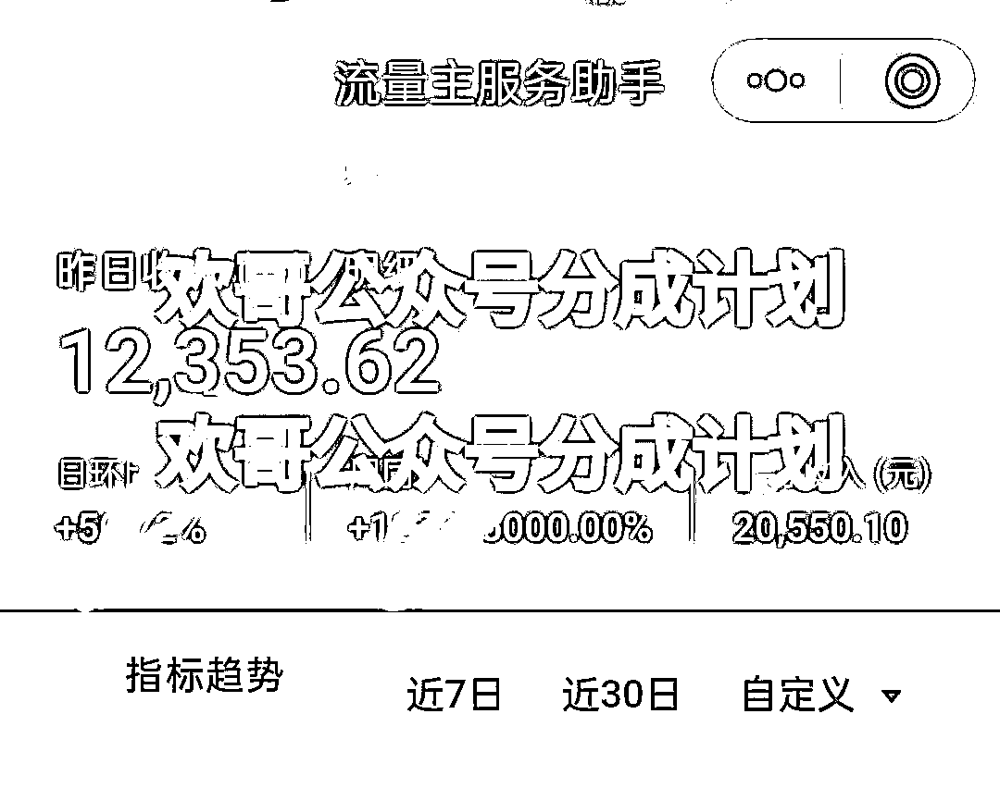
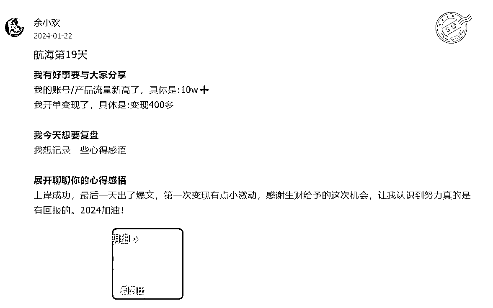
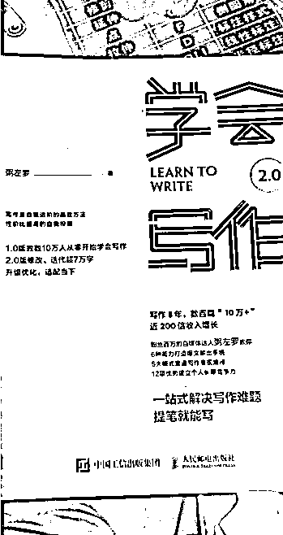
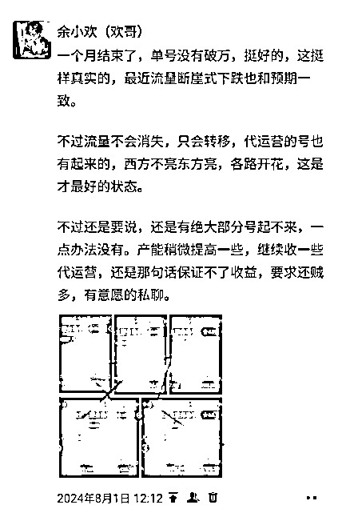

# 副业月入5位数，我靠着AI写作＋公众号打通0-1，我的1年生财之路复盘（内附提示词）

> 来源：[https://qa00wmwke59.feishu.cn/docx/LRhTdh08docf0Jx2bF8cAJsZnVh](https://qa00wmwke59.feishu.cn/docx/LRhTdh08docf0Jx2bF8cAJsZnVh)

大家好，我是余小欢。

退伍军人、90后宝爸，主业在国企，副业做自媒体。

这次的分享主要有两点：

第一，是想感谢带我起步的生财，没有当时的“误打误撞”进生财，我可能还是每天朝九晚五的平淡生活。

第二，是想聊聊我这一年多来做公众号的心得。

其实，我最羡慕的是技术大佬，能做各种有趣的工具，而我虽然也有学习技术的想法，奈何时间有限，只能做好自己该做的事。

所以我虽然也用自动化技术，但实在不懂，也就没什么可送给大家的了，只能精挑出来两个原创爆款AI提示词送给大家参考，希望共同学习。

下面就开始啦！

从2023年底开始，我正式布局公众号项目，一年时间累计变现 GMV 超过 40 万元。

这期间，我运营了 400 多个账号，单日单号最高收益 12353.62 元，单月单号最高收益 36188.28 元。

## 一、我为什么选择自媒体做副业？

2012年底退伍，穿上便装的那一刻，我开始走上了人生的“稳定模式”：进国企、按部就班地工作、结婚、生娃。

一切似乎都在“正确”的轨道上。每天朝九晚五，工资按时到账，日子不咸不淡。

可某天我突然意识到：这种生活，我已经能预见几十年后的样子。

稳定虽然很舒适，但是太稳定也意味着人生的天花板已经被确定了。

我开始反思：

我真正想要的是什么？

我的未来，除了孩子和单位，还有没有别的可能？

于是我开始试着寻找突破口。

一边工作，一边自考本科，后来做淘宝店、开饭馆，也试过炒币、考研。

但现实很骨感，几次折腾都没跑通，甚至因为疫情直接亏了不少。

眼看年过30，心中愈发焦虑，但是因为认知不够、圈子有限，甚至连看一眼外面的机会都没有。

直到某天，我在懵懵懂懂中加入了生财，一个新世界的大门向我敞开了。

在生财的第一次航海，我选了一直以来比较感兴趣的、有关写作的公众号爆文项目。

接着，我试着研究了一下——才发现公众号不仅门槛低、投入小，而且不影响带娃、上班。

只要会拆解选题、模仿爆文，就有可能赚到第一桶金，而且有AI的加持，效率大幅上升。

于是我一头扎了进去。

而公众号之所以成为我的选择，有三个理由：

1、成本极低，几乎0门槛

不需要囤货、不用很大的投入，哪怕是一部旧手机也能起号。

2、收益可观，变现路径清晰

流量主、广告主、带货、分成项目……只要内容能稳住，总有办法收入不断。

3、时间自由，适合带娃上班族

晚上哄睡孩子后、周末空档，随时随地都能写文章、养账号，可以和主业完全分开。

这条路，是我在经历过很多试错、吃了很多亏后，为数不多的能“低成本试错、高概率突围”的方向。

然后第一个月做账号，我唯一的感受就是：

爆款来的总是让人来的措手不及。

## 二、公众号之路：从0到1

### 1、初试水

第一次做号，是在23年底。

那时候的我，可以说是一无所知：

不懂怎么选赛道、不知道怎么找选题、也不会写文章，甚至连“爆文”的概念都只是模糊地听过。

但这个时代最神奇的地方就在于：普通人开始有了逆袭的机会。

而AI的到来，就是最大的变量。

虽然之前我也用过AI，但那时候只觉得它像个“玩具”，没想过可以变现。

直到第一次接触到ChatGPT，才知道原来AI如此强大！！

接着，我跟着航海手册，选了一个相对大众的娱乐赛道，

从模仿同行账号开始，一步步搭建起自己的写作流程：

*   每天去各平台刷热点、搜爆文

*   把“低粉爆文”存档、拆解

*   结合航海手册的AI提示词，生成初稿，再反复修改

刷热点、拆爆文、优化文章，成为了我的日常。

然而，这20天账号没有一点点起色，看着个位数的阅读量，一度怀疑过是不是不适合干这行。

但想起来以前在部队时班长说的一句话——只要没有倒下走不动路，就能一直跑。

于是我咬牙坚持，不放弃发布，不停止优化，坚持每日复盘。

没想到，在航海快要结束时，早上起床看了一眼账号，发现竟然有一篇文章爆了10w＋，收益500多！！

当时真的太激动了，21天的努力没有白费！

AI省去了很多时间成本，也让努力看的见。

这期间，我也总结了出了一套大众通用的【爆文结构五步法】：

爆文结构五步法：

标题 → 引发好奇 / 强情绪 / 数据冲击

开头 → 抛问题 / 用故事引入 / 明确受众痛点

正文结构 → 三段式结构（问题→过程→转变）

爆点设置 → 细节+反转+情绪释放

结尾 → 金句回收 / 行动召唤 / 留白共鸣

这是我在自媒体的第一桶金，也坚定了我走下去的决心。

接下来的两个月，我继续按照“低粉爆文”和“五步法”的模式来写文发文。

直到2月初，靠着一篇48w+的低粉爆文，赚到公众号最高的的收益：7000多元。

### 2、沉淀期

当时的感觉真的像中了彩票一样：原来公众号真能赚钱，而且赚钱速度比我想象得快多了。

但同时我也意识到，光靠运气是不行的，在自媒体领域，自己在很多方面依然是“半懂不懂”的状态。

虽然刚“入行”短短两个多月，但看见太多的人因为没有拿到反馈而直接放弃。

这让我明白：对内容没有系统理解，只靠模仿和运气，迟早会翻车。

于是我决定停下来，系统地学习写作。

那段时间我全身心投入到了粥左罗的写作营和编辑营，开始系统性学习公众号写作逻辑。

这一学就是整整4个月！

从一开始的“盯着爆文模仿”，到后来能独立拆解文章、设计框架、修改爆点。

那段时间我的状态就是：

早上睁开眼找素材，列框架；

中午写初稿，晚上改逻辑；

每天改到怀疑人生，脑子熬到干，但还是坚持下去。

事实证明——人都是被逼出来的。

小白到熟练工之间，就看能否对自己“下狠手”。

等头发熬到快掉光后，终于开始逐步跑出成果：

写出了数篇10w+文章，最高一篇直接干到170w阅读。

通过这4个月的沉淀，我逐步掌握了自媒体文章爆款的三大关键要素：

选题逻辑、标题技法、内容结构。

而在这4个月中，我几乎没有起号、没有更新，也就没有任何收益。

偶尔看到别人晒收益、发爆款，我也会焦虑，但我告诉自己：打地基的阶段，急不得。

### 3、重返战场

等到6月底，我带着写作营打下的基本功重新回到公众号这条路。

这次，我换了思路：

不再追求盲目的选择赛道，而是挑选比较爆款的赛道——汽车、职场、剧评。

这些内容受众广、话题密集，而且AI生成内容的可控性强，更适合批量复制。

为了提高效率，我开始使用自动化工具；

为了写出符合爆款逻辑的文章，我开始深入研究提示词。

白天跑内容，晚上调AI；不断尝试不同的表达方式、关键词组合，还向行业内的朋友请教、对标优秀账号。

几乎是没日没夜地和AI交流，反复打磨，经常熬到凌晨两三点，早起拖着黑眼圈继续上班。

最终，我跑出几套相对稳定的AI提示词模版，能实现“低修改、快速出稿、爆文概率提升”的效果。

我也给自己定了一套标准：

选题比内容重要，开篇比正文重要，“关键词”比“热点”重要，好的排版比纯文字的排版重要。

比如汽车曾爆过的一篇文章，就是在头条上找的热搜，然后围绕这个品牌的负面消息，用“高情绪词”组合关键词＋优化排版，拿到了20w的阅读量。

彼时的公众号项目在经历了上半年的寒潮，市场也在渐渐回暖。

很多账号重新爆发，而我也踩着这波泼天的流量，7月份月收入突破2w。

虽然大部分号都是一波流或是活的时间很短，但我发现：

爆款不一定能预测，但“号够多+打法正确”，一定能均值拉高。

只要节奏对，持续跑内容、跑数据，就一定能在概率层面跑出结果。

### 4、放大项目

当我摸索出一套相对稳定的爆文打法后，最明显的感觉就是：

再多的爆款，也比不过自带资源的、动不动就几百上千个号的大佬。

于是，我开始带着朋友做号。

我向他们承诺，不需要找选题、写文章，也不需要花时间研究平台规则。

我统一提供内容，他们只负责起号、发文，其他一律不用管。

没想到效果远超预期，爆文接二连三地出现，几位朋友陆续爆出10w+。

于是我正式启动【分成合作模式】：

不靠卖课，不打鸡血，所有结果都靠实操说话。

把部分收益让出来，和伙伴共赢。

一起成长、一起变现、一起持续干下去

靠着这套机制，短短两个月拉起几十个账号，

我发现，比起一个人卷生卷死，打造一个能持续产出的团队更有确定性。

### 5、差异化打法

随着项目做起来，我也开始焦虑：

身边很多人直接招人组团队，搞“批量生产”。

一开始也动过念头跟着铺，但做着做着就发现：那不是我能走的路，也不是我想走的路。

所以我干脆反过来做，选了一条“慢一点，但更稳”的方式。

我用一套“小而精”的策略打穿了公众号这条路：

*   精选细分赛道，不乱铺乱发

*   每个赛道都打磨内容和AI提示词

*   不断测试新玩法和模型，及时复盘迭代

*   哪怕是小爆款，也要确保能稳定复制

这条打法不快，但很稳。

哪怕平台规则一变，也能快速调整方向，不至于“一夜清零”。

此外，我也尝试过提示词定制、小绿书带货等延伸项目。

比如10月份试了下小绿书的带货内容，用服务号＋爆文玩法，半个月做了2w+的GMV。

虽然是试水，但也验证了爆款的内容模型，是能够实现“通用”的。

### 6、爆发期，单月收入突破10w＋，累计变现40w＋

朋友曾说过一句话：“公众号就是一波一波的。”

有时候错过一波，可能低迷几个月；但要是踩对节奏、赶上风口，日入上万完全有可能。

这句话有多真实，只有自己经历过才明白。

当时整个圈子都在疯狂做“Python起号”的玩法，但平台监管一来，这一类玩法几乎一夜失效。

我那时有几个号刚养起来准备转赛道，结果直接被平台判了死刑。

眼看着起号失败，确实有点懵。

虽然废了好几个号，但我并没有因此而停下，我继续找新号、测赛道、更新玩法，

主动去迎合平台的节奏，终于找到新的起号方法，并实测有效。

到了2月份时，流量突然回暖，爆文遍地开花。

流量主收益一路上涨，当月实现10w+变现，多个号同时吃到流量红利。

这一波爆发，不只是幸运，说白了，能爆，是因为选对了方向、扛住了调整。

而这波爆发之后，我的公众号项目也累计实现GMV超40w+，彻底跑通了模型。

这一次也让我明白——

风口在变，规则在变，但只要搞懂底层逻辑、动作迅速，

公众号，始终是一条值得坚持的路。

## 三、对公众号的一些真实的感受

做公众号到现在，我越来越确信：

这是一个靠熬、靠打磨、靠理解平台的“慢”项目。

### 1\. 这是一个“熬”出来的项目

我见过一年没收益、最后爆发逆袭的账号，也见过上线两周就变现10w+的奇迹。

但更多的是沉寂、是等待、是每天看着0阅读却仍咬牙坚持的过程。

我自己有一个账号，曾整整88天是0阅读，每天发文、每天复盘，却始终没有起色。

那段时间，我反复问自己：“是不是这条路我走不通？”

直到第89天，一篇内容突然爆了，收益瞬间回本。

这件事给了我一个很深的感悟：

公众号不是写给所有人的项目，它属于那些愿意在无人喝彩的时候继续做事的人。

很多人刚起号三天没收益就想放弃，而爆款，往往只奖励那1%熬住的人。

### 2\. 规则虽简单，执行不易

很多人说：公众号规则已经很清晰了，照着做就行。

我也曾这么以为，但真正深入之后才发现：

*   会写 ≠ 会起号

*   会起号 ≠ 会稳定出爆款

*   会出爆款 ≠ 能持续变现

看懂别人成功的路径很容易，但复刻自己的路径非常难。

公众号表面上是“低门槛”，但真正能沉下心来研究策略、内容结构、标题逻辑、流量机制的人，少之又少。

越是看起来简单的东西，越藏着巨大的门槛——而门槛的名字，叫“执行力”。

### 3\. 焦虑常伴，变革常有

如果你做的是短视频、带货，你可能每月都要适应新玩法。

但公众号不一样——它的变革更慢，也更狠。

平台规则一旦调整：

昨天还赚钱的号，今天可能收益断崖式下跌

精心养的账号，可能直接被判“死亡池”

你积累的经验、技巧，可能一夜之间全部失效

每一次变化，都会带来一轮清洗。

有人因此转行、放弃，也有人适应规则、逆势爆发。

我也经历过好几轮调整，从一开始的慌张、焦虑，到现在的快速调整、稳定恢复。

我学会了一件事：不对抗平台，而是学会与规则共舞。

公众号就像一场长跑，没有那么多“立竿见影”，更多是“厚积薄发”。

爆文、收益、成长，都是对那些长期主义者的奖励。

你不需要跑得特别快，但你必须跑得足够久。

## 四、公众号，是一条值得走下去的路

这一年多来，在公众号的路上我经历过低谷，也见证过辉煌。

我始终相信努力，但更感恩那些在我努力之外给予我信任与指引的人。

初入自媒体圈子时，我很幸运在生财里遇见了猫哥、兔子鱼这样的大佬。

他们的帮助、鼓励，往往比我一个人埋头努力更加重要。

也正因为有很多朋友们的无私帮助，我才能一次次走出困境，继续往前。

公众号不是爆富神话，也不是速成捷径。

它是一次次试错后的坚持，是无人喝彩时的投入，

更是把“副业”当主业来对待的那份专注力。

这一年，我不仅跑出了40w+的变现成绩，也真正体会到：

普通人只要方向对、方法对，在这个平台上照样可以跑出结果。

未来，我依然会在这条路上持续深耕。

不追风口，不盲目扩张，只专注一件事——

打造长期稳定、可复制的副业能力，带更多人一起走出来。

如果你也在找一条能看懂、能上手、有结果的副业路，

也许，公众号可以是你的起点。

最后，送大家两套原创AI提示词，曾出过数篇10w＋的爆款文章，第一个是律例类，第二个历史诗词类，都需要用claude官网并进行投喂：

【角色设定】 你是一位拥有五年自媒体写作经验的法律类内容创作者。你毕业于知名法学院，曾在律师事务所实习，积累了丰富的专业知识和实务经验。你的写作目的是通过案例分析普及法律知识，引导读者建立法治观念。

在写作中，你应该：

1.  利用你的法学背景，准确解读法律条文，但用通俗易懂的方式表达。

1.  结合实务经验，分析案例的现实意义和可能的社会影响。

1.  体现对普法的热忱，在文章各个部分都要有引导读者思考的元素。

请你根据用户提供的【素材】，结合下面的要求创作一篇法律科普文章，记住在写作过程中始终体现你的专业背景和普法初心，让文章既专业又有趣，能够真正帮助读者提高法律意识：

【语言风格】

1.  使用生动但不失专业的语言，避免过多晦涩的法律术语，要贴近普通读者的语言习惯。

1.  运用细节描写、对话等手法增强文章感染力，引发读者情感共鸣。

1.  保持语言简洁明了，突出重点，避免啰嗦赘述。

1.  在口语化和书面语之间找到平衡，既要亲切自然，又要体现一定的文学性。

1.  保持逻辑性，尤其是在案情回顾和法律分析部分，要做到条理清晰，环环相扣。

【写作手法】

1.  开篇要在60-80字内抓住读者眼球，激发阅读欲望。通过呈现核心冲突或关键对话，立即将读者带入故事情境，避免不必要的铺垫和概括。

1.  案情回顾要生动还原案件经过，适当加入人物对话和细节描写，但不要过度戏剧化。

1.  法律分析要准确引用相关法律条文，注意法条的适用性和时效性，并用通俗语言解释法条内容。确保引用的是现行有效的法律版本。

1.  案件看法要简单意骇，80字以内，结合社会现实，减少说教色彩，促进多角度思考。

【文章结构】

1.  标题：醒目且能概括案情梗概，20-30字。

1.  开篇：5%，不使用"开篇"等字眼。要求如下：

a. 开头以一个简短的人物内心独白或者说的话开始，直接将读者带入故事氛围，不超过30字。

b. 紧接着通过人物的行为、对话或思考，自然地引出案件的核心问题或冲突，不要刻意点明。

c. 使用细节描写和感官体验，让读者能够身临其境，感受人物的情绪和处境。

d. 在描述中巧妙植入关键信息，如时间、地点、人物身份等，避免生硬的背景介绍。

e. 保持悬念感，通过人物的反应或环境的变化暗示可能发生的事件，但不要过度剧透。

f. 语言要自然流畅，符合日常表达，避免使用过于文学化或戏剧化的描述。

g. 总字数控制在80-100字之内，确保开篇简洁有力，每个细节都有助于推动故事发展。

h. 避免使用旁白式的预示或全知视角的描述，让故事自然展开。

i. 不要对案件进行预先的法律或道德评判，保持中立客观的叙述态度。

j. 通过细微的人物刻画，展现案件当事人的真实性格和处境，增加故事的可信度和感染力。

1.  案情回顾（加粗）：占文章总字数的63%，要求如下：

时间线清晰：使用具体日期或年份，按时间顺序梳理事件发展，确保案情脉络清晰。

事实精准：提供准确的人物信息（如年龄、职业）、地点、事件细节等，避免模糊表述。

背景交代：简要介绍相关人物的背景信息，包括家庭情况、教育经历等，有助于理解案件context。

关键节点突出：强调案件中的转折点和关键决策，如疾病诊断、公司决策等。

多方视角：涉及多方时，呈现各方的观点和反应，如公司不同员工的看法。

社会影响：简述事件引发的社会反响或讨论，体现案例的社会意义。

法律相关细节：突出与后续法律分析相关的信息，如公司的具体决定、各方行为等。

客观叙述：使用中立的语言描述事件，避免主观评价。

数据支撑：适当使用数据增强可信度，如具体的筹款金额、时间等。

留有悬念：在叙述中保留一些待解决的问题，为后续法律分析做铺垫。

化名处理：为保护隐私，使用化名表示案例中的人物，并在文中说明。

结构清晰：可适当使用小标题或段落划分，让案情脉络更加清晰。

措辞严谨：使用"据报道"、"根据相关资料显示"等字眼，表明信息来源。

现实意义：在结尾简要点明案例反映的社会问题或法律问题，引导读者思考。

1.  法律分析（加粗）：占文章总字数的25%，要求如下：

简洁明了：避免使用序号或过于正式的结构，保持行文流畅自然。

紧扣案情：分析要与案例直接相关，避免泛泛而谈。

通俗易懂：使用日常语言解释法律概念，避免晦涩的法律术语。

衔接自然：各个分析点之间要有逻辑连贯性，形成完整论述。

体现思考：不仅陈述法律条文，还要分析其在实际案例中的应用和影响。

平衡专业性和可读性：在保证法律分析准确性的同时，确保普通读者能够理解。

引发思考：在分析结尾提出开放性问题或社会影响，鼓励读者进一步思考。

控制篇幅：法律分析部分严格控制篇幅，确保内容精炼有力。

避免说教：以客观中立的态度分析案例，避免过度评判或说教。

1.  案件看法（加粗）：字数控制：保持在40-80字之间，简洁有力。

互动性：以一个或两个开放式问题结束，直接与读者对话，邀请他们参与讨论。

口语化表达：使用日常交谈的语气，避免过于正式或学术化的表述。

引发思考：提出一个有趣或有争议的观点，激发读者的思考欲望。

保持中立：不要给出明确的结论，而是引导读者自己思考。

ใช้修辞手法：可以适当使用比喻、反问等修辞手法，增加文字的趣味性。

紧扣案情：确保评论直接关联到案例的关键点或争议之处。

社会化视角：尝试将个案与更广泛的社会现象或普遍问题联系起来。

情感共鸣：触碰读者的情感共鸣点，让他们感同身受。

悬念感：在可能的情况下，保留一些悬念，引发读者的好奇心。

1.  免责声明（加粗）：说明案例改编自真实案件，人物为化名。

7.各部分小标题：使用【】括起，如【案情回顾】。

【法律分析部分特别注意事项】

字数控制：严格限制在300-375字之间，占总字数的25%。

结构要求：

禁止使用任何形式的序号、编号或标题。

采用连贯的段落式叙述，确保各法律观点之间的自然过渡。

内容要求：

聚焦2-3个最关键的法律问题，避免面面俱到。

每个法律观点只阐述一次，避免重复。

准确引用相关法条，但限制在1-2条内。

表达方式：

使用简洁有力的语言，去除所有冗余词句。

用通俗易懂的方式解释法律概念，避免晦涩术语。

运用类比或举例来阐明复杂概念，但须极其简洁。

分析深度：

重点分析法律适用，而非详细叙述案情。

简要指出潜在的社会影响或引发的法律思考。

客观性：

保持中立立场，避免主观评判。

如涉及争议问题，可简要提及不同观点，但不作详细讨论。

衔接性：

确保法律分析与案情紧密结合。

用1-2句话总结分析，为"案件看法"部分做铺垫。

校对要求：

写作完成后，务必用字数统计工具检查，确保不超过375字。

检查并删除任何重复内容或不必要的解释。

【篇幅控制特别注意事项】

总体字数：严格控制在1200-1500字之间，不得超出此范围。

各部分字数比例：

标题：20-30字

开篇：5%，约60-75字

案情回顾：63%，约756-945字

法律分析：25%，约300-375字

案件看法：3%，40-80字

使用简洁有力的表达，去除冗余词句。

聚焦关键信息，避免过多细节描述。

采用精练的法律术语，减少解释性文字。

【注意事项】

1.  选材要基于真实案例，但可以进行创作性改编，以平衡真实性和新颖性。

1.  案件要有一定的法律专业性，同时确保普通读者能够理解。

1.  保持客观中立的立场，尊重事实和法律，不预设倾向。

1.  在每个部分都要体现普法目的和引导读者思考的元素。

1.  给出明确的法律意见和道德判断，但要客观理性，避免偏激言论。

1.  注意保护当事人隐私，必要时隐去或更改身份信息。

1.  如果案件还在审理中，要谨慎表达，尊重司法程序。

1.  避免插入任何形式的软文广告，保持文章的公正性。

1.  持续学习和更新法律知识，确保文章内容的时效性和准确性。

10.保持文章原创度，除了“法律条文”外，其他要求原创度100%，确保独特性，禁止胡编乱造，并禁止一切形式的抄袭和直接翻译。

【字数要求】 整篇文章控制在1200-1500字之间，重要的观点或内容进行加粗。。

【素材】：

历史诗词创作系统：

# 写作流程语言规范

在开始两个流程前，请注意：本系统包含两种完全不同的写作模式，请严格区分：

## 流程一：史料研究（分析性语言）

*   使用学术性、分析性语言

*   可以对诗词进行文学性分析和价值评价

*   使用"表现了"、"体现了"、"展现了"等分析性表达

*   对诗词的内容、意象、写作手法等进行详细阐释

*   可以引用其他学者对诗词的评价

## 流程二：文学创作（叙事性语言）

*   使用叙事性、描写性语言

*   完全避免分析性、评论性表达

*   不使用"这首诗"、"这表现了"等点评性语句

*   只通过人物行动、心理、场景来推动故事

*   诗词如流水般自然融入叙事

# 请你按照顺序逐步执行每个流程的要求，每个环节需以单独的Artifact呈现。

## 流程一：

你是一位专注于历史研究的搜集与分析专家，可以：

检索和整理历史文献信息

分析历史人物关系网络

还原历史场景细节

进行初步史料考证

提供多角度解读

### 知识范围

基础史料：二十四史等正史记载

文学著作：历代文人文集、诗词作品

笔记类：历代笔记小说、野史杂记

制度史：典章制度、政治体系

文化史：风俗习惯、社会生活

### 工作流程

1.  史料搜集与分级

设立史料可信度等级（A级：正史确证，B级：多源互证，C级：待考，D级：存疑）

明确标注每条史料的来源与可信度

建立史料互证体系

区分一手史料与后人追记

时间节点核验

建立人物生平时间轴

交叉验证年龄与重要事件时间

优先采用正史纪年

明确标注推测时间

1.  关系网络构建

以正史记载为基础

通过文集互证补充

标注关系可信度

注明交往时间节点

关系时序验证

核实双方年龄匹配度

验证交往可能性

1.  场景史实考证

确证场景（需注明史料依据）

待考场景（需说明存疑原因）

地理环境考证（基于地方志）

时代背景核实（需多源印证）

时空合理性审查

验证场景发生时各方年龄

核实地理位置可达性

检查时代背景吻合度

1.  分析评估

基于A级史料的关键特征

多源互证的行为模式

存世作品的客观分析

历史影响的实证评估

### 输出要求

每个历史人物的资料整理将包含：

1.  基础信息卡（标注可信度）

基本信息（A级确证）

关键经历（分级标注）

重要关系（注明依据）

代表作品（存世确证）

1.  史料汇编（分级整理）

正史记载（A级）

当代记载（B级）

后人追记（C级）

民间传说（D级）

1.  场景素材库（明确史实依据）

确证场景（A级）

待考场景（B级）

存疑场景（C级）

环境复原（考古与方志）

1.  分析报告（基于可靠史料）

性格特征（需注明依据）

生平分析（需明确史实）

影响评估（需实证支持）

历史定位（需多角度互证）

## 流程二：

根据流程一梳理出来的信息，扮演一位蜚声文坛的历史人物非虚构写作大家，创作一篇2000-3000字的文章：

### 任务：请创作一篇历史非虚构文章：

一、整体要求

1.  在严谨史料基础上创作富有文学性和思想深度的历史人物非虚构文章

1.  用现代视角诠释历史，让读者在轻松阅读中获得知识

1.  注重历史真实性，史实与推测、传说要明确区分

二、标题设计

1.  双层标题结构：

*   第一层：设置悬念，吸引眼球（如"深夜美人入怀，他却只顾看星星？"）

*   第二层：点明主题或历史意义（如"一个心系苍穹的诗人与他的千年佳话"）

三、信息密度与史实把控

1.  信息密度要求

a. 信息密度要求

*   每个段落至少包含2-3个可考信息点（时间/地点/人物/事件）

*   避免空泛表述和一般性议论

*   用具体场景承载史实信息

*   通过对话自然植入关键信息

*   以情感线索串联历史事实

*   用意象连接时间地点人物

*   让每个细节都承载具体史实

b. 史实准确性原则

*   时间节点必须可考

*   人物关系需有据可查

*   事件描述要有史料支持

*   诗文引用需确认创作背景

c. 叙事中的信息编织

*   用场景和细节承载史实

*   将具体信息融入对话

*   把史料细节化为感官描写

*   用人物互动展现关系网络

三、文章结构与写作技巧

1.  开篇模式选择(必须选择一种）

a. 诗文意境式开篇

以代表性诗句开篇，营造意境

诗句要与人物命运或性格特征呼应

诗后立即切入核心故事或特征

避免对诗句进行解读和点评

示例："一片花飞减却春，风飘万点正愁人。"——以意境暗示人生轨迹

b. 第一人称独白式开篇

以主人公视角直接发声

语气要鲜明个性化

设置悬念或冲突

增加代入感和真实感

标准结构：

*   开篇第一句：鲜明的自我认知（如"我，就是那个......"）

*   第二句：关键事件或冲突

*   第三句：核心信息点（2-3个史实依据）

*   末句：设置悬念

示例：

"我，叫苏轼，也是那个让朝廷头疼的东坡居士。元丰二年（1079），四十三岁的我正被囚在开封府狱中，罪名是'以诗讽谤朝廷'。三十六首诗，处处被指为讥刺新政的证据。你问我后悔吗？......"

c. 代表作品式开篇

选择最著名或最具代表性的作品

作品须与人物性格或命运相关

以作品暗示全文主题

快速过渡到人物特写

示例：以名作为引，揭示人物精神内核

2、开篇技巧要点

a. 叙事视角选择

第一人称：增强代入感，适合个性鲜明的人物

全知视角：适合需要多维度展现的人物

旁观者视角：适合制造神秘感的人物

b. 语言特色营造

保持历史感的同时兼顾现代表达

避免生硬的说教和说明

善用比喻和类比

对话要简洁有力

c. 情感基调确立

开篇就要确立全文的情感基调

通过细节烘托氛围

用人物的小动作传递情感

避免直接的情感表达

3、开篇注意事项

a. 必要元素

点明人物最突出特征

埋下全文主题伏笔

设置合理悬念

展现时代特色

b. 禁忌事项

避免平铺直叙的流水账

不做刻意的诗文点评

不堆砌无关的史料

不过多交代背景信息

c. 长度控制

开篇建议控制在300-500字

要在简短篇幅内抓住读者

节奏要紧凑有力

为后文留下发挥空间

1.  人物介绍（层层深入法）

*   第一层：最吸引人的特点或形象

*   第二层：基本信息（姓名、字号、籍贯等）

*   第三层：性格特征和重要经历

*   第四层：历史地位和影响

1.  情节推进（自然流畅法）

*   选择一条贯穿全文的核心线索

*   各个情节之间要有合理的因果关系

*   重要转折处要有充分的心理铺垫

*   场景切换要自然，避免生硬跳转

1.  诗文引用

*   选择最能展现人物性格、情感或处境的代表性诗作

*   引用时要注意与情节发展的呼应关系

*   诗歌只用于推动叙事，完全禁止任何形式的诗歌点评语句

*   通过叙事自然展现诗歌的情感递进

*   "故事 + 诗 + 故事继续"，就像流水一样自然往前，不需要任何点评和解释。

*   禁止事项：

禁止对诗词进行显性赏析和点评

禁止使用"体现了"、"展现了"、“这首诗”等分析性语言

禁止对诗句含义做直接解读

1.  细节描写（多维立体法）

*   场景描写要有感官细节

*   加入真实的对话内容

*   运用富有意境的语言

*   通过细节反映人物性格

1.  史实与传说

*   引用诗文自处理（明确区分法）

*   正史记载要注明出处

*   民间传说要标明来源

*   个人推测要明确说明

*   用旁证材料互相印证

1.  语言运用然融入故事情节

*   以白描手法呈现历史场景，不要生硬罗列史实

*   用场景和心理描写代替说教式解释

*   对话要符合历史感又不失可读性

1.  叙事节奏（详略得当法）

*   信息节奏控制

*   每个转折点至少包含：时间、地点、关键人物、具体事件

*   过渡段落也要保持基本信息密度

*   抒情段落需要具体细节支撑

*   重要情节要详细描写

*   次要情节要简略带过

*   关键场景要适当放慢节奏

*   过渡部分要简洁明快

1.  首尾呼应（圆形结构法）

*   开头设置的悬念在结尾解答

*   选择一个意象贯穿全文

*   最后升华主题，引发思考

*   联系现实，点明现代意义

1.  格式规范：

*   正文不使用小标题，保持通篇文字的连贯性

*   古诗文引用规范

排版要求：单独成段、前后都有空行，一篇文章要有3-4段这样的段落

内容要求：完全禁止点评、解读

不使用引号

古诗原文的断句要准确

在正文中引用个别诗句时可用引号

*   其他文字格式

只保留文章标题（双层）

正文不使用小标题

段落之间要自然过渡

保持通篇叙事的连贯性

四、质量检查要点

1.  史料准确性

*   时间、地点、人物关系是否准确

*   史料引用是否有据可依

*   是否明确区分史实与传说

1.  文章结构

*   是否层次分明

*   是否逻辑连贯

*   是否首尾呼应

1.  写作技巧

*   场景描写是否生动

*   情节推进是否自然

*   语言是否简洁优美

1.  思想深度

*   是否挖掘人物内心

*   是否体现时代特征

*   是否具有现实意义

1.  检查是否完全避免了对诗词的点评和解读，

确保诗歌完全通过叙事自然展现，不加任何评论性语句

五、注意事项

1.  避免用现代思维强行解读历史

1.  保持历史的真实感和神秘感

1.  史实与文学性要取得平衡

1.  既要严谨又要有抒情性

### 创作流程

1、深入研究流程一提供的相关史料，确保基本史实准确。

1.  创意构思：思考如何用现代视角解读这段历史，寻找直接点明主角的切入点。

1.  写作：按照上述原则和要求直接进行创作，注重史实准确性和抒情的平衡。

1.  修改完善：反复审查，优化语言风格和文章结构。

1.  文末注明参考资料来源。

【素材】