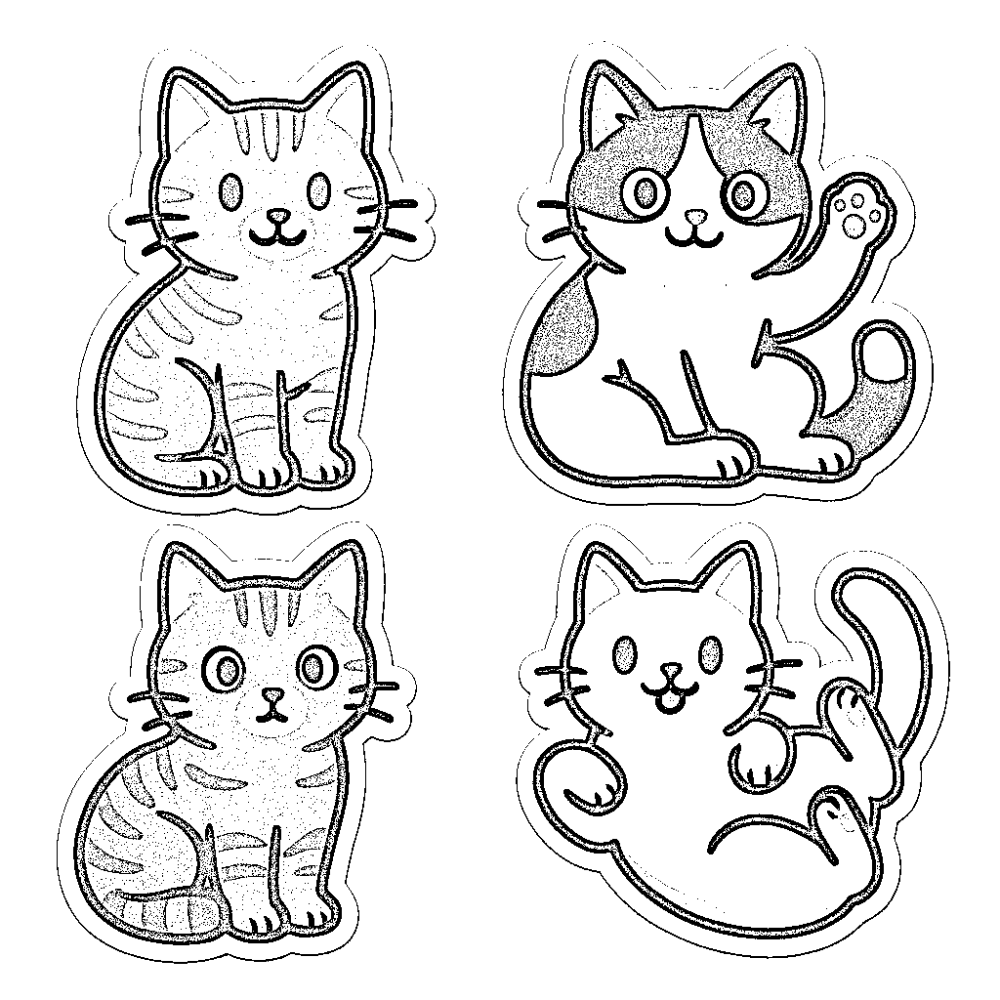

# 图像API工作流3_OpenAI（全能4种）

> 来源：[https://aigcstudy.feishu.cn/docx/L2i3d2mFQo6CTuxSf30cXZZjnHc](https://aigcstudy.feishu.cn/docx/L2i3d2mFQo6CTuxSf30cXZZjnHc)

### ComfyUI 工作流使用 OpenAI 三种最新生图模型自动批量出图（保姆级教程+工作流下载）

# GPT-Image-1 工作流

OpenAI 在今天发布了 GPT-Image-1 API（与 ChatGPT 4o 图像模型相同的模型）。ComfyUI 现在支持通过原生的 API 节点（测试版）来使用 OpenAI 最新的图像生成模型，让你无需复杂的 API 密钥，直接在 ComfyUI 中访问最先进的功能。而且可以使用微信或者支付宝直接充值使用OpenAI GPT-Image-1，OpenAI DALL·E 3，OpenAI DALL·E 2三个不同的生成图片模型，无需CHATGPT账号。下面来来详细介绍ComfyUI 工作流中使用 OpenAI 三种生图模型 批量出图保姆级教程。

### 为啥用ComfyUI？核心是批量自动生成图片 且可以结合其他AI视频模型，AI音频模型，AI数字人模型，共同制作AI视频。

### OpenAI GPT-Image-1 节点支持

*   文生图

*   图生图

*   多图生图

*   图像编辑功能（通过蒙版进行修复绘制）

## 文生图工作流

1.  文生图像工作流对应的工作流非常简单，你只需要加载 OpenAI GPT-Image-1 节点，在 prompt 节点中输入你想要生成的图像的描述，连接一个 保存图像（Save Image） 节点。工作流如图所示。提示词cat stickers（猫贴纸）

1.  运行工作流，生成结果

1.  参数详解

1.  积分消耗

## 图生图工作流

1.  图生图工作流中，我们使用 OpenAI GPT-Image-1 节点生成图像，并使用 加载图像（Load Image） 节点加载输入的图像，然后连接到 OpenAI GPT-Image-1 节点的 image 输入中，工作流如图所示。提示词turn this image into ghibli style（转换图片为吉卜力风格）

你也可以这样，使用中文提示词帮我改成适合激光镭雕的黑白线稿等等

1.  我们将用下面的图片作为输入。

1.  运行工作流，生成结果

1.  积分消耗

## 多图生图工作流

1.  图生图工作流中，我们使用 OpenAI GPT-Image-1 节点生成图像，并使用 多个加载图像（Load Image） 节点加载输入的图像，然后使用图像组合批次把输入的两个图结合起来，最后然后连接到 OpenAI GPT-Image-1 节点的 image 输入中，工作流如图所示。提示词Put the hat on the cat's head and turn into ghibli style（给猫带上帽子并转换图片为吉卜力风格）

你也可以这样使用中文提示词，让猫带上帽子，让图1角色坐在夜间的路边咖啡馆喝咖啡，日本动漫风格，确保2个图片的原始特征保持一致不能改变。

1.  运行工作流，生成结果

1.  积分消耗

## 局部重绘工作流

1.  GPT-Image-1 节点也支持图像编辑功能，允许您使用蒙版指定要替换的区域，下面是一个简单的局部重绘工作流示例，其实你发现和图生图工作流一模一样。区别在于与图生图工作流相比，我们在Load Image中通过右键菜单使用 蒙版编辑器（MaskEditor） 并绘制蒙版，然后连接到 OpenAI GPT-Image-1 节点的 mask 输入中，来完成对应工作流。

### 注意事项

*   当输入大尺寸图片时，节点会自动将图像缩小到合适的尺寸

*   API 返回的 URL 是短期有效的，请确保及时保存需要的结果

1.  我们在输入图片右键，选择在遮罩编辑器中打开。

1.  遮罩编辑中添加遮罩，点击保存。

1.  添加完遮罩后，对应工作流入图所示，提示词为Let the cat hold a big fish（让小猫举着一个大鱼）

1.  运行工作流，生成结果

1.  积分消耗

# DALL·E 2 工作流

### 这个节点支持

*   文生图

*   图像编辑功能（通过蒙版进行修复绘制）

*   不支持图生图

*   不支持多图生图

## 文生图工作流

1.  你只需要在加载 OpenAI DALL·E 2 节点后，在 prompt 节点中输入你想要生成的图像的描述，并连接一个 保存图像（Save Image） 节点，然后运行工作流即可

1.  运行工作流，生成图片

1.  参数详解

1.  积分消耗

## 局部重绘工作流

1.  DALL·E 2 支持图像编辑功能，允许您使用蒙版指定要替换的区域，下面是一个简单的局部重绘工作流示例，使用加载图像（Load Image）节点加载图像，在OpenAI DALL·E 2 节点 image 输入中连接加载的图像，编辑 prompt 节点的提示词，OpenAI DALL·E 2 节点 mask 输入中连接蒙版

注意事项

*   如果您想使用图像编辑功能，必须同时提供图像和蒙版（缺一不可）

*   蒙版和图像必须大小相同

*   当输入大尺寸图片时，节点会自动将图像缩小到合适的尺寸

*   API 返回的 URL 是短期有效的，请确保及时保存需要的结果

1.  我们将使用下面的图片作为输入

1.  在加载图像节点中右键，选择 遮罩编辑器（MaskEditor）

1.  在遮罩编辑器中，使用画笔绘制你想要重绘的区域

1.  运行工作流，生成结果

积分消耗

# DALL·E 3 工作流

### 这个节点支持

*   文生图

*   不支持图生图

*   不支持多图生图

*   不支持图像编辑功能

## 文生图工作流

1.  文生图像工作流对应的工作流非常简单，你只需要加载 OpenAI DALL·E 3 节点，在 prompt 节点中输入你想要生成的图像的描述，连接一个 保存图像（Save Image） 节点。工作流如图所示。提示词A fox running in the snow, with snowflakes swirling around it. The background features coniferous forests and mountains, and there is the evening light.（一只狐狸在雪地里奔跑，雪花在它周围盘旋。背景是针叶林和山脉，还有傍晚的光线） 0.55

1.  运行工作流，生成结果

1.  参数详解

1.  积分消耗

# 下载工作流

https://gitee.com/lailai666/comfyui_workflow/blob/master/API%20PIC/%E3%80%90API%E5%9B%BE%E5%83%8F%E3%80%91openai.json