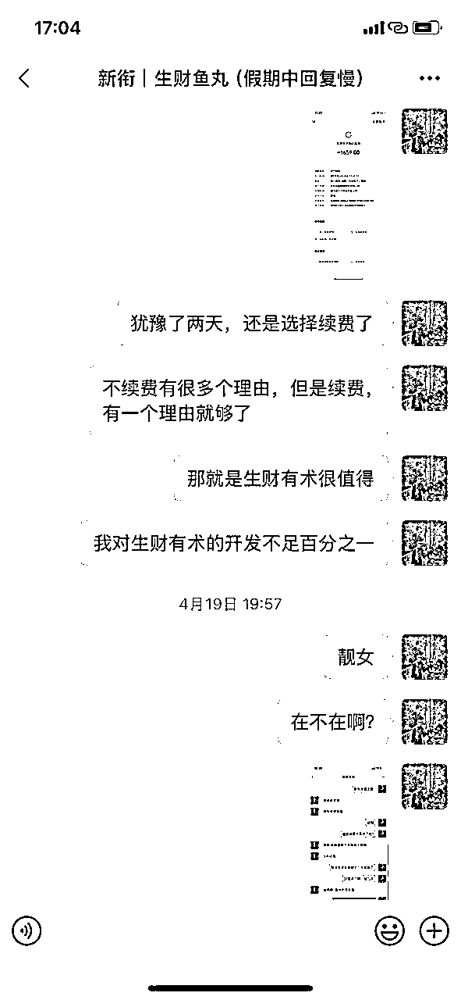

# 第一次参与生财有术分销，成为王牌种草官，我的从0到1之路

> 来源：[https://sqtgjk175rz.feishu.cn/docx/IQBcdtV0ToTDtFxolrNcvhnYnLf](https://sqtgjk175rz.feishu.cn/docx/IQBcdtV0ToTDtFxolrNcvhnYnLf)

# 前言

圈友们好，我是吴泽承，第9期「生财有术」的王牌种草官。

说实话，在今年4月20日之前，我完全没有拉新经验，而且我是在4月19日晚上才续费的「生财有术」。所以，整个过程从有了拉新的想法，到开始行动，再到最后实现6天18万营业额、单日最高9.6万，且没有一单退费，可以说是一次全新的尝试。

这个过程对我来说非常有价值，也让我决定将分销「生财有术」作为一个长期项目来推进。

我相信，有不少圈友同样认可「生财有术」的价值，并希望能推荐合适的人加入。因此，我整理了这段时间以来的实践经验，将从0到1完整分销的操作手册分享给大家，涵盖了引流、转化和交付的各个环节。

为了尽可能呈现操作过程的全步骤，细节信息我会通过飞书链接呈现，大家可以点击跳转内容，深入了解每一个环节的具体操作。

希望你耐心阅读，并能够从中找到对你有帮助的思路和方法。也欢迎你与我一起实践，把这个社群推荐给更多有需求的人，共同成长。

# 一、引流板块：精准触达潜在用户

想要分销「生财有术」，第一步就是精准找到真正对社群感兴趣的意向用户。

这次我尝试了三种引流方式：

*   通过自己的朋友圈

*   合作社群，通过分享吸引意向用户

*   利用「生财有术」提供的免费体验卡进行全渠道分发与付费推广。

以下是我实践这三种引流方式的要点和操作细节。

## 社群引流

要点：

*   明确销售意图：让潜在客户清楚知道你的最终目标是什么，避免销售目的模糊，这样可以减少沟通成本。

*   案例真实：千万不要只讲思维和心法，而是要通过讲解具体赚钱的项目，且项目流程简单可操作，增强说服力。

实际操作：

*   我在别人的社群中，分享了“心理咨询细分赛道——抑郁症”这个案例，大家可以通过我的分享具体感受下

## 朋友圈激活引流

要点：

*   释放价值：清楚讲解价格及赠送福利，展示优惠力度，让潜在用户有行动的动力。

*   展示个人成长：分享自己在「生财有术」中的成长与收获，让用户产生认同感，看到自己加入后的可能性。

实际操作：

## 三天体验卡引流（全渠道分发与付费推广）

要点：

*   增加曝光：通过免费体验卡提高品牌的曝光度，吸引更多的潜在用户。

*   付费推广：通过付费广告等渠道，进一步扩大曝光，增加转化机会。

实际操作：

*   利用免费体验卡进行全渠道分发，配合付费推广，精准触达更多对「生财有术」感兴趣的用户，形成有效的引流效果。

# 二、转化板块：如何将潜在用户转化为社群成员

## 分人群进行 1v1 转化

当潜在用户进入到我的视野之后，接下来的重点就是如何展现「生财有术」的独特价值，并引导他们做出加入的决策。我采取了 1v1 转化 的方式，将意向用户分为三类，针对每一类用户制定量身定制的转化话术。

在此基础上，我还通过展示「生财有术」的平台实力，结合我个人的成功案例，来增强他们的信任感与信心，最终促成转化。

我已经在文档中详细阐述了这些转化技巧，以及提高成交率的一些加分操作，可以点击查阅：

## 沟通时保持专注与激情

我的转化方式，除了精准的个性化话术，另一大关键点是 保持专注与激情。有时，潜在用户不仅会被我的项目内容吸引，更会受到我个人能量的影响。

之前有人特地问我：“怎么样在农村才能保持这么高的一个战斗激情啊，拉新好厉害，我最近回村一个多月了，感觉都有些佛系了”。

我也分享了一些自己在转化过程中保持激情的小技巧，大家可以参考：

## 成交后分享成果与“报喜”心态

最后，我想说，当你有了结果后，要有“报喜”意识。经常庆功就能成功。

面向所有分销成功的种草官，官方有一个专门的种草官俱乐部。我经常在群里同步我的进展，种草官俱乐部一位群友反馈，正是因为看到了我的报喜，影响了他，他的拉新成绩从十几人，来到了26。

如果你也成功分销了「生财有术」，记得找生财官方加入“种草官俱乐部”，一起交流经验与心得。

# 三、交付板块：如何增强新人加入社群后的参与感与变现能力

我一直认为，成交是开始，不是结束。

所有通过我加入的新圈友，我都会邀请他们进入我的专属「生财」陪伴群。我会在群内安排活动，邀请厉害的圈友进行群分享，持续给大家提供一个好的氛围。

后续也有圈友通过群内分享，成功变现并做了复盘分享。这对我来说也是很大的正反馈。

## 群活动：打造活跃的社群氛围

群活动是维系社群活跃度的关键。我会设置一些活动，提升大家加入社群之后的参与度。

比如下面这个 “送龙珠碎片”活动 就是通过赠送奖励，激励大家参与航海实战。

## 群分享

为了让群内有一些新增信息，我也会邀请一些成功的圈友来分享他们的经验，帮助其他成员少走弯路，快速获得成果。

要点：

*   扫盲分享

*   正反馈快的项目，取得成果，更容易建立信心

生财（5期）随心：“做项目如何选择手机”

https://sqtgjk175rz.feishu.cn/wiki/P2SuwpO6Gi1lfAk5pfIc8hrQnQg

吴泽承「生财」陪伴群：群分享“京东一号店会员权益如何最大化”

https://sqtgjk175rz.feishu.cn/wiki/F9AqwI4xbiz6rrkOc0ucVyKMnyf

吴泽承一对一文字答疑（发作品，就是发广告）

https://sqtgjk175rz.feishu.cn/wiki/Kq60wW14gibCkzkiSXiczMw9nnd

生财（3期）渊杰：“免费坐高铁！如何进高铁贵宾室？”

https://sqtgjk175rz.feishu.cn/wiki/M9lswr92qiNHS8kjjhycmNcFnCc

生财（3期）渊杰：“纪念币抢购和转让”

https://sqtgjk175rz.feishu.cn/wiki/NMumwEYw2iJIMpkAGiGcxlbznyb

生财（8期）哆元：“比较基础的AI应用”分享

https://sqtgjk175rz.feishu.cn/wiki/UUmewHKdyiLUnWkPvpOcjgI7n8g

吴泽承「生财」陪伴群：群分享（坚持的故事）

https://sqtgjk175rz.feishu.cn/wiki/UYWWwjeZqicMmTk2fP3c5uK6nNx

生财（航海教练）荷包蛋糕【 AI写作】实操教学分享

生财（5期）谢无敌《做对小红书关键词SEO布局，拿捏消息99+的流量密码！》

生财（6期）董文杰：“瞎学、瞎花、瞎忙”是阻碍我们赚钱、成长的三大隐形杀手！

生财（8期）孙太太：从"羊毛党"到月入过万：一个温州人的互联网摆摊逆袭之路

生财（7期）Sky陈天:995打工人，如何靠做AIP副业变现10w+，迈入自由职业

生财（7期）海盐：拍照出片不靠脸！3招拯救素人颜值

生财（航海教练）拾一：《新人做项目的思维方法论+虚拟资料避坑指南》

生财（航海教练）荷包蛋糕：AI短篇小说写作项目全流程关键点分享

生财（超级术作者）晴子：如何用Ai做出自己表情包

生财（深海圈总教练）方波妮：《AI 视频，海外 Youtube如何获得7倍流量收益》

## 群氛围

要点：

1，群友提到的社群大佬，要尽力去邀请

2，群分享奖励（鼓励分享，互相帮助）

3，成功变现奖励（鼓励大家积极参与项目，积极变现）

4，风向标中标奖励（鼓励大家积极在星球发帖，发风向标）

5，精华帖奖励（鼓励已经有结果的人在星球分享自己的项目）

群友提到了珍妮子，吴泽承邀请珍妮子来群里做分享

生财（5期）珍妮子：“小红书高客单”

https://sqtgjk175rz.feishu.cn/wiki/HN6vw1oghivnMYk4U3tcTi9knnc

群友提到张集慧“慧姐”，吴泽承邀请“慧姐”来群里做分享

生财（3期）张集慧：“公众号爆文”

https://sqtgjk175rz.feishu.cn/wiki/CNVwwajeSizdERkw3dJcu9aInHg

群友通过吴泽承的分享成功变现并做复盘分享

生财（9期）陈泽梅：“一天从一号店回本➕赚钱”

https://sqtgjk175rz.feishu.cn/wiki/M0LMwQniKiO4jWkQWozcnTNpnQr

吴泽承「生财」陪伴群：（群友成功变现记录）注：两位执行力强的群友已经赚回门票！

https://sqtgjk175rz.feishu.cn/wiki/X6hCw0NoKiO8nLk1Lg4c81Ryn1f

群友：生财（9期）深潜：（如何在撸货与票务行业快速破冰）

https://sqtgjk175rz.feishu.cn/wiki/K3eswK5v2iTTNBk105rcewNMnzb

吴泽承「生财」陪伴群：（群氛围迎接新同学）

https://sqtgjk175rz.feishu.cn/wiki/OVN7wZp8hi1CV4kOe8BcmHM3nyg

# 致谢

在「生财有术」9期的拉新过程中，我也一直是摸着石头过河，能做出这个成绩，离不开大家的鼓励与帮助

首先感谢@黄小鱼@千城@哆元@吴佳文@码叔@随心 因为你们的鼓励，我才有了源源不断的动力

@黄小鱼“往50人迈进，事在人为”

@吴佳文“我在航海家俱乐部等你（估计你拉新完成的奖励就够加了）@吴泽承 ”

@随心“今天再推一推，很多人赶最后一天的，起飞，今天说不定50个，50个还是很牛的！”

@哆元“这怎么39了？这是50的节奏啊！太雄起了吧！第三名稳了”

@码叔“你再努努力，破50”

@千城“往50个干啊，老板！10个有啥意思？干50个找找感觉”

然后要感谢@陈雪@谢无敌@七天可爱多@飞掌柜@@超级无敌孙太太@杨涛@旺小哥@白杨seo@紫菜同学@沧海大表哥@判官@小马宋

因为我的拉新流程一直在迭代，正是因为看了你们的分享，把你们的分享的方法运用到了，我的拉新流程中，成交率才越来越高的

还要感谢@随心@珍妮子@张集慧@渊杰@哆元感谢你们来我的小群分享

更要感谢（@大海里浪@米莱@小明是个梦想家@A cup of tea@崆崆向阳@脆波波@夏@luck@carmen@yang@董@冒菜@Reborn@沨@匪气书生@shirley@与世无争@ZzzzQingLiii@Mo@雨飞龙@Aimee@沄汐@雪通@Mer@17@yezi@秋雨@Lim@陈泽梅@shelley@王香闺@willchen@深潜~1998@娴@纸豪@黎黎@xychen@迷路@彭小浅@F-叁金@Summer Xia @停杯@三各女予@HILAC@黄先森@庚壬子（启发）@心的空间@@米米@W@Y@NI*le@开心@官柒柒@C.H.E.Nlulu@赵佳-芜湖-HR@Aeiherumuh@方糖@柠栀@See you@总会有晨曦@莫名@雾灯@Evan@=w=@绵绵@泉@乔欢）感谢你们的信任与认可

最后要感谢@梁梦吟，感谢技术团队提供的技术支持

还要要要要要隆重感谢超级无敌阳光美少女@黄小鱼在我拉新的过程中，一直为我答疑解惑，自己都发烧，嗓子都快说不出话了，还跟我语音电话沟通，解答我的问题，内心真的很感动