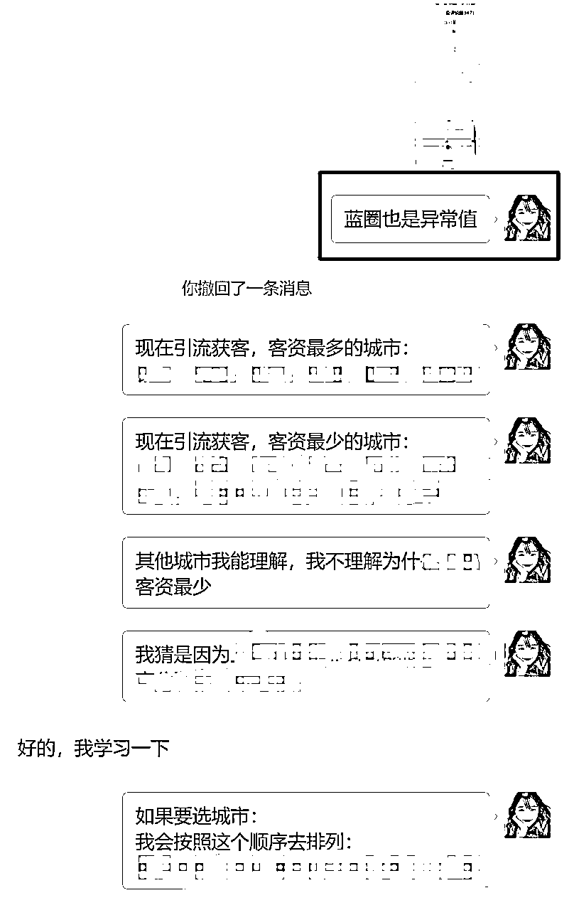
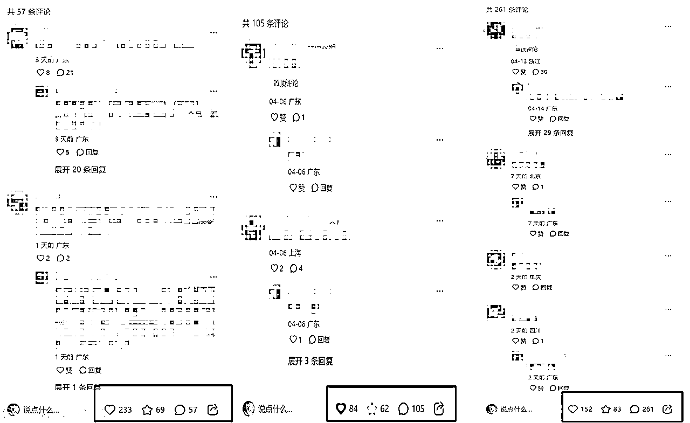

# 25年值得做的4类生意：小红书操盘手的自我拯救指南

> 来源：[https://ncn18orsgwl2.feishu.cn/docx/M8AtdyvtCoTcvGxNCqDc3Wq1nte](https://ncn18orsgwl2.feishu.cn/docx/M8AtdyvtCoTcvGxNCqDc3Wq1nte)

Hi，大家好，我是珍妮子。这几年，我经历了多个热门赛道，从留学赛道出发，涉足房产单边代理赛道，而后又拓展到旅游、教育、律师、美容等赛道。在这个过程中，我凭借代运营业务，成功搭上了不同高客单赛道老板的快车。

我将自己做代运营项目的经验分享出来，在生财社群中又被更多老板看到，他们不断邀请我参与到新的项目中。

我会把这些代运营项目分配给我的付费学员，同时我自己负责在旁指导。

这不仅帮助学员们积累实践经验，也让我有机会接触到更多不同行业的项目，慢慢让我成长成“左手高客单IP，右手操盘手”的高客单IP操盘手项目的创始人，带着几十人的团队全力做好高客单IP的商业操盘手，帮助他们快速增长。

今天和大家分享：

1.  小红书操盘手现在的困境

1.  小红书操盘手的自我拯救指南（如何选生意）

2.1 围绕行业做生意

2.1.1 操盘“符合趋势”的生意

2.1.2 操盘“有门槛”的生意

2.2 围绕客群做生意

2.2.1 操盘“把别人利润品当做引流品来打”的生意

2.2.2 操盘“能给自己积累客户和人脉”的生意

# 小红书操盘手现在的困境

这个困境，注定是所有小红书操盘手，一定会遇到的困境。

有些赛道不够卷，所以操盘手现在还没感受到这种困境；但过个一年，或者两三年，也迟早会感受到的。

有的赛道卷王程度上升，操盘手们已经感受到了来自平台的寒意。

我遇到一个教育赛道的操盘手，他和我说“给机构送客资的感觉，就像找人要饭”。

送过去了客资，等着别人给自己结算；签单了，等着别人给自己发佣金。

因为教育赛道现在引客资没以前简单，所以他又在给AI赛道的人送客资，这是因为AI赛道获客简单，所以每弄到一个客资，可以结算多少多少钱。

“哪个赛道获客简单，能拿到还不错的客资佣金，他就去哪个赛道。”

说到这里，就不得不说：珍妮是做留学教育赛道起家的，

2021-2023年上半年，是小红书最好起号的时间段（印象中聚光投放是从23年下半年开始的，聚光最先开始轰炸的就是留学赛道。）

那几年做小红书的人，谁还不是随随便便大几万粉丝。

但是，差距恰好是从2021-2023年开始的。

如果你是从2021-2023年开始，就一直踏踏实实的在做个人IP，并且真的一直让你的粉丝占到你的便宜，那么你2025年应该过得还不错。

如果你是2021年开始就一直在赚大风刮过来的钱，做没有IP色彩的矩阵号，我猜你有90%的可能，还徘徊在“去哪找引流不够卷，签单率高，佣金高”的项目？

前者有复利效应，后者，抱歉，没有。

后者的结局，就是：

死号了就注销重来，账号没有IP色彩，没有任何粉丝真的记得住我们。我们不过是平台的米虫，不断地寻找一个趋势，寻找一个够我们去啃的米袋子，想要继续过上那种“只要做无IP色彩的矩阵号”，就能继续享受“大风刮来的钱”的生活。

珍妮也是吃到过“大风刮来的钱”的福利的。

我们留学赛道两年做2700w营收那会，靠的自营和代运营，

自营靠两个不咋更新的账号，两年做了260w营收，利润率55-65%，还不是毛利，是实实在在的利润率。

代运营就更加是大风刮来的钱了，那时候留学赛道获客多简单呀，遇到靠谱销转率强的后端，每个月都是几十个W的佣金。

挣过大风刮来的钱的人，很难再踏踏实实地，去赚需要辛勤耕耘的钱。

幸运的是，在钱风刮来的那两年，我也在踏实干活，

靠着那两年：搭建运营与交付团队，给团队员工挨个改稿子的经验，

我把小红书运营这件事摸透了，所以得以在风停下来的时候，成功转行。

不然我现在，我也真不知道我该干嘛去，

因为大风送钱来的时候，并不需要一个人多么懂引流获客，往往20分的引流获客能力，就足以让人赚到120分的钱了，我们很难保证：一个人不会在这种大风中迷失。

因为亲身经历过这些事情，此处珍妮总结：

小红书操盘手，现在的困境（又或者未来几年后，一定会遇到的困境）：

1）其实并没有深入了解过某个项目的销售和交付端，只懂引流获客，懂靠爆款封面和标题啥的去吸引别人。一旦赛道变卷，就写不出深入人心的好文案，拿不到客资，赚不到钱，就算上100个矩阵号，利润增加得也很费力。

2）一旦引流获客变难，就试图找获客简单的赛道，靠给别人送客资赚钱。等过个一两年赛道变卷了，就又换到下一个赛道，永远没有自己的根基。

3）想要自己去独立创业，找到一群交付端，实际上自己并没有销转能力，也不懂私域搭建话术，来了客资也销转不了。

4）永远在追逐平台规则，没有建立自己的个人IP，一旦死号，就得全部推倒重来。

5）和客户没有任何黏性，因为操盘手只是拿到了客户微信号后就卖给了商家，客户也许和商家有粘性，但是操盘手因为没有业务可以卖给客户，所以和客户也不熟。好不容易获取过来的客户，操盘手只能从客户身上赚一次钱。

6）从来没想到：如果有天用户不选择小红书平台了怎么办？如果用户去了另一个平台怎么办？又开始熟悉下一个平台的规则，重头再来，用没有IP色彩的矩阵号起号吗？几乎没有哪个平台能穿越周期，百度有百度的周期，淘宝有淘宝的周期，那么小红书，会不会也有小红书的周期？

以上问题的解决方案，已经不仅仅是：

「如何选赛道选项目」了，

甚至还包括：

「如何定商业模式」的问题。

这也曾经是一直困扰珍妮的地方，直到我通过做代运营遇到了很多优秀的老板，他们又带着我遇到了很多项目和人，在这个过程中，很幸运地找到了几个志同道合的合伙人，在我们共同的努力下，渐渐发现了破局之法。

# 小红书操盘手的自我拯救指南（如何选生意）

生意分为两类，要么围绕行业做生意，要么围绕客群做生意。

这个点，是珍妮很久以前，在看「雕爷」的书的时候，学到的。

很多人还在纠结做生意要定位，定个啥位呀，以下故事摘自「雕爷」《MBA教不了的创富课》一书：

“IBM，作为一家IT行业的百年老店，很牛逼了吧？

人家早年做磅秤，后来转型做大型机，小型机，又发明了个人电脑，完成了从硬件到软件的转型，他难道一直围绕着行业在转吗？围绕IT在转吗？

不是的呀。当年大型机公司都倒闭了，IBM为什么能走到今天？因为他做的是客群生意，他不是服务于个人，也不是服务于中小企业，他是服务的世界500强、政府、银行这种超大规模组织，是围绕的客群在做生意。

IBM挑到了最好的客群，所以IBM屹立不倒。”

现在在小红书做运营获客的操盘手，他们在服务谁？

他们不过是在服务“那些需要操盘手给自己送客资的企业”而已，尤其是服务一些中小型企业。

只会送客资，在这些企业眼里，不值钱的，只是一个随时可被更替的客资获取机器罢了。

当我们在别人眼里都不值钱，我们怎么让自己长长久久赚钱呢？

企业真正想要我们帮他解决的，远远不只是客资上的问题，企业还需要我们帮忙解决：

“客资来了怎么转化？私域话术如何搭建？客户交付不过来该怎么办？如何设计我的增长飞轮？blabla”

只有能做全案的操盘手，才值钱。

只懂送客资，就只能手心向上，找人要饭。

总是做这种「给人送完客资，拿了佣金就结束」、「没有势能积累」的生意，

年轻的时候还能挣些钱，可是10年后，怎么办？20年后，怎么办？操盘手们有想过吗？

如果像珍妮当初做留学生意一样，想要快速赚到500万就退休，那确实赶上一个好生意好时代，就马上赚到了，确实可以退休，可是你的人生，真的就是只想停留在500万的高光时刻吗？

以下分享，是我做代运营以来，学到的知识点，分享给各位小红书操盘手。

## 围绕行业做生意

### 操盘符合趋势的生意

符合趋势的生意，到底什么才是符合趋势？

答案是“专精特精，数字经济，国产替代，硬核科技，自主可控，乡村振兴”。

这几个词一出来，完了，很多人的行业都跟这个不沾边。

因为里面很多生意，都要么是央妈插手，普通人根本进不去这些行业。

于是，网上又出现了一系列关于“符合趋势”的生意的讨论，常见的有以下几种：

#### 1）年龄结构：

比如老龄化驱动的经济。据珍妮所知：川藏线318，很多客户群都是有钱又闲的老年人，他们是银发经济这个场景下，典型的消费者。

还有一些力气很大的男生，他们就出来做上门护理业务，帮助一些老人洗澡等等。

#### 2）科技创新：

比如AI、人形机器人等。这个行业真的属于很有发展潜力的。

很多友友跟珍妮说，这个太高端了，我参与不了，其实不是的，你不是高技术人开发人员，但是你可以应用AI帮你去赚钱啊。

比如你可以针对不同行业，利用 AI 生成图文和视频素材库，帮企业提供创作解决方案。

你还可以帮企业打造智能客服系统，用AI的自然语言处理技术，24小时快速准确回答客户咨询。

甚至更简单，珍妮都有看到有小伙伴先用「get笔记」app，去扒某个行业的视频直播逐字稿，并且自动生成AI总结。接着把以上内容用AI加以分类，找出某赛道的选题规律、直播知识点规律，用来卖给行业内的N个老板赚钱。

关于人形机器人，酒店、餐厅等服务场所，人形机器人可承担迎宾、引导、送餐等工作，提升服务的科技感与趣味性，吸引更多消费者，这里面又催生了一门生意，有人买几个人形机器人，专门出租给这些服务场所，按租赁时长或服务次数收费。

#### 3）收入水平：

比如：消费降级的时候，我们会发现：以前卖大品牌化妆品的人，现在竟然在带货小样?

比如：以前大家请保姆上门给自家小孩做饭，现在有的小区，家长会把孩子送给小区里某位邻居创立的小饭桌，这个小饭桌，专门帮助那些“没时间给放学后的孩子做饭”的双职工家庭。

#### 4）场景革命：

在A场景火过的东西，到了B场景又火了。

举个例子：

90后的童年，应该都在学校门口吃过麻辣烫吧？几块钱，围着一个小锅，放学后在那里吃份麻辣烫。

后来这个场景又变成了在便利店收银结账的位置买份关东煮。

后来又变成了：旋转小火锅。

比如盛香亭这个牌子，印象中珍妮以前还在他们家吃过虾滑，结果有一年他们突然变成了卖旋转小火锅，结合了回转寿司的特色，把卤味+小火锅+茶，完美糅合到一起。每次去吃都得排队。

#### 5）政策引导：

举个例子：

珍妮在做留学创业之前，是雅思语培出身，恰好是我转行留学创业那一年，K12被重点打击。雅思虽然更多服务的还是高中大学生等群体，但同样遭受打击。

政策不希望我们做的事情，咱们最好别做。

再比如：

前阵子，自媒体IP行业，「汤汤卖29.8万的IP打造服务」，引起了同行注意。其中最火的一个IP，就是「谢康校长」。

为什么谢校长的IP会格外火呢？

因为谢校长的所有视频，都踩在了两个爆点上：

1）让孩子接触到人工智能

2）让中华文化更好地得到传承

这就是政策引导，国家现在就是在对外弘扬中华文化，就是在推动人工智能的发展。

不信你看：李子柒在外网爆火，甲亢哥来中国旅游直播被大力报道。

未来：

做国内旅游业的人，和做国外旅游业的人，将会拉开一道分水岭。

谁在国内做面向外国人的旅游业，谁去用英文结合旅游弘扬了中华文化，谁就能赚钱。

以上是从宏观方向上，讨论“哪些生意，是符合趋势”的生意，但其实依旧没能解决：操盘手们，具体可以去做什么生意。

珍妮为此思考过很久，直到遇到贵人带我揭开了这些谜题。

作为小红书操盘手，一个专门帮人引流获客的人，我们其实是很难快速了解一个行业的门道的，毕竟负责交付端的人，他们已经在这个行业深耕很多很多年了啊，操盘手怎么可能通过做引流获客，就快速切入到一个赚钱的行业呢？

这时候，我们可以做以下动作：

#### A. 面向正在崛起的新个体：帮助勤恳工作、产出价值的人，放大自己的势能。

对于正在崛起的新个体，这些人，往往在自己的岗位上，勤恳工作很多年，积累了很多口碑，他们现在很缺有个人帮自己把势能放大。

对于一个操盘手来说，这时候，我们可以通过：帮对方在小红书做种草，塑造IP，去帮他把生意进一步放大，并且和对方绑定签单后的收入分成。

举个例子，我最近服务的川藏线旅游IP，真的是在旅游行业深耕了很久很久的IP。

那天我把关于这个赛道的宣传思路给到了对方，我想找对方填素材库。

这个素材库，真没那么好填的。

但凡在这个行业没有深耕过，几乎填不出来，因为素材库里会细致到：

1）客人在真实旅行时的感受

2）自家服务是如何在行程方面给到用户充分保障

3）自家产品，和同行产品相比，优势在哪

4）客户真实好评反馈图

5）平时和客户的对话图

6）往期行程定制细节

7）XXXXX

但是对方用一天时间，就把素材库填完给到我了。

也就是在那一刻，我知道了：这是一个我可以深入服务的人，我可以帮他放大势能，绑定利益。

#### B. 面向正在赚钱的超级个体：帮助想努力突破自己上限的超级个体，放大他们的势能；

对于一个已经跑通0-1超级个体，他们还想继续放大自己的势能，毕竟未来10年，他们要么滑向M型社会的底层那头，要么走向M型社会的巨富那头。所以，这些超级个体，需要有人帮他优化自己的商业模式，进一步放大生意势能。

珍妮因为经常分享，被很多人看到，所以遇到了很多不同行业的人脉和资源。

咱们举个例子：

律师这个岗位，要么往上冲，冲到像虎诉律师事务所，大暄哥那样的位置，做到一年500-800万的收入，要么就只是个中产，收入卡在了50-200万以内，上也上不去。如果一直上不去，就可能被市场赶下来，阶层滑落。

这样的律师，在中国有很多很多个，他们真的很需要有人帮自己打造IP，他们也很舍得花钱，请人帮自己：放大势能。

#### C. 面向大公司：优化他们的产品、获客途径，修正他们的私域转化话术，进一步提高销售转化率。

珍妮也接手了类似这样的项目，起初，我只是觉得某个赛道很好打，我就接了这个单子的代运营，毕竟可以把代运营服务费给到我的付费学员，让他们拿这种易上手的项目实操，还能赚到钱，是个好事。

结果没想到，我的学员一上来，用一个月时间，打出了业内快20年老店4个月的客资量。

我和这家全国有名的公司签了为期一年的合同，并且约定：每过一个季度，根据客资情况，调整服务费。

因为这个项目做得好，又被背后的贵人带去和另外两家上市公司签合同，合同1已过，在等大公司走完流程，合同2，也已经在谈。

#### 因为这段经历，我发现了“很多公司的痛点”。

1）公司的创始人或者高层，往往上了年龄，基本都50岁了，他们也想进入小红书这类平台去获客，但是他们真的不懂小红书。

如果我去和他们聊具体的小红书运营策略，他们根本不懂。真的不是他们不想入驻小红书，而是缺少一个能和他们对齐信息的人，让他们意识到：原来在小红书还可以这样获客。

2）有的公司，因为一直以来都靠渠道获客，所以他们没有做过直接面向客户的C端。是因为他们不想做C端吗？不是的，是因为：如果他们直接做C端，他们可能会得罪渠道方。而且因为他们之前从来没有做过C端，所以他们没有足够的经验。

3）有的公司，他的产品很牛，供应链YYDS，可是他们一直以来面向的客户都是B端的企业。但是口罩之后，很多企业倒下了，导致这些专门针对B端的大公司，也跟着GMV下滑。他们也很想面向C端，可是却不知道：怎么改革自己的产品，使它成为一款：C端客户喜欢的产品？他们缺乏这样的：「直接和C端打交道、去调研客户喜好和痛点的经验。」

4）公司最重要的私域运营，往往交给了月薪不到5000块的运营人员，这些人一年到头不和客户说几句有价值的话，一给客户发消息，就是群发广告、群发优惠券，于是大公司品牌势能下降、客户流失、该品牌还吸引了很多羊毛党。

#### 珍妮接手类似的项目后，又发现了什么信息，是对小红书操盘手有益处的呢？

##### 1）只有能帮忙优化产品的操盘手，才值钱。

珍妮有一个贵人朋友，他收费给一家公司做了详细的市场调研报告，然后他通过这份市场报告，获得了公司大老板的赏识，给了权限，帮大公司重新改革对方适合用于推广到C端的产品，这条产品线给了他独立运营，收益他占大头。珍妮也有幸参与了其中的市场调研，收益良多。

我参与他们这家公司一款产品在小红书上调研的时候，我发现：这款产品在小红书引流获客非常简单，但也极其容易违规。

我安排大学生，扮演真实的客户，一家一家联系小红书现有的商户，把不同城市正在小红书推广这类产品的商家，做了市场调查，其中包括：

1）多少商家在推广这种类型产品？

2）他们的价格分别是多少？

3）他们的门店分别在什么位置？

4）加上他们微信后，对方是如何服务和转化我们的？

借此，我们摸清楚了这个赛道的私域转化话术有多菜，这个赛道同行的产品是否具有竞争力，到底每个城市大概有多少商家在小红书铺矩阵号。

他们公司还有另一款产品，依照珍妮过往的判断，这款产品在小红书获客极其简单，整个赛道的人还在用最低阶的打法在小红书获客。

贵人希望珍妮去调查：如果这款产品要优先在3-5个城市开打，给珍妮配备好上市公司专门负责珍妮渠道的销冠和交付部门，那么，珍妮应该选择哪些城市？

于是，我又安排了大学生，帮我对全国不同省会城市的该产品在小红书上的现状做了调查，我从中发现了一些异常数据，并马上汇报给贵人。

恰巧贵人的亲戚对这个赛道很有了解，于是我们马上明白了这个赛道的痛点，明白了：适合用于C端产品的设计方案。

##### 2）只有能帮忙优化私域转化话术的操盘手，才值钱。

只懂引流获客，能有什么用？

转化不了，操盘手就只能靠卖客资赚钱。

只有能顺利转化，才能靠“拿到客资后的签单佣金分成”来赚钱。

可是转化这个事情，远远不是只依赖销售的，而是还依赖整个私域转化话术。

珍妮在参与类似项目的时候，我就发现：

真正高阶的私域转化人员，根本不会去突然给客户发一段“我有什么活动，欢迎来参加”“我有什么优惠券，欢迎来领”“现在XX大促，再不买就迟了”blabla的话术。

而是会在加上客户微信的那一刹那，就给客户打好标签，想好了私域转化方案。

比如：

这个群体喜欢什么？喜欢在几点钟活动？应该在几点发朋友圈去吸引他们？

他们的痛点是什么？他想听到什么内容？

他没有马上买单的原因是什么？他马上买单的原因又是什么？

在加上微信的7天内，我要做什么营销动作？

28天内，我要做什么营销动作？

牛掰的私域转化人员，和客户私聊的时候，往往都更像一个人，而不是一个发放广告的机器人客服。

##### 3）只有能帮忙优化商业模式的操盘手，才赚钱。

依旧以珍妮参与的某个项目为例，这个赛道的线下门店，其实很多都快倒闭了。

这个行业的门店，全年的平均客资人数，是XXX（此处不便透露具体数值）

然后，我们用一个月的时间，让一家新开门店的客资数，达到了这个行业快20年门店四个月的客资数。

这是非常可怕的一个事情，因为这套打法，可以搬运到全国：这个赛道中处在危急生存关头的门店。

只要用了我们这套打法，对方就能快速在自己的城市获客。

而这背后，是因为：

我们优化了整个赛道的商业模式。

当业内人士全部在靠卖产品A赚钱的时候，我们在靠卖产品B赚钱。

当业内认识还在给客户提供C服务的时候，我们提供的是DEF服务。

我们这个产品，彻底解决了行业内用户的痛点，所以马上在市场上引起了一股热潮。

##### 4）只有真正懂运营底层逻辑、有影响力的操盘手，才赚钱。

珍妮在接手某项目后，贵人就马上把这个项目上一个代运营团队替换掉了。

在贵人让上一个代运营团队退出之前，他不仅通过我带人打出来的实际成绩考核我，他还通过问我问题，多方面考察我：看我是不是值得和他长期合作的人。

他问过我很多小红书运营的底层逻辑，这些东西，有些人答不出来。

或者稍微被人变化着花样提个问题去问，有些人就答不出来了。

那天，我把我24年3月1日开始，一周六更分析的各赛道运营打法分析，展示给了贵人看。

然后又把我整理的某系列资料，发给了对方。

他看了一遍之后，马上给到了我这个赛道最高的佣金比例。

再后来，因为业绩证明了我的实力，在把上一个代运营团队解除合约的那天，我看到贵人发了一条朋友圈：

“有件事情运营人员不太知道：人们信奉的是拥有底层逻辑的牧师，而不是吃了红利的传教士。

建立在平台红利和老板认知盲区之间的信息差，并不代表运营的能力。

能选择好的行业赛道，又能找到平台弱监管的流量区域，才是底层运营能力。”

他问过我：为什么我能帮老板控制运营成本？

我和他说：

“因为我有影响力。

我已经通过我的付费社群，让更多人用低成本的方式学会了小红书运营，这些学员想要找到一个转化率高的赛道去实操，去拿佣金，拿基础服务费。只要你能给到我一个转化率高、佣金安全的赛道，我这边可以源源不断带人来帮你打客资。我又可以通过写运营SOP，让我的付费学员把这套SOP培训给18县小县城的宝妈，这样我的学员能赚到钱，宝妈也赚到钱。

我把“高客单IP-我-学员-宝妈/大学生”这几类群体，串起来了，让大家各自都能赚到钱。”

以我实操的某个项目为例，我吸引了116人入群看实操细节，最后筛选出了一个6人的小型获客队伍，深度参与这个项目，给这个项目送客。

因为这个项目现在客户交付不过来，所以珍妮还没有开始放量，一旦开始放量，我又可以从「已经筛选出来的操盘手」里，付费请他们进一步培训我的付费学员，带更多学员送客资。同时，「已经筛选出来的操盘手」，他们又可以通过其他学员送的客资，拿到客资背后的签单提成。所有人利益绑定，大家都能赚到钱。

### 操盘“有门槛”的生意

未来所有靠信息差、认知差作为核心竞争力的东西，全部都会倒下。

世界会奖励踏踏实实工作，产出价值、产出更多价值给到「更多客户」的人。

而那些：没有门槛、仅仅靠信息差和认知差赚钱的生意，只能叫做风口，不能长期让人赚到钱。

很多人都在做没有门槛的生意，因为他们确实就没想要长久把这个生意做下去，要么断断续续赚点小钱，要么打一枪换个地方。

可是，对于一个小红书操盘手来说，

但凡他想要长久赚钱，他必须做有门槛的生意。

有门槛的生意是啥呢？

竞争对手做不到、不想做、懒得做、不敢做、而我们能做的生意。

这里珍妮举个例子：

我为什么会去做房产单边代理？

因为房产行业有门槛，房产单边代理更加有门槛。

一个新人怎么可能快速进入房地产行业啊？但是当我们遇到一个在房产行业已经深耕的人，他把他的观点输出给我，素材给到我，我就可以去运营获客了。

我可以找到已经跑通了1-10的房产IP，和对方通过利益绑定，把对方势能放大。

有人可能会说：人家都跑通1-10了，为什么还要和珍妮你绑定啊，跑通10的人，跑通10-100很容易啊。

我想说：

别逗了。跑通10，就一定能跑通100吗？

多少人跑通10以后，自己的时间就被很多人禁锢住了？

越是有钱的人，越是舍得花钱，找人帮自己干活。

越是没钱的人，越是喜欢所有的事情亲力亲为。

去做一个有门槛的生意，和对方长期绑定利益，是操盘手的破局之法。

## 围绕客群做生意

如果你做生意，还一直在定位定位，你的路就可能越走越窄。

不信你看，现在能长长久久做生意做得久的人，谁是一直围绕那个定位不变的呀？

他们是不是都是在围绕某个客户群做生意？

### 把别人的利润品当做我们的引流品来打

别人的产品卖上千，我们的产品，通过优化，性能比别人更好，价格比别人更低，我们是不是就在把别人的利润品当做引流品来打？

答案当然：是的。

这种情况下，这类产品一旦推出市场，就会马上火爆全国。

别人要靠这个赚钱，而你把利润全部让出来全部给到你的客户，你靠其它的服务赚钱。

以珍妮接手的某个项目为例，

这个项目，我刚和甲方爸爸谈的时候，我觉得：诶？这个也能赚到钱？

我一开始觉得这个赛道很难赚钱。

然后甲方爸爸掏出了数据，给我看了他们在小红书发的笔记，

那一刹那，我懵了：什么？这赛道这么好打？

我就又听他讲了这个赛道的现状，才知道：其实这个赛道本来不好打。

只是他们把别人的利润品通过优化，价格更低，但服务却更好，这样获客就很容易。

整个赛道的用户，都有某个痛点，简称A痛点。

用户要解决A痛点，成本往往要1000-2000不等。

现在，甲方爸爸提供的这个服务，价格是竞品公司服务的二分之一到四分之一，因为甲方爸爸压根就不靠这款产品赚钱，只要到他店里，他的供应链比其它店更完善。

我去，这个产品一推出，就完胜。甚至有其他城市的人，跑到我们所在城市的门店来购买服务。还有新加坡的人，来香港出差，也来这家门店购买服务。购买了这个服务后，顺带买了甲方爸爸的其他服务。

以下是我们当时的客资数据。（纯自然流，0广告投放）

### 操盘“能给自己积累客户和人脉”的生意

送过去一个客资，如果不能给自己积累起客户和人脉，这类生意就不建议做了，是个ROI特别低的生意。

我因为做房产以来，接触了很多项目和贵人，他们不停在告诉我一个观念：

作为一个老板，永远要把精力，投入到ROI最高的动作上。

举个例子：

我接手了一个代运营项目。

正常来说，我对代运营项目特别挑，因为我的精力是有限的，就算是我负责研究迭代获客打法，发给我的学员，我也需要对整体的代运营质量负责，所以很多项目，我都是拒绝的。

但有这么一个项目，贵人告诉我说：

“珍妮，这个项目背后的客资，并不只是只能卖给A类客户群。这些客资现在在我手上，一个客资可能有BCDE等爱好。我针对他的爱好B，我又可以拉到一家公司给咱们费用，让我们帮他送客资、优化转化率。针对客户的爱好C，我们又可以拉到一家公司。同一个客资，我们是反复在用的，我们可以反复赚到这个客资背后的钱。”

这就代表，我和我的学员，都是能长期通过这个项目受益的，那么，这就是一个好项目。

再比如：

珍妮在上文中提到的“帮助已经有势能的IP，进一步放大自己的势能”这个项目，就是一个好项目。因为：世界上最珍贵的东西，是人，是人才。

一个已经跑通0-1，或者1-10的IP，他们卡在自己的业务中出不来，他们太忙了，他们愿意花钱。

一旦我们能帮他们在商业模式上解决卡点，在放大势能上解决卡点，我们就能和IP长久绑定，赚到IP签单后的分钱。这些IP，往往已经在自己的赛道做出了业绩。

而帮一个人锦上添花的生意，就是一个好生意，远远胜过“给一个人雪中送炭”。

这种锦上添花、利益长期绑定的生意，就是在给作为操盘手的我们，长期积累客户与人脉。

说到这，就不得不提到，市面上有个理论，叫做“不要去做需要教育市场”的生意。

其实这句话，是分场景的。

以珍妮看到的某位贵人姐姐的商业模式为例，我发现：无论她带货什么品类和服务，她都能卖出去。

她并不需要去教育市场，她只需要把相关产品或者服务往自己的粉丝群体一发，粉丝就买单了，马上商品就会售罄。

只要一个人有IP，而且能长久愿意让客户占自己便宜，那么这样的IP，ta带货任何东西，都能卖出去。哪怕是需要教育市场的生意，ta也能丝滑地把产品服务卖出。

由此可以看到：和一个IP长期利益绑定，是一个多么好的生意。

# 致谢：

我经常说：我转行是因为在生财遇到了好机会，遇到了贵人。

这句话的掺水量，为0%。

没有生财，就没有现在的我。

作为一个在留学行业挣过大风刮过来钱的人，在留学和英语赛道即将因为信息差消失，而走向下滑的时代，我是很手足无措的。

我甚至做好了：如果我转行失败，我就去线下打工的打算，重头再来。

因为我无法忍受：我的人生，就是赚个几百万就到了终点。

我无法接受：留学赛道的业绩是我一生仅有的高光时刻。

我享受克服困难、为人提供价值的过程，我享受自己逐渐变强的过程。

恰巧，在生财，我实现了无痛转行，并且和强者结伴，一起走向变得更强的路上。

我的贵人会和我说：

“珍妮，你是幸运的，你在合适的年纪，做出了业绩，有了自己的基本盘，吸引到了我们这群人帮你。我在你这个年纪的时候，走过很多弯路。”

我明白的，我知道这是有人愿意带我。

想要继续和强者结伴同行，我就要更加给强者提供他们所需要的价值，做到日拱一卒，让人看到我给他们带来的价值，让大家能更多地在我身上获益。

这样我才能继续不断地吸引到更多强者，和我一起结伴同行，我才能在这段关系中，长久和人相处下去。

感谢生财有术、感谢和我一起结伴前行的伙伴、感谢给我机会的贵人、感谢大家。