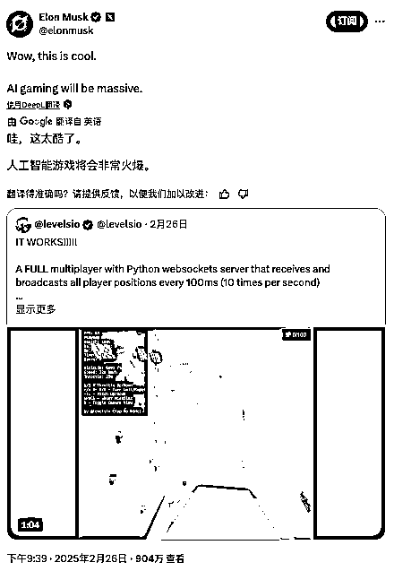

# AI搞副业，月入百万刀还引来马斯克点赞？揭秘独立开发者Pieter Levels的“钞”能力！

> 来源：[https://ry6uq5vtyu.feishu.cn/docx/MPF7d0TGHoST0nxXek1cSWXFn7g](https://ry6uq5vtyu.feishu.cn/docx/MPF7d0TGHoST0nxXek1cSWXFn7g)

你敢信吗？有人用AI当“副驾”，几个小时就能搞出个3D飞行游戏，不仅10天狂揽近4万美刀（约28万人民币），后续月入更是稳定在8.7万美刀，还引得马斯克本尊亲自下场点赞，直呼“太酷了，AI游戏将会非常火爆！” 这还没完，他手头另一个AI项目PhotoAI，每月更是能吸金12.3万美刀。这位靠AI和代码闷声发大财的，就是独立开发者圈里的顶流——Pieter Levels。

图片

这位老哥可不是什么硅谷精英，也不是科班出身的技术大牛。他自学编程，奉行“一人公司”理念，一个人包办设计、开发、营销，在数字游民的圈子里活得风生水起，足迹遍布全球40多个国家、150多座城市，在酒店房间里，穿着短裤，用着不太健康的姿势敲代码，硬是把自己搞成了年入数百万美元的“个体户传奇”。

那么，Pieter Levels究竟牛在哪里？他又有哪些值得我们普通人，尤其是想在AI时代搞点事情的朋友们借鉴的“钞”能力呢？

## 一、Pieter Levels：一个“非典型”独立开发者的崛起之路

Pieter Levels的牛，不在于他技术多顶尖，而在于他那股“想到就做，快速迭代，不怕失败”的劲头，以及他总能抓住时代脉搏的敏锐嗅觉。

1.  从迷茫音乐人到“12个月12个项目”的挑战者

Levels最早其实是搞音乐的，在YouTube上有个叫Panda Mix Show的频道，做电音混音。大学毕业后，看着朋友们都按部就班找工作，他却觉得那不是自己想要的生活。27岁那年，他经历了所谓的“土星回归”，感到迷茫和沮丧，于是决定背上笔记本，远走亚洲，开始了他的数字游民生涯。

但最初的游民生活并不如想象中美好，钱越赚越少，孤独感也随之而来。他爸一句话点醒了他：“如果你感到沮丧，不能坐着不动，得去找点事做。” 于是，受Jennifer Dewalt“180天做180个网站”的启发，他给自己定下了一个更具挑战性的目标——“12个月内推出12个初创公司”。

图片

这个听起来有点疯狂的挑战，源于Levels对许多创意人士（包括他自己）一个通病的深刻反思：不满足于完成，害怕失败。 他发现很多人有好点子，也投入了大量精力，但项目快做完了就扔在一边，或者根本不敢发布，怕被人喷。他认为这种“完美主义”和“恐惧”扼杀了太多好想法。

“12个月12个项目”的核心就是强迫自己 “完成并发布”。他不在乎项目大小，也不追求一开始就改变世界。他信奉“ship more”的哲学——勇于尝试，快速迭代。他曾坦言，自己做过70多个项目，成功的只有4个，但这5%的命中率告诉他，只要多尝试，总有一天能中！

1.  “Build in Public”：透明成就信任与流量

Levels的另一个显著特点是“Build in Public”——公开构建。他把自己创业的点点滴滴，无论是成功还是失败，都毫无保留地分享在X（前Twitter）等社交媒体上。这种坦诚和透明，不仅为他积累了大量的粉丝和关注度，也让他获得了许多宝贵的反馈和帮助。当他遇到技术难题或者需要推广新产品时，他的粉丝社群总能提供支持。这种开放的态度，也让他在与供应商（比如AI服务商Replicate）谈判时，更容易获得信任和优惠。

1.  极简技术栈与实用主义

与很多追求时髦技术的开发者不同，Levels的技术栈非常“复古”且实用：HTML、jQuery、PHP、SQLite。他认为，创业初期，技术栈不重要，重要的是快速验证想法，让产品跑起来，看市场是否买单。他没有时间去学什么Node.js、React这些新框架，因为他的核心理念是“用你会的工具，快速搞定”。这种实用主义让他能够以极高的效率将想法转化为产品。

## 二、Levels的“钞”能力：从解决小问题到拥抱AI浪潮

Levels的赚钱之路，充满了从解决自身痛点出发，到敏锐抓住技术趋势，再到巧妙运用商业策略的智慧。

1.  从解决“痒点”开始：Play My Inbox 与 Hoodmaps

他的第一个挑战项目是Play My Inbox。当时他和朋友们喜欢用邮件分享YouTube音乐链接，但邮件多了就乱七八糟。于是他做了个小工具，能登录Gmail，提取YouTube链接，生成播放列表。这个解决了实际痛点的产品，虽然没赚钱，但获得了媒体关注和几万用户，给了他极大的信心。

另一个有趣的早期项目是Hoodmaps。他在旅行中发现，游客往往只去那些千篇一律的景点，错过了城市真正的本地文化。于是他做了个众包地图，让用户用不同颜色标记城市的区域，比如“游客区”、“富人区”、“文艺区”。这个项目仅用4天就开发出来，上线后在Reddit爆火，服务器差点被挤爆。尽管Hoodmaps因为地图API费用高昂而未能盈利，但它展示了Levels快速开发和引爆社区的能力。

图片

1.  Nomad List：数字游民的“大众点评”，持续盈利的现金牛

Nomad List的诞生，同样源于Levels作为数字游民的亲身经历。他需要了解不同城市的生活成本、网速、安全性等信息，于是最初搞了个公开的Google表格，让大家一起编辑。这个简单的表格迅速吸引了大量数字游民的参与。随后，他将其发展成一个功能完善的网站Nomadlist.com，提供详尽的城市数据、社区互动、远程工作机会等。Nomad List精准地切中了数字游民群体的需求，每年为Levels带来数百万美元的稳定收入，成为他财务自由的基石。

1.  拥抱AI：从图像生成到游戏开发，引爆新增长点

时间快进到AI浪潮席卷全球的2022年，嗅觉敏锐的Levels自然不会错过这个风口。

*   Photo AI & Interior AI：AI图像生成的商业化探索 他首先注意到Stable Diffusion在生成房子和室内设计方面表现出色，于是做了this housedoesnotexist.org和InteriorAI.com。InteriorAI允许用户上传房间照片，AI生成多种设计方案，这个项目第一周就为他带来了一两万美元的收入，至今每月仍有四五万美元进账。

*   尝到甜头后，他进一步将AI图像生成技术应用于人像，推出了AvatarAI.me（后整合为PhotoAI.com）。用户上传自拍照，AI就能生成各种风格的艺术头像或逼真照片。这个项目一度非常火爆，一周内就为他带来了15万美元的收入。尽管后来面临Lensa等大公司的竞争，Photo AI凭借其“虚拟照相馆”的定位，依然保持着每月12.3万美元的营收。 在开发Photo AI初期，由于没有自动化代码，Levels甚至需要手动处理前几百个订单的照片，训练模型，再发给用户。这个过程虽然痛苦，但也逼着他快速迭代，完善了自动化流程。他还创造性地利用用户生成的大量图片进行A/B测试，让用户“帮自己改进产品”，不断优化AI模型的参数。

*   AI飞行模拟器 (fly.pieter.com)：AI辅助开发的惊艳之作 最引人注目的，莫过于他用AI辅助开发的3D飞行模拟器。他仅仅向AI代码编辑器Cursor描述需求——“在浏览器中制作一个带摩天大楼的3D飞行游戏”，AI就帮他生成了大部分客户端代码（HTML+JavaScript）。服务器端的多人在线功能，则是通过向埃隆·马斯克旗下的AI模型Grok-3提问，生成了Python WebSockets服务器代码。

*   这款看起来简单的游戏，从构思到初步原型只用了30分钟，3小时左右就有了可玩版本。上线10天吸引1.6万玩家，赚了3.8万美元，并获得了马斯克的点赞。Levels感叹：“AI让开发变成了‘聊天’，你只要告诉它要做什么，它就能写出代码！”

1.  独特的商业运营与变现哲学

*   直接收费，筛选优质用户：与许多初创公司先免费吸引用户再转化的做法不同，Levels倾向于从一开始就向用户收费。他认为这样能筛选出真正关心产品的付费用户，他们的反馈也更有价值。

*   高利润率与成本控制：他坚持独立开发，不轻易雇人，以保持极低的运营成本。同时，他会主动与AI服务提供商（如Replicate）等协商，争取更优惠的价格。

*   内容为王，自然增长：他极少购买广告，而是通过在X、Reddit、TikTok等平台分享有价值的内容和产品进展，实现自然增长。他坚信，在当今的算法时代，优质内容本身就能带来流量。

*   拒绝被收购，享受创造的乐趣：尽管他的多个项目都取得了商业成功，但他从未出售过任何一个。他认为，除非价格极高，否则从财务角度看，持续运营带来的收益和掌控感更有价值。Nomad List对他而言更像是自己的孩子，承载着他的理念和情感。

## 三、Pieter Levels给我们的启示：在AI时代，普通人如何“单挑”世界？

Pieter Levels的经历，对每一个想在AI时代有所作为的个体来说，都充满了启发。

1.  行动至上，克服“完成焦虑”与“失败恐惧”

“Just ship it!” 这是Levels反复强调的。不要等完美，不要怕被喷。快速把想法变成最小可行产品（MVP）推向市场，用真实的用户反馈来指导迭代。正如他所说：“你不需要成为所谓的‘普通人’，你可以成为你真正想成为的那个人。但必须全力以赴。如果只是投入一半的精力，那你不会成功。”

1.  解决真实存在的问题，最好是你自己的问题

Levels的许多成功项目，都源于解决他自己在数字游民生活中遇到的痛点。当你为自己创造解决方案时，你往往能更深刻地理解用户需求，产品也更容易接地气。

1.  拥抱并快速学习新技术，尤其是AI

Levels并非AI专家，但他能迅速抓住AI的潜力，并将其应用于自己的项目中。他会关注X上那些分享AI新进展的“动漫头像”大神，会尝试各种AI工具（Cursor, Grok, ChatGPT, Stable Diffusion, Replicate）。在AI时代，学习能力和适应能力比以往任何셔重要。你可以通过FreeCodeCamp等平台系统学习，也可以像Levels一样，在实践中边做边学，甚至直接问AI“我该怎么做？”

1.  “Build in Public”，用透明建立信任和社群

公开你的思考、你的进展、你的失败。这不仅能帮你获得宝贵的反馈，还能吸引同好，建立起支持你的社群。在互联网时代，个人品牌和社群的力量不容小觑。

1.  保持独立思考，不盲从“主流”

无论是技术选型（坚持PHP、jQuery），还是工作方式（倾向独立开发），Levels都展现出强烈的个人主见。他不轻易被所谓的“行业最佳实践”或“新技术趋势”所裹挟，而是选择最适合自己、最高效的方式。他甚至质疑那些融资数亿美元的框架背后是否有过度营销的成分。

1.  小处着手，持续迭代，允许不完美

Nomad List最初只是一个Google表格，Photo AI早期需要手动处理订单。不要期望一步到位，从最小的功能开始，根据用户反馈不断完善。你的产品可能一开始看起来很“笨拙”，设计可能“老旧”，但只要核心价值在，用户就会买单。

1.  重视用户反馈，但也要学会筛选

Levels会认真对待用户的批评，从中提取有价值的信息改进产品（比如Hoodmaps的数据问题）。但他也会屏蔽那些无意义的谩骂和骚扰，保持自己的节奏和心态。

1.  探索适合自己的盈利模式，并勇于“要价”

不要害怕向用户收费，有价值的产品值得付费。同时，学会控制成本，与供应商谈判，确保自己的劳动获得应有的回报。

1.  找到你的“第三空间”，保持创造力

Levels提到，咖啡馆曾是欧洲启蒙运动的发源地，也是如今许多创意的诞生地。他怀念硅谷咖啡馆里充满梦想家的氛围。找到一个能让你专注、激发灵感的环境，无论是真实的咖啡馆，还是虚拟的社群，都对保持创造力至关重要。

Pieter Levels的成功或许难以复制，但他的理念和方法，无疑为我们指明了一个充满可能性的方向：在AI的加持下，个体崛起，未来可期。