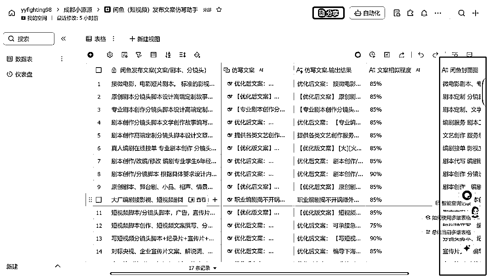
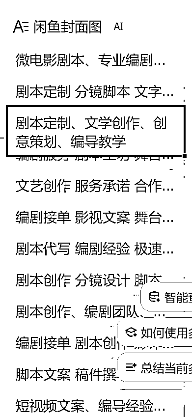

# 因为想偷懒，我意外发现了1秒钟生成N张封面图的方法

> 来源：[https://uh4tzunhi6.feishu.cn/docx/N9o3d9mBZo4vNlx36iwcGSP8nhc](https://uh4tzunhi6.feishu.cn/docx/N9o3d9mBZo4vNlx36iwcGSP8nhc)

## 引言

*   我为什么开始寻找快速生成封面图的方法

做闲鱼的宝子们应该都知道，每次发闲鱼帖子的时候需要去做图，到底有多么麻烦了！我每次都是发笔记的时候，然后又去重新做图，工作很繁琐，又耗心力，又耗时间，有的时候也会偷懒，直接去搬同行的图片，但翻看现在平台上的图片都大同小异，基本没什么创意，想必这些客户也都是看厌倦了吧，如果这个时候，能有一些不一样的图片，看起来就很专业的图片，那相信也会在潜意识里加强客户的信任程度。

而且关键是，我想要偷懒，然后这样就有时间去学其他的东西了。而且繁琐的工作，它一定有能够替换的方法的，于是我开始寻找~

*   创作过程中封面图的重要性

封面图为什么重要？相信不用我多说了，各位都比我更清楚封面图的重要性。一张好的封面图，就是我们店铺的门面，不管你是做闲鱼，还是做小红书都是如此，哪怕你小红书不开店，发笔记也是这样的，封面图好不好，决定着人家到底会不会点进来。所以，我们一定要有能区别于其他人的封面图。

*   传统制作封面图的痛点和时间成本

传统制图的方法，无非这几点。

1.直接照搬同行的

不要再傻乎乎的截图了，现在去水印的工具那么多，什么功夫去水印、小辣椒去水印等层出不穷，我只用蜗牛去水印，因为它连闲鱼图片都可以下载，实测很稳定，而且我已经用了一年多了。这不是什么广子植入，只是真心安利。（ps.大家直接去小程序里面搜索就可以了）

2.可画、创客贴制图

3.小红书制图

4.聊天记录加文字，展示专业程度

（eg.个人写手 无团队 服务一对一）

5.可爱人物/猫狗加文字

（小红书上找图，自己加字即可）

6.作品加文字

（这部分的话，直接去小红书找图，加字即可）

这些方法我都用过，但是现在是AI的时代了，咱们能批量就批量呗！！然后在服务客户的过程中，有了好的反馈素材，我们统统把聊天记录截图保存下来，日常发圈，以及发闲鱼、小红书都用的上。

结合聊天记录+我下面说的这种方法，批量、高效、专业、精准，精准引流不成问题！

## 第一部分：方法详解

不跟大家兜弯子了，这个工具，就是即梦。

最开始的时候，我还没想到用这个工具，我尝试了豆包、尝试了夸克、尝试了gpt4O,sd,fulx这些效果都不是很好，于是我联想到之前我用即梦生成公众号的图片，那我就联想，它肯定也可以做小红书和闲鱼的图片，说干就干！上手试了就知道行不行了！正好最近即梦3.0更新了，生图生视频的效果更加强大了，所以效果未必会差！

*   最初的尝试和思考过程

最开始我也就简单描述了一下，然后选择了3.0的图片模型，比例选择3:4。

是不是生图效果还可以？而且生成4张图才1积分，四舍五入不要钱。

尤其是第一张，我觉得也正好符合了简约高级的风格。

但是如果纯粹靠我手动描述的话，其实风格也比较有限，而且也容易陷入描述瓶颈，那我就想到了结合deepseek，咱们要充分用上它的每一个功能。

*   转折点：deepseek让我意识到即梦的潜力

那不会提问的宝子有福了，简单描述之后，然后我们【点亮】deepseek的功能，让deepseek去协助我们优化提示词，那这个时候他就会给到很多提示词参考，我们可以选择其中的某几种，或者全部点击立即生成，然后我们再看看哪种风格生成的图片好看，然后我们就再用这个提示词去生成。或者简单修改下这个提示词，再生成其他风格的。

他就给我生成了4种方案，我们直接全部点上立即生成，当然我们也可以多点几下，喜欢哪个风格的图片，我们又可以点击立即生成，或者针对其中的某张，再点击立即生成。那如果你有明确喜欢的风格的话 直接去解析那张图片的风格，把提示词搬过来改改用就可以了。

那么用了这个方法，我一瞬间就有了好多好多张的图片，然后我再给我的这些图片批量加上我账号的水印，这样就都是我自己的图片了！同行，撤退！

## 第二部分：核心拓展

*   核心技巧

制作图片的核心技巧不在你需要多么懂设计，或者多懂美学，需要的就是你要清楚你自己到底想要什么？你们这个赛道的关键词是什么？区别于常规的Seo搜索方法，我这里用上了多维表格，去帮助我提炼我赛道的关键词。

真心建议大家都合理利用每一款AI工具，让它为我们生活赋能助力。

为什么要做一个多维表格呢？那其实也是为了我更高效的利用时间，方便我偷懒。其实做这一个并不需要耗费太多的时间，5分钟不到的时间就可以了。不管是闲鱼的，还是小红书的，我们都可以借助飞书的多维表格，去帮我们实现关键词的提炼。

只需要加一列这个【闲鱼封面图】，然后字段类型选择-信息提取。

把选择需要提取的字段，对应到我们输出的文案那一栏，

然后提取信息里面写-提取出关键词信息，

自定义提取要求你们可以参考我的，

然后把自动更新，勾选上，这样它就会给我们好多好多关键词了。

我们再把这些关键词，投给即梦，生图就可以了。

这样一来，效率高了不少，真的！你们也赶紧去试试

## 第三部分：图片展示

当然这些只是一部分，但是是不是真的看着就很舒服，而且特别高级！！

## 第四部分：免会员无水印下载方法

*   如何提升生成图片的质量

*   个性化定制的小技巧

*   常见问题及解决方案

如果我们想无水印保存里面的图片，还不开会员的话，就点击图片进去，然后选择去画布进行编辑。

最后点击上面的导出就可以了。

当然水印也不会特别大，我们可以直接点击下载，保存下来，然后把图片放大就可以了。毕竟这样才省时高效一些嘛！

## 第五部分：飞书多维表格的制作

有朋友跟我反馈，不会做飞书多维表格，那能怎么办？教呗！反正我5分钟就能学会的东西，相信你们也一定可以。不要怕步骤麻烦，做一次之后，你们就学会了！真的很简单！

我当时也是看步骤麻烦，然后就懒得学，然后就浪费了很多时间……

首先我们新建一个【飞书多维表格】，然后保留第一列，把另外3列删掉。给第一列加上名字，你们可以参考我的，这里我以闲鱼的举例。

然后我们开始创建第二列，即【仿写文案】，参考我的路径进行设置。

往下滑动到【输入指令】这一块，点击【引用字段】，选择第一列文案这一列。

你们会写提示词的就自己发挥，不会写的就可以参考我的。

最后，再把获取更多信息跟自动更新都勾选上，输出结果一定要勾选。思考过程不太重要，可以不勾选。

请帮我对以下文案进行优化改写：

1.  提炼出文案中的关键词并保留

1.  开头30个字保持不变

1.  对其余部分进行适当改写和重组

1.  要求：

*   结构清晰

*   语言明确

*   风格接地气，通俗易懂

1.  整体内容不要变化太大，保持原意

直接给我优化后的文案，其他无关的东西不用给我

到了关键词的这一PART了，然后选择文本-【信息提取】，然后选择输出结果这一栏。

提取信息写-提取出关键词信息

自定义提取要求这边按我的方式去写，具体的可以根据你们的行业关键词的字符数调整。同样勾选上自动更新，这样之后你填入内容的时候，它就可以自动完成关键词的提取了，是不是很方便呐？

到这里，多维表格就差不多结束了，新手掌握这些就够够的了！

你们也赶紧花5分钟，做一个自己的多维表格吧！

## 结语

当然我分享的这些只是我的一点小收获，也欢迎大家有什么更好的方法，也可以在评论区跟我欢迎交流！

咱们一起用好AI，好好偷懒！

我是源源，一直在研究怎么用ai好好偷懒！