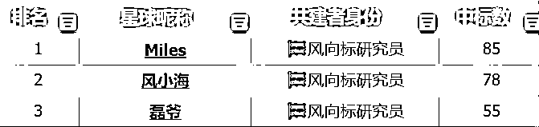

# 我是如何用1年4个月赚到人生第一个100w的（补充版）

> 来源：[https://fi8jncah4ds.feishu.cn/docx/O5iudHe9RoLMQmxXSElcNmyTnLd](https://fi8jncah4ds.feishu.cn/docx/O5iudHe9RoLMQmxXSElcNmyTnLd)

# 自我介绍

大家好，我是风小海。公众号同名

人在武汉，三年生财老圈友，服装行业，亏过也赚过，现在时间自由，离财富自由还差亿点点。

在过去的一年里，我通过风向标中标兑换了一年生财门票，我不是天赋型选手，只是走过不少弯路，踩过的坑刚好比你多一点。所以我想把这些年亲自试过的赚钱项目一条条写下来，这段时间我会分享100个真实项目，全都写给认真生活、认真赚钱的人。

新内容我都会同步在生财

我第一桶金的故事

# 前情提要

本文讲述了我从0开始赚到100w的经历，一个人，一台电脑，整个过程差不多1年零4个月。文中细节会提到我遇到了哪些问题，我是如何解决问题的。

不是鸡汤，也不是爽文，只不过是一个人在废墟之上，一锤一钉为自己垒起地基的实录。若你恰好也在低谷，希望这点火光能照亮你片刻。

# 灯火散场

2017年到2019年，我在一家做跨境电商的公司上班，公司规模不大不小，60来号人。主营澳洲药妆、保健品和土特产，业务分零售和批发两个方向。我管的是零售部分，运营4个淘宝店，打理20多个微信号，月薪1万2。那时候还没有直播带货的风口，传统电商依然热闹。每天忙得团团转，虽然累，但心里踏实，觉得这个行业还能干很多年。

但这一切在2019年元旦戛然而止。 代购法正式落地，所有涉及“个人代购”的业务都成了灰色地带。

公司高层决定直接砍掉零售线，并且拿到了一些澳洲品牌的中国代理权，做起了供应链经销商，主攻批发。

所以我们整个零售部门集体“光荣下岗”。

那一刻我意识到，很多看起来安稳的事，往往都建立在政策还没变的前提下。风一吹，牌就散了。

零售部门慢慢解散后，老板请我吃了顿饭，给我多发了我一个月工资，说“感谢你最后扛到现在”。

2019年9月，我正式告别了这家公司，成了无业游民。

# 步步为营

甩掉了上班那根勒脖的绳，我以为自己终于能偷一抹清闲。每天可以睡到自然醒，也不用担心迟到，一切似乎都变得轻松。但自由的背后，焦虑也悄悄潜入了我的生活。这一休息就是3个多月，时间到了2019年的12月份，武汉的风里带着寒意，网络上也出现了一些肺炎的传闻。再加上年底的原因，各大招聘网上也没有合适的公司，索性就想着年后再找工作吧。

没想到后来疫情爆发，武汉全城风控，太久没工作带来的空虚，加上封锁的紧张气氛，让我整个人都开始非常的焦虑，我坐在电脑前，突然有种窒息感。真的，人要是闲得太久，脑子跟腿脚一样，全得生锈，会变成一个废物。

那段时间特别懵，白天刷新闻，晚上数口罩，没办法出门就没办法挣钱，不知道还要封多久，心里一点底都没有，更要命的是，我除了大学那会儿在贴吧倒卖过球鞋之外，压根没什么创业经验。封控的那段时间我每天只做一件事，就是打开百度，在搜索框里打上“赚钱”两个字。淘宝客、拼多多、shopee、悟空问答、自媒体、写小说、闲鱼无货源、知识付费、任务平台……几乎你能在网上搜到的所有“网赚项目”，我都看了个遍。那段时间不知道注册了多少个平台，账号密码密密麻麻记了一页纸，但没有一项顺利。 这个过程让我明白了一件事：大部分所谓的赚钱项目，不过是一些带着诱饵的套路。在那个时候我也已经知道了生财有术，不过我也只是买了一些盗版内容来看，这也是我最后悔的事情，现在回头看，如果我19年就直接进了生财，我一定会少走很多弯路。

因为封锁的原因，无法出门，在这近3个月全封闭式的魔鬼训练下，我被迫学会了一身的“网赚本领”。那些跑通了最小MVP之后的项目，我就尽我最大的能力去放大，那些我认为有潜力，但是短时间无法变现的事情，我就记在待办事项里，等有灵感了就去做新的尝试。

虽然全是小打小闹，赚的也不多，但这段时间让我把迷茫给熬了过去。那些不大不小的项目，让我渐渐看到了自己能做的事，学到了不少以前从没接触过的技能。

可能不像某个“躺赚”项目那么高效，但至少在那段焦虑的日子里，它们帮我稳住了心态，也为后来做更大的事打下了基础。每一次尝试，都成了我后来最宝贵的经验之一。

# 再尝职场

2020年5月份，武汉也逐渐开始解封，万物自由，整个城市开始苏醒。复工后没多久，我决定从家里搬出去，自己一个人住，我租了套90平的二室一厅，养了只猫，取名“波弟”，他也陪伴度过了无数个寂静无声的夜晚。这个时候已经有了自己创业的苗头，但真正让鼓起勇气，下定决心一定要自己创业的事情是那一次歇斯底里的骂战。

复工后我不甘心，又去找了份工作，给一个当时全网快500万粉丝的健身博主做电商运营。公司很小，不到10个人，两个就是老板。

说是运营，实际什么都干，从客服到剪视频，甚至每周都要义务直播带货。最夸张的一天，加班到凌晨快1点，连个晚饭都没顾得上吃。

1个月后我实在受不了了，主动跟老板提了辞职，也给他说了一些建议，结果聊着聊着直接吵起来。他拍桌子那句“你是谁啊？你TM有什么资格跟我谈条件？”我到现在都记得。那一刻我彻底明白，有些公司不是工作，是牢笼

# 断尾求生

大闹一场之后，公司也算痛快，当天就把工资给我结清了。我连夜收拾东西走人，心里那口气才算松下来。彻底和稳定告别那一刻，我有点慌，但也有点爽。

2020年8月，我正式告别职场。买了一台新电脑，10部二手手机，年付了房租，存款已经捉襟见肘。我并没有给自己留后路，开始背水一战。打工是不可能打工的，这辈子不可能打工的！！

这一次我已经有了明确的目标，赚钱的道理，说穿了就一句话：低买高卖，赚差价。别的都是包装、是套路、是讲故事的段子。于是我开始从自己熟的领域翻箱倒柜地找产品，整合自己的资源，转机就是从这里开始！！因为有倒卖球鞋的经验，再加上之前在澳洲跨境公司工作过几年，手里也有一些同行好友，我第一时间在我的朋友圈里搜“鞋”，想看看能不能检索出一些货源，很遗憾，并没有！！只搜出来一些澳洲品牌的雪地靴，发布时间也已经是去年冬天，但在好奇心的驱使下，我打开淘宝搜索了这个牌子，在这个过程中我发现了一个异常值，当时正值武汉酷暑，地面都能煎蛋，但是有一个产品却反常识的销量暴增，“皮草！！” 对，你没听错，大热天的卖皮草，卖疯了！！

恰好之前公司还采购过这个品牌的给客户做礼品，我对这个国外品牌些印象，价格不便宜，三千起步，高的上万，具体名字我就不说了。采取的是预售制，订货大概要2个月左右。因为供应链与生产流程复杂，加工周期不稳定，皮草原材料依赖季节性屠宰，所以需要预留更长时间备货 。而且皮草进口需经过严格的动物检疫和成分检测，这也会导致物流和清关时间增加，以上这些条件形成了在大夏天卖皮草的壮观景象。

# 无中生有

确定产品之后，接下来我开始疯狂找货源。说干就干，第一步，我私信了所有卖这个品牌的淘宝卖家，希望能给到我分销的价格，结果百分之八十的店客服直接一口拒，剩下那百分之二十，礼貌地说“我反馈下哈”，然后就没下文了。想了一天，我突然意识到：我特么找的是客服啊，人家月薪四千，多一事不如少一事，凭啥帮我递话给老板？

想明白了这个问题就好办了。我直接联系店铺老板就好了啊！淘宝店铺不是可以查看到店铺的营业执照嘛，于是我一个个截图，在企查查上搜企业名称，上面都有留电话，大部分都是老板本人的电话。

整理出来那些老板的电话之后，我想到了一套话术，大概是这样：“您好，请问是XX公司吗，我这边是做跨境电商的，手里有很多私域的女性客户，看到您家售卖的XX产品很适合我们的客户群体，想看看能不能有机会合作一下”

也许是出于礼貌，百分之90的老板都愿意加微信来详谈合作，但又遇到一个问题，我手里没有订单，只是嘴上的空头支票，老板们个个都是人精，不听我的画饼，详谈之后，还是没一家店愿意给到我分销的价格。

但是我并没有放弃，眼看着临门一脚了，无论如何我也要拿下。我反复的看这个皮草品牌的官网，发现他们还有一个产品销量也不错，仅次于皮草，单价也不高，最贵不过300块钱，是“瑜伽服套装”。因为封锁的原因，也迎来了全民居家健身的热潮，运动服饰是当时很大的一个需求。

接下来，我做了一个非常反常识的操作。我找到了我以前公司批发部门的同事，给他推荐了这个产品，并且先斩后奏的说：找我拿的话，最贵的那款每套可以优惠100元！！ 也许是碍于前同事之间的情面，最终在我的软磨硬泡下拿了10套！

拿着这10套的订单，我挨个找之前加过好友的店铺老板私信，想先用瑜伽服来合作分销来试试水，希望能给到一些优惠！！最终有一家在我的无限画饼和货真价实的10套订单下，愿意给我优惠80元！！我也很爽快的下单了！！对，你没有看错，我自己倒贴了200元下单了，一顿操作猛如虎，回头一看净亏250！！当时心在滴血 哈哈。这件看似很蠢的行为，却让我的命运齿轮开始转动，因为我的爽快，后面也顺利的拿到皮草的分销价格。

# 反客为主

拿下皮草的分销价之后，接下来要解决的就是售卖问题。怎么卖？在哪卖？

很显然，在淘宝上没有机会，因为品牌需要授权，没有授权分分钟就被举报下架了。讲到这里大家应该都能猜到了，没错，就是闲鱼。还记得我闭关修炼那三个月做过闲鱼无货源吗？此处全都对上了，那一瞬间我心跳加速，立马把所有的产品都上架到了闲鱼，价格比淘宝售价要低一点，6个闲鱼号，当天就卖了2单，一单利润500块。我既兴奋又紧张，心里痒痒的，一晚上没睡着，生怕这个钱被别人赚走了。

就这样不分日夜的操作了几天之后，我又遇到了一个致命的问题，资金链！！皮草的是预售制，货期最快也要1个月，而平均一单我就要压3000左右在闲鱼上。而我需要直接转账给供货的商家，很快我的口袋就被彻底掏空了。只能想办法让客人直接转账给我，但是毕竟几千上万的货款，如何刚认识你的客人信任你呢？

我注意到皮草的款式很多，有100多个型号，客人选款式起来非常麻烦。但是就连官方都没有出一个方便客人选款的小程序，而且每个店铺的实拍都很少， 链接全都是挂的电商白底图。我意识到我的机会来了，我立马做了一个选款的小程序，连夜把100多个产品上到了我的小程序，一晚上喝了2罐红牛，弄的心脏突突了一夜。上架完所有产品，已经第二天的下午了，整个人完全在心流状态，感觉不到时间的流逝。

更有意思的是，一年多之后，官方也终于憋出了他们自己的选款小程序。点进去一看，页面架构跟我那个，嗯……简直像是我半夜做梦时亲手托梦给他们搭的。连按钮的位置都没挪。

那一瞬间，突然有种“民间高手，隐姓埋名”的恍惚感。你说他们抄吧，人家毕竟是官方，你说他们没抄吧，那又实在是太像了。

做完选款小程序，我又意识到，还差个重要环节：实拍图。这才是让客人信任的关键！！

那时候我已经攒下了一些订单了，底气也硬了点，立马找到供货商开口：“能不能让品牌方寄几件样品，我来拍点像样的图？”对方犹豫了一下，我就加了一句：“我给你押金，运费我也出。”

最终谈妥了：押金2万，每次寄20件，我拍完寄回去，再寄下一批来。

就这样，我开启了“皮草穿越大江南北”模式，拿到拍摄权，我女朋友有时间也会过来帮我拍照片、拍视频，虽然累得跟打仗一样，但也终于上线了一个业内前所未有的小程序，名字嘛……我学官方起的，看上去就像正版授权的一样。

果然不出所料，客人一看就惊了，好多人直接在小红书上帮我自来水宣传，流量自然也就上来了。订单有了，回款快了，资金链也不打结了。小红书上几乎所有的自然流都被我吃到了，那段时间日日夜夜都在回消息，键盘都快被我敲出火星子来了。

我最大的感受就是：当你能靠内容和工具去提升交易效率时，赚钱这件事，真的开始变得轻松了那么一点点。

# 长夜破晓

解决了供应和选款的问题之后，我开始一天十几个小时连轴转，把引流、转化、客服、售后一口气全扛了。

手机数量扩充到了20多个，那个月赚了4万多，人瘦了10斤，但脑子前所未有的清醒。

我感觉自己像打通了任督二脉，前面每一步都踩对了点，信心飙到天上。

但爽了一阵，我开始意识到：我只是在边上喝汤，汤都这么香，那主桌上的肉，得是什么味？

我不甘心继续在外围打转，我不想一辈子给别人打下手。

干脆心一横：

不行，我也要上桌吃肉！

我盯上了供货的淘宝店，心想：“他们能做的，我凭什么不能做？”

问题也很直接：我没有授权，没法在淘宝上卖。

品牌也不给资格， 代理门槛写得明明白白：

1要有公司，2要有运营3年以上的淘宝店。

于是我开始冲塔：注册公司，花3万买了一个2蓝冠老店铺，手续全补齐。

手续齐了，但问题还没完。

“想拿授权？可以，但门槛是先充值30万。”

不是拿货，是充值，拿完授权，出单了从余额里扣。

那一刻，我心里打了退堂鼓。

熬了半年，虽然能拿出这笔钱，但真砸进去，我又要差不多回到口袋空空的状态，

更怕的是，30万货卖不完怎么办？

我连着两晚没睡好，不停安慰自己说：

“拿着这30万，人生也没翻多大浪，

但如果今天我不干，哪天回头了，我一定会后悔。”

第三天早上我坐起来，给自己倒了杯水，我咬着牙给自己下了命令：

“干TM的！上桌吃肉去！”

当天我把钱打了过去，拿下代理权的那一刻，整个人浑身都是劲儿。

# 醍醐灌顶

拿下代理后，我比以前更忙了。除了闲鱼、小红书，淘宝这条主干道的流量也开始向我这边倾斜，收入随之水涨船高。但没多久，焦虑感又来了。毕竟自己创业，没有固定工资，皮草要是哪天卖不动了怎么办？但这念头一冒出来，我瞬间清醒，内心激动万分：我为什么非得只卖皮草？有了这套打法，我可以卖任何品牌啊！于是我以皮草品牌经销商的身份，去找其他品牌谈合作，提出了“资源换资源”的思路：

我把我的皮草以成本价给你，一分钱不赚——你把你的品牌授权给我，给我分销价。结果，出奇顺利，一拍即合！！！接下来我一鼓作气，干脆杀去上海订货，连着几轮谈判，又花钱拿下了一批又一批的品牌代理。到最后，我的小程序里上架的品牌已经超过了300个。慢慢地，也开始有实体店老板找我合作，邀请我做他们的网店顾问。那段时间，上海成了我除了武汉以外，待得最多的地方。再后来的事情也都还算顺风顺水，复工后大家都开始报复性的消费，我也算是踩中了风口，皮草那年卖了将近200W，其他品牌也卖了170W左右。

耗时1年零4个月，我在27岁那年，赚到了人生的第一个100万。

说实话，100W改变不了我的命，但它终于可以让我为自己做决定。

# 静水深流

赚到100w之后，我更清醒了。

我发现，一旦你掌握了赚钱的底层逻辑，就再也不会回到“只靠苦干”的状态了。

你看事情的角度会变、判断的速度会变、对项目的直觉也会变。

你不再靠直觉做事，而是像有了第二层意识，开始拆解每一个机会的本质。

思维会重构，像是突然被装上了另一个操作系统。

从那以后，我不是在找项目，是不断被项目找上门。

创业思维一旦成型，它就像一双眼睛，自动识别哪里有未被发现的金矿。

这些年我也断断续续跑通过不少项目

我不打算把自己经历的这些项目都藏起来。

接下来，我会慢慢把我脑子里的东西，一点点写出来。

写给那些还在黑夜里摸索方向的人，写给那些醒着的人。

# 我与生财

前阵子，一个圈友和我说：

“你教我的这些，已经远远超过学费了。”

看到那条消息，我愣了一下，心里突然有些触动。

我从没觉得自己做了什么特别的事，只是刚好踩过那些坑，

也刚好愿意回头拉一把后来人。

你知道的，有时候人不缺努力，缺的是路径感。

而生财，给我的就是路径感。

这种感觉就好像是有人走在你前面，然后回头说一声：这条路可以走，别怕。

你会发现，厉害的人并不排斥分享，

只是他们只在特定的地方，跟特定的人，才会开口说话。

而生财就是这个地方。

你要是走得足够真诚、够长期，自然有人愿意为你点亮一盏灯。

这盏灯，不一定照亮你所有的路，但足以让你看清脚下。

生财有术，对我来说，就像一个信息温泉。在外界声音嘈杂、真假难辨的时候，它像一个安静的角落，聚着一群 务实、不浮躁的人，一年四季都在认真总结经验，打磨项目，研究底层逻辑。在这里，没有人吹牛逼，每个人都更像在交一份答卷，不争高下，只比深度。

如果你刚进生财，其实也不用太焦虑。

先沉住气，多翻一翻老帖子，别急着提问。

你会发现，几乎所有问题，早就有人问过、答过、验证过。

差的不是信息，是你有没有把它们变成你自己的系统。

当然，不用担心看不懂。

你先混着，看久了，自然就懂了——

就像你会突然在某个深夜，读到一句话，

像是写给你的。

* * *

如果你某天刷到我，记得打个招呼。

不一定能帮你什么，但很多话，我都能懂

愿你在风起时有力争的勇气，风停后有松手的从容。

愿你熬过没人看的夜，也迎来有人懂的光。

愿你赚钱不迷路，自由不迷心。

若这一段经历能替你趟出一点方向，那它就值得被记下。

风吹不倒自己垒的砖，一步一步，也能走成大道。

祝你生财，也祝你自由

——风小海

* * *

* * *

## 2025年8月1号补充：

三个月前，我分享了这篇我赚到人生第一个 100w 的帖子，很开心得到了不少圈友的认可。

这段时间也加过来了不少微信好友，有在校大学生、有体制内的工作人员、有全职妈妈、有负债 30w 的创业者，还有一些纯粹是想认识我这个人的。其中让我印象最深的，是一位“听障人士”圈友，他虽然听不到声音，但能看懂我写的每一个字。

我意识到：很多人都在负重前行。只是这个“重”，形态各异，有的是身份焦虑，有的是经济压力，有的干脆是命运本身。

过去几个月，我被问到最多的几个问题：

“要不要辞职去创业？”

“怎么找到一个赚钱的好项目？”

“在看不见希望的时候，靠什么坚持下去？”

“如何发现自身优势”

我也借着这些问题反复思考了很久，今天统一说说我的看法，能帮到你最好。

## 01｜到底要不要辞职创业？

我的建议是：非常不建议盲目辞职。

不是每个人都适合创业，更不是每个阶段都适合创业。你一旦辞职，收入归零，压力上来，心态就会变形，这种时候人的判断能力会急剧下滑，往往越焦虑越容易做错决策。

而且大部分“副业项目”本身就不稳定，它们很多是周期性的、窗口期非常短，今天能赚钱，明天可能就卷到不值钱。

我已经测试过无数个项目了，真正长期稳定能跑的没几个。

如果你没资源、没技能，那么你能做的项目大多都会很卷，说白了就是另一种形式的“打工”——用时间换钱，和上班没本质区别，甚至可能更累。

所以我的建议是：不要着急辞职。

利用在职状态的安全感，边上班边试错，在副业里去积累经验、资源、现金流，

再慢慢决定你要不要all in，在职状态下做副业，才是大多数人的“安全起飞模式”。

## 02｜怎么找到赚钱的好项目？

一句话：好奇心 + 欲望驱动 + 高消费行为。

我这几年做过很多高客单的项目，而且基本都赚到了钱。

这些项目不是我刻意去找的，大部分是从我自己的“高消费行为”里生出来的。

最典型的就是我另一篇精华帖提到的项目：

我平时比较认床，不管是出差还是旅行，住酒店都倾向于选贵一点的，睡得舒服体验会好很多。

但次数多了，开销也不小，于是我就开始研究有没有更划算的办法住到好酒店。

没想到这事不光我有需求，很多人也有。

比如原价 3000 一晚的酒店，我这边如果能做到 2000，虽然对用户来说还是贵，但他们会觉得值，因为你替他们省下的钱是真金白银。

这其实就是高客单项目的精髓：

贵没关系，关键在于你能不能帮别人省下差价，赚到信任。

更大的关键在于：你要跳出惯性思维。

任何高客单的商品或服务里，都藏着机会，只是大多数人看不到。

很多人找项目时容易陷在自己的惯性思维里，只看自己“会什么”“能做什么”，但其实你应该反过来问：高净值人群在花什么钱？我能不能参与到这笔交易里？

说句可能有点俗的话：

“钱不是赚出来的，是花出来的。”

这句话乍一听像是消费主义洗脑，但我确实是它的受益者。

我人生大部分项目的起点，都是“高消费”带来的灵感——我先是作为一个花钱的人，去体验、去研究，然后再从里面找到赚钱的逻辑。

这种行为模式，后来甚至改变了我的思维方式和人生轨迹。

如果你能切身感受到我赚到100w这篇帖子里提到的一些思考方式，无论你想做什么赛道，什么行业，你大概率都能搞定你想要的资源。

## 03｜源动力来自哪？

很多人以为我特别能扛，其实不是。我的底气不是来自情绪稳定，而是我一直知道：

我在做的，是一件不会亏的事——让自己变得更有钱。

毛主席在《论持久战》里讲：中国抗战初期是“敌强我弱”，打的是战略防御；中期通过积累和调整，进入战略相持；最终完成战略反攻，实现胜利。

我的人生也是同样的逻辑，我知道自己在打一场持久战。

这不是指死磕某个项目，而是我很早就意识到：只要我不放弃寻找方法，我始终都是朝着“变得更有钱”的方向在走——那我的结果就一定会比现在更好。我可以绕远路，可以走慢一点，但我从不掉头。

所以我的源动力是什么？很简单：

我知道我在干嘛，而且我知道它会带我去我想去的地方。

这就足够了。

短期看情绪，长期看信念。真正的赢家，都是方向正确且死不掉的人

我很清楚：

哪怕中间换路、走弯、跌倒、绕远，只要我没掉头，我就还在路上。

只要还在路上，结果终究不会太差。

所以每次遇到问题，我都能找到解决办法，不是我多聪明，而是我始终知道：

这是一场我主动选择的长期战，输几仗没关系，赢整场才重要。

## 04｜如何找到自己的优势？

如何找到属于你的个人优势？这个问题这几个月我一直在思考，系统来说的话要从马斯洛需求理论ד自我拆解”法讲起

你有没有认真拆解过自己？

像产品经理做竞品分析那样，从姓名、长相、性格、家庭背景、技能兴趣、生活习惯、社会资源等维度一一建模，像打造一个角色一样的去拆解。

我们结合马斯洛需求层次理论来一场深度自我盘点，从最底层的“生理”到最高层的“自我实现”，层层拆解出你与生俱来的、以及后天获得的优势线索。

### 为什么要用马斯洛理论？

马斯洛的需求层次理论告诉我们，人的需求分为五个层次：

1.生理需求（吃饱穿暖）

2.安全需求（稳定保障）

3.社交需求（归属感和爱）

4.尊重需求（成就感和认可）

5.自我实现需求（发挥潜能）

你的优势往往隐藏在你最渴望满足的需求层次中。

比如：

如果你特别关注安全感，可能在风险控制、财务管理方面有天赋

如果你渴望社交认同，可能在沟通、组织、服务他人方面有优势

如果你追求自我实现，可能在创新、艺术、领导方面有潜力

### 发现优势的三个核心原则

1.内驱力：真正的优势会让你产生内在驱动力，越擅长的事情你会越喜欢，做起来也越快乐。

2.轻松感：优势领域的学习和执行相对轻松，正反馈来的快，没有阻力，也不会因为遇到困难而拖延。

3.价值创造：你的优势能为他人或社会创造价值，也能让你找到使命感，活出真实自我。

### 从多维度挖掘个人优势

以下从个人属性、外在形象、家庭关系、生活习惯、个人技能和兴趣爱好这几个维度，教你如何分析并找到优势。每个维度都结合马斯洛需求理论，帮你找到“隐藏的宝藏”。很多人忽视了最基础的个人属性，但这些往往是最独特的优势来源。

#### 姓氏优势

稀有姓氏：天然的记忆点，在个人品牌建设上有优势，例如，“李”姓在中国常见，象征广泛的社会认同；稀有姓氏（如“上官”）则让你在人群中更具辨识度。

#### 性别优势

性别影响你的社会角色和沟通风格。例如，女性可能在共情和细腻表达上有优势，男性可能在果断决策中更突出（非绝对，仅为趋势）。

#### 年龄优势

不同年龄段有独特优势。20多岁精力充沛，敢于尝试；30-40岁经验丰富，决策稳健；50岁+阅历深厚，擅长指导

年轻：学习能力强、接受新事物快、精力充沛

中年：经验丰富、资源整合能力强、判断力准确

高龄：智慧沉淀、时间自由度高、人生阅历丰富

#### 地域/民族优势

方言优势：如北方人天然适合做直播，尤其是东北方言的生动性（丰富的拟声词、夸张的比喻）和语调的起伏变化天然带有喜剧效果。受二人转、小品的熏陶，东北人集体擅长叙事和表演。

性格特质普遍热情直爽、不怯场，天然适合需要表现力的行业

东北话的高辨识度和感染力能快速吸引观众，方言梗易传播（如“老铁”“安排”）。

即时互动能力强，擅长接梗造梗，符合直播娱乐需求。所以也有“重工业烧烤，轻工业直播”的调侃

#### 外在形象

高颜值：在直播、销售、公关、模特等领域有先天优势

亲和面相：适合教育、咨询、客服、社区工作

威严面相：在管理、执法、谈判方面容易建立威信

特色面相：在表演、创意、艺术表达方面可能有独特魅力

长相与五官：独特五官（如大眼睛、深邃轮廓）或亲和力强的长相可提升在社交上的吸引力。

身高优势：高个子适合篮球、模特、演讲；矮个子在精细操作、亲和力方面有优势

体重特征：胖可以做美食博主、幽默表演；瘦可以做健身教练、时尚博主

声音特色：磁性声音适合播音、销售；童音适合幼教、配音

手部特征：修长手指适合钢琴、手模；粗糙手指适合手工艺、技术工作

头发与皮肤：独特发型（如卷发）或健康肤质可提升个人魅力。皮肤问题（如长痘痘）也能通过护理转为“真实感”带货优势。

声音：特声音（如低沉或清亮）适合演讲、配音或播客。

#### 家庭关系

互补型伴侣：可以开发夫妻档创业、情感咨询

同行型伴侣：在专业领域可以深度合作

支持型伴侣：给你安全感，让你敢于冒险创新

有孩子：在教育、育儿、家庭服务领域有真实体验

无孩子：时间自由度高，适合需要大量投入的事业

多孩子：在时间管理、资源分配方面有实战经验

父母/祖辈关系

父母经商：可能在商业嗅觉、资源整合方面有优势

父母从教：可能在知识传授、逻辑思维方面有天赋

祖辈技艺：传统手工艺、民间智慧可以传承发扬

父母经商：可能在商业嗅觉、资源整合方面有优势

父母从教：可能在知识传授、逻辑思维方面有天赋

祖辈技艺：传统手工艺、民间智慧可以传承发扬

宠物关系

养宠物：在责任心、耐心、观察力方面有锻炼

不同宠物：猫奴可能更独立细腻，狗奴可能更忠诚外向

养宠物培养爱心、责任感和情绪管理能力，可能让你在社交中更具亲和

#### 生活习惯

早起型：适合需要高度专注的工作，如写作、编程

夜猫子型：可能在创意、灵感类工作方面有优势

规律作息：在项目管理、运营岗位有优势

美食爱好者：可以做美食博主、餐厅顾问

养生达人：在健康管理、营养咨询方面有优势

简单饮食：可能在时间管理、专注力方面有优势

团体运动爱好者：团队协作能力强

个人运动爱好者：自律性和坚持力强

不爱运动：可能在静态思考、精神活动方面有天赋

#### 技能维度

硬性技能：设计、编程、外语等等..

沟通表达：能把复杂的事情说简单

逻辑思维：能把混乱的信息理清楚

情商管理：能处理复杂的人际关系

做饭：可以做美食博主、私厨、餐饮创业

收纳整理：可以做整理师、空间设计顾问

修理东西：可以做维修服务、教学视频

写作能力：不只是文章，还有文案、剧本、小说

幽默感：可以做段子手、主持、培训师

审美能力：在设计、搭配、空间美化方面有优势

#### 兴趣爱好（唱、跳、rap、篮球、画画、旅行等）

足球：不只是踢球，还可以做解说、教练、体育媒体

篮球：可以做训练师、装备测评、篮球文化传播

跑步：可以做跑步教练、运动康复、马拉松组织

唱歌：除了歌手，还可以做声乐老师、音乐治疗师

跳舞：可以做编舞师、舞蹈治疗师、形体训练师

画画：可以做插画师、设计师、艺术治疗师

摄影：可以做婚礼摄影、产品摄影、摄影培训

剪辑：可以做视频制作、广告创意、在线课程

古董收藏：可以做鉴定师、文化传播、投资顾问

手办收藏：可以做测评博主、二手交易、文化解说

书籍收藏：可以做读书博主、知识付费、文化沙龙

电子游戏：可以做游戏主播、测评师、电竞教练

桌游：可以做桌游设计师、团建培训师、社交活动组织者

密室逃脱：可以做密室设计师、团队建设培训师

兴趣爱好不仅是消遣，还能成为职业或社交的突破口，让你的兴趣成为“个人品牌名片”。

#### 隐藏维度

性格特点

内向型：专注力强、思考深度、一对一沟通能力强

外向型：社交能力强、感染力强、团队激励能力强

完美主义：在质量控制、细节把控方面有优势

冒险精神：在创新、创业、变革管理方面有优势

视觉型学习者：在设计、图表制作、视觉传达方面有优势

听觉型学习者：在音频制作、口语表达、音乐方面有优势

动觉型学习者：在实操、体验式学习、运动方面有优势

#### 经历维度

挫折经历：在心理咨询、励志演讲、危机管理方面有独特视角

跨界经历：在行业融合、创新思维方面有优势

国际经历：在跨文化沟通、国际业务方面有优势

业余时间丰富：可以发展副业、深度学习

时间紧张但高效：在时间管理、效率提升方面有实战经验

时间自由度高：可以从事需要灵活时间的工作

#### 环境维度

一线城市：资源丰富、机会多、眼界开阔

小城市：生活成本低、竞争小、人情味浓

农村背景：对传统文化、农业、生态有深度理解

#### 优势整合

单一优势容易被替代，优势组合才是护城河。

#### 优势组合公式

技能A + 技能B = 独特定位

兴趣 + 专业 = 热情事业

天赋 + 需求 = 商业机会

例如：

写作能力 + 专业知识= 知识付费博主

沟通能力 + 心理学背景= 心理咨询师

技术能力 + 教学天赋= 在线教育创业者

审美能力 + 商业思维 = 品牌设计师

## 05｜优势发现的实操工具

基于以上维度，结合马斯洛理论，快速找到并放大个人优势：

自我盘点：

花30分钟写下你的特质，覆盖6个维度（个人属性、外在形象、家庭关系、生活习惯、技能、爱好）。

示例：我是25岁上海女性，姓陈，165cm，爱笑，擅长英语和写作，喜欢旅行和弹吉他，作息规律，有一只猫。

工具：用思维导图或Excel整理，列出每个维度的优势点。

匹配需求：

对照马斯洛需求层次，思考你的特质如何满足不同需求。

示例：爱笑（归属感：吸引朋友）、英语（尊重：职场竞争力）、旅行（自我实现：开阔视野）。

问自己：哪些特质让我在社交、职场或生活中更自信？

#### 基础属性测试

我的姓氏/外貌/声音有什么特别之处？

我的年龄/性别/地域给我带来了什么独特视角？

别人第一次见我，最容易记住我什么？

#### 关系网络测试

我的家庭背景给了我什么特殊资源或经历？

我的社交圈中，我扮演什么角色？

别人遇到什么问题时会找我？

#### 技能爱好测试

什么事情我做起来特别轻松，别人觉得难？

我在什么领域的学习速度明显快于他人？

我的朋友最常向我请教什么？

#### 心理特质测试

什么类型的工作让我感到兴奋和充满活力？

我在什么情况下表现最佳？

我最自然的反应模式是什么？

### 优势发现的5W1H分析法

#### What（是什么）

我具体擅长什么？

我的优势可以用一句话概括吗？

#### Why（为什么）

为什么我在这方面有优势？

这个优势的根源是什么？

#### Who（谁）

谁需要我的这个优势？

我的目标用户是谁？

#### When（什么时候）

我什么时候开始有这个优势的？

什么时候是发挥这个优势的最佳时机？

#### Where（在哪里）

在什么场景下我的优势最明显？

在什么平台或渠道可以展示我的优势？

#### How（怎么做）

如何进一步提升这个优势？

如何将优势转化为价值？

### 优势验证的三个方法

#### 一：他人反馈验证

问10个不同背景的朋友：我最大的优势是什么？

收集工作中的正面反馈和表扬

观察别人在什么情况下会找你帮忙

#### 二：市场需求验证

在相关平台发布内容，看互动数据

尝试提供服务，看是否有人愿意付费

关注行业趋势，看你的优势是否契合需求

#### 三：持续性验证

这个优势是否可以持续发挥？

随着时间推移，这个优势是在增强还是减弱？

你是否愿意在这个领域持续投入？

## 常见误区

#### 误区一：只关注硬技能

很多人以为优势就是专业技能，忽略了软技能和个人特质。

#### 误区二：追求完美优势

总觉得自己的优势不够强，不够独特。 优势是相对的，关键是找到你的差异化定位。

#### 误区三：单一维度思考

只从一个角度看优势，缺乏组合思维。

#### 误区四：忽视市场需求

发现了优势但不考虑是否有人需要。 优势发现和市场验证要同步进行。

#### 误区五：静态思维

认为优势是固定不变的。 优势是动态的，需要持续培养和调整。

## 每个人都是独一无二的宝藏

读到这里，你可能会发现一个有趣的现象：真正的优势往往隐藏在最平凡的地方。

你的姓氏、你的外貌、你的家庭背景、你的生活习惯，甚至你的"缺点"，都可能是你独特的优势来源。关键不在于你拥有什么，而在于你如何看待和利用你所拥有的。

马斯洛告诉我们，人的最高需求是自我实现。而自我实现的前提，就是认识自己、接纳自己、发挥自己。

当你开始用系统性的方法审视自己时，你会惊喜地发现：你远比自己想象的更有价值，更有潜力，更加独特。

不是因为看到希望才坚持，而是因为坚持才看到希望。

发现优势只是第一步，真正的成长在于持续的行动和迭代。愿你在这个过程中，不仅找到自己的优势，更找到自己的价值和意义。