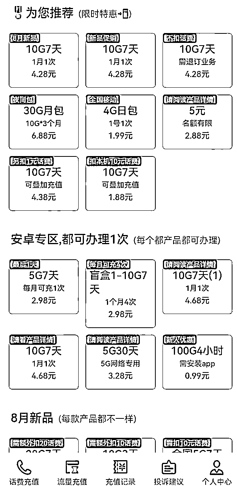
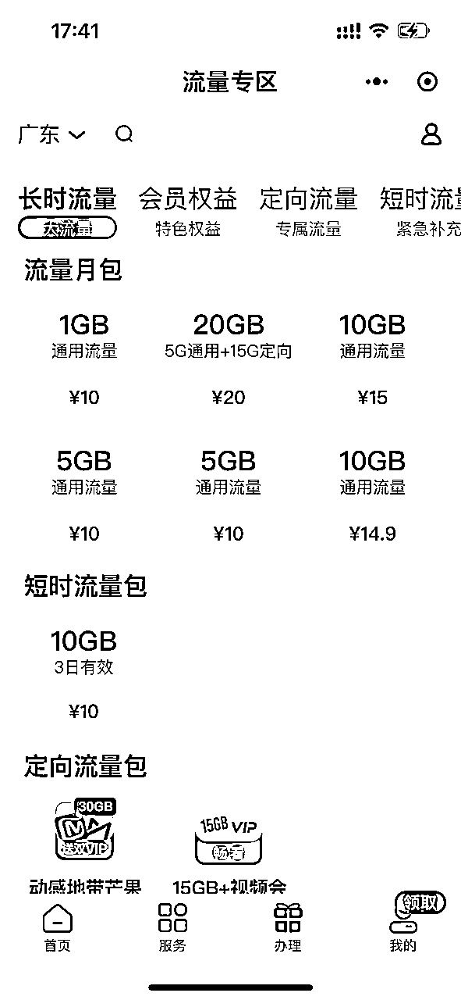
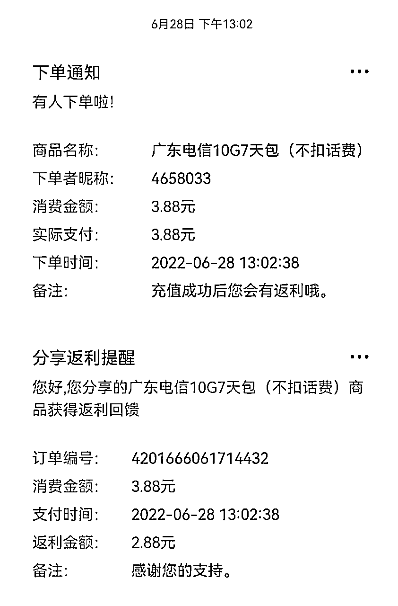
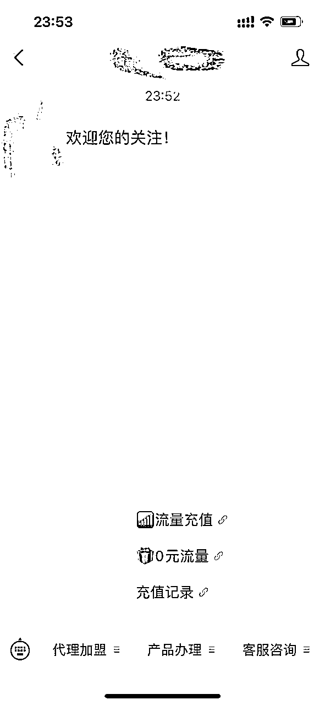
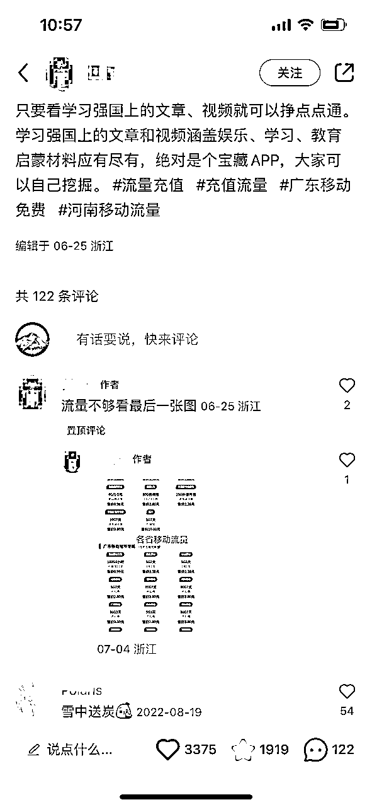
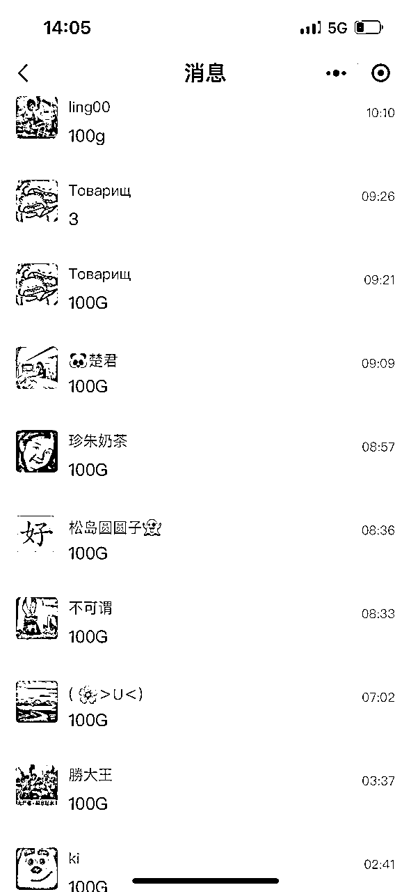
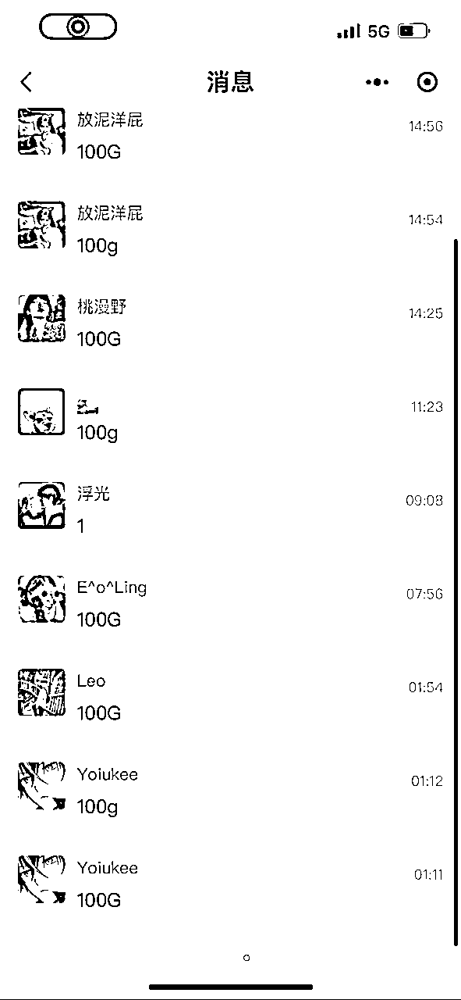
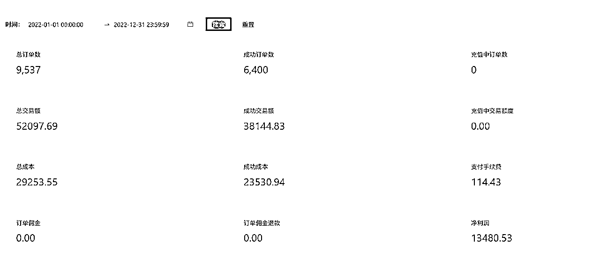
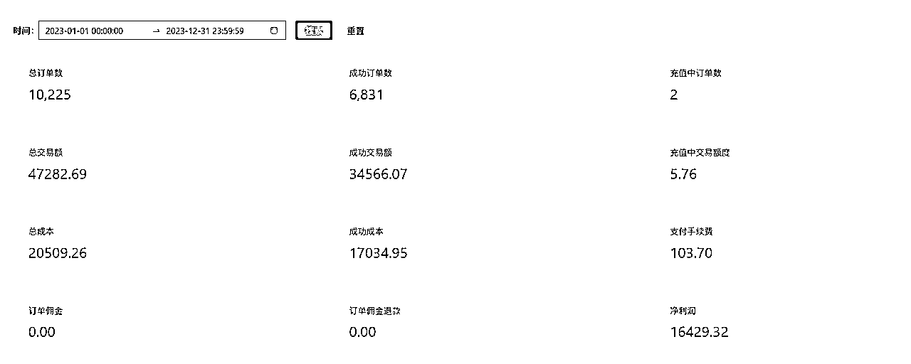
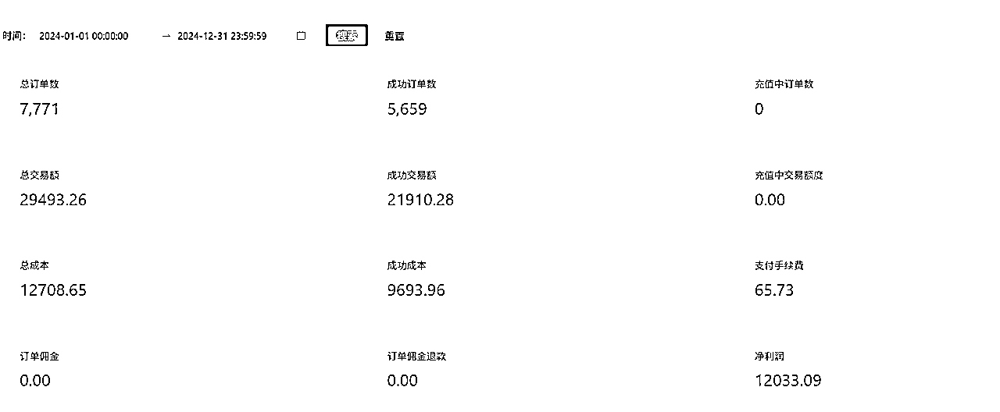

# 流量包充值，虚拟项目拆解实操

> 来源：[https://yuy9xiw6kc.feishu.cn/docx/PekrdkrOVoueKCxVyMXcwiZ7ntd](https://yuy9xiw6kc.feishu.cn/docx/PekrdkrOVoueKCxVyMXcwiZ7ntd)

大家好，我是深潜，关注生财有近两年时间，加入的有点晚，今年4月份才加入了！看到圈内有很多大佬分享的虚拟资料这块，这边也同步分享下前几年落地的可归属于虚拟类目“流量包充值”这个项目

项目变现：单账号每年被动收益1~2w，项目初期每年订单量近1w

# 一、项目缘起：从分销推广到盈利测算再到对接落地

# 【初步接触】

某天，在刷朋友圈看到别人转发了一条，几块钱充10G流量包的海报，想着同样的10G在三大运营商上面充值都得10元起步，想着便宜这么多、好奇便点了进去，扫二维码海报后是直接跳转关注公众号，在公众号菜单栏上点进去便是流量充值H5页面，如下图1（为对比价格，拿图2是某运营商官网直充流量包对比）

图1 图2

主要产品有1-10G不等，大多数产品有使用天数要求，一般为充值后3-7天内使用有效；

随后便用自己手机号在公众号充了一款流量试了下，流量包到账速度挺快，紧跟着运营商短信也发送过来显示充值成功了。

# 【发现需求】

初步充值几次流量后，感觉一个月下来如果流量充个三五次的话，每月省个几十元也挺好，后面用了一段时间充流量都能即时到账。后来联想到这个是个刚需产品，市场体量大，复购率也高。（国内有十几亿人，只要有部智能手机上网，每月运营商就会自动划扣你的账户话费，大多数流量套餐月租几十至上百元不等），基于庞大的市场体量下有不少人会出现流量不够用的情况，尤其是很多人手机号卡使用年限长的，会出现运营商流量月租套餐贵和流量少的情况（如果大家流量时常用超了的情况下，会接到运营商那边问你要不要更改话费流量套餐，举例如原先38元15G套餐客服会问你要不要升档为58元30G，这个大家应该深有体会...)，变更流量套餐，价格贵流量加的也不多；不变更流量套餐，在流量用超的情况下去官网直充一个流量包得十几二十元，在这些特惠流量充值公众号充仅需几元，于是想着这不就有搞头了！！！

# 【分销代理】

想起别人在朋友圈转发的流量充值推广海报，于是便在对应的公众号上查找是否能开通推广权限，找了后的确有分销代理权限，在平台免费开通了推广权限后，推广客户后扫我这边的推广海报关注后，系统就会自动绑定下级关系，后面客户每次在平台充值，这边都能拿到平台返佣，于是开通后便开始初步着手推广测试。

# 【数据测算】

判断一个项目是否可行，拿到数据非常重要！！！

前期初步推广测试数据，分销权限，举例一个10G7天的流量包，产品那时初步售价为3.88元，推广的粉丝，平台给的返利是2.88元每单（如下图），推广了两百多位粉丝仅用于测试数据，三个月后收益大概近二百（后面再往后测了段时间，客户有复购，收益也比较稳定），于是便按数据进行收益推算，想着如果大力推广的话，粉丝体量放大几十倍，那年收益也能达到五位数了！同时不时在想产品进货价，单个产品售价几块钱还开通分销，进货价应该会比较可观，说干就干，准备洽谈对接！

系统返利模板

# 二、项目对接

找到已经做的体量比较大的流量充值相关公众号找到对方去洽谈系统对接，费用跟对方谈，几k即可搞定。产品供应和发货、系统技术和相关api对接这块交给对方就好，具体细节跟对方沟通，系统搭建后自己只用管后期的推广！

通过公众号菜单栏挂载即可跳转至产品充值，同时可以给他人开通分销权限

有一款卖的比较火的产品“10G7天”流量包，初期进货成本价1元左右，一般自行定价翻个三五倍去售卖或可以再往上加（定价自己来定），利润率可观，客单价虽低但产品复购率高，（对比同等客单价价位产品，利润比便利店卖出去一瓶饮料都高）

（搭建好的系统初步框架如图所示）

# 三、项目推广

一、产品系统对接下来后，用自有资源进行推广，在各类社群群发广告、找小红书素人批量代发文章，找相关领域达人洽谈投放，（小红书这块推广后期带来了很大一部分的长尾搜索流量)、抖音等公域平台进行投放（后面关注到同行投放，视频流量跑的也不错）

（同行找达人博主投的一篇笔记）

同时，可不定期拿引流品进行引流，如产品“100G4小时”，产品进货成本低（几毛钱一个），在公域平台推广期间，可设置0元领100G流量活动，在公众号后台设置关键词“100G"，客户留言即可免费领（在多个渠道同时推广的情况下，可通过在公众号后台设置不同的关键词回复，这样设置的好处可以测出粉丝来源渠道和投放效果），像下图就是某渠道推广后用户自行搜索来的，引流效果不错~

二、在后台开通产品分销权限，自行调产品佣金，通过招募代理一起推广，这块就不细讲了~

# 四、收益数据

下图截图22年至24年单个公众号每年收益收据，总订单数代表客户总充值的订单数，成功订单数代表客户实际充值成功的订单数，净利润就是一年下来的实际利润。

流量产品这块会有充值失败订单，原因一般是自带的手机流量话费套餐不支持同时办理某款产品或某款产品充值次数已达每月限购次数；

后面铺公众号矩阵进行推广，经过收益数据测算，单个公众号几千粉丝，单账号年收益五位数，如下图所示：

# 五、项目总结

流量包这块属于刚需产品，低客单但高复购，要确保后端能长期提供种类较多的产品供客户挑选，同时产品进价这块要有优势。

对接落地后，只管做好推广，客户充值了产品自动发货，属于长期被动收益。