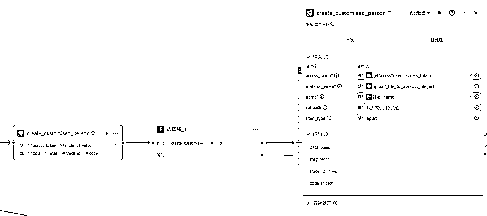

# 数字人口播自动化：扣子+多维表格+蝉镜实战教程

> 来源：[https://w63nbfedzw.feishu.cn/docx/PjTndXO9SoyxqHxKJugcnugwn9c](https://w63nbfedzw.feishu.cn/docx/PjTndXO9SoyxqHxKJugcnugwn9c)

# 背景：为什么需要自动化口播生产？

大家好，我是骄阳，好久以前就研究了数字人视频生成，当时搞了个数字人视频生成多维表格，调用飞影数字人和蝉镜数字人扣子插件生成视频，因为免费版生成的速度较慢且生成的视频有水印就没编写成文档。


最近看到有挺多蝉豆要过期了，就想着分享一篇蝉镜数字人口播视频工作流搭建教程分享给大家，顺便消耗一下蝉豆。

本文将介绍如何使用扣子工作流和多维表格来搭建一个高效的数字人口播视频生成系统。

## 行业痛点

先聊一聊数字人能帮我们解决什么？在短视频内容创作过程中，传统的人工口播制作方式存在以下几个主要痛点，而使用数字人生成视频可以有效解决这些问题：

1.  日更需求：短视频运营通常需要每日产出5-20条或更多真人口播视频内容，包括：

*   读书口播-书籍带货视频

*   读书日记口播-实拍型

*   IP形象口播

*   人生感悟等类型口播视频内容


读书口播-书籍带货视频


读书日记口播-实拍型


IP形象口播


人生感悟·哪吒

1.  人力瓶颈：

*   传统视频制作单条耗时1、2小时以上

*   批量生成（如一个月的视频素材）费时费力费人

*   人工录制质量不稳定，需要多次重录

1.  多平台适配：

*   横屏/竖屏/多语言需重复制作

*   相同的内容视频需要拍多次，使用数字人可以快速生成相同素材的视频。

## 数字人优势

1.  效率提升：

*   快速生成：1分钟文案→3分钟自动生成视频，比人工制作快很多，蝉镜数字人视频合成是按照固定比例来的，例如一分钟文案需要3分钟的生成时间。

*   批量处理：支持多任务并行生成，通过多维表格可以同时处理多个数字人生成视频任务。

*   语音内容不会有多余的语气词，减少了剪辑处理语气词的步骤

1.  成本降低：

*   数字人替代真人出镜拍摄，节约成本

*   减少场地、设备投入，无需专业摄影棚和录制设备

*   降低人工成本，减少视频剪辑和后期处理人员

1.  集中管理：

*   所有视频脚本/状态/链接统一存储到多维表格，方便团队协作和管理

*   生成的视频可以上传到OSS存储桶，长期保存。

1.  内容一致性：

*   数字人形象统一，方便打造个人IP

*   语音风格一致，不会因为一些原因导致声音不一致

# 文章内容

## 文章总体内容

文章总体内容分为扣子工作流设计和多维表格设计两大部分：

### 扣子工作流设计

扣子工作流设计部分分为蝉镜数字人克隆工作流设计和数字人视频生成工作流搭建过程两部分。

1.  蝉镜数字人克隆工作流设计过程

1.  形象克隆

1.  声音克隆

1.  数字人克隆工作流设计

1.  声音克隆工作流设计

1.  视频生成工作流搭建过程

### 多维表格设计

多维表格设计部分主要是设计一个多维表格承载视频文案生成和存储数字人视频生成结果。

1.  创建多维表格

1.  设计【数据表-克隆数字人】数据表

1.  设计【数据表-克隆声音】数据表

1.  设计【数据表-生成视频】数据表

1.  公共数字人：无需设计，直接复制我的多维表格就好

1.  支持的字体列表：无需设计，直接复制我的多维表格就好

## 开始前的准备

### 必备工具与平台

#### 蝉镜数字人账号

需要注册一个蝉镜数字人平台的账号。

官网：https://www.chanjing.cc/

#### 扣子账号

扣子平台大家应该都熟悉了，怎么注册和获取令牌就不详细描述了，我之前的文章 里有令牌获取的方法。

官网：https://coze.cn/

#### 飞书账号

搭建多维表格表格需要在飞书搭建，没注册的到时候注册就好，注册好后复制我的飞书多维表格。

官网：https://www.feishu.cn/

#### 阿里云OSS存储（可选）

用于存储数字人视频素材和生成的视频，需要开通阿里云账号并创建OSS存储桶，获取AccessKeyID、AccessKeySecret、Bucket、Endpoint。

官网：https://oss.console.aliyun.com/

阿里云OSS存储有2个地方要用到：

1、形象视频、声音克隆要上传到OSS

2、生成视频转存到OSS，这里直接用飞书多维表格的附件转 CDN 链接 插件即可，比较简单后面就不展开这个了。

# 扣子工作流设计过程

## 蝉镜数字人克隆设计过程

蝉镜数字人克隆设计步骤如下：

1.  形象克隆

1.  图片生成(如果可以录制视频可以直接录制)

1.  图生视频(如果可以录制视频可以直接录制)

1.  上传视频到OSS(素材是按照“无参url后缀为.mp4”这样的方式来做判断是否有效文件，临时文件(飞书或扣子)的格式就会识别不出来)，也可以在蝉镜官网手动上传视频然后获取蝉镜的链接，因为手动操作这里就不使用这个方法了。

1.  通过接口克隆数字人

1.  返回数字人id、名字等信息

1.  声音克隆

1.  录制音频/找一些无版权或者公开的音色录制音频

1.  上传视频到OSS(素材是按照“无参url后缀为.mp3”这样的方式来做判断是否有效文件，临时文件(飞书或扣子)的格式就会识别不出来)

1.  通过接口克隆音频

1.  返回声音id、名字等信息

### 形象克隆

因为只是展示，这里用AI生成图片并把图片转成视频，大家如果要克隆自己的形象，需要按照官方的要求进行视频录制(录制可参考创建基础版数字人)，需要注意的是，API和Web端的克隆数字人资产没有打通，也就是说Web页面克隆的数字人资产API无法调用。

1.  准备1张照片：这里使用即梦生成一张图片

1.  图片转换视频：用即梦把图片转成视频

#### 图片生成

1、这里使用即梦生图，下面是提示词(后面经过测试，不需要绿幕背景)：

```
哪吒之魔童闹海角色正面站立姿态，圆脸大眼睛Q版造型虚幻引擎渲染，对称构图，超现实材质表现微距细节光晕，除了人物无需其他物品，纯绿幕背景，背景颜色代码#489b58
```

2、生成结果：


3、生成超清图：


4、处理图片，需要去掉海浪:


#### 图生视频


生成视频后，用猫抓下载无水印的视频。

经过测试，发现漫画类的人物生成视频口型会变形，更改为真人。

```
哪吒之魔童闹海里的哪吒真人Cosplay版，真实感，实拍，正面生活照，全身照。整体色调高级红黄，高级感不带背景图。
```


生成视频：

```
手进行讲解时的动作
```


生成视频后，用猫抓下载无水印的视频。

### 声音克隆

1.  录制1分钟干净人声（避免环境噪音），可以使用剪映朗读文字，然后只导出音频，文案：

```
您好！我现在感觉很好，语调很轻松，我很有信心能做好这次视频录制。
我现在就在镜头前，准备开始。 

光线很好，我的脸上没有任何刺眼的阴影。我的发音很清晰，感觉很放松， 我会做一些自然、轻微的手部动作。 一些细微的姿态动作会让我看起来更自然、更放松。 在整个视频录制过程中，我不会移动我的身体，也不会做太剧烈的任何动作。

我没有戴眼镜或其他任何饰物，所以我的脸可以清楚地显示出来。我的语调平稳，说话自然。
我在句子之间停顿一下，闭上嘴，用鼻子呼吸。我的心情很放松，这个录音过程真的很有趣。

我还想和大家分享一些有趣的事情。我在想一些快乐的回忆，这让我觉得生活很充实、很有趣。
我把这种轻松快乐的心情，希望永远保持下去。 

现在，我要尝试加入一些轻微的手部动作，让一切感觉更自然。
我的语调依然平稳而富有感情，到目前为止我一直做得很好。我会继续努力，直到录音结 束。 

很高兴今天能见到你们，我很期待看到这次录音的结果。
到目前为止，一切都很顺利，希望你们也一切顺利 。 
```

2、在剪映里添加文本，然后用选好的音色进行朗读就会生成音频了：


3、导出生成的音频：


生成的音频就可以作为克隆素材了。

4、如果做类似人生感悟·哪吒的视频，可以把对标的视频下载下来，然后用剪映提取音频再保存，这里就简单演示剪映【音频提取】的步骤：


提取之后添加到轨道，然后导出即可，记得要关闭其他音频的声音。

### 数字人克隆工作流设计

#### 工作流整体流程


代码_1可以删掉，忘记去掉了。

#### 工作流详细流程

1、创建一个工作流，点击【工作空间➡️资源库➡️+资源➡️工作流】，设置工作流名称和描述为“create_customised_person”：


工作流名称和描述搭建可以自定义，自己理解意思以及能分辨出来就可以。

2、开始节点设置2个变量material_video、name，都设置为string类型：


material_video是形象视频的链接，name是数字人名称。

3、添加个信息提取的插件info_extract，在插件商店搜索“工具集合”或者先通过链接获取到插件“工具集合”：


输入值设置：

content：引用【开始】节点的【material_video】

raw_str：

```
(https://.*?.feishu.cn/space/api/box/stream/download/authcode/\?code=.*?)"
```

因为飞书多维表格的附件链接是一种复杂的文本内容，需要使用插个插件提取出附件的真实链接，也可以用代码节点替换这个插件。


4、添加选择器，判断info_extract的info_first不为空：


info_first不为空表示有获取到链接，如果是空的就是没有获取到。

如果分支连接到下一个【getAccessToken】节点，否则分支连接到【视频地址提取错误】节点，【视频地址提取错误】文本处理节点的内容引用info_extract节点的msg：


5、添加【蝉镜数字人API】插件的【getAccessToken】，app_id和secret_key在蝉镜官网的个人资料获取：


输入值设置：

app_id：蝉镜官网的appld

secret_key：蝉镜官网的secret_key


6、添加选择器，判断getAccessToken的data不为空：


如果分支连接到下一个【设置视频名称】节点，否则分支连接到【获取AccessToken失败】节点，【获取AccessToken失败】文本处理节点的内容引用getAccessToken节点的msg：


7、添加【设置视频名称】文本处理节点:

输入值设置：

String1：引用【开始】节点的name

字符串拼接设置为：

```
{{String1}}.mp4
```

需要注意的是，形象视频尽量上传mp4格式的视频。


8、添加【蝉镜数字人API】插件的【upload_file_to_oss】，access_key_id、access_key_secret、bucket、endpoint需要开通阿里云OSS获取：

输入值设置：

access_key_id：阿里云OSS access_key_id

access_key_secret：阿里云OSS access_key_secret

bucket：阿里云OSS bucket

endpoint：阿里云OSS endpoint

file_url：引用info_extract节点的info_first

expire_hours：链接有效时间，默认24，可以不设置

file_name：引用【设置视频名称】文本处理节点的output


因为蝉镜无法识别飞书多维表格的附件链接，所以需要把视频上传到OSS。

9、添加【蝉镜数字人API】插件的【create_customised_person】：

输入值设置：

access_token：引用【getAccessToken】节点的access_token

material_video：引用【upload_file_to_oss】节点的oss_file_url

name：引用【开始节点】节点的name

train_type：设置为figure



create_customised_person是创建数字人形象的插件，code为0表示请求成功，如果不为0那就是出错了。

10、添加选择器，判断create_customised_person的code等于0：


如果分支连接到下一个【循环】节点，否则分支连接到【创建克隆数字人错误】节点，【创建克隆数字人错误】文本处理节点的内容引用create_customised_person节点的msg：


11、添加循环节点：

循环设置：

循环类型：无限循环

中间变量设置：

id：string类型，设置为""

pic_url：string类型，设置为""

preview_url：string类型，设置为""

audio_man_id：string类型，设置为""

height：int类型，设置为1

width：int类型，设置为1

name：string类型，设置为""

msg：string类型，设置为""

输出设置：

id：引用循环的id

pic_url：引用循环的pic_url

preview_url：引用循环的preview_url

audio_man_id：引用循环的audio_man_id

height：引用循环的height

width：引用循环的width

name：引用循环的name

msg：引用循环的msg


11.1、循环体内容设置，添加【蝉镜数字人API】插件的【get_customised_person】：

输入设置：

access_token：引用【getAccessToken】节点的access_token

id：引用【create_customised_person】节点的data


get_customised_person是获取数字人形象克隆结果的插件，该插件的process表示数字人形象克隆的进度，100表示完成，还有个status表示状态(当前状态:1制作中，2成功，4失败，5系统错误)，如果要严谨些是要加上status状态判断的。

11.2、循环体内容设置，添加【蝉镜数字人API】插件的【list_customised_person】(Tips:该节点可以不用设置)：

输入设置：

access_token：引用【getAccessToken】节点的access_token

page：设置为1

page_size：设置为20


list_customised_person是获取定制数字人形象的插件，可以不用添加的，因为之前忘记删了。

11.3、添加选择器，判断【get_customised_person】节点的process等于100：


如果分支连接到【设置变量】节点，否则分支连接到【代码(停顿)】节点.

11.4、添加【设置变量】节点：


设置对应设置即可，弄完后链接到【终止循环】节点。

11.5、添加【代码(停顿)】节点：

输入设置：

sleep_time：设置为5，也可以设置更长些，添加停顿时间是为了避免循环过快超出工作流的节点运行次数。

输出设置：

sleep_time：string类型

代码(Python代码，不是JavaScript代码，需要通过左上角切换为Python)：

```
import time

async def main(args: Args) -> Output:
    params = args.params
    sleep_time = params["sleep_time"]

    time.sleep(sleep_time)
    # 构建输出对象
    ret: Output = {
        "sleep_time": sleep_time
    }
    return ret
```


12、添加【变量聚合】节点：

输入设置：

设置分组名称为info，设置为：

获取AccessToken失败-output

创建克隆数字人错误-output

视频地址提取错误-output


13、【结束】节点设置：

输出变量设置：

id：引用【循环】节点的id

pic_url：引用【循环】节点的pic_url

preview_url：引用【循环】节点的preview_url

audio_man_id：引用【循环】节点的audio_man_id

height：引用【循环】节点的height

width：引用【循环】节点的width

name：引用【循环】节点的name

msg：引用【循环】节点的msg

info：引用【变量聚合】节点的info


需要把【结束】节点设置为返回变量。

14、发布工作流：


点击【坚持发布】发布工作流。

15、获取工作流id：


工作流id后面多维表格会用到。

### 声音克隆工作流设计

#### 工作流整体流程


#### 工作流详细流程

1、创建一个工作流，点击【工作空间➡️资源库➡️+资源➡️工作流】，设置工作流名称和描述为“create_customised_audio”：


2、开始节点设置2个变量audio_url、name，都设置为string类型：


3、添加个信息提取的插件info_extract，在插件商店搜索“工具集合”或者先通过链接获取到插件“工具集合”：


输入值设置：

content：引用【开始】节点的【audio_url】

raw_str：

```
(https://.*?.feishu.cn/space/api/box/stream/download/authcode/\?code=.*?)"
```


4、添加选择器，判断info_extract的info_first不为空：


如果分支连接到下一个【getAccessToken】节点，否则分支连接到【音频地址提取错误】节点，【音频地址提取错误】文本处理节点的内容引用info_extract节点的msg：


5、添加【蝉镜数字人API】插件的【getAccessToken】，app_id和secret_key在蝉镜官网的个人资料获取：


输入值设置：

app_id：蝉镜官网的appld

secret_key：蝉镜官网的secret_key


6、添加选择器，判断getAccessToken的data不为空：


如果分支连接到下一个【设置音频名称】节点，否则分支连接到【获取AccessToken失败】节点，【获取AccessToken失败】文本处理节点的内容引用getAccessToken节点的msg：


7、添加【设置音频名称】文本处理节点:

输入值设置：

String1：引用【开始】节点的name

字符串拼接设置为：

```
{{String1}}.mp3
```


8、添加【蝉镜数字人API】插件的【upload_file_to_oss】，access_key_id、access_key_secret、bucket、endpoint需要开通阿里云OSS获取：

输入值设置：

access_key_id：阿里云OSS access_key_id

access_key_secret：阿里云OSS access_key_secret

bucket：阿里云OSS bucket

endpoint：阿里云OSS endpoint

file_url：引用info_extract节点的info_first

expire_hours：链接有效时间，默认24，可以不设置

file_name：引用【设置音频名称】文本处理节点的output


9、添加【蝉镜数字人API】插件的【create_customised_audio】：

输入值设置：

access_token：引用【getAccessToken】节点的access_token

url：引用【upload_file_to_oss】节点的oss_file_url

audio_name：引用【开始节点】节点的name


10、添加选择器，判断create_customised_audio的code等于0：


如果分支连接到下一个【循环】节点，否则分支连接到【创建克隆音频错误】节点，【创建克隆音频错误】文本处理节点的内容引用create_customised_audio节点的msg：


11、添加循环节点：

循环设置：

循环类型：无限循环

中间变量设置：

id：string类型，设置为""

name：string类型，设置为""

audio_path：string类型，设置为""

err_msg：string类型，设置为""

progress：int类型，设置为1

输出设置：

id：引用循环的id

name：引用循环的name

audio_path：引用循环的audio_path

err_msg：引用循环的err_msg

progress：引用循环的progress


11.1、循环体内容设置，添加【蝉镜数字人API】插件的【get_customised_audio】：

输入设置：

access_token：引用【getAccessToken】节点的access_token

id：引用【create_customised_audio】节点的data


11.2、循环体内容设置，添加【蝉镜数字人API】插件的【list_customised_audio】(Tips:该节点可以不用设置)：

输入设置：

access_token：引用【getAccessToken】节点的access_token

page：设置为1，可不设置

page_size：设置为20，可不设置


11.3、添加选择器，如果判断【get_customised_audio】节点的process等于100，否则如果判断【get_customised_audio】节点的err_msg不为空：


如果、否则如果两个分支连接到【设置变量】节点，否则分支连接到【代码(停顿)】节点.

11.4、添加【设置变量】节点：


设置对应设置即可，弄完后链接到【终止循环】节点。

11.5、添加【代码(停顿)】节点：

输入设置：

sleep_time：设置为5，也可以设置更长些，添加停顿时间是为了避免循环过快超出工作流的节点运行次数。

输出设置：

sleep_time：string类型

代码(Python代码，不是JavaScript代码，需要通过左上角切换为Python)：

```
import time

async def main(args: Args) -> Output:
    params = args.params
    sleep_time = params["sleep_time"]

    time.sleep(sleep_time)
    # 构建输出对象
    ret: Output = {
        "sleep_time": sleep_time
    }
    return ret
```


12、添加【变量聚合】节点：

输入设置：

设置分组名称为info，设置为：

获取AccessToken失败-output

创建克隆音频错误-output

音频地址提取错误-output


13、【结束】节点设置：

输出变量设置：

id：引用【循环】节点的id

name：引用【循环】节点的name

audio_path：引用【循环】节点的audio_path

err_msg：引用【循环】节点的err_msg

progress：引用【循环】节点的progress

info：引用【变量聚合】节点的info


需要把【结束】节点设置为返回变量。

14、发布工作流：


点击【坚持发布】发布工作流。

15、获取工作流id：


工作流id后面多维表格会用到。

## 视频生成工作流搭建过程

#### 工作流整体流程


#### 工作流详细流程

1、创建一个工作流，点击【工作空间➡️资源库➡️+资源➡️工作流】，设置工作流名称和描述为“chanjing_video_generate”：


2、开始节点设置7个变量audio_man_id、wav_url、person_id、text、font_id、font_color、font_size，都设置为string类型：

默认值设置：

audio_man_id：设置声音克隆结果的id

wav_url：：设置声音克隆结果的wav_url

person_id：设置数字人克隆结果的id

text：数字人要朗读的文案，默认值设为“这是一段测试文本”

font_id：字体id，默认值设为d6deed050b0e43e58ac87cf4eccfa295

font_color：字体颜色值，默认值设为#FFD900

font_size：字体大小，默认值设为64


3、添加【蝉镜数字人API】插件的【getAccessToken】，app_id和secret_key在蝉镜官网的个人资料获取：


输入值设置：

app_id：蝉镜官网的appld

secret_key：蝉镜官网的secret_key


4、添加选择器，判断getAccessToken的data不为空：


如果分支连接到下一个【配置生成】代码节点，否则分支连接到【获取AccessToken失败】节点，【获取AccessToken失败】文本处理节点的内容引用getAccessToken节点的msg：


5、添加【配置生成】代码节点:

输入值设置：

text：引用【开始】节点的text

audio_man_id：引用【开始】节点的audio_man_id

wav_url：引用【开始】节点的wav_url

person_id：引用【开始】节点的person_id

volume：100

font_id：引用【开始】节点的font_id

font_color：引用【开始】节点的font_color

font_size：引用【开始】节点的font_size

输出值设置：

person：object类型

audio：object类型

subtitle_config：object类型

代码(Python代码，不是JavaScript代码，需要通过左上角切换为Python)：

```
async def main(args: Args) -> Output:
    params = args.params
    audio_man = params["audio_man_id"]
    wav_url = params["wav_url"]
    person_id = params["person_id"]
    font_id = params["font_id"]
    font_color = params["font_color"]
    if font_color == "":
        font_color = "#FFD900"
    font_size = params["font_size"]
    if font_size == "" or font_size == 0:
        font_size = 64
    volume = params["volume"]
    text = params["text"]

    audio = {
        "tts": {
        "text": [text],
        "speed": 1,
        "audio_man": audio_man
        },
        "wav_url": wav_url,
        "type":"tts",
        "volume":volume
    }
    person = {
        "id": person_id,
        "width":1080,
        "height":1920,
        "x":0,
        "y":0,
        }

    subtitle_config = {
        "color":font_color,
        "font_id":font_id
    }

    # 构建输出对象
    ret: Output = {
        "person": person,
        "audio": audio,
        "subtitle_config":subtitle_config
    }
    return ret
```

audio的type要设置为tts，设置为audio会从音频获取文案，不会根据文本文案生成音频。

person的x(x轴)和y(y轴)需要分别设置为0、0，不然默认是0、480，生成的视频只会显示在部分数字人形象。

subtitle_config只要设置颜色和字体id即可，文字位置(x、y)、大小(接口有点问题，所以font_size没有使用)默认即可。font_id从多维表格中支持的字体列表获取。


6、添加【蝉镜数字人API】插件的【create_video】：

输入值设置：

access_token：引用【getAccessToken】节点的access_token

audio：引用【配置生成】代码节点的audio

bg：可不设置

bg_color：可不设置

callback：可不设置

person：引用【配置生成】代码节点的person

screen_height：可不设置

screen_width：可不设置

subtitle_config：引用【配置生成】代码节点的subtitle_config


7、添加选择器，判断create_video的code等于0：


如果分支连接到下一个【循环】节点，否则分支连接到【创建合成视频失败】节点，【创建合成视频失败】文本处理节点的内容引用create_video节点的msg：


8、添加循环节点：

循环设置：

循环类型：无限循环

中间变量设置：

video_url：string类型，设置为""

输出设置：

video_url：引用循环的video_url


8.1、循环体内容设置，添加【蝉镜数字人API】插件的【get_video_details】：

输入设置：

access_token：引用【getAccessToken】节点的access_token

id：引用【create_video】节点的data


8.2、添加选择器，判断【get_video_details】节点的process等于100：


如果分支连接到【设置变量】节点，否则分支连接到【代码(停顿)】节点.

8.3、添加【设置变量】节点：


设置对应设置即可，弄完后链接到【终止循环】节点。

8.4、添加【代码(停顿)】节点：

输入设置：

sleep_time：设置为5，也可以设置更长些，添加停顿时间是为了避免循环过快超出工作流的节点运行次数。

输出设置：

sleep_time：string类型

代码(Python代码，不是JavaScript代码，需要通过左上角切换为Python)：

```
import time

async def main(args: Args) -> Output:
    params = args.params
    sleep_time = params["sleep_time"]

    time.sleep(sleep_time)
    # 构建输出对象
    ret: Output = {
        "sleep_time": sleep_time
    }
    return ret
```


9、添加【变量聚合】节点：

输入设置：

设置分组名称为info，设置为：

获取AccessToken失败-output

创建合成视频失败-output


10、【结束】节点设置：

输出变量设置：

video_url：引用【循环】节点的video_url

info：引用【变量聚合】节点的info


需要把【结束】节点设置为返回变量。

11、试运行工作流：


运行没有问题就可以发布工作流了。

12、点击左上角的【发布】发布工作流：


13获取工作流id：


工作流id后面多维表格会用到。

# 数字人口播视频生成多维表格设计

## 创建多维表格

1、创建一个飞书多维表格，名称设置为【魔童数字人视频生成】，创建下面5个数据表(直接复制我的即可)：

```
数据表-克隆数字人
数据表-克隆声音
数据表-生成视频
公共数字人
支持的字体列表
```


## 设计【数据表-克隆数字人】数据表

1、添加【数字人名称】文本类型字段，【形象视频】附件类型字段，再添加一个【克隆数字人】字段，搜索【扣子工作流调用】字段捷径插件：


2、配置插件：

认证令牌：认证令牌就不说了，在扣子官网获取

工作流ID：工作流id是我们前面获取到的

参数字段：选择【形象视频】附件类型字段

参数名称：设置为material_video，对应工作流里的material_video参数

请求模板：

```
{
  "material_video": "$$material_video$$",
  "name": "【引用数字人名称字段】"
}
```

输出结果1：设置为id

输出结果2：设置为name

获取更多信息：启用获取更多信息，全部勾选

自动更新：按需求启用或手动调用工作流


点击【确定】保存配置，然后再点击【仅保存配置】。

3、配置好插件后，先设置数字人名称，然后再上传【形象视频】进行数字人形象克隆：


运行成功如图，输出结果1(数字人id)、输出结果2(数字人名称)和完整响应数据不为空。

## 设计【数据表-克隆声音】数据表

1、添加【音色名称】文本类型字段，【声音】附件类型字段，再添加一个【克隆声音】字段，搜索【扣子工作流调用】字段捷径插件：


2、配置插件：

认证令牌：认证令牌就不说了，在扣子官网获取

工作流ID：工作流id是我们前面获取到的

参数字段：选择【声音】附件类型字段

参数名称：设置为audio_url，对应工作流里的audio_url参数

请求模板：

```
{
  "audio_url": "$$audio_url$$",
  "name": "【引用音色名称字段】"
}
```

输出结果1：设置为id

输出结果2：设置为audio_path

获取更多信息：启用获取更多信息，全部勾选

自动更新：按需求启用或手动调用工作流


点击【确定】保存配置，然后再点击【仅保存配置】。

3、配置好插件后，先设置音色名称，然后再上传【声音】进行音色克隆：


没有启动自动更新需要点击单元格，然后点击【刷新】图标进行音色克隆。运行成功如图，输出结果1(音色id)、输出结果2(音色地址)和完整响应数据不为空。

## 设计【数据表-生成视频】数据表

1、添加【视频文案】、【音色名称】、【数字人名称】文本类型字段，【音色ID】、【音色地址】、【数字人ID】查找引用字段：


2、【音色ID】查找引用字段设置：


设置好后就会自动根据音色名称查找对应的【音色ID】。

3、【音色地址】查找引用字段设置：


设置好后就会自动根据音色名称查找对应的【音色地址】。

4、【数字人ID】查找引用字段设置：


设置好后就会自动根据数字人名称查找对应的【数字人ID】。

5、再添加一个【视频合成】字段，搜索【扣子工作流调用】字段捷径插件：


2、配置插件：

认证令牌：认证令牌就不说了，在扣子官网获取

工作流ID：工作流id是我们前面获取到的

参数字段：选择【视频文案】文本类型字段

参数名称：设置为text，对应工作流里的text参数

请求模板：

```
{
  "material_video": "$$material_video$$",
  "name": "【引用数字人名称字段】"
}

{
"text": "$$text$$",
  "audio_man_id": "【引用音色ID字段】",
  "wav_url": "【引用音色地址字段】",
  "font_color": "#FFD900",
  "font_id": "d6deed050b0e43e58ac87cf4eccfa295",
  "font_size": "64",
  "person_id": "【引用数字人ID字段】"
}
```

输出结果1：设置为video_url

输出结果2：设置为info

获取更多信息：启用获取更多信息，全部勾选

自动更新：按需求启用或手动调用工作流


点击【确定】保存配置，然后再点击【仅保存配置】。

3、配置好插件后，先设置【音色名称】、【数字人名称】，然后再设置【视频文案】进行数字人视频生成：


运行成功如图，输出结果1、输出结果2和完整响应数据不为空。

PS：

1、因为数字人克隆的形象视频只有5秒，所以视频超过5秒就会有比较明显的切换，建议上传时长较长的形象视频克隆。

2、多音字可能会出现读音跟口语的读音有差异，可以参考官方开发者文档进行标注

3、可以弄一个抖音文案提取插件(扣子发布到多维表格)，也可弄一个工作流，用扣子工作流调用插件调用工作流提取文案，然后用DeepSeek字段捷径插件改写文案，最后调用数字人视频生成工作流生成视频。

# 结语

教程就到这啦，欢迎大家交流讨论，碰撞出更多变现的思路和玩法。

# 附录

1.  多维表格模板链接

1.  蝉镜数字人开发者文档

蝉镜数字人开发者文档

1.  数字人口播自动化：扣子+多维表格+蝉镜实战教程-可复制代码