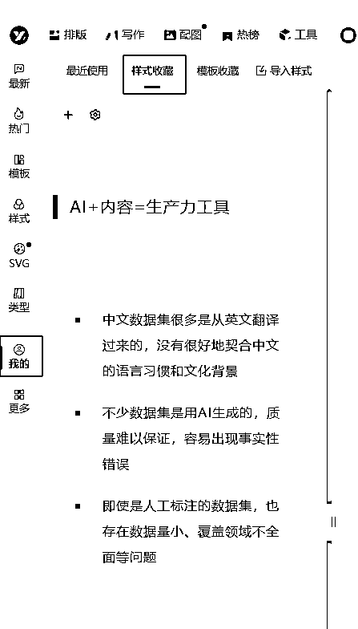
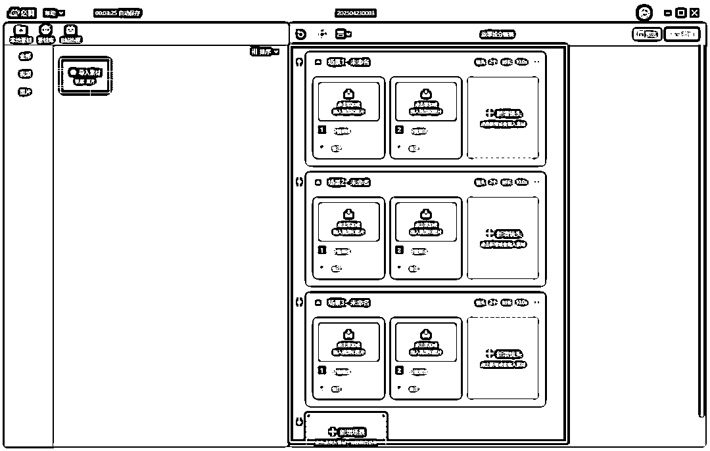
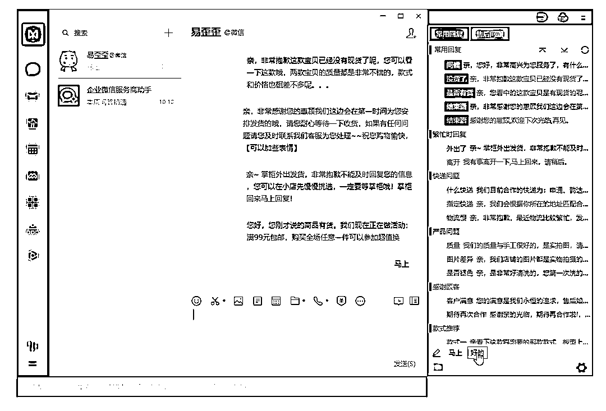
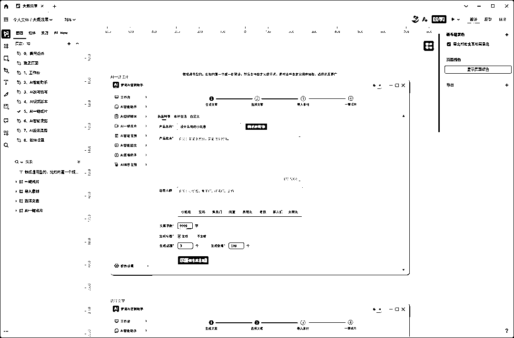
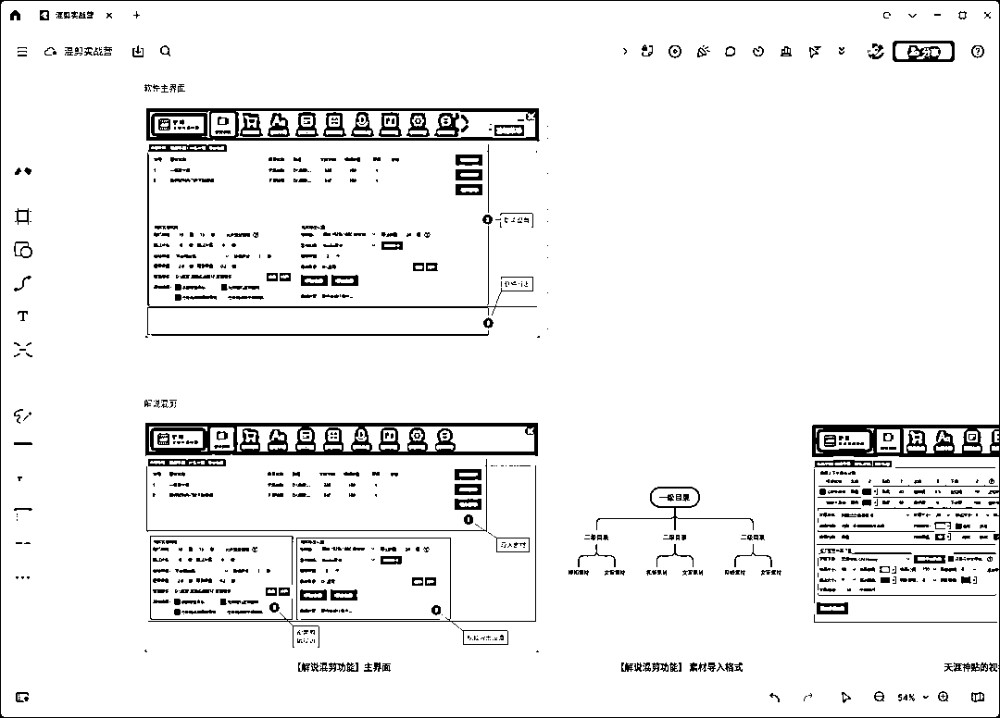
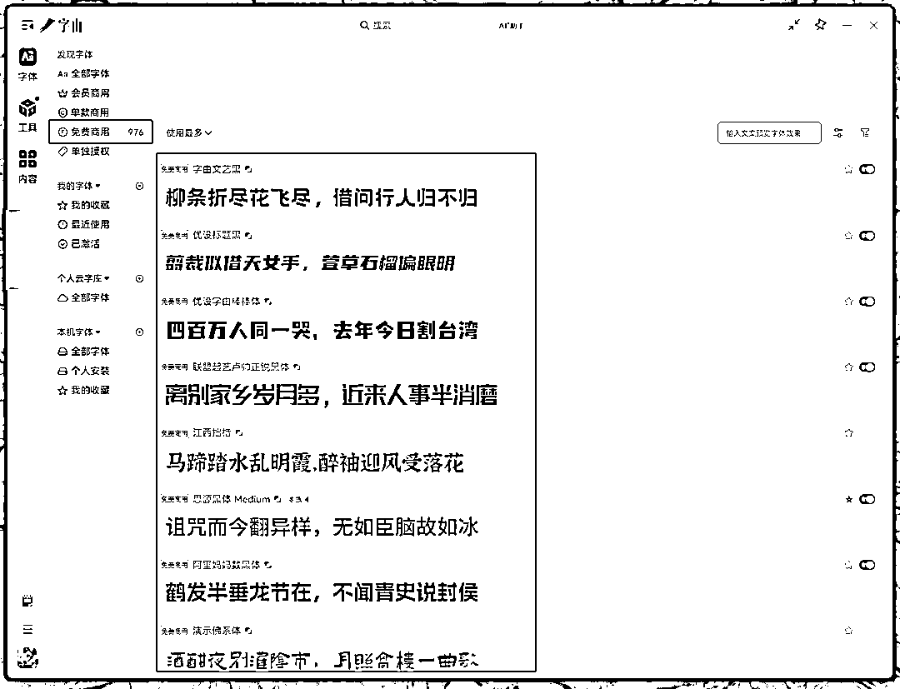

# 70多款软件、100多张截图、1w多字，一份全网最硬核的「效率开挂」神器指南！

> 来源：[https://bh5pm72xfy.feishu.cn/docx/PqQadnIcNoykXOxKjZocf7XBnzb](https://bh5pm72xfy.feishu.cn/docx/PqQadnIcNoykXOxKjZocf7XBnzb)

人和动物的最大的区别，就是会思考和使用工具。

工欲善其事，必先利其器！尤其是做互联网的，所有重复性的工作，都要交给工具。

做互联网十几年，使用了不下于上千款工具，最终筛选出了这70多款「效率开挂」神器，这篇文章应该是目前关于效率工具+实用工具方面，最全面的文章，全篇无广，都是我自己筛选出来的工具和使用心得。

时间永远是最稀缺的资源，所以废话不多说，让咱们直接开始吧！

## 影刀（RPA流程自动化工具）

官网： https://www.yingdao.com

办公自动化效率神器，无需编程，支持手机、电脑、网页的自动化操作，花个几天时间去学习一下官方教程，就可以实现简单的自动化脚本。

可以解决那些需要重复操作的工作，比如批量操作AI写文章，自动发视频，统计每天的销售数据等等，凡是有规律可循的操作，基本都能胜任。

如果不想自己研究，某鱼、某宝上也有很多接单的高手，谈好需求和价格，能节省不少功夫。

## 滴答清单

官网：https://www.dida365.com/home

我主要用里面的四象限表格来规划任务，默认是关闭的，需要手动在设置里面打开。

以结果为导向，列出具体可执行的清单，去做具体的事，把执行力拉满！

这里简单科普一下， 四象限工作法是一种高效的时间管理工具，通过将任务按 紧急程度 和 重要程度 分为四个象限，帮助自己明确任务的优先级、合理分配精力。

*   第一象限（ 紧急且重要 ）

*   例如：迫在眉睫的主要任务

*   处理原则 ： 立即行动，尽量减少这类任务

*   第二象限（ 重要不紧急 ）

*   例如：长期规划、人际关系维护、 每天固定时间学习、定期复盘

*   处理原则 ： 重点投入时间，制定计划并坚持执行

*   第三象限（ 不重要但紧急 ）

*   例如：临时会议、不重要的电话、多数社交消息

*   处理原则 ： 快速处理或委托他人，避免被琐事消耗精力

*   第四象限（ 不重要不紧急 ）

*   例如：刷短视频、无意义的闲聊、消遣式娱乐

*   处理原则 ： 尽量删除或限制时间

## 飞书

官网：https://www.feishu.cn

我主要用的功能只有3个，一个是飞书云文档，主要用来写文章和做表格。在写文章方面，飞书云文档绝对属于第一梯队。

几乎不需要任何学习成本，简单用鼠标拖拽，就可以完成各种文章和图片的排版效果，而且支持云同步和生成分享链接。

一个是飞书云文档里面的知识库，主要用来搭建个人知识库，方便整理那些散落在各处的优质内容，记录一些想法和灵感。

对于互联网从业者来说，搭建个人知识库是非常有必要的，可以把碎片化的知识，转化为更为系统的sop流程，方便快速查找和复用。

除了搭建个人知识库，还要搭建内容生产知识库，通过AI收集并整理来自抖音、B站、公众号、知乎、小红书等多平台的爆款内容和选题，形成专业内容素材库，再基于此，用AI快速创作高质量原创内容。

最后一个是近期爆火的飞书多维表格，聚合了非常多的AI功能，比如deepseek、AI绘画、AI提取文案等，我觉得这功能是内容创作者的必学项，而不是可选项。

不得不说飞书的产品经理真的强，一个表格就可以让AI同时执行大量重复性的任务，并且操作比较简单，几乎不需要懂任何的技术，就能实现非常多的玩法，比如批量仿写文案、批量图像复刻、批量采集内容等等。

## QQ

官网：https://im.qq.com/index

成交用微信，办公用QQ ，虽然大家基本上都是用微信交流和成交，但QQ用来办公，确实比微信好用，比如QQ群的各种管理功能（禁言，群文件，设置管理员等），不限速传输大文件，以及QQ的长截图功能、截图打码等，都是很好用的。

以下是我比较常用的QQ截图功能，帮助我提高了不少工作效率，这篇文章中的截图，也基本都是QQ截图做的。

## 微信截图

官网：https://weixin.qq.com

微信截图中的翻译功能，用起来相当nice， 可以把译文显示在截图中原来的位置上 ，对像我这种英语差，但是经常要尝试各种英文软件的人来说，简直不要太爽。

## 桌面远程控制工具

### ToDesk

官网：https://www.todesk.com

### 向日葵远程控制

官网：https://sunlogin.oray.com/download

两款软件的功能大同小异，都是远程控制桌面的，有时候会用来远程操作用户的电脑，解决对方解决不了的问题。另外还支持手机控制电脑，偶尔应急一下也不错。

## 亿图脑图MindMaster（付费）

官网：https://www.edrawsoft.cn/mindmaster

思维导图软件， 亿图脑图说第二，应该没人敢说第一，功能算是思维导图中最全的，除了贵点没啥缺点，所以入手了终身版。

平常主要用来梳理思路，可以直观的把自己的想法和思路列出来。

如果是个人使用，并且频率不高，也可以用xmind平替（官网：https://xmind.cn），界面比较简洁美观，功能基本上也只保留了最核心的部分，属于简单易操作的类型，免费版就可以满足大部分基础需求。

## 亿图图示（付费）

官网：https://www.edrawsoft.cn/edrawmax

市面上那种知识海报地图，基本上就是用这个软件做出来的。我主要用来梳理各种流程，比如在开发一些批量混剪的功能时，会先把软件的整体运行流程梳理出来，方便后续开发。

## Bandicam（付费）

官网：https://www.bandicam.cn

我把市面上能找到的所有视频录制软件，全都试了一遍，最后留下了班迪。录屏软件最重要的是稳定性，其次才是各种加分项的功能，如果录制到一半的时候软件崩了，自己还不知道，等录好了才发现，就知道有多崩溃了。

测试用班迪录过一次游戏视频，5个小时都没有崩溃，并且视频清晰，录制出来的文件还很小， 果断入了终身正版。

另外班迪的界面也很简单明了，光看图标就知道是啥功能，无需复杂的设置和学习。

## 极连快传

官网：https://shouji.360.cn/jl.html

跨设备传输神器 ，可以轻松在电脑和手机之间传输文件、电脑和电脑之间也可以传输，并且支持多个设备，还不限速。

平常用来在手机和电脑之间，互相发送文本和传输照片、视频（无损传输，不会被压缩），好处是不用连接数据线，并且支持云传输，哪怕不在一个局域网下，依旧可以传输。

## 浏览器插件

### 壹伴

官网： https://yiban.io

公众号编辑器，支持更全面的公众号后台数据分析功能，我主要用来排版，这篇文章的排版用的就是壹伴。看到好的文章排版时，可以用壹伴的样式收藏功能直接收藏，就可以直接调用了。

### AdGuard 广告拦截器（需魔法）

官网： https://adguard.com/zh_cn/welcome.html

非常强大的一款浏览器广告拦截插件 ，是我必装的一款浏览器插件，能拦截绝大多数的各类浏览器广告，并且支持手工标记插件没有识别到的广告。

### 飞书剪存

官方教程： https://www.feishu.cn/hc/zh-CN/articles/606278856233-使用飞书剪存功能

插件地址： https://chromewebstore.google.com/detail/飞书剪存/mofcmpgnbnnlcdkfchnggdilcelpgegn

很好用的飞书剪存插件， 可以一键把当前网页的内容收藏到飞书文档中 ，很多优质的内容，会因为各种原因失效，所以我会把优质的内容，提前转存到自己的飞书知识库中。

### 篡改猴

官网： https://www.tampermonkey.net

脚本搜索： https://www.tampermonkey.net/scripts.php

必装的浏览器插件之一， 可以找到大量其它用户创建的浏览器脚本 ，比如某音某书下载、解除网页复制限制等，功能太强大了，不方便截图，建议自己搜索一下就知道了。

### 沉浸式翻泽

官网： https://immersivetranslate.com/zh-Hans/

这个浏览器翻译插件，应该是人手必备了吧， 但是信息茧房的存在，估计很多人还是不知道，所以还是分享一下。

之前的各种翻译插件，都是直接把整个网页翻译了，翻译出来很鬼畜，并且不能对照原文，但这个沉浸式翻译不一样，给世界各大的网站做了适配，可以做到仅翻译需要翻译的部分，比如只翻译评论区，并且可以选择原文对照等模式。

### AIX智能下载器

官网： https://aixdownloader.com/zh/

一款网页资源批量下载插件， 支持图片、视频、音乐、文档 ，可以嗅探出当前网页中的各种资源链接，只要不是加密的，基本都可以下载。

并且支持在新标签页打开，可以根据图片分辨率大小、图片格式、视频大小、视频格式等，筛选后再下载。

## 视频处理工具

### 剪映专业版

官网： https://www.capcut.cn

面试要求精通PR，工作全都用的剪映。剪映最大的优势就是简单、高效，一键识别字幕、大量的AI配音、视频人物美颜、各种进出场特效、贴纸、上百种花字、视频一键抠像、镜头分割、还有各种滤镜等等。

以前给视频添加字幕，甚至需要一个岗位来专门负责，自从有了剪映，几乎把视频剪辑的门槛拉到“ 负数”了。

### 万兴喵影

官网： https://miao.wondershare.cn

除了剪映，还有一款国产剪辑神器就是万兴喵影，也走的简单易用路线，比剪映出道更早，功能方面和剪映大差不差，但是有很多差异化的功能，可以结合剪映一起用，能提高不少效率。

### 必剪

官网： https://bcut.bilibili.cn

这款国产剪辑软件，知道的人应该不多，是B站出品的，目前完全免费。如果只是做一些简单的剪辑，又不想开会员，必剪是个很好的平替，也支持一键识别字幕、录屏等功能。

另外这个故事线功能很有特色，可以快速导入视频粗剪。

### Bandicut 班迪剪辑（收费）

官网： https://www.bandicam.cn/bandicut-video-cutter/

软件就三个功能：截取、分割、拼接。我主要用的截取功能，可以人工把一个长视频，精确分割出自己需要的片段，并且全程可视化。

拼接功能偶尔用一下，可以拖动视频快速排序，比剪辑软件更加直观，适合做一些简单的混剪视频，但是不可以批量。

### 格式工厂

官网：http://www.pcgeshi.com

可以完成几乎所有文件格式之间的批量互转，比如视频、音频、图片等，而且免费，必备神器之一。

### 铲哥批量剪辑神器

官网：

铲哥自己开的视频批量剪辑软件， 功能比同类的大部分付费软件还要强大 ，支持批量剪辑解说类视频、带货视频批量混剪、批量提取视频文案、批量裁剪视频、批量语音合成等功能，并且终身免费（指的软件本身）。

### Moo0 视频压缩器

官网：https://zhs.moo0.com

和下面的小丸工具箱一样，都是视频压缩工具，两款软件都挺老的了，不过免费软件，就不要挑三拣四了，能用就行。

Moo0 视频压缩器支持多种压缩方式，比如指定视频压缩后的大小，然后把视频拖拽进去即可压缩。

### 小丸工具箱

官网：https://maruko.appinn.me

小丸工具箱的使用也比较简单，拖拽导入视频后，选择导出目录，直接点击压制按钮即可。

### CRTubeGet （视频批量下载工具，后期需付费）

官网：https://www.cr-soft.net/crtubeget.html

用过最顺手的视频批量下载工具，支持几乎所有主流的平台，比如某音、某站、油管等。

输入某个用户主页链接，可以解析并下载这个用户的所有视频，还可以设置下载规则，比如点赞大于多少、视频时长小于几分钟等，新电脑可以免费下载99个。

## 图片处理工具

### 美图秀秀

官网： https://pc.meitu.com

P图神器，我主要用里面的拼图功能，支持多种拼图模版，使用起来很方便。

### 图怪兽

官网： https://818ps.com/home

下面这几款工具，核心功能大同小异，都是傻瓜式操作的PS，都有大量的官方模板，会改字基本就会用，主要用来做各种课程海报、商品主图等。

因为每个平台的模板都不一样，所以几款工具可以组合使用，有更多的模板选择，所以建议都收藏下。

我以前的公众号文章主图，就是用图怪兽做的，比PS简单快速多了。

### 稿定设计

官网： https://www.gaoding.com

稿定设计除了基础功能，创新了一个画板模式，做好一个模板以后可以复制成多个，适合做某红书图文笔记。

### Canva

官网： https://www.canva.cn/templates/

这个工具有一个很好的批量创作功能，就是做好一个模板之后，可以按照这个模板，批量生成相同的内容，每一个元素都可以进行随机替换，很适合做图文矩阵。

官方有教程，使用起来也很简单，会员到期就不做演示了。

### 美图设计室

官网：https://www.designkit.com

这个是美图秀秀旗下新出的工具，除了和上面一样的功能之外，还多了很多AI相关的工具，效果也是相当nice。

比如这个AI商品图功能，只需要导入商品图片，选择想要的场景，AI就会自动抠图，并生成效果还不错的成品图。

### 创客贴

官网： https://www.chuangkit.com/designtools/designindex

除了基础功能外，也开发了很多AI相关的功能， 感兴趣的可以自己去试试，应该没人会嫌弃工具多吧。

### PixPin（截图工具）

官网：https://pixpin.cn

非常强大的截图工具 ，除了基础的截图功能，还支持长截图、屏幕录屏（可以保存为视频或者GIF动图）、屏幕贴图等。

还有一些其他截图工具没有的功能，比如聚光灯、各种标注工具等， 很适合用来做图文教程 ，突出重点。

## ReNamer（文件/文件夹批量重命名）

官网： https://www.den4b.com

用了好几年的批量改名神器，目前除了AI编程，还没找到更好用的批量改名工具。

ReNamer的界面也比较直观，上面预览添加的改名规则，下面预览改名后的效果，确认没问题后再批量重命名，可以极大地防止误操作。

规则也非常好理解，几乎覆盖了所有常用的改名场景，批量改名用这款软件就对了。

## ScreenToGif（GIF录制编辑工具）

官网：https://www.screentogif.com

一款强大的GIF动图录制+编辑的神器， 并且完全免费。

使用也比较简单， 鼠标放到录制框的四个角，可以拖动改变录制框的大小，然后拖动这个录制框，到需要录制的区域即可。

编辑功能可以精确到每一帧动画，并且支持按住快捷键Shift快速框选，并删除无效帧。

## 易歪歪Pro（聊天快捷回复工具）

官网：http://www.eyy250.com

聊天快捷回复工具 ，支持市面上大多数的电商客服软件，以及聊天软件，比如某信、某牛，非常适合客服使用。提前设置好常见问题的快捷回复，就可以一键回复，并且支持快速搜索，能节省大量重复问题的回答时间。

我主要用来做私域运营，比如新用户应答、常见问题回复、精细化运营等。

## UI原型设计工具

### 即时设计

官网： https://js.design

以下三款软件都是相当优秀的UI原型设计工具，官方也都有大量的模板和素材可供参考 ，使用起来比PS简单太多了，不过需要自己有一定的审美能力。

可以结合AI生成产品原型图后，再通过这些原型设计工具，根据自己的想法二次修改，可以达到事半功倍的效果。

我开发的一些自用工具的UI界面，用的就是即时设计，在没有任何UI设计经验的情况上，经过一周现学现用的研究后，做出来的界面，基本可以达到商用级别。

### MasterGo

官网： https://mastergo.com

和即时设计的功能基本一样，个人认为即时设计的功能细节方面更好，所以一直用的即时设计，这款主要是备用。

### Pixso

官网： https://pixso.cn

虽然定位是原型设计工具，但是里面的白板功能很好用，所以我主要用来当白板工具。在录制一些实操类的课程时，这个白板功能非常方便，可以更加直观地做讲解。

如果是刚需的，也可以用博思白板（付费）：https://boardmix.cn，市面上的白板工具我都试过了，这个博思白板属于天花板级别的，亲测好用，如果不是刚需，这个Pixso就是完美平替。

## 字由（字体工具）

官网： https://www.hellofont.cn/home

字体版权查询： https://fonts.safe.360.cn

字体都是有版权的，很多人可能会忽视这个问题，最后被起诉赔偿，所以要提前避免这个问题。

如果是用来商用，比如做电商产品图、视频带货、图文带货等，要么使用免费商用的字体，要么开会员授权，这个字由就很好用，可以直接预览字体效果，以及是否可以商用。

## AI相关工具

### 豆包

官网： https://www.doubao.com

豆包在产品应用交互层面，绝对是目前国内天花板级别的，网页端、电脑端、手机端、浏览器插件端，基本覆盖了所有的使用场景。

重点来说说电脑端和浏览器插件端，先说电脑端的交互，除了基础的AI功能， 我比较常用的两个功能，第一个是 截图提问 ，AI的图片理解能力真的很强，遇到不懂的地方，会直接截图提问发给AI，让AI分析，尤其是英文的内容，用AI理解比直接翻译要好太多了。

使用自定义快捷键，可以直接截图向豆包提问，让AI解答这张图片的内容。

AI会快速理解截图中的内容，并给出解释 ，在很多场景中都很方便，比如之前设置主板的bios，不懂每个选项是什么意思，就拍照发给了AI，很快就解决了问题。

第二个是快捷键启动AI对话框，不要小看这个设置 ，它可以让我随时和AI交互，比如在写作时，可以快速调用豆包辅助写作，遇到问题时可以快速向AI提问，在阅读文档时可以快速调用AI阅读等等。

豆包做到了把AI融入到日常工作和生活中，让AI成为了一个日常助理，而不仅仅是一个AI网页对话框。

### Monica（需魔法）

官网： https://monica.im

应该是目前最好用的AI聚合工具， 不需要复杂的API获取步骤，直接开通会员后，可以使用目前主流的各种AI对话模型，比单独购买所有AI平台的会员要划算很多，并且可以避免因为IP等原因造成的封号问题。

### Poe （需魔法）

官网：https://poe.com

和 monica一样，都是AI聚合工具，不过界面有点简陋，感觉不像这个时代的产物，可以当做备选。

### Cherry Studio

官网： https://github.com/CherryHQ/cherry-studio/

模型API调用（ 硅基流动 SiliconCloud）： https://siliconflow.cn/zh-cn/models

开源的本地AI聚合工具，可以直接调用各大AI模型的API，不用来回在各个AI网站跳转，并且支持本地知识库功能。

好处是按照使用量付费，而不是会员制，但是需要手动去获取各个平台的API，适合喜欢折腾的用户。

### Chatbox

官网： https://chatboxai.app/zh

和上面的工具一样，都是AI聚合工具，可以根据个人喜好选择。

### 讯飞绘文

官网：https://turbodesk.xfyun.cn/home

讯飞出品的AI自媒体写作工具， 很适合做自媒体时，辅助创作内容，从热门选题、内容创作，再到内容配图，一气呵成。

并且使用了deepseek模型，写作效果还是很不错的，删删改改就能当原创文章使用，算是一款不错的AI写作落地产品。

## AI绘画相关工具

### Discord（需魔法）

官网：https://discord.com

国外web端是主流，也就是网页端，不过我更喜欢使用PC端，省的每次还要打开浏览器，再打开需要的网站。

这个Discord，我主要用来使用MJ绘画（全名：Midjourney），MJ是一款效果相当不错的AI绘画工具，在AI绘画方面，算是天花板级别的。

### 即梦AI

官网： https://jimeng.jianying.com/ai-tool/home/

国产AI绘画工具 ，即梦AI绝对是属于第一梯队的，有超越MJ的潜力，甚至已经不相上下了，国内就直接用即梦，能省去不少麻烦。

### 绘世（ Stable Diffusion WebUl）

官网：https://space.bilibili.com/12566101

搞本地AI绘画的，应该没有人不知道这个软件吧，这个软件是B站UP主开发的Stable Diffusion的WebUl启动器，完全免费，可以直接去作者主页，下载最新版整合安装包。

绘世可以说是研究本地AI绘画的必备软件之一 ，市面上的教程也是最多的，是SD的成品整合包，下载既用，不用自己去折腾复杂的本地部署。

本地部署AI绘画的优势就是效果可控，并且可以批量生产内容，除了硬件成本和电费，几乎无任何其他费用，可以极大地降低成本。

### liblib（ 哩布哩布AI）

官网：https://www.liblib.art

国外AI模型网站（需魔法）： https://civitai.com

国内目前最大的AI模型资源网站 ，如果想要研究Stable Diffusion，这个网站是必不可少的，上面的绘世软件，解决的只是本地部署SD的问题，模型还是需要自己去下载。

如果想让AI绘画，生成自己想要的各种效果，就需要下载各种AI绘画的模型，这个网站就可以解决这个问题，里面汇聚了各种AI绘画高手制作的模型。

哩布哩布还有PC端，和上面的绘世一样，都是SD的WebUl启动器，不过绘世更新迭代了很久，比较成熟，这个软件还有待发展。

## Billfish（素材管理工具）

官网：https://www.billfish.cn

素材管理神器，可以管理各种素材，比如视频、音频、图片、文档、字体、源文件等，性能很强劲，不会因为素材过多而卡死，并且支持多种预览方式，无需借助第三方工具就可以轻松预览。

非常适合自媒体和内容从业者， 可以用来管理大量素材，搭建本地素材库 。

## 浏览器

### 360 极速浏览器X

官网： https://browser.360.cn/eex/index.html

这个是我一直在用的浏览器，几乎无任何广告（需要在设置里关闭），支持各种谷歌浏览器插件，并且收藏夹可以多端云同步，也有手机版本，算是为数不多的良心软件了。

### Google Chrome

官网：https://www.google.cn/chrome/index.html

公认的浏览器之王，强大的兼容性和性能，是其他浏览器所达不到的，并且无任何广告，有非常多的浏览器插件，最大的缺点就是谷歌被屏蔽了，不开魔法就没办法同步收藏夹，另外自定义功能较少。

### Microsoft Edge

插件市场： https://microsoftedge.microsoft.com/addons/Microsoft-Edge-Extensions-Home

电脑自带的浏览器，界面简洁无广告，关键使用起来的流畅度，居然和谷歌浏览器可以掰手腕，并且有国内可以直接访问的插件市场，插件也非常丰富，支持收藏夹云同步 ，算是谷歌浏览器的平替。

## 哔哩哔哩

官网：https://www.bilibili.com

哔哩哔哩简称B站，相当于国外的油管，主要用来学习和看评测视频，比如AI相关的实操视频、各种产品的评测等，不但内容丰富，而且质量非常高，可以说是国内质量最高的免费视频学习网站了，我愿称之为赛博菩萨！

尤其是AI相关的实操教程，B站的内容质量，甚至比大部分付费的课程都高，自学认准B站就对了。

## 抖音

官网：https://www.douyin.com/

玩抖音和用抖音，是两种不同的结果 ，如果你用来娱乐，那它就是抖音，但如果你用来挖掘项目，那它就是黄金宝库。

平常没事会刷一刷视频和直播间，但是会带着主观意识去刷，而不是只看自己感兴趣的视频，每刷到一个有变现能力的视频，就会打开主页，看它是怎么盈利的，有没有留微信，有没有带货什么的。

## 小红书

官网： https://www.xiaohongshu.com/explore

同理，小红书里面的存在的机会也很多，没事也会刷一刷，看看有什么新的玩法，笔记的内容创作难度比较低，更适合矩阵操作。

比如这个笔记，就可以通过评论区，挖掘出用户的真实需求和潜在需求，然后根据用户需求，去做产品、做变现。

## 视频号

官网：目前没有网页版，只能在微信入口里访问

打开视频号和视频号的直播间只有一件事：那就是挖掘目前有人拿到结果的玩法。

视频号依托于微信庞大的流量基础，即使是粗糙的视频、简陋的直播间，也丝毫不影响变现的能力。一个普通人坐在镜头前，就只教学别人怎么下单，居然能卖出去十几万单，这也许就是视频号的魅力。

下面这个账号，甚至没有露脸，就是拿个产品在那里读话术，开播第一天就卖了将近3500单。

要把抖音、视频号，以及小红书等平台，当做挖掘最新项目的宝藏工具 ，而不仅仅是娱乐消遣工具！ 同样的工具，不同的用途，最终的结果也是完全不同的！

## 多账号管理工具

### AdsPower Browser（指纹浏览器）

官网： https://www.adspower.net

首先科普一下， 浏览器指纹是一种通过收集浏览器和设备的多种信息（ 如IP、屏幕分辨率、字体、时区、插件等 ），来识别和追踪用户的技术。

各大平台基本都会通过浏览器指纹， 生成唯一的“用户身份”，来识别用户。

如果需要同时管理多个账号、或者采集信息，但平台可能会检测浏览器指纹，如果指纹相同，就会判定关联，导致限流或者封号。

指纹浏览器的核心功能是模拟不同设备的浏览器特征，通过为每个账号分配独立的环境（不同IP、时区、User-Agent等），模拟真实用户，可以有效的规避平台检测， 解决账号被关联的情况。

### 浏览器指纹在线检测网站

https://www.dingxiang-inc.com/business/fingerprint

https://www.yalala.com

https://browserleaks.com/ip

### 其它指纹浏览器工具

比特浏览器：https://www.bitbrowser.cn

VMLogin：https://vmlogin.com

### 小火花

官网：https://www.xhh.com

可以在软件内统一管理各个平台的自媒体账号，并且支持一键分发到多平台和多账号操作，可以节省不少时间。

但不支持指纹浏览器的功能，有被关联的风险。

下面4个和小火化的功能大同小异，都是自媒体多账号管理分发内容的工具，就不全部介绍了。

*   推兔， 官网：http://www.tuitool.cn

*   蚁小二， 官网：https://www.yixiaoer.cn

*   易媒助手， 官网：https://www.rmeibao.com

*   融媒宝， 官网：https://yimeizhushou.com

## Notepad3（笔记本）

官网：https://rizonesoft.com/downloads/notepad3/

一款轻量化且功能强大的记事本，用来替换系统自带的记事本（功能比较单一），支持代码视图、多次撤消或重做、显示换行符和字数等等。

## TTime（截图翻译）

官网：https://ttime.timerecord.cn

很多时候，需要翻译的内容不是网页，浏览器插件就不好使了。

这个TTime，是我一直在用的一款PC端的截图翻译软件，支持大部分的翻译接口，并且可以自定义翻译源的API，第一次使用就被种草了。

已经被我设置成开机自启动了，设置好快捷键后，随时可以截图翻译以及OCR文字识别，真的巨方便。

## 360桌面助手

官网：http://www.360.cn/desktop/

电脑安装系统后，必装的软件之一， 可以把桌面的各种快捷方式和文件进行分类，帮助自己快速找到需要的软件和文件，能极大提高工作效率，并且支持很多实用功能。

内置全盘文件极速检索功能 ，方便快速找到想要的文件，之前一直用的Everything来查找文件（官网：https://www.voidtools.com/zh-cn/），用了这个桌面助手后，直接省了好几个软件 。

双击桌面空白处，还可以隐藏桌面上的所有图标，在工作时，可以保持自己的注意力在当前页面上。

还有桌面待办事项，可以用来记录当天和明天的主要任务，我一般用来提醒自己一些重要的事情。

比如“遇事不决问AI”，“以目标为导向，列出具体可执行的清单，去做具体的事，把执行力拉满！”，“时刻保持注意力：流量、产品、转化、交付、自我提升”等。

另外还支持截图功能，就不用为了临时截一张图，去打开第三方软件了。截图功能中，也都是平常用的最多的几个主要功能，比如打码、OCR识别、翻译。

## 本地视频播放器

### PotPlayer

官网：http://potplayer.tv/?lang=zh_CN

PotPlayer是一款功能强大的本地视频播放器，自定义程度高，可以根据自己的喜好，更改软件的各种设置，适合喜欢折腾的用户，也是我最常用的播放器。

除了支持视频播放，也支持音频播放，如果把同名称的字幕放到音频同目录，播放时就会显示字幕，非常方便。

### QQ影音

官方直链下载地址：https://dldir1.qq.com/qqyy/pc/QQPlayerSetup4.6.3.1104.exe

界面简洁无广告 ， 绝对是为数不多的良心产品， 这是我对QQ影音最高的评价 ，不喜欢折腾的，选择这个准没错。

可能因为不盈利，官网已经停止更新和下载，最新版是4.6.3.1104，如果上面的下载链接失效，可以去第三方下载。

## 腾讯会议

官网：https://meeting.tencent.com

和名字一样，是个会议软件，支持多人同时在线，可以多人一起语音或者视频，操作起来很简单，还可以共享屏幕做演示。

之前用来做过一对多的直播演示，并且可以录制全程的视频，总体使用下来不错，如果有相关需求，非常值得一试。

## 360压缩

官网： https://yasuo.360.cn

在免费压缩软件中，360压缩算是我心目中的天花板，持续更新，并且几乎无广告（即使有，也可以在设置里关闭），也是为数不多的良心软件。

界面简约美观，并且压缩和解压速度也很好，支持多线程处理。其它知名压缩软件，我也都使用过，最终还是留下了这个360压缩。

## 360安全卫士

官网：https://weishi.360.cn/

用360的有两种人，一种是小白，一种是高手。 小白用来防止病毒，高手用来优化系统，比如关闭用处不大的开机启动项，删除鼠标右键的多余选项，清理各种弹窗广告等。

至于360本身的广告，只要设置好，几乎都可以在设置里面关闭，这里只是关闭一部分广告，建议从头把设置看一遍，就可以关闭99%以上的广告了。

还有360里面的360软件管家，谁用谁知道，可以一键安装软件，并且自动去除捆绑和净化广告，登录账号后还可以收藏软件列表，如果换电脑了，可以一键把大部分的软件都安装好，还不限制下载速度。

说360广告多的（毕竟完全免费，有广告也正常，可以理解），都是不懂怎么设置的人，只要设置好，那就是一款电脑优化神器。

## Windows系统自带功能（WIN11）

### 快捷键

*   Win+D ， 显示/隐藏桌面（最小化所有窗口）

*   Win+TAB ，以全屏形式，显示当前打开的所有窗口，在同时打开的窗口比较多时，需要精准切换窗口的时候，比较高效。

*   ALT+TAB ，切换当前已经打开的窗口，如果按住ALT键不松，多次单击TAB键，可以切换窗口。

*   Win + Z ，打开窗口布局选择器，点击可以切换不同布局，在需要多个窗口同时显示时很有用。

*   Win+R ，打开「运行」对话框，一般用来执行一些命令。

*   WIN+E ，快捷打开我的电脑，需要按照步骤，简单设置一下。

*   Win+H ，系统自带的语音输入功能，识别准确率很高，可以设置成鼠标侧键快速调用。

我用的是雷蛇鼠标，刚好有3个侧键，使用起来比那些AI语音输入鼠标更方便些，因为是系统自带的语音输入，不需要单独打开任何软件。

建议选那种可以自定义侧键功能的鼠标，比如罗技、雷蛇、ROG等，下面是雷蛇鼠标的设置方法。

*   F2键 ，选中一个文件/文件夹后，按F2键，可以重命名选中的文件/文件夹。

*   如果选中多个文件/文件夹，可以批量改名，系统会自动加上序号。

*   Ctrl+A ，在文本场景可以全选文本，在文件夹中可以全选文件/文件夹，在剪辑软件中可以全选视频等，主要是全选功能。

*   按住Ctrl键不放 ，用鼠标左键点选文件/文件夹，可以选中这些文件/文件夹。

*   按住Shift键不放 ，选中一个文件和另一个文件，可以选中这两个文件中间的所有文件/文件夹。

以上所有软件的推荐，为个人使用后的主观判断，仅供参考。由于版权问题，所以只做工具推荐分享，大家可以自行去官网下载。

希望这份互联网时代的「效率开挂」神器指南，能让你学以致用，N倍提高自己的工作效率。

同样的工具，不同的人会有不同的使用心得，如果你也有比较好的软件推荐或者使用心得，欢迎打在评论区中抛砖引玉，越分享越收获！