# 适合普通人切入AI的10个项目，模式拆解

> 来源：[https://md8vbz6pkh.feishu.cn/docx/Q7radVu4JoClXlxXrpmcnSsBnSd](https://md8vbz6pkh.feishu.cn/docx/Q7radVu4JoClXlxXrpmcnSsBnSd)

大家好，我是纸壳，最近一段时间疯狂测试AI+各种项目，过程中跟很多人交流，发现大多数人都有一点焦虑，就是看着AI相关很热闹，也不想错过这个浪潮，但是却无从下手，既不懂技术，又没有合适的项目

最近测试的项目里，有一些挺适合作为切入AI领域的抓手项目，不用研究技术，纯把AI当成工具，拿来就用，今天把这几个项目的拆解思路和操作流程分享给大家，希望能有帮助

首先说一下项目筛选标准

第一、操作难度低，要简单好上手，不需要懂技术，看流程图就能操作

第二、确定性相对较强，或者竞争度低，大概率能做起来

第三、有明确的变现方式

第四、长期可做或有延展性

最终从测过的项目中筛选出10个符合条件的项目，涉及抖音、视频号、小红书等，因篇幅限制项目只介绍最直接的操作路径， 扩展性可自行摸索

好，话不多说，上干货

# 项目一 萌娃祝福

## 案例

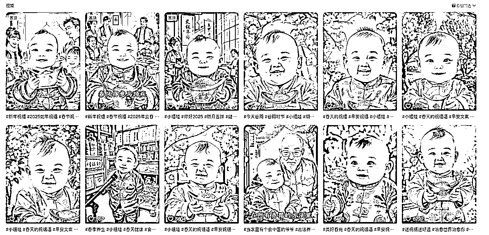

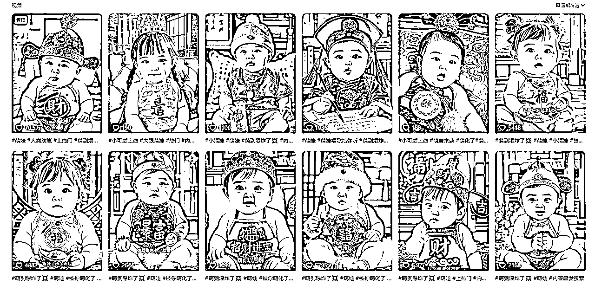

## 项目拆解

1.  内容形式

*   AI萌娃对口型，配祝福类音频

1.  变现方式

*   创作者收益：视频号为例，点赞10w+的作品，单条收益在1500-3000左右

*   带货：账号权重足够高之后可以间歇发带货视频，以萌娃形象讲述养生事项，带养生食品或书籍

1.  项目现状

| 竞争度 | 起号率 | 制作难度 | 收益 | 推荐指数 |
| 中 | 高 | 低 | 中 | 4星 |

## 操作流程

1.  图片制作

*   截图对标视频的形象发给豆包，反推提示词

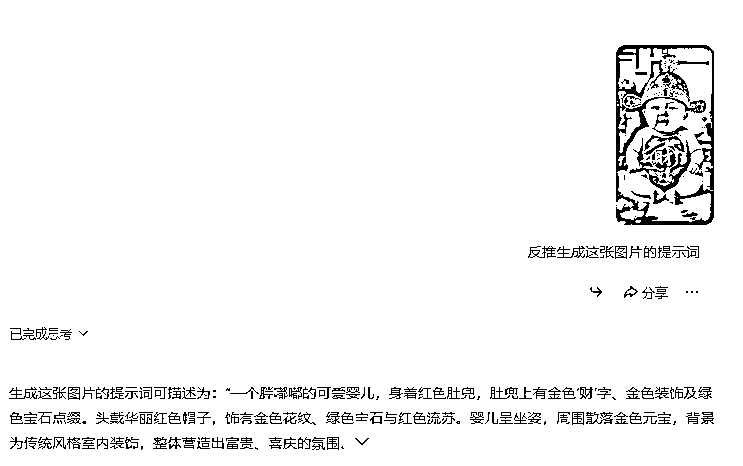

*   即梦上传提示词和参考图，生成萌娃图片，选择合适图片保存本地，小技巧，点击去画布编辑，然后右键保存为图片，可下载不带水印的图片

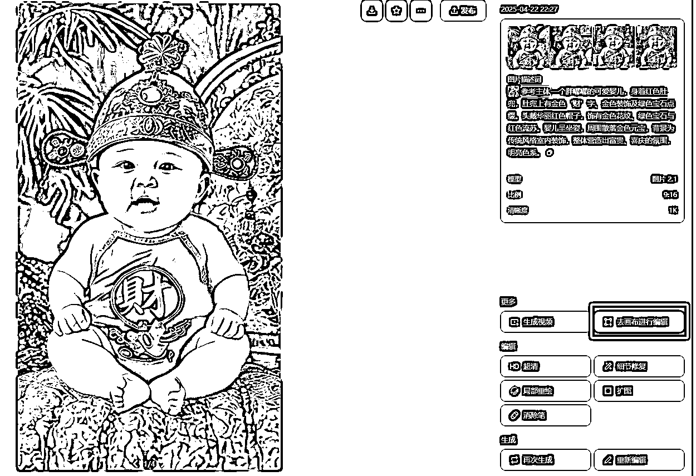

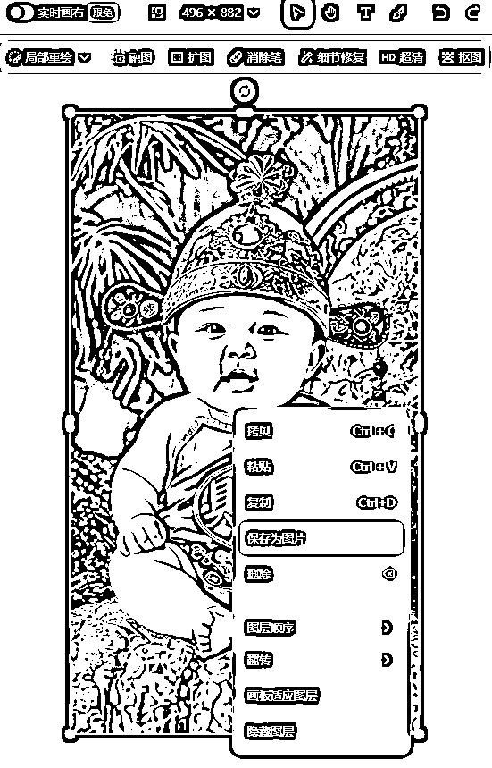

1.  对口型

*   将保存好的图片上传至即梦对口型，将对标视频保存到本地，提取音频，上传至即梦对口型，选择大师版，生成视频

*   嗯...演示视频排队29分钟....放一个之前生成的成片吧

1.  剪辑发布

*   生成的视频下载到本地，可以直接发布，也可添加到剪映进行加工，添加字幕，倍速等操作后发布

## 注意事项

*   这类视频爆率很高，核心在于形象和文案，尽量复刻爆款形象，文案的话，祝福类有一定违规概率，可以和治愈系文案混着发，也可以发“项目二”中的早安类文案，扩展性很强，各种文案用萌娃视角说出来都容易引起观看

*   即梦生成的视频用IDM下载，可以下载无水印版

# 项目二 早安祝福

## 案例

## 项目拆解

1.  内容形式

*   风景视频+早安祝福文案

1.  变现方式

*   创作者收益：每天发布2-3条视频，逢24节气和节假日很容易爆

*   带货：账号权重足够高之后，可以逢节气发带货视频，带养生食品或书籍

1.  项目现状

| 竞争度 | 起号率 | 制作难度 | 收益 | 推荐指数 |
| 中 | 中 | 中 | 中 | 3.5星 |

## 操作流程

1.  图片制作

*   在即梦搜索风景、柳树、喜鹊等，找合适的图片，点击去做同款

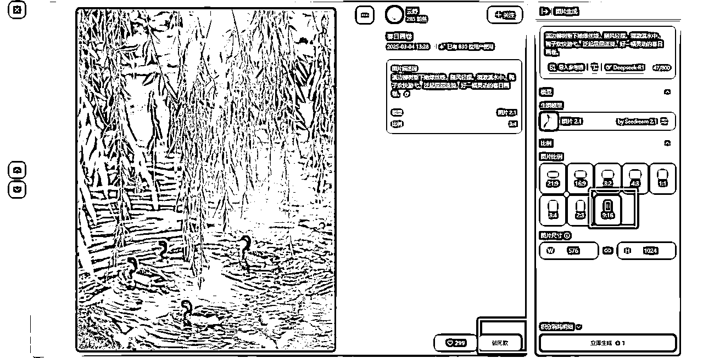

1.  视频制作

*   选择合适的图片，点击去生成视频，追求更好效果可以用S2.0pro。将生成的视频下载保存到本地

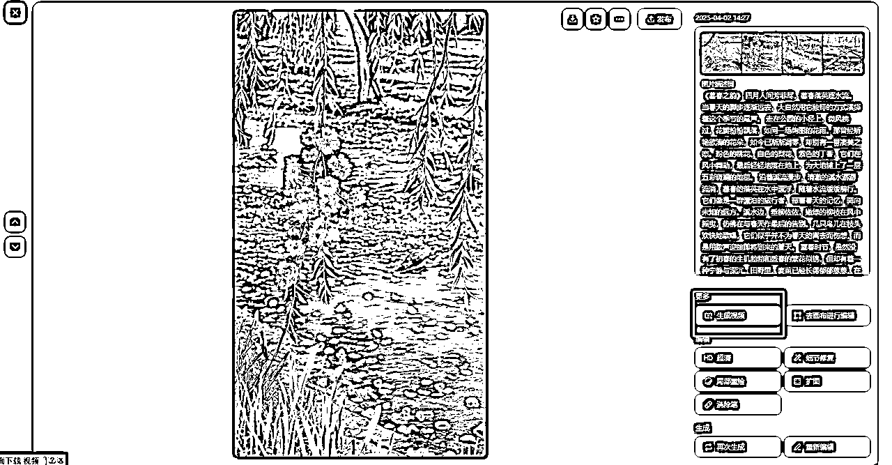

1.  剪辑发布

*   为了不浪费积分和减少排队时间，后续演示都用我以前生成的图片和视频操作

*   将下载好的视频导入到剪映，从提前准备好的文案库中，挑选合适的文案，修改日期后，添加到剪映文本中

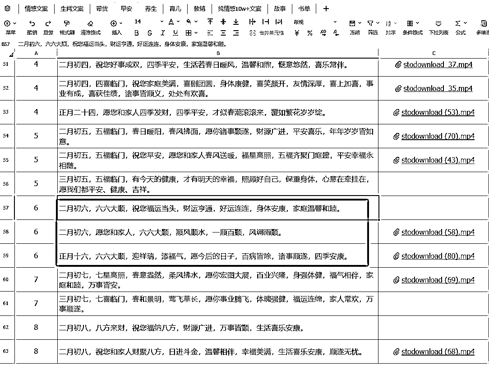

*   点击朗读，选择“心灵鸡汤”，生成配音

*   将下载好的素材添加到主轨，调整时长，添加配乐、字幕，导出发布即可

*   看成片

## 注意事项

*   市面上多数早安账号是情感类文案，竞争比较激烈，起号率低，不建议做

*   祝福类视频起号率中等，给一个提高起号率小技巧，在传统早安文案前加上生肖，如“属猴人，今天是4月23日，农历3月26，早安...”，能有效提高起号效率

*   关于文案，从广场上初一到初十扒一圈，然后扔个豆包，让它仿写就可以，遇到节气和节假日要专门出对应文案

# 项目三 育儿经

## 案例

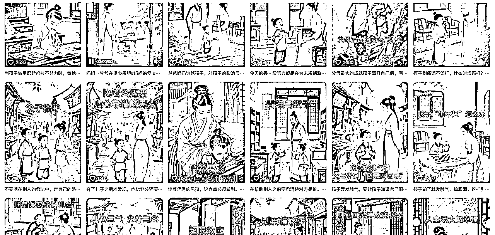

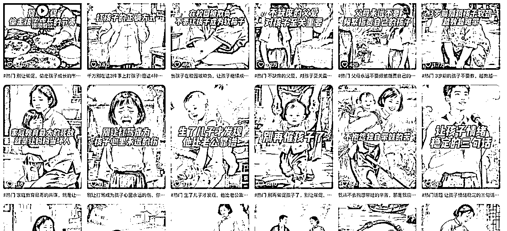

## 项目拆解

1.  内容形式

*   育儿知识+跟文案对应的古风水墨画视频

1.  变现方式

*   创作者收益：建议多账号运营

*   带货：账号权重足够高之后，视频可以挂车卖育儿类书籍、玩具、文具等

1.  项目现状

| 竞争度 | 起号率 | 制作难度 | 收益 | 推荐指数 |
| 高 | 低 | 高 | 高 | 3星 |

## 操作流程

1.  获取文案和配音

*   首先下载对标视频备用，然后将对标视频链接发给豆包，提取文案

1.  生成画面提示词

*   参考对标视频的图片特征，用豆包生成分镜提示词，有些提示词需要根据文案内容做调整

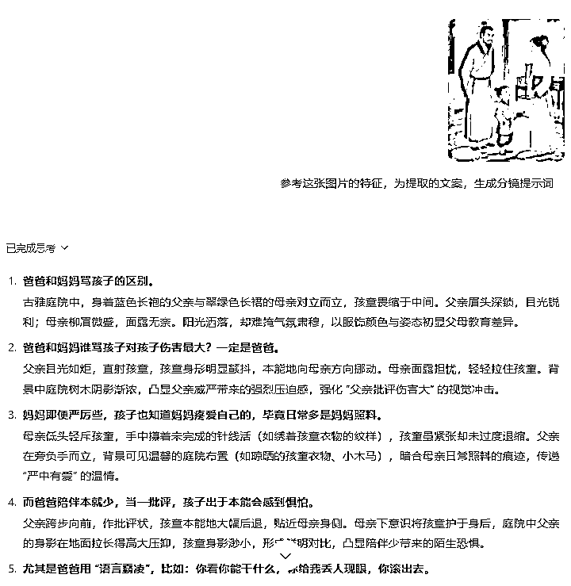

1.  生成图片

*   根据调整后的提示词，依次用即梦生成图片，选择图片2.0pro，挑选合适的图片选择超清。

1.  生成视频

*   再用即梦依次将保存的图片，生成视频，提示词按照文案内容填写，也可以用豆包生成后调整

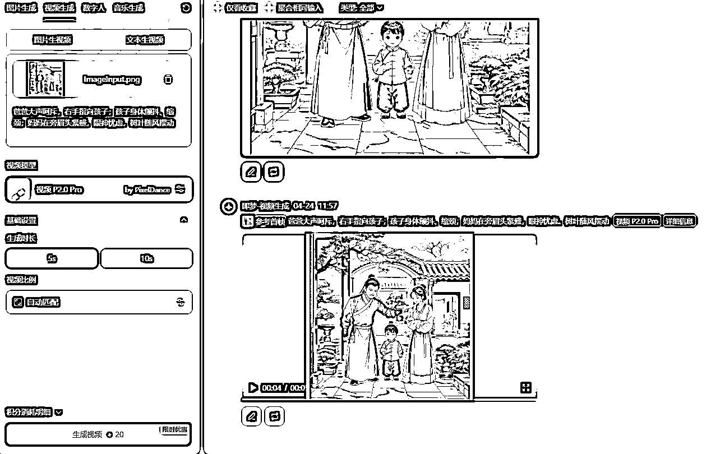

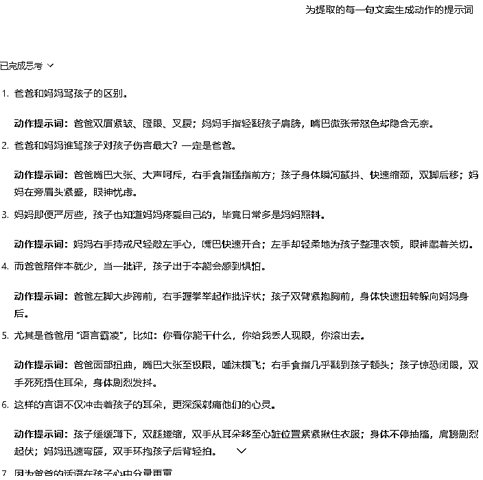

1.  剪辑发布

*   将生成的视频导入剪映，按顺序排列，调整画面时长，匹配音频，添加标题和字幕，导出上传

*   成片

## 注意事项

*   这个模式如果想保持人物一致性，难度会飙升，前期制作只要画面内容和文案内容匹配即可，主要是靠文案和堆量爆的，画面不违和就行

*   配音的话可以用配音软件或者剪映朗读，新手的话先用对标视频的原声，后期还是要自己搞文案和配音

# 项目四 英语启蒙

## 案例

## 项目拆解

1.  内容形式

*   卡通画面+儿童英语知识配音

1.  变现方式

*   带货：视频挂车卖英语书籍、课程、文具等

1.  项目现状

| 竞争度 | 起号率 | 制作难度 | 收益 | 推荐指数 |
| 高 | 低 | 低 | 中 | 3星 |

## 操作流程

1.  生成文案

*   用豆包生成文案，提示词如下

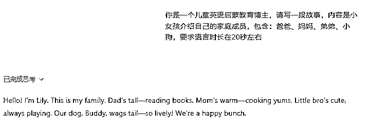

1.  生成图片

*   用豆包生成分镜提示词，然后去即梦生成图片

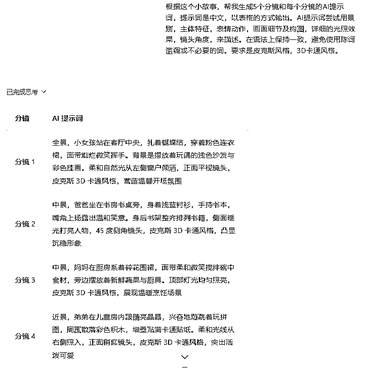

1.  生成视频

*   选择合适的图片，依次点击生成视频，保存到本地，因为这类视频不需要很高的精准度，所以使用S2.0模型即可

1.  生成配音

*   将文案添加到剪映文本，选择合适音色进行朗读

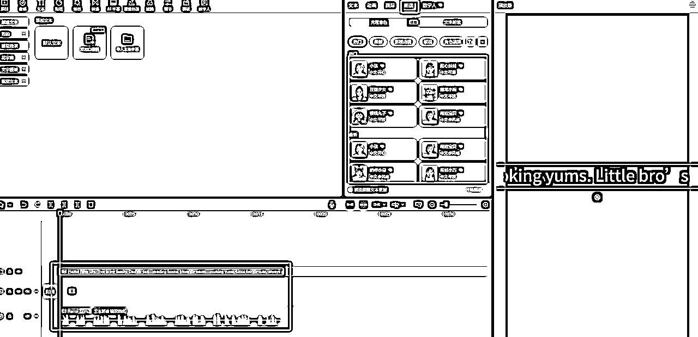

1.  合成视频、发布

*   将保存的视频添加到剪映，对齐文案位置，与音频时长统一，添加字幕和标题，导出

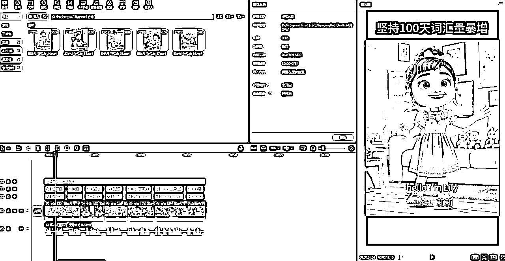

*   成片

## 注意事项

*   这个模式操作简单，变现路径明确，但是竞争非常激烈，需要做出差异化或者堆量

# 项目五 治愈奶奶

## 案例

## 项目拆解

1.  内容形式

*   可爱的卡通形象老奶奶或老爷爷+治愈系文案+背景音乐

1.  变现方式

*   创作者收益：增加收益小技巧，最后一张图片引导观众评论，如：留下你的故事

*   带货：目前以挂车带货书籍比较多，延展性带货养生食品类也可以，需搭配文案

1.  项目现状

| 竞争度 | 起号率 | 难度 | 收益 | 推荐指数 |
| 高 | 低 | 低 | 低 | 2星 |

## 操作流程

1.  生成文案

*   新手建议先扒对标账号的爆款文案或者热门情感文案，等有经验了，可用豆包生成原创文案

*   在豆包智能体里面有很多治愈系老奶奶，可以生成文案，也可以生成提示词。有些不太好用自行筛选

1.  生成图片

*   拿着生成的文案，去即梦，搜治愈系老奶奶，选择喜欢的模板，生成同款，把文案改成自己想要的，依次生成图片

1.  合成视频

*   将保存的图片添加到剪映，合成视频，注意跟背景音乐卡点，添加转场动画等，导出发布

*   成片

## 注意事项

*   目前这个模式同行很多，多数账号爆一条两条就不爆了，主要是因为内容同质化，尽量做差异化内容，比如反治愈：一定要牢记，别随便对人掏心掏肺，不是每个人都会真心待你，别对任何人过于亲近，不是每个人都像你这般善良

*   还可以延伸其他类型，比如结合最近很火的养生操

# 项目六 怀旧乡村

## 案例

## 项目拆解

1.  内容形式

*   乡村怀旧类画面+舒缓音乐

1.  变现方式

*   创作者收益：收益不稳定，需多做差异化内容，并引导观众评论

*   带货：可挂车带怀旧类视频、玩具等

1.  项目现状

| 竞争度 | 起号率 | 难度 | 收益 | 推荐指数 |
| 高 | 中 | 低 | 低 | 2.5星 |

## 操作流程

1.  生成提示词

*   依然是交给我们的老朋友豆包

1.  生成图片

*   拿着提示词去即梦生成图片，前面加上高清实拍、高饱和度等词汇

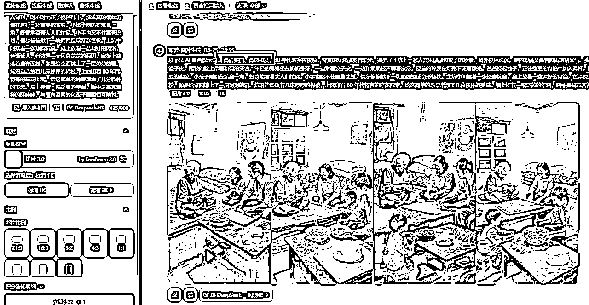

1.  生成视频

*   选择合适的视频，点击超清，然后生成视频，输入想要的动作提示词，不会写的，依然找老朋友豆包

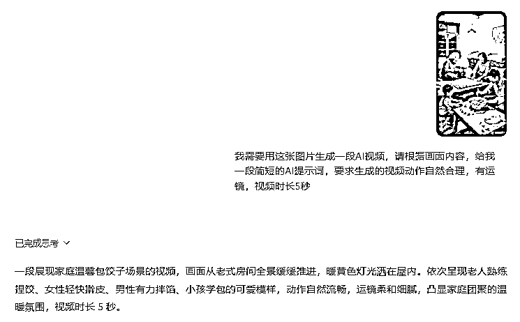

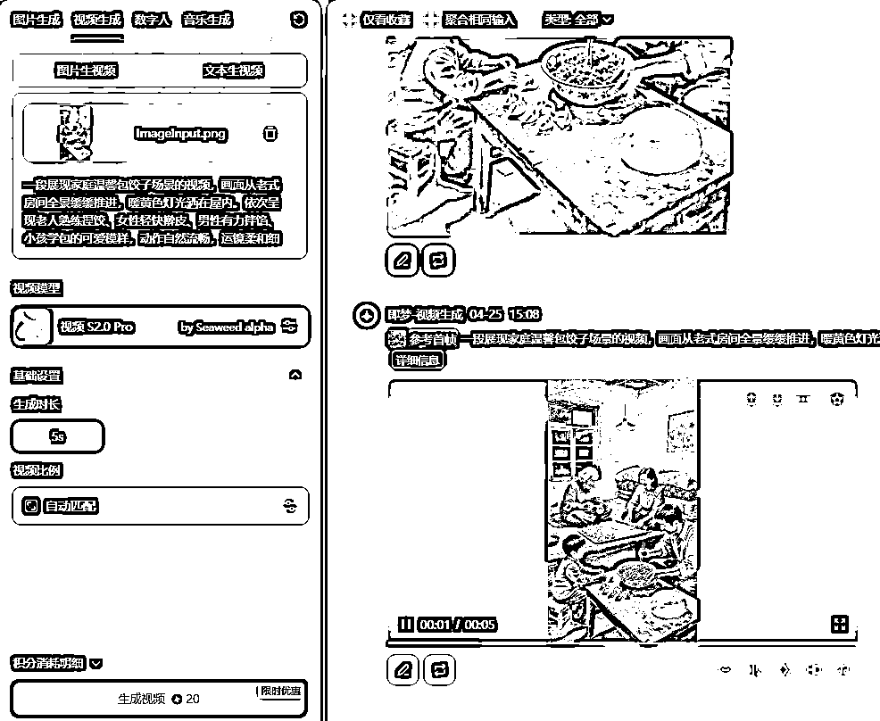

1.  剪辑发布

*   将生成的视频导入剪映，添加背景音乐，调整倍速等，导出发布

*   成片

## 注意事项

*   目前这类账号最大的问题是同质化很严重，怀旧风的扩展性不强，可以往治愈系上扩展

# 项目七 墙绘女孩

## 案例

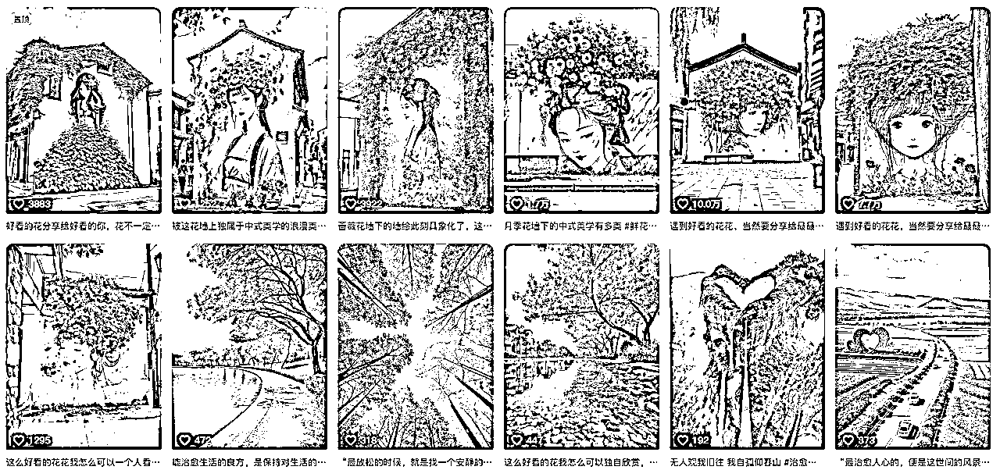

## 项目拆解

1.  内容形式

*   墙绘女孩+鲜花头发

1.  变现方式

*   创作者收益、线下实体墙绘引流、AI绘画教学

1.  项目现状

| 竞争度 | 起号率 | 难度 | 收益 | 推荐指数 |
| 中 | 中 | 低 | 中 | 3星 |

## 操作流程

1.  生成提示词和图片

*   第一种方法，截图对标账号的画面，扔给豆包反推提示词；第二种方法，去即梦搜墙绘女孩，找模版做同款

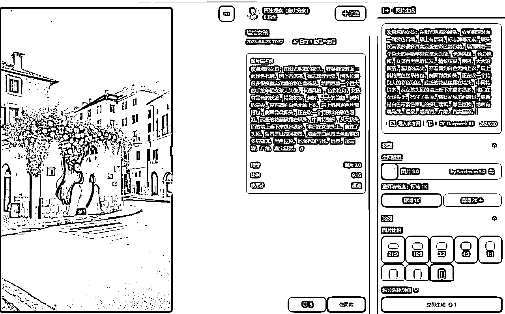

1.  生成视频

*   选择合适图片，点击超清、生成视频，提示词按照图片内容写，一般就是镜头推进，花朵随风摆动，花瓣散落等

1.  剪辑发布

*   将视频导入剪映，添加背景音乐、调节色彩、添加倒放增加时长，导出发布

*   成片

## 注意事项

*   最近刚跑起来的一种模式，已经有很多人在跟进了，流量都不错，这种绘画可延展的内容非常多，还是要注意做差异化

*   类似项目还有灵魂画手、热点手绘等

# 项目八 星座

## 案例

## 项目拆解

1.  内容形式

*   书单式开头+星座文案+风景素材

1.  变现方式

*   创作收益、带货、私域、教学

1.  项目现状

| 竞争度 | 起号率 | 难度 | 收益 | 推荐指数 |
| 中 | 高 | 中 | 中 | 3.5星 |

## 操作流程

1.  生成星座卡片

*   打开小红书，搜星座，找合适图片保存

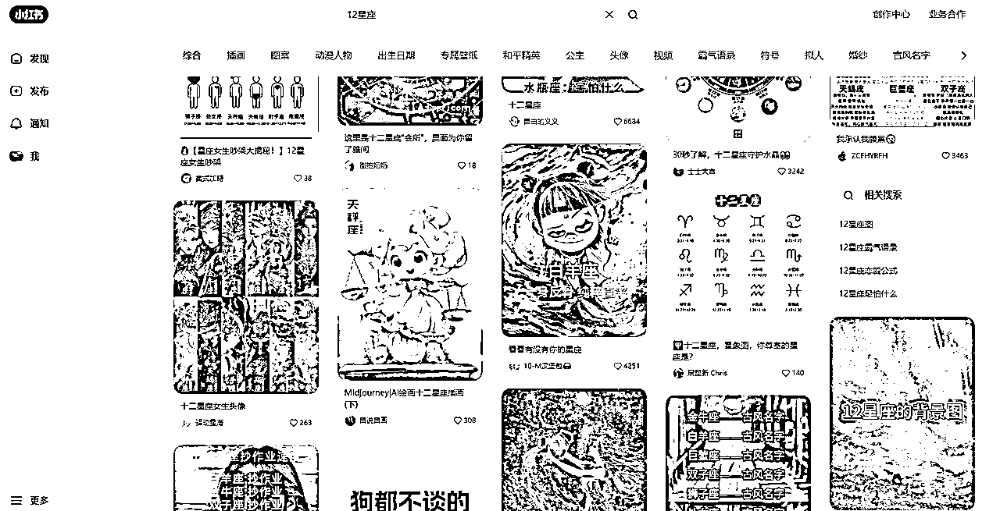

1.  生成风景图片和视频

*   打开即梦，搜索风景和情感图片，选择合适图片，做同款

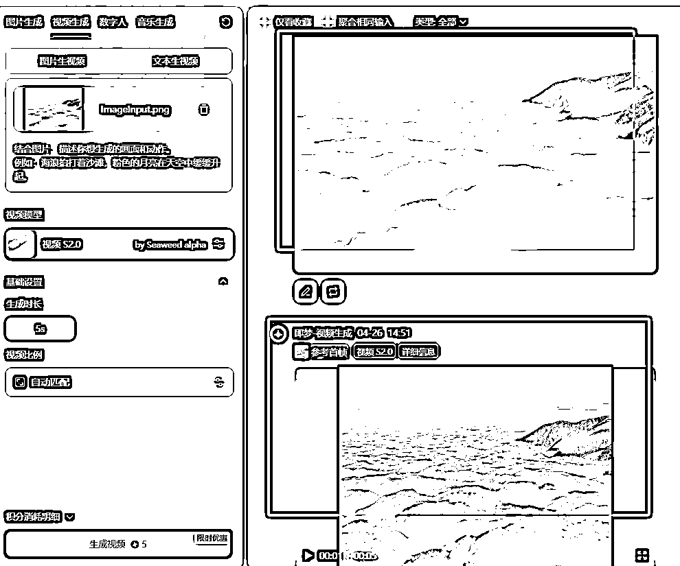

1.  生成星座文案和配音

*   用豆包仿写对标视频的文案，拿着写好的文案去配音软件选择合适声音，生成配音

1.  剪辑发布

*   将下载好的图片、视频、配音文件导入剪映

*   将背景图片放入主轨，星座图片缩小至30%依次排开，打成符合片段

*   给星座符合片段设置位置关键帧，实现滚动效果

*   将要讲解的星座图，放置在合适时间线处，设置位置和放大关键帧，实现突出效果

*   依次将其他情感和风景图片添加到主轨，添加边框特效

*   添加字幕，配音，音效等导出

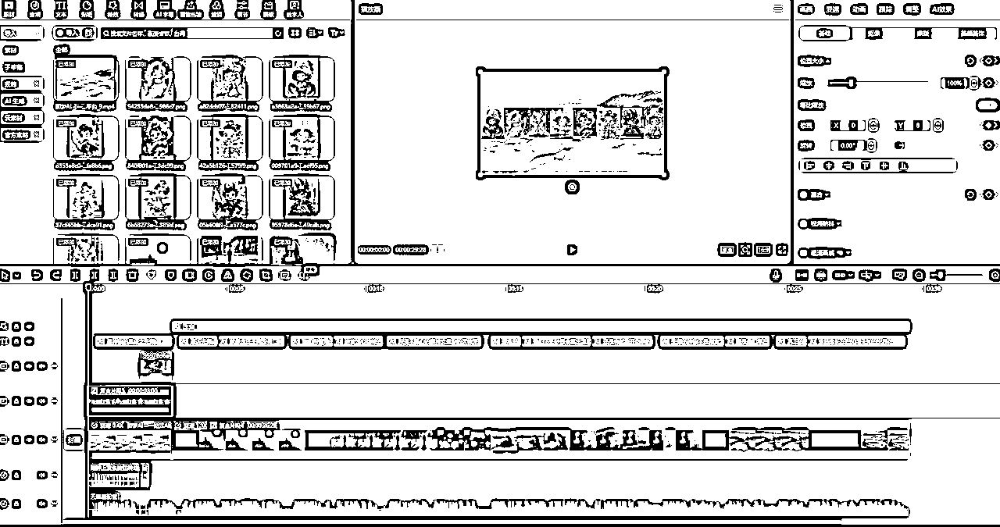

*   成片

## 注意事项

*   这种模式目前做的人不多，起号率比较高，适合抖音和小红书平台

# 项目九 古法养生

## 案例

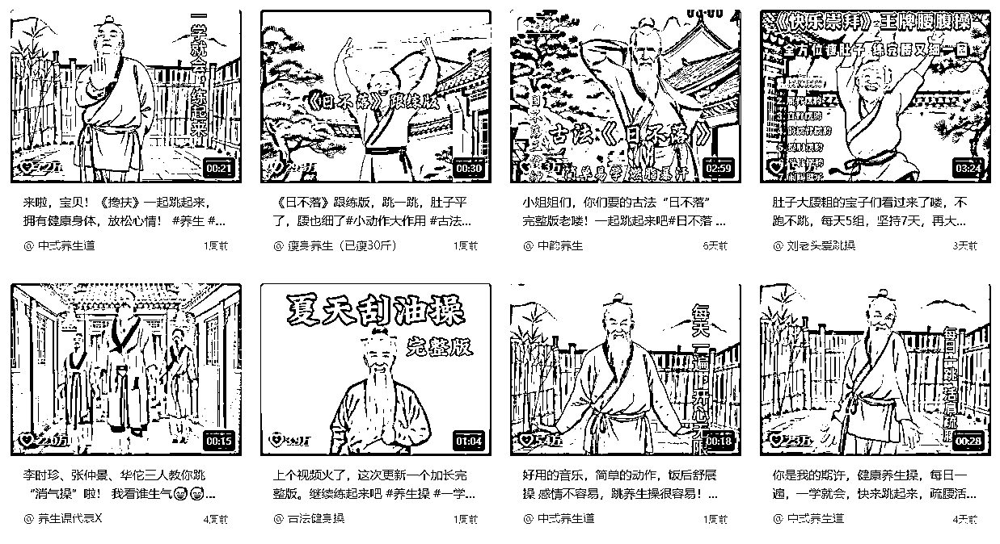

## 项目拆解

1.  内容形式

*   古人形象+跳健身操

1.  变现方式

*   创作收益、带货、卖课、减肥等

1.  项目现状

| 竞争度 | 起号率 | 难度 | 收益 | 推荐指数 |
| 高 | 低 | 低 | 中 | 3星 |

## 操作流程

1.  生成古人图片

*   去即梦搜古人健身操，选择中意的图片，做同款

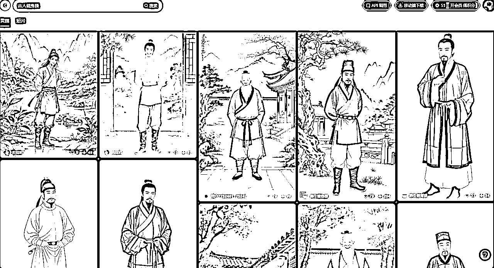

1.  下载对标视频

*   抖音搜索，健身操视频，下载到本地

1.  生成动作模仿视频

*   将下载好的古人图片导入即梦--数字人--动作模仿，上传本地文件--对标视频，生成视频保存

1.  剪辑发布

*   直接发布或者，导入剪映，添加字幕标题等，导出发布

*   成片

## 注意事项

*   目前这个模式非常卷，但是这个模式延展性很强，可以做古法养生、五音疗愈、食物养生等等，做出差异化有机会拿到结果

*   样式也可以变化，比如Q版、萌娃版、小动物版

# 项目十 睡前故事儿童绘本

## 案例

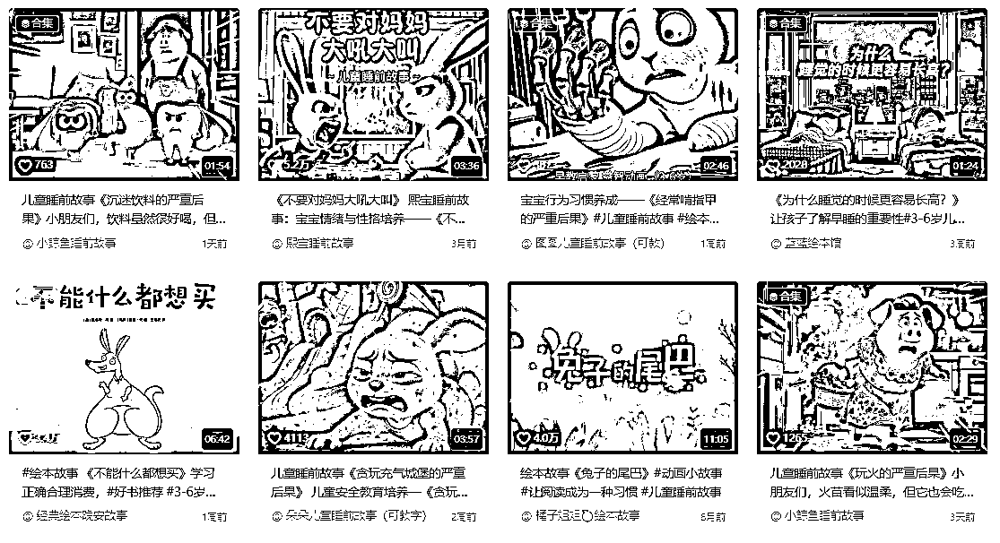

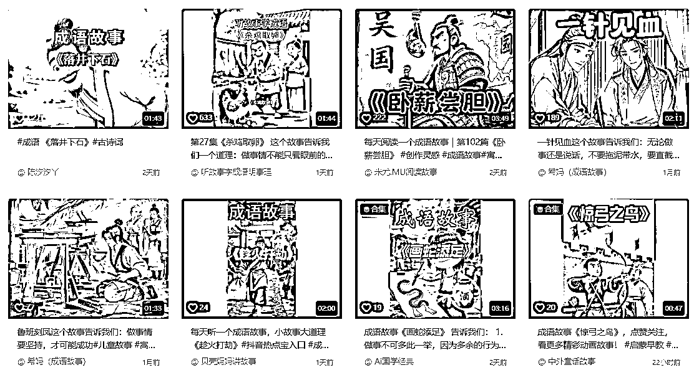

## 项目拆解

1.  内容形式

*   3D插画+故事配音

1.  变现方式

*   创作收益、带货儿童书籍等

1.  项目现状

| 竞争度 | 起号率 | 难度 | 收益 | 推荐指数 |
| 高 | 低 | 低 | 中 | 1星 |

## 操作流程

1.  生成儿童故事

*   用豆包生成儿童启蒙故事，或者用爆款故事改写

1.  生成视频

*   用剪映的AI成片功能，一件生成视频，直接发布即可

*   成片

## 注意事项

*   这种模式现在很卷，起号率很低，可以用来练手，或者给自己家孩子做睡前故事

# 总结

*   上述所有项目的起号率，高中低的判断，有一定主观性，因为我们做有更丰富的经验，也能做更多的差异化，想要做的根据自己的情况酌情选择

*   不要一味模仿，前期可以抄，流程跑通之后一定要做差异化，别人用水墨风，你用卡通风；人家做古诗、你做文言文；人家做怀旧，你做养生等等，一味模仿没有出路的

*   所有项目，都可以用大量堆号来做，有想堆号的可以自行摸索，给大家看一个工作室目前堆号的现状，国风类短视频，图中每台机器都在自动批量产出

## 进阶项目

*   还有一些难度更大的项目，不在这个贴子里拆解了，放在下面，有感兴趣的可以自行研究

古文拆解

电影/历史人物独白

灵魂手绘

古人复活/独白

书单号

AI短剧

神话讲解