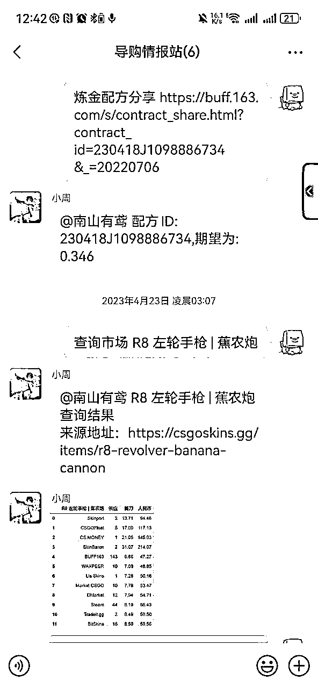
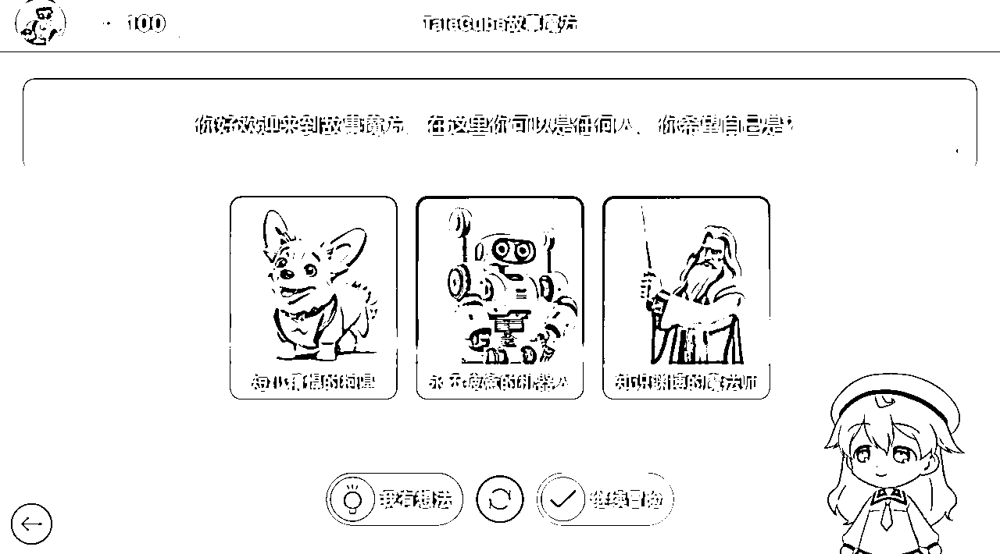
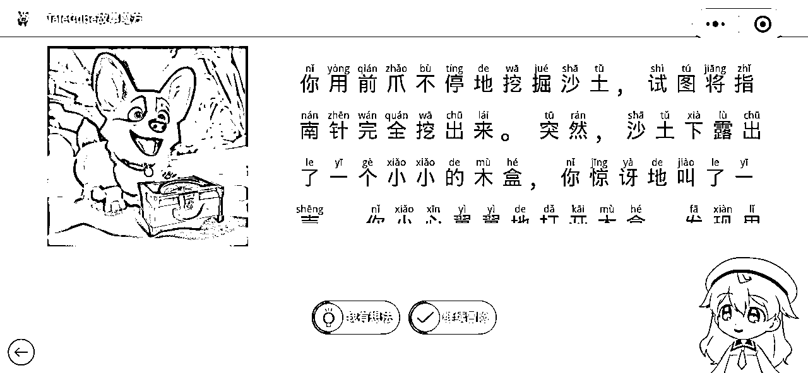
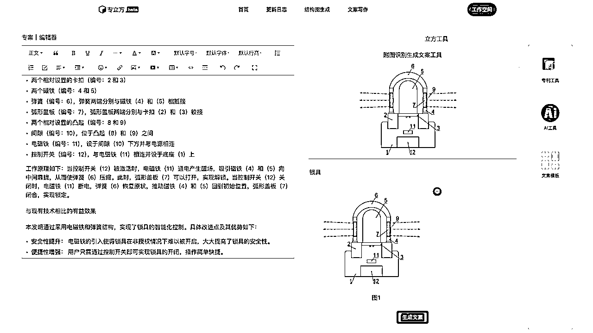
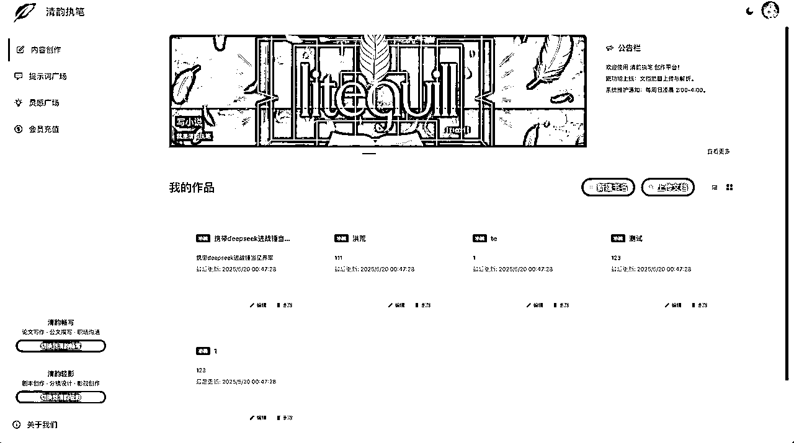
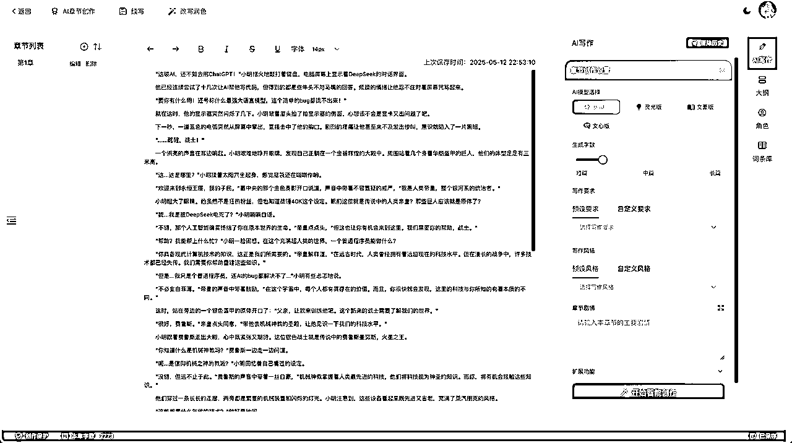

# 从零开始的AI开发铲子工具之路：一个程序员的4个月复盘

> 来源：[https://lag410zsdtc.feishu.cn/docx/QIRpdd7mFouylBxuayecvV9YnJg](https://lag410zsdtc.feishu.cn/docx/QIRpdd7mFouylBxuayecvV9YnJg)

# 一、背景介绍

大家好，我是cyrus，一个普通的程序员，今年418刚加入生财有术，从4月加入生财之前一直在做AI开发卖铲子，到现在还没有一款能拿得出手，经常会把平台做到无人问津的地步。

相比生财里那些动辄月入xx万的大佬，我的成绩简直惨绝人寰。作为执行力极高的人，遇到风口就会去开发工具（卖铲子），感觉正是经常开发飘忽不定的浅层且泛化的工具，总是在担心短期没收益，长期费时间。

对商业化一窍不通的纯技术人，我从一个成绩比较差的开发者分享一下过往的经历和经验，希望我失败和迷茫的经历（自认为）能够与圈友产生共鸣，引发奇妙的连锁反应以至于可以链接到大家。欢迎大家的指导和评论交流！

# 二、 过往开发过的产品（可跳过）

tips：该章节只是展示我过往的一些项目经历，但大多项目基本告吹，仅用于展示我卖铲子的决心

CSGO市场捡漏工具机器人（游戏饰品市场价格爬虫+游戏内合成玩法概率计算）

## 故事魔方

闯关式AI绘本创作与2D数字人讲解，将绘本与闯关游戏相结合，让小朋友也能创造出自己的作品

## 专立方

从其他专利参考图中使用AI搞创新，将图片中的专利结构使用AI进行重新想象

## AI魔镜复刻

这个玩法从国外一个视频中复刻而来，我们在线下搭建了一套类似的装置展出

## 写作平台：litequill

# 三、为什么选择AI+开发卖铲子？

刚加入生财那会，我完全不知道该做什么。每天刷生财精华贴，看到各种赛道，从AI创作看到跨境电商，从抖音带货到知识付费，眼花缭乱，基本上和我之前的状态差不多。

但深入了解后才发现，很多赛道对我这种技术人并不友好：要么需要投入大量资金，要么需要面对镜头（我是极度内向选手），要么需要很强的文案和营销能力。

我了解到AI其实非常早期，我的专业就是计算机专业，但是早期的学校只有前后端开发的课程（对我来说完成学业非常简单，但是我学习成绩比较差我自己擅长的也只有代码这一块，很多高级一些的技术并不在我的学校开放），做机器学习和深度学习（算是我感兴趣给自己开的小灶，自己在互联网找教程啃），刚GPT-2开始就有进行关注，直到Deepseek在国内火了起来（中间跨度有点长），我觉得这是个机会 - 程序员不就该在技术革命时卖铲子吗？而且我本身就有全栈开发能力，门槛相对较低。于是决定从AI创作切入，边学边做。

# 四、AI创作平台-从0到1：最艰难的起步阶段

让我们回归与写作平台本身的复盘

回顾这段时间的创业历程，我发现自己犯了典型的技术人思维错误。我以为只要产品做得好，用户自然会来，但现实给了我当头一棒。

前1月份-4月份主要在学习和试错：

*   研究了市面上流行的AI写作工具，分析它们的功能和商业模式

*   定义产品形态一款ALL-IN-ONE 级别的创作平台

*   搭建了第一个demo：AI网文写作助手（只有初步的网文写作功能）

当AI网文写作助手的demo完成后，我满怀期待地等待用户涌入，结果却是一片寂静。没有人知道我的产品，自然也就没有人来使用。这时我才意识到，产品开发只是创业的一小部分，找到用户、解决用户真正痛点才是核心。

我的小伙伴建议去直播，做直播切片，被我一一否定，我觉得直播的目标群体大多数是看小说，很少有作者来写，而且我一直将AI写作想成是一个简化作者写作的一个工具，读者并不是我们的目标客户。

我开始反思自己的产品定位。我一直认为AI写作工具是为了帮助作者提高效率，简化创作流程。但我忽略了一个关键问题：我真的了解网文作者吗？他们的痛点究竟是什么？他们真的需要AI来协助创作吗？

这会儿我正好加入了生财有术，成了圈友，就开始找AI写作的精华内容看。带着这些问题，我开始认真研究写作，看航海贴，加了好几个领航员，还花钱报了一些写作课。其实是我让女朋友去学的，最后她写了两篇短篇小说被签约了，但长篇小说她写不下去，就这样完成了课程，上架的短篇小说最后一分钱都没赚到。

难道写作的尽头是卖课吗？我不由的开始怀疑这个写作副业的真实性，因为我觉得卖课的盆满钵满，跟着学习的毫无成绩，当然有时候大家会晒出自己的成绩，卖出短篇小说，小红书收文等好像网文这个行业是一个非常好的副业，也许是我还没研究透彻，也可能是幸存者偏差，我开始迷茫起来，思考这个到底是不是一个好的生意。

# 五、参加生财圈友的线下组局尝试破局

在4月底的时候 杭州在举办一个2050活动，好多人都来了，大佬云集，各路神仙，刚好组了一个关于AI写作的线下局。

在局内我给圈友展示了我的平台和之前开发的业务，很多人都有合作意向，“兄弟，你这AI写作，现在有啥新功能啊？”，“嗯，目前主要是针对网文写作、短篇小说和长篇小说这块儿，效果还行。”，“现在都卷大模型了，你这应用场景还是有点窄啊。论文检测搞不搞？AI润色有没有？短视频脚本现在可是风口，不抓紧布局？”，“还有那个论文查重和润色，简直是学生党的福音啊！你想想，毕业季一到，那流量，哗哗的！”

我一听，确实，这些点子听起来都特别香，感觉抓住了就能起飞。

我组完局过后觉得，卧槽，说得太有道理了！

热血上头的结果就是，回来之后我就跟打了鸡血一样，拉着我们那个小小的技术团队，吭哧吭哧开始加功能。什么论文AI检测、文本润色、甚至还有短视频脚本的自动生成，能想到的都给排上了期。五一那段时间，天天熬夜，就盼着新功能上线能惊艳所有人。

但现实很快就给我泼了盆冷水。新功能倒是陆续开发出来了，可实际用起来，怎么说呢？就特别一言难尽。

比如那个论文AI检测，本以为是刚需，结果用户反馈说，检测结果有时候还不如某些免费工具准，而且界面提示也不够清晰，用起来费劲。再说那个文本润色，听起来高大上吧？实际上，要么润色得驴唇不对马嘴，要么就是改了跟没改一样，用户试用一下就跑了。

一来二去，这些新功能就成了“鸡肋”——食之无味，弃之可惜。投入了那么多时间和精力，结果用户不买账，活跃度也没上来，反而因为功能复杂，bug不断

为什么会这样？我也反思过，可能有两个主要原因：

1.  需求理解偏差，缺乏深度调研。 当时在线下局里听到的那些需求，更多的是一种“我觉得你需要”，而不是用户真正的痛点。我们没有沉下心去细致调研用户到底在什么场景下需要这些功能，需要什么样的效果，就盲目上了。有点像看到别人家餐厅生意好，就赶紧把人家的招牌菜都搬过来，结果发现自家厨子根本做不出那个味儿。

1.  技术与应用的脱节，对AI能力的边界认识不清。 AI写作确实很火，但现阶段的AI并非万能。很多我们想当然以为AI能轻松搞定的事情，比如深度理解语义进行完美润色，或者创作出富有创意和情感的短视频脚本，其实技术上还有很长的路要走。我们可能过于乐观，把AI当成了阿拉丁神灯，以为许个愿就能实现。

也是在这些功能反响平平之后，我才后知后觉地意识到，自己可能真的比较缺乏总结能力。圈友们给的建议，听起来都很有道理，我也都记下来了，但怎么把这些零散的点子，结合自己平台的实际情况，提炼出真正有价值、能落地的东西，我好像一直没掌握到要领。就像一堆散落的珍珠，我没能用一根合适的线把它们串起来，形成一条漂亮的项链。

每次看到用户吐槽，或者后台数据不理想，我都会想，是不是我当初在理解需求的时候就跑偏了？是不是我对功能的定义本身就有问题？这种感觉挺挫败的，好像一直在用蛮力，却没打在点子上。这种缺乏总结和提炼的能力，可能才是我在产品迭代上屡屡碰壁的根源。

这些弯路走下来，真是应了那句话，很多道理，听过一百遍，不如自己摔一跤来得深刻。现在回想起来，那些“高大上”的功能规划，可能从一开始就有点空中楼阁了。

# 六、一些其他的思考

其实，决定把这个平台当成一个长期项目来经营，心里就已经做好了打持久战的准备。短期内它能不能给我带来直接的经济回报，说实话，我看得比较淡。可能也是因为之前尝试过一些赚快钱的模式，比如我之前提过的爬虫的经历或者接外包的程序开发，那种感觉就像是用时间和精力去换固定数额的钱，天花板很明显，而且很容易让人陷入一种“忙忙碌碌却不知道为了什么”的怪圈。不是说那样不好，只是我越来越觉得，那种模式可能不太适合我现阶段的追求。我更想尝试去搭建一个能持续产生价值的“东西”，哪怕这个“东西”一开始看起来很不起眼，成长得也很慢。

但话说回来，虽然嘴上说着“不在意短期收益”，好像显得挺洒脱，但内心的焦虑感却是一点儿也没少，甚至有时候，这种焦虑比单纯追求短期目标时来得更猛烈、更复杂。这种感觉挺微妙的，就好像你站在一条很长很长的跑道起点，你知道终点可能风景独好，但路途遥远，中间会有无数个岔路口和未知数。

焦虑的第一个点，大概就是对“长期”这个时间维度的不确定性。一年算长期吗？三年、五年，还是更久？如果我投入了大量的时间和精力，几年之后发现方向错了，或者市场环境变了，那时候的沉没成本，无论是时间还是机会，可能远比损失一些钱更让人难以接受。毕竟，钱亏了或许还能再赚，但时间过去了就是真的过去了。这种对未知的恐惧，以及对可能付诸东流的努力的担忧，是实实在在的。

第二个焦虑的点，源于对“价值”的定义和衡量。如果我不把短期收益作为主要目标，那我追求的到底是什么？是用户数量的增长？是功能深度的积累？还是某种平台品牌的建立？这些目标听起来都挺好，但它们不像金钱那样有明确的衡量标准。今天我觉得功能质量提升了是价值，明天可能又觉得用户增加了才是价值。这种标准上的摇摆不定，很容易让人在过程中迷失方向，或者因为看不到“显性”的成果而自我怀疑。我到底在为什么而努力？这个问题的答案如果不够清晰，焦虑感就会像影子一样跟着你。

还有一个点，就是机会成本的考量。选择把主要精力放在这个长期项目上，就意味着我可能要放弃其他一些看起来回报更快、更直接的机会。有时候看到别人在别的赛道上短期内就取得了不错的成绩，心里也不是没有过动摇。会忍不住想，我是不是选了一条更难走的路？我的坚持到底值不值得？这种比较，哪怕知道不理性，也还是会时不时地冒出来，带来一阵焦虑。

可能跟我之前提到的“打造自己的产品或系统”的想法有关。当我把目标设定得比较大，希望能做一个不仅仅是“出卖时间和体力”的东西时，无形中也给自己增加了难度和压力。打造一个“系统”，意味着需要考虑的层面更多，从内容定位、用户体验到后续的运营维护，每一个环节都需要细致打磨。这个过程不像接一个单子，完成了就结束了，它是一个持续迭代、不断优化的过程，需要投入的心力自然也更大。而我是否具备足够的能力和韧性去支撑这样一个相对复杂的系统，这也是我焦虑的一个方面。我怕自己眼高手低，想法很好，但执行力跟不上。

所以，虽然决定了要长期投入，也尽量不去想那些短期能带来多少回报的事情，但这种源于对未来不确定性、对自我能力怀疑、对机会成本的权衡所产生的焦虑，几乎是伴随性的。它不像那种为了明天能不能赚到钱的焦虑那么直接，但却更深沉，也更磨人。可能这就是选择一条更看重长期价值的路，所必须承受的代价之一吧。这种焦虑感，也时刻提醒着我，需要不断思考和调整，确保自己没有偏离最初设定的航向太远，也确保自己在这个过程中，是真的在积累和成长，而不是单纯地消耗时间。这些思考，其实也是一种自我对话和梳理，希望能让自己在未来的路上走得更坚定一些。