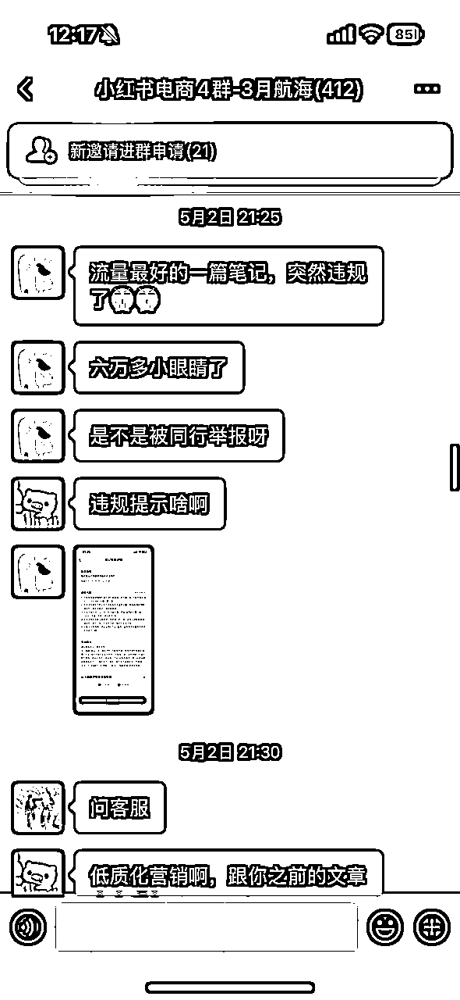

# 第一次航海，第二周出单，2个月赚回门票钱，生财新人参与「小红书电商」航海的经验分享

> 来源：[https://jcnij8knaobf.feishu.cn/docx/XZjYdnKJ3oJfPAxYQjtctX8Wnhz](https://jcnij8knaobf.feishu.cn/docx/XZjYdnKJ3oJfPAxYQjtctX8Wnhz)

大家好，我是薇薇，是一名刚刚裸辞的教师，25年2月底加入生财。

之前作为一名老师，在一所民办中学工作了十年，其中中层管理岗8年，曾担任过某全国教育协会的全国会议的总负责人，策划并落地导演万人音乐晚会，策划过100多场大型活动。

现在裸辞寻找互联网新机会，希望能通过生财让自己跳出原来的圈子，结识新的朋友，转向新的行业。 在之前的高压、高强度工作经验的积累下，自认为执行力还不错。

小红书电商航海是我加入生财参与的第一次航海，第二周出单，没想到幸福来得快，一个月就爆单了，爆单后最高一天卖出200多单（忘记截图），目前GMV约5W。作为生财的新人，能够在短期内拿到正反馈，再一次让我相信自己，相信生财，相信别人能做到的，我也一定能做到！

这次分享是受到生财澄歌的邀请，希望我分享一些经验给大家，虽然拿到了小小结果，我觉得自己在小红书电商上还属于新人小白，爆单有运气的成分在其中，但是确实也有很多可以分享给大家的，无论是心态上还是实操上还有那些踩过的坑上。。。

一、心态上不内耗，保持相信+坚持

我一直觉得无论做什么，心态好一定是前提。所以大家一定要学会关注自己的心态，调整自己的心态。关于心态的具体方面，大家可以看我上一篇分享的文章

我是裸辞后开始加入生财的，迷茫、焦虑、不自信、无助的感觉时常伴随着我。回想裸辞后加入生财的时光，迷茫焦虑、自我怀疑的情绪曾如影随形。那时的我对航海项目满怀期待，就像找到了前行的组织 —— 既有经验者引领方向，又能与同行者抱团取暖。我清楚地知道，开启新项目必然会遭遇重重挑战，于是提前做好了充分的心理预设：每当困难出现，便专注于解决问题本身，而非陷入情绪内耗。

无论项目大小、能力强弱，大家在探索新事物时产生迷茫无助感都是常态。当我们意识到这种情绪具有普遍性，就能坦然接纳自己的状态，避免过度焦虑，从而将注意力聚焦到正确的事情上。

我们要始终保持信念感：相信项目是能赚钱的，相信自己具备成功的能力。生财圈友们分享的众多成功案例，时刻在传递着这样的信号：既然他人能够达成目标，我为何不可？只要我们坚守在正确的道路上，运用恰当的方法持续深耕，理想的结果必然会随着时间推移逐渐显现 —— 这只是一个等待量变积累到质变的过程。

二、如何充分用好航海？手册（理论）学习与实操并进，勤问教练问题

1、认真看手册，手册很详细。看一遍肯定是不够的，要反复看，尤其是一些重要的章节。像选品这种章节，我反复看过不低于10次。

2、手册学习与实践并肩而行。建议大家学完每个知识点，都同步实操，而不是学完一堆知识后再去实操，因为你在学习手册的时候，有的内容你看起来很简单，但是其实实操起来你会遇到一些你想不到的问题。这个方法就像我们以前在学校学习数学，老师一般会先教一个公式，然后再示范一道题目让大家加深对公式的理解，再出几道题目让大家加深印象，最后还会留课后作业让大家再一次巩固知识。那么我们学习小红书电商的过程也是一样的，每一个知识点，你学习后都应该用实操来理解知识、将知识内化于心。

3、勤问教练问题。大家在实操的过程中一定会遇到非常多的问题，不要不敢在群里提问，不要担心自己的问题会不会太简单。我只要是有疑问都会在群里问，算是群里问问题最多的那个。这种随时有人能指导的感觉真的太幸福了。航海结束后，我遇到了各种问题，都只能自己去查资料、或者问官方客服，官方客服大家体验过的都懂（非常耗时间，且基本上都不能解决问题）

三、实操中遇到的卡点和踩过的坑

先说说我在实操中遇到的几个卡点：

1、首先是----选品，选品是实操中比较前面也是最重要的一个环节，许多伙伴（包括我自己）在此环节容易失误，根源在于思维惯性的影响：长期作为消费者的视角，让我们在切换至商家身份时，难以完全剥离主观偏好，即便手册中明确标注选品方法，仍可能因「自我视角」偏离框架。

我一开始选的品只看到销量高+符合自己审美，然后就跃跃欲试了。但是发出去的几篇笔记小眼睛为个位数。后来根据手册的方法调整，一定要重视数据分析，不仅要看销量，还要看销量是否为近期爆文产生的，还需要看看近一个月的评论有没有100+。最后我选到的这个品以上都符合，对标账号是实拍，而且我认为他的实拍很普通，我完全可以先模仿再尝试创新和超越。

要知道选品是后续所有工作的前提，如果初始方向错误，后续的努力可能都会成为“无用功”，更会因缺乏正反馈打击坚持的信心。因此，务必在选品阶段投入充足时间，严格遵循既定方法论执行，这是规避「无效努力」的关键前提！

2、标题+封面决定了你的浏览量，新手一开始一定要按照手册的方法像素级模仿对标的标题和封面。我是买回产品来实拍的，一开始我嫌弃对标账号拍的图很普通，相信自己可以拍出更好看的（艺术生对自己审美的自信），所以我也会发一些自己创新的封面，但是还真就没有对标封面的小眼睛多。虽然后续我自创的一些标题和封面也有数据不错了，但最后爆的那篇笔记仍然是模仿对标账号标题和封面的那一篇！

后来我复盘，为什么同一个标题和封面能够反复爆？市场验证过的一定是符合大众审美的，被大众认可的。我们不能以自己的主观审美去评判。也有可能这样经过市场验证的内容，平台也会表示认可，所以会给更多流量？不管什么原因，既然前人已经总结了经验，那我们就照做不会错。

再说说我踩过的坑，分享出来大家可以避免：

其实我爆单之后并不是特别顺利，踩了一些坑，原本可以给我带来更多收益的，因为这些坑让我收益减少了很多。后来我复盘这些踩的坑，发现还是学习没有到位。因为一开始没想到这么快能爆单，所以手册关于售后的问题学习得比较少，把心思都花在提高销量上了。下面几点提醒大家，希望能帮助大家不要踩我踩过的坑了：

1、提前找好2-3家厂家，一定不要觉得暂时只出几单还不急着找，爆单可能就是一两天的事，我就是遇上厂家缺货，导致发货不及时导致每单赔付3元，还违规。

2、发货后要及时关注物流情况，不是发货了就不管了，还要保证发货后24小时内要揽收，揽收完24小时内要揽运。

3、要专注商品的品质！我是因为厂家缺货，急忙找了个厂家，想着品质应该不会差到哪去。没想到品质差远了，导致很多售后，一是每天很多客服消息耽误了你很多时间，二是品质负反馈导致违规影响到了流量。

四、持续学习，让运气的成分减少，让能力打败运气

我感觉无论是电商也好，生财的其他项目也好，其实也算是一门技术活，没什么玄乎的。不断学习，不断实操，不断总结经验，不断迭代优化。每掌握一个新知识就立刻用到实操里，每解决一个问题就认真总结经验，像打游戏升级一样不断优化自己的操作。你会发现，当你把每个知识点都吃透练熟，成功的概率就像滚雪球一样越来越大，这时候能力就慢慢跑赢运气啦～

航海结束之后，我并没有终止学习，一是后续操作中遇到了很多问题，倒逼我去学习。二是我认为还有很多内容我并没有学习到位。最近看到新一期航海重点聚焦实拍和长期主义，特别有感触 —— 平台规则就像天气一样不断变化，咱们的玩法也得跟着实时调整，只有持续学习才能一直踩在正确的节奏上，这也正是生财始终用心的地方～

对生财新人的建议：

1、如果你想快速拿到正反馈，我觉得小红书电商是不错的选择。如果刚加入生财还在纠结参加什么项目，不妨尝试小红书电商航海。

2、无论你选择了什么项目，然选择了这条路，就请相信自己的眼光、相信生财的体系，把每一步都走扎实。暂时没结果没关系，只要坚持学习 + 实践的良性循环，该来的总会来～

3、好的心态和执行力一定是很重要的，我认为这是做成一件事的根本

4、生财的线下活动很值得参加，我只要时间不冲突，每次活动我都参加了。每次都有或多或少的收获。有的收获并不是当下就能见效的，但是某一天就能够用上。

也欢迎大家随时找我唠嗑，咱们互相支招、一起进步、一起生财有术~！